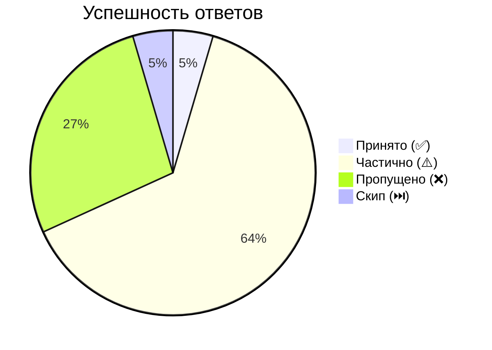

# 🏠 Главная

---
tags: [главная]
cssclasses: [wide-page]
---

# 🏠 Classic Machine Learning

> [!tip] Цель
> Локальная главная раздела classic ML: здесь живут карточки по классическому машинному обучению, метрикам, деревьям, линейным моделям и смежной математике.

---

## 📊 Прогресс

```dataview
TABLE WITHOUT ID
  length(rows) as "📚 Заметок",
  length(filter(rows, (r) => r.статус = "готово")) as "✅ Готово",
  length(filter(rows, (r) => r.статус = "черновик")) as "✏️ Черновик",
  length(filter(rows, (r) => r.сложность = "высокая")) as "🔴 Сложных"
FROM "Classic Machine Learning"
WHERE статус
  AND file.folder != "Classic Machine Learning"
  AND file.folder != "Classic Machine Learning/Шаблоны"
GROUP BY true
```

---

## 📋 Следующие в очереди

```dataview
TASK FROM "Classic Machine Learning/Банк вопросов"
WHERE !completed
LIMIT 8
```

---

## 🧭 Навигация

> [!abstract] Ключевые файлы
> [[🏠 База знаний]] — общая главная всего vault
> [[🗺️ Индекс]] — все заметки по разделам с фильтрацией по сложности и статусу
> [[Банк вопросов]] — полная очередь вопросов с прогрессом
> [[🔎 На ревью]] — заметки, которые стоит дополнять и перепроверять
> [[🧩 Карта связей]] — зависимости между темами и полезные сравнения
> [[📚 Источники]] — где искать материалы для усиления карточек

---

## ⚠️ Требуют внимания

```dataview
TABLE WITHOUT ID file.link as "Заметка", file.folder as "Раздел", статус
FROM "Classic Machine Learning"
WHERE (статус = "черновик" OR статус = "требует доработки")
  AND file.folder != "Classic Machine Learning"
  AND file.folder != "Classic Machine Learning/Шаблоны"
SORT file.folder ASC
```

## 🔴 Сложные темы — повторить перед собесом

```dataview
TABLE WITHOUT ID file.link as "Заметка", file.folder as "Раздел", статус
FROM "Classic Machine Learning"
WHERE сложность = "высокая"
  AND file.folder != "Classic Machine Learning"
  AND file.folder != "Classic Machine Learning/Шаблоны"
SORT file.folder ASC
```


# 📅 По дате

---
tags: [навигация, хронология]
cssclasses: [wide-page]
---

# 📅 Classic Machine Learning — по дате

> Хронологический обзор карточек в разделе Classic Machine Learning.

```dataview
TABLE WITHOUT ID
  link(file.path, file.name) as "Заметка",
  создано as "Дата",
  сложность as "Сложность",
  статус as "Статус"
FROM "Classic Machine Learning"
WHERE создано != null
  AND file.folder != "Classic Machine Learning"
  AND file.folder != "Classic Machine Learning/Шаблоны"
SORT создано DESC, file.name ASC
```

---

## Сводка по датам

```dataview
TABLE WITHOUT ID
  создано as "Дата",
  length(rows) as "Кол-во заметок",
  join(map(rows, (r) => link(r.file.path, r.file.name)), ", ") as "Заметки"
FROM "Classic Machine Learning"
WHERE создано != null
  AND file.folder != "Classic Machine Learning"
  AND file.folder != "Classic Machine Learning/Шаблоны"
GROUP BY создано
SORT создано DESC
```


## 📈 Дашборд

---
updated: 2026-04-27
total_sessions: 5
total_questions: 22
avg_score: 2.19
---

# 📊 Аналитика собеседований

## ⏱️ Общие показатели
- **Сессий:** 5 | **Вопросов:** 22
- **Средний балл:** 2.2/5 | **Среднее время на ответ:** 5:57

## 📈 Визуализация

### Распределение ответов


### 🚩 Топ слабых тем (балл)
- 🟥⬜⬜⬜⬜ **1.0** — [[Темы/PCA и t-SNE]]
- 🟥⬜⬜⬜⬜ **1.0** — [[Темы/Градиентный бустинг — основы и нормализация]]
- 🟥⬜⬜⬜⬜ **1.0** — [[Темы/Углублённые темы — математика и алгоритмы]]
- 🟥⬜⬜⬜⬜ **1.0** — [[Темы/Метрические методы (kNN)]]
- 🟥🟥⬜⬜⬜ **2.0** — [[Темы/Распределение Лапласа]]

## 🎯 Эффективность по типам

| Тип вопроса | Вопросов | Средний балл |
|-------------|----------|--------------|
| fact | 17 | 2.2/5 |

## 🏆 Эффективность по уровням

| Уровень | Вопросов | Средний балл |
|---------|----------|--------------|
| middle | 5 | 2.8/5 |
| junior | 3 | 2.3/5 |
| senior | 9 | 1.9/5 |

## 📚 Детально по темам

| Тема | Сессий | Вопросов | ⭐ Балл | Статус | Последняя сессия |
|------|--------|----------|---------|--------|-----------------|
| [[Темы/Логистическая регрессия]] | 1 | 2 | 3.5/5 | 🟡 | 27.04.2026 |
| [[Темы/Naive Bayes]] | 1 | 1 | 3.0/5 | 🟡 | 26.04.2026 |
| [[Темы/Isolation Forest]] | 1 | 2 | 3.0/5 | 🟡 | 26.04.2026 |
| [[Темы/Обработка пропусков]] | 1 | 1 | 3.0/5 | 🟡 | 26.04.2026 |
| [[Темы/Градиентный спуск]] | 1 | 1 | 3.0/5 | 🟡 | 26.04.2026 |
| [[Темы/Bagging vs Boosting]] | 1 | 2 | 2.5/5 | 🟡 | 26.04.2026 |
| [[Темы/Линейная модель]] | 2 | 3 | 2.3/5 | 🔴 | 27.04.2026 |
| [[Темы/Распределение Лапласа]] | 1 | 1 | 2.0/5 | 🔴 | 26.04.2026 |
| [[Темы/PCA и t-SNE]] | 1 | 2 | 1.0/5 | 🔴 | 26.04.2026 |
| [[Темы/Градиентный бустинг — основы и нормализация]] | 1 | 1 | 1.0/5 | 🔴 | 26.04.2026 |
| [[Темы/Углублённые темы — математика и алгоритмы]] | 1 | 1 | 1.0/5 | 🔴 | 26.04.2026 |
| [[Темы/Метрические методы (kNN)]] | 1 | 1 | 1.0/5 | 🔴 | 27.04.2026 |
| [[Темы/Grad-CAM]] | 1 | 1 | — | — | 26.04.2026 |
| [[Темы/class_weight — веса классов]] | 1 | 1 | — | — | 26.04.2026 |
| [[Темы/Разбиение узлов в дереве бустинга]] | 1 | 1 | — | — | 26.04.2026 |
| [[Темы/Валидация — разбивка выборки и переобучение]] | 1 | 1 | — | — | 26.04.2026 |

## 🔍 Слабые концепции

- линейность (1×)
- локальная структура (1×)
- глобальная структура (1×)
- максимизация дисперсии (1×)
- переобучение (1×)
- глубина деревьев (1×)
- variance bagging (1×)
- количество итераций (1×)

## 💡 Рекомендация следующей сессии

> Темы: [[Темы/Bagging vs Boosting]], [[Темы/Распределение Лапласа]], [[Темы/PCA и t-SNE]]


### Валидация — разбивка выборки и переобучение

---
topic: "Валидация — разбивка выборки и переобучение"
sessions: 1
questions: 1
avg_score: null
last_session: 2026-04-26
---

# Валидация — разбивка выборки и переобучение

## Статистика
- Сессий: **1** | Вопросов: **1** | Средний балл: **—** —
- Последняя сессия: 26.04.2026

## История

| Дата | Вопрос | Уровень | Балл | Время | Итог |
|------|--------|---------|------|-------|------|
| 26.04.2026 | Почему тестовую выборку нельзя использовать более … | junior | — | — | ⚠️ |


### Градиентный бустинг — основы и нормализация

---
topic: "Градиентный бустинг — основы и нормализация"
sessions: 1
questions: 1
avg_score: 1.00
last_session: 2026-04-26
---

# Градиентный бустинг — основы и нормализация

## Статистика
- Сессий: **1** | Вопросов: **1** | Средний балл: **1.0/5** 🔴
- Последняя сессия: 26.04.2026

## История

| Дата | Вопрос | Уровень | Балл | Время | Итог |
|------|--------|---------|------|-------|------|
| 26.04.2026 | Какая пара гиперпараметров здесь наиболее тесно св… | senior | 1/5 | — | ❌ |

## Часто пропускаемые аспекты

- Ответ отсутствует полностью (1×)
- Ключевая пара: n_estimators и learning_rate (eta) — обратно пропорциональны: меньший lr требует больше деревьев для той же точности (1×)
- Практическое правило: при уменьшении lr вдвое нужно примерно вдвое увеличить n_estimators (1×)
- Почему нельзя рассматривать независимо: малый lr + мало деревьев = недообучение; большой lr + много деревьев = переобучение и нестабильность (1×)


### Градиентный спуск

---
topic: "Градиентный спуск"
sessions: 1
questions: 1
avg_score: 3.00
last_session: 2026-04-26
---

# Градиентный спуск

## Статистика
- Сессий: **1** | Вопросов: **1** | Средний балл: **3.0/5** 🟡
- Последняя сессия: 26.04.2026 | 💡 Подсказок использовано: **1**

## История

| Дата | Вопрос | Уровень | Балл | Время | Итог |
|------|--------|---------|------|-------|------|
| 26.04.2026 | Для линейной регрессии с MSE существует аналитичес… | middle | 3/5 | 25:39 | ⚠️ |

## Часто пропускаемые аспекты

- Изначальная путаница в размерности матрицы X^T X (кандидат назвал 500x2M вместо 500x500) (1×)
- Незнание сложности инвертирования матрицы на момент запроса интервьюером (1×)
- Неуверенность в том, что градиентный спуск сходится к глобальному минимуму для выпуклой функции MSE (потребовалась наводка интервьюера) (1×)
- Отсутствие ответа на финальный вопрос о выборе между МНК и ГС при 10M объектов и 50 признаках (интервью прервалось) (1×)


### Линейная модель

---
topic: "Линейная модель"
sessions: 2
questions: 3
avg_score: 2.33
last_session: 2026-04-27
---

# Линейная модель

## Статистика
- Сессий: **2** | Вопросов: **3** | Средний балл: **2.3/5** 🔴
- Последняя сессия: 27.04.2026 | 💡 Подсказок использовано: **2**

## История

| Дата | Вопрос | Уровень | Балл | Время | Итог |
|------|--------|---------|------|-------|------|
| 27.04.2026 | Вы обучаете бинарный классификатор на линейной мод… | senior | 3/5 | 9:43 | ⚠️ |
| 27.04.2026 | Вы обучаете линейную модель градиентным спуском и … | senior | 3/5 | 9:39 | ⚠️ |
| 26.04.2026 | Как форма функции потерь влияет на устойчивость об… | senior | 1/5 | — | ❌ |

## Часто пропускаемые аспекты

- Вопрос не был задан/ответ не был дан из-за завершения транскрипта (1×)
- Не смог самостоятельно привести конкретный геометрический пример с классами в одном квадранте — потребовалась цепочка наводящих вопросов от интервьюера вплоть до готового примера (3,3) vs (1,1) (1×)
- Не назвал центрирование данных как способ компенсировать отсутствие bias без изменения архитектуры модели (доп.) (1×)
- Не смог объяснить механику divergence самостоятельно — понял только после серии наводящих вопросов про параболу и перелёт на другой склон (1×)
- Не смог сформулировать математическую форму градиента MSE и объяснить, почему выбросы в данных резко увеличивают его величину (интервьюер задал прямой вопрос — ответа не последовало) (1×)
- На вопрос о MSE vs MAE первоначально ответил 'честно, не знаю' — подключился только после подсказки про квадратичный штраф (1×)


### Логистическая регрессия

---
topic: "Логистическая регрессия"
sessions: 1
questions: 2
avg_score: 3.50
last_session: 2026-04-27
---

# Логистическая регрессия

## Статистика
- Сессий: **1** | Вопросов: **2** | Средний балл: **3.5/5** 🟡
- Последняя сессия: 27.04.2026

## История

| Дата | Вопрос | Уровень | Балл | Время | Итог |
|------|--------|---------|------|-------|------|
| 27.04.2026 | Логистическая регрессия предсказывает вероятность … | junior | 3/5 | 9:41 | ⚠️ |
| 27.04.2026 | Что в теме «Логистическая регрессия» является лине… | middle | 4/5 | 4:21 | ⚠️ |

## Часто пропускаемые аспекты

- Первоначально предложил максимизировать только Recall при асимметричных ошибках — некорректно: при пороге→0 Recall=1, но Precision→0, что обесценивает предсказания (1×)
- Не назвал cost matrix (матрицу стоимости ошибок) как формальный инструмент для явного учёта асимметрии FP/FN при выборе порога (доп.) (1×)
- Ошибся в знаменателе формулы сигмоиды: назвал '1 − e^{−x}' вместо '1 + e^{−x}' — исправил только после прямой подсказки интервьюера (1×)


### Метрические методы (kNN)

---
topic: "Метрические методы (kNN)"
sessions: 1
questions: 1
avg_score: 1.00
last_session: 2026-04-27
---

# Метрические методы (kNN)

## Статистика
- Сессий: **1** | Вопросов: **1** | Средний балл: **1.0/5** 🔴
- Последняя сессия: 27.04.2026

## История

| Дата | Вопрос | Уровень | Балл | Время | Итог |
|------|--------|---------|------|-------|------|
| 27.04.2026 | Как выбор параметра P в метрике Минковского меняет… | senior | 1/5 | 1:12 | ❌ |

## Часто пропускаемые аспекты

- Не смог описать геометрическую форму единичного шара Минковского ни для одного значения P: P=1 → ромб/октаэдр (манхэттен), P=2 → круг/шар (евклид), P→∞ → квадрат/куб (чебышёв) (1×)


### Обработка пропусков

---
topic: "Обработка пропусков"
sessions: 1
questions: 1
avg_score: 3.00
last_session: 2026-04-26
---

# Обработка пропусков

## Статистика
- Сессий: **1** | Вопросов: **1** | Средний балл: **3.0/5** 🟡
- Последняя сессия: 26.04.2026

## История

| Дата | Вопрос | Уровень | Балл | Время | Итог |
|------|--------|---------|------|-------|------|
| 26.04.2026 | Часто можно услышать совет: «Всегда заполняйте про… | middle | 3/5 | 7:20 | ⚠️ |

## Часто пропускаемые аспекты

- Не назвал типологию механизмов пропусков (MCAR/MAR/MNAR) — ключевой фреймворк для кредитного скоринга (1×)
- Не объяснил, что глобальная медиана искажает распределение признака и может сместить оценки риска (1×)
- Первоначальный ответ ушёл в улучшения метода, а не в опасность самого подхода — нужны были наводки интервьюера (1×)


### Разбиение узлов в дереве бустинга

---
topic: "Разбиение узлов в дереве бустинга"
sessions: 1
questions: 1
avg_score: null
last_session: 2026-04-26
---

# Разбиение узлов в дереве бустинга

## Статистика
- Сессий: **1** | Вопросов: **1** | Средний балл: **—** —
- Последняя сессия: 26.04.2026

## История

| Дата | Вопрос | Уровень | Балл | Время | Итог |
|------|--------|---------|------|-------|------|
| 26.04.2026 | Каким образом жадный характер поиска сплита по при… | senior | — | 5:40 | ⚠️ |


### Распределение Лапласа

---
topic: "Распределение Лапласа"
sessions: 1
questions: 1
avg_score: 2.00
last_session: 2026-04-26
---

# Распределение Лапласа

## Статистика
- Сессий: **1** | Вопросов: **1** | Средний балл: **2.0/5** 🔴
- Последняя сессия: 26.04.2026

## История

| Дата | Вопрос | Уровень | Балл | Время | Итог |
|------|--------|---------|------|-------|------|
| 26.04.2026 | Какое интуитивное свойство важнее формального опре… | senior | 2/5 | 16:23 | ⚠️ |

## Часто пропускаемые аспекты

- Не смог вывести через MLE: log-правдоподобие Лапласа → сумма модулей ошибок → MAE (1×)
- Смешал два разных применения L1: Лаплас как модель шума (→ MAE) и Lasso-регуляризация (→ занулённые веса) — это разные вещи (1×)
- Не объяснил, почему тяжёлые хвосты делают Лаплас устойчивее к выбросам, чем нормальное распределение (1×)


### Углублённые темы — математика и алгоритмы

---
topic: "Углублённые темы — математика и алгоритмы"
sessions: 1
questions: 1
avg_score: 1.00
last_session: 2026-04-26
---

# Углублённые темы — математика и алгоритмы

## Статистика
- Сессий: **1** | Вопросов: **1** | Средний балл: **1.0/5** 🔴
- Последняя сессия: 26.04.2026 | 💡 Подсказок использовано: **1**

## История

| Дата | Вопрос | Уровень | Балл | Время | Итог |
|------|--------|---------|------|-------|------|
| 26.04.2026 | Геометрическое объяснение: почему L1-регуляризация… | senior | 1/5 | 1:25 | ❌ |

## Часто пропускаемые аспекты

- Не описал форму ограничений: L1 — ромб (diamond) с угловыми точками на осях, L2 — круг/сфера (1×)
- Не объяснил, почему линии уровня функции потерь касаются ромба L1 в угловой точке → нулевой вес (1×)
- Не объяснил, почему L2-сфера касается эллипсоида потерь в точке вне осей → вес уменьшается, но не обнуляется (1×)
- Не ответил даже на уровне интуиции после подсказки интервьюера (1×)


### Bagging vs Boosting

---
topic: "Bagging vs Boosting"
sessions: 1
questions: 2
avg_score: 2.50
last_session: 2026-04-26
---

# Bagging vs Boosting

## Статистика
- Сессий: **1** | Вопросов: **2** | Средний балл: **2.5/5** 🟡
- Последняя сессия: 26.04.2026

## История

| Дата | Вопрос | Уровень | Балл | Время | Итог |
|------|--------|---------|------|-------|------|
| 26.04.2026 | Коллега утверждает: «Random Forest не может переоб… | senior | 2/5 | 3:43 | ⚠️ |
| 26.04.2026 | Какой источник смещения или нестабильности важнее … | senior | 3/5 | 4:12 | ⚠️ |

## Часто пропускаемые аспекты

- Не разграничено явно: что верно в утверждении коллеги (добавление деревьев не увеличивает ошибку обобщения, variance сходится) и что неверно (RF может переобучаться через max_depth, min_samples_leaf) (1×)
- Не объяснено, почему RF не переобучается от числа деревьев в отличие от бустинга — ссылка на закон больших чисел/bias-variance для усреднения (1×)
- Ответ на финальный вопрос интервьюера ('может ли добавление деревьев навредить?') отсутствует в транскрипте (1×)
- Механику бустинга не раскрыл совсем: как именно последовательное обучение на остатках снижает bias (1×)
- Не упомянул gradient boosting как частный случай с градиентным спуском в пространстве функций (1×)
- Не объяснил, почему бустинг более чувствителен к выбросам и переобучению, чем бэггинг (1×)

## Слабые концепции

- переобучение (1×)
- глубина деревьев (1×)
- variance bagging (1×)
- количество итераций (1×)


### class_weight — веса классов

---
topic: "class_weight — веса классов"
sessions: 1
questions: 1
avg_score: null
last_session: 2026-04-26
---

# class_weight — веса классов

## Статистика
- Сессий: **1** | Вопросов: **1** | Средний балл: **—** —
- Последняя сессия: 26.04.2026 | 💡 Подсказок использовано: **1**

## История

| Дата | Вопрос | Уровень | Балл | Время | Итог |
|------|--------|---------|------|-------|------|
| 26.04.2026 | Вы обучили логистическую регрессию с `class_weight… | senior | — | 7:20 | ⚠️ |


### Grad-CAM

---
topic: "Grad-CAM"
sessions: 1
questions: 1
avg_score: null
last_session: 2026-04-26
---

# Grad-CAM

## Статистика
- Сессий: **1** | Вопросов: **1** | Средний балл: **—** —
- Последняя сессия: 26.04.2026

## История

| Дата | Вопрос | Уровень | Балл | Время | Итог |
|------|--------|---------|------|-------|------|
| 26.04.2026 | Почему карта обычно получается грубой по разрешени… | middle | — | 0:27 | ⏭️ |


### Isolation Forest

---
topic: "Isolation Forest"
sessions: 1
questions: 2
avg_score: 3.00
last_session: 2026-04-26
---

# Isolation Forest

## Статистика
- Сессий: **1** | Вопросов: **2** | Средний балл: **3.0/5** 🟡
- Последняя сессия: 26.04.2026

## История

| Дата | Вопрос | Уровень | Балл | Время | Итог |
|------|--------|---------|------|-------|------|
| 26.04.2026 | Вы применяете Isolation Forest для детектирования … | middle | 3/5 | 7:22 | ⚠️ |
| 26.04.2026 | Почему хороший результат на train здесь особенно о… | senior | — | 10:26 | ✅ |

## Часто пропускаемые аспекты

- Эффект masking назван и объяснён только после серии наводящих вопросов, самостоятельно не идентифицирован (1×)
- Количественный эффект: score мошеннических транзакций смещается в сторону нормальных (глубина изоляции растёт) (1×)
- Конкретные способы решения не предложены: переход к supervised-подходу, настройка параметра contamination, ансамблирование IF с классификатором (1×)


### Naive Bayes

---
topic: "Naive Bayes"
sessions: 1
questions: 1
avg_score: 3.00
last_session: 2026-04-26
---

# Naive Bayes

## Статистика
- Сессий: **1** | Вопросов: **1** | Средний балл: **3.0/5** 🟡
- Последняя сессия: 26.04.2026

## История

| Дата | Вопрос | Уровень | Балл | Время | Итог |
|------|--------|---------|------|-------|------|
| 26.04.2026 | Что означает «наивность» в названии Naive Bayes и … | junior | 3/5 | 5:31 | ⚠️ |

## Часто пропускаемые аспекты

- Формульная запись допущения: P(x1,...,xn|y) = ∏ P(xi|y) — не была воспроизведена без подсказок (1×)
- Связь с теоремой Байеса не раскрыта: как именно допущение упрощает вычисление P(y|x1,...,xn) (1×)
- Путаница 'нулевая корреляция = независимость' исправлена только после наводящего вопроса (1×)


### PCA и t-SNE

---
topic: "PCA и t-SNE"
sessions: 1
questions: 2
avg_score: 1.00
last_session: 2026-04-26
---

# PCA и t-SNE

## Статистика
- Сессий: **1** | Вопросов: **2** | Средний балл: **1.0/5** 🔴
- Последняя сессия: 26.04.2026

## История

| Дата | Вопрос | Уровень | Балл | Время | Итог |
|------|--------|---------|------|-------|------|
| 26.04.2026 | В чем заключается фундаментальная разница между PC… | junior | 1/5 | 0:21 | ❌ |
| 26.04.2026 | Как вы объясните выбор числа компонент или парамет… | middle | 1/5 | 0:34 | ❌ |

## Часто пропускаемые аспекты

- PCA сохраняет глобальную линейную структуру (максимизирует дисперсию), t-SNE — локальную (расстояния между соседями в пространстве вероятностей) (1×)
- PCA — линейный детерминированный метод, t-SNE — нелинейный стохастический (1×)
- t-SNE использует распределения вероятностей (Гауссово в исходном, t-распределение в целевом) и минимизирует KL-дивергенцию (1×)
- t-SNE не сохраняет глобальные расстояния между кластерами — они интерпретируются некорректно (1×)
- Вопрос не был раскрыт — в транскрипте ответ на тему PCA и t-SNE отсутствует полностью (1×)
- Не объяснён выбор числа компонент PCA (объяснённая дисперсия, scree plot, downstream-метрика) (1×)
- Не объяснено, как perplexity в t-SNE влияет на локальную/глобальную структуру и как его подбирать (1×)

## Слабые концепции

- линейность (1×)
- локальная структура (1×)
- глобальная структура (1×)
- максимизация дисперсии (1×)


# 📚 Источники

---
tags: [источники, навигация]
cssclasses: [wide-page]
---

# 📚 Источники — Classic Machine Learning

> [!abstract] Что здесь находится
> Страница связывает общий список материалов из [[Источники.txt]] с карточками раздела Classic Machine Learning.

---

## Основные источники по темам

### Курс Е. Разинкова «AI: от основ до трансформеров»

- Лекция 2: `Валидация — разбивка выборки и переобучение`, `Обработка пропусков`
- Лекция 4: `OLS — метод наименьших квадратов`, `Линейная модель`
- Лекция 5: `Виды регуляризации — L1, L2, Elastic Net`, `Распределение Лапласа`
- Лекция 6: `Метрики бинарной классификации`, `ROC-AUC`, `ROC-AUC vs PR-AUC`
- Лекция 8: `Логистическая регрессия`, `Линейная классификация — Softmax и Margin`, `Log Loss`
- Лекция 9: `class_weight — веса классов`, `Логистическая регрессия`, `Log Loss`

### «Тренировки по ML» от Яндекса

- Лекция 1: `kNN — метрические методы`, `Naive Bayes`, `Типы признаков и кодирование`
- Лекция 3: `Линейная классификация — Softmax и Margin`, `ROC-AUC`, `Логистическая регрессия`
- Лекция 4: `Решающие деревья`, `Random Forest — RSM и OOB`, `Bagging vs Boosting`
- Лекция 5: `Градиентный бустинг — функциональный градиент`, `Градиентный бустинг — основы и нормализация`, `Градиентный бустинг — детали`, `Переобучение градиентного бустинга`
- Лекция 7: `Feature Importance`, `SHAP`, `Grad-CAM`

### Учебник по машинному обучению от Яндекса

- Раздел про деревья: `Решающие деревья`, `Разбиение узлов в дереве бустинга`
- Раздел про ансамбли: `Bagging vs Boosting`, `Random Forest — RSM и OOB`, `Bias-Variance — RF vs GB`
- Раздел про бустинг: `От AdaBoost к Gradient Boosting — XGBoost, LightGBM, CatBoost`, `Градиентный бустинг — детали`, `Переобучение градиентного бустинга`

### Лекции ФКН ВШЭ по kNN

- `kNN — метрические методы`
- частично `Loss функции — MSE, MAE, RMSE` в части сглаживания и регрессии

### Внутренние материалы базы

- [[Вопросы по ML-совмещенный]] покрывает почти все карточки как банк формулировок и вопросов для самопроверки.

---

## Оригинальный список материалов

- [Курс Е. Разинкова — YouTube](https://www.youtube.com/@RazinkovEvgeny)
- [Тренировки по ML — Young && Yandex](https://www.youtube.com/@Young_and_Yandex)
- [Учебник по машинному обучению — Яндекс Образование](https://education.yandex.ru/handbook/ml)
- [Лекции ФКН ВШЭ](https://www.youtube.com/@hse-cs-lectures)
- [Data Feeling School](https://t.me/datafeeling)

## Как использовать дальше

1. При доработке карточки переносить 1-3 релевантных ссылки в поле `источники`.
2. Если источник покрывает только часть темы, лучше указывать его в заметке после краткого пояснения в тексте.
3. Если у карточки много спорных мест, начинать ревью со страницы [[🔎 На ревью]] и затем сверяться с этой картой источников.


# 🔎 На ревью

---
tags: [ревью, навигация]
cssclasses: [wide-page]
---

# 🔎 Заметки на ревью

> [!abstract] Как использовать
> Здесь собираются заметки, которые стоит проверить, дополнить или довести до более законченного состояния. Страница помогает не терять карточки с пробелами в метаданных и контенте.

---

## ⚠️ Черновики и заметки на доработке

```dataview
TABLE WITHOUT ID
  file.link as "Заметка",
  file.folder as "Раздел",
  статус,
  готовность
FROM "Classic Machine Learning"
WHERE file.name != "Шаблон новой темы"
  AND file.name != "Шаблон сравнительной темы"
  AND file.folder != "Classic Machine Learning"
  AND file.folder != "Classic Machine Learning/Шаблоны"
  AND (статус = "черновик" OR статус = "требует доработки")
SORT готовность ASC, file.name ASC
```

## 📚 Нет привязанных источников

```dataview
TABLE WITHOUT ID
  file.link as "Заметка",
  file.folder as "Раздел",
  default(тип, "—") as "Тип"
FROM "Classic Machine Learning"
WHERE file.name != "Шаблон новой темы"
  AND file.name != "Шаблон сравнительной темы"
  AND file.folder != "Classic Machine Learning"
  AND file.folder != "Classic Machine Learning/Шаблоны"
  AND length(default(источники, list())) = 0
SORT file.folder ASC, file.name ASC
```


# 🗺️ Индекс

---
tags: [индекс, навигация]
cssclasses: [wide-page]
---

# 🗺️ Индекс — Classic Machine Learning

> [!abstract] Навигация
> Динамический индекс раздела Classic Machine Learning. Новые карточки появляются здесь автоматически.

---

## 📊 Статистика хранилища

```dataview
TABLE WITHOUT ID
  length(rows) as "📚 Всего",
  length(filter(rows, (r) => r.статус = "готово")) as "✅ Готово",
  length(filter(rows, (r) => r.статус = "черновик")) as "✏️ Черновик",
  length(filter(rows, (r) => r.статус = "требует доработки")) as "⚠️ Доработки",
  length(filter(rows, (r) => r.сложность = "высокая")) as "🔴 Сложных",
  length(filter(rows, (r) => r.тип = "сравнение")) as "🆚 Сравнений"
FROM "Classic Machine Learning"
WHERE статус
  AND file.folder != "Classic Machine Learning"
  AND file.folder != "Classic Machine Learning/Шаблоны"
GROUP BY true
```

## ⚠️ Требуют внимания

```dataview
TABLE WITHOUT ID file.link as "Заметка", file.folder as "Раздел", статус
FROM "Classic Machine Learning"
WHERE (статус = "черновик" OR статус = "требует доработки")
  AND file.folder != "Classic Machine Learning"
  AND file.folder != "Classic Machine Learning/Шаблоны"
SORT file.folder ASC
```

## 🧭 Дополнительная навигация

- [[🏠 База знаний]] — общая главная всего vault
- [[🔎 На ревью]] — отбор заметок для содержательного улучшения
- [[🧩 Карта связей]] — предпосылки, близкие темы и темы для сравнения
- [[📚 Источники]] — карта источников и покрытие материалов

---

## 🧱 По типам заметок

```dataview
TABLE WITHOUT ID
  key as "Тип",
  length(rows) as "Количество",
  join(map(rows, (r) => link(r.file.path, r.file.name)), ", ") as "Заметки"
FROM "Classic Machine Learning"
WHERE статус
  AND file.name != "Шаблон новой темы"
  AND file.name != "Шаблон сравнительной темы"
  AND file.folder != "Classic Machine Learning"
  AND file.folder != "Classic Machine Learning/Шаблоны"
GROUP BY default(тип, "не задан")
SORT key ASC
```

---

## 🗂️ По разделам

### 🔧 Предобработка данных

```dataview
TABLE WITHOUT ID file.link as "Заметка", default(тип, "—") as "Тип", сложность, статус
FROM "Classic Machine Learning/Предобработка"
SORT file.name ASC
```

### 📐 Регуляризация

```dataview
TABLE WITHOUT ID file.link as "Заметка", default(тип, "—") as "Тип", сложность, статус
FROM "Classic Machine Learning/Регуляризация"
SORT file.name ASC
```

### 🤖 Модели

```dataview
TABLE WITHOUT ID file.link as "Заметка", default(тип, "—") as "Тип", сложность, статус
FROM "Classic Machine Learning/Модели"
SORT сложность DESC, file.name ASC
```

### 📉 Снижение размерности

```dataview
TABLE WITHOUT ID file.link as "Заметка", default(тип, "—") as "Тип", сложность, статус
FROM "Classic Machine Learning/Снижение размерности"
SORT file.name ASC
```

### 📊 Метрики

```dataview
TABLE WITHOUT ID file.link as "Заметка", default(тип, "—") as "Тип", сложность, статус
FROM "Classic Machine Learning/Метрики"
SORT file.name ASC
```

### ⚡ Оптимизация

```dataview
TABLE WITHOUT ID file.link as "Заметка", default(тип, "—") as "Тип", сложность, статус
FROM "Classic Machine Learning/Оптимизация"
SORT file.name ASC
```

### ∫ Математика

```dataview
TABLE WITHOUT ID file.link as "Заметка", default(тип, "—") as "Тип", сложность, статус
FROM "Classic Machine Learning/Математика"
SORT file.name ASC
```

### 📈 Статистика

```dataview
TABLE WITHOUT ID file.link as "Заметка", default(тип, "—") as "Тип", сложность, статус
FROM "Classic Machine Learning/Статистика"
SORT file.name ASC
```

### 🛠️ Инструменты

```dataview
TABLE WITHOUT ID file.link as "Заметка", default(тип, "—") as "Тип", сложность, статус
FROM "Classic Machine Learning/Инструменты"
SORT file.name ASC
```

---

## 🔴 Все темы высокой сложности

```dataview
TABLE WITHOUT ID file.link as "Заметка", file.folder as "Раздел"
FROM "Classic Machine Learning"
WHERE сложность = "высокая"
  AND file.folder != "Classic Machine Learning"
  AND file.folder != "Classic Machine Learning/Шаблоны"
SORT file.folder ASC
```

---

→ [[Банк вопросов]] — очередь для разбора


# 🧩 Карта связей

---
tags: [навигация, связи]
cssclasses: [wide-page]
---

# 🧩 Карта связей

> [!tip] Зачем нужна страница
> Эта страница показывает не только список тем, но и учебные зависимости между ними: что стоит знать заранее, что логично повторять вместе и какие темы полезно сравнивать напрямую.

---

## 📚 Темы и их связи

```dataviewjs
const pages = dv.pages('"Classic Machine Learning"')
  .where(p => p.file.folder !== "Classic Machine Learning" && p.file.folder !== "Classic Machine Learning/Шаблоны")
  .sort(p => `${p.file.folder}/${p.file.name}`);

const byName = new Map(pages.map(p => [p.file.name, p.file.link]));

function asArray(value) {
  if (!value) return [];
  return Array.isArray(value) ? value : [value];
}

function renderLinks(value) {
  const names = asArray(value)
    .map(v => typeof v === "string" ? v : `${v}`)
    .filter(Boolean);

  const links = names
    .map(name => byName.get(name) ?? name);

  return links.length ? links : ["—"];
}

dv.table(
  ["Тема", "Предпосылки", "Связано", "Сравнить с"],
  pages.map(p => [
    p.file.link,
    renderLinks(p["предпосылки"]),
    renderLinks(p["связано"]),
    renderLinks(p["сравнить-с"])
  ])
);
```

## 🚧 Темы без явных связей

```dataviewjs
function asArray(value) {
  if (!value) return [];
  return Array.isArray(value) ? value : [value];
}

const pagesWithoutLinks = dv.pages('"Classic Machine Learning"')
  .where(p => p.file.folder !== "Classic Machine Learning" && p.file.folder !== "Classic Machine Learning/Шаблоны")
  .where(p =>
    (!p["предпосылки"] || asArray(p["предпосылки"]).length === 0) &&
    (!p["связано"] || asArray(p["связано"]).length === 0) &&
    (!p["сравнить-с"] || asArray(p["сравнить-с"]).length === 0)
  )
  .sort(p => `${p.file.folder}/${p.file.name}`);

dv.table(
  ["Тема", "Раздел", "Тип"],
  pagesWithoutLinks.map(p => [p.file.link, p.file.folder, p["тип"] ?? "—"])
);
```

## Рекомендуемая логика связей

- `предпосылки`: темы, без которых эту карточку тяжело понять с первого раза.
- `связано`: близкие темы, которые полезно повторять вместе.
- `сравнить-с`: темы, между которыми на собеседовании часто просят провести различие.


# Банк вопросов

---
tags: [банк-вопросов, повторение]
cssclasses: [wide-page]
---

# Банк вопросов для разбора

Здесь я собираю вопросы по пройденным темам. Когда вопрос разобран и оформлен в отдельную заметку — переношу в раздел «Разобраны».

---

## 📊 Прогресс

```dataview
TABLE WITHOUT ID
  length(filter(file.tasks, (t) => t.completed)) as "✅ Разобрано",
  length(filter(file.tasks, (t) => !t.completed)) as "📋 Осталось",
  length(file.tasks) as "📚 Всего"
FROM "Classic Machine Learning/Банк вопросов"
```

---

## 🔴 Первостепенные

### 1. Naive Bayes ✅ [[Naive Bayes]]
- [ ] Почему в Naive Bayes делается предположение о независимости признаков и к чему приводит его нарушение на практике?
- [ ] Чем отличаются Gaussian, Multinomial и Bernoulli Naive Bayes и когда какой использовать?
- [ ] Как реализуется сглаживание (Laplace smoothing) и зачем оно нужно?

### 2. Снижение размерности ✅ [[PCA и t-SNE]]
- [ ] В чем разница между PCA и t-SNE с точки зрения цели и математики?
- [ ] Почему PCA максимизирует дисперсию и как это связано с собственными значениями?
- [ ] Какие риски возникают при применении снижения размерности перед обучением модели?

### 3. Распределение Лапласа ✅ [[Распределение Лапласа]]
- [ ] Чем распределение Лапласа отличается от нормального (с точки зрения формы и хвостов)?
- [ ] Почему L1-регуляризация связана с распределением Лапласа?
- [ ] В каких задачах Лапласовское распределение предпочтительнее нормального?

### 4. Линейная модель ✅ [[Линейная модель]]
- [ ] Как обобщается уравнение прямой на многомерный случай (гиперплоскость)?
- [ ] Что означает геометрически вектор весов?
- [x] Как интерпретировать bias (свободный член)? ✅ 2026-04-22

### 5. Loss: MSE, MAE, RMSE ✅ [[Loss функции — MSE, MAE, RMSE]]
- [x] Почему MSE сильнее штрафует выбросы, чем MAE?
- [x] Когда MAE предпочтительнее MSE?
- [x] Есть ли разница между оптимизацией MSE и RMSE?

### 6. Градиентный спуск ✅ [[Градиентный спуск]]
- [x] Почему градиент указывает направление наискорейшего роста?
- [x] Чем отличаются Batch, SGD и Mini-batch? → [[Алгоритмы градиентного спуска]]
- [x] Что происходит при слишком большом learning rate?

### 7. OLS ✅ [[OLS — метод наименьших квадратов]]
- [x] Как аналитически получается решение OLS?
- [x] При каких условиях оно существует (обратимость матрицы)?
- [x] Чем OLS чувствителен к мультиколлинеарности?

### 8. Метрики регрессии ✅ [[Метрики регрессии]]
- [x] В чем разница между R² и adjusted R²?
- [x] Почему R² может быть отрицательным?
- [x] Когда лучше использовать MAE вместо RMSE как метрику?

### 9. Log Loss ✅ [[Log Loss]]
- [ ] Почему используется логарифм в функции потерь?
- [ ] Как связана log loss и максимизация правдоподобия?
- [ ] Что происходит с loss при уверенных, но неверных предсказаниях?

### 10. class_weight ✅ [[class_weight — веса классов]]
- [ ] Как именно веса классов входят в функцию потерь?
- [ ] Чем отличается class_weight от oversampling/undersampling?
- [ ] Когда class_weight может ухудшить качество модели?

### 11. Бустинг ✅ [[Bagging vs Boosting]] · [[Градиентный бустинг — основы и нормализация]] · [[Переобучение градиентного бустинга]]
- [x] В чем ключевая идея boosting vs bagging?
- [x] Как градиентный бустинг использует градиенты?
- [x] Почему бустинг склонен к переобучению?

### 12. Bias / Variance (RF vs GB) ✅ [[Bias-Variance — RF vs GB]]
- [x] Почему Random Forest снижает variance?
- [x] Почему Gradient Boosting снижает bias?
- [x] В каких случаях RF лучше GB и наоборот?

### 13. Feature Importance ✅ [[Feature Importance]]
- [x] Чем отличается impurity-based importance от permutation importance? ✅ 2026-04-22
- [x] Почему impurity importance смещена? ✅ 2026-04-22
- [x] Как оценить важность признаков в линейных моделях? ✅ 2026-04-22

### 14. Optuna ✅ [[Optuna]]
- [x] В чем отличие Optuna от grid/random search? ✅ 2026-04-22
- [x] Что такое TPE (Tree-structured Parzen Estimator)? ✅ 2026-04-22
- [x] Как реализуется early stopping / pruning в Optuna? ✅ 2026-04-22

### 15. Подготовка данных и типы признаков
- [x] В чем разница между категориальными и порядковыми признаками? Какие математические операции допустимы для каждой группы?
- [x] Что означает предположение i.i.d. (Independent Identically Distributed) относительно объектов выборки? Приведите пример, когда это условие нарушается.
- [x] Как работает One-Hot Encoding (дамми-кодирование) и почему оно необходимо для линейных моделей?

### 16. Валидация и переобучение
- [x] Почему нельзя использовать валидационную выборку для итогового сообщения о точности модели? Какую роль в этом играет тестовая выборка?
- [x] Что такое утечка данных (Data Leakage) при работе с временными рядами? Как правильно разбивать выборку в таких задачах?
- [x] Опишите состояния Overfitting и Underfitting в терминах Bias (смещение) и Variance (разброс).

### 17. Метрические методы (kNN)
- [ ] Как выбор параметра P в метрике Минковского меняет геометрическую форму «сферы» в пространстве признаков?
- [ ] В чем суть формулы Надарая-Ватсона для задачи регрессии в методе k ближайших соседей?
- [x] Почему kNN считается вычислительно «дорогим» алгоритмом на этапе применения (инференса)? ✅ 2026-04-22

### 18. Линейные модели и оптимизация
- [ ] Зачем нужна нормализация признаков перед применением градиентного спуска? Как она влияет на линии уровня функции потерь?

### 19. Линейная классификация и логистическая регрессия
- [x] Почему логистическая регрессия называется «регрессией», если она решает задачу классификации? ✅ 2026-04-22
- [ ] Как через функцию Softmax получить вектор уверенностей (вероятностей), сумма которых равна единице?
- [ ] Что такое Margin (отступ) и как он связан с «уверенностью» и «корректностью» классификатора?

### 20. Решающие деревья
- [x] Почему построение оптимального дерева — это NP-полная задача? Какое «жадное» допущение делает алгоритм? ✅ 2026-04-23
- [x] В чем математический смысл критерия информативности Джини (Gini Impurity)? ✅ 2026-04-22
- [x] Как деревья обрабатывают пропущенные значения в данных (метод суррогатных предикатов)? ✅ 2026-04-22

### 21. Ансамбли: Бэггинг и Random Forest
- [x] Что такое метод случайных подпространств (RSM) и как он помогает бороться с корреляцией базовых моделей в Random Forest? ✅ 2026-04-22
- [x] Как использовать Out-of-Bag (OOB) оценку для контроля качества без выделения валидационной выборки? ✅ 2026-04-22

### 22. Градиентный бустинг (дополнительно)
- [x] Почему бустинг над линейными регрессиями не имеет практического смысла?
- [x] Как параметр темпа обучения (Learning Rate) связан с количеством итераций в бустинге? ✅ 2026-04-22

### 23. Интерпретируемость моделей (дополнительно)
- [x] На каких концепциях теории игр основан метод SHAP? Как он распределяет вклад признака в итоговый прогноз? ✅ 2026-04-22

### 24. Углублённые темы — математика и алгоритмы
- [ ] Гистограммный метод построения сплитов в LightGBM/CatBoost: как он ускоряет обучение с O(NlogN) до O(N)?
- [ ] Докажите математически, что бэггинг снижает дисперсию ровно в k раз при некоррелированных базовых моделях
- [ ] Геометрическое объяснение: почему L1-регуляризация (Lasso) обнуляет веса, а L2 (Ridge) только уменьшает? (касание линий уровня и форма регуляризатора)
- [ ] Выведите логистическую функцию потерь (Log Loss) из принципа максимального правдоподобия (MLE) через логарифмирование вероятностей Бернулли

---
# Второстепенные
## Предобработка

- [x] Что такое IV (Information Value) и как он связан с WOE? Как интерпретировать значения IV?
- [x] Чем отличается целевое кодирование (target encoding) от WOE-кодирования?
- [x] Как выбрать оптимальное число бинов при WOE-бинировании?
- [x] Что такое data leakage при импутации и как его избежать? ✅ 2026-04-21
- [x] Как обрабатывать категориальные признаки с высокой кардинальностью? ✅ 2026-04-21

---

## Метрики

- [x] Как интерпретировать коэффициент Джини и как он связан с ROC-AUC?
- [ ] Что такое KS-статистика (Kolmogorov–Smirnov) и как её использовать для оценки модели?
- [ ] Когда F1-мера недостаточна и нужно смотреть на F-beta?
- [ ] Как выбрать порог классификации исходя из бизнес-требований?
- [ ] Что такое calibration (калибровка) модели и как её проверить?

---

## Модели

- [ ] Как работает регуляризация в логрегрессии через MLE?
- [ ] Что такое odds ratio и как интерпретировать коэффициенты логрегрессии через него?
- [ ] Чем LightGBM отличается от XGBoost на уровне алгоритма?
- [ ] Что такое leaf-wise vs depth-wise рост деревьев?
- [ ] Как работает SHAP и чем он лучше feature importance из бустинга?

---

## Оптимизация

- [ ] Чем Adam отличается от SGD с momentum?
- [ ] Что такое learning rate scheduling и зачем он нужен?
- [ ] Что такое седловая точка и почему она проблема для градиентного спуска?

---

## Регуляризация

- [ ] Как добавление L2-регуляризации влияет на bias-variance tradeoff?
- [ ] Что происходит с коэффициентами логрегрессии при увеличении λ (силы регуляризации)?

---

## Статистика

- [ ] Что такое p-value и как его интерпретировать?
- [ ] Что такое центральная предельная теорема и зачем она важна в DS?
- [ ] Чем дисперсия отличается от стандартного отклонения и в каких случаях использовать каждую?

---


## Optuna

---
tags: []
тип: практика
уровень: middle
сложность: средняя
статус: черновик
готовность: 60
создано: 2026-04-20
источники:
  - "Data Feeling School"
  - "Вопросы по ML-совмещенный"
предпосылки:
  - "Валидация — разбивка выборки и переобучение"
  - "Метрики бинарной классификации"
связано:
  - "Валидация — разбивка выборки и переобучение"
  - "Градиентный бустинг — основы и нормализация"
  - "Random Forest — RSM и OOB"
сравнить-с: []
---

# Optuna

> [!abstract] Суть
> Optuna использует байесовскую оптимизацию (TPE), чтобы умно исследовать пространство гиперпараметров — запоминает, где было хорошо, и делает ставку на похожие области. Не перебирает наугад.

## Отличие от Grid / Random Search

| | Grid Search | Random Search | Optuna (TPE) |
|--|--|--|--|
| Стратегия | Все комбинации | Случайные точки | Байесовская оптимизация |
| Учитывает прошлые результаты | ❌ | ❌ | ✅ |
| Масштаб | Экспоненциальный рост | Линейный | Эффективный |
| Ранняя остановка (pruning) | ❌ | ❌ | ✅ |
| Параллелизация | ✅ | ✅ | ✅ |

**Grid Search** перебирает все $n^k$ комбинаций (для $k$ параметров с $n$ значениями каждый). Уже при $k=5, n=10$ — 100 000 trials.

**Random Search** лучше Grid: случайные точки охватывают пространство эффективнее равномерной сетки (особенно если важны 1-2 параметра из многих).

**Optuna/TPE** — лучше обоих: каждый новый trial выбирается с учётом прошлых результатов.

## TPE — Tree-structured Parzen Estimator

TPE делит прошлые trials на «хорошие» (топ $\gamma\%$ по метрике) и «плохие» (остальные), строит два распределения:

- $l(x)$ — вероятность гиперпараметра $x$ среди хороших trials
- $g(x)$ — вероятность среди плохих trials

Следующий trial выбирается как:

$$x^* = \arg\max_x \frac{l(x)}{g(x)}$$

То есть ищем значения, которые **часто встречаются у хороших** и **редко у плохих** результатов.

> [!tip] Интуиция TPE
> Представь, что ты уже попробовал 30 комбинаций. Заметил, что learning_rate в диапазоне [0.01, 0.05] давал лучшие результаты. TPE увеличит вероятность выбора из этого диапазона в следующих trials — не зря, а на основе данных.

## Early Stopping / Pruning

Pruning останавливает перспективно плохой trial **не дожидаясь его завершения**:

1. После каждой эпохи обучения trial сообщает Optuna промежуточное значение метрики
2. Optuna сравнивает с уже завершёнными trials на той же эпохе
3. Если trial явно отстаёт — он останавливается (pruned)

```python
import optuna

def objective(trial):
    lr = trial.suggest_float("lr", 1e-4, 1e-1, log=True)
    ...
    for epoch in range(100):
        val_score = train_epoch(...)
        trial.report(val_score, epoch)       # сообщаем промежуточный результат
        if trial.should_prune():             # Optuna решает, стоит ли продолжать
            raise optuna.TrialPruned()
    return val_score
```

**Эффект:** экономия времени в 2–10x — плохие trials отсекаются на ранних эпохах.


## Короткий пример

Например, при подборе гиперпараметров LightGBM можно запускать десятки проб, а Optuna будет автоматически исследовать более перспективные области пространства и рано останавливать заведомо слабые конфигурации.

## Типичные ошибки

- Запускать оптимизацию гиперпараметров без корректной схемы валидации и тем самым оптимизировать leakage.
- Считать, что AutoML-инструмент снимает необходимость думать о диапазонах поиска, метрике и вычислительном бюджете.

## Проверка себя

- Что именно в теме «Optuna» оптимизируется: модель, метрика или процедура поиска?
- Как не допустить leakage при автоподборе гиперпараметров?
- Когда pruning экономит время, а когда только искажает эксперимент?

## Предпосылки

- [[Валидация — разбивка выборки и переобучение]]
- [[Метрики бинарной классификации]]

## Связано

- [[Валидация — разбивка выборки и переобучение]]
- [[Градиентный бустинг — основы и нормализация]]
- [[Random Forest — RSM и OOB]]

## Сравнить с

- Прямой парной темы в базе пока нет.

## Источники

- [Data Feeling School](https://t.me/datafeeling)
- [[Вопросы по ML-совмещенный]]


## Производная

---
tags: [математика, основы, оптимизация]
тип: формула
уровень: junior
сложность: низкая
статус: готово
готовность: 90
создано: 2026-04-20
источники:
  - "Разинков — лекция 5: регуляризация"
  - "Разинков — лекция 4: минимизация целевой функции"
  - "Вопросы по ML-совмещенный"
предпосылки: []
связано:
  - "Градиентный спуск"
  - "Линейная модель"
сравнить-с: []
---

# Производная

> [!abstract] Суть
> Производная — предел отношения приращения функции к приращению аргумента. Показывает мгновенную скорость изменения функции в точке.

## Ответ

$$f'(x) = \lim_{\Delta x \to 0} \frac{f(x + \Delta x) - f(x)}{\Delta x}$$

**Физический смысл** — мгновенная скорость изменения величины. Если функция описывает пройденное расстояние, её производная — скорость в данный момент времени.

**Геометрический смысл** — угловой коэффициент касательной к графику функции в данной точке.


## Короткий пример

У темы «Производная» почти всегда есть простой численный пример, который лучше любой абстракции показывает смысл определения. На собеседовании это удобно: короткий пример делает ответ более убедительным.

## Типичные ошибки

- Оставлять ответ на уровне формулы, не показывая интуитивный смысл и короткий пример.
- Считать математический объект самоценным, не связывая его с моделями и потерями в ML.

## Проверка себя

- Как бы вы объяснили тему «Производная» на одном численном примере?
- Где эта тема используется в ML напрямую?
- Какое интуитивное свойство важнее формального определения?

## Предпосылки

- Достаточно общей математической подготовки и базового контекста ML.

## Связано

- [[Градиентный спуск]]
- [[Линейная модель]]

## Сравнить с

- Прямой парной темы в базе пока нет.

## Источники

- [Разинков — лекция 5: регуляризация](https://www.youtube.com/@RazinkovEvgeny)
- [Разинков — лекция 4: минимизация целевой функции](https://www.youtube.com/@RazinkovEvgeny)
- [[Вопросы по ML-совмещенный]]


## Распределение Лапласа

---
tags: []
тип: теория
уровень: middle
сложность: средняя
статус: черновик
готовность: 60
создано: 2026-04-20
источники:
  - "Разинков — лекция 5: регуляризация"
  - "Разинков — лекция 4: минимизация целевой функции"
  - "Вопросы по ML-совмещенный"
предпосылки:
  - "Линейная модель"
связано:
  - "Виды регуляризации — L1, L2, Elastic Net"
  - "Линейная модель"
сравнить-с:
  - "Виды регуляризации — L1, L2, Elastic Net"
---

# Распределение Лапласа

> [!abstract] Суть
> Распределение Лапласа — «двойная экспонента»: острый пик в центре и тяжёлые хвосты по сравнению с нормальным. Его связь с L1-регуляризацией — через MAP-оценку с Лапласовым априорным распределением.

## Сравнение с нормальным распределением

$$f(x \mid \mu, b) = \frac{1}{2b} \exp\left(-\frac{|x - \mu|}{b}\right)$$

| | Нормальное | Лапласа |
|--|--|--|
| Форма хвостов | Лёгкие (exp $-x^2$) | Тяжёлые (exp $-|x|$) |
| Пик | Сглаженный | Острый (неглаткий в 0) |
| Среднее = медиана = мода | ✓ | ✓ |
| Штраф за выбросы | Квадратичный | Линейный |

> [!tip] Интуиция
> Нормальное распределение «боится» далёких точек (штраф $x^2$ растёт быстро). Лапласово — терпимее к выбросам (штраф $|x|$ растёт линейно). Поэтому оценки на основе Лапласа устойчивее.

![[Pasted image 20260426203856.png]]
## Связь с L1-регуляризацией

В байесовской интерпретации регуляризация — это выбор **априорного распределения** на веса:

- **Нормальное** априорное → MAP-оценка = Ridge (L2) регуляризация
- **Лапласово** априорное → MAP-оценка = Lasso (L1) регуляризация

**Вывод:**

$$\text{MAP} = \arg\max_w \; \log P(y \mid X, w) + \log P(w)$$

Если $P(w_i) \propto \exp(-\lambda |w_i|)$ (Лаплас), то $\log P(w) = -\lambda \sum |w_i|$ — это в точности L1-штраф.

Острый пик Лапласова распределения в нуле «тянет» веса именно в ноль → отсюда разреженность L1.

Распределение Лапласа имеет пик в нуле, то есть оно в целом сосредоточено в нуле и имеет тяжелые хвосты. Поэтому если мы будем ошибки/отклонения рассматривать как распределенные по этому закону, то из этого как раз можно прийти к формуле L1 (как раз зануляем веса) и MAE. L2 выводится из нормального распределения.

## Когда Лапласово распределение предпочтительнее нормального?

- Данные содержат **выбросы** — линейный штраф устойчивее
- Предполагается **разреженность** сигнала (большинство признаков нерелевантны)
- Моделирование **финансовых доходностей** — у них тяжёлые хвосты
- Регрессия с **MAE** как функцией потерь (эквивалент Лапласова MLE)


## Короткий пример

У темы «Распределение Лапласа» почти всегда есть простой численный пример, который лучше любой абстракции показывает смысл определения. На собеседовании это удобно: короткий пример делает ответ более убедительным.

## Типичные ошибки

- Оставлять ответ на уровне формулы, не показывая интуитивный смысл и короткий пример.
- Считать математический объект самоценным, не связывая его с моделями и потерями в ML.

## Проверка себя

- Как бы вы объяснили тему «Распределение Лапласа» на одном численном примере?
- Где эта тема используется в ML напрямую?
- Какое интуитивное свойство важнее формального определения?

## Предпосылки

- [[Линейная модель]]

## Связано

- [[Виды регуляризации — L1, L2, Elastic Net]]
- [[Линейная модель]]

## Сравнить с

- [[Виды регуляризации — L1, L2, Elastic Net]]

## Источники

- [Разинков — лекция 5: регуляризация](https://www.youtube.com/@RazinkovEvgeny)
- [Разинков — лекция 4: минимизация целевой функции](https://www.youtube.com/@RazinkovEvgeny)
- [[Вопросы по ML-совмещенный]]


## Коэффициент Джини — связь с ROC-AUC

---
tags: [метрики, gini, roc-auc, бинарная-классификация, кредитный-скоринг]
тип: формула
уровень: middle
сложность: средняя
статус: готово
готовность: 82
создано: 2026-04-21
источники:
  - "Разинков — лекция 6: метрики классификации"
  - "Тренировки по ML — лекция 3"
  - "Вопросы по ML-совмещенный"
предпосылки:
  - "Логистическая регрессия"
  - "Метрики бинарной классификации"
связано:
  - "ROC-AUC"
  - "ROC-AUC vs PR-AUC"
сравнить-с:
  - "ROC-AUC"
---

# Коэффициент Джини — связь с ROC-AUC

> [!abstract] Суть
> В контексте оценки моделей Gini — не критерий узлов дерева, а нормированная мера ранжирующей способности: **Gini = 2 × AUC − 1**.

## Два разных «Gini»

Термин встречается в ML в двух несвязанных контекстах:

| | Коэффициент Джини (метрика модели) | Gini Impurity (в деревьях) |
|---|---|---|
| **Применение** | Оценка бинарных классификаторов | Критерий разбиения узла дерева |
| **Формула** | $Gini = 2 \cdot AUC - 1$ | $1 - \sum_k p_k^2$ |
| **Диапазон** | $[0, 1]$, идеал = 1 | $[0, 0.5]$ для 2 классов |
| **Смысл** | Ранжирующая способность модели | Нечистота узла |

## Коэффициент Джини как метрика качества

Строится через **Кривую Лоренца** — аналог ROC-кривой:
- **Ось X:** доля объектов, отсортированных по убыванию скора модели (от наиболее «плохих» к наименее)
- **Ось Y:** накопленная доля положительных (дефолтов)

Идеальная модель сразу «собирает» всех дефолтеров — кривая резко уходит вверх. Случайная модель идёт по диагонали.

$$Gini = \frac{\text{Площадь между кривой Лоренца и диагональю}}{\text{Площадь треугольника под диагональю}}$$

**Связь с ROC-AUC:**

$$Gini = 2 \cdot AUC - 1$$

| AUC | Gini | Интерпретация |
|-----|------|---------------|
| 0.50 | 0.00 | Случайная модель |
| 0.65 | 0.30 | Слабая модель |
| 0.75 | 0.50 | Приемлемая |
| 0.85 | 0.70 | Хорошая |
| 0.90 | 0.80 | Отличная |

> [!question] Почему в кредитном скоринге используют Gini, а не AUC?
> Исторически в скоринге прижился Gini как основная метрика ранжирования. Математически это аффинное преобразование AUC — они несут одинаковую информацию. Gini интуитивнее читается: «Gini 60%» vs «AUC 0.80» — оба говорят об одном, но Gini нагляднее отражает «насколько лучше случайного».

> [!question] Gini и Gini Impurity — почему одно название?
> Чистое историческое совпадение. Оба связаны с итальянским статистиком Коррадо Джини, который изучал неравенство распределений. В деревьях Gini Impurity — неравенство классов в узле. В метриках коэффициент Джини — неравенство кривой накопленного отклика. Связи между ними нет.


## Короткий пример

В интервью по теме «Коэффициент Джини — связь с ROC-AUC» часто дают две модели с разными trade-off между ложными тревогами и пропусками. Хороший ответ всегда связывает метрику не только с формулой, но и с ценой ошибки в бизнесе.

## Типичные ошибки

- Сравнивать модели по одной метрике без привязки к дисбалансу классов и стоимости ошибок.
- Путать качество ранжирования с качеством после выбора конкретного порога.

## Проверка себя

- Что именно измеряет метрика в теме «Коэффициент Джини — связь с ROC-AUC»: ранжирование, качество при пороге или оба аспекта?
- Когда эта метрика вводит в заблуждение?
- Какая соседняя метрика лучше отражает бизнес-цель в редком положительном классе?

## Предпосылки

- [[Логистическая регрессия]]
- [[Метрики бинарной классификации]]

## Связано

- [[ROC-AUC]]
- [[ROC-AUC vs PR-AUC]]

## Сравнить с

- [[ROC-AUC]]

## Источники

- [Разинков — лекция 6: метрики классификации](https://www.youtube.com/@RazinkovEvgeny)
- [Тренировки по ML — лекция 3](https://www.youtube.com/@Young_and_Yandex)
- [[Вопросы по ML-совмещенный]]


## Метрики бинарной классификации

---
tags: [метрики, классификация, матрица-ошибок]
тип: теория
уровень: middle
сложность: средняя
статус: готово
готовность: 82
создано: 2026-04-20
источники:
  - "Разинков — лекция 6: метрики классификации"
  - "Тренировки по ML — лекция 3"
  - "Вопросы по ML-совмещенный"
предпосылки:
  - "Логистическая регрессия"
связано:
  - "ROC-AUC"
  - "ROC-AUC vs PR-AUC"
сравнить-с: []
---

# Метрики бинарной классификации

> [!abstract] Суть
> Метрики связаны с матрицей ошибок (TP, TN, FP, FN). Порогозависимые метрики (precision, recall, F1) оценивают качество при конкретном отсечении; порогонезависимые (ROC-AUC, Gini) — ранжирующую способность по всем порогам.

## Матрица ошибок

|  | Предсказан 1 | Предсказан 0 |
|--|---|---|
| **Реальный 1** | TP | FN |
| **Реальный 0** | FP | TN |

## Метрики

**Accuracy** — доля верных предсказаний:
$$\text{Accuracy} = \frac{TP + TN}{TP + TN + FP + FN}$$

> [!warning] Ограничение accuracy
> При дисбалансе классов (например 99% / 1%) модель, которая предсказывает всем класс 0, даст accuracy = 99%, но будет бесполезна.

**Precision** — доля корректных среди предсказанных положительными:
$$\text{Precision} = \frac{TP}{TP + FP}$$

**Recall** — доля найденных среди всех реально положительных:
$$\text{Recall} = \frac{TP}{TP + FN}$$

**F1** — гармоническое среднее precision и recall:
$$F1 = 2 \cdot \frac{\text{Precision} \cdot \text{Recall}}{\text{Precision} + \text{Recall}}$$

> [!tip] Порогозависимость
> Precision, recall и F1 зависят от выбранного порога классификации. Модель выдаёт вероятность, а порог определяет, какой класс присвоить объекту.

**Порогонезависимые метрики:**
- **ROC-AUC** — оценивает ранжирующую способность по соотношению TPR и FPR
- **Коэффициент Джини** = 2 × ROC-AUC − 1


## Короткий пример

В медицинском скрининге модель с высокой accuracy может быть бесполезной, если она пропускает больных. Поэтому матрицу ошибок всегда читают вместе с precision, recall и контекстом стоимости ошибок.

## Типичные ошибки

- Сравнивать модели по одной метрике без привязки к дисбалансу классов и стоимости ошибок.
- Путать качество ранжирования с качеством после выбора конкретного порога.

## Проверка себя

- Что именно измеряет метрика в теме «Метрики бинарной классификации»: ранжирование, качество при пороге или оба аспекта?
- Когда эта метрика вводит в заблуждение?
- Какая соседняя метрика лучше отражает бизнес-цель в редком положительном классе?

## Предпосылки

- [[Логистическая регрессия]]

## Связано

- [[ROC-AUC]]
- [[ROC-AUC vs PR-AUC]]

## Сравнить с

- Прямой парной темы в базе пока нет.

## Источники

- [Разинков — лекция 6: метрики классификации](https://www.youtube.com/@RazinkovEvgeny)
- [Тренировки по ML — лекция 3](https://www.youtube.com/@Young_and_Yandex)
- [[Вопросы по ML-совмещенный]]


## Метрики регрессии

---
tags: [метрики, регрессия, r-squared]
тип: теория
уровень: junior
сложность: низкая
статус: готово
готовность: 90
создано: 2026-04-20
источники:
  - "Яндекс Handbook — общая структура учебника"
  - "Вопросы по ML-совмещенный"
предпосылки:
  - "Линейная модель"
связано:
  - "Loss функции — MSE, MAE, RMSE"
  - "OLS — метод наименьших квадратов"
сравнить-с: []
---

# Метрики регрессии

> [!abstract] Суть
> R² показывает, какую долю дисперсии таргета объясняет модель. Adjusted R² штрафует за лишние признаки. MAE и RMSE измеряют ошибку в единицах таргета, но по-разному реагируют на выбросы.

## R² (коэффициент детерминации)

$$R^2 = 1 - \frac{SS_{res}}{SS_{tot}} = 1 - \frac{\sum(y_i - \hat{y}_i)^2}{\sum(y_i - \bar{y})^2}$$

- $SS_{res}$ — остаточная сумма квадратов (ошибки модели)
- $SS_{tot}$ — полная сумма квадратов (дисперсия таргета)
- $R^2 = 1$ — идеальная модель (ошибок нет)
- $R^2 = 0$ — модель не лучше предсказания средним
- $R^2 < 0$ — модель **хуже**, чем просто предсказывать среднее

> [!question] Почему R² может быть отрицательным?
> $R^2 < 0$ означает $SS_{res} > SS_{tot}$, то есть ошибки модели **больше**, чем если бы мы всем предсказывали среднее $\bar{y}$. Это происходит, когда:
> - Модель обучена не на той выборке (test из другого распределения)
> - Используется нелинейная зависимость, которую линейная модель не улавливает
> - Ошибка в коде (применение модели к неправильным данным)

## Adjusted R²

Обычный $R^2$ **никогда не убывает** при добавлении признаков, даже случайных. Adjusted R² штрафует за их количество:

$$\bar{R}^2 = 1 - \frac{(1 - R^2)(n - 1)}{n - p - 1}$$

Где $n$ — число наблюдений, $p$ — число признаков. При добавлении шумового признака $\bar{R}^2$ снижается.

## MAE vs RMSE как метрика

| | MAE | RMSE |
|--|--|--|
| Формула | $\frac{1}{n}\sum\|e_i\|$ | $\sqrt{\frac{1}{n}\sum e_i^2}$ |
| Единицы | Единицы таргета | Единицы таргета |
| Чувствительность к выбросам | Низкая | Высокая |
| Интерпретация | Средняя ошибка | Среднеквадратичная ошибка |

**Когда MAE лучше RMSE:** данные содержат выбросы, которые не являются сигналом — RMSE будет «нервничать» из-за них, MAE — нет.

**Когда RMSE лучше MAE:** большие ошибки критичны (например, задержка поезда на 2 часа хуже, чем две задержки по 1 часу) — RMSE сильнее штрафует за крупные ошибки.


## Короткий пример

Если модель прогнозирует цену квартиры, то RMSE сильнее накажет редкие крупные промахи, а MAE даст более устойчивую оценку на данных с выбросами. Выбор метрики меняет и оптимизацию, и интерпретацию качества.

## Типичные ошибки

- Выбирать MAE, RMSE или R² по привычке, не объясняя, как метрика реагирует на выбросы.
- Путать функцию потерь при обучении модели и метрику, по которой вы оцениваете итоговое решение.

## Проверка себя

- Как тема «Метрики регрессии» реагирует на выбросы?
- Какая единица измерения у метрики и удобно ли ее объяснять бизнесу?
- Как выбор этой метрики повлияет на оптимизацию модели?

## Предпосылки

- [[Линейная модель]]

## Связано

- [[Loss функции — MSE, MAE, RMSE]]
- [[OLS — метод наименьших квадратов]]

## Сравнить с

- Прямой парной темы в базе пока нет.

## Источники

- [Яндекс Handbook — общая структура учебника](https://education.yandex.ru/handbook/ml)
- [[Вопросы по ML-совмещенный]]


## ROC-AUC vs PR-AUC

---
tags: []
тип: сравнение
уровень: middle
сложность: средняя
статус: готово
готовность: 82
создано: 2026-04-20
источники:
  - "Разинков — лекция 6: метрики классификации"
  - "Тренировки по ML — лекция 3"
  - "Вопросы по ML-совмещенный"
предпосылки:
  - "Логистическая регрессия"
  - "Метрики бинарной классификации"
связано:
  - "ROC-AUC"
  - "Коэффициент Джини — связь с ROC-AUC"
сравнить-с:
  - "ROC-AUC"
---

# ROC-AUC vs PR-AUC

> [!abstract] Суть
> ROC-AUC симметрично оценивает оба класса и оптимистичен при дисбалансе. PR-AUC фокусируется на положительном классе и честнее при редких событиях.

## Ответ

**ROC-AUC** строится в координатах TPR / FPR и одинаково учитывает оба класса.

PR-AUC — это про ответ на один простой вопрос:

> **Если я выбираю разные пороги, насколько хорошо я нахожу положительные, не засыпая всё мусором?**

**PR-AUC** строится в координатах Precision / Recall и фокусируется только на положительном классе.

## ⚖️ Контраст с ROC-AUC

- ROC учитывает **FPR (ложные тревоги)**
- PR — **наказывает за мусор среди найденного**

💡 Поэтому:

👉 PR-AUC особенно важен, когда:

- положительных мало (редкие события)
- например: мошенничество, болезни, спам

## Вывод:

**ROC-AUC** → оценивает, как модель **разделяет оба класса в целом**
**PR-AUC** → оценивает, насколько хорошо модель **находит конкретный (положительный) класс**

**Когда использовать PR-AUC:**
- Сильный дисбаланс классов (например, 1% дефолтов)
- Важна точность именно на положительном классе
- ROC-AUC даёт завышенную оценку из-за большого числа TN

**Когда ROC-AUC достаточен:**
- Классы относительно сбалансированы
- Нужна единая метрика ранжирования без привязки к порогу

> [!tip] Правило большого пальца
> **ROC — про разделимость, PR — про полезность.**
> При дисбалансе всегда смотри на обе метрики. Если ROC-AUC высокий, а PR-AUC низкий — модель хорошо ранжирует в целом, но плохо находит редкие события.

## 🧐 Интуиция на цифрах

Представим задачу: 1000 клиентов, из них **10 мошенников** (1%) и 990 нормальных.

### Пример 1: ROC-AUC "обманывает" (FPR Lie)
Модель пометила 50 нормальных клиентов как мошенников ($FP = 50$).
- **FPR** = $50 / 990 \approx 0.05$. Кажется, что 5% — это мало, и ROC скажет: "всё нормально".
- **Precision** = $10 / (10 + 50) = 0.16$. Бизнес скажет: "это катастрофа, мы проверяем 50 человек зря".
👉 ROC-AUC не "наказывает" за лишние ложные срабатывания, если их мало относительно огромного негативного класса.

### Пример 2: Идеальное ранжирование при бесполезности
Модель выдала скоры: мошенники [0.51...0.60], нормальные [0.01...0.50].
- **ROC-AUC = 1.0** (идеально), так как любой мошенник выше любого нормального.
- Но если бизнес требует порог 0.9 (чтобы не беспокоить людей зря), модель найдет **0 мошенников**.
👉 Высокий ROC-AUC не гарантирует, что модель будет полезна при высоких порогах.

## Почему PR-AUC стабильнее при дисбалансе?
1. **Фокус на редком классе**: В PR нет $TN$ (True Negatives), которые доминируют и "размывают" метрику.
2. **FP сразу наказывается**: В ROC ложные срабатывания делятся на 990 (размер большинства), а в PR они идут прямо в знаменатель Precision ($TP + FP$).
3. **Базовый уровень**: У ROC baseline всегда 0.5. У PR baseline — это доля положительного класса (в примере — 0.01). Это сразу показывает, насколько модель лучше случайного гадания.

## Иллюстрации

![[Изображения/Pasted image 20260420193955.png]]
![[Изображения/Pasted image 20260420193958.png]]
![[Изображения/Pasted image 20260420194002.png]]
![[Изображения/Pasted image 20260420194005.png]]
![[Изображения/Pasted image 20260420194008.png]]
![[Изображения/Pasted image 20260420194010.png]]
![[Изображения/Pasted image 20260420194013.png]]


## Короткий пример

Например, в задаче поиска мошенничества с редким положительным классом две модели могут иметь почти одинаковый ROC-AUC, но сильно различаться по PR-AUC. В такой ситуации PR-AUC лучше покажет, насколько качественно модель находит редкие истинные срабатывания среди тревог.

## Типичные ошибки

- Сравнивать модели по одной метрике без привязки к дисбалансу классов и стоимости ошибок.
- Путать качество ранжирования с качеством после выбора конкретного порога.

## Проверка себя

- Что именно измеряет метрика в теме «ROC-AUC vs PR-AUC»: ранжирование, качество при пороге или оба аспекта?
- Когда эта метрика вводит в заблуждение?
- Какая соседняя метрика лучше отражает бизнес-цель в редком положительном классе?

## Предпосылки

- [[Логистическая регрессия]]
- [[Метрики бинарной классификации]]

## Связано

- [[ROC-AUC]]
- [[Коэффициент Джини — связь с ROC-AUC]]

## Сравнить с

- [[ROC-AUC]]

## Источники

- [Разинков — лекция 6: метрики классификации](https://www.youtube.com/@RazinkovEvgeny)
- [Тренировки по ML — лекция 3](https://www.youtube.com/@Young_and_Yandex)
- [[Вопросы по ML-совмещенный]]


## ROC-AUC

---
tags: [метрики, классификация, roc-auc, ранжирование]
тип: теория
уровень: middle
сложность: средняя
статус: готово
готовность: 82
создано: 2026-04-20
источники:
  - "Разинков — лекция 6: метрики классификации"
  - "Тренировки по ML — лекция 3"
  - "Вопросы по ML-совмещенный"
предпосылки:
  - "Логистическая регрессия"
  - "Метрики бинарной классификации"
связано:
  - "ROC-AUC vs PR-AUC"
  - "Коэффициент Джини — связь с ROC-AUC"
сравнить-с:
  - "ROC-AUC vs PR-AUC"
---

# ROC-AUC

> [!abstract] Суть
> ROC-AUC — порогонезависимая метрика ранжирующей способности модели. Формально: вероятность того, что случайный положительный объект получит скор выше случайного отрицательного.

## Ответ

ROC-AUC оценивает ранжирующую способность модели и не зависит от выбранного порога классификации.

**Построение ROC-кривой:** для каждого уникального значения порога считаются TPR и FPR, и пара значений откладывается на графике:
- Ось X — **FPR** (False Positive Rate) = FP / (FP + TN)
- Ось Y — **TPR** (True Positive Rate) = TP / (TP + FN)

Более интуитивное описание TPR, FPR:

1. TPR — True Positive Rate (чувствительность) - Из всех реально положительных случаев — сколько ты правильно нашёл?
2. FPR — False Positive Rate - Из всех реально отрицательных — сколько я **ошибочно** назвал положительными?

Представь **сигнализацию**:

- **TPR** — насколько хорошо она срабатывает, когда реально есть взлом
- **FPR** — насколько часто она орёт без причины

ROC-AUC — площадь под этой кривой.

## Важный баланс

- Хочешь **высокий TPR** → ловишь почти всех  
    ❗ но обычно растёт FPR (больше ложных тревог)
- Хочешь **низкий FPR** → меньше ложных тревог  
    ❗ но можешь пропускать реальные случаи (падает TPR)

**Интерпретация значений:**
| Значение | Смысл |
|----------|-------|
| 1.0 | Идеальная модель |
| 0.7–0.8+ | Хорошая модель |
| 0.5 | Случайное предсказание (монетка) |
| < 0.5 | Модель ранжирует в обратном порядке |

**Для бизнеса:** метрика показывает, насколько хорошо модель умеет отделять «хороших» клиентов от «плохих» по скору. Чем выше ROC-AUC, тем точнее можно сегментировать клиентов по риску.

## Каверзные вопросы

> [!question] Что будет, если возвести скор в квадрат?
> Скоры в диапазоне [0, 1] уменьшатся, но их **порядок не изменится** → ROC-AUC останется тем же.
> Метрика инвариантна к любым монотонным преобразованиям скора.

> [!question] ROC-AUC = 0.18 — что делать?
> Модель ранжирует классы **в обратном порядке**. Нужно:
> 1. Проверить, не перепутан ли таргет (0 и 1 местами)
> 2. Если перепутан — пересчитать как `1 - target`, тогда ROC-AUC = 1 - 0.18 = 0.82

> [!question] Связь с precision и recall?
> ROC-AUC использует TPR и FPR — т.е. работает с обоими классами симметрично.
> Precision и recall смотрят только на положительный класс.
> При сильном дисбалансе классов ROC-AUC может быть оптимистично высоким, тогда как PR-AUC покажет реальную картину. Подробнее: [[ROC-AUC vs PR-AUC]].


## Короткий пример

Представьте две скоринговые модели, которые ещё не переведены в конкретный порог одобрения кредита. ROC-AUC позволяет сравнить их именно как ранжировщики: насколько часто хороший заемщик получает больший скор, чем плохой.

## Типичные ошибки

- Сравнивать модели по одной метрике без привязки к дисбалансу классов и стоимости ошибок.
- Путать качество ранжирования с качеством после выбора конкретного порога.

## Проверка себя

- Что именно измеряет метрика в теме «ROC-AUC»: ранжирование, качество при пороге или оба аспекта?
- Когда эта метрика вводит в заблуждение?
- Какая соседняя метрика лучше отражает бизнес-цель в редком положительном классе?

## Предпосылки

- [[Логистическая регрессия]]
- [[Метрики бинарной классификации]]

## Связано

- [[ROC-AUC vs PR-AUC]]
- [[Коэффициент Джини — связь с ROC-AUC]]

## Сравнить с

- [[ROC-AUC vs PR-AUC]]

## Источники

- [Разинков — лекция 6: метрики классификации](https://www.youtube.com/@RazinkovEvgeny)
- [Тренировки по ML — лекция 3](https://www.youtube.com/@Young_and_Yandex)
- [[Вопросы по ML-совмещенный]]


## Валидация — разбивка выборки и переобучение

---
tags: [валидация, переобучение, data-leakage, bias-variance, временные-ряды]
тип: теория
уровень: middle
сложность: средняя
статус: готово
готовность: 82
создано: 2026-04-21
источники:
  - "Вопросы по ML-совмещенный"
предпосылки: []
связано: []
сравнить-с:
  - "Переобучение градиентного бустинга"
---

# Валидация — разбивка выборки и переобучение

> [!abstract] Суть
> Тестовая выборка трогается ровно один раз — в самом конце. Валидационная используется для подбора гиперпараметров, поэтому отчитываться по ней о качестве нельзя. Для временных рядов случайное перемешивание недопустимо.

## Train / Validation / Test

```
Все данные
├── Train       → обучение модели
├── Validation  → подбор гиперпараметров, выбор архитектуры
└── Test        → единственная честная оценка качества
```

**Почему нельзя отчитываться по validation:**

Каждый раз, когда мы меняем гиперпараметр и смотрим на валидацию, мы неявно «обучаемся» на ней — выбираем модель, которая хорошо работает именно на этом разбиении. Это форма data leakage: итоговая модель «видела» validation в процессе отбора.

Тестовая выборка должна быть отложена до финального репорта и использоваться только **один раз**. Многократное использование теста превращает его в ещё один validation.

> [!example] Аналогия
> Студент решает задачи из учебника (train), проверяет себя по ответам в конце главы (validation) и корректирует стратегию. Экзамен (test) — новые задачи, которые он видит впервые. Если студент увидел экзаменационные задачи заранее — результат нечестный.

## Data Leakage при работе с временными рядами

**Утечка данных (leakage)** — когда информация из будущего попадает в обучение модели.

При случайном перемешивании временного ряда модель обучается предсказывать март, зная апрель–декабрь. На реальных данных этого не будет → завышенная оценка качества.

**Правильная разбивка временных рядов:**

```
──────────────────────────────────▶ время
[    Train    ][  Val  ][  Test  ]
```

- Всегда обучаем на прошлом, проверяем на будущем
- Никакого случайного shuffle
- Для кросс-валидации — **Walk-Forward (expanding/sliding window)**:

```
Fold 1: [Train1][Val1]
Fold 2: [Train1+Val1][Val2]
Fold 3: [Train1+Val1+Val2][Val3]
```

> [!warning] Скрытые источники утечки
> - Нормализация (fit scaler на всей выборке, включая test)
> - Imputation (вычисление медианы по всей выборке)
> - Feature engineering с использованием будущих значений (скользящее среднее «вперёд»)
> Всё это нужно fit только на train и apply на val/test.

## Overfitting и Underfitting: Bias vs Variance

$$\text{Ожидаемая ошибка} = \text{Bias}^2 + \text{Variance} + \text{Irreducible Noise}$$

**Underfitting (высокий Bias):**
- Модель слишком простая, не улавливает паттерны
- Ошибка высокая и на train, и на test
- Систематически ошибается в одну сторону

**Overfitting (высокий Variance):**
- Модель слишком сложная, запомнила обучающую выборку
- Ошибка низкая на train, высокая на test
- Предсказания сильно меняются при смене обучающей выборки

```
            Train ошибка    Test ошибка    Диагноз
Underfitting    высокая        высокая      Bias ↑
Нормально       низкая         низкая       Ок
Overfitting     очень низкая   высокая      Variance ↑
```

> [!tip] Диагностика по кривым обучения
> Строй график ошибки от размера обучающей выборки:
> - Обе кривые высокие и сходятся → **Bias** (нужна более сложная модель)
> - Train низкая, test высокая, большой зазор → **Variance** (нужна регуляризация или больше данных)


## Короткий пример

Для темы «Валидация — разбивка выборки и переобучение» полезно держать в голове один реальный кейс из табличного ML. Это делает ответ не только формально правильным, но и практическим.

## Типичные ошибки

- Ограничиваться определением без пояснения, где тема реально используется.
- Не связывать тему с соседними методами и типичными failure modes.

## Проверка себя

- Какой главный практический смысл у темы «Валидация — разбивка выборки и переобучение»?
- Где она чаще всего ломается на реальных данных?
- С каким соседним методом ее полезнее всего сравнить?

## Предпосылки

- Достаточно общей математической подготовки и базового контекста ML.

## Связано

- Близкие темы в базе пока еще не привязаны явно.

## Сравнить с

- [[Переобучение градиентного бустинга]]

## Источники

- [[Вопросы по ML-совмещенный]]


## Градиентный бустинг — детали

---
tags: []
тип: теория
уровень: senior
сложность: высокая
статус: черновик
готовность: 54
создано: 2026-04-21
источники:
  - "Тренировки по ML — лекция 5"
  - "Яндекс Handbook — градиентный бустинг"
  - "Вопросы по ML-совмещенный"
предпосылки:
  - "Решающие деревья"
  - "Градиентный спуск"
связано:
  - "Bagging vs Boosting"
  - "Градиентный бустинг — основы и нормализация"
  - "Переобучение градиентного бустинга"
сравнить-с:
  - "Random Forest — RSM и OOB"
---

# Градиентный бустинг — детали

> [!abstract] Суть
> Бустинг над линейными моделями бессмысленен — сумма линейных функций остаётся линейной. Маленький learning rate — это регуляризация: он заставляет строить больше деревьев, но каждое добавляет меньше «подозрительной уверенности».

## Почему бустинг над линейными регрессиями бессмысленен?

Градиентный бустинг строит ансамбль:

$$F(x) = f_1(x) + f_2(x) + \ldots + f_T(x)$$

Если каждая $f_t(x) = w_t^\top x + b_t$ — линейная регрессия, то:

$$F(x) = \left(\sum_t w_t\right)^\top x + \sum_t b_t = W^\top x + B$$

**Сумма линейных функций — снова линейная функция.** Никакой новой выразительной силы не появляется. Одна линейная регрессия на весь датасет даст ровно тот же класс решений.

Мощь бустинга приходит именно от **нелинейных** базовых моделей (деревьев), которые могут улавливать нелинейные паттерны и взаимодействия признаков.

> [!question] А если задача линейная?
> Если зависимость действительно линейная, одна линейная регрессия (OLS/SGD) решит задачу оптимально — бустинг не нужен ни с какими базовыми моделями.

## Learning Rate и количество итераций

На каждом шаге бустинга предсказание обновляется:

$$F_t(x) = F_{t-1}(x) + \eta \cdot f_t(x)$$

Где $\eta$ — learning rate (темп обучения, shrinkage).

**Связь:**
- **Малый $\eta$** → каждое дерево вносит маленький вклад → нужно **больше** деревьев, чтобы «добраться» до минимума функции потерь
- **Большой $\eta$** → каждое дерево вносит большой вклад → меньше деревьев, но риск перепрыгнуть через минимум

```
Большой η (0.3):  F──────────►min  (3–4 шага, но грубо)
Малый η (0.01):   F──►──►──►──►──►──►min  (много шагов, точнее)
```

**Почему малый LR + больше деревьев часто лучше:**

Shrinkage работает как **регуляризация** — ни одно дерево не доминирует в ансамбле. Это снижает variance и улучшает обобщение:

| LR | Деревья | Качество | Переобучение |
|----|---------|----------|--------------|
| 0.3 | 100 | Среднее | Возможно |
| 0.1 | 300 | Хорошее | Умеренное |
| 0.01 | 3000 | Отличное | Низкое |

> [!tip] Практическое правило
> Используй early stopping: обучай до тех пор, пока validation loss убывает. Таким образом число деревьев подбирается автоматически под любой LR.


## Короткий пример

Представьте табличную задачу, где линейная модель уже не ловит сложные взаимодействия, а хочется ещё поднять качество поверх деревьев. Именно в такой точке тема «Градиентный бустинг — детали» становится особенно понятной и практичной.

## Типичные ошибки

- Объяснять бустинг как просто «много деревьев», не подчеркивая идею последовательной коррекции ошибок.
- Недооценивать связь learning rate, глубины деревьев и числа итераций при контроле переобучения.

## Проверка себя

- Как тема «Градиентный бустинг — детали» связана с идеей уменьшения bias?
- Какая пара гиперпараметров здесь наиболее тесно связана между собой?
- Как раньше всего заметить, что ансамбль начал переобучаться?

## Предпосылки

- [[Решающие деревья]]
- [[Градиентный спуск]]

## Связано

- [[Bagging vs Boosting]]
- [[Градиентный бустинг — основы и нормализация]]
- [[Переобучение градиентного бустинга]]

## Сравнить с

- [[Random Forest — RSM и OOB]]

## Источники

- [Тренировки по ML — лекция 5](https://www.youtube.com/@Young_and_Yandex)
- [Яндекс Handbook — градиентный бустинг](https://education.yandex.ru/handbook/ml/article/gradientnyj-bustinh)
- [[Вопросы по ML-совмещенный]]


## Градиентный бустинг — основы и нормализация

---
tags: [модели, бустинг, градиентный-бустинг, нормализация]
тип: теория
уровень: middle
сложность: средняя
статус: готово
готовность: 82
создано: 2026-04-20
источники:
  - "Тренировки по ML — лекция 5"
  - "Яндекс Handbook — градиентный бустинг"
  - "Вопросы по ML-совмещенный"
предпосылки:
  - "Решающие деревья"
  - "Градиентный спуск"
связано:
  - "Bagging vs Boosting"
  - "Переобучение градиентного бустинга"
сравнить-с:
  - "Random Forest — RSM и OOB"
---

# Градиентный бустинг — основы и нормализация

> [!abstract] Суть
> Градиентный бустинг — ансамбль моделей, где каждая следующая корректирует ошибки предыдущей, аппроксимируя антиградиент функции потерь.

## Что такое градиентный бустинг?

Финальный скор — сумма предсказаний нескольких базовых моделей (обычно неглубоких деревьев):

$$\hat{y} = f_1(x) + f_2(x) + \ldots + f_n(x)$$

- $f_1$ предсказывает таргет
- $f_2, f_3, \ldots$ — корректируют ошибки предыдущей модели

На каждом шаге вычисляется **антиградиент функции потерь** по текущим предсказаниям. Это значение становится новым таргетом для следующего дерева.

> [!tip] Аналогия
> Как игра в гольф: каждый последующий удар приближает мяч к лунке, исправляя недолёт предыдущего.

## Нормализация

Нормализация приводит признаки к единому масштабу. Применяется **только в линейных моделях** — в деревьях и бустинге не нужна, т.к. они используют пороговые разбиения (масштаб признаков на сплиты не влияет).

**Методы:**

| Метод | Формула | Результат |
|-------|---------|-----------|
| Min-Max | $(X - X_{min}) / (X_{max} - X_{min})$ | Значения в [0, 1] |
| Z-score | $(X - \mu) / \sigma$ | Отклонения в единицах σ |
| Логарифмическое | $\ln(X)$ | Сжимает большие, растягивает малые |

> [!warning] Когда нормализация не нужна
> Деревья, случайный лес, бустинги — масштаб признаков не влияет на разбиения. Нормализация не даёт выигрыша и не нужна.


## Короткий пример

Представьте табличную задачу, где линейная модель уже не ловит сложные взаимодействия, а хочется ещё поднять качество поверх деревьев. Именно в такой точке тема «Градиентный бустинг — основы и нормализация» становится особенно понятной и практичной.

## Типичные ошибки

- Объяснять бустинг как просто «много деревьев», не подчеркивая идею последовательной коррекции ошибок.
- Недооценивать связь learning rate, глубины деревьев и числа итераций при контроле переобучения.

## Проверка себя

- Как тема «Градиентный бустинг — основы и нормализация» связана с идеей уменьшения bias?
- Какая пара гиперпараметров здесь наиболее тесно связана между собой?
- Как раньше всего заметить, что ансамбль начал переобучаться?

## Предпосылки

- [[Решающие деревья]]
- [[Градиентный спуск]]

## Связано

- [[Bagging vs Boosting]]
- [[Переобучение градиентного бустинга]]

## Сравнить с

- [[Random Forest — RSM и OOB]]

## Источники

- [Тренировки по ML — лекция 5](https://www.youtube.com/@Young_and_Yandex)
- [Яндекс Handbook — градиентный бустинг](https://education.yandex.ru/handbook/ml/article/gradientnyj-bustinh)
- [[Вопросы по ML-совмещенный]]


## Градиентный бустинг — функциональный градиент

---
tags: [модели, бустинг, градиентный-бустинг, теория, функциональное-пространство]
тип: теория
уровень: senior
сложность: высокая
статус: готово
готовность: 76
создано: 2026-04-21
источники:
  - "Тренировки по ML — лекция 5"
  - "Яндекс Handbook — градиентный бустинг"
  - "Вопросы по ML-совмещенный"
предпосылки:
  - "Решающие деревья"
  - "Градиентный спуск"
связано:
  - "Bagging vs Boosting"
  - "Градиентный бустинг — основы и нормализация"
  - "Переобучение градиентного бустинга"
сравнить-с:
  - "Градиентный спуск"
cssclasses: [wide-page]
---

# Градиентный бустинг — функциональный градиент

> [!abstract] Суть
> GBDT — это градиентный спуск в пространстве функций: вместо обновления параметров модели мы итеративно добавляем функции-поправки, аппроксимирующие антиградиент функции потерь.

## Концептуальный сдвиг: оптимизация в пространстве функций

В **обычном** градиентном спуске мы обновляем **параметры** $\theta$:

$$\theta \leftarrow \theta - \eta \cdot \nabla_\theta \mathcal{L}(\theta)$$

В **GBDT** мы рассматриваем предсказания $F(x)$ как параметры и ищем функцию-поправку:

$$F_t(x) = F_{t-1}(x) + \eta \cdot f_t(x)$$

Каждая базовая модель (включая самую первую в ансамбле) $f_t$ — это аппроксимация **антиградиента** функции потерь по текущим предсказаниям:

$$r_{it} = -\frac{\partial \mathcal{L}(y_i,\, F_{t-1}(x_i))}{\partial F_{t-1}(x_i)}$$

Таргет для $f_t$ — это не исходный $y$, а псевдо-остатки $r_{it}$.

## Таргет зависит от функции потерь

| Функция потерь | Таргет для $f_t$ | Примечание |
|----------------|-----------------|------------|
| MSE (регрессия) | $r_i = y_i - F_{t-1}(x_i)$ | Обычный остаток — частный случай |
| Log Loss (классификация) | $r_i = y_i - \sigma(F_{t-1}(x_i))$ | Разность метки и вероятности |
| MAE | $r_i = \text{sign}(y_i - F_{t-1}(x_i))$ | Знак остатка |

> [!question] Почему деревья в бустинге обучаются как регрессоры?
> Таргет $r_{it}$ — вещественное число (значение антиградиента). Дерево должно его предсказать — это задача регрессии. Это верно даже для задач классификации: деревья не предсказывают классы, а предсказывают значение градиента.

## Ограничения GBDT

### Обучение строго последовательно

$$f_{t+1} \text{ зависит от } F_t \Rightarrow \text{ нельзя параллелить}$$

Каждый шаг $t+1$ использует ансамбль после шага $t$. Если одна модель в цепочке «упала», весь последующий ансамбль бесполезен. (Контраст: Random Forest можно обучать параллельно.)

### Деревья не умеют экстраполировать

Дерево — кусочно-постоянная функция. За границами обучающей выборки оно предсказывает константу (значение ближайшего листа).

```
Обучающий диапазон: x ∈ [0, 100]
x = 150 → бустинг: константа ≈ среднее в правом листе
        → линейная регрессия: продолжает линию
```

Для временных рядов с трендом это критично — GBDT не видит будущего тренда.

## Мелкие деревья достаточны

В отличие от Random Forest (глубокие деревья для низкого bias):

| Параметр | Random Forest | Gradient Boosting |
|----------|--------------|-------------------|
| Глубина деревьев | Большая (мин. bias) | Малая (2–6) |
| Количество деревьев | Умеренное | Много (100–3000) |
| Механизм снижения ошибки | Variance ↓ через усреднение | Bias ↓ через коррекцию |

100 деревьев глубиной 2 могут описать сложную поверхность почти так же хорошо, как глубокие деревья, но с меньшим риском переобучения.

> [!question] Логистическая регрессия — исключение из «линейного» правила?
> Бустинг над линейными регрессиями бессмысленен: сумма линейных функций — линейна, не выходим за класс линейных зависимостей. Но **логистическая регрессия** нелинейна (из-за сигмоиды) — сумма логрегрессий даёт нелинейные границы. Теоретически бустинг над логрегрессиями возможен и осмыслен, но на практике GBDT с деревьями мощнее и используется вместо него.

## GBDT для регрессии с MSE: пошаговый пример

**Постановка:** предсказываем число $y$ (например, сумма потерь), минимизируем $L = \frac{1}{2}(y - F(x))^2$.

**Антиградиент:** $r_i = y_i - F(x_i)$ — просто остатки (residuals).

**Шаг 0 — базовая модель:**
$$F_0 = \frac{1}{N}\sum y_i \quad \text{(среднее по всем объектам)}$$

**Шаг 1:**
$$r_i^{(1)} = y_i - F_0, \quad h_1(x) \approx r^{(1)}, \quad F_1(x) = F_0 + \eta \cdot h_1(x)$$

**Шаг 2:**
$$r_i^{(2)} = y_i - F_1(x_i), \quad h_2(x) \approx r^{(2)}, \quad F_2(x) = F_1(x) + \eta \cdot h_2(x)$$

**Итоговая модель:**
$$F(x) = F_0 + \eta h_1(x) + \eta h_2(x) + \cdots + \eta h_T(x)$$

### Сравнение: регрессия vs классификация

| | Регрессия (MSE) | Классификация (Log Loss) |
|---|---|---|
| **Что предсказываем** | $F(x)$ — число напрямую | $F(x)$ — логит |
| **Вероятность** | — | $\hat{p} = \sigma(F(x))$ |
| **Антиградиент** | $r_i = y_i - F(x_i)$ | $r_i = y_i - \hat{p}_i$ |
| **Интерпретация** | Обычный остаток | «Ошибка вероятности» |

> [!tip] Главный инсайт
> В MSE: GBDT = итеративное обучение на остатках. В log-loss: GBDT = итеративное обучение на «вероятностных ошибках». Структура одинакова, меняется только что считаем остатком.


## Короткий пример

Представьте табличную задачу, где линейная модель уже не ловит сложные взаимодействия, а хочется ещё поднять качество поверх деревьев. Именно в такой точке тема «Градиентный бустинг — функциональный градиент» становится особенно понятной и практичной.

## Типичные ошибки

- Объяснять бустинг как просто «много деревьев», не подчеркивая идею последовательной коррекции ошибок.
- Недооценивать связь learning rate, глубины деревьев и числа итераций при контроле переобучения.

## Проверка себя

- Как тема «Градиентный бустинг — функциональный градиент» связана с идеей уменьшения bias?
- Какая пара гиперпараметров здесь наиболее тесно связана между собой?
- Как раньше всего заметить, что ансамбль начал переобучаться?

## Предпосылки

- [[Решающие деревья]]
- [[Градиентный спуск]]

## Связано

- [[Bagging vs Boosting]]
- [[Градиентный бустинг — основы и нормализация]]
- [[Переобучение градиентного бустинга]]

## Сравнить с

- [[Градиентный спуск]]

## Источники

- [Тренировки по ML — лекция 5](https://www.youtube.com/@Young_and_Yandex)
- [Яндекс Handbook — градиентный бустинг](https://education.yandex.ru/handbook/ml/article/gradientnyj-bustinh)
- [[Вопросы по ML-совмещенный]]


## Линейная классификация — Softmax и Margin

---
tags: [модели, логрегрессия, классификация, softmax, margin, svm]
тип: теория
уровень: middle
сложность: средняя
статус: готово
готовность: 82
создано: 2026-04-21
источники:
  - "Разинков — лекция 8: логистическая регрессия"
  - "Разинков — лекция 9: логистическая регрессия, часть 2"
  - "Тренировки по ML — лекция 3"
  - "Вопросы по ML-совмещенный"
предпосылки:
  - "Линейная модель"
  - "Градиентный спуск"
связано:
  - "Логистическая регрессия"
  - "Log Loss"
сравнить-с:
  - "Логистическая регрессия"
  - "Многоклассовая классификация"
---

# Линейная классификация — Softmax и Margin

> [!abstract] Суть
> Логистическая регрессия — это регрессия вероятности, а не класса. Softmax обобщает её на мультиклассовый случай. Margin измеряет, насколько уверенно и правильно модель классифицирует объект.

## Почему логистическая регрессия называется «регрессией»?

Потому что она **регрессирует вероятность** $P(y=1 \mid x) \in [0, 1]$, а не метку класса. Модель выдаёт непрерывное значение:

$$\hat{p} = \sigma(w^\top x + b) = \frac{1}{1 + e^{-z}}$$

Классификация (присвоение класса 0 или 1) — это последующее **пороговое решение** поверх этой вероятности. Само предсказание модели — регрессионное, непрерывное.

> [!tip] Исторически
> В статистике «логистическая регрессия» появилась как регрессия логит-преобразования вероятности на признаки. Название закрепилось задолго до того, как стало популярным в ML как метод классификации.

## Почему логистическая регрессия является линейной моделью?

Линейность определяется **формой решающей границы**, а не функцией активации.

**Шаг 1 — граница решения там, где $\hat{p} = 0.5$:**

$$\hat{p} = 0.5 \;\Leftrightarrow\; z = 0 \;\Leftrightarrow\; w^\top x + b = 0$$

Это уравнение **гиперплоскости** — линейная граница в пространстве признаков.

**Шаг 2 — строгий взгляд через log-odds:**

$$\log\frac{p}{1-p} = w^\top x + b$$

Логистическая регрессия — это **линейная регрессия логитов**: log-odds моделируется как линейная комбинация признаков.

| Что линейно | Что нелинейно |
|-------------|---------------|
| log-odds: $w^\top x + b$ | вероятность: $\sigma(z)$ |
| решающая граница | функция предсказания |
| зависимость параметров от $x$ | отображение $z \to \hat{p}$ |

> [!question] Сигмоида нелинейна — значит модель нелинейная?
> Нет. Линейность модели определяется формой **решающей границы**, а не функцией активации. Граница $w^\top x + b = 0$ — гиперплоскость (прямая в 2D, плоскость в 3D). Сигмоида только отображает результат в вероятность и не меняет геометрию границы.

## Функция преобразования Softmax

**Проблема:** для мультиклассовой классификации нужно получить $K$ вероятностей, которые в сумме дают 1.

Модель выдаёт $K$ произвольных чисел (логитов): $z_1, z_2, \ldots, z_K$. Softmax преобразует их в вероятности:

$$P(y = k \mid x) = \text{softmax}(z)_k = \frac{e^{z_k}}{\sum_{j=1}^K e^{z_j}}$$

**Свойства:**
- Все значения > 0 (экспонента всегда положительна)
- Сумма всех $K$ значений = 1 (деление на нормировку)
- Монотонность: бо́льший логит → бо́льшая вероятность

> [!question] Почему экспонента, а не просто нормировка?
> $z_k / \sum z_j$ не работает при отрицательных логитах. Экспонента решает это и заодно «усиливает» разрыв между лидирующим классом и остальными — softmax приближается к argmax при больших значениях логитов.

**Связь с логистической регрессией:** при $K=2$ softmax вырождается в сигмоиду.

## Margin (отступ)

**Margin** — расстояние объекта от разделяющей гиперплоскости, умноженное на истинную метку класса:

$$M_i = y_i \cdot (w^\top x_i + b)$$

Где $y_i \in \{-1, +1\}$.

| Значение $M_i$ | Интерпретация |
|----------------|---------------|
| $M_i > 0$ | Объект классифицирован **правильно** |
| $M_i < 0$ | Объект классифицирован **неверно** |
| $\|M_i\|$ большой | Предсказание **уверенное** |
| $\|M_i\|$ малый | Предсказание **неуверенное** (объект вблизи границы) |

```
Граница решения: w·x + b = 0

  ← M < 0 (неверно) | M > 0 (верно) →
                     |
        ●            |           ○  ○
     (неверно)       |        (верно, уверенно)
                     ●
                  (верно, неуверенно — около границы)
```

**Связь с SVM:** Support Vector Machine явно максимизирует **минимальный margin** по всей выборке — ищет гиперплоскость с максимальным «зазором» между классами.

В логистической регрессии функция потерь (log loss) тоже штрафует за малый или отрицательный margin, но без явной максимизации зазора.


## Короткий пример

Тему «Линейная классификация — Softmax и Margin» удобно объяснять на скоринговой задаче, где модель оценивает вероятность дефолта. Тогда ясно, зачем нужны вероятности, как устроен порог и где появляется дисбаланс классов.

## Типичные ошибки

- Говорить о логистической регрессии как о «нелинейной» модели только из-за сигмоиды и забывать про линейность по логитам.
- Обсуждать вероятности классов без пояснения, как порог, калибровка и дисбаланс меняют практическое решение.

## Проверка себя

- Что в теме «Линейная классификация — Softmax и Margin» является линейной частью, а что вероятностным преобразованием?
- Как изменится решение при сдвиге порога классификации?
- Какой главный недостаток метода на сильно нелинейных зависимостях?

## Предпосылки

- [[Линейная модель]]
- [[Градиентный спуск]]

## Связано

- [[Логистическая регрессия]]
- [[Log Loss]]

## Сравнить с

- [[Логистическая регрессия]]
- [[Многоклассовая классификация]]

## Источники

- [Разинков — лекция 8: логистическая регрессия](https://www.youtube.com/@RazinkovEvgeny)
- [Разинков — лекция 9: логистическая регрессия, часть 2](https://www.youtube.com/@RazinkovEvgeny)
- [Тренировки по ML — лекция 3](https://www.youtube.com/@Young_and_Yandex)
- [[Вопросы по ML-совмещенный]]


## Линейная модель

---
tags: [модели, линейные-модели, геометрия, основы]
тип: теория
уровень: junior
сложность: низкая
статус: готово
готовность: 90
создано: 2026-04-20
источники:
  - "Разинков — лекция 4: минимизация целевой функции"
  - "Вопросы по ML-совмещенный"
предпосылки:
  - "Производная"
связано:
  - "Градиентный спуск"
  - "Алгоритмы градиентного спуска"
  - "Loss функции — MSE, MAE, RMSE"
сравнить-с:
  - "Решающие деревья"
---

# Линейная модель

> [!abstract] Суть
> Линейная модель — гиперплоскость в пространстве признаков. Вектор весов $w$ задаёт её ориентацию, bias $b$ — смещение от начала координат.

## Уравнение

В 2D — прямая: $w_1 x_1 + w_2 x_2 + b = 0$

В $n$-мерном пространстве — **гиперплоскость**:

$$\hat{y} = w^\top x + b = w_1 x_1 + w_2 x_2 + \ldots + w_n x_n + b$$

Для классификации: объект относится к классу 1, если $\hat{y} > 0$, иначе — к классу 0.

## Геометрический смысл весов

**Вектор весов $w$** — нормаль к разделяющей гиперплоскости. Он указывает направление, вдоль которого скор растёт быстрее всего.

```
      w ↗
  ----/----  граница решения (w·x + b = 0)
 класс 0 | класс 1
```

- Если $w_i > 0$ — рост признака $x_i$ увеличивает скор (смещает в сторону класса 1)
- Если $w_i < 0$ — рост признака уменьшает скор
- Величина $|w_i|$ отражает «крутизну» влияния (но только при нормализованных признаках)

> [!warning] Интерпретация весов без нормализации
> Если признаки имеют разные масштабы, нельзя сравнивать $|w_i|$ напрямую. Признак с большими значениями получит малый вес — не потому что он неважен, а потому что «купил» влияние масштабом. Для честного сравнения нужна нормализация.

## Геометрический смысл bias

**Bias $b$** сдвигает гиперплоскость вдоль нормали $w$, не меняя её ориентации.

- $b = 0$ → гиперплоскость проходит через начало координат
- $b > 0$ → граница сдвинута в сторону класса 0 (труднее классифицировать как 1)
- $b < 0$ → граница сдвинута в сторону класса 1

Без $b$ модель вынуждена разделять классы через начало координат, что сильно ограничивает её гибкость.


## Короткий пример

Тему «Линейная модель» удобно иллюстрировать на обучении линейной или логистической модели. Тогда видно, как связаны формула потерь, форма поверхности ошибки и способ обновления параметров.

## Типичные ошибки

- Обсуждать оптимизацию без связи между формой функции потерь, производной и шагом обновления.
- Путать численную оптимизацию с аналитическим решением и не проговаривать, когда что возможно.

## Проверка себя

- Есть ли для темы «Линейная модель» аналитическое решение или нужен численный метод?
- Что произойдет при слишком большом шаге оптимизации?
- Как форма функции потерь влияет на устойчивость обучения?

## Предпосылки

- [[Производная]]

## Связано

- [[Градиентный спуск]]
- [[Алгоритмы градиентного спуска]]
- [[Loss функции — MSE, MAE, RMSE]]

## Сравнить с

- [[Решающие деревья]]

## Источники

- [Разинков — лекция 4: минимизация целевой функции](https://www.youtube.com/@RazinkovEvgeny)
- [[Вопросы по ML-совмещенный]]


## Логистическая регрессия

---
tags: [модели, логрегрессия, классификация, кредитный-скоринг]
тип: теория
уровень: middle
сложность: средняя
статус: готово
готовность: 82
создано: 2026-04-20
источники:
  - "Разинков — лекция 8: логистическая регрессия"
  - "Разинков — лекция 9: логистическая регрессия, часть 2"
  - "Тренировки по ML — лекция 3"
  - "Вопросы по ML-совмещенный"
предпосылки:
  - "Линейная модель"
  - "Градиентный спуск"
связано:
  - "Линейная классификация — Softmax и Margin"
  - "Log Loss"
сравнить-с:
  - "Naive Bayes"
---

# Логистическая регрессия

> [!abstract] Суть
> Логрегрессия предсказывает вероятность принадлежности к классу 1, применяя сигмоиду к линейной комбинации признаков. Коэффициенты интерпретируются в пространстве log-odds.

## Формула

**Шаг 1 — линейная комбинация:**
$$z = w_1 x_1 + w_2 x_2 + \ldots + w_n x_n + b$$

**Шаг 2 — сигмоида:**
$$\hat{p} = \sigma(z) = \frac{1}{1 + e^{-z}}$$

Результат $\hat{p} \in [0, 1]$ интерпретируется как предсказанная вероятность класса 1.

**Коэффициенты** $w_i$ отражают вклад признака $x_i$ в log-odds предсказания:
$$\log\frac{p}{1-p} = z = w_1 x_1 + \ldots + w_n x_n + b$$

## Обучение и отбор признаков

Параметры обучаются методом максимального правдоподобия (MLE) через градиентный спуск.

При построении скоринговой модели предварительно проводится отбор признаков:
- Индивидуальная предсказательная сила — через **IV** или **solo Gini**
- Корреляция с таргетом
- Корреляция между признаками (мультиколлинеарность)

После обучения проверяется **статистическая значимость коэффициентов** — через p-value (Wald test), чтобы убедиться, что каждый коэффициент значимо отличается от нуля.


## Короткий пример

Тему «Логистическая регрессия» удобно объяснять на скоринговой задаче, где модель оценивает вероятность дефолта. Тогда ясно, зачем нужны вероятности, как устроен порог и где появляется дисбаланс классов.

## Типичные ошибки

- Говорить о логистической регрессии как о «нелинейной» модели только из-за сигмоиды и забывать про линейность по логитам.
- Обсуждать вероятности классов без пояснения, как порог, калибровка и дисбаланс меняют практическое решение.

## Проверка себя

- Что в теме «Логистическая регрессия» является линейной частью, а что вероятностным преобразованием?
- Как изменится решение при сдвиге порога классификации?
- Какой главный недостаток метода на сильно нелинейных зависимостях?

## Предпосылки

- [[Линейная модель]]
- [[Градиентный спуск]]

## Связано

- [[Линейная классификация — Softmax и Margin]]
- [[Log Loss]]

## Сравнить с

- [[Naive Bayes]]

## Источники

- [Разинков — лекция 8: логистическая регрессия](https://www.youtube.com/@RazinkovEvgeny)
- [Разинков — лекция 9: логистическая регрессия, часть 2](https://www.youtube.com/@RazinkovEvgeny)
- [Тренировки по ML — лекция 3](https://www.youtube.com/@Young_and_Yandex)
- [[Вопросы по ML-совмещенный]]


## Многоклассовая классификация

---
tags: []
тип: теория
уровень: middle
сложность: средняя
статус: черновик
готовность: 60
создано: 2026-04-21
источники:
  - "Разинков — лекция 8: логистическая регрессия"
  - "Разинков — лекция 9: логистическая регрессия, часть 2"
  - "Тренировки по ML — лекция 3"
  - "Вопросы по ML-совмещенный"
предпосылки:
  - "Линейная модель"
  - "Градиентный спуск"
связано:
  - "Логистическая регрессия"
  - "Линейная классификация — Softmax и Margin"
  - "Log Loss"
сравнить-с:
  - "Линейная классификация — Softmax и Margin"
---

# Многоклассовая классификация

> [!abstract] Суть
> Два стратегических подхода: совместный (Softmax — одна модель, классы конкурируют) и раздельный (OvR — K бинарных моделей независимо). Для табличных данных стандарт — Gradient Boosting с Softmax loss.

## Две стратегии

### Совместная (native multiclass / Softmax)

Одна модель с $K$ выходами. Softmax нормирует логиты в вероятности, классы **конкурируют** за итоговую сумму = 1.

$$p_k = \frac{e^{z_k}}{\sum_{j=1}^K e^{z_j}}$$

- ✅ Корректные вероятности (сумма = 1)
- ✅ Модель учитывает все классы одновременно
- ✅ Лучшая калибровка

### Раздельная (One-vs-Rest, OvR)

$K$ независимых бинарных моделей: «класс $k$ против всех остальных».

- ✅ Работает с любой бинарной моделью
- ✅ Простота реализации
- ❌ Вероятности не согласованы (сумма ≠ 1)
- ❌ При сильном дисбалансе классов каждая модель видит разные соотношения

## Сравнение моделей

| Модель | Плюсы | Минусы | Когда использовать |
|--------|-------|--------|--------------------|
| **Multinomial Logistic (Softmax)** | Интерпретируемость, корректные вероятности, быстро | Только линейные границы | Baseline, нужна интерпретация |
| **OvR + любая бинарная** | Простота, универсальность | Вероятности несогласованы | Нет нативного multiclass в модели |
| **Decision Tree** | Нелинейность, интерпретируемость | Переобучение, нестабильность | Редко самостоятельно |
| **Random Forest** | Устойчивость, «из коробки» | Большой размер, хуже интерпретация | Если не хочется тюнить |
| **Gradient Boosting (XGB/LGBM/CB)** | Лучшее качество, сложные зависимости | Гиперпараметры, медленнее | **Стандарт для табличных данных** |
| **Neural Network + Softmax** | Гибкость, масштабируемость | Много данных, сложнее настройка | Изображения, текст |
| **Naive Bayes** | Скорость, мало данных | Сильные допущения о независимости | Текст, NLP-задачи |
| **kNN** | Простота, без обучения | Медленный инференс $O(nd)$ | Прототипирование |

## Логика выбора

```
Табличные данные?                → Gradient Boosting (softmax)
Нужна интерпретируемость?        → Multinomial Logistic Regression
Мало данных (< 1000 объектов)?  → Logistic / Naive Bayes
Нет нативного multiclass?        → OvR поверх любой бинарной модели
Изображения / текст?             → Neural Network + Softmax
Очень быстрый baseline?          → Logistic Regression
```

> [!question] Как Gradient Boosting реализует multiclass?
> Стандарт — **Softmax + Cross-Entropy loss**: на каждой итерации строится $K$ деревьев (по одному на класс), каждое предсказывает градиент log-loss для своего класса. Итого $K \times T$ деревьев при $T$ итерациях. LightGBM, XGBoost и CatBoost используют этот подход.

> [!question] Когда OvR предпочтительнее native multiclass?
> Когда классы принципиально разнородны и независимы — раздельные модели могут лучше специализироваться. Или когда нужно использовать алгоритм, у которого нет нативной поддержки multiclass (например, некоторые кастомные модели).


## Короткий пример

Тему «Многоклассовая классификация» удобно объяснять на скоринговой задаче, где модель оценивает вероятность дефолта. Тогда ясно, зачем нужны вероятности, как устроен порог и где появляется дисбаланс классов.

## Типичные ошибки

- Говорить о логистической регрессии как о «нелинейной» модели только из-за сигмоиды и забывать про линейность по логитам.
- Обсуждать вероятности классов без пояснения, как порог, калибровка и дисбаланс меняют практическое решение.

## Проверка себя

- Что в теме «Многоклассовая классификация» является линейной частью, а что вероятностным преобразованием?
- Как изменится решение при сдвиге порога классификации?
- Какой главный недостаток метода на сильно нелинейных зависимостях?

## Предпосылки

- [[Линейная модель]]
- [[Градиентный спуск]]

## Связано

- [[Логистическая регрессия]]
- [[Линейная классификация — Softmax и Margin]]
- [[Log Loss]]

## Сравнить с

- [[Линейная классификация — Softmax и Margin]]

## Источники

- [Разинков — лекция 8: логистическая регрессия](https://www.youtube.com/@RazinkovEvgeny)
- [Разинков — лекция 9: логистическая регрессия, часть 2](https://www.youtube.com/@RazinkovEvgeny)
- [Тренировки по ML — лекция 3](https://www.youtube.com/@Young_and_Yandex)
- [[Вопросы по ML-совмещенный]]


## От AdaBoost к Gradient Boosting — XGBoost, LightGBM, CatBoost

---
tags: []
тип: теория
уровень: senior
сложность: высокая
статус: черновик
готовность: 54
создано: 2026-04-21
источники:
  - "Тренировки по ML — лекция 5"
  - "Яндекс Handbook — градиентный бустинг"
  - "Вопросы по ML-совмещенный"
предпосылки:
  - "Решающие деревья"
  - "Градиентный спуск"
связано:
  - "Bagging vs Boosting"
  - "Градиентный бустинг — основы и нормализация"
  - "Переобучение градиентного бустинга"
сравнить-с:
  - "Random Forest — RSM и OOB"
---

# От AdaBoost к Gradient Boosting — XGBoost, LightGBM, CatBoost

> [!abstract] Суть
> AdaBoost (1995) — первый бустинг, привязанный к экспоненциальной функции потерь. Gradient Boosting обобщает идею: любая дифференцируемая функция потерь → любая задача. XGBoost, LightGBM, CatBoost — три реализации этой идеи с разными инженерными решениями.

---

## AdaBoost — исторический предшественник

**AdaBoost** (Freund & Schapire, 1995) — первый популярный алгоритм бустинга.

**Алгоритм:**
1. Обучаем решающий пень (дерево глубины 1) на равномерных весах
2. Находим объекты, классифицированные **неправильно**
3. Увеличиваем их веса — следующая модель фокусируется на «трудных» объектах
4. Финал: взвешенная сумма всех пней, где вес пня ∝ его точности

**Функция потерь — экспоненциальная:**

$$\mathcal{L} = \sum_i \exp\!\bigl(-y_i \cdot f(x_i)\bigr), \quad y_i \in \{-1, +1\}$$

Неверное предсказание → штраф растёт экспоненциально.

**Пример (визуально):**
```
Шаг 1: первый пень делит данные горизонтально → часть точек ошибочна
Шаг 2: ошибочным точкам увеличен вес → второй пень фокусируется на них
Шаг 3: сумма пней даёт нелинейную границу из двух прямых
```

**Что такое веса в AdaBoost и где они учитываются**

Вес $w_i$ — это число, которое стоит перед слагаемым $i$ в функции потерь. Технически следующий пень обучается минимизировать **взвешенную** ошибку:

$$\epsilon_t = \sum_i w_i \cdot \mathbf{1}[y_i \neq h_t(x_i)]$$

Объект с $w_i = 0.1$ вносит в ошибку 0.1, объект с $w_i = 0.5$ — 0.5. Алгоритм дерева при выборе сплита считает взвешенный критерий (Gini, энтропию) — тяжёлые объекты «голосуют» сильнее. Таким образом дерево автоматически уделяет больше внимания объектам с большим весом.

**Формулы обновления весов после шага $t$:**

$$\alpha_t = \frac{1}{2}\ln\frac{1 - \epsilon_t}{\epsilon_t}$$

— вес самого пня в финальном ансамбле ($\alpha_t$ больше, если пень точнее).

$$w_i \leftarrow w_i \cdot \exp\!\bigl(-\alpha_t \cdot y_i \cdot h_t(x_i)\bigr), \quad \text{затем нормировка}$$

- Если $y_i = h_t(x_i)$ (верно): $y_i \cdot h_t(x_i) = +1$ → $w_i$ **уменьшается**
- Если $y_i \neq h_t(x_i)$ (ошибка): $y_i \cdot h_t(x_i) = -1$ → $w_i$ **увеличивается**

После обновления веса нормируются так, чтобы $\sum_i w_i = 1$ — они остаются распределением вероятностей.

> [!question] Реализуется ли это буквально через параметр sample_weight?
> Да. На практике пень просто получает `sample_weight=w` при обучении — например, в `DecisionTreeClassifier(max_depth=1).fit(X, y, sample_weight=w)`. Sklearn умеет обучать деревья с весами: взвешенный Gini при выборе сплита и взвешенные доли классов в листьях.

**Ограничения AdaBoost:**
- ❌ Привязан к экспоненциальной функции потерь
- ❌ Чувствителен к выбросам — экспоненциальный штраф за них огромен
- ❌ Работает только с бинарной классификацией

---

## Переход к Gradient Boosting (Friedman, 2001)

**Ключевой инсайт:** перевзвешивание объектов в AdaBoost — это в точности подгонка антиградиента **экспоненциальной** функции потерь. Можно обобщить: взять **любую** дифференцируемую функцию потерь и подгонять её антиградиент напрямую.

| | AdaBoost | Gradient Boosting |
|---|---|---|
| Механизм улучшения | Перевзвешивание объектов | Подгонка псевдо-остатков (антиградиента) |
| Функция потерь | Только экспоненциальная | Любая дифференцируемая |
| Задачи | Бинарная классификация | Классификация, регрессия, ранжирование |
| Устойчивость к выбросам | Низкая | Зависит от выбора loss (MAE устойчив) |

---

## XGBoost (2014, Chen & Guestrin)

**1. Разложение Тейлора 2-го порядка**

Стандартный GBM использует только первую производную (градиент $g_i$). XGBoost добавляет вторую (гессиан $h_i$):

$$\mathcal{L}^{(t)} \approx \sum_i \Bigl[g_i f_t(x_i) + \tfrac{1}{2}\, h_i\, f_t(x_i)^2\Bigr] + \Omega(f_t)$$

Гессиан даёт кривизну функции потерь — более точную оценку оптимального значения листа и быструю сходимость.

**2. Встроенная регуляризация**

$$\Omega(f_t) = \gamma T + \frac{\lambda}{2}\sum_j w_j^2$$

Штраф за количество листьев $T$ (сложность дерева) и L2-норму весов листьев $w_j$. Это явный контроль переобучения прямо в целевой функции.

**3. Обработка пропусков**

При обучении XGBoost находит оптимальное направление для объектов с пропусками (в ту ветку, где они дают бо́льший прирост) — не нужно заполнять пропуски заранее.

**4. Рост дерева:** depth-wise — дерево строится уровень за уровнем, все узлы одного уровня разбиваются перед переходом к следующему.

---

## LightGBM (2017, Microsoft)

Создан для ускорения обучения на больших данных. Три независимые инновации:

**1. Гистограммный метод сплитов**

Непрерывные признаки дискретизируются в $B$ бинов (по умолчанию 255). Поиск сплита — $O(B \times d)$ вместо $O(n \times d)$:

```
Стандартный XGBoost:  перебираем все n уникальных значений каждого признака
LightGBM:             перебираем только 255 границ бинов → ускорение в 10–100× 
```

Потеря точности сплита минимальна: 255 бинов — достаточная аппроксимация.

**2. GOSS (Gradient-based One-Side Sampling)**

Объекты с маленьким градиентом — «уже хорошо выучены» моделью. GOSS сохраняет все объекты с большим градиентом, случайно прореживает малые с поправочным коэффициентом — размер данных меньше, качество почти то же.

**3. EFB (Exclusive Feature Bundling)**

В разреженных данных многие признаки не ненулевые одновременно (например, OHE-признаки). Такие признаки объединяются в один «пучок» — размерность падает без потери информации.

**4. Leaf-wise рост дерева**

Вместо уровень-за-уровнем — каждый шаг выбирает лист с **максимальным приростом** и разбивает его:

```
Depth-wise (XGBoost):   уровни заполняются равномерно
                        ├── ├── ├── ├──

Leaf-wise (LightGBM):   растёт самая «жирная» ветка
                        ├──────────────────────────
                                             ├── ├──
```

Leaf-wise даёт лучшее качество при том же числе листьев, но на малых данных — риск переобучения (контролируется `num_leaves` и `min_data_in_leaf`).

---

## CatBoost (2017, Яндекс)

Создан для работы с категориальными признаками без предобработки.

**1. Ordered Boosting — защита от target leakage**

При вычислении target encoding для объекта $i$ используются **только объекты с индексом < $i$** (случайный порядок). Это устраняет leakage: модель не видит информацию о текущем объекте при его кодировании.

```
Стандартный TE:  среднее таргета по всей обучающей выборке → leakage
CatBoost:        для объекта i среднее только по объектам 0..i-1 → чисто
```

**2. Нативная обработка категориальных признаков**

CatBoost автоматически применяет ordered target statistics — достаточно указать список категориальных колонок. Не нужно OHE, не нужно target encoding вручную.

**3. Симметричные (oblivious) деревья**

Все узлы на одном уровне используют **одно и то же** правило сплита. Это ограничивает гибкость, но:
- В разы ускоряет инференс (вся ветка вычисляется как таблица индексов)
- Работает как регуляризация — менее склонен к переобучению
- Упрощает конвертацию модели в продакшн

---

## Итоговое сравнение

| | XGBoost | LightGBM | CatBoost |
|---|---|---|---|
| **Скорость обучения** | Средняя | 🏆 Быстрый | Средняя |
| **Скорость инференса** | Средняя | Средняя | 🏆 Быстрый |
| **Категориальные признаки** | Нужно кодировать | Базовая поддержка | 🏆 Лучшая (ordered TE) |
| **Большие данные** | ⚠️ Медленнее | 🏆 Лучший | Средний |
| **Малые данные** | Хорошо | ⚠️ Осторожно (leaf-wise) | 🏆 Хорошо |
| **Настройка** | Много гиперпараметров | Много гиперпараметров | 🏆 Меньше |
| **GPU** | ✅ | ✅ | ✅ |

> [!tip] Практическое правило выбора
> - **Быстрый старт на больших данных** → LightGBM
> - **Много категориальных признаков** → CatBoost (не нужно кодировать)
> - **Нужна максимальная гибкость и тюнинг** → XGBoost или LightGBM
> - **Продакшн с быстрым инференсом** → CatBoost (oblivious trees)
> - **Конкурсы (Kaggle)** → обычно LightGBM или XGBoost + стекинг

> [!question] Почему leaf-wise рост LightGBM может переобучиться на малых данных?
> Leaf-wise всегда выбирает самый «прибыльный» лист — дерево растёт несимметрично и может стать очень глубоким в одной ветке. На малых выборках это приводит к запоминанию шума. Решение: ограничить `num_leaves` (ключевой параметр LightGBM) и `min_data_in_leaf`.


## Короткий пример

Представьте табличную задачу, где линейная модель уже не ловит сложные взаимодействия, а хочется ещё поднять качество поверх деревьев. Именно в такой точке тема «От AdaBoost к Gradient Boosting — XGBoost, LightGBM, CatBoost» становится особенно понятной и практичной.

## Типичные ошибки

- Объяснять бустинг как просто «много деревьев», не подчеркивая идею последовательной коррекции ошибок.
- Недооценивать связь learning rate, глубины деревьев и числа итераций при контроле переобучения.

## Проверка себя

- Как тема «От AdaBoost к Gradient Boosting — XGBoost, LightGBM, CatBoost» связана с идеей уменьшения bias?
- Какая пара гиперпараметров здесь наиболее тесно связана между собой?
- Как раньше всего заметить, что ансамбль начал переобучаться?

## Предпосылки

- [[Решающие деревья]]
- [[Градиентный спуск]]

## Связано

- [[Bagging vs Boosting]]
- [[Градиентный бустинг — основы и нормализация]]
- [[Переобучение градиентного бустинга]]

## Сравнить с

- [[Random Forest — RSM и OOB]]

## Источники

- [Тренировки по ML — лекция 5](https://www.youtube.com/@Young_and_Yandex)
- [Яндекс Handbook — градиентный бустинг](https://education.yandex.ru/handbook/ml/article/gradientnyj-bustinh)
- [[Вопросы по ML-совмещенный]]


## Переобучение градиентного бустинга

---
tags: [модели, бустинг, переобучение, регуляризация]
тип: теория
уровень: middle
сложность: средняя
статус: готово
готовность: 82
создано: 2026-04-20
источники:
  - "Тренировки по ML — лекция 5"
  - "Яндекс Handbook — градиентный бустинг"
  - "Вопросы по ML-совмещенный"
предпосылки:
  - "Решающие деревья"
  - "Градиентный спуск"
связано:
  - "Bagging vs Boosting"
  - "Градиентный бустинг — основы и нормализация"
сравнить-с:
  - "Валидация — разбивка выборки и переобучение"
---

# Переобучение градиентного бустинга

> [!abstract] Суть
> Переобучение — модель «зазубрила» обучающую выборку, но не научилась решать задачу. Диагностируется по расхождению метрик на train и test. В бустинге причин несколько, и у каждой — своё решение.

## Причины и методы борьбы

### 1. Мало данных
Модель запоминает обучающую выборку вместо обобщения.

**Решения:** аугментация данных, синтетические данные, более простая модель.

### 2. Слишком глубокие деревья
Глубокое дерево с малым числом наблюдений в листах запоминает каждый объект.

**Гиперпараметры для контроля:**
- `max_depth` — максимальная глубина дерева
- `min_samples_leaf` / `min_child_weight` — минимальное число объектов в листе
- `min_samples_split` — минимум объектов для разбиения узла

### 3. Слишком много деревьев
После некоторого числа деревьев модель начинает подстраиваться под шумы.

**Решения:**
- Подбор `n_estimators` через early stopping (останов при росте ошибки на валидации)
- Мониторинг графика train/val loss по эпохам

### 4. Утечка данных (data leakage)
В модель попали признаки, которые дублируют таргет или содержат информацию о будущем.

**Решение:** тщательный анализ признаков, временное разбиение выборки.

### 5. Классическая регуляризация
- `learning_rate` (shrinkage) — малый шаг делает каждое дерево менее значимым
- `subsample` — обучение на случайном подмножестве объектов
- `colsample_bytree` — случайный отбор признаков на каждое дерево
- `reg_lambda`, `reg_alpha` — L2/L1 регуляризация листовых весов (в XGBoost/LightGBM)

> [!tip] Диагностика
> Построй график метрики на train и val от числа деревьев. Если train растёт, а val деградирует — переобучение. Точка расхождения — оптимальное число деревьев.


## Короткий пример

Представьте табличную задачу, где линейная модель уже не ловит сложные взаимодействия, а хочется ещё поднять качество поверх деревьев. Именно в такой точке тема «Переобучение градиентного бустинга» становится особенно понятной и практичной.

## Типичные ошибки

- Объяснять бустинг как просто «много деревьев», не подчеркивая идею последовательной коррекции ошибок.
- Недооценивать связь learning rate, глубины деревьев и числа итераций при контроле переобучения.

## Проверка себя

- Как тема «Переобучение градиентного бустинга» связана с идеей уменьшения bias?
- Какая пара гиперпараметров здесь наиболее тесно связана между собой?
- Как раньше всего заметить, что ансамбль начал переобучаться?

## Предпосылки

- [[Решающие деревья]]
- [[Градиентный спуск]]

## Связано

- [[Bagging vs Boosting]]
- [[Градиентный бустинг — основы и нормализация]]

## Сравнить с

- [[Валидация — разбивка выборки и переобучение]]

## Источники

- [Тренировки по ML — лекция 5](https://www.youtube.com/@Young_and_Yandex)
- [Яндекс Handbook — градиентный бустинг](https://education.yandex.ru/handbook/ml/article/gradientnyj-bustinh)
- [[Вопросы по ML-совмещенный]]


## Разбиение узлов в дереве бустинга

---
tags: [модели, бустинг, деревья, сплиты]
тип: теория
уровень: senior
сложность: высокая
статус: готово
готовность: 76
создано: 2026-04-20
источники:
  - "Тренировки по ML — лекция 4"
  - "Яндекс Handbook — решающие деревья"
  - "Яндекс Handbook — ансамбли"
  - "Вопросы по ML-совмещенный"
предпосылки:
  - "Типы признаков и кодирование"
  - "Метрики бинарной классификации"
связано:
  - "Решающие деревья"
  - "Random Forest — RSM и OOB"
  - "Feature Importance"
сравнить-с:
  - "Решающие деревья"
---

# Разбиение узлов в дереве бустинга

> [!abstract] Суть
> В бустинге дерево обучается не на исходном таргете, а на псевдо-резидуалах — антиградиенте функции потерь. Сплит выбирается так, чтобы максимизировать прирост информации на этих резидуалах.

## Алгоритм

1. Вычислить **псевдо-резидуалы** — антиградиент функции потерь по текущим предсказаниям модели
2. Обучить дерево предсказывать эти псевдо-резидуалы
3. Для каждого узла перебрать все признаки и пороги
4. Выбрать сплит с максимальным приростом информации

**Прирост информации** (для задачи регрессии с MSE):
$$\text{IG} = \text{MSE}_{\text{parent}} - \left(\frac{n_L}{n} \cdot \text{MSE}_L + \frac{n_R}{n} \cdot \text{MSE}_R\right)$$

Предсказание в листе — среднее значение псевдо-резидуалов в этом листе.

> [!tip] Отличие от обычного дерева решений
> Обычное дерево делит по исходному таргету. Дерево в бустинге — по псевдо-резидуалам (ошибкам текущей модели). Это делает бустинг итеративным процессом минимизации функции потерь.

## Каверзный вопрос

> [!question] Зачем использовать псевдо-резидуалы, а не просто ошибки?
> При MSE псевдо-резидуалы = ошибки ($(y - \hat{y})$), поэтому различие незаметно.
> При других функциях потерь (например, логистической) антиградиент уже не равен простой разнице — именно тогда понятие «псевдо-резидуал» и нужно. Это позволяет использовать любую дифференцируемую функцию потерь.


## Короткий пример

Тема «Разбиение узлов в дереве бустинга» хорошо раскрывается на табличных данных с нелинейностями, взаимодействиями признаков и пропусками. В таком сценарии сразу видны сильные стороны деревьев и ограничения по обобщению и стабильности.

## Типичные ошибки

- Считать деревья всегда интерпретируемыми и устойчивыми, хотя одиночные деревья легко переобучаются и нестабильны к шуму.
- Игнорировать смещения встроенных критериев важности и жадный характер поиска сплитов.

## Проверка себя

- Какой источник смещения или нестабильности важнее всего для темы «Разбиение узлов в дереве бустинга»?
- Что именно делает алгоритм жадно и к чему это приводит?
- Почему хороший результат на train здесь особенно опасно переоценивать?

## Предпосылки

- [[Типы признаков и кодирование]]
- [[Метрики бинарной классификации]]

## Связано

- [[Решающие деревья]]
- [[Random Forest — RSM и OOB]]
- [[Feature Importance]]

## Сравнить с

- [[Решающие деревья]]

## Источники

- [Тренировки по ML — лекция 4](https://www.youtube.com/@Young_and_Yandex)
- [Яндекс Handbook — решающие деревья](https://education.yandex.ru/handbook/ml/article/reshayushchiye-derevya)
- [Яндекс Handbook — ансамбли](https://education.yandex.ru/handbook/ml/article/ansambli-v-mashinnom-obuchenii)
- [[Вопросы по ML-совмещенный]]


## Решающие деревья

---
tags: [модели, деревья, gini, решающие-деревья]
тип: теория
уровень: middle
сложность: средняя
статус: готово
готовность: 82
создано: 2026-04-21
источники:
  - "Тренировки по ML — лекция 4"
  - "Яндекс Handbook — решающие деревья"
  - "Яндекс Handbook — ансамбли"
  - "Вопросы по ML-совмещенный"
предпосылки:
  - "Типы признаков и кодирование"
  - "Метрики бинарной классификации"
связано:
  - "Random Forest — RSM и OOB"
  - "Feature Importance"
сравнить-с:
  - "Линейная модель"
---

# Решающие деревья

> [!abstract] Суть
> Построение оптимального дерева — NP-полная задача, поэтому используется жадный алгоритм: в каждом узле выбирается наилучший локальный сплит без учёта последствий для будущих разбиений.

## Почему построение оптимального дерева — NP-полная задача?

### Что такое P, NP и NP-полнота?

**P (Polynomial)** — класс задач, которые можно **найти** за полиномиальное время: O(n), O(n²), O(n³). Число шагов растёт разумно с размером задачи. Примеры: сортировка массива, поиск кратчайшего пути в графе.

**NP (Nondeterministic Polynomial)** — класс задач, решение которых можно **проверить** за полиномиальное время, но **найти** — неизвестно как быстро. Название происходит от недетерминированной машины Тьюринга: воображаемый компьютер, который умеет «угадывать» правильный ответ мгновенно, а потом проверяет его за полиномиальное время. Реальные компьютеры угадывать не умеют — приходится перебирать.

> [!example] Пример: судоку
> Дано заполненное поле судоку — **проверить** правильность легко за несколько секунд. **Найти** решение с нуля — принципиально сложнее, особенно для больших полей. Судоку входит в NP.

> [!example] Пример: задача коммивояжёра
> Дан список городов и расстояний. Найти кратчайший маршрут, посещающий каждый город ровно раз. Проверить, что маршрут короче 1000 км — мгновенно. Найти оптимальный из $n!$ вариантов — экспоненциально долго.

**NP-полная задача** — задача, которая одновременно:
1. Входит в NP (решение проверяется за полиномиальное время).
2. Не легче любой другой задачи из NP: если решить её полиномиально — автоматически решатся все задачи класса NP.

Это «самые сложные» задачи из NP. Классические примеры: задача коммивояжёра, раскраска графа в $K$ цветов, задача о рюкзаке.

> [!info] Открытый вопрос: P = NP?
> Никто не доказал, что NP-полные задачи **нельзя** решить за полиномиальное время — возможно, просто никто ещё не нашёл такой алгоритм. Вопрос «P = NP?» — одна из семи «задач тысячелетия» с призом $1 000 000. Большинство учёных считают, что P ≠ NP.

---

Оптимальное дерево минимизирует суммарную ошибку классификации при заданной глубине. Для этого нужно перебрать **все возможные комбинации сплитов** на всех уровнях.

Число возможных бинарных деревьев растёт **экспоненциально** с глубиной: при $d$ признаках и глубине $h$ — порядка $O(d^{2^h})$ комбинаций.

**Жадное допущение (CART, ID3, C4.5):** в каждом узле выбираем **лучший сплит прямо сейчас**, не заглядывая вперёд. Это не гарантирует глобального оптимума, но полиномиально по времени.

> [!example] Почему жадность проблема?
> Первый сплит по признаку A может дать чуть лучше текущего узла, но «испортить» следующие разбиения. Сплит по B сейчас чуть хуже, но открывает отличные разбиения на следующем уровне. Жадный алгоритм выберет A и никогда не узнает об упущенной возможности.

## Критерий Джини (Gini Impurity)

$$\text{Gini}(S) = 1 - \sum_{k=1}^K p_k^2$$

Где $p_k$ — доля объектов класса $k$ в узле $S$.

**Интерпретация:** вероятность того, что два случайно выбранных объекта из узла принадлежат **разным** классам.

| Состояние узла | Gini |
|----------------|------|
| Все объекты одного класса (чистый узел) | $0$ |
| Два класса поровну | $0.5$ |
| $K$ классов поровну | $1 - 1/K$ |

**Прирост информации при сплите:**

$$\Delta\text{Gini} = \text{Gini}(S) - \frac{|S_L|}{|S|}\text{Gini}(S_L) - \frac{|S_R|}{|S|}\text{Gini}(S_R)$$

Выбирается сплит с максимальным $\Delta\text{Gini}$.

> [!question] Чем Gini отличается от Entropy (Information Gain)?
> Оба измеряют «нечистоту» узла, но по-разному:
> - Энтропия: $H = -\sum p_k \log_2 p_k$ — информационный смысл
> - Gini: $1 - \sum p_k^2$ — быстрее вычислять (нет логарифма)
>
> На практике разница в качестве деревьев минимальна. Sklearn по умолчанию использует Gini.

## Суррогатные предикаты для пропущенных значений

**Проблема:** если объект имеет пропуск в признаке, по которому делается сплит, — куда его направить?

**Метод суррогатных предикатов (surrogate splits):**
1. При обучении для каждого основного сплита строятся **суррогатные** — альтернативные признаки, которые наилучшим образом имитируют то же разбиение.
2. При инференсе, если основной признак пропущен, используется первый суррогатный; если и он пропущен — второй; и т.д.

Суррогаты ранжируются по **степени согласованности** с основным сплитом (доля объектов, попадающих в ту же ветку).

> [!tip] Альтернативы
> - **XGBoost/LightGBM**: направляют объекты с пропусками в ту ветку, где они дают лучшее уменьшение ошибки (обучается отдельно).
> - **Простой подход**: заполнить пропуски медианой/модой до обучения.
> - **Отдельная категория**: для категориальных признаков добавить «пропуск» как отдельное значение.

## Дерево как линейная модель

Нетривиальная интерпретация: каждый **лист** дерева — это бинарный признак-индикатор. Попадание объекта в лист $l$ обозначим $\mathbb{1}[x \in l]$.

Тогда предсказание дерева — это **взвешенная сумма** индикаторов листьев:

$$\hat{y}(x) = \sum_{l=1}^L c_l \cdot \mathbb{1}[x \in l]$$

где $c_l$ — константа в листе, $L$ — число листьев.

**Вывод:** построение дерева — это автоматический поиск информативного дискретного представления данных, в котором задача становится **линейно разрешимой** в новом пространстве признаков.

## Формула Джини для бинарной классификации

В бинарном случае ($K=2$, классы $0$ и $1$, доли $p_0$ и $p_1 = 1-p_0$):

$$\text{Gini} = 1 - (p_0^2 + p_1^2) = 2 \cdot p_0 \cdot p_1$$

> [!question] Каверзный вопрос на интервью
> Чему равен Gini для бинарной задачи при равных долях классов? Ответ: $2 \cdot 0.5 \cdot 0.5 = 0.5$ — совпадает с общей формулой $1 - \sum p_k^2 = 1 - 0.25 - 0.25 = 0.5$.

## Обработка пропусков при инференсе

Помимо суррогатных предикатов (метод обучения), деревья могут обрабатывать пропуски **при предсказании**:

**Механизм «оба поддерева»:** если у объекта пропущен признак нужного сплита, дерево отправляет объект **в оба поддерева одновременно**.

Итоговое предсказание — взвешенное среднее ответов из обеих веток, где веса = доля объектов, ушедших в каждую ветку **при обучении**:

$$\hat{y} = \frac{n_L}{n} \cdot \hat{y}_L + \frac{n_R}{n} \cdot \hat{y}_R$$

> [!tip] Отличие от суррогатных предикатов
> Суррогатные предикаты — метод **обучения**: находят альтернативный признак, имитирующий основной сплит.
> Метод обоих поддеревьев — метод **инференса**: направляет объект по обеим веткам при неизвестном признаке.

## Isolation Forest: аномалии через быстрое отделение

Идея: **аномалии** — объекты, не похожие на большинство. Их проще изолировать случайными сплитами.

**Алгоритм:**
1. Строится ансамбль случайных деревьев (recognition random splits)
2. Для каждого объекта измеряется средняя **глубина изоляции** — на каком уровне он оказывается в отдельном листе
3. Чем **меньше** глубина — тем объект **аномальнее**

```
Нормальные объекты:   много других рядом → нужно много сплитов → большая глубина
Аномальные объекты:  «одиноки» в пространстве → изолируются быстро → малая глубина
```

Это метод **без учителя** — не нужны метки аномалий. Используется в задачах обнаружения мошенничества, сетевых атак, производственных дефектов.

## Проблема экстраполяции

Деревья — кусочно-постоянные функции: в любой точке **за пределами** обучающей выборки дерево возвращает константу из ближайшего листа.

```
Обучение: x ∈ [0, 100]
x = 150 → дерево: константа правого листа
x = 150 → линейная регрессия: продолжает линию
```

Для задач с трендом (временные ряды, рост) деревья и Random Forest **не работают**, если в признаках есть время.


## Короткий пример

Тема «Решающие деревья» хорошо раскрывается на табличных данных с нелинейностями, взаимодействиями признаков и пропусками. В таком сценарии сразу видны сильные стороны деревьев и ограничения по обобщению и стабильности.

## Типичные ошибки

- Считать деревья всегда интерпретируемыми и устойчивыми, хотя одиночные деревья легко переобучаются и нестабильны к шуму.
- Игнорировать смещения встроенных критериев важности и жадный характер поиска сплитов.

## Проверка себя

- Какой источник смещения или нестабильности важнее всего для темы «Решающие деревья»?
- Что именно делает алгоритм жадно и к чему это приводит?
- Почему хороший результат на train здесь особенно опасно переоценивать?

## Предпосылки

- [[Типы признаков и кодирование]]
- [[Метрики бинарной классификации]]

## Связано

- [[Random Forest — RSM и OOB]]
- [[Feature Importance]]

## Сравнить с

- [[Линейная модель]]

## Источники

- [Тренировки по ML — лекция 4](https://www.youtube.com/@Young_and_Yandex)
- [Яндекс Handbook — решающие деревья](https://education.yandex.ru/handbook/ml/article/reshayushchiye-derevya)
- [Яндекс Handbook — ансамбли](https://education.yandex.ru/handbook/ml/article/ansambli-v-mashinnom-obuchenii)
- [[Вопросы по ML-совмещенный]]


## Bagging vs Boosting

---
tags: []
тип: сравнение
уровень: middle
сложность: средняя
статус: готово
готовность: 82
создано: 2026-04-20
источники:
  - "Тренировки по ML — лекция 4"
  - "Яндекс Handbook — решающие деревья"
  - "Яндекс Handbook — ансамбли"
  - "Вопросы по ML-совмещенный"
предпосылки:
  - "Типы признаков и кодирование"
  - "Метрики бинарной классификации"
связано:
  - "Решающие деревья"
  - "Random Forest — RSM и OOB"
  - "Feature Importance"
сравнить-с:
  - "Random Forest — RSM и OOB"
  - "Градиентный бустинг — основы и нормализация"
---

# Bagging vs Boosting

> [!abstract] Суть
> Bagging строит независимые модели и усредняет их, снижая **variance**. Boosting строит модели последовательно, каждая исправляет ошибки предыдущей, снижая **bias**.

## Ответ

### Bagging

Модели обучаются **независимо** на случайных подвыборках с возвращением (bootstrap). В каждом дереве для каждого сплита рассматривается только `max_features` случайных признаков.

**Цель** — снизить variance. Каждая модель «шумит», но усредняя много некоррелированных моделей, шум сокращается.

```
Bootstrap → Дерево 1  ┐
Bootstrap → Дерево 2  ├→ Среднее предсказание
Bootstrap → Дерево N  ┘
```

### Boosting

Модели обучаются **последовательно и зависимо**. Каждая следующая строится с учётом ошибок предыдущих — приближает антиградиент функции потерь.

**Цель** — снизить bias (систематическую ошибку).

```
Модель 1 → Ошибки → Модель 2 → Ошибки → ... → Финальная сумма
```

### Сравнение

| | Bagging (RF) | Boosting (GB) |
|--|---|---|
| Порядок обучения | Параллельно | Последовательно |
| Что снижает | Variance | Bias |
| Склонность к переобучению | Низкая | Высокая |
| Чувствительность к шуму | Низкая | Высокая |

## Каверзные вопросы

> [!question] Как градиентный бустинг использует градиенты?
> Бустинг — это **градиентный спуск в пространстве функций**.
>
> На каждом шаге считается градиент функции потерь по текущим предсказаниям. Новое дерево обучается не на таргет, а на **антиградиент** — «ошибку с правильным знаком». Затем добавляется к ансамблю с коэффициентом learning rate.
>
> Каждая новая модель делает небольшую корректировку, двигая ансамбль в сторону минимума функции потерь.

> [!question] Почему бустинг склонен к переобучению?
> Это **последовательный и мощный** алгоритм, который целенаправленно уменьшает ошибку на обучающей выборке. После некоторого числа деревьев модель начинает подгоняться под шум, а не под закономерности.
>
> Поскольку деревья зависимы, ошибки накапливаются: если начали подгоняться под шум — следующие деревья это усиливают.
>
> Методы борьбы: малый learning rate, ограничение глубины, subsampling, early stopping. Подробнее: [[Переобучение градиентного бустинга]]


## Короткий пример

Если нужно быстро получить устойчивую базовую модель на табличных данных, bagging часто дает надежный старт. Если же важнее дожать качество на сложных зависимостях и вы готовы тщательнее тюнить регуляризацию, чаще выигрывает boosting.

## Типичные ошибки

- Считать деревья всегда интерпретируемыми и устойчивыми, хотя одиночные деревья легко переобучаются и нестабильны к шуму.
- Игнорировать смещения встроенных критериев важности и жадный характер поиска сплитов.

## Проверка себя

- Какой источник смещения или нестабильности важнее всего для темы «Bagging vs Boosting»?
- Что именно делает алгоритм жадно и к чему это приводит?
- Почему хороший результат на train здесь особенно опасно переоценивать?

## Предпосылки

- [[Типы признаков и кодирование]]
- [[Метрики бинарной классификации]]

## Связано

- [[Решающие деревья]]
- [[Random Forest — RSM и OOB]]
- [[Feature Importance]]

## Сравнить с

- [[Random Forest — RSM и OOB]]
- [[Градиентный бустинг — основы и нормализация]]

## Источники

- [Тренировки по ML — лекция 4](https://www.youtube.com/@Young_and_Yandex)
- [Яндекс Handbook — решающие деревья](https://education.yandex.ru/handbook/ml/article/reshayushchiye-derevya)
- [Яндекс Handbook — ансамбли](https://education.yandex.ru/handbook/ml/article/ansambli-v-mashinnom-obuchenii)
- [[Вопросы по ML-совмещенный]]


## Bias-Variance — RF vs GB

---
tags: [модели, bias-variance, random-forest, градиентный-бустинг, ансамбли]
тип: сравнение
уровень: senior
сложность: высокая
статус: готово
готовность: 76
создано: 2026-04-21
источники:
  - "Тренировки по ML — лекция 4"
  - "Яндекс Handbook — решающие деревья"
  - "Яндекс Handbook — ансамбли"
  - "Вопросы по ML-совмещенный"
предпосылки:
  - "Типы признаков и кодирование"
  - "Метрики бинарной классификации"
связано:
  - "Решающие деревья"
  - "Random Forest — RSM и OOB"
  - "Feature Importance"
сравнить-с:
  - "Bagging vs Boosting"
cssclasses: [wide-page]
---

# Bias-Variance — RF vs GB

> [!abstract] Суть
> Random Forest снижает variance усреднением независимых моделей. Gradient Boosting снижает bias последовательной коррекцией ошибок. Это два принципиально разных способа улучшить качество.

## Bias-Variance Tradeoff

Ожидаемая ошибка модели раскладывается на три слагаемых:

$$\text{Error} = \text{Bias}^2 + \text{Variance} + \text{Irreducible Noise}$$

- **Bias (смещение)** — систематическая ошибка: модель постоянно промахивается в одну сторону (недообучение)
- **Variance (разброс)** — насколько сильно предсказания меняются при смене обучающей выборки (переобучение)

```
              Высокий bias     Низкий bias
Высокий var    Плохо           Переобучение
Низкий var     Недообучение    Идеально
```

## Почему Random Forest снижает Variance?

RF строит $T$ деревьев на bootstrap-подвыборках. Предсказание — среднее:
$$\hat{y}_{RF} = \frac{1}{T}\sum_{t=1}^T \hat{y}_t$$

### 1. Закон больших чисел (ЗБЧ)
Согласно ЗБЧ, при увеличении числа деревьев ($T \to \infty$) среднее значение ансамбля сходится к математическому ожиданию одного случайного дерева. 
**Вывод:** В отличие от бустинга, RF **не переобучается** при бесконечном добавлении деревьев. Ошибка просто стабилизируется на определенном уровне.

### 2. Формула разброса коррелированных величин
Поскольку деревья обучаются на похожих данных, они коррелированы между собой. Если $\rho$ — корреляция между деревьями, а $\sigma^2$ — их дисперсия, то дисперсия леса:
$$\text{Var}_{RF} = \rho \sigma^2 + \frac{1 - \rho}{T} \sigma^2$$
- При $T=1$: дисперсия равна $\sigma^2$ (как у одного дерева).
- При $T \to \infty$: дисперсия сходится к **$\rho \sigma^2$**.

Это объясняет, почему RF не может снизить ошибку до нуля — мешает корреляция между деревьями. Чтобы сделать лес лучше, нужно снижать корреляцию $\rho$ через `max_features` и `bootstrap`.

### 3. Контраст с бустингом
В бустинге каждое новое дерево зависит от предыдущих и пытается минимизировать остаточную ошибку на обучающей выборке. Если не остановиться, бустинг «выучит» шум и индивидуальные особенности каждого объекта (bias $\to$ 0, variance $\to \infty$).
RF же просто усредняет одинаково распределенные (i.i.d. в идеале) величины, поэтому его «сложность» не растет с числом деревьев.

## Почему Gradient Boosting снижает Bias?

GB строит **маленькие деревья** (высокий bias, низкий variance) и последовательно корректирует ошибки:

$$\hat{y}^{(t)} = \hat{y}^{(t-1)} + \eta \cdot f_t(x)$$

Каждое новое дерево $f_t$ аппроксимирует антиградиент — то, чего «не хватает» текущей модели. С каждым шагом систематическая ошибка уменьшается.

> [!warning] Риск GB
> GB снижает bias агрессивно, но при слишком большом числе деревьев начинает подгонять под шум → variance растёт → переобучение. Поэтому нужен early stopping.

## Bias-Variance по типам моделей

| Тип модели | Bias | Variance | Характер ошибки |
|------------|------|----------|-----------------|
| **Линейная модель** | Высокий | Низкий | Стабильно промахивается — слишком проста для нелинейных данных |
| **Глубокое дерево** | Низкий | Высокий | Идеально на трейне, сильно меняется при смене выборки |
| **Random Forest** | Низкий (как у дерева) | Снижается усреднением | Борется с разбросом, смещение сохраняется |
| **Gradient Boosting** | Снижается итерациями | Растёт со временем | Борется со смещением, риск переобучения при многих итерациях |

> [!tip] Практический вывод
> - Простая модель (линейная) → усложняйте, чтобы снизить Bias
> - Сложная модель (дерево) → регуляризируйте или ансамблируйте (баггинг), чтобы снизить Variance
> - В бустинге → ранняя остановка (early stopping), пока Variance не вырос настолько, что модель учит шум

## Когда что лучше?

| Ситуация | RF | GB |
|----------|----|----|
| Шумные данные | ✅ устойчив | ⚠️ подгоняется под шум |
| Мало признаков | ✅ | ✅ |
| Много категориальных | ⚠️ хуже | ✅ LightGBM хорош |
| Нужна скорость обучения | ✅ параллелен | ⚠️ последователен |
| Максимальное качество | ⚠️ | ✅ обычно лучше |
| Нужна интерпретируемость | ⚠️ | ⚠️ оба сложны |
| Мало данных | ✅ устойчивее | ⚠️ переобучается |


## Короткий пример

Тема «Bias-Variance — RF vs GB» хорошо раскрывается на табличных данных с нелинейностями, взаимодействиями признаков и пропусками. В таком сценарии сразу видны сильные стороны деревьев и ограничения по обобщению и стабильности.

## Типичные ошибки

- Считать деревья всегда интерпретируемыми и устойчивыми, хотя одиночные деревья легко переобучаются и нестабильны к шуму.
- Игнорировать смещения встроенных критериев важности и жадный характер поиска сплитов.

## Проверка себя

- Какой источник смещения или нестабильности важнее всего для темы «Bias-Variance — RF vs GB»?
- Что именно делает алгоритм жадно и к чему это приводит?
- Почему хороший результат на train здесь особенно опасно переоценивать?

## Предпосылки

- [[Типы признаков и кодирование]]
- [[Метрики бинарной классификации]]

## Связано

- [[Решающие деревья]]
- [[Random Forest — RSM и OOB]]
- [[Feature Importance]]

## Сравнить с

- [[Bagging vs Boosting]]

## Источники

- [Тренировки по ML — лекция 4](https://www.youtube.com/@Young_and_Yandex)
- [Яндекс Handbook — решающие деревья](https://education.yandex.ru/handbook/ml/article/reshayushchiye-derevya)
- [Яндекс Handbook — ансамбли](https://education.yandex.ru/handbook/ml/article/ansambli-v-mashinnom-obuchenii)
- [[Вопросы по ML-совмещенный]]


## class_weight — веса классов

---
tags: []
тип: практика
уровень: middle
сложность: средняя
статус: черновик
готовность: 60
создано: 2026-04-20
источники:
  - "Разинков — лекция 8: логистическая регрессия"
  - "Разинков — лекция 9: логистическая регрессия, часть 2"
  - "Тренировки по ML — лекция 3"
  - "Вопросы по ML-совмещенный"
предпосылки:
  - "Линейная модель"
  - "Градиентный спуск"
связано:
  - "Логистическая регрессия"
  - "Линейная классификация — Softmax и Margin"
  - "Log Loss"
сравнить-с:
  - "Обработка пропусков"
---

# class_weight — веса классов

> [!abstract] Суть
> class_weight умножает вклад каждого объекта в функцию потерь на вес его класса. Это заставляет модель «уважать» редкий класс так же, как и частый — без изменения данных.

## Как веса входят в функцию потерь?

Для каждого объекта $i$ с классом $c_i$:

$$\mathcal{L}_{\text{weighted}} = \frac{1}{n} \sum_{i=1}^n w_{c_i} \cdot \ell(y_i, \hat{y}_i)$$

Где $w_{c}$ — вес класса $c$, $\ell$ — поэлементная функция потерь (например, log loss).

**Типичная настройка `class_weight='balanced'`:**

$$w_c = \frac{n}{k \cdot n_c}$$

Где $n$ — общее число объектов, $k$ — число классов, $n_c$ — число объектов класса $c$. Редкий класс получает больший вес.

> [!example] Пример
> Датасет: 900 объектов класса 0, 100 класса 1.
> `balanced`: $w_0 = \frac{1000}{2 \cdot 900} \approx 0.56$, $w_1 = \frac{1000}{2 \cdot 100} = 5$.
> Каждый объект класса 1 «весит» как ~9 объектов класса 0.

## Отличие от oversampling / undersampling

| | class_weight | Oversampling (SMOTE) | Undersampling |
|--|--|--|--|
| Данные | Не меняются | Добавляются синтетические | Удаляются объекты |
| Распределение | Исходное | Изменённое | Изменённое |
| Влияние | Через градиенты | Через обучающую выборку | Через обучающую выборку |
| Калиброванность | Сохраняется | Нарушается | Нарушается |
| Простота | Один параметр | Сложнее, гиперпараметры | Потеря данных |

> [!tip] Ключевое различие
> Oversampling меняет **распределение данных** → вероятности модели сдвигаются. class_weight меняет **веса в оптимизации** — это фактически эквивалентно сдвигу порога или интерсепта. В обоих случаях `predict_proba` перестает быть "честной" вероятностью и требует калибровки.

## Когда class_weight может ухудшить качество?

- **Дисбаланс информативен:** если реальная база редкого события мала, большой вес может заставить модель видеть его везде.
- **Шум в редком классе:** высокий вес объектов-выбросов сильно портит градиент.
- **Калибровка ухудшается:** `predict_proba` начинает показывать вероятность в "перебалансированном мире". Если вам нужны честные вероятности (для расчета ожидаемой прибыли или uplift), модель нужно **калибровать** (Platt scaling или изотоническая регрессия).

### 📐 Формальная связь

В логистической регрессии использование весов $w_1, w_0$ эквивалентно добавлению сдвига к интерсепту $b$:
$$\text{logit}(P) = w^T x + b + \ln\left(\frac{w_1}{w_0}\right)$$
Это подтверждает, что веса просто сдвигают разделяющую поверхность (decision boundary), делая модель более "смелой" в предсказании редкого класса.


## Короткий пример

Тему «class_weight — веса классов» удобно объяснять на скоринговой задаче, где модель оценивает вероятность дефолта. Тогда ясно, зачем нужны вероятности, как устроен порог и где появляется дисбаланс классов.

## Типичные ошибки

- Говорить о логистической регрессии как о «нелинейной» модели только из-за сигмоиды и забывать про линейность по логитам.
- Обсуждать вероятности классов без пояснения, как порог, калибровка и дисбаланс меняют практическое решение.

## Проверка себя

- Что в теме «class_weight — веса классов» является линейной частью, а что вероятностным преобразованием?
- Как изменится решение при сдвиге порога классификации?
- Какой главный недостаток метода на сильно нелинейных зависимостях?

## Предпосылки

- [[Линейная модель]]
- [[Градиентный спуск]]

## Связано

- [[Логистическая регрессия]]
- [[Линейная классификация — Softmax и Margin]]
- [[Log Loss]]

## Сравнить с

- [[Обработка пропусков]]

## Источники

- [Разинков — лекция 8: логистическая регрессия](https://www.youtube.com/@RazinkovEvgeny)
- [Разинков — лекция 9: логистическая регрессия, часть 2](https://www.youtube.com/@RazinkovEvgeny)
- [Тренировки по ML — лекция 3](https://www.youtube.com/@Young_and_Yandex)
- [[Вопросы по ML-совмещенный]]


## Feature Importance

---
tags: []
тип: практика
уровень: middle
сложность: средняя
статус: черновик
готовность: 60
создано: 2026-04-20
источники:
  - "Тренировки по ML — лекция 7"
  - "Яндекс Handbook — ансамбли"
  - "Вопросы по ML-совмещенный"
предпосылки:
  - "Решающие деревья"
  - "Логистическая регрессия"
связано:
  - "SHAP"
  - "От AdaBoost к Gradient Boosting — XGBoost, LightGBM, CatBoost"
сравнить-с:
  - "SHAP"
---

# Feature Importance

> [!abstract] Суть
> Impurity-based importance — быстрая, встроенная в дерево, но смещена в пользу высококардинальных признаков. Permutation importance — честнее, но медленнее и чувствительна к коррелированным признакам.

## Impurity-based Importance (встроенная в деревья)

Для каждого признака суммируется прирост информации от всех сплитов по нему, взвешенный по числу объектов:

$$\text{Importance}(j) = \sum_{t:\, \text{split on } j} \frac{n_t}{n} \cdot \Delta \text{Impurity}_t$$

**Свойства:**
- Вычисляется «бесплатно» при обучении
- Всегда $\geq 0$ (любой сплит хоть чуть-чуть улучшает impurity на train)
- **Смещена** в пользу:
  - признаков с большим числом уникальных значений (числовые vs бинарные)
  - признаков с высокой кардинальностью (много категорий)

> [!warning] Почему impurity importance смещена?
> Признак с 1000 уникальными значениями имеет больше кандидатов на сплит, чем бинарный признак. Дерево чаще его «выбирает» просто по шансу — не потому что он важнее. На тестовой выборке это не воспроизводится → завышенная важность.

## Permutation Importance

Алгоритм:
1. Обучить модель, измерить метрику на валидации: $S_0$
2. Для каждого признака $j$: **перемешать** его значения случайно, измерить метрику $S_j$
3. $\text{Importance}(j) = S_0 - S_j$

Чем сильнее падает качество при перемешивании признака — тем он важнее.

**Свойства:**
- Не смещена (работает на валидации, а не на train)
- Измеряет реальный вклад в предсказание
- **Ловушка:** при коррелированных признаках перемешивание одного «разрушает» информацию, которую несёт другой — оба могут получить заниженную важность

> [!example] Пример ловушки
> Признаки «рост в см» и «рост в дюймах» — полные дубликаты. Permutation importance обоих будет низкой, хотя рост — важный признак. Перемешивая один, второй компенсирует его вклад.

## Оценка важности в линейных моделях

- **Стандартизированные коэффициенты** $|w_j|$ при нормализованных признаках — сравнимы напрямую
- **Z-статистика** ($w_j / \text{SE}(w_j)$) — отражает статистическую значимость, а не только размер эффекта
- **Permutation importance** — работает и для линейных моделей

> [!tip] Золотой стандарт — SHAP
> SHAP (SHapley Additive exPlanations) даёт консистентные оценки вклада каждого признака в каждое конкретное предсказание. Не смещён, учитывает взаимодействия признаков. Медленнее impurity, но честнее.

## LIME: локальная интерпретация

**LIME (Local Interpretable Model-agnostic Explanations)** — объяснение конкретного предсказания через локальную аппроксимацию.

**Идея:** вокруг конкретной точки $x$ строится простая интерпретируемая модель $G$ (обычно линейная), которая максимально точно повторяет поведение сложной модели $F$ в этой **узкой окрестности**.

```
Сложная модель F: нелинейная, «чёрный ящик»
LIME:             линейная G(x) ≈ F(x) только рядом с точкой x*
```

LIME позволяет ответить: «Почему модель предсказала именно это для конкретного объекта?» — не глобально, а локально.

## SHAP: три обязательных свойства

SHAP основан на **векторах Шепли** из теории кооперативных игр. Вклад признака = среднее изменение предсказания при добавлении этого признака во все возможные коалиции остальных признаков.

**Три аксиомы, которые выполняет только SHAP:**
1. **Локальная точность:** сумма SHAP-значений = предсказание модели
2. **Отсутствие значимости у отсутствующих признаков:** если признак не влияет — его SHAP = 0
3. **Согласованность (consistency):** если признак стал важнее — его SHAP не уменьшается

**Интуиция:** предсказание = базовое среднее по выборке ± «толчки» от конкретных значений признаков объекта.

## Нюансы при сравнении важности признаков

- **Шкала в линейных моделях:** нельзя сравнивать веса $w_j$, если признаки не нормализованы — признак с большими значениями автоматически получает меньший вес
- **MDI смещение в деревьях:** признаки с высокой кардинальностью (много уникальных значений) получают завышенную важность, даже если они бесполезны
- **L1-регуляризация как селектор:** Lasso зануляет коэффициенты при малозначимых признаках; Ridge только уменьшает, сохраняя все признаки


## Короткий пример

Когда бизнес просит объяснить, почему модель отказала в кредите или пометила транзакцию как подозрительную, тема «Feature Importance» становится практической. Хороший пример всегда показывает границу между глобальной и локальной интерпретацией.

## Типичные ошибки

- Путать глобальную важность признаков с локальным объяснением конкретного объекта.
- Делать причинные выводы из SHAP, permutation importance или других методов интерпретации без дополнительных проверок.

## Проверка себя

- Является ли объяснение в теме «Feature Importance» локальным или глобальным?
- Можно ли из этого объяснения делать причинный вывод?
- Как проверить, что интерпретация не артефакт модели или данных?

## Предпосылки

- [[Решающие деревья]]
- [[Логистическая регрессия]]

## Связано

- [[SHAP]]
- [[От AdaBoost к Gradient Boosting — XGBoost, LightGBM, CatBoost]]

## Сравнить с

- [[SHAP]]

## Источники

- [Тренировки по ML — лекция 7](https://www.youtube.com/@Young_and_Yandex)
- [Яндекс Handbook — ансамбли](https://education.yandex.ru/handbook/ml/article/ansambli-v-mashinnom-obuchenii)
- [[Вопросы по ML-совмещенный]]


## Grad-CAM

---
tags: []
тип: теория
уровень: senior
сложность: высокая
статус: черновик
готовность: 50
создано: 2026-04-22
источники:
  - "Тренировки по ML — лекция 7"
  - "Вопросы по ML-совмещенный"
предпосылки:
  - "Производная"
связано:
  - "SHAP"
  - "Feature Importance"
сравнить-с:
  - "SHAP"
---

# Grad-CAM

> [!abstract] Суть
> Grad-CAM показывает, на какие области изображения опиралась сверточная нейросеть при предсказании конкретного класса, строя тепловую карту по градиентам и активациям последнего conv-слоя.

## Ответ

Grad-CAM расшифровывается как **Gradient-weighted Class Activation Mapping**.

Идея метода:
- у нас есть изображение;
- нейросеть предсказывает класс, например `кот`;
- мы хотим понять, **куда именно смотрела модель**, когда пришла к этому решению.

Grad-CAM строит **heatmap** поверх изображения:
- яркие области показывают зоны, которые сильнее всего поддержали выбранный класс;
- тусклые области почти не повлияли на решение.

Это не объяснение на уровне отдельных пикселей и не точная сегментация объекта. Это скорее **карта внимания модели** на уровне крупных визуальных паттернов.

## Как работает Grad-CAM

1. Делаем `forward pass` и получаем score $y^c$ для интересующего класса $c$.
2. Берем градиент этого score по картам активаций последнего сверточного слоя $A^k$:

$$
\alpha_k^c = \frac{1}{Z} \sum_{i,j} \frac{\partial y^c}{\partial A^k_{ij}}
$$

3. Эти коэффициенты $\alpha_k^c$ показывают, насколько важен каждый канал последнего conv-слоя для класса $c$.
4. Затем складываем карты активаций с этими весами и применяем ReLU:

$$
L^c_{Grad-CAM} = \text{ReLU}\left(\sum_k \alpha_k^c A^k\right)
$$

5. Полученную карту растягиваем до размера исходного изображения и накладываем как тепловую карту.

```text
Изображение -> ConvNet -> последний conv слой -> score класса
                                ^                    |
                                |---- градиенты -----|
```

> [!tip] Простая интуиция
> Если для класса «кот» градиенты сильно выделяют карты активаций, отвечающие за уши и морду, то именно эти области и проявятся на итоговой тепловой карте.

## Что показывает Grad-CAM

Grad-CAM помогает понять:

- на каких областях изображения модель сосредоточилась;
- использовала ли модель сам объект или случайный фон;
- есть ли у модели подозрительные корреляции;
- насколько решение визуально похоже на человеческую интуицию.

Например, если модель классифицирует рентген как патологию, Grad-CAM может показать:
- действительно ли внимание сосредоточено в зоне поражения;
- или модель почему-то реагирует на угол снимка, маркер аппарата или подпись врача.

## Как читать типичный график Grad-CAM

Обычно отображают три вещи рядом:

1. исходное изображение;
2. heatmap;
3. наложение heatmap на изображение.

Интерпретация:
- красно-желтые зоны = сильный положительный вклад в выбранный класс;
- синие или темные зоны = слабый вклад;
- если карта покрывает сам объект, это хороший знак;
- если карта уходит в фон, водяной знак, край кадра или текст, это повод насторожиться.

> [!example] Пример
> Модель предсказывает класс «кот» с вероятностью 0.95. Если Grad-CAM выделяет морду, уши и контур тела, это выглядит правдоподобно. Если же яркая зона находится на диване или в углу изображения, модель могла выучить ложный сигнал.

## Какие выводы можно делать

Корректные выводы:

- модель использовала именно эти области изображения при предсказании;
- у модели может быть зависимость от фона или артефактов;
- объяснение похоже на содержательное или, наоборот, подозрительное.

Некорректные выводы:

- что модель «поняла» объект так же, как человек;
- что выделенная область и есть точная локализация объекта;
- что тепловая карта доказывает причинность.

Grad-CAM показывает **визуальное основание решения модели**, но не делает сеть полностью интерпретируемой.

## Ограничения

- работает в первую очередь для **сверточных сетей**, где есть пространственные карты признаков;
- тепловая карта обычно грубая, потому что последний conv-слой имеет низкое разрешение;
- метод показывает только те области, которые **поддерживают** выбранный класс;
- разные архитектуры и уровни слоя могут давать разные карты;
- красивый heatmap еще не гарантирует, что модель корректно обобщает.

> [!question] Почему используют ReLU?
> Чтобы оставить только те области, которые положительно поддерживают класс $c$. Отрицательные вклады отбрасываются, иначе карта стала бы сложнее для интерпретации.

## Короткий пример

В задаче медицинской классификации Grad-CAM полезен как sanity check: если модель обнаруживает пневмонию, логично ожидать активацию в зоне легких, а не на служебных пометках снимка. Это не доказывает корректность модели, но помогает быстро поймать опасные артефакты.

## Типичные ошибки

- Считать Grad-CAM точной сегментацией объекта, хотя это только грубая карта важности областей.
- Делать вывод, что если heatmap выглядит убедительно, то модель точно не переобучена и не использует ложные корреляции.

## Проверка себя

- Что именно показывает Grad-CAM: вклад признаков, важность пикселей или важность областей изображения?
- Почему карта обычно получается грубой по разрешению?
- Какой тревожный вывод можно сделать, если heatmap стабильно уходит в фон или подписи на изображении?

## Предпосылки

- [[Производная]]

## Связано

- [[SHAP]]
- [[Feature Importance]]

## Сравнить с

- [[SHAP]]

## Источники

- [Тренировки по ML — лекция 7](https://www.youtube.com/@Young_and_Yandex)
- [[Вопросы по ML-совмещенный]]


## Isolation Forest

---
tags: [модели, anomaly-detection, деревья, без-учителя]
тип: теория
уровень: middle
сложность: средняя
статус: готово
готовность: 82
создано: 2026-04-22
источники:
  - "Тренировки по ML — лекция 4"
  - "Яндекс Handbook — решающие деревья"
  - "Яндекс Handbook — ансамбли"
  - "Вопросы по ML-совмещенный"
предпосылки:
  - "Типы признаков и кодирование"
  - "Метрики бинарной классификации"
связано:
  - "Решающие деревья"
  - "Random Forest — RSM и OOB"
  - "Feature Importance"
сравнить-с:
  - "Решающие деревья"
cssclasses: [wide-page]
---

# Isolation Forest

> [!abstract] Суть
> Isolation Forest обнаруживает аномалии без меток: аномальный объект «одинок» в пространстве признаков и изолируется случайными сплитами значительно быстрее, чем нормальный.

## Ключевая идея

**Нормальные объекты** окружены плотной массой похожих — их нужно много случайных сплитов, чтобы изолировать в отдельном листе.

**Аномальные объекты** «одиноки» — они отделяются от остальных уже на первых сплитах, оказываясь в отдельном листе близко к корню.

```
Нормальный объект:   плотная область → много сплитов → большая глубина
Аномальный объект:   редкая область  → мало сплитов  → малая глубина
```

## Алгоритм

1. Строится ансамбль из $T$ случайных деревьев (Isolation Trees)
2. Каждое дерево: случайно выбирается признак, случайно выбирается пороговое значение в диапазоне признака → рекурсивно до полной изоляции каждого объекта
3. Для каждого объекта $x$ вычисляется **средняя глубина** $h(x)$ по всем деревьям
4. **Anomaly Score:**

$$s(x, n) = 2^{-\frac{\mathbb{E}[h(x)]}{c(n)}}$$

где $c(n)$ — нормировочная константа (средняя глубина для случайного объекта в бинарном дереве при выборке размера $n$).

| Score $s$ | Интерпретация |
|-----------|---------------|
| $s \to 1$ | Аномалия (изолируется быстро) |
| $s \to 0.5$ | Норма (глубина ≈ средняя) |
| $s \to 0$ | Плотная область (изолируется долго) |

## Преимущества

- **Без учителя**: не нужны метки аномалий
- **Линейная сложность**: $O(n \log n)$ для обучения, $O(\log n)$ для предсказания
- **Нет предположений о распределении**: работает с любой формой «нормальной» области
- **Масштабируется**: подвыборки деревьев строятся независимо (параллелизуется)

> [!warning] Ограничения
> Плохо работает, если аномалии образуют **кластеры** (они изолируются так же медленно, как норма). Также чувствителен к «маскировочному эффекту» при очень большой доле аномалий в данных.

## Применения

- Финансовое мошенничество (нетипичные транзакции)
- Кибербезопасность (аномальный сетевой трафик)
- Промышленные дефекты (нетипичные показания датчиков)
- Качество данных (выбросы в датасете)

> [!question] Чем Isolation Forest отличается от LOF (Local Outlier Factor)?
> LOF измеряет локальную плотность вокруг объекта — вычислительно дорог ($O(n^2)$). Isolation Forest строит деревья — быстрее на больших данных. LOF лучше находит аномалии в **локальном** контексте (когда «норма» неоднородна).


## Короткий пример

Тема «Isolation Forest» хорошо раскрывается на табличных данных с нелинейностями, взаимодействиями признаков и пропусками. В таком сценарии сразу видны сильные стороны деревьев и ограничения по обобщению и стабильности.

## Типичные ошибки

- Считать деревья всегда интерпретируемыми и устойчивыми, хотя одиночные деревья легко переобучаются и нестабильны к шуму.
- Игнорировать смещения встроенных критериев важности и жадный характер поиска сплитов.

## Проверка себя

- Какой источник смещения или нестабильности важнее всего для темы «Isolation Forest»?
- Что именно делает алгоритм жадно и к чему это приводит?
- Почему хороший результат на train здесь особенно опасно переоценивать?

## Предпосылки

- [[Типы признаков и кодирование]]
- [[Метрики бинарной классификации]]

## Связано

- [[Решающие деревья]]
- [[Random Forest — RSM и OOB]]
- [[Feature Importance]]

## Сравнить с

- [[Решающие деревья]]

## Источники

- [Тренировки по ML — лекция 4](https://www.youtube.com/@Young_and_Yandex)
- [Яндекс Handbook — решающие деревья](https://education.yandex.ru/handbook/ml/article/reshayushchiye-derevya)
- [Яндекс Handbook — ансамбли](https://education.yandex.ru/handbook/ml/article/ansambli-v-mashinnom-obuchenii)
- [[Вопросы по ML-совмещенный]]


## kNN — метрические методы

---
tags: []
тип: теория
уровень: middle
сложность: средняя
статус: черновик
готовность: 60
создано: 2026-04-21
источники:
  - "Тренировки по ML — лекция 1"
  - "ФКН ВШЭ — лекции по kNN"
  - "Вопросы по ML-совмещенный"
предпосылки:
  - "Типы признаков и кодирование"
  - "Метрики бинарной классификации"
связано:
  - "Naive Bayes"
  - "Логистическая регрессия"
сравнить-с:
  - "Линейная модель"
---

# kNN — метрические методы

> [!abstract] Суть
> kNN не строит явную модель — предсказание для новой точки вычисляется прямо по обучающей выборке в момент запроса. Из-за этого inference дорогой, зато обучение бесплатно.

## Метрика Минковского и параметр P

$$d_p(x, y) = \left(\sum_{i=1}^n |x_i - y_i|^p\right)^{1/p}$$

Параметр $p$ меняет форму «единичной сферы» (множества точек на расстоянии 1 от центра):

| $p$ | Название | Форма сферы в 2D |
|-----|----------|-----------------|
| $p=1$ | Манхэттенское | Ромб (квадрат под 45°) |
| $p=2$ | Евклидово | Обычная окружность |
| $p \to \infty$ | Чебышёва | Квадрат (параллельный осям) |

```
p=1 (ромб)    p=2 (круг)    p=∞ (квадрат)
   /\             ( )           [   ]
  /  \           (   )         [     ]
  \  /            ( )           [   ]
   \/
```

При $p \to \infty$: $d_\infty(x,y) = \max_i |x_i - y_i|$ — расстояние определяется самой большой разницей по любой из координат.

> [!question] Как выбрать p на практике?
> Обычно $p=2$ (евклидово) — хорошее умолчание для числовых признаков с нормализацией. $p=1$ устойчивее к выбросам. $p=\infty$ удобно, когда важна «худшая» координата. Выбор $p$ — гиперпараметр, подбирается по валидации.

## Формула Надарая-Ватсона

Классический kNN для регрессии: предсказание = среднее таргетов $k$ ближайших соседей:
$$\hat{y} = \frac{1}{k} \sum_{i \in N_k(x)} y_i$$

**Надарая-Ватсон** — обобщение: вместо резкого обрыва на $k$-м соседе используется **ядерное взвешивание** — плавный весовой вклад на основе расстояния:

$$\hat{y}(x) = \frac{\sum_{i=1}^n K\left(\frac{d(x, x_i)}{h}\right) \cdot y_i}{\sum_{i=1}^n K\left(\frac{d(x, x_i)}{h}\right)}$$

Где $K(\cdot)$ — функция ядра (Гауссово, Епанечникова и др.), $h$ — bandwidth (ширина окна).

**Смысл:** дальние точки получают меньший вес, близкие — больший. Переход плавный, а не ступенчатый как в kNN.

> [!tip] Связь с kNN
> Стандартный kNN — это Надарая-Ватсон с прямоугольным ядром: $K=1$ для $k$ ближайших, $K=0$ для остальных.

## Почему kNN вычислительно дорогой при инференсе?

В kNN **обучение** — просто сохранение данных ($O(1)$). Вся работа происходит при **предсказании**:

1. Вычислить расстояние от запроса $x$ до **каждого** из $n$ обучающих объектов → $O(n \cdot d)$
2. Найти $k$ ближайших → $O(n \log k)$

Итого на один запрос: $O(n \cdot d)$.

При $n = 10^6$ и $d = 100$ — 100 миллионов операций **на каждый** запрос. Это неприемлемо для production.

**Методы ускорения:**
- **KD-tree**: разбивает пространство на гиперпрямоугольники. Ускоряет до $O(d \log n)$ при малых $d$.
- **Ball-tree**: похоже, но через гиперсферы. Лучше при $d > 20$.
- **Approximate NN (FAISS, Annoy, HNSW)**: жертвуют точностью ради скорости.

> [!warning] Проклятие размерности
> При большом $d$ все точки становятся «примерно одинаково далеко» — понятие «ближайшего соседа» теряет смысл. При $d > 20–30$ kNN работает плохо без предварительного снижения размерности.

## Нормировка признаков — обязательный стандарт

kNN работает с метрическим пространством, где критически важна **шкала признаков**.

**Проблема:** если один признак измеряется в миллионах (доход), а другой в единицах (возраст) — евклидово расстояние фактически **игнорирует второй признак**:

$$d = \sqrt{(1\,000\,000)^2 + (5)^2} \approx 1\,000\,000$$

Признак «возраст» не вносит вклада.

**Правило:** если нет веских причин обратного, данные для метрических алгоритмов всегда нормируются до единичной дисперсии (`StandardScaler`):

$$x' = \frac{x - \mu}{\sigma}$$

После нормировки все признаки вносят сопоставимый вклад в расстояние.

## Взвешенный kNN

Вместо простого голосования $k$ соседей можно использовать **веса, зависящие от расстояния**:

$$\hat{y}(x) = \frac{\sum_{i \in N_k} w_i \cdot y_i}{\sum_{i \in N_k} w_i}, \quad w_i = \frac{1}{d(x, x_i)}$$

Это позволяет предсказывать не просто класс, а **вероятностное распределение** — ближайшие соседи влияют сильнее.

Взвешенный kNN — это частный случай формулы Надарая-Ватсона с ядром $K = 1/d$.

> [!question] Как kNN использует память по сравнению с Naive Bayes?
> kNN хранит **всю** обучающую выборку ($O(n \cdot d)$ памяти). Naive Bayes хранит только **достаточные статистики** — среднее и дисперсию для каждого признака и класса ($O(d \cdot K)$). На больших данных разница в миллионы раз.


## Короткий пример

Если нужно быстро получить базовый классификатор без сложного обучения, тема «kNN — метрические методы» обычно объясняется через простую табличную задачу или текстовую классификацию. Это помогает показать сильные допущения модели и их цену.

## Типичные ошибки

- Принимать допущения модели как буквальную правду о данных, а не как полезное инженерное приближение.
- Сравнивать вероятностные методы только по качеству, не учитывая скорость, интерпретируемость и требования к признакам.

## Проверка себя

- Какое допущение в теме «kNN — метрические методы» самое сильное?
- Когда простой метод из этой темы неожиданно работает очень хорошо?
- Чем бы вы заменили этот подход на более сложных данных и почему?

## Предпосылки

- [[Типы признаков и кодирование]]
- [[Метрики бинарной классификации]]

## Связано

- [[Naive Bayes]]
- [[Логистическая регрессия]]

## Сравнить с

- [[Линейная модель]]

## Источники

- [Тренировки по ML — лекция 1](https://www.youtube.com/@Young_and_Yandex)
- [ФКН ВШЭ — лекции по kNN](https://www.youtube.com/@hse-cs-lectures)
- [[Вопросы по ML-совмещенный]]


## Naive Bayes

---
tags: []
тип: теория
уровень: middle
сложность: средняя
статус: черновик
готовность: 60
создано: 2026-04-20
источники:
  - "Тренировки по ML — лекция 1"
  - "Вопросы по ML-совмещенный"
предпосылки:
  - "Типы признаков и кодирование"
  - "Метрики бинарной классификации"
  - "Формула Байеса и полная вероятность"
связано:
  - "kNN — метрические методы"
  - "Логистическая регрессия"
  - "Формула Байеса и полная вероятность"

сравнить-с:
  - "Логистическая регрессия"
---

# Naive Bayes

> [!abstract] Суть
> Naive Bayes применяет теорему Байеса, считая все признаки **условно независимыми** при известном классе. «Наивность» — именно в этом допущении.

## Ответ

![[Pasted image 20260426200546.png]]


Классификатор выбирает класс с максимальной апостериорной вероятностью:

$$\hat{y} = \arg\max_k P(y=k) \cdot \prod_{i=1}^n P(x_i \mid y=k)$$

Произведение возможно только благодаря допущению о независимости:

$$P(x_1, x_2, \ldots, x_n \mid y) = \prod_{i=1}^n P(x_i \mid y)$$

### Почему допущение о независимости часто нарушается?

На практике признаки коррелированы — например, слова «машинное» и «обучение» в тексте встречаются вместе. Если независимость нарушена:
- Вероятности перемножаются с «двойным счётом» коррелированных сигналов
- Итоговые вероятности классов **сдвигаются**, но **ранжирование часто остаётся правильным**

> [!tip] Почему Naive Bayes всё равно работает?
> Для классификации важен не абсолютный размер вероятности, а то, что $P(y=1|x) > P(y=0|x)$. Даже при нарушенной независимости модель часто правильно ранжирует классы.

## Виды Naive Bayes

| Вид | Предположение о $P(x_i \mid y)$ | Когда использовать |
|-----|---|----|
| **Gaussian** | Нормальное распределение | Непрерывные числовые признаки |
| **Multinomial** | Мультиномиальное (счёты) | Частоты слов в тексте (TF, bag-of-words) |
| **Bernoulli** | Бернулли (0/1) | Бинарное присутствие слова в документе |

## Сглаживание Лапласа

**Проблема:** если в обучающей выборке признак $x_i$ никогда не встречался с классом $k$, то $P(x_i \mid y=k) = 0$ и всё произведение обнуляется.

**Решение** — сглаживание Лапласа (add-$\alpha$):

$$P(x_i \mid y=k) = \frac{\text{count}(x_i, y=k) + \alpha}{\text{count}(y=k) + \alpha \cdot V}$$

Где $V$ — размер словаря (число уникальных значений признака), $\alpha = 1$ — стандартное сглаживание.

> [!question] Что будет без сглаживания на больших данных?
> При $\alpha = 0$ один ни разу не встреченный признак обнуляет всю вероятность класса — модель полностью игнорирует остальные сигналы. На больших данных это встречается редко, но на малых — критично.

## Достаточные статистики: эффективность памяти

Ключевое отличие Naive Bayes от kNN — **что именно хранится** после обучения.

**kNN:** хранит **всю выборку** — $O(n \cdot d)$ памяти. При $n = 10^6$, $d = 100$ — 800 МБ для float64.

**Naive Bayes:** хранит только **достаточные статистики** — всё, что нужно для вычисления $P(x_i \mid y=k)$:
- Gaussian NB: среднее $\mu_{k,j}$ и дисперсию $\sigma^2_{k,j}$ для каждого класса $k$ и признака $j$
- Итого: $2 \cdot K \cdot d$ чисел — в миллионы раз меньше, чем $n \cdot d$

**Достаточная статистика** — минимальный набор чисел, из которых можно восстановить всё необходимое для предсказания, не храня исходные данные.

> [!example] Почему это важно на практике?
> В системах реального времени (спам-фильтр, ЦЕРН) данные поступают потоком. NBC обновляет лишь две статистики на признак — работает онлайн. kNN потребовал бы бесконечного хранилища.

## Классическое применение: спам-фильтрация и ЦЕРН

- **Спам-фильтры**: исторически NBC доминировал в email-фильтрации — быстрый, не нужен GPU, обновляется онлайн
- **ЦЕРН**: до сих пор используется для **первичной фильтрации** колоссальных потоков данных с коллайдера (тысячи событий в секунду), где скорость важнее точности

## Классификация как предсказание вероятности

Важная концептуальная установка: хорошая модель должна предсказывать не жёсткую метку, а **вероятностное распределение**.

Предсказание $\hat{p} = 0.51$ и $\hat{p} = 0.99$ формально дают один класс, но несут принципиально разную информацию:
- $0.51$ — модель почти не уверена → нужна дополнительная информация
- $0.99$ — модель уверена → можно действовать

NBC возвращает $P(y \mid x)$ напрямую (через теорему Байеса) — это настоящие вероятности, а не просто классы.


## Короткий пример

Если нужно быстро получить базовый классификатор без сложного обучения, тема «Naive Bayes» обычно объясняется через простую табличную задачу или текстовую классификацию. Это помогает показать сильные допущения модели и их цену.

## Типичные ошибки

- Принимать допущения модели как буквальную правду о данных, а не как полезное инженерное приближение.
- Сравнивать вероятностные методы только по качеству, не учитывая скорость, интерпретируемость и требования к признакам.

## Проверка себя

- Какое допущение в теме «Naive Bayes» самое сильное?
- Когда простой метод из этой темы неожиданно работает очень хорошо?
- Чем бы вы заменили этот подход на более сложных данных и почему?

## Предпосылки

- [[Типы признаков и кодирование]]
- [[Метрики бинарной классификации]]

## Связано

- [[kNN — метрические методы]]
- [[Логистическая регрессия]]

## Сравнить с

- [[Логистическая регрессия]]

## Источники

- [Тренировки по ML — лекция 1](https://www.youtube.com/@Young_and_Yandex)
- [[Вопросы по ML-совмещенный]]


## OLS — метод наименьших квадратов

---
tags: [модели, линейные-модели, ols, регрессия]
тип: формула
уровень: middle
сложность: средняя
статус: готово
готовность: 82
создано: 2026-04-20
источники:
  - "Разинков — лекция 4: минимизация целевой функции"
  - "Вопросы по ML-совмещенный"
предпосылки:
  - "Производная"
  - "Линейная модель"
связано:
  - "Градиентный спуск"
  - "Алгоритмы градиентного спуска"
  - "Loss функции — MSE, MAE, RMSE"
сравнить-с: []
---

# OLS — метод наименьших квадратов

> [!abstract] Суть
> OLS находит веса аналитически, минимизируя сумму квадратов остатков. Решение существует только если матрица $X^\top X$ обратима — т.е. признаки линейно независимы.

## Виды аналитических решений и регуляризация

### 1. Обычный МНК (без регуляризации)
Минимизируем MSE: $\mathcal{L}(w) = \|y - Xw\|^2$.
Берём производную и приравниваем к нулю:
$$-2X^\top(y - Xw) = 0 \implies X^\top X w = X^\top y$$
$$\boxed{w = (X^\top X)^{-1} X^\top y}$$

---

### 2. С L2-регуляризацией (Ridge)
Минимизируем: $\|y - Xw\|^2 + \lambda \|w\|^2$.
Здесь также существует аналитическое решение:
$$\boxed{w = (X^\top X + \lambda I)^{-1} X^\top y}$$
👉 **Ключ:** добавление $\lambda I$ делает матрицу «лучше обусловленной», гарантируя её обратимость даже при мультиколлинеарности.

---

### 3. С L1-регуляризацией (Lasso)
Минимизируем: $\|y - Xw\|^2 + \lambda \|w\|_1$.
👉 **Закрытой формулы нет.** Из-за того, что модуль $|w|$ не дифференцируем в нуле, Lasso решается только численными методами:
- **Coordinate Descent** (покоординатный спуск)
- **LARS** (Least Angle Regression)
- **Proximal Gradient**

---

### 4. Интуиция и резюме
- **Ridge (L2):** равномерно «сжимает» веса к нулю, но не зануляет их полностью.
- **Lasso (L1):** «обрубает» веса, делая их точно равными нулю $\implies$ даёт разреженность (**sparsity**) и работает как встроенный отбор признаков.

| Метод | Формула решения | Характер весов |
|---|---|---|
| **МНК** | $(X^\top X)^{-1} X^\top y$ | Не ограничены |
| **Ridge** | $(X^\top X + \lambda I)^{-1} X^\top y$ | Сжаты (маленькие) |
| **Lasso** | ❌ Нет аналитического решения | Разреженные (много нулей) |

## Условие существования решения

Матрица $X^\top X$ обратима тогда и только тогда, когда **столбцы $X$ линейно независимы**, т.е.:
- Нет мультиколлинеарных признаков
- Число наблюдений $n >$ числа признаков $p$
- Нет дублирующихся или константных признаков

## Мультиколлинеарность

Если два признака сильно коррелированы, $X^\top X$ становится **вырожденной или плохо обусловленной** (nearly singular):

**Вырожденная матрица** (синонимы: сингулярная матрица, особая матрица, особенная матрица) — **квадратная матрица, определитель которой равен нулю**. В противном случае матрица называется невырожденной.

- Матрица формально обратима, но численно нестабильна
- Маленькое изменение в данных → огромный сдвиг коэффициентов
- $\text{det}(X^\top X) \approx 0$ → $(X^\top X)^{-1}$ имеет очень большие элементы

> [!example] Пример
> Если $x_2 \approx 2 x_1$, то одинаковый эффект можно получить как $(w_1=1, w_2=0)$, так и $(w_1=0, w_2=0.5)$, или любой их линейной комбинацией. OLS не знает, какое решение выбрать.

**Диагностика:** VIF (Variance Inflation Factor), число обусловленности матрицы $X^\top X$.

**Решения:** удалить один из коррелированных признаков, применить Ridge (L2) — она добавляет $\lambda I$ к $X^\top X$, делая её обратимой: $(X^\top X + \lambda I)^{-1}$.

## Сравнение с градиентным спуском

- МНК это частный случай, в котором вид функции позволяет точно аналитически найти глобальный минимум.
- То есть если рассматривать не MSE, а например MAE, то для нее так решение не найти.
- МНК и градиентный спуск в случае выпуклых функций оба сходятся к глобальному минимуму, просто МНК находит его сразу аналитически, спуск итерационно к нему приближается
- - **SGD (Stochastic) или Mini-Batch:** Вот где МНК с треском проигрывает! Нам не нужно ждать 20 полных проходов по всем 10 миллионам строк, чтобы начать учиться. Мини-батч может найти хорошее решение уже после 1-3 эпох и остановиться, что будет **в 10-20 раз быстрее** МНК.

## Проблемы МНК

- Сложность: при большом количестве записей и переменных поиск обратной матрицы очень затратен по времени и памяти.
- Наличие мультиколлинеарности "ломает" алгоритм. В таком случае используют регуляризацию.


> [!question] Почему Ridge «лечит» мультиколлинеарность?
> Ridge-решение: $w = (X^\top X + \lambda I)^{-1} X^\top y$.
> Добавление $\lambda I$ гарантирует, что все собственные значения матрицы $\geq \lambda > 0$ → матрица всегда обратима и хорошо обусловлена.


## Короткий пример

Тему «OLS — метод наименьших квадратов» удобно иллюстрировать на обучении линейной или логистической модели. Тогда видно, как связаны формула потерь, форма поверхности ошибки и способ обновления параметров.

## Типичные ошибки

- Обсуждать оптимизацию без связи между формой функции потерь, производной и шагом обновления.
- Путать численную оптимизацию с аналитическим решением и не проговаривать, когда что возможно.

## Проверка себя

- Есть ли для темы «OLS — метод наименьших квадратов» аналитическое решение или нужен численный метод?
- Что произойдет при слишком большом шаге оптимизации?
- Как форма функции потерь влияет на устойчивость обучения?

## Предпосылки

- [[Производная]]
- [[Линейная модель]]

## Связано

- [[Градиентный спуск]]
- [[Алгоритмы градиентного спуска]]
- [[Loss функции — MSE, MAE, RMSE]]
- [[Виды регуляризации — L1, L2, Elastic Net]]

## Сравнить с

- Прямой парной темы в базе пока нет.

## Источники

- [Разинков — лекция 4: минимизация целевой функции](https://www.youtube.com/@RazinkovEvgeny)
- [[Вопросы по ML-совмещенный]]


## Random Forest — RSM и OOB

---
tags: [модели, random-forest, bagging, rsm, oob, ансамбли]
тип: теория
уровень: middle
сложность: средняя
статус: готово
готовность: 82
создано: 2026-04-21
источники:
  - "Тренировки по ML — лекция 4"
  - "Яндекс Handbook — решающие деревья"
  - "Яндекс Handbook — ансамбли"
  - "Вопросы по ML-совмещенный"
предпосылки:
  - "Типы признаков и кодирование"
  - "Метрики бинарной классификации"
связано:
  - "Решающие деревья"
  - "Feature Importance"
сравнить-с:
  - "Градиентный бустинг — основы и нормализация"
---

# Random Forest — RSM и OOB

> [!abstract] Суть
> Random Forest добавляет к бэггингу случайный выбор признаков (RSM), снижая корреляцию деревьев. OOB-объекты позволяют оценивать качество без выделения валидационной выборки.

## Метод случайных подпространств (RSM)

**Проблема бэггинга:** если в данных есть несколько очень сильных признаков, все деревья будут использовать их в первых сплитах → деревья коррелированы → выигрыш от усреднения меньше.

Снижение дисперсии при усреднении $T$ некоррелированных моделей:

$$\text{Var}\left(\frac{1}{T}\sum_t \hat{y}_t\right) = \frac{\sigma^2}{T}$$

Но при корреляции $\rho$ между моделями:

$$\text{Var} = \rho \sigma^2 + \frac{1-\rho}{T} \sigma^2$$

При $\rho \to 1$ (все деревья одинаковые): выигрыша нет, остаётся $\sigma^2$.

**RSM:** при каждом сплите рассматривается только **случайное подмножество признаков** размером $m$:
- Классификация: $m = \sqrt{d}$ (по умолчанию)
- Регрессия: $m = d/3$ (по умолчанию)

Это снижает $\rho$ → больший выигрыш от усреднения.

> [!question] Не ухудшает ли RSM каждое отдельное дерево?
> Да — каждое дерево по отдельности хуже, чем дерево на всех признаках. Но суммарное качество ансамбля **выше**, потому что деревья менее коррелированы. Это классический трейдофф: немного хуже каждый, сильно лучше вместе.

## Out-of-Bag (OOB) оценка

Bootstrap выборка для каждого дерева включает **~63.2%** уникальных объектов (остаток $e^{-1} \approx 36.8\%$ не попадает).

**OOB-объекты** для дерева $t$ — это те, что не вошли в его bootstrap-выборку.

**Алгоритм OOB-оценки:**
1. Для каждого объекта $x_i$ собрать предсказания только тех деревьев, в которые $x_i$ **не** входил при обучении
2. Усреднить эти предсказания → $\hat{y}_i^{OOB}$
3. Сравнить $\hat{y}_i^{OOB}$ с $y_i$ по всей выборке

```
Дерево 1: обучен на {1,2,4,5,...} → OOB = {3,7,9,...}
Дерево 2: обучен на {1,3,5,6,...} → OOB = {2,4,8,...}
Дерево 3: обучен на {2,3,6,7,...} → OOB = {1,4,5,...}

Объект 4: предсказывается деревьями 1 и 3 → усредняем
```

**Преимущества OOB:**
- Не нужна отдельная валидационная выборка
- Используются все данные для обучения
- Оценка сопоставима с 5-fold кросс-валидацией по точности
- «Бесплатно» — вычисляется в процессе обучения RF

> [!warning] Когда OOB ненадёжен?
> При малых выборках (< 500 объектов) каждое дерево видит мало OOB-объектов → высокая дисперсия оценки. Также OOB не подходит для временных рядов — нужна правильная временная разбивка.

## Формальный вывод: бэггинг снижает дисперсию в $k$ раз

Пусть ансамбль $a(x) = \frac{1}{k}\sum_{i=1}^k b_i(x)$. Раскрываем дисперсию:

$$\mathbb{V}[a(x)] = \frac{1}{k^2}\left(\sum_{i=1}^k \mathbb{V}[b_i] + \sum_{i \neq j} \text{cov}(b_i, b_j)\right)$$

**Идеальный случай** (некоррелированные деревья, $\text{cov} = 0$):

$$\mathbb{V}[a(x)] = \frac{1}{k^2} \cdot k \cdot \mathbb{V}[b] = \frac{\mathbb{V}[b]}{k}$$

Дисперсия ансамбля в точности в $k$ раз меньше дисперсии одного дерева.

**Реальный случай** (деревья коррелированы из-за пересечения bootstrap-выборок):

$$\mathbb{V}[a(x)] = \rho \sigma^2 + \frac{1-\rho}{k} \sigma^2$$

Здесь $\rho > 0$ — нижний предел дисперсии, не зависящий от $k$. Именно поэтому RSM критичен: он снижает $\rho$, позволяя усреднению работать эффективнее.

> [!question] Почему в RF используются глубокие деревья?
> Бэггинг **не меняет смещение** — смещение ансамбля = среднему смещению отдельных моделей. Но бэггинг **эффективно снижает дисперсию**. Значит, нужно взять модели с минимальным смещением (глубокие деревья) — их высокая дисперсия нейтрализуется усреднением. Неглубокие деревья имеют высокое смещение, которое лес снизить не может.


## Короткий пример

Тема «Random Forest — RSM и OOB» хорошо раскрывается на табличных данных с нелинейностями, взаимодействиями признаков и пропусками. В таком сценарии сразу видны сильные стороны деревьев и ограничения по обобщению и стабильности.

## Типичные ошибки

- Считать деревья всегда интерпретируемыми и устойчивыми, хотя одиночные деревья легко переобучаются и нестабильны к шуму.
- Игнорировать смещения встроенных критериев важности и жадный характер поиска сплитов.

## Проверка себя

- Какой источник смещения или нестабильности важнее всего для темы «Random Forest — RSM и OOB»?
- Что именно делает алгоритм жадно и к чему это приводит?
- Почему хороший результат на train здесь особенно опасно переоценивать?

## Предпосылки

- [[Типы признаков и кодирование]]
- [[Метрики бинарной классификации]]

## Связано

- [[Решающие деревья]]
- [[Feature Importance]]

## Сравнить с

- [[Градиентный бустинг — основы и нормализация]]

## Источники

- [Тренировки по ML — лекция 4](https://www.youtube.com/@Young_and_Yandex)
- [Яндекс Handbook — решающие деревья](https://education.yandex.ru/handbook/ml/article/reshayushchiye-derevya)
- [Яндекс Handbook — ансамбли](https://education.yandex.ru/handbook/ml/article/ansambli-v-mashinnom-obuchenii)
- [[Вопросы по ML-совмещенный]]


## SHAP

---
tags: []
тип: теория
уровень: senior
сложность: высокая
статус: черновик
готовность: 60
создано: 2026-04-21
источники:
  - "Тренировки по ML — лекция 7"
  - "Вопросы по ML-совмещенный"
предпосылки:
  - "Решающие деревья"
  - "Логистическая регрессия"
связано:
  - "Feature Importance"
  - "Grad-CAM"
сравнить-с:
  - "Feature Importance"
---

# SHAP

> [!abstract] Суть
> SHAP раскладывает предсказание модели на вклады отдельных признаков через значения Шепли и помогает понять, почему модель дала именно такой ответ.

## SHAP и теория игр

**Задача:** как разложить предсказание модели $F(x)$ по вкладам каждого из $d$ признаков?

SHAP основан на **значениях Шепли** из кооперативной теории игр:
- **«Игроки»** — признаки
- **«Выигрыш»** — предсказание модели
- **Цель** — честно распределить выигрыш между игроками

**Значение Шепли для признака $j$:**

$$
\phi_j = \sum_{S \subseteq F \setminus \{j\}} \frac{|S|!\,(|F|-|S|-1)!}{|F|!} \left[v(S \cup \{j\}) - v(S)\right]
$$

Где $v(S)$ — предсказание модели при наличии только признаков из множества $S$.

**Смысл:** усредняем **маргинальный вклад** признака $j$ по всем возможным порядкам добавления признаков.

**Аксиомы, гарантирующие «честность»:**

| Аксиома | Смысл |
|---------|-------|
| **Эффективность** | $\sum_j \phi_j = F(x) - \mathbb{E}[F]$ |
| **Симметрия** | Признаки с одинаковым вкладом получают одинаковые $\phi$ |
| **Пустышка** | Признак без вклада получает $\phi = 0$ |
| **Аддитивность** | SHAP для суммы моделей = сумма SHAP |

> [!question] Почему SHAP лучше impurity importance?
> Impurity importance глобальная и смещенная в пользу признаков с высокой кардинальностью. SHAP дает вклад для каждого отдельного предсказания, учитывает взаимодействия признаков и лучше подходит для локального объяснения. Платим за это вычислительной сложностью.

## SHAP простыми словами

> [!tip] Интуиция
> SHAP отвечает на вопрос: «Почему модель дала именно такой прогноз для этого объекта?»

Удобно думать так:

1. У модели есть **базовое предсказание** — например, средняя вероятность дефолта по выборке.
2. Каждый признак конкретного объекта **толкает** ответ модели:
   - либо **вверх**,
   - либо **вниз**.
3. SHAP измеряет, насколько сильно каждый признак сдвинул прогноз относительно базового уровня.

Пример для кредитного скоринга:

- базовый риск дефолта по выборке: **12%**
- высокая долговая нагрузка: **+8 п.п.**
- просрочки в истории: **+6 п.п.**
- высокий доход: **-5 п.п.**
- длинная кредитная история: **-3 п.п.**

Итог: модель пришла к риску около **18%** не «магически», а через сумму вкладов отдельных признаков.

> [!warning] Важно
> SHAP — не метрика качества модели. Он не говорит, хорошая модель или плохая. Он объясняет, **за счет каких признаков** модель получила свой ответ.

## Что именно показывает SHAP

SHAP помогает отвечать сразу на несколько разных вопросов.

### 1. Что повлияло на прогноз конкретного объекта?

Это **локальная интерпретация**.

Например, для одного конкретного клиента можно сказать:
- признак `debt_ratio` сильно повысил риск,
- `income` заметно снизил риск,
- `age` почти не повлиял.

### 2. Какие признаки важны в среднем по всей выборке?

Если взять много объектов и усреднить $|\phi_j|$, получим **глобальную важность**:

$$
\text{GlobalImportance}(j) = \frac{1}{n}\sum_{i=1}^{n} |\phi_j^{(i)}|
$$

Это позволяет увидеть:
- какие признаки модель использует чаще и сильнее;
- какие признаки почти всегда второстепенны;
- какие признаки важны глобально, даже если для отдельного объекта они были несущественны.

### 3. В какую сторону признак обычно двигает прогноз?

SHAP показывает не только **силу**, но и **направление** влияния:
- $\phi_j > 0$ — признак толкает прогноз вверх;
- $\phi_j < 0$ — признак толкает прогноз вниз.

Для скоринговой модели это можно читать так:
- положительный SHAP повышает риск;
- отрицательный SHAP понижает риск.

### 4. Есть ли у признака нелинейный эффект или взаимодействия?

Если смотреть SHAP на множестве объектов, можно увидеть:
- пороги;
- насыщение эффекта;
- смену направления;
- взаимодействие с другими переменными.

Например:
- до `utilization = 0.4` влияние почти нейтральное;
- после `0.7` вклад резко уходит в плюс;
- при высоком доходе тот же `utilization` уже не так опасен.

## Какие графики SHAP смотреть и как их читать

### 1. Bar plot: глобальная важность признаков

Обычно это столбчатая диаграмма по $\text{mean}(|SHAP|)$.

Что показывает:
- какие признаки в среднем сильнее всего влияют на ответы модели;
- какие признаки модель почти не использует.

Пример вывода:
- `debt_ratio`, `income` и `late_payments` — три главных драйвера модели;
- `zipcode` и `customer_id` почти бесполезны.

Что **нельзя** выводить:
- что признак причинно влияет на таргет;
- что высокий столбец всегда означает «чем больше признак, тем выше риск».

### 2. Beeswarm / summary plot

Это один из самых полезных графиков SHAP.

Как читать:
- каждая точка — отдельный объект;
- ось X — SHAP-значение признака;
- цвет точки — само значение признака:
  - красный = значение признака высокое,
  - синий = низкое.

Что показывает:
- важность признака;
- направление влияния;
- разброс влияния между объектами.

Пример интерпретации:
- у `debt_ratio` красные точки в основном справа → высокая долговая нагрузка повышает риск;
- у `income` красные точки слева → высокий доход снижает риск;
- у `age` точки по обе стороны → влияние зависит от контекста.

### 3. Waterfall plot

Это лучший график для объяснения решения по **одному объекту**.

```text
Базовый риск:                    0.12
+ debt_ratio                     0.08
+ late_payments                  0.06
- income                         0.05
- account_age                    0.03
-------------------------------------
Итоговый прогноз:                0.18
```

Что показывает:
- с какого базового значения стартовала модель;
- какие признаки и насколько сдвинули прогноз;
- какой вклад у каждого признака в финальный результат.

### 4. Dependence plot

Этот график нужен, когда хочется понять **форму зависимости**, а не только знак влияния.

Что показывает:
- по оси X — значение признака;
- по оси Y — SHAP этого признака;
- иногда цветом кодируется второй признак, чтобы увидеть взаимодействие.

Какие выводы можно делать:
- есть ли пороговый эффект;
- линейно ли меняется влияние;
- усиливается ли эффект признака в присутствии другого признака.

## Какие выводы по переменным можно делать на основе SHAP

SHAP позволяет делать полезные **модельные** выводы:

- какие признаки важнее всего для модели глобально;
- какие признаки двигают прогноз вверх или вниз для конкретного объекта;
- какие диапазоны значений признака опасны или, наоборот, защитны;
- где у модели есть нелинейность и возможные взаимодействия.

Корректные формулировки:

- «Для этой модели высокая долговая нагрузка обычно повышает скор риска».
- «Для этого конкретного клиента высокий доход заметно снизил прогноз риска».
- «Влияние признака `utilization` резко растет после определенного порога».

Некорректные выводы:

- «Этот признак причиняет дефолт».
- «Если удалить признак, бизнес-процесс обязательно улучшится».
- «Если SHAP высокий, то признак сам по себе статистически важен в причинном смысле».

SHAP объясняет **логику модели**, а не причинную структуру реального мира.

## Короткий пример

Бизнес спрашивает: «Почему модель отказала этому клиенту?» По waterfall-графику SHAP можно ответить очень конкретно: базовый риск был 12%, затем долговая нагрузка и просрочки подняли его вверх, а высокий доход и длинная кредитная история частично его снизили. Это уже не абстрактная важность признаков, а разбор конкретного решения модели.

## Типичные ошибки

- Путать глобальную важность признаков с локальным объяснением конкретного объекта.
- Делать причинные выводы из SHAP без дополнительных проверок.

## Проверка себя

- Является ли объяснение SHAP локальным, глобальным или оба варианта возможны?
- Можно ли из SHAP делать причинный вывод?
- Как проверить, что интерпретация не является артефактом модели или данных?

## Предпосылки

- [[Решающие деревья]]
- [[Логистическая регрессия]]

## Связано

- [[Feature Importance]]
- [[Grad-CAM]]

## Сравнить с

- [[Feature Importance]]

## Источники

- [Тренировки по ML — лекция 7](https://www.youtube.com/@Young_and_Yandex)
- [[Вопросы по ML-совмещенный]]


## Алгоритмы градиентного спуска

---
tags: [оптимизация, градиентный-спуск, алгоритмы]
тип: теория
уровень: middle
сложность: средняя
статус: готово
готовность: 82
создано: 2026-04-21
источники:
  - "Разинков — лекция 4: минимизация целевой функции"
  - "Вопросы по ML-совмещенный"
предпосылки:
  - "Производная"
  - "Линейная модель"
связано:
  - "Градиентный спуск"
  - "Loss функции — MSE, MAE, RMSE"
сравнить-с:
  - "Градиентный спуск"
---

# Алгоритмы градиентного спуска

> [!abstract] Суть
> Варианты градиентного спуска отличаются объёмом данных для вычисления градиента и способом адаптации learning rate. На практике почти всегда используется mini-batch.

## Batch, SGD, Mini-batch

Разница — в том, **по какому объёму данных оценивается градиент** на каждом шаге.

**Batch Gradient Descent** — градиент по всей выборке:
- Точное направление спуска
- Каждый шаг дорогой на больших данных
- Может застревать в узких минимумах

**SGD (Stochastic GD)** — градиент по одному случайному объекту:
- Очень быстрые обновления
- Шумный градиент → траектория «дёргается», loss не убывает монотонно
- Шум помогает выбираться из узких ям

**Mini-batch GD** — градиент по подвыборке (батчу):
- Компромисс: меньше шума, чем SGD, и быстрее, чем Batch
- На практике используется почти всегда
- Типичные размеры батча: 32, 64, 128, 256

| | Batch | SGD | Mini-batch |
|--|--|--|--|
| Градиент | Точный | Шумный | Приближённый |
| Скорость шага | Медленно | Быстро | Быстро |
| Память | Вся выборка | 1 объект | Батч |
| Использование | Редко | Иногда | Почти всегда |

## Адаптивные алгоритмы

**Momentum** — накапливает «импульс» из предыдущих градиентов, сглаживает осцилляции:
$$v_t = \beta v_{t-1} + (1-\beta)\nabla\mathcal{L}, \quad \theta \leftarrow \theta - \eta v_t$$

**RMSProp** — адаптирует learning rate отдельно для каждого параметра, деля на скользящее среднее квадрата градиента:
$$\theta \leftarrow \theta - \frac{\eta}{\sqrt{E[g^2]_t + \epsilon}} \nabla\mathcal{L}$$

**Adam** — комбинирует Momentum + RMSProp. Наиболее популярен на практике:
$$\theta \leftarrow \theta - \frac{\eta \hat{m}_t}{\sqrt{\hat{v}_t} + \epsilon}$$

Где $\hat{m}_t$ — скользящее среднее градиента (как Momentum), $\hat{v}_t$ — скользящее среднее квадрата (как RMSProp).

> [!tip] Когда Adam хуже SGD?
> Adam иногда хуже обобщает на тестовой выборке, чем SGD с momentum — Adam быстро сходится в «острые» минимумы с плохим обобщением, SGD находит более «плоские» минимумы. Поэтому в задачах CV/NLP часто используют SGD + Cosine Annealing для финального обучения.


## Короткий пример

Тему «Алгоритмы градиентного спуска» удобно иллюстрировать на обучении линейной или логистической модели. Тогда видно, как связаны формула потерь, форма поверхности ошибки и способ обновления параметров.

## Типичные ошибки

- Обсуждать оптимизацию без связи между формой функции потерь, производной и шагом обновления.
- Путать численную оптимизацию с аналитическим решением и не проговаривать, когда что возможно.

## Проверка себя

- Есть ли для темы «Алгоритмы градиентного спуска» аналитическое решение или нужен численный метод?
- Что произойдет при слишком большом шаге оптимизации?
- Как форма функции потерь влияет на устойчивость обучения?

## Предпосылки

- [[Производная]]
- [[Линейная модель]]

## Связано

- [[Градиентный спуск]]
- [[Loss функции — MSE, MAE, RMSE]]

## Сравнить с

- [[Градиентный спуск]]

## Источники

- [Разинков — лекция 4: минимизация целевой функции](https://www.youtube.com/@RazinkovEvgeny)
- [[Вопросы по ML-совмещенный]]


## Градиентный спуск

---
tags: [оптимизация, математика, градиентный-спуск, обучение-моделей]
тип: теория
уровень: middle
сложность: средняя
статус: готово
готовность: 82
создано: 2026-04-21
источники:
  - "Разинков — лекция 4: минимизация целевой функции"
  - "Вопросы по ML-совмещенный"
предпосылки:
  - "Производная"
  - "Линейная модель"
связано:
  - "Алгоритмы градиентного спуска"
  - "Loss функции — MSE, MAE, RMSE"
сравнить-с:
  - "Алгоритмы градиентного спуска"
---

# Градиентный спуск

> [!abstract] Суть
> Градиент это вектор, который указывает направление наискорейшего роста функции. Двигаясь в сторону **минус градиента**, мы итеративно уменьшаем значение функции потерь.

## Алгоритм

На каждой итерации параметры обновляются по правилу:

$$\theta \leftarrow \theta - \eta \cdot \nabla_\theta \mathcal{L}(\theta)$$

Где:
- $\theta$ — параметры модели
- $\eta$ — learning rate (размер шага)
- $\nabla_\theta \mathcal{L}$ — градиент функции потерь по параметрам

## Роль learning rate

| Learning rate | Эффект |
|---------------|--------|
| Слишком большой | Осцилляции, расходимость |
| Слишком маленький | Медленная сходимость |
| Оптимальный | Плавная сходимость к минимуму |

## Каверзные вопросы

> [!question] Зачем нормализовать признаки перед градиентным спуском?
> Без нормализации признаки с разными масштабами (например $x_1 \in [0,1]$ и $x_2 \in [0,1000]$) создают **вытянутые эллиптические линии уровня** функции потерь.
>
> Градиент перпендикулярен линиям уровня и при таких эллипсах указывает не прямо к минимуму — модель идёт «зигзагом», медленно и с осцилляциями.
>
> После нормализации (StandardScaler / MinMaxScaler): линии уровня становятся **сферическими** → градиент указывает прямо к минимуму → быстрая и стабильная сходимость.

> [!question] Почему градиентный спуск может застревать или сходиться плохо?
> Градиентный спуск — **локальный** метод: не гарантирует нахождение глобального минимума для невыпуклых функций.
>
> Причины проблем:
> - Локальные минимумы и седловые точки
> - Неподходящий learning rate (слишком большой → расходимость, маленький → медленно)
> - Плохая обусловленность функции потерь
> - Шум в стохастическом градиенте
> - Плохая инициализация
> - Седловая точка - это точка, где наклон равен нулю, но это и не минимум и не максимум.
> 


## Короткий пример

Тему «Градиентный спуск» удобно иллюстрировать на обучении линейной или логистической модели. Тогда видно, как связаны формула потерь, форма поверхности ошибки и способ обновления параметров.

## Типичные ошибки

- Обсуждать оптимизацию без связи между формой функции потерь, производной и шагом обновления.
- Путать численную оптимизацию с аналитическим решением и не проговаривать, когда что возможно.

## Проверка себя

- Есть ли для темы «Градиентный спуск» аналитическое решение или нужен численный метод?
- Что произойдет при слишком большом шаге оптимизации?
- Как форма функции потерь влияет на устойчивость обучения?

## Предпосылки

- [[Производная]]
- [[Линейная модель]]

## Связано

- [[Алгоритмы градиентного спуска]]
- [[Loss функции — MSE, MAE, RMSE]]

## Сравнить с

- [[Алгоритмы градиентного спуска]]

## Источники

- [Разинков — лекция 4: минимизация целевой функции](https://www.youtube.com/@RazinkovEvgeny)
- [[Вопросы по ML-совмещенный]]


## Log Loss

---
tags: []
тип: формула
уровень: middle
сложность: средняя
статус: черновик
готовность: 60
создано: 2026-04-20
источники:
  - "Разинков — лекция 4: минимизация целевой функции"
  - "Вопросы по ML-совмещенный"
предпосылки:
  - "Производная"
  - "Линейная модель"
связано:
  - "Градиентный спуск"
  - "Алгоритмы градиентного спуска"
  - "Loss функции — MSE, MAE, RMSE"
сравнить-с:
  - "Loss функции — MSE, MAE, RMSE"
---

# Log Loss (Binary Cross-Entropy)

> [!abstract] Суть
> Log Loss штрафует модель за уверенные, но неверные предсказания экспоненциально. Минимизация Log Loss эквивалентна максимизации правдоподобия данных.

## Формула

$$\mathcal{L} = -\frac{1}{n}\sum_{i=1}^n \left[ y_i \log(\hat{p}_i) + (1 - y_i) \log(1 - \hat{p}_i) \right]$$

Для одного объекта:
- Если $y=1$: штраф = $-\log(\hat{p})$
- Если $y=0$: штраф = $-\log(1 - \hat{p})$

## Почему логарифм?

**1. Численная стабильность и масштаб:** произведение многих малых вероятностей уходит в ноль. Логарифм переводит произведение в сумму:

$$\log \prod_i P(y_i \mid x_i) = \sum_i \log P(y_i \mid x_i)$$

**2. Связь с правдоподобием:** Log Loss = отрицательное среднее log-правдоподобие. Минимизация Log Loss = максимизация правдоподобия данных (MLE).

**3. Форма штрафа:** $-\log(p)$ растёт к $+\infty$ при $p \to 0$, то есть за уверенную неправоту модель наказывается очень сильно.

## Что происходит при уверенных неверных предсказаниях?

| Истина | Предсказание $\hat{p}$ | Штраф $-\log(\hat{p})$ |
|--------|------------------------|------------------------|
| $y=1$ | 0.9 | 0.105 |
| $y=1$ | 0.5 | 0.693 |
| $y=1$ | 0.1 | 2.303 |
| $y=1$ | 0.01 | 4.605 |
| $y=1$ | 0.001 | 6.908 |

При $\hat{p} \to 0$ и $y=1$: штраф $\to +\infty$. Модель, которая уверенно ошибается, получает очень большой градиент и быстро «получает по рукам».

> [!tip] Почему это хорошо?
> MSE для классификации не так сильно наказывает за уверенные ошибки. Log Loss создаёт сильный обучающий сигнал именно там, где модель наиболее самонадеянна — это стимулирует хорошую калиброванность вероятностей.

## Вывод Log Loss из принципа максимального правдоподобия (MLE)

**Постановка:** ищем параметры $\theta$, при которых наблюдаемые данные $(X, Y)$ максимально вероятны.

**Шаг 1 — правдоподобие:** при допущении IID полная вероятность = **произведение** по объектам:

$$\mathcal{L}(\theta) = \prod_{i=1}^n P(y_i \mid x_i, \theta)$$

Для бинарной классификации $P(y_i \mid x_i) = \hat{p}_i^{y_i}(1 - \hat{p}_i)^{1-y_i}$.

**Шаг 2 — логарифм:** произведение уходит в машинный ноль при большом $n$. Логарифм превращает произведение в **сумму**:

$$\log \mathcal{L}(\theta) = \sum_{i=1}^n \left[ y_i \log \hat{p}_i + (1-y_i) \log(1 - \hat{p}_i) \right]$$

**Шаг 3 — минимизация:** максимизировать $\log \mathcal{L}$ = минимизировать $-\log \mathcal{L}$, нормированный на $n$:

$$\text{Log Loss} = -\frac{1}{n} \sum_{i=1}^n \left[ y_i \log \hat{p}_i + (1-y_i) \log(1 - \hat{p}_i) \right]$$

> [!tip] Вывод
> Log Loss — это **отрицательное среднее log-правдоподобие** при распределении Бернулли. Минимизация Log Loss точно соответствует принципу MLE.

## Связь с логистической регрессией

Логрегрессия обучается именно минимизацией Log Loss. Подставив $\hat{p} = \sigma(w^\top x)$:

$$\mathcal{L} = -\frac{1}{n}\sum_i \left[ y_i \log \sigma(w^\top x_i) + (1-y_i) \log(1 - \sigma(w^\top x_i)) \right]$$

Это выпуклая функция по $w$ → гарантирован глобальный минимум.


## Короткий пример

Тему «Log Loss» удобно иллюстрировать на обучении линейной или логистической модели. Тогда видно, как связаны формула потерь, форма поверхности ошибки и способ обновления параметров.

## Типичные ошибки

- Обсуждать оптимизацию без связи между формой функции потерь, производной и шагом обновления.
- Путать численную оптимизацию с аналитическим решением и не проговаривать, когда что возможно.

## Проверка себя

- Есть ли для темы «Log Loss» аналитическое решение или нужен численный метод?
- Что произойдет при слишком большом шаге оптимизации?
- Как форма функции потерь влияет на устойчивость обучения?

## Предпосылки

- [[Производная]]
- [[Линейная модель]]

## Связано

- [[Градиентный спуск]]
- [[Алгоритмы градиентного спуска]]
- [[Loss функции — MSE, MAE, RMSE]]

## Сравнить с

- [[Loss функции — MSE, MAE, RMSE]]

## Источники

- [Разинков — лекция 4: минимизация целевой функции](https://www.youtube.com/@RazinkovEvgeny)
- [[Вопросы по ML-совмещенный]]


## Loss функции — MSE, MAE, RMSE

---
tags: [оптимизация, loss, регрессия, функции-потерь]
тип: формула
уровень: junior
сложность: низкая
статус: готово
готовность: 90
создано: 2026-04-20
источники:
  - "Разинков — лекция 4: минимизация целевой функции"
  - "Вопросы по ML-совмещенный"
предпосылки:
  - "Производная"
  - "Линейная модель"
связано:
  - "Градиентный спуск"
  - "Алгоритмы градиентного спуска"
сравнить-с:
  - "Log Loss"
---

# Loss функции — MSE, MAE, RMSE

> [!abstract] Суть
> MSE штрафует выбросы квадратично — они «перевешивают» остальные ошибки. MAE штрафует линейно — устойчивее к выбросам, но хуже оптимизируется. RMSE — это просто MSE в единицах таргета.

## Формулы

$$\text{MSE} = \frac{1}{n}\sum_{i=1}^n (y_i - \hat{y}_i)^2$$

$$\text{MAE} = \frac{1}{n}\sum_{i=1}^n |y_i - \hat{y}_i|$$

$$\text{RMSE} = \sqrt{\text{MSE}}$$

## Почему MSE сильнее штрафует выбросы?

При ошибке $e$:
- MAE добавляет $|e|$ к суммарному штрафу
- MSE добавляет $e^2$

При $e = 10$: MAE += 10, MSE += 100. При $e = 100$: MAE += 100, MSE += **10 000**.

Выброс с ошибкой 100 влияет на MSE в **100 раз** сильнее, чем на MAE. Поэтому оптимальное предсказание при MSE — **среднее** (минимизирует среднеквадратичное), а при MAE — **медиана**.

> [!example] Интуиция
> Ремонт 100 маленьких ошибок по $1 = $100. Одна большая ошибка $10 → MSE штрафует как $100. MSE «боится» одной большой катастрофы сильнее, чем 100 маленьких.

## Когда MAE предпочтительнее MSE?

- Данные содержат **выбросы**, которые не несут полезного сигнала
- Задача предсказания **медианы**, а не среднего
- Нужна **устойчивость** модели к аномалиям (финансы, медицина)

## RMSE vs MSE при оптимизации

MSE и RMSE имеют **одинаковый минимум** (RMSE = $\sqrt{\text{MSE}}$, монотонное преобразование), поэтому оптимизация одного эквивалентна оптимизации другого.

RMSE используется как **метрика** (не функция потерь) — потому что она в тех же единицах, что и таргет, и легче интерпретируется.

> [!question] Почему нейросети обычно обучают с MSE, а не MAE?
> MAE не дифференцируема в нуле ($|e|' = \text{sign}(e)$ — разрыв). В точке $e=0$ градиент не определён, а вблизи неё — постоянный ($\pm 1$), что замедляет сходимость. MSE дифференцируема всюду и имеет плавный градиент.


## Короткий пример

Тему «Loss функции — MSE, MAE, RMSE» удобно иллюстрировать на обучении линейной или логистической модели. Тогда видно, как связаны формула потерь, форма поверхности ошибки и способ обновления параметров.

## Типичные ошибки

- Обсуждать оптимизацию без связи между формой функции потерь, производной и шагом обновления.
- Путать численную оптимизацию с аналитическим решением и не проговаривать, когда что возможно.

## Проверка себя

- Есть ли для темы «Loss функции — MSE, MAE, RMSE» аналитическое решение или нужен численный метод?
- Что произойдет при слишком большом шаге оптимизации?
- Как форма функции потерь влияет на устойчивость обучения?

## Предпосылки

- [[Производная]]
- [[Линейная модель]]

## Связано

- [[Градиентный спуск]]
- [[Алгоритмы градиентного спуска]]

## Сравнить с

- [[Log Loss]]

## Источники

- [Разинков — лекция 4: минимизация целевой функции](https://www.youtube.com/@RazinkovEvgeny)
- [[Вопросы по ML-совмещенный]]


## Методы кодирования категориальных признаков

---
tags: [предобработка, feature-engineering, кодирование, категориальные, target-encoding]
тип: практика
уровень: middle
сложность: средняя
статус: готово
готовность: 82
создано: 2026-04-21
источники:
  - "Разинков — лекция 2: обучение с учителем"
  - "Тренировки по ML — лекция 1"
  - "Вопросы по ML-совмещенный"
предпосылки:
  - "Типы признаков и кодирование"
  - "Логистическая регрессия"
связано:
  - "Обработка пропусков"
  - "WOE — метод взвешенных оценок"
сравнить-с:
  - "WOE — метод взвешенных оценок"
cssclasses: [wide-page]
---

# Методы кодирования категориальных признаков

> [!abstract] Суть
> Выбор метода кодирования зависит от трёх факторов: наличия порядка, кардинальности признака и типа модели.

## Сравнение методов

| Метод | Идея | Плюсы | Минусы |
|-------|------|-------|--------|
| **Label / Ordinal** | категория → число | Простой, нет роста размерности | Вводит искусственный порядок — только для порядковых |
| **One-Hot** | каждая категория → бинарный признак | Нет порядка, интерпретируем, sparse в sklearn | Сильный рост размерности при high-cardinality |
| **Frequency** | категория → частота в выборке | Нет leakage, нет роста размерности | Нет информации о таргете |
| **Target** | категория → среднее таргета | Информативен, подходит для high-cardinality | **Data leakage**, требует регуляризации |
| **K-Fold Target** | target encoding out-of-fold | Почти нет leakage, стандарт в продакшне | Сложнее pipeline |
| **Leave-One-Out** | TE без текущей строки | Менее склонен к leakage, чем простой TE | Шумный на редких категориях |
| **Binary** | число → биты | Размерность $O(\log_2 N)$ vs $O(N)$ для OHE | Появляется искусственная структура |
| **Hashing** | хэш → фикс. число колонок | Фикс. размерность, не нужен словарь | Коллизии, нет интерпретируемости |
| **Embeddings** | обучаемый dense-вектор | Улавливает семантику, сжимает размерность | Требует нейросетей и обучения |

## Ключевые нюансы

### Target Encoding и leakage

При расчёте среднего таргета по категории на всём трейне объект сам влияет на своё кодирование — это прямой leakage.

**Исправление:** считать out-of-fold (K-Fold Target Encoding):
```
Fold 1: обучаем TE на folds 2–5 → кодируем fold 1
Fold 2: обучаем TE на folds 1,3–5 → кодируем fold 2
...
```
Итог: каждый объект закодирован без «знания» своего таргета.

> [!question] Почему IV > 0.5 подозрителен в WOE, а Target Encoding может давать похожую проблему?
> Оба случая — симптом одной болезни: признак слишком хорошо разделяет классы, потому что «знает» таргет. В Target Encoding — через прямое вычисление среднего, в WOE — через слишком детальное бинирование на трейне.

### Binary vs Hashing

- **Binary**: детерминирован, нет коллизий, но структура битов искусственна
- **Hashing**: быстрее, не требует словаря категорий (удобно для streaming), но возможны коллизии — разные категории → один хэш

## Логика выбора

```
Есть естественный порядок?   → Ordinal Encoding
Мало категорий (< ~20)?      → One-Hot Encoding
High-cardinality + бустинг?  → K-Fold Target Encoding
High-cardinality + линейная? → Frequency или WOE
Очень много категорий (1000+)? → Binary / Hashing
Deep Learning?               → Embeddings
Ограничение памяти?          → Binary / Hashing
```

> [!question] Чем Target Encoding отличается от WOE?
> **WOE** работает в пространстве log-odds и предназначен для бинарной классификации с логрегрессией: линеаризует зависимость признак → log-odds, улучшая качество и интерпретируемость модели.
> **Target Encoding** считает просто среднее таргета — универсальнее, работает и для регрессии, и для мультиклассовой задачи. Для бустинга — чаще target encoding, для логрегрессии в скоринге — WOE.


## Короткий пример

На практике тема «Методы кодирования категориальных признаков» чаще всего всплывает в табличных задачах: кредитный скоринг, churn или risk-модели. Полезно уметь сразу объяснить, как решение влияет на leakage, устойчивость модели и интерпретируемость признаков.

## Типичные ошибки

- Заполнять пропуски, бинировать или кодировать признаки до разбиения на train/validation/test и тем самым вносить leakage.
- Считать, что один и тот же способ предобработки одинаково полезен для деревьев, линейных моделей и бустинга.

## Проверка себя

- Как решение по теме «Методы кодирования категориальных признаков» меняется для линейной модели и для деревьев?
- Где в этой теме чаще всего возникает leakage?
- Какое практическое ограничение у выбранного подхода проявится первым?

## Предпосылки

- [[Типы признаков и кодирование]]
- [[Логистическая регрессия]]

## Связано

- [[Обработка пропусков]]
- [[WOE — метод взвешенных оценок]]

## Сравнить с

- [[WOE — метод взвешенных оценок]]

## Источники

- [Разинков — лекция 2: обучение с учителем](https://www.youtube.com/@RazinkovEvgeny)
- [Тренировки по ML — лекция 1](https://www.youtube.com/@Young_and_Yandex)
- [[Вопросы по ML-совмещенный]]


## Обработка пропусков

---
tags: [предобработка, feature-engineering, пропуски]
тип: практика
уровень: middle
сложность: средняя
статус: готово
готовность: 82
создано: 2026-04-20
источники:
  - "Разинков — лекция 2: обучение с учителем"
  - "Тренировки по ML — лекция 1"
  - "Вопросы по ML-совмещенный"
предпосылки:
  - "Типы признаков и кодирование"
  - "Логистическая регрессия"
связано:
  - "Методы кодирования категориальных признаков"
  - "WOE — метод взвешенных оценок"
сравнить-с:
  - "Методы кодирования категориальных признаков"
---

# Обработка пропусков

> [!abstract] Суть
> Прежде всего нужно понять природу пропуска: случайный технический или информативный (несёт бизнес-сигнал). От этого зависит стратегия обработки.

## Ответ

Обработка пропусков зависит от природы пропусков, источников данных и используемой модели.

**Шаг 1 — понять природу пропуска:**
- Случайный / технический → импутация или удаление
- Информативный (поведенческий сигнал) → кодировать явно

> [!example] Пример из финтеха
> Отсутствие данных о доходе может коррелировать с кредитным риском. Такой пропуск нужно кодировать отдельной категорией или флагом, а не заполнять.

**Стратегии обработки:**
- Отдельная категория или бинарный флаг — если пропуск информативен
- Медианная / групповая импутация — для числовых признаков при случайных пропусках
- Удаление признаков / наблюдений — при очень высоком проценте пропусков

**Зависимость от модели:**
- Линейные модели — пропуски необходимо обрабатывать явно
- Деревья / бустинги — могут работать с пропусками напрямую

## Каверзные вопросы

> [!question] Когда пропуск точно нельзя кодировать как отдельную категорию?
> Кодировать отдельной категорией технически можно всегда, но не всегда оправдано.
>
> **Нельзя**, если пропуск случайный или технический — категория вносит шум, особенно в линейных моделях.
> Отдельную категорию вводить имеет смысл только тогда, когда пропуск несёт поведенческий или бизнес-сигнал.

> [!question] Почему в деревьях отдельная категория для пропуска почти всегда безопаснее, чем в логрегрессии?
> В **логрегрессии** признаки входят линейно в log-odds. Отдельная категория для пропуска — это новый коэффициент, который всегда влияет на предсказание. Если пропуск неинформативен, это шум.
>
> В **деревьях** признаки используются через разбиения: если пропуск не даёт устойчивого прироста информации, модель просто не будет использовать его в сплитах. Лишняя категория не причиняет вреда.


## Короткий пример

На практике тема «Обработка пропусков» чаще всего всплывает в табличных задачах: кредитный скоринг, churn или risk-модели. Полезно уметь сразу объяснить, как решение влияет на leakage, устойчивость модели и интерпретируемость признаков.

## Типичные ошибки

- Заполнять пропуски, бинировать или кодировать признаки до разбиения на train/validation/test и тем самым вносить leakage.
- Считать, что один и тот же способ предобработки одинаково полезен для деревьев, линейных моделей и бустинга.

## Проверка себя

- Как решение по теме «Обработка пропусков» меняется для линейной модели и для деревьев?
- Где в этой теме чаще всего возникает leakage?
- Какое практическое ограничение у выбранного подхода проявится первым?

## Предпосылки

- [[Типы признаков и кодирование]]
- [[Логистическая регрессия]]

## Связано

- [[Методы кодирования категориальных признаков]]
- [[WOE — метод взвешенных оценок]]

## Сравнить с

- [[Методы кодирования категориальных признаков]]

## Источники

- [Разинков — лекция 2: обучение с учителем](https://www.youtube.com/@RazinkovEvgeny)
- [Тренировки по ML — лекция 1](https://www.youtube.com/@Young_and_Yandex)
- [[Вопросы по ML-совмещенный]]


## Типы признаков и кодирование

---
tags: [предобработка, feature-engineering, типы-признаков, one-hot]
тип: теория
уровень: junior
сложность: низкая
статус: готово
готовность: 90
создано: 2026-04-21
источники:
  - "Разинков — лекция 2: обучение с учителем"
  - "Тренировки по ML — лекция 1"
  - "Вопросы по ML-совмещенный"
предпосылки: []
связано:
  - "Методы кодирования категориальных признаков"
  - "Обработка пропусков"
сравнить-с:
  - "Методы кодирования категориальных признаков"
---

# Типы признаков и кодирование

> [!abstract] Суть
> Тип признака определяет, какие операции над ним допустимы. Линейные модели требуют явного кодирования категорий, иначе они навязывают несуществующий порядок.

## Типы признаков

| Тип | Порядок | Разности | Отношения | Примеры |
|-----|---------|----------|-----------|---------|
| **Номинальный** (категориальный) | ❌ | ❌ | ❌ | Цвет, город, ID |
| **Порядковый** | ✅ | ❌ | ❌ | Образование, рейтинг ★★★ |
| **Интервальный** | ✅ | ✅ | ❌ | Температура °C, год |
| **Отношений (ratio)** | ✅ | ✅ | ✅ | Рост, вес, доход |

**Ключевое различие категориальных и порядковых:**
- Категориальный: значения — просто метки, нет смысла сравнивать «больше/меньше». Допустимо только `==` и `!=`.
- Порядковый: значения упорядочены, но расстояния между ними не определены. «Магистр > Бакалавр» — ок, «Магистр − Бакалавр = ?» — нет смысла.

> [!warning] Ловушка порядкового кодирования
> Кодировать порядковый признак числами (школа=1, бакалавр=2, магистр=3) технически возможно, но только если шаги между уровнями **приблизительно равные**. В противном случае лучше тоже использовать OHE.

## Предположение i.i.d.

**i.i.d.** = Independent Identically Distributed (независимые одинаково распределённые).

- **Independent:** значение одного объекта не зависит от другого.
- **Identically Distributed:** все объекты порождены одним и тем же распределением.

Большинство классических алгоритмов ML молча предполагают i.i.d. — без него теоретические гарантии сходимости и обобщения не работают.

**Примеры нарушения:**

| Ситуация | Нарушение |
|----------|-----------|
| Временные ряды | Зависимость: $x_{t}$ зависит от $x_{t-1}$ |
| Геоданные | Зависимость: соседние регионы коррелируют |
| Повторные измерения одного пользователя | Зависимость + разное распределение (drift) |
| Train/test из разных периодов | Не одинаково распределены (distribution shift) |

## One-Hot Encoding

**Проблема кодирования числами:** если закодировать «красный=1, зелёный=2, синий=3», линейная модель решит, что зелёный «между» красным и синим, а синий «втрое сильнее» красного. Этого порядка не существует.

**One-Hot (дамми-кодирование):** каждая категория → отдельный бинарный признак.

```
Цвет    →    красный  зелёный  синий
красный →       1        0       0
зелёный →       0        1       0
синий   →       0        0       1
```

**Почему убирают один столбец (dummy trap):** при наличии свободного члена $b$ колонки линейно зависимы — зная первые $k-1$, последнюю можно вычислить. Это вызывает мультиколлинеарность → матрица $X^\top X$ становится вырожденной → нестабильный OLS.

> [!question] Когда OHE вреден?
> При высокой кардинальности (тысячи категорий) OHE создаёт разреженную матрицу огромной размерности. Лучше использовать **target encoding**, **WOE** или **embedding**-слои (в нейросетях).


## Короткий пример

На практике тема «Типы признаков и кодирование» чаще всего всплывает в табличных задачах: кредитный скоринг, churn или risk-модели. Полезно уметь сразу объяснить, как решение влияет на leakage, устойчивость модели и интерпретируемость признаков.

## Типичные ошибки

- Заполнять пропуски, бинировать или кодировать признаки до разбиения на train/validation/test и тем самым вносить leakage.
- Считать, что один и тот же способ предобработки одинаково полезен для деревьев, линейных моделей и бустинга.

## Проверка себя

- Как решение по теме «Типы признаков и кодирование» меняется для линейной модели и для деревьев?
- Где в этой теме чаще всего возникает leakage?
- Какое практическое ограничение у выбранного подхода проявится первым?

## Предпосылки

- Достаточно общей математической подготовки и базового контекста ML.

## Связано

- [[Методы кодирования категориальных признаков]]
- [[Обработка пропусков]]

## Сравнить с

- [[Методы кодирования категориальных признаков]]

## Источники

- [Разинков — лекция 2: обучение с учителем](https://www.youtube.com/@RazinkovEvgeny)
- [Тренировки по ML — лекция 1](https://www.youtube.com/@Young_and_Yandex)
- [[Вопросы по ML-совмещенный]]


## WOE — метод взвешенных оценок

---
tags: [предобработка, feature-engineering, логрегрессия, кредитный-скоринг]
тип: практика
уровень: middle
сложность: средняя
статус: готово
готовность: 82
создано: 2026-04-21
источники:
  - "Разинков — лекция 2: обучение с учителем"
  - "Тренировки по ML — лекция 1"
  - "Вопросы по ML-совмещенный"
предпосылки:
  - "Типы признаков и кодирование"
  - "Логистическая регрессия"
связано:
  - "Методы кодирования категориальных признаков"
  - "Обработка пропусков"
сравнить-с:
  - "Методы кодирования категориальных признаков"
---

# WOE — метод взвешенных оценок

> [!abstract] Суть
> WOE кодирует бины признака через их вклад в log-odds дефолта. Логрегрессия и WOE «говорят на одном языке» — оба работают в пространстве логарифмов.

## Ответ

WOE используется для кодирования бинов признака величинами, отражающими их вклад в log-odds дефолта относительно среднего клиента.

Значение WOE показывает, насколько данный бин увеличивает или уменьшает шансы дефолта.

WOE применяется в задачах бинарной классификации, прежде всего с логистической регрессией, поскольку логистическая регрессия моделирует log-odds как линейную комбинацию признаков.

Благодаря логарифмической форме расчёта WOE зависимость признака в log-odds пространстве становится приближённо линейной и монотонной, что улучшает интерпретируемость, устойчивость и качество модели по сравнению с использованием исходных значений признаков.

## Формула

$$WOE_i = \ln\left(\frac{P(\text{events in bin}_i)}{P(\text{non-events in bin}_i)}\right)$$

Где события — дефолты, не-события — не-дефолты.

### Почему WOE находится в пространстве log-odds?

WOE является логарифмом отношения вероятностей события и не-события. Логистическая регрессия моделирует именно log-odds, поэтому WOE и логрегрессия «говорят на одном языке».

![[Изображения/Pasted image 20260420192422.png]]
![[Изображения/Pasted image 20260420192439.png]]

## Каверзные вопросы

> [!question] Когда WOE использовать нельзя?
> WOE предназначен прежде всего для бинарной классификации с логистической регрессией.
> - Нецелесообразен в нелинейных моделях (деревья, бустинги) — может приводить к потере информации
> - Неприменим для небинарных таргетов
> - Нестабилен при сильном data drift или малых выборках
> - Зависит от качества бинирования и монотонности в log-odds пространстве

> [!question] Почему WOE до сих пор используют, если есть бустинги?
> Этот вопрос — скорее «почему логрегрессию используют, если есть бустинги?»
>
> Причины предпочесть логрегрессию:
> - Высокая интерпретируемость для регулятора (финтех, банки)
> - Стабильность и предсказуемость на малых выборках
> - Простота мониторинга дрейфа признаков
> - Скорость обучения и применения

![[Изображения/Pasted image 20260420192511.png]]
![[Изображения/Pasted image 20260420192515.png]]
![[Изображения/Pasted image 20260420192519.png]]
![[Изображения/Pasted image 20260420192523.png]]

## Information Value (IV)

$$IV = \sum_i \bigl(p_i^{good} - p_i^{bad}\bigr) \cdot WOE_i$$

Где $p_i^{good}$ и $p_i^{bad}$ — доли не-дефолтов и дефолтов в бине $i$.

**WOE** — локальная мера (per-bin). **IV** — глобальная агрегированная мера предиктивной силы всего признака.

| IV | Интерпретация |
|----|---------------|
| < 0.02 | Бесполезный признак |
| 0.02 – 0.1 | Слабый |
| 0.1 – 0.3 | Средний |
| 0.3 – 0.5 | Сильный |
| > 0.5 | Подозрительно — возможен leakage |

> [!question] Почему IV > 0.5 подозрителен?
> Слишком высокий IV означает, что признак почти идеально разделяет классы — нетипично для реальных данных. Чаще всего причина в **data leakage**: признак косвенно содержит информацию о таргете (например, статус заявки рассчитан уже после факта дефолта).

## Критерии качественного бинирования

Число бинов — не самоцель. Важно **качество разбиения**:

1. **Минимальный размер бина** — ≥ 5% выборки или ≥ 30–50 объектов. Иначе оценки WOE нестабильны.
2. **Оба класса в каждом бине** — если в бине 0 дефолтов или 0 не-дефолтов → $WOE = \pm\infty$.
3. **Монотонность WOE** — WOE должен меняться монотонно по бинам. Особенно критично для скоринга и логрегрессии.
4. **Стабильность на OOT** — IV на трейне ≈ IV на out-of-time. Сильное падение → переобучение бинирования.

> [!question] Как выбрать число бинов?
> Выбираем **минимальное**, которое даёт хороший IV при соблюдении монотонности. Алгоритмы:
> - Квантильное разбиение → объединяем мелкие соседние бины вручную
> - Decision tree (глубина 2–4) → использовать сплиты дерева как границы бинов
> - **Optimal binning** (библиотека `optbinning`) — максимизирует IV с ограничениями на монотонность и размер
>
> Нельзя максимизировать IV вслепую: больше бинов → IV растёт на трейне, но это переобучение.


## Короткий пример

На практике тема «WOE — метод взвешенных оценок» чаще всего всплывает в табличных задачах: кредитный скоринг, churn или risk-модели. Полезно уметь сразу объяснить, как решение влияет на leakage, устойчивость модели и интерпретируемость признаков.

## Типичные ошибки

- Заполнять пропуски, бинировать или кодировать признаки до разбиения на train/validation/test и тем самым вносить leakage.
- Считать, что один и тот же способ предобработки одинаково полезен для деревьев, линейных моделей и бустинга.

## Проверка себя

- Как решение по теме «WOE — метод взвешенных оценок» меняется для линейной модели и для деревьев?
- Где в этой теме чаще всего возникает leakage?
- Какое практическое ограничение у выбранного подхода проявится первым?

## Предпосылки

- [[Типы признаков и кодирование]]
- [[Логистическая регрессия]]

## Связано

- [[Методы кодирования категориальных признаков]]
- [[Обработка пропусков]]

## Сравнить с

- [[Методы кодирования категориальных признаков]]

## Источники

- [Разинков — лекция 2: обучение с учителем](https://www.youtube.com/@RazinkovEvgeny)
- [Тренировки по ML — лекция 1](https://www.youtube.com/@Young_and_Yandex)
- [[Вопросы по ML-совмещенный]]


## Виды регуляризации — L1, L2, Elastic Net

---
tags: [регуляризация, логрегрессия, переобучение]
тип: теория
уровень: middle
сложность: средняя
статус: готово
готовность: 82
создано: 2026-04-20
источники:
  - "Разинков — лекция 5: регуляризация"
  - "Вопросы по ML-совмещенный"
предпосылки:
  - "Линейная модель"
  - "Логистическая регрессия"
связано:
  - "Распределение Лапласа"
  - "Логистическая регрессия"
  - "OLS — метод наименьших квадратов"
сравнить-с:
  - "OLS — метод наименьших квадратов"
---

# Виды регуляризации — L1, L2, Elastic Net

> [!abstract] Суть
> Регуляризация добавляет штраф за большие коэффициенты в функцию потерь, снижая переобучение. L1 зануляет признаки, L2 уменьшает их равномерно.

## Ответ

Основные виды — **L1**, **L2** и их комбинация **Elastic Net**.

| Вид | Штраф | Эффект |
|-----|-------|--------|
| L1 (Lasso) | $\sum\|w_i\|$ | Разреженность, часть весов → 0 |
| L2 (Ridge) | $\sum w_i^2$ | Веса уменьшаются, не обнуляются |
| Elastic Net | $\alpha \cdot L1 + (1-\alpha) \cdot L2$ | Сочетает оба эффекта |

**L1** — приводит к разреженным решениям, зануляя часть весов. Полезна для отбора признаков.

**L2** — уменьшает коэффициенты по модулю, но не обнуляет. Делает модель более стабильной, особенно при коррелированных признаках.

**Elastic Net** — сочетает свойства обоих подходов.

## Каверзные вопросы

> [!question] Почему L1 плохо работает при сильно коррелированных признаках?
> При сильной корреляции одинаковый предсказательный эффект может быть достигнут разными комбинациями коэффициентов — модель нестабильна.
>
> L1 в такой ситуации склонна выбирать **один** из коррелированных признаков и занулять остальные. Выбор зависит от шума в данных и меняется между обучающими выборками → нестабильность и плохая интерпретируемость.
>
> L2 напротив **распределяет** вес между коррелированными признаками → устойчивость.

> [!warning] Регуляризация не применяется к деревьям/бустингам напрямую
> В деревьях переобучение контролируется через глубину, минимальное число наблюдений в листе, количество деревьев. Понятие L1/L2 здесь неприменимо.


## Короткий пример

Представьте логистическую регрессию с десятками коррелированных признаков. Тема «Виды регуляризации — L1, L2, Elastic Net» помогает объяснить, почему часть коэффициентов надо сжать, а иногда и занулить, чтобы модель лучше обобщалась.

## Типичные ошибки

- Путать регуляризацию с обычным удалением признаков и забывать, что она меняет именно оптимизируемую функцию.
- Обсуждать L1 и L2 только качественно, не связывая их с геометрией и устойчивостью к мультиколлинеарности.

## Проверка себя

- Как тема «Виды регуляризации — L1, L2, Elastic Net» меняет bias-variance tradeoff?
- Что происходит с коэффициентами и почему?
- В какой ситуации этот прием скорее навредит, чем поможет?

## Предпосылки

- [[Линейная модель]]
- [[Логистическая регрессия]]

## Связано

- [[Распределение Лапласа]]
- [[Логистическая регрессия]]
- [[OLS — метод наименьших квадратов]]

## Сравнить с

- [[OLS — метод наименьших квадратов]]

## Источники

- [Разинков — лекция 5: регуляризация](https://www.youtube.com/@RazinkovEvgeny)
- [[Вопросы по ML-совмещенный]]


## PCA и t-SNE

---
tags: []
тип: сравнение
уровень: senior
сложность: высокая
статус: черновик
готовность: 54
создано: 2026-04-20
источники:
  - "Яндекс Handbook — общая структура учебника"
  - "Вопросы по ML-совмещенный"
предпосылки:
  - "Среднее и медиана"
  - "Линейная модель"
связано:
  - "kNN — метрические методы"
  - "Линейная модель"
сравнить-с:
  - "kNN — метрические методы"
---

# PCA и t-SNE

> [!abstract] Суть
> PCA — линейный метод, максимизирует сохранённую дисперсию; используется и для preprocessing, и для визуализации. t-SNE — нелинейный, сохраняет локальную структуру; только для визуализации.

## PCA (Principal Component Analysis)

**Цель** — найти ортогональные направления (главные компоненты), вдоль которых данные имеют максимальную дисперсию.

**Математика:**
1. Центрировать данные: $X \leftarrow X - \bar{X}$
2. Найти ковариационную матрицу: $C = \frac{1}{n} X^T X$
3. Разложить на собственные векторы: $C v = \lambda v$
4. Главные компоненты — собственные векторы с наибольшими $\lambda$

> [!tip] Почему PCA максимизирует дисперсию?
> Дисперсия проекции данных на вектор $v$ равна $v^T C v$. Максимизировать это при $\|v\| = 1$ — задача нахождения максимального собственного вектора матрицы $C$. Поэтому собственные векторы с большими $\lambda$ = направления с наибольшим разбросом.

**Свойства:**
- Линейный метод
- Детерминирован (результат воспроизводим)
- Компоненты интерпретируемы как линейные комбинации исходных признаков
- Пригоден как preprocessing перед обучением модели

## t-SNE (t-distributed Stochastic Neighbor Embedding)

**Цель** — сохранить **локальную структуру**: похожие точки в высоком измерении должны оказаться рядом в 2D.

**Идея:**
1. В высокомерном пространстве — вероятности близости точек через Гауссово распределение
2. В 2D — через t-распределение Стьюдента (тяжёлые хвосты)
3. Минимизируется KL-дивергенция между двумя распределениями

**Свойства:**
- Нелинейный, стохастический (результат зависит от random seed)
- Хорошо разделяет кластеры визуально
- **Не сохраняет глобальную структуру** (расстояния между кластерами не интерпретируются)
- Медленный на больших данных

## Сравнение

| | PCA | t-SNE |
|--|--|--|
| Тип | Линейный | Нелинейный |
| Цель | Максимизация дисперсии | Сохранение локальной структуры |
| Воспроизводимость | Детерминирован | Стохастичен |
| Применение | Preprocessing + визуализация | Только визуализация |
| Скорость | Быстрый | Медленный |
| Глобальная структура | Сохраняется | Не сохраняется |

## Каверзные вопросы

> [!question] Какие риски при снижении размерности перед обучением модели?
> - **Потеря информации** — компоненты с малой дисперсией могут содержать сигнал для целевой переменной
> - **Data leakage** — если PCA обучается на всей выборке (включая тест), статистика теста просачивается в обучение → нужно fit только на train
> - **Потеря интерпретируемости** — признаки становятся линейными комбинациями исходных
> - **t-SNE нельзя применять как preprocessing** — не имеет `transform` для новых данных, только для визуализации

> [!question] Почему t-SNE использует t-распределение, а не Гауссово в 2D?
> t-распределение имеет **тяжёлые хвосты**. Это позволяет точкам, которые в высоком измерении были умеренно близки, «разойтись» в 2D, не накапливаясь в центре. Без этого все точки слипались бы в одно облако.


## Короткий пример

Тему «PCA и t-SNE» полезно привязывать к визуализации высокоразмерных эмбеддингов или сжатия коррелированных признаков. Тогда сразу видно, где метод помогает анализу, а где может исказить структуру данных.

## Типичные ошибки

- Использовать t-SNE как полноценный метод подготовки признаков для продакшн-модели без оговорок про нестабильность и искажения глобальной структуры.
- Считать, что компоненты PCA автоматически имеют удобную прикладную интерпретацию.

## Проверка себя

- Какую структуру данных тема «PCA и t-SNE» сохраняет хорошо, а какую искажает?
- Когда метод стоит применять только для визуализации, а не как шаг продакшн-пайплайна?
- Как вы объясните выбор числа компонент или параметров соседства?

## Предпосылки

- [[Среднее и медиана]]
- [[Линейная модель]]

## Связано

- [[kNN — метрические методы]]
- [[Линейная модель]]

## Сравнить с

- [[kNN — метрические методы]]

## Источники

- [Яндекс Handbook — общая структура учебника](https://education.yandex.ru/handbook/ml)
- [[Вопросы по ML-совмещенный]]


## Среднее и медиана

---
tags: [статистика, основы, распределения]
тип: теория
уровень: junior
сложность: низкая
статус: готово
готовность: 90
создано: 2026-04-20
источники:
  - "Разинков — лекция 5: регуляризация"
  - "Разинков — лекция 4: минимизация целевой функции"
  - "Вопросы по ML-совмещенный"
предпосылки: []
связано:
  - "Обработка пропусков"
  - "Loss функции — MSE, MAE, RMSE"
сравнить-с: []
---

# Среднее и медиана

> [!abstract] Суть
> Разница между средним и медианой указывает на скошенность распределения. Среднее чувствительно к выбросам, медиана — нет.

## Ответ

Если **среднее < медиана** → левосторонняя асимметрия (левый хвост):
- Основная масса значений — высокая (например, 8–10)
- Есть небольшое количество низких значений (выбросы), которые «тянут» среднее вниз

Если **среднее > медиана** → правосторонняя асимметрия (правый хвост):
- Основная масса значений — низкая
- Есть небольшое количество очень высоких значений (например, доходы топ-менеджеров тянут среднюю зарплату вверх)

> [!example] Пример из задачи
> Медиана = 8, среднее = 7 → среднее меньше → **левосторонняя асимметрия**.
> Есть масса значений в районе 8–10 и несколько низких выбросов.


## Короткий пример

У темы «Среднее и медиана» почти всегда есть простой численный пример, который лучше любой абстракции показывает смысл определения. На собеседовании это удобно: короткий пример делает ответ более убедительным.

## Типичные ошибки

- Оставлять ответ на уровне формулы, не показывая интуитивный смысл и короткий пример.
- Считать математический объект самоценным, не связывая его с моделями и потерями в ML.

## Проверка себя

- Как бы вы объяснили тему «Среднее и медиана» на одном численном примере?
- Где эта тема используется в ML напрямую?
- Какое интуитивное свойство важнее формального определения?

## Предпосылки

- Достаточно общей математической подготовки и базового контекста ML.

## Связано

- [[Обработка пропусков]]
- [[Loss функции — MSE, MAE, RMSE]]

## Сравнить с

- Прямой парной темы в базе пока нет.

## Источники

- [Разинков — лекция 5: регуляризация](https://www.youtube.com/@RazinkovEvgeny)
- [Разинков — лекция 4: минимизация целевой функции](https://www.youtube.com/@RazinkovEvgeny)
- [[Вопросы по ML-совмещенный]]


## Формула Байеса и полная вероятность

---
tags: [статистика, вероятность, байес]
тип: теория
уровень: junior
сложность: средняя
статус: готово
готовность: 90
создано: 2026-04-26
источники:
  - "Учебник Яндекс — Вероятность"
предпосылки: []
связано:
  - "Среднее и медиана"
сравнить-с: []
---

# Формула Байеса и полная вероятность

> [!abstract] Суть
> Формула Байеса позволяет "перевернуть" условную вероятность и обновить наши знания о событии (гипотезе) после получения новых данных.

## Ответ

### 1. Условная вероятность
Вероятность события $A$ при условии, что событие $B$ уже произошло.
$$P(A \mid B) = \frac{P(A \cap B)}{P(B)}$$
Отсюда следует правило умножения: $P(A \cap B) = P(A|B)P(B) = P(B|A)P(A)$.

### 2. Формула Байеса
Связывает "прямую" вероятность $P(A \mid B)$ и "обратную" $P(B \mid A)$:
$$P(B \mid A) = \frac{P(A \mid B)P(B)}{P(A)}$$
- $P(B)$ — **априорная** вероятность (наше знание до данных).
- $P(B \mid A)$ — **апостериорная** вероятность (обновленное знание после получения данных $A$).
- $P(A \mid B)$ — **правдоподобие** (likelihood).

> [!tip] Объяснение «на пальцах»
> *   **Априорная вероятность** (a priori — «из предшествующего») — это ваша степень уверенности в чём-то **ДО** того, как вы получили новые доказательства. 
>     *   *Пример:* Вы подходите к окну и думаете: «Кажется, сегодня будет дождь с вероятностью 30%».
> *   **Апостериорная вероятность** (a posteriori — «из последующего») — это та же самая уверенность, но обновленная **ПОСЛЕ** того, как вы увидели новые данные.
>     *   *Пример:* Вы выглянули в окно и увидели темные тучи. Теперь ваша уверенность в дожде выросла до 80%. Эти 80% и есть апостериорная вероятность.

### 3. Формула полной вероятности
Если пространство событий разбито на несовместные гипотезы $H_1, H_2, \dots, H_n$ (такие что $\sum P(H_i) = 1$), то вероятность любого события $A$ можно найти как:
$$P(A) = \sum_{k=1}^{n} P(A \mid H_k)P(H_k)$$

### 4. Обобщенная формула Байеса
Подставляя формулу полной вероятности в знаменатель Байеса, получаем вероятность конкретной гипотезы $H_k$ при условии наступившего события $A$:
$$P(H_k \mid A) = \frac{P(A \mid H_k)P(H_k)}{\sum_{l=1}^{n} P(A \mid H_l)P(H_l)}$$

## Короткий пример

**Задача о медицинском тесте (Base Rate Fallacy)**

*   **Дано**:
    *   Болезнь встречается у 1% населения: $P(H_{sick}) = 0.01$.
    *   Здоровых, соответственно, 99%: $P(H_{healthy}) = 0.99$.
    *   Точность теста (чувствительность): если человек болен, тест положителен в 99% случаев: $P(+|H_{sick}) = 0.99$.
    *   Ложноположительный результат: если человек здоров, тест положителен в 5% случаев: $P(+|H_{healthy}) = 0.05$.

*   **Вопрос**: Какова вероятность, что человек действительно болен, если тест пришел положительным?

*   **Решение**:
    1. Находим полную вероятность положительного теста $P(+)$:
       $$P(+) = P(+ \mid H_{sick})P(H_{sick}) + P(+ \mid H_{healthy})P(H_{healthy})$$
       $$P(+) = 0.99 \cdot 0.01 + 0.05 \cdot 0.99 = 0.0099 + 0.0495 = 0.0594$$
    2. Применяем формулу Байеса:
       $$P(H_{sick} \mid +) = \frac{P(+ \mid H_{sick})P(H_{sick})}{P(+)} = \frac{0.0099}{0.0594} \approx 0.166 \text{ (всего 16.6\%!) }$$


**Интуиция**: Несмотря на высокую точность теста, болезнь настолько редкая, что количество ложноположительных результатов от здоровых людей (5% от 990 человек из 1000) сильно превышает количество истинно положительных (99% от 10 человек из 1000).

## Типичные ошибки

- **Игнорирование априорной вероятности** (Base Rate Fallacy): считать, что если тест точен на 99%, то и вероятность болезни 99%.
- **Путаница $P(A|B)$ и $P(B|A)$**: например, путать "вероятность быть пьяным, если ты за рулем" и "вероятность быть за рулем, если ты пьян".

## Каверзные вопросы

> [!question] Как формула Байеса связана с обучением моделей?
> Она лежит в основе Байесовского вывода. Мы обновляем веса модели (параметры $\theta$) при получении новых тренировочных данных $D$: 
> $$P(\theta \mid D) \propto P(D \mid \theta)P(\theta)$$

> [!question] Что будет, если мы проведем тот же тест второй раз и он снова будет положительным?
> Мы должны использовать апостериорную вероятность из первого шага (16.6%) как новую априорную вероятность для второго шага. Вероятность болезни существенно вырастет.

## Проверка себя

- В каком случае $P(A \mid B) = P(A)$? (Когда события независимы).
- Сумма каких вероятностей в формуле Байеса должна давать 1? (Сумма апостериорных вероятностей по всем гипотезам $\sum P(H_k \mid A) = 1$).
- Как формулируется теорема Байеса словами через шансы (odds)?

## Источники

- [Учебник Яндекс — Вероятность](https://education.yandex.ru/handbook/ml)
- Разинков — лекция 1


## Шаблон новой темы

---
tags: []
тип: теория
уровень: middle
сложность: средняя
статус: черновик
готовность: 30
создано: <% tp.date.now("YYYY-MM-DD") %>
источники: []
предпосылки: []
связано: []
сравнить-с: []
---

# <% tp.file.title %>

> [!abstract] Суть
> Одно предложение — самое главное, что нужно запомнить.

## Ответ

Основной развёрнутый ответ.

## Формула / Схема

*(опционально)*

$$\text{формула}$$

## Короткий пример

Мини-кейс, численный пример, фрагмент кода или практическая интерпретация.

```python
# пример при необходимости
```

## Типичные ошибки

- Ошибка или частое заблуждение.
- Что именно в этом месте обычно путают.

## Каверзные вопросы

> [!question] Вопрос?
> Ответ.

> [!question] Вопрос?
> Ответ.

## Проверка себя

- Вопрос для самопроверки.
- Вопрос для самопроверки.
- Вопрос для самопроверки.

## Предпосылки

- [[...]]

## Связано

- [[...]]

## Сравнить с

- [[...]]

## Источники

- [Название источника](https://example.com)


## Шаблон сравнительной темы

---
tags: []
тип: сравнение
уровень: middle
сложность: средняя
статус: черновик
готовность: 30
создано: <% tp.date.now("YYYY-MM-DD") %>
источники: []
предпосылки: []
связано: []
сравнить-с: []
cssclasses: [wide-page]
---

# <% tp.file.title %>

> [!abstract] Суть
> В одном абзаце: что именно сравнивается и по какому главному критерию их важно различать.

## Что сравниваем

- Подход 1: в чем идея.
- Подход 2: в чем идея.

## Ключевое различие

Главный смысл сравнения в 3-5 предложениях.

## Сравнительная таблица

| Критерий | Подход 1 | Подход 2 |
| --- | --- | --- |
| Цель |  |  |
| Что оптимизирует |  |  |
| Сильные стороны |  |  |
| Ограничения |  |  |
| Когда использовать |  |  |

## Короткий пример

Опишите практический сценарий, где выбор между этими подходами действительно важен.

## Типичные ошибки

- Что чаще всего путают при сравнении.
- Какой ложный критерий сравнения часто используют.

## Каверзные вопросы

> [!question] Вопрос?
> Короткий ответ.

> [!question] Вопрос?
> Короткий ответ.

## Проверка себя

- Когда первый подход лучше второго?
- Когда второй подход лучше первого?
- Какой критерий выбора самый важный в практической задаче?

## Предпосылки

- [[...]]

## Связано

- [[...]]

## Сравнить с

- [[...]]

## Источники

- [Название источника](https://example.com)


# CLAUDE

# CLAUDE.md

Этот файл нужен для быстрого входа в контекст vault и для единообразной работы с карточками в разделе **Classic Machine Learning**.

---

## Структура vault

```text
DataScienceDB/                              ← vault root
├── .obsidian/                              ← конфиг Obsidian и плагины
├── Изображения/                            ← ВСЕ изображения (не трогать)
├── 🏠 База знаний.md                       ← глобальная главная страница
├── Вопросы по ML-совмещенный.md            ← устаревший объединённый банк вопросов
├── Сырой текст к карточкам.txt             ← входящий материал для новых карточек
├── Источники.txt                           ← справочник по источникам с URL
│
├── Classic Machine Learning/               ← ОСНОВНОЙ рабочий раздел
│   ├── Предобработка/
│   ├── Регуляризация/
│   ├── Модели/
│   ├── Снижение размерности/
│   ├── Метрики/
│   ├── Оптимизация/
│   ├── Математика/
│   ├── Статистика/
│   ├── Инструменты/
│   ├── Шаблоны/
│   ├── 🏠 Главная.md
│   ├── 🗺️ Индекс.md
│   ├── 📅 По дате.md
│   ├── 📚 Источники.md
│   ├── 🔎 На ревью.md
│   ├── 🧩 Карта связей.md
│   ├── Банк вопросов.md
│   ├── SKILL — создание карточек.md        ← инструкция по созданию карточек
│   └── CLAUDE.md
│
└── Deep Learning/                          ← раздел в разработке
    ├── Шаблоны/
    ├── 🏠 Главная.md
    ├── 🗺️ Индекс.md
    ├── 📅 По дате.md
    └── 📚 Источники.md
```

### Границы разделов

- Классический ML, табличные модели, метрики, оптимизация, статистика → `Classic Machine Learning/`
- Нейросети, CNN, RNN, Transformers, DL-практика → `Deep Learning/`
- Пограничные темы — по главному контексту:
  - `Dropout`, `BatchNorm`, `Transformers` → `Deep Learning`
  - `Log Loss`, `ROC-AUC`, `Random Forest`, `WOE` → `Classic Machine Learning`

---

## Существующие карточки Classic Machine Learning

```text
Предобработка/      Методы кодирования категориальных признаков.md
                    Обработка пропусков.md
                    Типы признаков и кодирование.md
                    WOE — метод взвешенных оценок.md

Регуляризация/      Виды регуляризации — L1, L2, Elastic Net.md

Модели/             Bagging vs Boosting.md
                    Bias-Variance — RF vs GB.md
                    class_weight — веса классов.md
                    Feature Importance.md
                    Grad-CAM.md
                    Graduation Forest.md (Isolation Forest)
                    kNN — метрические методы.md
                    Линейная классификация — Softmax и Margin.md
                    Линейная модель.md
                    Логистическая регрессия.md
                    Многоклассовая классификация.md
                    Naive Bayes.md
                    OLS — метод наименьших квадратов.md
                    От AdaBoost к Gradient Boosting — XGBoost, LightGBM, CatBoost.md
                    Переобучение градиентного бустинга.md
                    Random Forest — RSM и OOB.md
                    Разбиение узлов в дереве бустинга.md
                    Решающие деревья.md
                    SHAP.md
                    Валидация — разбивка выборки и переобучение.md
                    Градиентный бустинг — детали.md
                    Градиентный бустинг — основы и нормализация.md
                    Градиентный бустинг — функциональный градиент.md

Метрики/            Коэффициент Джини — связь с ROC-AUC.md
                    Метрики бинарной классификации.md
                    Метрики регрессии.md
                    ROC-AUC.md
                    ROC-AUC vs PR-AUC.md

Оптимизация/        Алгоритмы градиентного спуска.md
                    Градиентный спуск.md
                    Log Loss.md
                    Loss функции — MSE, MAE, RMSE.md

Снижение            PCA и t-SNE.md
размерности/

Математика/         Производная.md
                    Распределение Лапласа.md

Статистика/         Среднее и медиана.md

Инструменты/        Optuna.md
```

### Служебные файлы раздела (не редактировать Dataview-содержимое вручную)

- `🏠 Главная.md` — локальная главная раздела
- `🗺️ Индекс.md` — динамический индекс по подразделам
- `📅 По дате.md` — карточки по хронологии (поле `создано:`)
- `📚 Источники.md` — карта источников по разделу
- `🔎 На ревью.md` — карточки, требующие усиления
- `🧩 Карта связей.md` — связи между темами
- `Банк вопросов.md` — очередь вопросов на разбор

---

## Изображения и вложения

- Все изображения хранятся в `Изображения/`, а не в корне разделов.
- В карточках использовать ссылки вида:
  - `![[Изображения/Pasted image 20260420193955.png]]`
- Если когда-либо понадобится `banner`, путь тоже должен быть с учетом папки:
  - `banner: "Изображения/Pasted image XXXXXXXX.png"`

---

## Dataview и пути

- Dataview-запросы используют пути от vault root.
- Для classic ML использовать пути вида:
  - `FROM "Classic Machine Learning/Модели"`
  - `FROM "Classic Machine Learning/Метрики"`
- При фильтрации корневых служебных файлов раздела исключать:
  - `file.folder != "Classic Machine Learning"`
  - `file.folder != "Classic Machine Learning/Шаблоны"`

---

## Формат карточки

### Frontmatter

У карточки должен быть frontmatter следующего вида:

```yaml
---
tags: [тег1, тег2]
тип: теория | практика | сравнение | формула
уровень: junior | middle | senior
сложность: низкая | средняя | высокая
статус: черновик | готово | требует доработки
готовность: 0-100
создано: YYYY-MM-DD
источники: []
предпосылки: []
связано: []
сравнить-с: []
cssclasses: [wide-page]   # только если действительно нужна широкая страница
---
```

### Структура тела карточки

1. `> [!abstract] Суть`
2. `## Ответ`
3. `## Формула / Схема` — опционально
4. `## Короткий пример`
5. `## Типичные ошибки`
6. `## Каверзные вопросы` — если уместно
7. `## Проверка себя`
8. `## Предпосылки`
9. `## Связано`
10. `## Сравнить с`
11. `## Источники`

### Шаблоны

- Основной шаблон: `Classic Machine Learning/Шаблоны/Шаблон новой темы.md`
- Сравнительный шаблон: `Classic Machine Learning/Шаблоны/Шаблон сравнительной темы.md`

---

## Как создавать карточки

> **→ Подробный skill:** [[SKILL — создание карточек]]

При создании любой карточки следовать инструкции из `SKILL — создание карточек.md`. Там описаны:
- выбор папки и шаблона
- правила заполнения всех frontmatter-полей
- структура тела карточки
- когда и как добавлять код и числовые примеры
- правила работы с источниками (когда запрашивать, формат ссылок)
- что делать после создания карточки

---

## Банк вопросов

- `Банк вопросов.md` — очередь тем для разбора.
- `- [ ]` = вопрос еще не разобран.
- `- [x]` = вопрос разобран.
- При создании карточки **не отмечать вопрос выполненным автоматически**, если пользователь явно не просил это сделать.

---

## Динамические страницы

Эти страницы в основном управляются Dataview и их не стоит переписывать вручную как обычный контент, если задача не связана именно с изменением логики страницы:

- `🏠 Главная.md`
- `🗺️ Индекс.md`
- `📅 По дате.md`
- Dataview-блоки прогресса в `Банк вопросов.md`

---

## Язык и стиль

- Общение с пользователем ведется на **русском языке**.
- Содержимое карточек — тоже на русском, если пользователь явно не просит иначе.
- Формулировки должны быть точными, но понятными и пригодными для повторения перед собеседованием.

---

## Справочник источников

Полный список источников с URL — в файле `Источники.txt` в корне vault. Краткий справочник:

| Обозначение | URL | Что охватывает |
|---|---|---|
| Разинков — лекция N | https://www.youtube.com/@RazinkovEvgeny | Курс «AI: от основ до трансформеров» |
| Тренировки по ML — лекция N | https://www.youtube.com/@Young_and_Yandex | kNN, деревья, бустинг, SHAP |
| Учебник Яндекс | https://education.yandex.ru/handbook/ml | Деревья, ансамбли, бустинг |
| ФКН ВШЭ | https://www.youtube.com/@hse-cs-lectures | kNN, Надарая-Ватсон |
| Data Feeling School | https://t.me/datafeeling | Kaggle, LLM-агенты |

---

## Синхронизация

Vault синхронизируется через Syncthing (маркер `.stfolder/`). Это не git-репозиторий.


## Алгоритмы градиентного спуска

---
topic: Алгоритмы градиентного спуска
card_ref: "[[Алгоритмы градиентного спуска]]"
generated: 2026-04-27
---

## Q001
type: fact
difficulty: junior
key_concepts: [Batch GD, SGD, Mini-batch GD, объем данных, стохастичность]
optional_concepts: [Центральная предельная теорема для Mini-batch, векторизация матричных операций]
text: В чем разница между Batch Gradient Descent, Stochastic Gradient Descent (SGD) и Mini-batch Gradient Descent с точки зрения объема данных для оценки градиента на одном шаге?
follow_up:
  - Почему на практике почти всегда используют Mini-batch, а не SGD (по одному объекту)? Как это связано с векторизацией вычислений?

## Q002
type: compare
difficulty: junior
key_concepts: [Momentum, осцилляции, сглаживание градиента, накопление импульса]
optional_concepts: [Nesterov Accelerated Gradient (NAG), физическая аналогия с катящимся шаром]
text: Сравните обычный Mini-batch Gradient Descent и алгоритм с Momentum. Какую проблему решает «импульс» (momentum) при движении по поверхности функции потерь, особенно в вытянутых «оврагах»?
follow_up:
  - Как параметр $\beta$ (коэффициент сохранения импульса) влияет на инерцию шагов обновления весов?

## Q003
type: chain
difficulty: middle
key_concepts: [Adam, RMSProp, адаптивный learning rate, скользящее среднее]
optional_concepts: [Bias correction в Adam, влияние гиперпараметров beta1 и beta2]
text: Объясните, как работает алгоритм Adam. Каким образом он комбинирует идеи из Momentum и RMSProp для эффективной адаптации шага обучения?
follow_up:
  - За что отвечают скользящее среднее самого градиента и скользящее среднее квадрата градиента в формуле Adam?

## Q004
type: trap
difficulty: middle
key_concepts: [плоские минимумы, острые минимумы, обобщающая способность, Adam vs SGD]
optional_concepts: [Weight Decay в AdamW, интуиция "шумного" градиента SGD как регуляризатора]
text: Многие разработчики используют исключительно Adam, утверждая, что «он всегда работает лучше». Однако в некоторых задачах (особенно CV и NLP) модель, обученная с помощью SGD с momentum, показывает лучшее качество на тесте. Почему Adam может уступать SGD с точки зрения обобщающей способности (generalization)?
follow_up:
  - Что такое «острые» (sharp) и «плоские» (flat) минимумы, и как они связаны с выбором оптимизатора?

## Q005
type: scenario
difficulty: middle
key_concepts: [learning rate, расходимость, размер батча, осцилляции]
optional_concepts: [Learning rate schedules (decay, cosine annealing), Gradient clipping]
text: В процессе обучения логистической регрессии градиентным спуском вы заметили, что функция потерь (loss) не убывает плавно, а сильно осциллирует (дёргается) или даже начинает расти. Назовите как минимум две возможные причины такого поведения и предложите способы их решения.
follow_up:
  - Если вы уменьшили learning rate в 10 раз, но осцилляции остались такими же сильными, на какой другой параметр алгоритма стоит обратить внимание?


## Валидация — разбивка выборки и переобучение

---
topic: Валидация — разбивка выборки и переобучение
card_ref: "[[Валидация — разбивка выборки и переобучение]]"
generated: 2026-04-27
---

## Q001
type: fact
difficulty: junior
key_concepts: [тестовая выборка, data leakage, валидация, честная оценка]
optional_concepts: [Hold-out validation, переобучение под тестовую выборку (test set overfitting)]
text: Почему тестовую выборку нельзя использовать более одного раза, и что происходит, если нарушить это правило?
follow_up:
  - Как вы организуете хранение тестовой выборки в командном проекте, чтобы никто случайно не «подсмотрел» в неё раньше времени?

## Q002
type: trap
difficulty: middle
key_concepts: [data leakage, fit/transform, StandardScaler, train-only fitting]
optional_concepts: [Target leakage, влияние на надежность продакшн-метрик]
text: Коллега обучил модель, вычислил mean и std по всему датасету, нормализовал признаки и затем разбил данные на train/val/test. Метрики на тесте получились отличные. Где ошибка и насколько она критична?
follow_up:
  - Как правильно встроить StandardScaler в Pipeline у sklearn, чтобы утечки гарантированно не было?
  - Представьте, что test занимает 5% данных, а leakage через нормализацию — незначительный. Стоит ли вообще беспокоиться?

## Q003
type: compare
difficulty: middle
key_concepts: [случайный shuffle, Walk-Forward CV, temporal leakage, expanding window]
optional_concepts: [TimeSeriesSplit в sklearn, сезонность в кросс-валидации]
text: Чем Walk-Forward кросс-валидация принципиально отличается от стандартного k-Fold, и в каких случаях применение k-Fold на временных рядах даст оптимистичную, а не пессимистичную оценку?
follow_up:
  - У Walk-Forward есть недостатки по сравнению с k-Fold — назовите хотя бы один и скажите, как с ним бороться.

## Q004
type: scenario
difficulty: senior
key_concepts: [кривые обучения, bias-variance, regularization, диагностика переобучения]
optional_concepts: [High bias vs High variance на графиках, асимптотическая ошибка]
text: Вы обучили градиентный бустинг на табличных данных. Train-RMSE = 0.12, Validation-RMSE = 0.41. Вы строите learning curve: с ростом обучающей выборки train-ошибка медленно растёт, val-ошибка почти не падает, зазор остаётся большим. Какой диагноз, и какие конкретно действия предпримете в порядке приоритета?
follow_up:
  - Если добавление данных не помогает снизить зазор, что это говорит о природе проблемы?
  - Как вы убедитесь, что после применения регуляризации вы не ушли в underfitting?

## Q005
type: chain
difficulty: senior
key_concepts: [bias-variance tradeoff, irreducible noise, валидационная схема, выбор модели]
optional_concepts: [Bayes error rate, доверительные интервалы метрик]
text: Вы сравниваете два подхода: логистическую регрессию (Train AUC 0.74, Val AUC 0.73) и нейросеть (Train AUC 0.95, Val AUC 0.76). Какую модель выберете для продакшена, как аргументируете выбор и какие дополнительные эксперименты проведёте перед финальным репортом по тесту?
follow_up:
  - Предположим, что ни одна модель не улучшается при увеличении данных вдвое — что это означает с точки зрения bias-variance декомпозиции?
  - Как изменится ваш вывод, если выяснится, что val-выборку вы случайно использовали 12 раз при подборе гиперпараметров нейросети?


## Виды регуляризации — L1, L2, Elastic Net

---
topic: Виды регуляризации — L1, L2, Elastic Net
card_ref: "[[Виды регуляризации — L1, L2, Elastic Net]]"
generated: 2026-04-27
---

## Q001
type: fact
difficulty: junior
key_concepts: [L1-регуляризация, разреженность весов, отбор признаков]
optional_concepts: [Lasso regression, геометрия L1-нормы (ромб)]
text: Объясните, почему L1-регуляризацию часто называют методом автоматического отбора признаков (feature selection)?
follow_up:
  - Как именно геометрическая форма штрафа L1 (ромб) приводит к занулению весов, в отличие от L2 (круг)?

## Q002
type: compare
difficulty: middle
key_concepts: [L2-регуляризация, мультиколлинеарность, стабильность модели]
optional_concepts: [Ridge regression, уменьшение дисперсии коэффициентов]
text: У вас есть набор данных, где признаки сильно коррелируют между собой. Сравните поведение L1 и L2 регуляризации в таких условиях. Какой метод предпочтительнее и почему?
follow_up:
  - В каких ситуациях Elastic Net может оказаться эффективнее, чем чистая L2-регуляризация при работе с коррелированными данными?

## Q003
type: scenario
difficulty: middle
key_concepts: [Elastic Net, гиперпараметры, кросс-валидация]
optional_concepts: [l1_ratio параметр, балансировка разреженности и стабильности]
text: Вы обучаете линейную модель на данных, где количество признаков (p) сопоставимо с количеством объектов (n), и подозреваете наличие как шума, так и избыточных признаков. Как вы будете настраивать гиперпараметры Elastic Net (alpha и l1_ratio)?
follow_up:
  - Что произойдет с моделью, если значение alpha станет слишком большим?

## Q004
type: trap
difficulty: senior
key_concepts: [масштабирование признаков, стандартизация, регуляризация]
optional_concepts: [влияние размерности признаков на величину штрафа]
text: Ваш коллега утверждает, что регуляризация делает модель устойчивой к разному масштабу входных данных, поэтому предварительная стандартизация признаков перед использованием Lasso (L1) не обязательна. Согласны ли вы с этим? Почему?
follow_up:
  - Как именно разный масштаб признаков искажает работу штрафа L1?

## Q005
type: chain
difficulty: senior
key_concepts: [байесовская интерпретация, априорное распределение, L1/L2]
optional_concepts: [Гауссово априорное для L2, распределение Лапласа для L1]
text: Как можно интерпретировать L1 и L2 регуляризацию через призму байесовского вывода? Какие априорные распределения (priors) на веса модели соответствуют этим штрафам?
follow_up:
  - Если мы используем распределение Лапласа в качестве априорного, какой регуляризатор мы получим и почему?

## Q006
type: fact
difficulty: junior
key_concepts: [lambda, bias-variance tradeoff, underfitting, regularization strength]
optional_concepts: [связь lambda с длиной вектора весов]
text: Что происходит с bias и variance модели по мере увеличения коэффициента регуляризации λ от нуля до очень большого значения?
follow_up:
  - Как выбрать оптимальное значение λ на практике?

## Q007
type: scenario
difficulty: middle
key_concepts: [разреженность, lambda, Elastic Net, интерпретируемость]
optional_concepts: [группирующий эффект Elastic Net]
text: Вы обучили Lasso-регрессию на 50 признаках, и модель оставила ненулевыми только 3 коэффициента. Метрики на тесте удовлетворительные, однако бизнес-заказчик настаивает, что все 50 признаков принципиально важны и их нельзя игнорировать. Как вы поступите?
follow_up:
  - Как вы объясните заказчику разницу между «признак занулён» и «признак неважен»?
  - Какой инструмент позволит сохранить часть разреженности и при этом не выбрасывать коррелированные признаки огульно?

## Q008
type: compare
difficulty: middle
key_concepts: [мультиколлинеарность, обратимость матрицы, Ridge, устойчивость решения]
optional_concepts: [число обусловленности матрицы X^T X]
text: Сравните поведение обычного МНК (OLS) и Ridge-регрессии при наличии мультиколлинеарности в данных. Почему Ridge в этой ситуации предпочтительнее с точки зрения математики?
follow_up:
  - Что происходит с матрицей $X^TX$ при мультиколлинеарности и как Ridge исправляет это?

## Q009
type: trap
difficulty: middle
key_concepts: [переобучение, недообучение, bias-variance, выбор lambda]
optional_concepts: [Regularization path (Lasso path)]
text: Коллега утверждает: «Регуляризация всегда улучшает качество модели на тестовой выборке, ведь она снижает переобучение». Согласны ли вы с этим утверждением?
follow_up:
  - При каком значении λ регуляризация начинает вредить и почему?
  - Как кривые ошибок на train и validation помогают обнаружить, что λ выбран слишком большим?

## Q010
type: chain
difficulty: senior
key_concepts: [геометрия L1-шара, угловые точки, изолинии функции потерь, разреженность]
optional_concepts: [KKT conditions для L1]
text: Объясните через геометрическую интерпретацию (область допустимых решений и изолинии функции потерь), почему L1-регуляризация приводит к точно нулевым коэффициентам, а L2 — нет. Что принципиально отличает форму L1- и L2-шаров?
follow_up:
  - Как это объяснение меняется в многомерном пространстве при p >> 2?
  - Что геометрически означает увеличение λ в обоих случаях?


## Градиентный бустинг — детали

---
topic: Градиентный бустинг — детали
card_ref: "[[Градиентный бустинг — детали]]"
generated: 2026-04-27
---

## Q001
type: fact
difficulty: junior
key_concepts: [линейность, выразительная сила]
optional_concepts: [понятие "слабого ученика", нелинейность как ключ к успеху бустинга]
text: Почему градиентный бустинг над линейными регрессиями бессмысленен?
follow_up:
  - С какими базовыми моделями бустинг даёт реальный прирост качества и почему?

## Q002
type: trap
difficulty: junior
key_concepts: [learning rate, количество деревьев, регуляризация]
optional_concepts: [взаимозависимость LR и n_estimators, переобучение при высоком LR]
text: Коллега говорит: «Я поставил learning rate 0.01 — значит модель обучается медленно и хуже». Он прав?
follow_up:
  - Что произойдёт с качеством на валидации, если при малом LR оставить то же число деревьев, что и при большом?

## Q003
type: compare
difficulty: middle
key_concepts: [shrinkage, variance, переобучение, regularization]
optional_concepts: [Newton stepping vs Gradient stepping, влияние шума на малых LR]
text: Сравните два режима обучения: LR=0.3 и 100 деревьев против LR=0.01 и 3000 деревьев. Какой из них склонен к меньшему переобучению и за счёт какого механизма?
follow_up:
  - Как глубина деревьев взаимодействует с learning rate при контроле переобучения?

## Q004
type: scenario
difficulty: middle
key_concepts: [early stopping, validation loss, число итераций, learning rate]
optional_concepts: [оценка Generalization Gap, использование eval_set]
text: Вы обучаете градиентный бустинг на табличных данных. Хотите подобрать оптимальное число деревьев, не перебирая его вручную. Как поступите, и какую роль в этой схеме играет learning rate?
follow_up:
  - Что именно вы будете мониторить, чтобы решить, когда остановить обучение?
  - Как изменится итоговое число деревьев, если вы уменьшите LR вдвое при прочих равных?

## Q005
type: chain
difficulty: senior
key_concepts: [bias-variance tradeoff, последовательная коррекция ошибок, глубина деревьев, shrinkage]
optional_concepts: [функциональный градиентный спуск, скорость сходимости в L2-пространстве]
text: Объясните, как градиентный бустинг уменьшает bias ансамбля с каждой итерацией — и почему при этом важно не дать variance выйти из-под контроля. Какие именно гиперпараметры отвечают за каждую из сторон этого компромисса?
follow_up:
  - Как вы поймёте на практике, что ансамбль начал переобучаться — какой сигнал появится первым?
  - Если validation loss перестал убывать уже на 50-м дереве, но train loss продолжает падать — что это говорит о текущих гиперпараметрах?

## Q006
type: fact
difficulty: junior
key_concepts: [Learning Rate, Регуляризация, Обобщающая способность, Variance]
optional_concepts: [Shrinkage как метод сглаживания траектории обучения]
text: Почему уменьшение learning rate (темпа обучения) в градиентном бустинге часто приводит к улучшению обобщающей способности модели, даже если при этом требуется обучить больше деревьев?
follow_up:
  - Какие побочные эффекты могут возникнуть при использовании слишком маленького learning rate, помимо увеличения времени обучения?

## Q007
type: trap
difficulty: junior
key_concepts: [Learning Rate, Количество итераций (деревьев), Переобучение, Обобщение]
optional_concepts: [эффект перелета (overshooting) при высоком LR]
text: Коллега, стремясь ускорить обучение градиентного бустинга, увеличил learning rate в 10 раз и пропорционально уменьшил количество деревьев. Он утверждает, что модель должна работать так же быстро, но лучше, так как каждый шаг теперь "смелее". В чём может быть его ошибка?
follow_up:
  - Какие метрики на каких данных вы бы в первую очередь проверили, чтобы подтвердить или опровергнуть его гипотезу?

## Q008
type: scenario
difficulty: middle
key_concepts: [Переобучение, Learning Rate, Количество деревьев, Ранняя остановка]
optional_concepts: [colsample_bytree, subsample как методы стохастического бустинга]
text: Вы разрабатываете модель для предсказания оттока клиентов, используя градиентный бустинг. После первой итерации обучения вы видите, что на тренировочных данных модель показывает отличные результаты (например, AUC 0.98), но на валидационных данных AUC значительно ниже (0.75). Какие две пары гиперпараметров вы бы рассмотрели для настройки в первую очередь и почему, чтобы улучшить обобщение модели?
follow_up:
  - Предположим, после настройки этих параметров улучшение есть, но оно незначительно. Какие ещё механизмы регуляризации, специфичные для деревьев, вы бы могли применить внутри градиентного бустинга?

## Q009
type: compare
difficulty: middle
key_concepts: [Learning Rate, Количество деревьев, Регуляризация, Переобучение]
optional_concepts: [вычислительная стоимость обучения vs инференса]
text: Сравните два подхода к настройке градиентного бустинга:
1.  Использование относительно большого learning rate (например, 0.2) с небольшим количеством деревьев (например, 100).
2.  Использование малого learning rate (например, 0.05) с большим количеством деревьев (например, 1000).
Какие преимущества и недостатки есть у каждого подхода с точки зрения стабильности обучения, склонности к переобучению и итогового качества модели?
follow_up:
  - В какой из этих двух ситуаций вы бы с большей вероятностью использовали раннюю остановку, и почему?

## Q010
type: chain
difficulty: senior
key_concepts: [Learning Rate, Глубина деревьев, Bias-Variance Trade-off, Регуляризация]
optional_concepts: [взаимодействие признаков (interaction order) и глубина]
text: Объясните, как learning rate и глубина отдельных деревьев в градиентном бустинге совместно влияют на компромисс между смещением (bias) и дисперсией (variance) всего ансамбля. Как эти два параметра используются для контроля сложности модели и её способности к обобщению?
follow_up:
  - Если у вас есть строгое ограничение по времени на инференс модели, как бы вы выбирали приоритеты при настройке этих двух гиперпараметров, чтобы минимизировать время предсказания, сохраняя при этом приемлемое качество?


## Градиентный бустинг — основы и нормализация

---
topic: Градиентный бустинг — основы и нормализация
card_ref: "[[Градиентный бустинг — основы и нормализация]]"
generated: 2026-04-27
---

## Q001
type: fact
difficulty: junior
key_concepts: [антиградиент функции потерь, последовательная коррекция ошибок, базовая модель, таргет следующего дерева]
optional_concepts: [псевдоостатки, связь с Taylor expansion первого порядка]
text: Что именно предсказывает каждое следующее дерево в градиентном бустинге — и почему не остатки в обычном смысле, а антиградиент?
follow_up:
  - Как изменится таргет для следующего дерева, если вы используете MAE вместо MSE в качестве функции потерь?

## Q002
type: compare
difficulty: middle
key_concepts: [параллельное vs последовательное обучение, смещение и дисперсия, bagging vs boosting, независимость деревьев]
optional_concepts: [влияние корреляции деревьев на ансамбль, глубина как регулятор bias]
text: Чем принципиально отличается способ построения ансамбля в Random Forest и градиентном бустинге? Как это различие влияет на bias-variance trade-off каждого метода?
follow_up:
  - В каком из методов переобучение нарастает быстрее при увеличении числа деревьев — и почему?
  - Почему в Random Forest деревья обычно глубже, чем в бустинге?

## Q003
type: scenario
difficulty: middle
key_concepts: [learning rate, число итераций, ранняя остановка, валидационная кривая]
optional_concepts: [eval_metric, n_iter_no_change в sklearn]
text: Вы обучаете градиентный бустинг, и на обучающей выборке метрика продолжает расти с каждой итерацией, а на валидационной — начала падать после 200-й итерации. Как вы интерпретируете ситуацию и что предпримете?
follow_up:
  - Как изменение learning rate повлияет на то, на какой итерации вы снова увидите ту же картину?

## Q004
type: trap
difficulty: senior
key_concepts: [пороговые разбиения, масштаб признаков, нормализация не нужна, сплиты деревьев]
optional_concepts: [инвариантность к монотонным преобразованиям признаков]
text: Коллега утверждает: «Перед обучением XGBoost нужно обязательно нормализовать числовые признаки, иначе те, что имеют большие абсолютные значения, будут доминировать». Он прав?
follow_up:
  - Назовите хотя бы один случай, когда нормализацию всё же стоит применить даже перед бустингом — не ради самого бустинга, а по другой причине.

## Q005
type: chain
difficulty: senior
key_concepts: [learning rate, глубина дерева, число итераций, регуляризация через shrinkage]
optional_concepts: [interaction constraints, каскадное обучение]
text: Вы хотите снизить переобучение градиентного бустинга, не меняя объём данных. Назовите три гиперпараметра, которые вы будете трогать в первую очередь, и объясните, как они связаны между собой — почему нельзя настраивать их независимо?
follow_up:
  - Если вы уменьшите learning rate в два раза, что нужно сделать с числом деревьев, чтобы сохранить прежнее качество на обучающей выборке?
  - Как ограничение глубины дерева влияет на способность модели захватывать взаимодействия признаков высокого порядка?

## Q006
type: fact
difficulty: junior
key_concepts: [антиградиент функции потерь, последовательная коррекция ошибок, целевая переменная]
optional_concepts: [производная Loss-функции по предсказанию]
text: В градиентном бустинге каждая следующая базовая модель корректирует ошибки предыдущей. Что именно становится целевой переменной (таргетом) для обучения этой новой модели на каждом шаге и почему?
follow_up:
  - Какую роль в этом процессе играет функция потерь, и может ли она быть любой?

## Q007
type: fact
difficulty: junior
key_concepts: [нормализация, пороговые разбиения, масштаб признаков, решающие деревья]
optional_concepts: [дискретизация признаков (binning) в бустинге]
text: При работе с градиентном бустингом обычно не требуется предварительная нормализация числовых признаков. Объясните, почему это так, в отличие от, например, линейных моделей, где нормализация часто критична.
follow_up:
  - Могут ли быть ситуации, когда нормализация все же окажется полезной для бустинга, например, при работе с некоторыми специфическими регуляризациями или при расчете важности признаков?

## Q008
type: compare
difficulty: middle
key_concepts: [градиентный спуск, функция потерь, антиградиент, последовательное обучение, оптимизация]
optional_concepts: [Ньютоновский бустинг (второго порядка) vs градиентный]
text: Объясните связь между градиентным бустингом и градиентным спуском. В чем их принципиальное сходство в основе механизма и чем отличается их применение в контексте построения модели?
follow_up:
  - Как выбор конкретной функции потерь влияет на то, что именно будет аппроксимировать следующее дерево в бустинге? Приведите примеры для задач регрессии и бинарной классификации.

## Q009
type: scenario
difficulty: middle
key_concepts: [переобучение, обобщающая способность, распределение данных, новые данные, валидация]
optional_concepts: [Covariate shift, Adversarial validation]
text: Ваша команда разработала модель градиентного бустинга для предсказания оттока клиентов. Модель показывает отличные результаты на исторических данных, и метрики на валидационной выборке были хорошими. Однако при запуске A/B теста оказалось, что для новых клиентов (которых не было в обучающей выборке и, возможно, их поведение слегка отличается) она дает гораздо менее точные предсказания, чем ожидалось. Какие могут быть причины такого поведения и как бы вы начали диагностику?
follow_up:
  - Предложите три конкретных шага по изменению гиперпараметров или препроцессингу данных, чтобы улучшить обобщающую способность модели для новых клиентов.

## Q010
type: trap
difficulty: senior
key_concepts: [переобучение, learning rate, глубина деревьев, число итераций, bias-variance tradeoff, слабые модели]
optional_concepts: [интуиция "медленного обучения" (slow learning)]
text: Один из разработчиков утверждает, что для ускорения обучения градиентного бустинга и снижения риска переобучения достаточно просто уменьшить количество итераций (число деревьев). Он также считает, что глубина деревьев не так важна, главное — иметь много "слабых" моделей. В чем его заблуждение и как вы бы объяснили взаимосвязь между количеством итераций, глубиной деревьев и learning rate при контроле над переобучением?
follow_up:
  - Как изменение `learning_rate` влияет на оптимальное количество итераций, и какой из этих параметров, на ваш взгляд, является более "фундаментальным" для контроля сложности модели?


## Градиентный бустинг — функциональный градиент

---
topic: Градиентный бустинг — функциональный градиент
card_ref: "[[Градиентный бустинг — функциональный градиент]]"
generated: 2026-04-27
---

## Q001
type: fact
difficulty: junior
key_concepts: [псевдо-остатки, антиградиент функции потерь, текущие предсказания, таргет базовой модели]
optional_concepts: [функциональное пространство L2, минимизация эмпирического риска]
text: Что является таргетом для обучения каждого нового дерева в градиентном бустинге? Почему это не исходный $y$?
follow_up:
  - Как вычисляется этот таргет конкретно при использовании MSE в качестве функции потерь?

## Q002
type: compare
difficulty: middle
key_concepts: [глубина деревьев, снижение bias, снижение variance, механизм ансамблирования]
optional_concepts: [weak learners vs strong learners, эффект аддитивности]
text: В чём принципиальное различие между Random Forest и Gradient Boosting в части глубины базовых деревьев и механизма снижения ошибки? Почему в бустинге достаточно мелких деревьев?
follow_up:
  - Почему Random Forest требует глубоких деревьев, а бустинг — нет?
  - Что произойдёт с бустингом, если использовать очень глубокие деревья?

## Q003
type: scenario
difficulty: middle
key_concepts: [экстраполяция, кусочно-постоянная функция, тренд во временных рядах, границы обучающей выборки]
optional_concepts: [XGBoost/LightGBM невозможность экстраполяции вне диапазона сплитов]
text: Вы обучаете GBDT на временном ряде продаж с явным растущим трендом. Модель хорошо работает на валидации внутри обучающего периода, но при прогнозе на 6 месяцев вперёд предсказания «плоские» и не отражают роста. В чём причина и как это исправить?
follow_up:
  - Как линейная регрессия повела бы себя в той же ситуации и почему?

## Q004
type: trap
difficulty: senior
key_concepts: [нелинейность логистической регрессии, сумма линейных функций, сигмоида, выразительность ансамбля]
optional_concepts: [теорема о сумме линейных функций]
text: Коллега предлагает: «Давай бустить не деревья, а линейные регрессии — будет быстрее и интерпретируемее». Вы соглашаетесь или нет? А если заменить линейную регрессию на логистическую — изменится ли ответ?
follow_up:
  - Почему сумма линейных функций не выходит за класс линейных зависимостей?
  - Какой практический вывод из этого следует при выборе базовых моделей для бустинга?

## Q005
type: chain
difficulty: senior
key_concepts: [антиградиент MAE, знак остатка, робастность к выбросам, выбор функции потерь]
optional_concepts: [Huber loss как компромисс, квантильная регрессия в бустинге]
text: Представьте, что вы переключаете функцию потерь в градиентном бустинге с MSE на MAE. Проследите цепочку изменений: как изменится формула антиградиента, что станет таргетом для каждого дерева, и как это повлияет на поведение модели при наличии выбросов в данных?
follow_up:
  - Почему оптимизировать MAE сложнее, чем MSE, с точки зрения численной оптимизации?
  - Какую функцию потерь выбрать, если выбросы в таргете критичны для бизнеса и их нельзя игнорировать?

## Q006
type: fact
difficulty: junior
key_concepts: [пространство функций, обновление параметров, функции-поправки]
optional_concepts: [AnyBoost, Фридман (Friedman) и истоки алгоритма]
text: В чем заключается концептуальный сдвиг градиентного бустинга по сравнению с обычным градиентным спуском? Объясните, что значит «градиентный спуск в пространстве функций».
follow_up:
  - Как этот сдвиг влияет на тип "объекта", который мы итеративно улучшаем или ищем на каждом шаге обучения?

## Q007
type: fact
difficulty: junior
key_concepts: [последовательное обучение, зависимость от предыдущих шагов, F_t]
optional_concepts: [вычислительная сложность O(T * Training_Time_of_Base_Model)]
text: Почему обучение градиентного бустинга невозможно полностью распараллелить, в отличие от того же Random Forest, и какие практические последствия это имеет?
follow_up:
  - В каких сценариях это ограничение становится наиболее критичным для продакшн-систем и как его можно частично обойти?

## Q008
type: scenario
difficulty: middle
key_concepts: [последовательное обучение, зависимость F_t от F_t-1, кумулятивная ошибка, робастность ансамбля]
optional_concepts: [влияние начального приближения F_0]
text: Вы разрабатываете систему обнаружения мошенничества и используете GBDT. После деплоя вы обнаруживаете, что модель стала давать аномально плохие предсказания для нового типа транзакций, хотя на обучении всё было хорошо. Вы подозреваете, что одна из первых базовых моделей в ансамбле могла 'поймать' шум или специфическую особенность старых данных, которая теперь не актуальна. Как такая 'ошибка' в ранней базовой модели может повлиять на весь последующий ансамбль GBDT, и как это контрастирует с ансамблевыми методами, такими как Random Forest?
follow_up:
  - Какие стратегии можно использовать для снижения риска таких "катастрофических" ошибок в ранних итерациях GBDT?

## Q009
type: compare
difficulty: middle
key_concepts: [F(x) как предсказание, F(x) как логит, антиградиент, вероятность]
optional_concepts: [Newton-Raphson steps в XGBoost]
text: В градиентном бустинге для регрессии (с функцией потерь MSE) и для классификации (с функцией потерь Log Loss) базовая модель $F(x)$ играет разную роль. Объясните, что именно представляет собой $F(x)$ в каждом из этих случаев, и как это определяет форму антиградиента, который становится таргетом для обучения базовых моделей.
follow_up:
  - Как определяется начальная модель $F_0$ для этих двух случаев, исходя из их интерпретации?

## Q010
type: chain
difficulty: senior
key_concepts: [learning rate, аппроксимация антиградиента, переобучение, размер шага, стабильность оптимизации]
optional_concepts: [Shrinkage как регуляризация в функциональном пространстве]
text: Представьте, что вы обучаете GBDT и устанавливаете очень высокий learning rate $\eta$. Опишите, как это повлияет на каждый шаг бустинга с точки зрения аппроксимации антиградиента и почему это может привести к переобучению или нестабильности модели. Какую роль здесь играет концепция «градиентного спуска в пространстве функций»?
follow_up:
  - Какие методы регуляризации в GBDT помогают смягчить негативные эффекты высокого learning rate, помимо его прямого уменьшения?


## Градиентный спуск

---
topic: Градиентный спуск
card_ref: "[[Градиентный спуск]]"
generated: 2026-04-27
---

## Q001
type: fact
difficulty: junior
key_concepts: [learning rate, сходимость, осцилляции]
optional_concepts: [overshooting, скорость обучения]
text: Какова роль параметра learning rate ($\eta$) в градиентном спуске и как его неправильный выбор влияет на процесс минимизации функции потерь?
follow_up:
  - Что произойдет со сходимостью, если выбрать экстремально большое или экстремально маленькое значение $\eta$?

## Q002
type: fact
difficulty: junior
key_concepts: [градиент, антиградиент, направление спуска]
optional_concepts: [производная по направлению, вектор нормали к линии уровня]
text: Почему в формуле обновления параметров мы используем знак «минус» перед градиентом, а не «плюс»?
follow_up:
  - Что произойдет, если мы будем прибавлять градиент на каждой итерации?

## Q003
type: compare
difficulty: middle
key_concepts: [аналитическое решение, численные методы, вычислительная сложность]
optional_concepts: [O(n^3) сложность инверсии матрицы, память при больших n]
text: Для линейной регрессии с MSE существует аналитическое решение (нормальное уравнение). В каких ситуациях использование градиентного спуска предпочтительнее аналитического решения, а в каких — наоборот?
follow_up:
  - Как размерность матрицы признаков влияет на выбор между этими двумя подходами?

## Q004
type: scenario
difficulty: middle
key_concepts: [learning rate, расходимость, график функции потерь]
optional_concepts: [Learning rate decay, проверка градиентов (gradient checking)]
text: Вы запустили обучение модели, и на графике функции потерь (loss) наблюдаете «пилу»: значение ошибки резко скачет вверх-вниз, не убывая со временем. О чем это говорит и какие параметры стоит изменить в первую очередь?
follow_up:
  - Может ли такая картина возникнуть при слишком маленьком значении learning rate?

## Q005
type: trap
difficulty: senior
key_concepts: [седловая точка, градиент, локальный минимум]
optional_concepts: [матрица Гессе, собственные числа Гессиана]
text: Часто говорят, что градиентный спуск застревает в локальных минимумах. Однако в задачах обучения глубоких нейронных сетей с огромным количеством параметров это оказывается менее критичной проблемой, чем кажется на первый взгляд. Почему? Что является более серьезным препятствием для сходимости в многомерном пространстве?
follow_up:
  - Чем седловая точка отличается от локального минимума с точки зрения градиента?

## Q006
type: chain
difficulty: senior
key_concepts: [выпуклость, поверхность ошибки, сходимость]
optional_concepts: [L-гладкость, число обусловленности (condition number)]
text: Как форма функции потерь (ее кривизна) влияет на выбор learning rate? Что такое «плохо обусловленная» функция потерь и как она связана с понятием градиента?
follow_up:
  - Можно ли с помощью предобработки данных «исправить» плохо обусловленную функцию потерь?

## Q007
type: fact
difficulty: junior
key_concepts: [вектор частных производных, направление наискорейшего роста, линии уровня, поверхность ошибки]
optional_concepts: [ортогональность градиента линиям уровня]
text: Что такое градиент функции потерь с геометрической точки зрения? Как он соотносится с линиями уровня этой функции?
follow_up:
  - Если градиент указывает направление роста, почему мы движемся в сторону *минус* градиента?
  - Что происходит с градиентом в точке минимума функции потерь?

## Q008
type: compare
difficulty: middle
key_concepts: [оценка градиента, размер батча, шум в градиенте, сходимость]
optional_concepts: [Variance reduction, вычислительный граф]
text: Сравните полный пакетный градиентный спуск (Batch GD) и стохастический (SGD): в чём принципиальное различие при вычислении градиента и как это сказывается на устойчивости и скорости обучения?
follow_up:
  - Почему mini-batch SGD на практике используется чаще, чем чистый SGD или полный батч?
  - Как шум в оценке градиента при SGD может неожиданно помочь при обучении?

## Q009
type: scenario
difficulty: middle
key_concepts: [нормализация признаков, эллиптические линии уровня, направление градиента, StandardScaler]
optional_concepts: [Feature scaling, деформация поверхности Loss]
text: Вы обучаете линейную модель: признак x₁ ∈ [0, 1], признак x₂ ∈ [0, 1000]. Loss убывает, но очень медленно и с заметными осцилляциями. На что вы смотрите в первую очередь и какие конкретные шаги предпринимаете?
follow_up:
  - Как изменится форма поверхности функции потерь после нормализации признаков?
  - Достаточно ли нормализовать только признак с большим масштабом?

## Q010
type: trap
difficulty: middle
key_concepts: [локальный минимум, невыпуклая функция, глобальный минимум, роль learning rate]
optional_concepts: [Simulated Annealing, Momentum как способ обхода локальных ям]
text: Коллега утверждает: «Если достаточно уменьшить learning rate, градиентный спуск рано или поздно найдёт глобальный минимум функции потерь». Согласны ли вы? Для каких задач это утверждение верно, а для каких — нет?
follow_up:
  - Назовите класс задач, для которых любой локальный минимум является и глобальным.
  - Какие практические техники реально помогают избежать застревания в нежелательных локальных минимумах?

## Q011
type: chain
difficulty: senior
key_concepts: [инициализация весов, проблема симметрии, Xavier/He инициализация, взрывной/затухающий градиент]
optional_concepts: [Breaking symmetry, сохранение дисперсии активаций]
text: Как инициализация весов влияет на динамику градиентного спуска? Что произойдёт, если инициализировать все веса нейронной сети нулями, — и почему это фундаментальная проблема, а не просто плохой старт?
follow_up:
  - Как Xavier- и He-инициализация решают проблему масштаба градиента на разных слоях?
  - Связана ли проблема инициализации с явлением затухающего или взрывного градиента?

## Q012
type: fact
difficulty: junior
key_concepts: [learning rate, скорость сходимости, медленная сходимость, количество итераций]
optional_concepts: [эффект плато]
text: Какой эффект на сходимость градиентного спуска оказывает слишком маленький learning rate ($\eta$)?
follow_up:
  - Какие практические последствия это может иметь для процесса обучения, помимо увеличения времени?

## Q013
type: fact
difficulty: junior
key_concepts: [нормализация признаков, масштабы признаков, линии уровня, скорость сходимости]
optional_concepts: [StandardScaler, MinMaxScaler]
text: Какова основная причина, по которой рекомендуется нормализовать признаки перед обучением модели с помощью градиентного спуска?
follow_up:
  - Как масштаб признаков влияет на форму эллипсов линий уровня функции потерь?
  - Почему "вытянутые" эллипсы замедляют обучение?


## Коэффициент Джини — связь с ROC-AUC

---
topic: Коэффициент Джини — связь с ROC-AUC
card_ref: "[[Коэффициент Джини — связь с ROC-AUC]]"
generated: 2026-04-27
---

## Q001
type: fact
difficulty: junior
key_concepts: [формула Gini, связь с AUC]
optional_concepts: [Gini = 2*AUC - 1, Somers' D]
text: Назовите формулу, связывающую коэффициент Джини с метрикой ROC-AUC. Что означает значение Gini = 0?
follow_up:
  - Если AUC модели равен 0.75, чему равен Gini?

## Q002
type: compare
difficulty: junior
key_concepts: [Gini как метрика модели, Gini Impurity, область применения, формула]
optional_concepts: [индекс концентрации Лоренца, критерий разбиения в деревьях]
text: В чём принципиальное различие между «коэффициентом Джини» как метрикой бинарного классификатора и «Gini Impurity» в деревьях решений? Почему у них одно название?
follow_up:
  - Совпадают ли их диапазоны значений? Почему?

## Q003
type: trap
difficulty: middle
key_concepts: [ранжирование vs порог, дисбаланс классов, бизнес-цена ошибки]
optional_concepts: [Accuracy paradox, порогонезависимость Gini]
text: Коллега говорит: «Наша модель скоринга имеет Gini 0.70 — значит, она хорошо классифицирует дефолтеров». Где здесь ловушка?
follow_up:
  - Какую метрику стоит добавить, если вы уже выбрали конкретный порог отсечения?
  - Как дисбаланс классов влияет на интерпретацию Gini?

## Q004
type: scenario
difficulty: middle
key_concepts: [кривая Лоренца, сортировка по скору, накопленный отклик, сравнение моделей]
optional_concepts: [Cumulative Lift Chart, пересечение кривых Лоренца]
text: Вы строите модель кредитного скоринга. У вас есть две модели: Model A с Gini 0.55 и Model B с Gini 0.62. Бизнес хочет одобрять 20% заявок с наименьшим риском. Достаточно ли сравнения по Gini для выбора модели? Что ещё вы проверите?
follow_up:
  - Как кривая Лоренца поможет сравнить модели именно в этом сегменте 20%?
  - Изменится ли ваш ответ, если стоимость одобрения дефолтера в 10 раз выше стоимости отказа надёжному клиенту?

## Q010
type: chain
difficulty: senior
key_concepts: [PR-AUC, редкий позитивный класс, ранжирование vs точность-полнота, выбор метрики под бизнес-цель]
optional_concepts: [недостатки ROC-AUC на несбалансированных данных, CAP-кривая (Cumulative Accuracy Profile)]
text: Вы работаете над моделью обнаружения мошенничества, где доля фрода — 0.1%. Вам предлагают использовать Gini как основную метрику качества. Насколько это оправданно? Какие альтернативы вы рассмотрите?
follow_up:
  - В чем конкретно Gini (и AUC) вводят в заблуждение при сильном дисбалансе классов?
  - Если всё же остаётся требование использовать Gini, как вы дополните отчётность, чтобы не потерять бизнес-сигнал?


## Линейная классификация — Softmax и Margin

---
topic: Линейная классификация — Softmax и Margin
card_ref: "[[Линейная классификация — Softmax и Margin]]"
generated: 2026-04-27
---

## Q001
type: fact
difficulty: junior
key_concepts: [margin, разделяющая гиперплоскость, истинная метка, знак предсказания]
optional_concepts: [отступ как мера надежности, M = y * <w,x>]
text: Что такое margin (отступ) в задаче линейной классификации? Как по его знаку и величине понять, насколько верно и уверенно классифицирован объект?
follow_up:
  - Что происходит с объектом, если его margin равен нулю?

## Q002
type: trap
difficulty: middle
key_concepts: [решающая граница, гиперплоскость, логиты, нелинейность активации]
optional_concepts: [поверхность уровня f(x)=0, линейность в пространстве признаков]
text: Коллега утверждает: «Логистическая регрессия — нелинейная модель, потому что использует сигмоиду». Вы согласны? Объясните, почему это заблуждение опасно при подборе моделей.
follow_up:
  - В каком пространстве логистическая регрессия всё же линейна?
  - Как добавить нелинейность в логистическую регрессию, не меняя алгоритм?

## Q003
type: compare
difficulty: middle
key_concepts: [softmax, сигмоида, мультиклассовая классификация, нормировка вероятностей]
optional_concepts: [LogSumExp trick для численной стабильности, температура в softmax]
text: Чем softmax отличается от сигмоиды, и в каких ситуациях вы выбираете один или другой? Почему нельзя просто нормировать логиты делением на сумму вместо применения экспоненты?
follow_up:
  - Что произойдёт с выходом softmax, если один логит намного больше остальных?

## Q004
type: scenario
difficulty: senior
key_concepts: [порог классификации, калибровка вероятностей, margin, дисбаланс классов]
optional_concepts: [Platt scaling, Isotonic regression]
text: Вы обучили логистическую регрессию на задаче скоринга дефолтов. Дефолт встречается в 3% случаев. Бизнес говорит: «Модель выдаёт вероятности — просто используй порог 0.5». Что не так с этим подходом, и как вы объясните, какой порог выбирать и почему?
follow_up:
  - Как margin связан с выбором порога в этой задаче?
  - Если вероятности не откалиброваны, как это повлияет на решение по порогу?

## Q005
type: chain
difficulty: senior
key_concepts: [максимизация margin, SVM, log loss, регуляризация]
optional_concepts: [Hinge loss vs Log loss, опорные векторы]
text: Объясните, как в логистической регрессии и в SVM по-разному обрабатывается margin. Почему SVM явно максимизирует минимальный margin, а логистическая регрессия — нет? Что из этого следует для поведения моделей на выбросах и на данных вблизи границы?
follow_up:
  - Как регуляризация в логистической регрессии косвенно влияет на margin?
  - В каком случае SVM и логистическая регрессия дадут практически одинаковую границу?

## Q006
type: fact
difficulty: junior
key_concepts: [вероятность, непрерывное предсказание, пороговое решение]
optional_concepts: [обобщенные линейные модели (GLM), функция связи (link function)]
text: Почему логистическая регрессия, являясь методом классификации, тем не менее называется «регрессией»?
follow_up:
  - Что такое «логит-преобразование» вероятности, и как оно связано с названием модели?

## Q007
type: fact
difficulty: junior
key_concepts: [решающая граница, линейность модели, гиперплоскость]
optional_concepts: [ядерный переход (kernel trick) как способ обхода линейности]
text: Что определяет «линейность» модели в контексте классификации? Объясните, почему логистическая регрессия считается линейной моделью, несмотря на использование нелинейной сигмоиды.
follow_up:
  - Может ли линейная модель решать нелинейные задачи, и если да, то каким образом?

## Q008
type: trap
difficulty: middle
key_concepts: [Softmax, One-vs-Rest, независимость классов, сумма вероятностей]
optional_concepts: [Independence of Irrelevant Alternatives (IIA)]
text: В мультиклассовой классификации вы решили использовать $K$ независимых бинарных логистических регрессий (по одной на каждый класс, 'one-vs-rest'), вместо одной модели с Softmax. В чем принципиальное отличие такого подхода от использования Softmax, и какие потенциальные проблемы могут возникнуть?
follow_up:
  - В каких случаях подход "one-vs-rest" может быть предпочтительнее Softmax, несмотря на его недостатки?

## Q010
type: scenario
difficulty: senior
key_concepts: [AUC, калибровка, порог классификации, Log Loss, бизнес-метрики]
optional_concepts: [Brier score для оценки вероятностей, Reliability diagram]
text: Вы разрабатываете систему обнаружения мошеннических транзакций с использованием логистической регрессии. Модель достигает AUC 0.95, и бизнес-стейкхолдеры довольны. Однако после развертывания вы замечаете, что значительное количество мошеннических транзакций все еще пропускается, а многие легитимные транзакции ошибочно помечаются как подозрительные. При расследовании вы обнаруживаете, что предсказанные вероятности модели для мошеннических транзакций часто очень низкие (например, 0.05-0.15), даже когда они классифицированы верно, а для легитимных транзакций иногда высокие (например, 0.8-0.9), даже когда они в конечном итоге оказываются чистыми. В чем могут быть основные причины такого расхождения между высоким AUC и плохой практической производительностью, и какие шаги вы предпримете для диагностики и устранения проблемы?
follow_up:
  - Если вы решите перекалибровать модель, какие методы вы рассмотрите, и каковы их компромиссы (trade-offs)?


## Линейная модель

---
topic: Линейная модель
card_ref: "[[Линейная модель]]"
generated: 2026-04-27
---

## Q001
type: fact
difficulty: junior
key_concepts: [нормаль к гиперплоскости, вектор весов, разделяющая граница, ориентация]
optional_concepts: [дистанция до гиперплоскости d = |<w,x>+b|/||w||]
text: Что геометрически представляет собой вектор весов w в линейной модели и как он связан с разделяющей гиперплоскостью?
follow_up:
  - Как изменится граница решения, если умножить все веса на отрицательное число?

## Q002
type: trap
difficulty: middle
key_concepts: [нормализация признаков, интерпретация весов, масштаб признаков, сравнение важности]
optional_concepts: [Partial dependence, Permutation importance как альтернатива весам]
text: Коллега обучил линейную модель и утверждает: «Признак x₃ имеет наибольший вес по модулю — значит, он самый важный для предсказания». В чём потенциальная ошибка этого рассуждения и при каком условии оно будет корректным?
follow_up:
  - Какие практические шаги нужно предпринять перед тем, как сравнивать веса между собой?
  - Если нормализация уже сделана, достаточно ли |wᵢ| для оценки важности или нужно смотреть на что-то ещё?

## Q003
type: compare
difficulty: middle
key_concepts: [аналитическое решение, нормальное уравнение, градиентный спуск, вычислительная сложность]
optional_concepts: [SVD-разложение для стабильности нормального уравнения]
text: Для линейной регрессии существует замкнутое аналитическое решение через нормальное уравнение. Почему на практике вместо него часто применяют итеративную численную оптимизацию?
follow_up:
  - При каких условиях нормальное уравнение вообще перестаёт давать единственное решение?
  - Как размер датасета влияет на выбор между двумя подходами?

## Q004
type: scenario
difficulty: senior
key_concepts: [bias, смещение гиперплоскости, начало координат, гибкость модели]
optional_concepts: [центрирование данных как способ убрать bias]
text: Вы обучаете бинарный классификатор на линейной модели. Данные линейно разделимы, но модель систематически ошибается даже на обучающей выборке. При разборе кода обнаруживаете, что параметр b жёстко зафиксирован на нуле. Объясните с геометрической точки зрения, почему это проблема, и предложите решение.
follow_up:
  - Можно ли компенсировать отсутствие bias без изменения архитектуры модели — например, за счёт преобразования признаков?

## Q005
type: chain
difficulty: senior
key_concepts: [форма поверхности ошибки, шаг обучения, расходимость, функция потерь]
optional_concepts: [ Hessian-based optimization (L-BFGS), линии уровня MSE]
text: Вы обучаете линейную модель градиентным спуском и наблюдаете, что значение loss не убывает, а монотонно растёт с каждой итерацией. Опишите ваш план диагностики и устранения проблемы — от первичной гипотезы до конкретных действий.
follow_up:
  - Как выбор функции потерь (например, MSE против MAE) влияет на устойчивость оптимизации и вероятность такой ситуации?
  - Что геометрически происходит с траекторией на поверхности ошибки, когда шаг обучения слишком велик?

## Q006
type: fact
difficulty: junior
key_concepts: [гиперплоскость, пространство признаков, уравнение]
optional_concepts: [скалярное произведение в матричном виде X*w]
text: Сформулируйте, что представляет собой линейная модель с геометрической точки зрения в $n$-мерном пространстве признаков. Приведите её общее уравнение для предсказания $\hat{y}$.
follow_up:
  - Если в модели всего два признака ($x_1, x_2$), что будет представлять собой эта гиперплоскость и как будет выглядеть её уравнение?

## Q007
type: fact
difficulty: junior
key_concepts: [вектор весов, нормаль, ориентация гиперплоскости]
optional_concepts: [проекция вектора объекта на нормаль]
text: Объясните геометрический смысл вектора весов $w$ в линейной модели. Как он связан с разделяющей гиперплоскостью и что означает его направление?
follow_up:
  - Если мы хотим увеличить "скор" для объекта, не меняя его признаки, в каком направлении относительно гиперплоскости мы должны его "сдвинуть"?

## Q008
type: trap
difficulty: middle
key_concepts: [интерпретация bias, смещение, гибкость модели]
optional_concepts: [физическая аналогия: b как точка пересечения с осью Y]
text: Вы обучаете линейный классификатор, и на тестовой выборке модель показывает неудовлетворительные результаты, систематически смещаясь в сторону одного класса. При этом вы заметили, что все предсказанные "скоры" $\hat{y}$ имеют одинаковый знак. После проверки оказывается, что в коде при обучении параметр $b$ был случайно зафиксирован на нуле. Объясните, почему это могло привести к такой проблеме с геометрической точки зрения, и как $b$ решает эту проблему.
follow_up:
  - Что произойдет, если параметр $b$ будет очень большим положительным числом, а все веса $w_i$ будут близки к нулю?

## Q010
type: scenario
difficulty: senior
key_concepts: [градиентный спуск, скорость обучения, переобучение, недообучение, функция потерь]
optional_concepts: [Learning rate scheduler, Early stopping для линейных моделей]
text: Вы обучаете линейную регрессию с помощью градиентного спуска и на графике зависимости функции потерь от числа итераций видите, что loss сначала быстро убывает, затем начинает колебаться вокруг некоторого значения, а потом медленно, но верно, снова растёт. Опишите ваш план диагностики этой ситуации. Какие гипотезы вы выдвинете и какие действия предпримете для стабилизации обучения и достижения оптимальной производительности?
follow_up:
  - Если после стабилизации обучения модель всё ещё показывает низкое качество на тестовой выборке, но очень хорошее на обучающей, какие следующие шаги вы предпримете для улучшения её обобщающей способности?


## Логистическая регрессия

---
topic: Логистическая регрессия
card_ref: "[[Логистическая регрессия]]"
generated: 2026-04-27
---

## Q001
type: fact
difficulty: junior
key_concepts: [сигмоида, log-odds, вероятность, линейная комбинация]
optional_concepts: [logit function как обратная к сигмоиде, диапазон (0, 1)]
text: Объясните, как логистическая регрессия получает на выходе вероятность. Какую роль играет сигмоида и почему именно она?
follow_up:
  - Что произойдёт, если убрать сигмоиду и использовать линейный выход напрямую для бинарной классификации?

## Q002
type: compare
difficulty: middle
key_concepts: [MLE, log loss, градиентный спуск, MSE]
optional_concepts: [выпуклость Log-loss, проблема затухания градиента в MSE для классификации]
text: Почему для обучения логистической регрессии используют максимальное правдоподобие (лог-лосс), а не MSE, как в линейной регрессии? Что изменится, если всё же применить MSE?
follow_up:
  - Является ли функция потерь на основе MSE выпуклой для логистической регрессии?
  - Как связан log loss с кросс-энтропией?

## Q003
type: scenario
difficulty: middle
key_concepts: [дисбаланс классов, порог классификации, калибровка, precision/recall]
optional_concepts: [F1-score, PR-кривая]
text: Вы строите скоринговую модель для выявления дефолтов: положительный класс составляет 2% выборки. Обучили логистическую регрессию — на тестовой выборке accuracy = 97%, но банк недоволен результатом. Что произошло и какие шаги предпримете?
follow_up:
  - Как изменение порога классификации повлияет на precision и recall в этой задаче?
  - Стоит ли пересчитывать вероятности после изменения порога?

## Q004
type: trap
difficulty: senior
key_concepts: [линейность по логитам, нелинейные зависимости, мультиколлинеарность, feature engineering]
optional_concepts: [взаимодействия признаков, полиномиальное расширение]
text: Коллега утверждает: «Логистическая регрессия — нелинейная модель, потому что использует сигмоиду, поэтому она справится с нелинейными зависимостями в данных не хуже дерева решений». Что здесь неверно и где проходит граграница возможностей модели?
follow_up:
  - Как можно расширить логистическую регрессию, чтобы она уловила нелинейные паттерны, не меняя алгоритм?

## Q005
type: chain
difficulty: senior
key_concepts: [p-value, Wald test, мультиколлинеарность, IV, отбор признаков]
optional_concepts: [Variance Inflation Factor (VIF), доверительные интервалы коэффициентов]
text: Вы обучили логистическую регрессию для кредитного скоринга. После обучения проверяете p-value коэффициентов и видите, что у двух важных с бизнесовой точки зрения признаков p-value > 0.3. При этом solo Gini каждого из них высокий. Как объясните это противоречие и что будете делать дальше?
follow_up:
  - Как мультиколлинеарность влияет на интерпретируемость коэффициентов в скоринговой карте?
  - Если удалить один из коррелирующих признаков, как изменится p-value оставшегося?

## Q006
type: fact
difficulty: junior
key_concepts: [коэффициенты, log-odds, интерпретация]
optional_concepts: [odds ratio (отношение шансов), интерпретация "при прочих равных"]
text: Что означает каждый коэффициент $w_i$ в логистической регрессии? Как он интерпретируется с точки зрения предсказания вероятности?
follow_up:
  - Как вы объясните влияние коэффициента $w_i$ на вероятность дефолта нетехническому специалисту (например, менеджеру банка)?

## Q007
type: fact
difficulty: junior
key_concepts: [вероятность, сигмоида, порог классификации]
optional_concepts: [бизнес-лосс матрица (cost matrix)]
text: Логистическая регрессия предсказывает вероятность принадлежности к классу. Как эта вероятность преобразуется в окончательное решение о классе (например, "клиент дефолтный" или "не дефолтный")?
follow_up:
  - Какие факторы влияют на выбор оптимального порога классификации в реальных бизнес-задачах?

## Q008
type: compare
difficulty: middle
key_concepts: [Naive Bayes, логистическая регрессия, предположения модели, граница принятия решений]
optional_concepts: [Generative vs Discriminative models]
text: Сравните логистическую регрессию с наивным байесовским классификатором. В чем их принципиальные различия в подходе к классификации и моделировании зависимостей?
follow_up:
  - В каких ситуациях вы бы отдали предпочтение наивному Байесу перед логистической регрессией, и наоборот? Обоснуйте свой выбор.

## Q010
type: trap
difficulty: senior
key_concepts: [линейность по логитам, нелинейные зависимости, feature engineering, ограничения модели]
optional_concepts: [Splines, Generalized Additive Models (GAM)]
text: Коллега утверждает, что логистическая регрессия может эффективно моделировать сколь угодно сложные нелинейные зависимости, если правильно подготовить признаки (например, добавить полиномиальные признаки, логарифмы, произведения признаков). Насколько это утверждение корректно и где лежат фундаментальные ограничения логистической регрессии даже при таком подходе?
follow_up:
  - Какие альтернативные модели вы бы рассмотрели для задачи с сильно нелинейными и сложными взаимодействиями между признаками, где логистическая регрессия может быть неэффективна?
  - Как выбор архитектуры модели может повлиять на интерпретируемость результатов в случае использования сложных нелинейных моделей?


## Методы кодирования категориальных признаков

---
topic: Методы кодирования категориальных признаков
card_ref: "[[Методы кодирования категориальных признаков]]"
generated: 2026-04-27
---

## Q001
type: fact
difficulty: junior
key_concepts: [Target Encoding, Data Leakage, Out-of-fold]
optional_concepts: [Smoothing (сглаживание к среднему по выборке), Leave-one-out encoding]
text: Почему расчет среднего значения целевой переменной для категории по всей обучающей выборке считается ошибкой (data leakage), и как использование K-Fold Target Encoding решает эту проблему?
follow_up:
  - Как именно K-Fold Target Encoding предотвращает «подсматривание» модели в таргет при обучении?

## Q002
type: compare
difficulty: middle
key_concepts: [One-Hot Encoding, Binary Encoding, Dimensionality]
optional_concepts: [Label Encoding vs Ordinal Encoding, Curse of dimensionality в OHE]
text: Сравните One-Hot Encoding и Binary Encoding. В каких ситуациях использование Binary Encoding будет предпочтительнее с точки зрения работы модели и потребления ресурсов?
follow_up:
  - Какие недостатки Binary Encoding могут негативно сказаться на способности линейной модели выучить зависимость?

## Q003
type: scenario
difficulty: middle
key_concepts: [High-cardinality, Boosting, Target Encoding]
optional_concepts: [CatBoost encoding (Ordered Target Statistics)]
text: Вы работаете над задачей классификации с использованием градиентного бустинга. У вас есть категориальный признак «ID города» (более 5000 уникальных значений). Какой метод кодирования вы выберете и почему?
follow_up:
  - Что произойдет, если в тестовых данных появится город, которого не было в обучающей выборке? Как ваш метод справится с этим?

## Q004
type: trap
difficulty: senior
key_concepts: [Hashing, Collision, Sparsity]
optional_concepts: [Feature hashing (hashing trick), выбор размера пространства хэшей]
text: Коллега утверждает, что Hashing Encoding — это «серебряная пуля» для борьбы с высокой размерностью признаков, так как он не требует хранения словаря и позволяет избежать проблем с новыми категориями в тесте. В чем заключается главная опасность этого метода и как она влияет на качество предсказаний?
follow_up:
  - Как можно оценить влияние коллизий хэш-функции на итоговую метрику качества модели?

## Q005
type: chain
difficulty: senior
key_concepts: [WOE, Target Encoding, Log-odds]
optional_concepts: [интерпретируемость в банковском скоринге, монотонность WOE]
text: Чем концептуально отличается Target Encoding от Weight of Evidence (WOE) при подготовке данных для логистической регрессии? Как переход от простого среднего таргета к log-odds меняет интерпретацию признака?
follow_up:
  - Почему для линейных моделей WOE часто считается более предпочтительным, чем обычный Target Encoding?


## Метрики бинарной классификации

---
topic: Метрики бинарной классификации
card_ref: "[[Метрики бинарной классификации]]"
generated: 2026-04-27
---

## Q001
type: fact
difficulty: junior
key_concepts: [Accuracy, дисбаланс классов, бесполезность модели]
optional_concepts: [Accuracy paradox, мажоритарный классификатор]
text: Почему метрика Accuracy может быть крайне обманчивой в задачах с сильным дисбалансом классов (например, когда 99% объектов относятся к одному классу)?
follow_up:
  - Приведите пример задачи, где Accuracy 99.9% всё равно означает плохую модель.

## Q002
type: fact
difficulty: junior
key_concepts: [матрица ошибок, TP, TN, FP, FN]
optional_concepts: [Confusion Matrix, ошибка 1-го и 2-го рода]
text: Из каких четырёх базовых компонентов состоит матрица ошибок (Confusion Matrix)? Дайте краткое определение каждому.
follow_up:
  - Как на основе этих компонентов вычисляется Precision и Recall?

## Q003
type: fact
difficulty: junior
key_concepts: [гармоническое среднее, precision, recall]
optional_concepts: [F-beta score, почему среднее арифметическое завышает результат]
text: Почему для объединения precision и recall в одну метрику (F1-score) используется именно гармоническое среднее, а не привычное арифметическое?
follow_up:
  - Что произойдет со значением F1, если одна из метрик (precision или recall) будет близка к нулю?

## Q004
type: compare
difficulty: middle
key_concepts: [ROC-AUC, PR-AUC, дисбаланс классов]
optional_concepts: [влияние True Negatives на ROC-кривую]
text: В каких ситуациях при оценке качества модели лучше отдать предпочтение PR-AUC (Precision-Recall AUC) вместо классического ROC-AUC?
follow_up:
  - Как ведет себя ROC-AUC при сильном дисбалансе классов, где доля позитивного класса крайне мала?

## Q005
type: scenario
difficulty: middle
key_concepts: [стоимость ошибок, recall, precision, бизнес-задача]
optional_concepts: [Precision-Recall trade-off]
text: Представьте, что вы разрабатываете систему для обнаружения мошеннических транзакций в банке. Ошибочная блокировка честного клиента (FP) вызывает негатив, но пропуск мошенника (FN) ведет к прямым финансовым потерям. Какую метрику вы выберете как основную и почему?
follow_up:
  - Как изменится ваш выбор метрики, если банк решит снизить количество жалоб от клиентов любой ценой?

## Q006
type: trap
difficulty: senior
key_concepts: [порогозависимость, ранжирующая способность, вероятность]
optional_concepts: [Brier score, Log Loss как мера качества вероятностей]
text: Часто говорят, что ROC-AUC оценивает качество модели. Является ли ROC-AUC адекватной метрикой, если нам критически важно, чтобы предсказанная моделью вероятность соответствовала реальной частоте событий (калибровка)?
follow_up:
  - Может ли модель с высоким ROC-AUC быть плохо откалиброванной?

## Q007
type: chain
difficulty: senior
key_concepts: [матрица ошибок, порог классификации, оптимизация]
optional_concepts: [Cost matrix, Expected Loss]
text: Как изменение порога классификации влияет на матрицу ошибок? Опишите, что происходит с TP, FP, TN и FN при смещении порога в сторону 0 и в сторону 1.
follow_up:
  - Как этот процесс визуализируется на ROC-кривой и на графике Precision-Recall?


## Метрики регрессии

---
topic: Метрики регрессии
card_ref: "[[Метрики регрессии]]"
generated: 2026-04-27
---

## Q001
type: fact
difficulty: junior
key_concepts: [R², интерпретация, среднее значение]
optional_concepts: [SS_res, SS_tot, коэффициент детерминации]
text: Что означает ситуация, когда значение R² на тестовой выборке становится отрицательным? О чем это говорит с точки зрения сравнения с константной моделью?
follow_up:
  - Может ли R² быть отрицательным при обучении линейной регрессии методом наименьших квадратов на тренировочных данных? Почему?

## Q002
type: compare
difficulty: middle
key_concepts: [MAE, RMSE, выбросы]
optional_concepts: [L1 vs L2 нормы, влияние экстремальных значений]
text: Представьте, что вы строите модель для предсказания времени ожидания такси. У вас в данных много случайных экстремальных выбросов (аномально долгие поездки из-за ДТП). Какую метрику вы выберете для оценки качества и почему?
follow_up:
  - Как изменится ваш выбор, если бизнес-задача звучит как «нам важно минимизировать количество случаев, когда клиент ждет машину дольше 20 минут»?

## Q003
type: scenario
difficulty: middle
key_concepts: [Adjusted R², переобучение, количество признаков]
optional_concepts: [штраф за лишние степени свободы]
text: Вы добавили в линейную регрессию 50 новых признаков, которые являются случайным шумом. Обычный R² при этом немного вырос. Как изменится Adjusted R² и почему этот показатель лучше подходит для оценки такой модели?
follow_up:
  - Что произойдет с Adjusted R², если мы добавим признак, который сильно коррелирует с таргетом?

## Q004
type: trap
difficulty: senior
key_concepts: [функция потерь, метрика качества, оптимизация]
optional_concepts: [дифференцируемость Loss, гладкость поверхности]
text: «Для того чтобы модель была максимально эффективной, нужно всегда выбирать ту же метрику для оценки качества, которую мы используем в качестве функции потерь (loss function) при обучении». Согласны ли вы с этим утверждением? Приведите контрпример.
follow_up:
  - Почему мы не всегда можем использовать целевую метрику (например, MAE) в качестве функции потерь при градиентном спуске?

## Q005
type: chain
difficulty: senior
key_concepts: [RMSE, штраф за ошибку, нелинейность]
optional_concepts: [параболическая зависимость штрафа, Huber Loss]
text: Объясните математическую природу того, почему RMSE сильнее штрафует за крупные ошибки, чем MAE. Как возведение в квадрат влияет на «вес» больших отклонений?
follow_up:
  - Если мы перейдем от RMSE к функции потерь Huber Loss, как это изменит поведение модели при встрече с выбросами?

## Q006
type: fact
difficulty: junior
key_concepts: [единицы измерения RMSE, единицы измерения MAE, безразмерность R², интерпретация]
optional_concepts: [интерпретация R² как доли объясненной дисперсии]
text: Если таргет — цена квартиры в рублях, в каких единицах будут выражены MAE, RMSE и R²? Почему у одних метрик есть единицы измерения, а у другой — нет?
follow_up:
  - Какое практическое преимущество даёт то, что MAE and RMSE измеряются в единицах таргета?

## Q007
type: compare
difficulty: middle
key_concepts: [интерпретируемость для бизнеса, масштаб ошибок, MAE как средняя ошибка, RMSE и штраф за крупные отклонения]
optional_concepts: [робастность MAE]
text: Вы готовите отчёт для заказчика — менеджера без технического бэкграунда. Модель прогнозирует выручку магазина. Какую метрику — MAE или RMSE — вы выберете для презентации результатов и как объясните её смысл? В каком сценарии вы бы выбрали другую?
follow_up:
  - Изменится ли ваш ответ, если в данных есть несколько магазинов с аномально высокой выручкой в праздники?
  - Как бы вы объяснили бизнесу разницу между этими двумя метриками за одну минуту?

## Q008
type: scenario
difficulty: middle
key_concepts: [R² vs MAE, выбор метрики по задаче, сравнение моделей, контекст применения]
optional_concepts: [интуиция R² в сравнении с baseline]
text: Вы обучили две модели прогноза ежемесячного спроса на товар (единицы — штуки). Модель A: R² = 0.84, MAE = 120. Модель B: R² = 0.79, MAE = 95. Какую модель вы возьмёте в продакшн и какие дополнительные вопросы зададите бизнесу, прежде чем принять решение?
follow_up:
  - Изменится ли ваш выбор, если бизнес штрафует за избыточные заказы сильнее, чем за дефицит?
  - Достаточно ли двух этих метрик для финального решения, или нужно смотреть на что-то ещё?

## Q009
type: trap
difficulty: middle
key_concepts: [нормализация RMSE, масштаб таргета, некорректное межмодельное сравнение, относительные метрики]
optional_concepts: [MAPE, WAPE, sMAPE]
text: Аналитик утверждает: «Модель прогноза продаж автомобилей имеет RMSE = 50 000 рублей, а модель прогноза цены на молоко — RMSE = 30 рублей. Значит, вторая модель намного точнее». Что не так с этим рассуждением и как правильно сравнивать качество моделей в таком случае?
follow_up:
  - Какие метрики позволяют корректно сравнивать модели на таргетах разного масштаба?

## Q010
type: chain
difficulty: senior
key_concepts: [MSE оптимизация и предсказание среднего, MAE оптимизация и предсказание медианы, смещение модели, робастность]
optional_concepts: [Log-Cosh Loss, Quantile Loss]
text: Известно, что минимизация MSE как функции потерь приводит к тому, что модель «стремится» предсказывать условное среднее таргета, а минимизация MAE — условную медиану. Как это математически объясняет разную чувствительность этих функций к выбросам? И что практически изменится в предсказаниях модели, если вы переключитесь с MSE на MAE при обучении на данных с тяжёлыми хвостами?
follow_up:
  - Если вы обучаете модель на MSE, но оцениваете по MAE — в каком направлении будет смещена ваша оценка качества?
  - Почему градиент MAE технически сложнее использовать в оптимизации, чем градиент MSE?


## Многоклассовая классификация

---
topic: Многоклассовая классификация
card_ref: "[[Многоклассовая классификация]]"
generated: 2026-04-27
---

## Q001
type: fact
difficulty: junior
key_concepts: [Softmax, нормировка логитов, сумма вероятностей, конкуренция классов]
optional_concepts: [LogSumExp trick, вероятностное распределение на выходе]
text: Что такое Softmax и почему вероятности, которые он возвращает, всегда суммируются в единицу?
follow_up:
  - Что произойдёт с вероятностями остальных классов, если один логит сильно увеличится?

## Q002
type: compare
difficulty: middle
key_concepts: [OvR, native multiclass, согласованность вероятностей, дисбаланс классов]
optional_concepts: [One-vs-One (OvO), калибровка вероятностей в OvR]
text: Сравните стратегии One-vs-Rest и native multiclass (Softmax): в чём принципиальное различие с точки зрения согласованности вероятностей и поведения при дисбалансе классов?
follow_up:
  - В каком случае вы всё же предпочтёте OvR, даже если у модели есть нативная поддержка multiclass?
  - Как дисбаланс классов по-разному проявляется в этих двух стратегиях?

## Q003
type: scenario
difficulty: middle
key_concepts: [Gradient Boosting, Softmax loss, выбор модели, табличные данные]
optional_concepts: [LightGBM/XGBoost/CatBoost multiclass implementation]
text: У вас есть табличный датасет с 8 классами, ~200 тысяч объектов и смесью числовых и категориальных признаков. Заказчик хочет максимальное качество. Какую модель и подход к multiclass вы выберете и почему?
follow_up:
  - Как изменится ваш выбор, если заказчик попросит объяснять каждое предсказание бизнесу без технического бэкграунда?

## Q004
type: trap
difficulty: senior
key_concepts: [линейность по логитам, сигмоида, нелинейность, границы решения]
optional_concepts: [линейная граница решения в пространстве логитов]
text: Кандидат утверждает: «Логистическая регрессия — нелинейная модель, потому что использует сигмоиду». Что в этом утверждении неверно и какие практические последствия имеет это заблуждение?
follow_up:
  - Где в логистической (и Softmax) регрессии заканчивается линейная часть и начинается вероятностное преобразование?
  - Как это ограничение повлияет на выбор модели, если в данных есть нелинейные зависимости между признаками?

## Q005
type: chain
difficulty: senior
key_concepts: [Gradient Boosting multiclass, K деревьев на итерацию, Cross-Entropy loss, градиент log-loss]
optional_concepts: [вычислительная сложность O(K * T), Hessian в multiclass XGBoost]
text: Объясните, как Gradient Boosting реализует многоклассовую классификацию внутри: сколько деревьев строится, какую функцию потерь минимизирует каждое и почему итоговое число деревьев равно K × T?
follow_up:
  - Что именно предсказывает каждое из K деревьев на одной итерации — метку класса, вероятность или что-то другое?
  - Как увеличение числа классов K влияет на время обучения и потребление памяти у LightGBM?

## Q006
type: fact
difficulty: junior
key_concepts: [OvR, вероятности, независимость, сумма ≠ 1]
optional_concepts: [понятие бинарной релевантности]
text: Какова основная характеристика вероятностей, предсказываемых при использовании стратегии One-vs-Rest (OvR) для многоклассовой классификации, которая отличает их от вероятностей, получаемых с помощью Softmax?
follow_up:
  - Как эта характеристика влияет на прямое использование этих вероятностей для принятия решений или ранжирования объектов?

## Q007
type: fact
difficulty: junior
key_concepts: [Gradient Boosting, табличные данные, качество, стандарт]
optional_concepts: [CatBoost для категориальных признаков]
text: Согласно предоставленной информации, какая модель считается стандартной для многоклассовой классификации на табличных данных, когда целью является достижение наилучшего качества, и каково ее основное преимущество?
follow_up:
  - Если бы для этой табличной задачи строгим требованием была высокая интерпретируемость, какую альтернативную модель вы могли бы рассмотреть и какие компромиссы это повлекло бы?

## Q008
type: scenario
difficulty: middle
key_concepts: [Multinomial Logistic Regression, Naive Bayes, интерпретируемость, текстовые данные, размер данных]
optional_concepts: [TF-IDF в связке с LogReg]
text: Вы работаете над задачей классификации текстовых отзывов на 4 категории (например, 'положительный', 'отрицательный', 'нейтральный', 'вопрос'). У вас есть доступ к относительно небольшому датасету (несколько тысяч отзывов), и бизнес требует, чтобы можно было *объяснить*, почему отзыв попал в ту или иную категорию. Какую модель для многоклассовой классификации вы бы выбрали в первую очередь, и какие компромиссы при этом будут?
follow_up:
  - Если бы качество предсказаний было единственным и главным приоритетом, а объяснимость отошла на второй план, изменился бы ваш выбор? Если да, то почему?

## Q009
type: compare
difficulty: middle
key_concepts: [Multinomial Logistic Regression, Random Forest, линейность/нелинейность, интерпретируемость, устойчивость]
optional_concepts: [Feature Importance в RF vs Коэффициенты в LogReg]
text: Сравните Multinomial Logistic Regression и Random Forest для задач многоклассовой классификации. Сосредоточьтесь на их основных различиях в способности обрабатывать нелинейные зависимости, интерпретируемости и устойчивости к переобучению.
follow_up:
  - В каком сценарии (например, с учетом специфики данных или бизнес-требований) Random Forest был бы явно предпочтительнее, а в каком — Multinomial Logistic Regression?

## Q010
type: trap
difficulty: senior
key_concepts: [OvR, вероятности, независимость, сумма ≠ 1, калибровка, порог принятия решения]
optional_concepts: [Platt scaling для каждого бинарного классификатора]
text: Вы построили многоклассовую классификацию с использованием стратегии One-vs-Rest (OvR) поверх нескольких бинарных классификаторов. При анализе предсказанных вероятностей для нового объекта вы заметили, что сумма вероятностей всех классов не равна 1 (например, 1.2 или 0.8). Ваш коллега утверждает, что это ошибка в реализации или обучении модели. Права ли он? Объясните, почему такое поведение ожидаемо для OvR и какие последствия это имеет для принятия решений на основе этих "вероятностей".
follow_up:
  - Если бизнес-требования *строго* обязывают получать вероятности, суммирующиеся в единицу, но при этом вы вынуждены использовать OvR (например, из-за специфики бинарного классификатора). Какие пост-обработки можно применить для нормализации этих вероятностей, и какие у них есть недостатки?


## Обработка пропусков

---
topic: Обработка пропусков
card_ref: "[[Обработка пропусков]]"
generated: 2026-04-27
---

## Q001
type: fact
difficulty: junior
key_concepts: [природа пропусков, информативность, стратегии обработки]
optional_concepts: [MCAR, MAR, MNAR (классификация Рубина)]
text: Какие две основные категории пропусков в данных вы выделяете при анализе признака, и как природа пропуска определяет выбор стратегии его обработки?
follow_up:
  - Приведите пример технического пропуска, который возник из-за ошибок сбора данных.

## Q002
type: compare
difficulty: middle
key_concepts: [линейные модели, деревья решений, шум, сплиты]
optional_concepts: [нарушение линейности при заполнении константой]
text: Сравните влияние введения «отдельной категории» для пропуска на линейную регрессию и на градиентный бустинг. Почему в одном случае это может критически ухудшить метрики, а в другом — нет?
follow_up:
  - В каких ситуациях добавление отдельной категории для пропуска может быть вредным даже для деревьев решений?

## Q003
type: scenario
difficulty: middle
key_concepts: [Data Leakage, пайплайн предобработки, статистика признака]
optional_concepts: [Sklearn SimpleImputer, сохранение статистики трейна]
text: Вы работаете с признаком «средний чек клиента», в котором 15% пропусков. Вы решили заполнить их медианой. В какой момент пайплайна (на каком этапе разделения данных) вы должны рассчитать эту медиану и почему?
follow_up:
  - Что произойдет с качеством оценки модели на отложенной выборке, если рассчитать медиану по всему датасету до разбиения на train/test?

## Q004
type: trap
difficulty: middle
key_concepts: [информативный пропуск, бизнес-сигнал, шум]
optional_concepts: [Weight of Evidence (WOE) для пропусков]
text: Часто можно услышать совет: «Всегда заполняйте пропуски средним или медианой, чтобы не терять данные». Почему этот подход является опасным заблуждением, особенно в задачах кредитного скоринга?
follow_up:
  - Как проверить гипотезу о том, что пропуск в признаке является информативным, а не случайным?

## Q005
type: chain
difficulty: senior
key_concepts: [интерпретируемость, влияние признаков, линейная модель]
optional_concepts: [бинарный флаг (Missing Indicator)]
text: Представьте, что в линейной модели вы закодировали пропуски как отдельную категорию (бинарным флагом). Как это повлияет на интерпретацию коэффициентов модели? Как вы будете объяснять бизнесу значимость этого «пропуска»?
follow_up:
  - Если коэффициент при флаге пропуска оказался статистически значимым, но очень маленьким по модулю, стоит ли оставлять этот признак в продакшене?

## Q006
type: fact
difficulty: junior
key_concepts: [информативный пропуск, случайный пропуск, бизнес-сигнал, природа пропуска]
optional_concepts: [Non-ignorable missingness]
text: Что означает понятие «информативный пропуск» и чем он принципиально отличается от случайного или технического пропуска?
follow_up:
  - Приведите пример информативного пропуска из финансовой или e-commerce сферы.
  - Как вы на практике проверяете, является ли пропуск информативным, если бизнес-контекст неизвестен?

## Q007
type: scenario
difficulty: middle
key_concepts: [информативный пропуск, бизнес-логика, бинарный флаг, импутация]
optional_concepts: [Constant imputation vs Median imputation]
text: В датасете для модели оттока (churn) есть признак «количество дней с момента последней транзакции», в котором 40% пропусков. Как вы будете принимать решение об обработке этих пропусков и какую стратегию выберете?
follow_up:
  - Как бы изменилась ваша strategy, если бы пропусков было 5%, а не 40%?
  - Стали бы вы добавлять бинарный флаг наряду с импутацией или вместо неё — и почему?

## Q008
type: compare
difficulty: middle
key_concepts: [удаление наблюдений, медианная импутация, смещение выборки, leakage]
optional_concepts: [Listwise deletion]
text: Сравните стратегии «удаление строк с пропусками» и «медианная импутация» по трём критериям: риск смещения обучающей выборки, применимость к задачам с дисбалансом классов и риск утечки данных (leakage).
follow_up:
  - При каком проценте пропусков удаление строк становится практически нецелесообразным?
  - Как массовое удаление строк влияет на репрезентативность выборки в задаче кредитного скоринга, где дефолты редки?

## Q009
type: trap
difficulty: middle
key_concepts: [нативная обработка пропусков, LightGBM, инференс в продакшне, информативный пропуск]
optional_concepts: [Sparsity-aware split finding в XGBoost]
text: Коллега говорит: «Я использую LightGBM, поэтому мне вообще не нужно думать о пропусках — модель сама всё обработает». Что не так с этим утверждением и в каких ситуациях оно может привести к проблемам?
follow_up:
  - Как LightGBM технически обрабатывает пропуски при построении дерева — в какую ветку они направляются?
  - Что произойдёт, если в продакшне пропуски появятся в признаке, где их не было на этапе обучения?

## Q010
type: chain
difficulty: senior
key_concepts: [imputation в пайплайне, train/serve skew, data drift, мониторинг пропусков]
optional_concepts: [PSI (Population Stability Index) для мониторинга пропусков]
text: Вы обучили скоринговую модель, где пропуски в признаке «доход» заполнялись медианой, рассчитанной на обучающей выборке. Как правильно организовать инференс в продакшне, и что произойдёт с качеством модели через год, если доля пропусков в этом признаке вырастет с 10% до 40%?
follow_up:
  - Как именно вы сохраните значение медианы из трейна и встроите его в инференс-пайплайн, чтобы исключить train/serve skew?
  - По каким сигналам и метрикам вы будете мониторить «дрейф» пропусков в продакшне и когда инициируете переобучение?


## От AdaBoost к Gradient Boosting — XGBoost, LightGBM, CatBoost

---
topic: От AdaBoost к Gradient Boosting — XGBoost, LightGBM, CatBoost
card_ref: "[[От AdaBoost к Gradient Boosting — XGBoost, LightGBM, CatBoost]]"
generated: 2026-04-27
---

## Q001
type: fact
difficulty: junior
key_concepts: [экспоненциальная функция потерь, бинарная классификация, чувствительность к выбросам, ограничения AdaBoost]
optional_concepts: [SAMME, SAMME.R для мультикласса]
text: Какую функцию потерь использует AdaBoost и какие ограничения из этого следуют?
follow_up:
  - Что произойдёт с весами объектов-выбросов после нескольких итераций AdaBoost и почему это проблема?
  - Назовите тип задачи, для которой AdaBoost принципиально не подходит.

## Q002
type: compare
difficulty: middle
key_concepts: [перевзвешивание объектов, псевдо-остатки, антиградиент, обобщение на произвольные функции потерь]
optional_concepts: [AnyBoost, функциональный градиентный спуск]
text: В чём принципиальное отличие механизма улучшения в AdaBoost от Gradient Boosting? Почему говорят, что AdaBoost — это частный случай Gradient Boosting?
follow_up:
  - Какое конкретное значение loss нужно подставить в GBM, чтобы воспроизвести AdaBoost?
  - Какое практическое преимущество даёт возможность менять функцию потерь произвольно?

## Q003
type: scenario
difficulty: middle
key_concepts: [гистограммный метод LightGBM, обработка пропусков XGBoost, скорость обучения, GOSS]
optional_concepts: [EFB (Exclusive Feature Bundling), MVS (Minimal Variance Sampling)]
text: У вас датасет с 10 миллионами строк, 500 признаками и примерно 15% пропущенных значений. Нужно обучить бустинг-модель за разумное время без предварительной импутации. Какой фреймворк выберете и почему?
follow_up:
  - Как именно XGBoost обрабатывает пропуски во время построения сплита?
  - Если добавляется жёсткое требование к интерпретируемости и критична устойчивость к выбросам — изменится ли ваш выбор фреймворка?

## Q004
type: trap
difficulty: senior
key_concepts: [эквивалентность весов и антиградиента, частный случай GBM, нормировка весов, псевдо-остатки]
optional_concepts: [связь экспоненциального лосса и логистического]
text: Коллега утверждает: «Веса объектов в AdaBoost — это то же самое, что псевдо-остатки в Gradient Boosting, просто записанные иначе». Согласны ли вы с этим утверждением?
follow_up:
  - Чем семантически отличается «перевзвешенный объект» от «остатка», на который настраивается следующее дерево?
  - Можно ли реализовать AdaBoost через стандартный интерфейс GBM, передав нужную loss-функцию — и если да, то что нужно учесть?

## Q005
type: chain
difficulty: senior
key_concepts: [гессиан, кривизна функции потерь, оптимальный вес листа, регуляризация XGBoost]
optional_concepts: [Taylor expansion 2nd order, Gain formula в XGBoost]
text: Объясните, зачем XGBoost использует разложение Тейлора второго порядка вместо первого. Что даёт гессиан и как он влияет на формулу оптимального значения листа?
follow_up:
  - Запишите формулу оптимального значения листа в XGBoost с учётом λ-регуляризации и объясните роль каждого слагаемого.
  - В каких случаях выигрыш от учёта второй производной будет минимальным?


## Переобучение градиентного бустинга

---
topic: Переобучение градиентного бустинга
card_ref: "[[Переобучение градиентного бустинга]]"
generated: 2026-04-27
---

## Q001
type: fact
difficulty: junior
key_concepts: [early stopping, n_estimators, val loss]
optional_concepts: [n_iter_no_change, Generalization gap]
text: Как определить оптимальное число деревьев в градиентном бустинге, не перебирая все значения вручную?
follow_up:
  - На какой метрике и какой выборке нужно мониторить остановку?

## Q002
type: compare
difficulty: middle
key_concepts: [subsample, colsample_bytree, регуляризация, случайность]
optional_concepts: [Stochastic Gradient Boosting, colsample_bylevel, colsample_bynode]
text: В чём принципиальная разница между параметрами `subsample` и `colsample_bytree`? Оба добавляют случайность — зачем использовать оба одновременно?
follow_up:
  - Как эти параметры соотносятся с идеей из Random Forest?
  - При каком значении `subsample` регуляризирующий эффект будет максимальным и почему это опасно?

## Q003
type: scenario
difficulty: middle
key_concepts: [train/val расхождение, learning_rate, n_estimators, компромисс]
optional_concepts: [эффект Shrinkage]
text: Вы обучаете XGBoost, train-метрика стабильно растёт, val-метрика перестала улучшаться на 200-м дереве. Вы уменьшаете `learning_rate` вдвое — и обнаруживаете, что теперь val-метрика продолжает расти до 600-го дерева. Что произошло и это хорошо или плохо?
follow_up:
  - Как изменение `learning_rate` влияет на необходимое число деревьев?

## Q004
type: trap
difficulty: senior
key_concepts: [data leakage, temporal split, переобучение, диагностика]
optional_concepts: [Target leakage, Time-series cross-validation]
text: Коллега говорит: "У нас train AUC = 0.97, val AUC = 0.96 — переобучения нет, всё отлично". Но после деплоя модель деградирует до AUC = 0.71. Какие причины вы бы проверили в первую очередь и почему близость train/val метрик не гарантирует отсутствия проблемы?
follow_up:
  - Как правильно организовать разбивку выборки для временных данных?
  - Какие признаки в первую очередь подозрительны на утечку?

## Q005
type: chain
difficulty: senior
key_concepts: [bias-variance tradeoff, глубина деревьев, learning_rate, ансамблирование]
optional_concepts: [Complexity vs Error curve]
text: Объясните, как взаимосвязаны `max_depth`, `learning_rate` and `n_estimators` с точки зрения bias-variance tradeoff. Что происходит с bias и variance при увеличении каждого из этих параметров?
follow_up:
  - Если мы хотим снизить variance, не трогая bias — какой из трёх параметров наиболее безопасно уменьшать?
  - Почему малый `learning_rate` при фиксированном `n_estimators` может ухудшить качество?


## Производная

---
topic: Производная
card_ref: "[[Производная]]"
generated: 2026-04-27
---

## Q001
type: fact
difficulty: junior
key_concepts: [производная, мгновенная скорость, касательная]
optional_concepts: [предел отношения приращений, тангенс угла наклона]
text: Как бы вы объяснили геометрический и физический смысл производной функции $f(x)$ человеку, который не знаком с математическим анализом?
follow_up:
  - Как этот смысл меняется, если мы переходим от функции одной переменной к функции многих переменных?

## Q002
type: compare
difficulty: middle
key_concepts: [производная, градиент, вектор]
optional_concepts: [частная производная, векторное поле]
text: В чем заключается принципиальное различие между производной функции одной переменной и градиентом функции многих переменных в контексте оптимизации параметров модели?
follow_up:
  - В каком направлении градиент указывает на наиболее быстрое возрастание функции?

## Q003
type: scenario
difficulty: middle
key_concepts: [функция потерь, градиентный спуск, оптимизация]
optional_concepts: [Saddle points, Plateau]
text: Представьте, что вы обучаете нейронную сеть, и функция потерь (loss function) стала «плоской» (производная близка к нулю) на ранних этапах обучения. Какие причины могут привести к этому и как это влияет на процесс градиентного спуска?
follow_up:
  - Какие методы инициализации весов или функции активации помогают бороться с проблемой затухающих градиентов?

## Q004
type: trap
difficulty: middle
key_concepts: [дифференцируемость, непрерывность, функция ReLU]
optional_concepts: [субградиент (subgradient)]
text: Верно ли утверждение, что функция должна быть дифференцируема во всех точках своей области определения, чтобы мы могли применять к ней методы градиентной оптимизации? Что происходит в точке излома функции ReLU?
follow_up:
  - Как на практике алгоритмы оптимизации справляются с точками, где производная не определена?

## Q005
type: chain
difficulty: senior
key_concepts: [chain rule, обратное распространение ошибки, композиция функций]
optional_concepts: [автоматическое дифференцирование (autodiff)]
text: Объясните роль «цепного правила» (chain rule) в обучении глубоких нейронных сетей. Почему без него было бы невозможно реализовать алгоритм Backpropagation?
follow_up:
  - Как вычисление производных сложной композиции функций влияет на вычислительную сложность обучения (Time Complexity)?


## Разбиение узлов в дереве бустинга

---
topic: Разбиение узлов в дереве бустинга
card_ref: "[[Разбиение узлов в дереве бустинга]]"
generated: 2026-04-27
---

## Q001
type: fact
difficulty: junior
key_concepts: [псевдо-резидуалы, антиградиент функции потерь]
optional_concepts: [L2-loss псевдоостатки]
text: Что такое псевдо-резидуалы в контексте бустинга и чем они отличаются от обычных ошибок модели?
follow_up:
  - При какой функции потерь псевдо-резидуалы совпадают с обычными ошибками предсказания?

## Q002
type: compare
difficulty: middle
key_concepts: [псевдо-резидуалы, исходный таргет, итеративная минимизация, функция потерь]
optional_concepts: [Regression tree as a base learner]
text: Чем принципиально отличается построение дерева в бустинге от построения обычного дерева решений? На каком сигнале обучается каждое из них?
follow_up:
  - Почему именно такой подход позволяет бустингу работать с произвольной дифференцируемой функцией потерь?

## Q003
type: trap
difficulty: middle
key_concepts: [жадный поиск сплита, смещение feature importance, нестабильность дерева]
optional_concepts: [High-cardinality bias]
text: Коллега утверждает, что деревья в бустинге всегда хорошо интерпретируемы, потому что в каждом узле можно посмотреть, по какому признаку произошло разбиение. Что здесь неверно или неточно?
follow_up:
  - Какое смещение возникает во встроенных метриках важности признаков при жадном поиске сплита?

## Q004
type: scenario
difficulty: senior
key_concepts: [псевдо-резидуалы, логистическая функция потерь, антиградиент, предсказание в листе]
optional_concepts: [Newton step, Hessians in splits]
text: Вы решаете задачу бинарной классификации с логистической функцией потерь в градиентном бустинге. Объясните, как именно вычисляются псевдо-резидуалы на каждой итерации и что будет записано в листе дерева в качестве предсказания.
follow_up:
  - Почему нельзя просто взять разницу между меткой класса и вероятностью как сигнал для обучения следующего дерева?
  - Как изменится прирост информации при разбиении узла, если псевдо-резидуалы в родительском узле почти однородны?

## Q005
type: chain
difficulty: senior
key_concepts: [прирост информации, жадный выбор сплита, переобучение, глубина дерева]
optional_concepts: [Minimal loss reduction (gamma) in XGBoost]
text: Каким образом жадный характер поиска сплита по приросту информации влияет на склонность дерева в бустинге к переобучению? Как это взаимодействует с глубиной дерева и количеством итераций бустинга?
follow_up:
  - Какие гиперпараметры помогают контролировать эту проблему и через какой механизм они действуют?
  - Почему хороший результат на обучающей выборке особенно опасно интерпретировать как успех именно в случае глубоких деревьев в бустинге?


## Распределение Лапласа

---
topic: Распределение Лапласа
card_ref: "[[Распределение Лапласа]]"
generated: 2026-04-27
---

## Q001
type: fact
difficulty: junior
key_concepts: [L1-регуляризация, Лапласово распределение, MAP-оценка]
optional_concepts: [Maximum A Posteriori (MAP), сопряженные априорные распределения]
text: Каким образом байесовская интерпретация связывает Лапласово априорное распределение весов с L1-регуляризацией в линейной регрессии?
follow_up:
  - Почему именно «острый пик» в нуле этого распределения способствует получению разреженных весов?

## Q002
type: compare
difficulty: middle
key_concepts: [устойчивость к выбросам, MAE, MSE, хвосты распределения]
optional_concepts: [Heavy-tailed distributions]
text: Сравните влияние выбросов на оценку параметров модели, если мы предполагаем, что ошибки распределены по нормальному закону, и если — по закону Лапласа. Почему результат будет отличаться?
follow_up:
  - В каких бизнес-задачах использование MAE (эквивалента распределения Лапласа) будет критически важнее, чем использование MSE?

## Q003
type: scenario
difficulty: middle
key_concepts: [выбросы, регуляризация, выбор функции потерь]
optional_concepts: [Quantile regression]
text: Вы строите модель прогнозирования цен на недвижимость, где целевая переменная имеет «тяжелые хвосты» из-за элитного сегмента (выбросов). Какую функцию потерь вы выберете и какое априорное распределение весов будет соответствовать такой модели?
follow_up:
  - Как изменится поведение модели, если вы добавите L2-регуляризацию к текущей L1-схеме?

## Q004
type: trap
difficulty: middle
key_concepts: [дифференцируемость, оптимизация, L1-регуляризация]
optional_concepts: [Coordinate Descent, Proximal Gradient Descent]
text: Часто говорят, что L1-регуляризация «зануляет» веса. Однако функция $|w|$ недифференцируема в нуле. Как современные оптимизаторы справляются с этой проблемой при обучении моделей с Лапласовым априорным распределением?
follow_up:
  - Означает ли недифференцируемость в нуле, что мы не можем использовать классический градиентный спуск?

## Q005
type: chain
difficulty: senior
key_concepts: [MLE, MAP, априорное распределение, байесовский вывод]
optional_concepts: [Elastic Net как комбинация априорных распределений]
text: Объясните цепочку рассуждений: как через метод максимального правдоподобия (MLE) и введение априорных знаний мы переходим от обычной линейной регрессии к Lasso, и почему это можно назвать «регуляризацией через вероятностные предположения»?
follow_up:
  - Что произойдет с весами модели, если мы заменим Лапласово априорное распределение на распределение с еще более «острым» пиком, например, на обобщенное распределение ошибок с параметром формы $p < 1$?


## Решающие деревья

---
topic: Решающие деревья
card_ref: "[[Решающие деревья]]"
generated: 2026-04-27
---

## Q001
type: fact
difficulty: junior
key_concepts: [критерий Джини, нечистота узла, вероятность ошибки]
optional_concepts: [CART algorithm, индекс Джини]
text: Что измеряет критерий Джини и чему он равен в чистом узле?
follow_up:
  - Как изменится значение Джини, если в узле окажутся три класса, распределённых поровну?

## Q002
type: compare
difficulty: middle
key_concepts: [критерий Джини, энтропия, Information Gain, вычислительная сложность]
optional_concepts: [Log2 vs Quadratic calculations]
text: В чём принципиальное различие между критерием Джини и энтропией как мерами нечистоты узла? Когда имеет смысл предпочесть один другому?
follow_up:
  - Почему sklearn использует Джини по умолчанию, а не энтропию?
  - Могут ли два дерева, обученных с разными критериями на одних данных, дать принципиально разные структуры?

## Q003
type: trap
difficulty: middle
key_concepts: [жадный алгоритм, глобальный оптимум, локальный оптимум, NP-полнота]
optional_concepts: [Look-ahead search]
text: Коллега утверждает: «Раз мы в каждом узле выбираем лучший сплит, в итоге получаем оптимальное дерево». Что здесь неверно и почему?
follow_up:
  - Приведи конкретный пример, где жадный выбор первого сплита ухудшает итоговое качество дерева.

## Q004
type: scenario
difficulty: senior
key_concepts: [суррогатные предикаты, пропущенные значения, инференс, согласованность сплитов]
optional_concepts: [Missingness as a separate category]
text: У вас есть обученное дерево решений, развёрнутое в продакшне. Входящий запрос содержит пропуск в признаке, по которому делается сплит в корневом узле. Как дерево, обученное с суррогатными предикатами, обработает этот объект, и какие данные для этого нужны были на этапе обучения?
follow_up:
  - Как XGBoost решает ту же проблему иначе, и в чём преимущество его подхода?
  - Что произойдёт, если пропущены и основной признак, и все суррогатные?

## Q005
type: chain
difficulty: senior
key_concepts: [дерево как линейная модель, индикаторы листьев, градиентный бустинг, feature engineering]
optional_concepts: [Piecewise constant function]
text: Как можно интерпретировать решающее дерево как линейную модель? Как это представление используется на практике?
follow_up:
  - Каким образом это свойство эксплуатируется в градиентном бустинге и ансамблевых методах?
  - Если закодировать принадлежность объекта к листьям дерева как бинарные признаки и подать их в логистическую регрессию — что мы фактически строим?


## Среднее и медиана

---
topic: Среднее и медиана
card_ref: "[[Среднее и медиана]]"
generated: 2026-04-27
---

## Q001
type: fact
difficulty: junior
key_concepts: [робастность, выбросы, чувствительность]
optional_concepts: [Breakdown point]
text: Почему медиану называют «робастной» мерой центральной тенденции по сравнению со средним арифметическим?
follow_up:
  - В каком случае использование среднего значения может критически исказить представление о данных?

## Q002
type: compare
difficulty: middle
key_concepts: [MSE, MAE, минимизация ошибки]
optional_concepts: [L1 vs L2 loss landscape]
text: Как выбор между средним и медианой при заполнении пропусков в данных связан с выбором функции потерь (Loss function) при обучении модели?
follow_up:
  - Какую функцию потерь нужно минимизировать, чтобы предсказанием модели была медиана целевой переменной?

## Q003
type: scenario
difficulty: middle
key_concepts: [асимметрия распределения, предобработка данных, выбросы]
optional_concepts: [Skewness, Log-transformation]
text: Вы строите модель предсказания стоимости недвижимости. Вы заметили, что средняя цена в выборке значительно выше медианной. Какие выводы о распределении данных вы сделаете и как это повлияет на стратегию предобработки (например, выбор метода нормализации)?
follow_up:
  - Стоит ли в таком случае избавляться от «хвоста» распределения или лучше применить логарифмирование?

## Q004
type: trap
difficulty: senior
key_concepts: [статистические свойства, устойчивость, оценки параметров]
optional_concepts: [Efficiency of estimator, Gaussian distribution properties]
text: Часто говорят, что медиана всегда лучше среднего, так как она игнорирует выбросы. Существуют ли ситуации в ML-задачах, когда использование среднего арифметического предпочтительнее медианы, даже при наличии выбросов?
follow_up:
  - Как это связано с понятием эффективности оценки в статистике?

## Q005
type: chain
difficulty: junior
key_concepts: [распределение, левосторонняя асимметрия, правосторонняя асимметрия]
optional_concepts: [Positive skew vs Negative skew]
text: Представьте распределение доходов населения. Где относительно среднего будет находиться медиана и почему? Что произойдет с этими показателями, если мы добавим в выборку данные о доходах нескольких миллиардеров?
follow_up:
  - Как смещение среднего относительно медианы помогает детектировать аномалии в данных?


## Типы признаков и кодирование

---
topic: Типы признаков и кодирование
card_ref: "[[Типы признаков и кодирование]]"
generated: 2026-04-27
---

## Q001
type: fact
difficulty: junior
key_concepts: [i.i.d., независимость, одинаковое распределение]
optional_concepts: [Covariate shift, Dataset shift]
text: Что означает аббревиатура i.i.d. в контексте машинного обучения и почему нарушение этого предположения критично для оценки качества модели на тестовой выборке?
follow_up:
  - Приведите пример из вашей практики, когда данные в train и test распределены по-разному (distribution shift).

## Q002
type: compare
difficulty: middle
key_concepts: [линейные модели, деревья решений, кодирование признаков]
optional_concepts: [Ordinal encoding, Label encoding]
text: Сравните влияние способа кодирования категориальных признаков на линейные модели и на градиентный бустинг (например, LightGBM/CatBoost). Почему для последних OHE не всегда является лучшим выбором?
follow_up:
  - Как CatBoost обрабатывает категориальные признаки «из коробки» и в чем преимущество этого подхода перед ручным OHE?

## Q003
type: scenario
difficulty: middle
key_concepts: [кардинальность, target encoding, leakage]
optional_concepts: [Smoothing, K-fold target encoding]
text: У вас есть признак «ID города», который принимает 5000 различных значений. OHE создает слишком разреженную матрицу. Вы решили использовать Target Encoding. Какие риски (включая Data Leakage) возникают при этом подходе и как их минимизировать?
follow_up:
  - Почему при использовании Target Encoding важно считать статистику только на обучающей части данных?

## Q004
type: trap
difficulty: senior
key_concepts: [dummy trap, мультиколлинеарность, свободный член]
optional_concepts: [Perfect multicollinearity]
text: Почему при использовании One-Hot Encoding для линейной регрессии крайне рекомендуется удалять один из столбцов (n-1 категорий), если в модели присутствует свободный член (intercept)? Что произойдет с весами модели, если этого не сделать?
follow_up:
  - Влияет ли наличие полной матрицы OHE (без удаления столбца) на предсказательную способность модели, если мы используем регуляризацию (Ridge/Lasso)?

## Q010
type: chain
difficulty: senior
key_concepts: [порядковые признаки, расстояние, предобработка]
optional_concepts: [Monotonic constraints]
text: Предположим, у нас есть признак «Уровень образования» (школа, бакалавр, магистр, PhD). Если мы закодируем его числами 1, 2, 3, 4, какие неявные допущения мы делаем относительно алгоритма? К каким последствиям это приведет в линейной модели и как проверить, обосновано ли такое кодирование?
follow_up:
  - В каком случае порядковое кодирование станет «ловушкой» и лучше перейти к OHE?


## Bagging vs Boosting

---
topic: Bagging vs Boosting
card_ref: "[[Bagging vs Boosting]]"
generated: 2026-04-27
---

## Q001
type: fact
difficulty: junior
key_concepts: [bootstrap, variance, усреднение, независимые модели]
optional_concepts: [Out-of-Bag (OOB) оценка, вероятность попадания объекта в выборку (1 - 1/e)]
text: Что такое bootstrap-выборка и зачем она нужна в bagging?
follow_up:
  - Почему важно, что подвыборки формируются с возвращением, а не без?

## Q002
type: compare
difficulty: middle
key_concepts: [чувствительность к шуму, последовательное обучение, накопление ошибок, независимость моделей]
optional_concepts: [stochastic gradient boosting, влияние лосс-функции на робастность (Huber vs MSE)]
text: Почему boosting чувствительнее к выбросам и шуму в данных, чем bagging?
follow_up:
  - Как subsampling в градиентном бустинге помогает снизить эту чувствительность?
  - Изменится ли ответ, если выбросы составляют менее 1% данных?

## Q003
type: scenario
difficulty: middle
key_concepts: [bias, boosting, слабые базовые модели, систематическая ошибка]
optional_concepts: [подбор max_depth для слабых моделей, bias-variance decomposition]
text: У вас табличный датасет, на котором одиночное неглубокое дерево (max_depth=2) даёт неприемлемо высокую ошибку даже на обучающей выборке. Какой ансамблевый подход выберете — bagging или boosting — и почему?
follow_up:
  - Как изменится ваш выбор, если модель хорошо учится на train, но плохо обобщается на val?

## Q004
type: trap
difficulty: senior
key_concepts: [переобучение, глубина деревьев, variance bagging, количество итераций]
optional_concepts: [теорема Бреймана о сходимости RF, влияние max_features на корреляцию]
text: Коллега утверждает: «Random Forest не может переобучиться — чем больше деревьев, тем лучше, добавление деревьев только стабилизирует ансамбль». Что здесь верно, а что нет?
follow_up:
  - При каких гиперпараметрах отдельных деревьев Random Forest всё же переобучится?
  - Есть ли смысл применять early stopping к Random Forest так же, как к бустингу?

## Q005
type: chain
difficulty: senior
key_concepts: [антиградиент функции потерь, градиентный спуск в пространстве функций, learning rate, аддитивная модель]
optional_concepts: [функциональная производная, Taylor expansion второго порядка (XGBoost)]
text: Объясните, чему именно обучается каждое новое дерево в градиентном бустинге — и почему это называют «градиентным спуском в пространстве функций»?
follow_up:
  - Как изменится поведение алгоритма, если learning rate сделать очень маленьким, не меняя число деревьев?
  - Почему при использовании MAE вместо MSE в качестве функции потерь антиградиент принимает только значения ±1?

## Q006
type: trap
difficulty: junior
key_concepts: [Параллельное обучение, Последовательное обучение, Bagging, Boosting]
optional_concepts: [вычислительная сложность обучения, использование GPU в разных фреймворках]
text: "Коллега утверждает, что раз и Bagging, и Boosting строят множество моделей, то их обучение должно занимать примерно одинаковое время. В чем заблуждение коллеги?"
follow_up:
  - "Как это фундаментальное различие в подходе к обучению влияет на выбор алгоритма при работе с очень большими объемами данных и ограниченными вычислительными ресурсами?"

## Q007
type: chain
difficulty: middle
key_concepts: [Градиентный спуск, Функция потерь, Антиградиент, Последовательное обучение]
optional_concepts: [псевдо-остатки, веса объектов в AdaBoost vs градиент в GBM]
text: "В градиентном бустинге каждое последующее дерево обучается на 'ошибках' предыдущих. Объясните, что это за 'ошибки' с математической точки зрения, и как именно новое дерево их 'исправляет'?"
follow_up:
  - "Какую роль в этом процессе играет параметр `learning_rate` и как его значение влияет на скорость сходимости и риск переобучения?"

## Q008
type: tradeoff
difficulty: middle
key_concepts: [Интерпретируемость, Точность, Bagging, Boosting, Feature Importance]
optional_concepts: [Partial Dependence Plots (PDP), SHAP как метод интерпретации для ансамблей]
text: "Вы работаете над системой кредитного скоринга. Бизнес требует не только высокой точности предсказаний дефолта, но и возможности объяснить каждое решение клиенту (почему был выдан или не выдан кредит). Какой ансамблевый метод — Bagging (например, Random Forest) или Boosting (например, LightGBM) — вы предпочтете в качестве основной модели и почему? Какие компромиссы придется учесть?"
follow_up:
  - "Представьте, что вы выбрали Boosting. Какие техники вы бы использовали для повышения интерпретируемости такой модели?"
  - "Как бы изменился ваш выбор, если бы требование к интерпретируемости было снижено, но появилась необходимость максимально быстро переобучать модель на новых данных?"

## Q009
type: system_design
difficulty: senior
key_concepts: [Real-time prediction, Latency, Инкрементальное обучение, Масштабируемость, Bagging, Boosting]
optional_concepts: [Model compression, квантизация ансамблей для инференса]
text: "Вы разрабатываете систему рекомендаций, которая должна выдавать персонализированные предложения в реальном времени (latency < 50ms) для миллионов пользователей. Модель должна быть способна к постоянному обновлению на потоковых данных. Какой из ансамблевых подходов — Bagging (например, Random Forest) или Boosting (например, CatBoost) — вы бы выбрали для такой системы? Обоснуйте свой выбор, учитывая требования к latency, возможности инкрементального обучения и масштабируемости."
follow_up:
  - "Как бы вы организовали A/B тестирование для такой системы, учитывая постоянное обновление модели?"
  - "Какие метрики мониторинга производительности и качества модели (кроме стандартных ML-метрик) вы бы внедрили в продакшене для контроля за ее поведением?"


## Bias-Variance — RF vs GB

---
topic: Bias-Variance — RF vs GB
card_ref: "[[Bias-Variance — RF vs GB]]"
generated: 2026-04-27
---

## Q001
type: fact
difficulty: junior
key_concepts: [bias, variance, недообучение, переобучение]
optional_concepts: [формула декомпозиции MSE, неустранимая ошибка (Noise)]
text: Что такое Bias и Variance в контексте bias-variance tradeoff? Какой тип ошибки каждый из них описывает?
follow_up:
  - Как эти два типа ошибки связаны между собой — можно ли одновременно снизить оба?

## Q002
type: compare
difficulty: middle
key_concepts: [Random Forest, Gradient Boosting, усреднение, последовательная коррекция]
optional_concepts: [влияние глубины базовых деревьев, закон больших чисел для RF]
text: Random Forest и Gradient Boosting оба используют деревья решений, но решают разные проблемы. Объясните, какую именно составляющую ошибки снижает каждый алгоритм и за счёт какого механизма.
follow_up:
  - Почему RF снижает variance, но не bias — а GB снижает bias, но не variance?

## Q003
type: trap
difficulty: middle
key_concepts: [некоррелированность деревьев, bootstrap, max_features, variance]
optional_concepts: [формула дисперсии среднего коррелированных величин, влияние размера подвыборки]
text: Коллега говорит: «В Random Forest дисперсия снижается в T раз, потому что мы усредняем T деревьев — чем больше деревьев, тем лучше». Что в этом утверждении неточно или опасно упрощено?
follow_up:
  - Какой параметр RF отвечает за снижение корреляции между деревьями и почему он критичен?

## Q004
type: scenario
difficulty: senior
key_concepts: [шумные данные, early stopping, variance, переобучение GB]
optional_concepts: [L1/L2 регуляризация в XGBoost, shrinkage (learning rate)]
text: Вы обучаете Gradient Boosting на датасете с высоким уровнем шума. После 500 итераций метрика на трейне продолжает расти, а на валидации — падать. Что происходит с точки зрения bias-variance, и какие конкретные шаги вы предпримете?
follow_up:
  - Какие гиперпараметры кроме числа итераций помогут контролировать variance в бустинге?
  - Стоит ли в этом сценарии рассмотреть переход на RF — почему да или нет?

## Q005
type: chain
difficulty: senior
key_concepts: [глубокое дерево, высокий variance, bagging, некоррелированность, RSM]
optional_concepts: [out-of-bag error как несмещенная оценка, feature importance как побочный продукт]
text: Представьте, что у вас одно глубокое дерево решений. Опишите по шагам, что именно делает Random Forest, чтобы превратить его в стабильную модель с низким variance.
follow_up:
  - Почему для снижения variance важно, чтобы деревья были именно некоррелированы, а не просто разные?
  - Что произойдёт с variance, если убрать случайный отбор признаков (RSM) и оставить только bootstrap?

## Q006
type: tradeoff
difficulty: junior
key_concepts: [Bias, Variance, Линейная модель, Random Forest, Gradient Boosting]
optional_concepts: [Lasso/Ridge как способы контроля bias-variance в линейных моделях]
text: Вы работаете над задачей классификации, и ваша простая логистическая регрессия показывает очень низкую точность (высокий bias). Бизнес требует улучшения. Ваша команда предлагает два варианта: сразу перейти к Gradient Boosting или попробовать Random Forest. С чего бы вы начали и почему, с точки зрения Bias-Variance Tradeoff?
follow_up:
  - Что бы вы предприняли, если бы после перехода к более сложной модели (например, Random Forest) вы заметили, что модель идеально работает на тренировочных данных, но очень плохо на новых?
  - Как изменился бы ваш подход, если бы данные были очень зашумлены и содержали много выбросов?

## Q007
type: debug
difficulty: middle
key_concepts: [Gradient Boosting, Early Stopping, Overfitting, Validation Set, Bias-Variance Tradeoff]
optional_concepts: [k-fold cross-validation для малых выборок, влияние батча (subsample)]
text: Ваш коллега обучает модель Gradient Boosting и замечает, что ошибка на тренировочном наборе продолжает снижаться даже после 500 итераций. Однако на валидационном наборе ошибка начала расти после 150 итераций. Коллега решает продолжить обучение до 500 итераций, аргументируя это тем, что тренировочная ошибка все еще уменьшается. В чем заключается проблема такого подхода, и какие шаги вы бы предприняли для исправления ситуации?
follow_up:
  - Предположим, что валидационный набор очень маленький. Какие риски это несет для early stopping и как бы вы их минимизировали?
  - Если бы вместо Gradient Boosting использовался Random Forest, столкнулись бы вы с такой же проблемой переобучения при увеличении числа деревьев, и почему?

## Q008
type: chain
difficulty: middle
key_concepts: [Random Forest, Variance Reduction, Bootstrap Aggregating, Feature Randomness, Корреляция]
optional_concepts: [детализация формулы дисперсии RF, влияние max_depth на sigma^2]
text: Random Forest известен своей способностью эффективно снижать variance. Опишите по шагам, как именно механизмы Bootstrap Aggregating и Random Subspace (через `max_features`) способствуют снижению дисперсии ансамбля, и как это связано с формулой дисперсии коррелированных величин $\text{Var}_{RF} = \rho \sigma^2 + \frac{1 - \rho}{T} \sigma^2$.
follow_up:
  - Что произойдет с дисперсией Random Forest, если вы отключите `bootstrap` (используете весь набор данных для каждого дерева) и установите `max_features` равным общему количеству признаков?
  - Какие еще параметры Random Forest могут влиять на $\rho$ и $\sigma^2$ и каким образом?

## Q009
type: system_design
difficulty: senior
key_concepts: [Random Forest, Gradient Boosting, Production Deployment, Retraining, Latency, Model Stability, Параллелизация]
optional_concepts: [Concept Drift vs Data Drift, SHAP/LIME для интерпретации]
text: Ваша команда разрабатывает систему для рекомендаций товаров в реальном времени, где модель должна ежедневно переобучаться на новых данных. Вы получили два кандидата: тщательно настроенный Random Forest и также хорошо настроенный Gradient Boosting, оба демонстрируют схожие оффлайн-метрики качества. Какой из этих алгоритмов вы бы предпочли для продакшн-развертывания, учитывая такие аспекты как скорость инференса, стабильность работы, простота ежедневного переобучения и потенциальная масштабируемость? Обоснуйте свой выбор.
follow_up:
  - Как ваш выбор изменится, если основное требование к системе — максимальная интерпретируемость модели для объяснения рекомендаций пользователям или регуляторам?
  - Что, если в продакшене вы столкнетесь с частым дрейфом данных (data drift), когда распределение признаков значительно меняется? Как это повлияет на выбор между RF и GB и на стратегию переобучения?


## class_weight — веса классов

---
topic: class_weight — веса классов
card_ref: "[[class_weight — веса классов]]"
generated: 2026-04-27
---

## Q001
type: fact
difficulty: junior
key_concepts: [веса классов, функция потерь, class_weight='balanced', формула весов]
optional_concepts: [n_samples / (n_classes * np.bincount(y)), интуиция обратной частоты]
text: Как параметр `class_weight='balanced'` вычисляет вес для каждого класса? Запишите формулу и объясните интуицию.
follow_up:
  - Что произойдёт с весами, если добавить третий класс, но он будет такого же размера, как и мажоритарный?

## Q002
type: compare
difficulty: middle
key_concepts: [калиброванность вероятностей, oversampling, распределение данных, веса в оптимизации]
optional_concepts: [Brier score, Reliability Diagram, почему веса не меняют распределение, а только градиент]
text: Коллега говорит: «SMOTE и class_weight делают одно и то же — оба помогают модели не игнорировать редкий класс». Вы согласны? В чём принципиальное различие этих подходов с точки зрения предсказанных вероятностей?
follow_up:
  - В каком случае после применения SMOTE нужна пост-калибровка, а после class_weight — нет?
  - Как бы вы проверили, нарушена ли калиброванность модели после oversampling?

## Q003
type: scenario
difficulty: middle
key_concepts: [дисбаланс классов, выбор метрики, порог классификации, class_weight]
optional_concepts: [Cost-sensitive learning, Focal Loss как альтернатива для глубокого обучения]
text: Вы обучаете модель скоринга для банка: 950 объектов — не-дефолт, 50 — дефолт. Модель без каких-либо настроек даёт accuracy 95%, но почти никогда не предсказывает дефолт. Какие шаги вы предпримете? Рассмотрите как минимум два разных подхода к решению проблемы.
follow_up:
  - Какую метрику качества вы бы выбрали для оценки итоговой модели и почему именно её?
  - Как бы вы объяснили выбор порога классификации бизнес-заказчику, который не знаком с ML?

## Q004
type: trap
difficulty: senior
key_concepts: [шум в редком классе, усиление ошибок разметки, когда class_weight вредит, качество данных]
optional_concepts: [Overfitting на мажоритарный шум, Robust losses]
text: Вы применили `class_weight='balanced'` на датасете с 2% позитивных примеров, и метрика на тесте ухудшилась по сравнению с моделью без весов. Назовите как минимум две причины, по которым это могло произойти, и как вы будете диагностировать каждую из них.
follow_up:
  - Если причина в шуме разметки редкого класса — как это исправить, не удаляя данные?

## Q005
type: chain
difficulty: senior
key_concepts: [калиброванность, порог классификации, бизнес-метрика, компромисс precision/recall]
optional_concepts: [Expected Profit maximization, Platt scaling для калибровки после весов]
text: Вы обучили логистическую регрессию с `class_weight='balanced'` для задачи обнаружения мошенничества (fraud detection). Модель выдаёт вероятности. Опишите полный путь от обученной модели до production-решения: как выбрать порог, как убедиться, что вероятности калиброваны, и как согласовать технические компромиссы с бизнес-требованиями.
follow_up:
  - Предположим, что стоимость ложного отрицания (пропущенный фрод) в 10 раз выше стоимости ложного положительного (ложная блокировка). Как это повлияет на выбор порога?
  - Как изменится ваш подход, если модель должна выдавать не бинарное решение, а ранжированный список подозрительных транзакций?

## Q006
type: trap
difficulty: junior
key_concepts: [predict_proba, class_weight, калибровка, сдвиг порога]
optional_concepts: [Bayes' theorem для корректировки вероятностей после весов]
text: Вы обучили классификатор с `class_weight='balanced'`. Теперь вы хотите использовать `predict_proba` для ранжирования объектов по их риску. Можете ли вы напрямую интерпретировать эти вероятности как "истинные" вероятности принадлежности к классу, или что-то изменилось?
follow_up:
  - Если эти вероятности не "истинные", что вы будете делать, чтобы получить более надежные вероятности для бизнес-решений, требующих точной оценки рисков?
  - В каких случаях вам все равно не нужна точная калибровка `predict_proba` после применения `class_weight`?

## Q007
type: debug
difficulty: middle
key_concepts: [class_weight, predict_proba, калибровка, порог классификации, precision, recall]
optional_concepts: [is_unbalance vs scale_pos_weight в LightGBM]
text: Ваша команда разрабатывает модель для обнаружения аномалий (очень редкий класс). Вы применили `class_weight='balanced'`, чтобы учесть дисбаланс. Однако, после деплоя, бизнес-аналитики жалуются, что модель слишком агрессивно предсказывает аномалии, и `precision` на редком классе очень низкий, хотя `recall` высокий. Вы также заметили, что `predict_proba` для редкого класса часто выше 0.5, даже если истинная вероятность намного ниже. В чем может быть причина такого поведения и как вы это отладите?
follow_up:
  - Представьте, что вы используете `class_weight` с моделью, которая по своей природе уже хорошо справляется с дисбалансом (например, LightGBM с `is_unbalance=true` или `scale_pos_weight`). Какие риски вы видите в их совместном использовании?

## Q008
type: tradeoff
difficulty: middle
key_concepts: [class_weight, Undersampling, большой датасет, потеря данных, калибровка, вычислительная сложность]
optional_concepts: [Ensemble undersampling (Balanced Random Forest)]
text: Вы работаете над задачей классификации с сильным дисбалансом классов (1:100). Вам нужно принять решение между использованием `class_weight='balanced'` и `Undersampling` мажоритарного класса. Какой из этих двух подходов вы выберете, если:
1.  Ваш датасет очень большой (миллиарды объектов), и обучение занимает много времени.
2.  Критически важно сохранить как можно больше информации из исходных данных.
3.  Вам нужны хорошо калиброванные вероятности для последующего расчета ожидаемой прибыли.
follow_up:
  - Предположим, вы выбрали `class_weight`. Как вы будете обосновывать свой выбор перед командой, которая настаивает на `Oversampling` с SMOTE, утверждая, что он "добавляет информацию"?

## Q010
type: system_design
difficulty: senior
key_concepts: [class_weight, Data Drift, мониторинг, переобучение модели, автоматическое обновление, адаптация весов, калибровка]
optional_concepts: [Dynamic class weights, мониторинг Precision-Recall AUC]
text: Ваша модель классификации с `class_weight='balanced'` успешно работает в продакшене, предсказывая редкие события. Однако со временем бизнес-метрики начинают ухудшаться, и вы замечаете, что распределение классов в поступающих данных медленно меняется (например, редкий класс становится еще реже или, наоборот, начинает встречаться чаще). Как вы будете проектировать систему мониторинга и процесс обновления модели, чтобы эффективно реагировать на эти изменения, учитывая, что `class_weight` чувствителен к доле классов?
follow_up:
  - При изменении распределения классов, как вы определите, что именно `class_weight` стал причиной ухудшения, а не другие факторы (например, изменение признаков или целевой переменной)? Какие метрики и графики вы будете отслеживать?


## Feature Importance

---
topic: Feature Importance
card_ref: "[[Feature Importance]]"
generated: 2026-04-27
---

## Q001
type: fact
difficulty: junior
key_concepts: [impurity-based importance, прирост информации, взвешивание по числу объектов, MDI]
optional_concepts: [формула Gini Importance, разница между Gain и Cover в XGBoost]
text: Как вычисляется встроенная важность признаков в решающих деревьях (MDI)? Что именно суммируется по всем узлам дерева?
follow_up:
  - Почему итоговое значение MDI всегда неотрицательно?

## Q002
type: compare
difficulty: middle
key_concepts: [смещение MDI, высококардинальные признаки, permutation importance, валидационная выборка]
optional_concepts: [проблема "random noise" признаков в MDI, Drop Column Importance как альтернатива]
text: В чём принципиальное отличие impurity-based importance от permutation importance с точки зрения смещённости оценки? При каких условиях MDI даст сильно завышенную важность случайного признака?
follow_up:
  - На какой выборке считается permutation importance и почему это важно?
  - Можно ли применить permutation importance к линейной модели?

## Q003
type: scenario
difficulty: middle
key_concepts: [коррелированные признаки, компенсация вклада, permutation importance ловушка, SHAP]
optional_concepts: [SHAP Summary Plot, влияние мультиколлинеарности на веса линейной регрессии]
text: Вы обучили случайный лес, запустили permutation importance и обнаружили, что два признака — «доход в рублях» и «доход в долларах» — получили почти нулевую важность, хотя по смыслу доход должен быть ключевым сигналом. Как вы объясните этот результат и что предпримете?
follow_up:
  - Как SHAP справляется с этой ситуацией лучше или хуже permutation importance?

## Q004
type: trap
difficulty: senior
key_concepts: [корреляция vs причинность, ошибка причинного вывода, глобальная интерпретация, наблюдательные данные]
optional_concepts: [Causal ML, Do-calculus, инструментальные переменные]
text: Бизнес-аналитик смотрит на SHAP-значения модели скоринга и говорит: «Признак "число звонков в поддержку" имеет высокий SHAP — значит, если мы снизим число обращений клиента, его вероятность оттока упадёт. Запустим кампанию.» Что здесь принципиально неверно?
follow_up:
  - Какой тип данных и методологии позволил бы сделать причинный вывод легитимно?
  - Влияет ли на этот аргумент то, что SHAP выполняет аксиому согласованности?

## Q005
type: chain
difficulty: senior
key_concepts: [стандартизированные коэффициенты, z-статистика, L1 vs L2 регуляризация, отбор признаков]
optional_concepts: [p-value коэффициентов, доверительные интервалы для важности]
text: Вам нужно оценить важность признаков в логистической регрессии и выбрать топ-10 для бизнес-отчёта. Коллега предлагает просто отсортировать по абсолютному значению коэффициентов. Что может пойти не так и как вы построите корректный пайплайн оценки?
follow_up:
  - Чем z-статистика отличается от стандартизированного коэффициента и когда важнее использовать именно её?
  - Если вы добавите L1-регуляризацию, изменится ли интерпретация важности оставшихся признаков?

## Q006
type: trap
difficulty: junior
key_concepts: [LIME, локальная интерпретация, глобальная важность признаков]
optional_concepts: [суррогатные модели, разница между LIME и SHAP в аксиоматике]
text: Вы использовали LIME для объяснения предсказания вашей модели для одного конкретного клиента, которому был одобрен кредит. LIME показал, что признак "возраст" был ключевым для одобрения. Можно ли на основе этого сделать вывод, что возраст — самый важный признак для **всех** клиентов в вашей модели? Объясните, почему.
follow_up:
  - Если возраст действительно очень важен для многих клиентов, как бы вы это продемонстрировали, используя LIME или другие методы?

## Q007
type: tradeoff
difficulty: middle
key_concepts: [Impurity-based Importance, Permutation Importance, скорость вычислений, смещение, коррелированные признаки]
optional_concepts: [Spearman correlation для диагностики, встроенные методы LightGBM/CatBoost]
text: Ваша команда разрабатывает модель для быстрого скоринга клиентов. Вам нужно отобрать 10 наиболее важных признаков для дальнейшей оптимизации и презентации бизнесу. У вас есть обученный ансамбль деревьев (например, XGBoost). Выбирая между Impurity-based Importance и Permutation Importance, какие факторы вы бы взвесили и какое решение приняли бы, если скорость выполнения крайне важна, но вы также подозреваете наличие сильно коррелированных признаков?
follow_up:
  - Предположим, вы выбрали более быстрый метод, но потом обнаружили, что отобранные признаки не дают ожидаемого качества на новых данных. Как бы вы это исследовали?

## Q008
type: debug
difficulty: middle
key_concepts: [Permutation Importance, линейные модели, стандартизация признаков, коррелированные признаки, масштабирование признаков]
optional_concepts: [Variance Inflation Factor (VIF), влияние масштаба на интерпретацию весов]
text: Вы обучаете логистическую регрессию для задачи классификации и решили использовать Permutation Importance для оценки важности признаков. После запуска вы видите, что признак "количество покупок за последний месяц" (числовой, от 0 до 100) имеет очень низкую важность, а признак "наличие подписки на рассылку" (бинарный) — высокую. Однако, по бизнес-логике, количество покупок должно быть гораздо важнее. В чём может быть причина такого результата и как бы вы это проверили?
follow_up:
  - Что произойдет с Permutation Importance, если два очень важных признака будут почти полными дубликатами (например, "доход в рублях" и "доход в долларах")?

## Q010
type: system_design
difficulty: senior
key_concepts: [SHAP, производительность, задержка (latency), масштабирование, кэширование, локальная точность, согласованность]
optional_concepts: [TreeSHAP (O(TLD^2)), KernelSHAP как универсальный, но медленный метод]
text: Ваша компания решила интегрировать SHAP-объяснения в реальном времени для каждого предсказания модели рекомендаций в продакшене. Модель обрабатывает тысячи запросов в секунду. Опишите архитектурные и технические вызовы, с которыми вы столкнетесь при деплое SHAP в таком высоконагруженном окружении, и предложите возможные стратегии их решения.
follow_up:
  - Как вы будете обеспечивать, чтобы SHAP-значения оставались "свежими" и релевантными, если модель регулярно переобучается, и как это повлияет на производительность?


## Grad-CAM

---
topic: Grad-CAM
card_ref: "[[Grad-CAM]]"
generated: 2026-04-27
---

## Q001
type: fact
difficulty: junior
key_concepts: [ReLU, положительный вклад, градиенты, тепловая карта]
optional_concepts: [отрицательные градиенты как подавляющие признаки, нормализация весов alpha]
text: Зачем в формуле Grad-CAM применяется ReLU перед получением итоговой тепловой карты? Что произошло бы без него?
follow_up:
  - Как отрицательные вклады повлияли бы на визуальную интерпретацию карты?

## Q002
type: compare
difficulty: middle
key_concepts: [карты активаций, градиентный saliency map, пространственное разрешение, последний conv-слой]
optional_concepts: [Class Activation Mapping (CAM) vs Grad-CAM, Global Average Pooling (GAP)]
text: Чем Grad-CAM отличается от простого градиентного saliency map, где градиент берётся напрямую по входному изображению? В каких ситуациях один подход предпочтительнее другого?
follow_up:
  - Почему Grad-CAM, в отличие от pixel-level saliency, даёт более грубую, но зачастую более стабильную карту?
  - Что такое Guided Grad-CAM и какую проблему он решает?

## Q003
type: scenario
difficulty: middle
key_concepts: [ложные корреляции, sanity check, артефакты датасета, смещение модели]
optional_concepts: [adversarial attacks на интерпретируемость, влияние аугментации]
text: Вы обучили модель для классификации рентгеновских снимков на наличие пневмонии. Grad-CAM стабильно выделяет яркую зону в нижнем правом углу снимка, где обычно стоит аппаратный маркер больницы. Какие выводы вы сделаете и какие шаги предпримете?
follow_up:
  - Как проверить гипотезу, что модель реагирует на маркер, а не на патологию?
  - Изменит ли удаление маркеров из датасета метрику на тесте, если тестовые снимки тоже содержат маркеры?

## Q004
type: trap
difficulty: senior
key_concepts: [обобщение модели, корреляция vs причинность, переобучение, ограничения интерпретируемости]
optional_concepts: [Faithfulness (верность) объяснений, Sensitivity analysis]
text: Коллега смотрит на результат Grad-CAM and говорит: «Карта красиво покрывает кота целиком, значит модель точно не переобучена и правильно выучила объект». Что не так с этим рассуждением?
follow_up:
  - Можете ли вы придумать сценарий, при котором heatmap выглядит идеально, но модель при этом использует ложный сигнал?
  - Какие инструменты, помимо Grad-CAM, помогут подтвердить или опровергнуть качество обобщения?

## Q005
type: chain
difficulty: senior
key_concepts: [разрешение карты активаций, апсэмплинг, выбор слоя, компромисс семантика-локализация]
optional_concepts: [Score-CAM как градиент-фри альтернатива, влияние архитектуры (ResNet vs VGG)]
text: Тепловая карта Grad-CAM получается низкого разрешения и выглядит размытой. Почему так происходит, и как вы будете решать эту проблему в production-пайплайне, где нужна точная локализация?
follow_up:
  - Что изменится, если взять градиенты не с последнего conv-слоя, а с промежуточного? Какой компромисс при этом возникает?
  - Когда грубая карта является достаточной, а когда критична пиксельная точность — приведите конкретные примеры задач?

## Q006
type: trap
difficulty: junior
key_concepts: [карта внимания, понимание модели, грубое разрешение, интерпретируемость]
optional_concepts: [Clever Hans effect, разница между saliency и attention]
text: Если Grad-CAM показывает яркую область на объекте (например, на лице кота), можно ли сделать вывод, что модель «поняла» кота так же, как человек, или что она научилась его точной локализации?
follow_up:
  - В таком случае, как бы вы сформулировали корректный вывод из подобной тепловой карты?
  - Почему Grad-CAM не может дать точную локализацию объекта, подобную сегментации?

## Q007
type: debug
difficulty: middle
key_concepts: [градиенты, активации, ReLU, последний сверточный слой, forward pass, backprop]
optional_concepts: [vanishing gradients, dead ReLU problem]
text: Вы используете Grad-CAM для отладки модели классификации изображений. После обучения и попытки визуализации, все тепловые карты Grad-CAM стали абсолютно черными или пустыми, хотя модель выдает предсказания с высокой уверенностью. В чем могут быть причины такого поведения?
follow_up:
  - Какие конкретные шаги вы предпримете для диагностики этой проблемы в коде?
  - Может ли такая ситуация быть нормальной для какого-либо класса?

## Q008
type: system_design
difficulty: middle
key_concepts: [производительность, задержка (latency), ресурсы GPU/CPU, асинхронные вычисления, кэширование, масштабируемость]
optional_concepts: [ONNX/TensorRT для ускорения Grad-CAM, batch processing объяснений]
text: Ваша команда решила интегрировать Grad-CAM в production-систему, чтобы предоставить пользователям объяснения предсказаний модели в реальном времени. Какие основные вызовы вы видите при проектировании этой системы, особенно с точки зрения производительности и пользовательского опыта?
follow_up:
  - Как вы будете управлять вычислительными ресурсами, если у вас тысячи запросов в секунду, и для каждого нужно построить Grad-CAM?
  - Предположим, у вас есть несколько моделей, для которых нужно строить Grad-CAM. Как это повлияет на архитектуру?

## Q009
type: chain
difficulty: senior
key_concepts: [точность локализации, разрешение карты, Saliency Maps, Guided Backprop, Deconvolution, Score-CAM/SmoothGrad (для сравнения), интерпретируемость]
optional_concepts: [Ablation-CAM, Integrated Gradients как более теоретически обоснованный метод]
text: Grad-CAM, как известно, дает довольно грубую тепловую карту из-за использования последнего сверточного слоя. Если для вашей задачи (например, в автономном вождении, где нужна точная локализация препятствий, или в микроскопии для выделения клеток) критически важна высокая детализация объяснений, какие методы вы будете использовать вместо или в дополнение к Grad-CAM? Опишите их принципы и основные ограничения.
follow_up:
  - Как вы будете количественно оценивать «точность» или «качество» объяснений, полученных от этих более детализированных методов, если у вас нет ground truth для объяснений?
  - Может ли использование более детализированных методов привести к новым проблемам в интерпретации или надежности?


## Isolation Forest

---
topic: Isolation Forest
card_ref: "[[Isolation Forest]]"
generated: 2026-04-27
---

## Q001
type: fact
difficulty: junior
key_concepts: [средняя глубина изоляции, нормировочная константа c(n), интерпретация anomaly score]
optional_concepts: [связь с гармоническим числом H(n-1), формула s(h, n) = 2^{-h/c(n)}]
text: Что такое anomaly score в Isolation Forest, как он вычисляется и что означают его крайние значения — близкое к 1 и близкое к 0.5?
follow_up:
  - Почему для нормировки используется именно средняя глубина бинарного дерева, а не, например, максимальная?

## Q002
type: compare
difficulty: middle
key_concepts: [локальная плотность LOF, вычислительная сложность O(n²) vs O(n log n), глобальные vs локальные аномалии, масштабируемость]
optional_concepts: [параметр k в LOF, проклятие размерности в метрических методах]
text: Сравните Isolation Forest и LOF: в чём принципиальное различие их подходов к определению аномалий, и в каких сценариях каждый из методов предпочтительнее?
follow_up:
  - Если данных несколько миллионов строк и аномалии распределены неравномерно по пространству признаков — что выберете и почему?

## Q003
type: scenario
difficulty: middle
key_concepts: [маскировочный эффект, кластеры аномалий, параметр contamination, порог принятия решения]
optional_concepts: [Swamping effect (заболачивание), влияние sample_size на маскировку]
text: Вы применяете Isolation Forest для детектирования мошеннических транзакций, и оказывается, что мошенничество составляет около 25–30% от всех данных, а мошеннические транзакции похожи друг на друга по паттернам. Какого поведения модели вы ожидаете и как будете с этим работать?
follow_up:
  - Как изменение параметра contamination повлияет на результаты в этой ситуации?
  - Какой альтернативный алгоритм рассмотрели бы в первую очередь?

## Q004
type: trap
difficulty: senior
key_concepts: [случайные сплиты без целевой переменной, смещение feature importance, жадный поиск сплитов, интерпретируемость ансамбля]
optional_concepts: [Extended Isolation Forest (EIF) с наклонными сплитами, SHAP для unsupervised моделей]
text: Коллега говорит: «Isolation Forest состоит из деревьев, значит он интерпретируем — feature importance из деревьев прямо покажет, какие признаки отвечают за аномалии». Что здесь неверно и почему это опасное заблуждение на практике?
follow_up:
  - Какими альтернативными инструментами можно объяснить решения Isolation Forest, если стандартный feature importance не подходит?

## Q005
type: chain
difficulty: senior
key_concepts: [отсутствие ground truth в unsupervised learning, переоценка train score, внешняя валидация, метрики качества без меток]
optional_concepts: [Excess Mass, Mean Corrected Excess Mass, использование синтетических аномалий для валидации]
text: Вы обучили Isolation Forest, модель даёт уверенные anomaly score на обучающей выборке — большинство «нормальных» объектов получают score ≈ 0.5, а подозрительные ≈ 0.9. Как вы поймёте, что модель действительно работает, а не просто переобучилась под структуру этой выборки?
follow_up:
  - Если меток всё же нет совсем — какие косвенные сигналы или процедуры помогут вам доверять или не доверять модели?
  - Как размер подвыборки (параметр max_samples) влияет на стабильность score и риск переобучения?

## Q006
type: trap
difficulty: junior
key_concepts: [Суть Isolation Forest (одиночество аномалий), ограничение (кластеры аномалий), маскировочный эффект]
optional_concepts: [параллельные сплиты (axis-aligned) vs наклонные]
text: Вы применили Isolation Forest для поиска аномалий в данных, но обнаружили, что некоторые "очевидные" аномалии не получают высокий anomaly score, а остаются ближе к 0.5. При этом, если эти же аномалии рассматривать отдельно, они выглядят очень необычно. Что могло пойти не так с моделью Isolation Forest?
follow_up:
  - Как вы будете действовать, если подозреваете, что аномалии образуют кластеры, и Isolation Forest их "не видит"?

## Q007
type: system_design
difficulty: middle
key_concepts: [Линейная сложность, параллелизация, ансамбль деревьев, подвыборки, инкрементальное обучение/обновление модели, real-time скоринг]
optional_concepts: [Data Skew при параллельном обучении, периодичность обновления модели]
text: Ваша команда разрабатывает систему мониторинга, которая должна в реальном времени обнаруживать аномалии в потоке данных (например, показания датчиков). Объем данных очень большой. Как вы спроектируете использование Isolation Forest в таком production-окружении, чтобы обеспечить масштабируемость и оперативность обнаружения?
follow_up:
  - Что произойдет, если со временем паттерны "нормального" поведения данных начнут меняться (концептуальный дрейф), и как вы адаптируете модель Isolation Forest к этому?

## Q008
key_concepts: [Случайные сплиты, нестабильность одиночного дерева, переобучение, робастность, усреднение по ансамблю]
type: chain
difficulty: middle
optional_concepts: [Bootstrap в Isolation Forest, Law of Large Numbers для ансамблей]
text: Isolation Forest строит ансамбль из деревьев, каждое из которых создается случайными сплитами. Почему для Isolation Forest так важен ансамбль, и какие недостатки были бы у использования всего одного "изолирующего" дерева, несмотря на его кажущуюся простоту?
follow_up:
  - Каким образом количество деревьев в ансамбле (T) влияет на производительность и стабильность Isolation Forest, и как бы вы подбирали оптимальное T?

## Q010
type: tradeoff
difficulty: senior
key_concepts: [Anomaly score threshold, recall/precision tradeoff, влияние размера подвыборки (sample_size), количество деревьев (n_estimators), интерпретация score, чувствительность к границам]
optional_concepts: [PR-кривая для несбалансированных аномалий, F1-score с учетом contamination]
text: Вы используете Isolation Forest для выявления очень редких, но критически важных аномалий, которые могут быть довольно "близки" к границе нормального распределения. Бизнес требует максимального обнаружения (высокий recall), но при этом минимизации ложных срабатываний (высокий precision). Какие основные компромиссы (tradeoffs) вы будете учитывать при настройке Isolation Forest и интерпретации его результатов для достижения этих целей?
follow_up:
  - Как вы будете валидировать выбранные настройки и порог anomaly score, учитывая, что истинные аномалии очень редки и могут не присутствовать в тестовой выборке в достаточном количестве?


## kNN — метрические методы

---
topic: kNN — метрические методы
card_ref: "[[kNN — метрические методы]]"
generated: 2026-04-27
---

## Q001
type: fact
difficulty: junior
key_concepts: [метрика Минковского, параметр p, евклидово расстояние, манхэттенское расстояние]
optional_concepts: [p=1 (L1), p=2 (L2), p=inf (Chebyshev), визуализация изометрии]
text: Что такое метрика Минковского и как параметр p влияет на форму «единичной сферы»? Назовите три частных случая при p=1, p=2 и p→∞.
follow_up:
  - Почему при p→∞ расстояние определяется только максимальной разницей по координатам?
  - Как бы вы выбирали p на практике и почему p=2 считается хорошим умолчанием?

## Q002
type: trap
difficulty: junior
key_concepts: [нормировка признаков, евклидово расстояние, масштаб признаков, StandardScaler]
optional_concepts: [чувствительность к выбросам в MinMaxScaler vs StandardScaler]
text: Коллега говорит: «У нас признаки разной природы — доход в рублях и возраст в годах — но kNN всё равно найдёт правильных соседей, ведь алгоритм сам разберётся». Что здесь неверно и к чему это приведёт?
follow_up:
  - Всегда ли нормировка обязательна, или есть случаи, когда от неё можно отказаться?
  - Какой именно скейлер вы бы применили и почему StandardScaler предпочтительнее MinMaxScaler для kNN?

## Q003
type: compare
difficulty: middle
key_concepts: [формула Надарая-Ватсона, ядерное взвешивание, bandwidth, прямоугольное ядро]
optional_concepts: [Локально-линейная регрессия, ядро Епанечникова]
text: Чем формула Надарая-Ватсона отличается от классического kNN для задачи регрессии? В чём принципиальная разница в способе учёта соседей?
follow_up:
  - Как параметр bandwidth h в Надарая-Ватсоне аналогичен параметру k в kNN с точки зрения bias-variance tradeoff?
  - Почему стандартный kNN можно считать частным случаем Надарая-Ватсона?

## Q004
type: scenario
difficulty: middle
key_concepts: [проклятие размерности, снижение размерности, KD-tree, приближённый поиск соседей]
optional_concepts: [Locality Sensitive Hashing (LSH), PCA перед kNN]
text: Вам передали датасет: 500 000 объектов, 150 числовых признаков, задача регрессии, требование отвечать за 50 мс. Вы хотите попробовать kNN как baseline. Какие проблемы вы предвидите и как будете их решать?
follow_up:
  - Если после снижения размерности до 20 компонент качество упало, а без снижения kNN работает плохо — что вы предпримете дальше?
  - При каком пороге размерности KD-tree перестаёт давать выигрыш и чем его заменить?

## Q005
type: chain
difficulty: middle
key_concepts: [вычислительная сложность инференса, KD-tree, Ball-tree, FAISS/HNSW]
optional_concepts: [Hierarchical Navigable Small World (HNSW), квантизация векторов (IVF-PQ)]
text: Объясните, почему инференс kNN дорог с вычислительной точки зрения. Какова асимптотика на один запрос и как её можно снизить?
follow_up:
  - KD-tree даёт O(d log n) — при каких условиях это ускорение реально работает, а при каких деградирует до O(n·d)?
  - Что значит «приближённый» поиск соседей в FAISS и какую цену вы платите за скорость?

## Q006
type: compare
difficulty: senior
key_concepts: [потребление памяти, достаточные статистики, хранение обучающей выборки, масштабируемость]
optional_concepts: [Vector Database (Milvus, Pinecone), Memory-mapped files]
text: Сравните kNN и Naive Bayes по потреблению памяти и объясните, почему эта разница имеет практическое значение при росте датасета до миллиардов объектов.
follow_up:
  - Существуют ли способы сжать обучающую выборку kNN без потери качества — например, condensed kNN или prototype selection?
  - Как изменится ситуация, если признаков станет 10 000, а объектов всего 1 000?

## Q007
type: scenario
difficulty: senior
key_concepts: [взвешенный kNN, вероятностное предсказание, Надарая-Ватсон, выбор ядра]
optional_concepts: [Parzen window density estimation, Expected Error минимизация]
text: Заказчик хочет не просто предсказание класса, а калиброванные вероятности, и при этом у вас аномально плотные кластеры данных рядом с границей классов. Как взвешенный kNN поможет решить эту задачу и какие риски остаются?
follow_up:
  - Как выбор ядра (гауссово vs Епанечникова) повлияет на качество вероятностных оценок вблизи границы классов?
  - Как бы вы валидировали калиброванность полученных вероятностей и какой метрикой измеряли бы качество калибровки?

## Q008
type: fact
difficulty: junior
key_concepts: [ленивое обучение, отсутствие явной модели, хранение обучающей выборки, дорогой инференс]
optional_concepts: [Instance-based learning, Non-parametric methods]
text: Что означает термин «ленивое обучение» (lazy learning) применительно к kNN и чем этот подход принципиально отличается от алгоритмов, которые строят явную модель в фазе обучения?
follow_up:
  - Назовите пример «нелёного» (eager) алгоритма и объясните, где именно он выполняет основную работу.

## Q009
type: trap
difficulty: middle
key_concepts: [bias-variance tradeoff, недообучение при большом k, переобучение при малом k, кросс-валидация]
optional_concepts: [связь k с эффективным числом параметров, влияние шума на малых k]
text: Коллега утверждает: «Чем больше k мы выбираем в kNN, тем лучше: больше соседей — стабильнее предсказание, меньше шума, меньше переобучения». Что в этом рассуждении неверно или неполно?
follow_up:
  - Что произойдёт с предсказанием kNN-классификатора, если установить k равным размеру всей обучающей выборки?
  - Как на практике выбрать оптимальное k?

## Q010
type: compare
difficulty: middle
key_concepts: [KD-tree, Ball-tree, гиперпрямоугольники vs гиперсферы, проклятие размерности]
optional_concepts: [структура разбиения пространства (splitting criteria)]
text: Сравните KD-tree и Ball-tree как структуры данных для ускорения поиска ближайших соседей: в чём принципиальное различие их геометрических структур и при каких условиях каждый из них предпочтительнее?
follow_up:
  - При каком условии оба метода деградируют до линейного перебора и почему?

## Q011
type: scenario
difficulty: senior
key_concepts: [проклятие размерности, концентрация расстояний, снижение размерности, Approximate NN]
optional_concepts: [эффект "все точки одинаково далеки", использование косинусного расстояния для эмбеддингов]
text: Вы строите сервис поиска похожих товаров по 200-мерным эмбеддингам. Запускаете kNN-поиск, но качество неожиданно плохое — возвращаемые «соседи» выглядят почти случайными. Что могло пойти не так и какие шаги вы предпримете для диагностики и исправления?
follow_up:
  - Как количественно проверить гипотезу о концентрации расстояний, не тратя дни на полные эксперименты?
  - Какие методы снижения размерности вы рассмотрите в первую очередь и почему?

## Q012
type: chain
difficulty: senior
key_concepts: [bandwidth h, ядерное взвешивание, переобучение и недообучение, связь с параметром k]
optional_concepts: [Cross-validation для подбора h, влияние анизотропных ядер]
text: Объясните роль параметра bandwidth h в формуле Надарая-Ватсона: что происходит с предсказанием при h→0 и при h→∞, и как эти крайние случаи соотносятся с классическим понятием переобучения и недообучения?
follow_up:
  - Можно ли считать bandwidth h и параметр k в классическом kNN функционально эквивалентными регуляризаторами? В чём сходство и различие?
  - Как подобрать оптимальный h на практике?

## Q013
type: trap
difficulty: junior
key_concepts: [Ленивое обучение, стоимость инференса, масштабируемость, потребление памяти]
optional_concepts: [Incremental updates vs retraining cost]
text: Коллега, услышав, что обучение kNN 'бесплатно' и модель не строится явно, предлагает: 'Давайте просто добавлять все новые данные в нашу базу kNN, и модель будет автоматически обновляться, всегда используя самые свежие данные! Это же так просто!' В чём потенциальная проблема такого подхода в production?
follow_up:
  - Какие альтернативные стратегии обновления данных существуют для kNN в production, чтобы минимизировать риски, которые вы описали?

## Q014
type: tradeoff
difficulty: middle
key_concepts: [Метрика Минковского, p=1 (Манхэттенское), p=2 (Евклидово), устойчивость к выбросам, вклад признаков]
optional_concepts: [Махаланобисово расстояние для коррелированных признаков]
text: Представьте, что вы работаете с датасетом, где некоторые числовые признаки содержат много выбросов, а другие признаки, хоть и менее подвержены выбросам, имеют очень малый диапазон значений, но при этом критически важны. Какую метрику Минковского ($p=1, p=2, p\to\infty$) вы бы рассмотрели в качестве отправной точки для kNN и почему? Какие компромиссы при этом выборе вы учитываете?
follow_up:
  - Если после выбора метрики вы обнаружили, что важные признаки с малым диапазоном всё ещё 'теряются' на фоне других, что вы предпримете, помимо изменения `p`?

## Q015
type: chain
difficulty: middle
key_concepts: [Надарая-Ватсон, функция ядра, bandwidth, сглаживание, смещение/дисперсия]
optional_concepts: [Lowess (Locally Weighted Scatterplot Smoothing)]
text: Вы используете классический kNN для регрессии, но модель даёт слишком "ступенчатые" предсказания. Как переход к формуле Надарая-Ватсона поможет сгладить результат и какой гиперпараметр будет отвечать за степень этого сглаживания?
follow_up:
  - Влияет ли выбор конкретной формы ядра (например, Гауссово vs Прямоугольное) на вычислительную сложность инференса?
  - Как вы будете бороться с проблемой "краевых эффектов", когда на границах диапазона данных kNN/Надарая-Ватсон дают смещенную оценку?


## Log Loss

---
topic: Log Loss
card_ref: "[[Log Loss]]"
generated: 2026-04-27
---

## Q001
type: fact
difficulty: junior
key_concepts: [штраф за уверенность, логарифм вероятности, численная стабильность]
optional_concepts: [отрицательное логарифмическое правдоподобие (NLL), минимизация cross-entropy]
text: Что такое Log Loss и почему в его формуле используется логарифм вероятности, а не просто произведение вероятностей для всей выборки?
follow_up:
  - Как логарифм влияет на вычислительную стабильность при работе с большим объемом данных?

## Q002
type: compare
difficulty: junior
key_concepts: [Log Loss, MSE, штраф за ошибку, калиброванность]
optional_concepts: [Brier score как альтернатива для калибровки, выпуклость функции потерь]
text: Сравните, как ведут себя Log Loss и MSE (Mean Squared Error) при сильных и уверенных ошибках классификатора. Почему MSE считается менее подходящим для задачи классификации?
follow_up:
  - Что произойдет с градиентом MSE, если модель предскажет $\hat{p} = 0.99$, а истинный класс $y = 0$? Будет ли он достаточно сильным для исправления ошибки?

## Q003
type: chain
difficulty: middle
key_concepts: [MLE, правдоподобие, IID, распределение Бернулли]
optional_concepts: [функционал качества в лог-регрессии, связь с информационной энтропией]
text: Выведите логику формулы Log Loss из принципа максимального правдоподобия (MLE) для выборки с бинарными метками. С чего начинается этот вывод?
follow_up:
  - Какую роль играет допущение IID (независимые одинаково распределенные случайные величины) в переходе от полной вероятности к сумме логарифмов?

## Q004
type: trap
difficulty: middle
key_concepts: [бесконечный штраф, $\hat{p} \to 0$, численная нестабильность]
optional_concepts: [epsilon-clipping (1e-15), границы float64]
text: Модель логистической регрессии уверенно выдала вероятность $\hat{p} = 0.0000001$, хотя истинная метка $y = 1$. Что математически произойдет со значением функции потерь Log Loss в этом случае? Может ли возникнуть проблема при программной реализации?
follow_up:
  - Как на практике в библиотеках вроде Scikit-learn избегают логарифма чистого нуля при вычислении Log Loss?

## Q005
type: scenario
difficulty: middle
key_concepts: [уверенная ошибка, выбросы, NaN, log-sum-exp]
optional_concepts: [overconfidence, использование Softmax с температурой]
text: Вы обучаете бинарный классификатор, и на первых же батчах ваш loss улетает в `NaN` (Not a Number) или бесконечность. С чем это может быть связано в контексте расчета Log Loss, и как вы модифицируете вычисления для предотвращения этого?
follow_up:
  - Почему трюк `log-sum-exp` помогает избежать численной нестабильности при вычислении активации и функции потерь вместе?


## Loss функции — MSE, MAE, RMSE

---
topic: Loss функции — MSE, MAE, RMSE
card_ref: "[[Loss функции — MSE, MAE, RMSE]]"
generated: 2026-04-27
---

## Q001
type: fact
difficulty: junior
key_concepts: [MSE, выбросы, квадратичное штрафование]
optional_concepts: [L2-норма, влияние на выбросы в сравнении с L1]
text: Почему MSE при обучении модели считается более «чувствительным» к выбросам, чем MAE? Объясните на уровне математического воздействия ошибки на функцию потерь.
follow_up:
  - Как именно это влияет на итоговое предсказание модели (среднее vs медиана)?

## Q002
type: compare
difficulty: middle
key_concepts: [RMSE, MSE, интерпретируемость, оптимизация]
optional_concepts: [монотонность преобразования, физический смысл размерности]
text: Если RMSE и MSE имеют одинаковый глобальный минимум и приводят к одному и тому же набору весов при оптимизации, зачем мы используем RMSE как метрику качества, а не просто ограничиваемся MSE?
follow_up:
  - Могут ли возникнуть ситуации, когда минимизация MSE и RMSE даст разные результаты в процессе обучения (например, при использовании градиентного спуска)?

## Q003
type: scenario
difficulty: middle
key_concepts: [MAE, устойчивость, выбросы]
optional_concepts: [Huber Loss как компромисс, Log-Cosh Loss]
text: Вы строите модель для предсказания стоимости аренды квартир. В данных много «аномальных» лотов (например, элитная недвижимость с ценой в 100 раз выше средней), которые вы не хотите удалять, но и не хотите, чтобы они «ломали» модель. Какую функцию потерь вы выберете и почему?
follow_up:
  - Какие риски несет использование MAE вблизи нуля по сравнению с MSE?

## Q004
type: trap
difficulty: senior
key_concepts: [дифференцируемость, градиентный спуск, сходимость]
optional_concepts: [субградиент (subgradient), поведение в точке 0]
text: Часто говорят, что MAE «хуже» MSE, потому что она не дифференцируема в нуле. Насколько критична эта недифференцируемость на практике при обучении нейросетей с помощью стохастического градиентного спуска (SGD)? 
follow_up:
  - Что произойдет с градиентом MAE, если мы будем находиться очень близко к точке оптимума?

## Q005
type: chain
difficulty: senior
key_concepts: [функция потерь, статистическая интерпретация, распределение ошибок]
optional_concepts: [Maximum Likelihood Estimation (MLE), вывод MSE из Гауссианы]
text: Какая связь существует между выбором функции потерь (MSE или MAE) и предположением о распределении целевой переменной (или шума в данных)?
follow_up:
  - Какую функцию потерь теоретически следовало бы использовать, если мы предполагаем, что ошибки в наших данных распределены по закону Лапласа, а не по нормальному закону?

## Q006
type: fact
difficulty: junior
key_concepts: [RMSE, единицы измерения, интерпретация, таргет]
optional_concepts: [MAE vs RMSE в контексте больших отклонений]
text: Что означает, что метрика RMSE находится "в тех же единицах, что и таргет"? Почему это важно для интерпретации качества модели?
follow_up:
  - Как эта характеристика RMSE помогает стейкхолдерам, не имеющим глубоких знаний в ML, понять и оценить производительность модели?

## Q007
type: fact
difficulty: junior
key_concepts: [MAE, MSE, выбросы, устойчивость, медиана]
optional_concepts: [L1-регуляризация vs L1-loss]
text: В каких двух основных случаях MAE является предпочтительной функцией потерь по сравнению с MSE?
follow_up:
  - Можете ли вы привести пример индустрии или области, где такая устойчивость к выбросам особенно критична?

## Q008
type: compare
difficulty: middle
key_concepts: [MSE, MAE, среднее, медиана, минимизация]
optional_concepts: [производная по константе, доказательство минимума средней абсолютной ошибки]
text: Объясните, почему оптимальное предсказание модели при использовании MSE стремится к среднему значению целевой переменной, тогда как при использовании MAE оно стремится к медиане.
follow_up:
  - Как это различие в "оптимальном предсказании" может повлиять на бизнес-решения, принимаемые на основе вашей модели?

## Q009
type: scenario
difficulty: middle
key_concepts: [MSE, MAE, выбросы, штраф, бизнес-цели, устойчивость]
optional_concepts: [Quantile Loss для несимметричных штрафов]
text: Вы разрабатываете модель для предсказания времени до отказа оборудования. В большинстве случаев отказы незначительны, но иногда происходят катастрофические сбои, которые приводят к очень длительным простоям. Бизнес-заказчик категорически не хочет недооценивать время простоя для катастрофических случаев, даже если это приведет к небольшой переоценке для обычных отказов. Какую функцию потерь вы выберете и почему?
follow_up:
  - Если бы главной целью было минимизировать среднее время простоя по всем типам отказов, изменился бы ваш выбор функции потерь? Объясните.

## Q010
type: trap
difficulty: senior
key_concepts: [MSE, RMSE, градиентный спуск, монотонное преобразование, градиент, скорость сходимости]
optional_concepts: [chain rule при дифференцировании корня, затухание градиента при малом MSE]
text: Если RMSE является монотонным преобразованием MSE и обе функции имеют один и тот же глобальный минимум, означает ли это, что градиентный спуск при оптимизации будет вести себя абсолютно одинаково для обеих функций? Объясните.
follow_up:
  - Могут ли различия в градиентах повлиять на выбор скорости обучения (learning rate) или на риск застревания в локальном минимуме (если бы он был)?


## Naive Bayes

---
topic: Naive Bayes
card_ref: "[[Naive Bayes]]"
generated: 2026-04-27
---

## Q001
type: fact
difficulty: junior
key_concepts: [теорема Байеса, условная независимость признаков]
optional_concepts: [joint probability distribution, допущение IID для признаков]
text: Что означает «наивность» в названии Naive Bayes и какое математическое допущение за ней стоит?
follow_up:
  - Почему это допущение почти всегда нарушается на реальных данных?

## Q002
type: trap
difficulty: junior
key_concepts: [сглаживание Лапласа, нулевая вероятность, произведение вероятностей]
optional_concepts: [Lidstone smoothing, проблема разреженных данных]
text: Модель Naive Bayes обучена на тексте, и в тестовом примере встретилось слово, которого не было в обучающей выборке. Коллега говорит: «Ничего страшного, один признак не влияет на итог». Что здесь не так?
follow_up:
  - Как сглаживание Лапласа решает эту проблему формально?

## Q003
type: compare
difficulty: middle
key_concepts: [Multinomial NB, Bernoulli NB, частота слов, бинарное присутствие]
optional_concepts: [Gaussian NB для непрерывных признаков, выбор распределения (priors)]
text: В чём принципиальное различие между Multinomial и Bernoulli Naive Bayes при классификации текстов? В каком случае вы выберете каждый из них?
follow_up:
  - Что произойдёт, если применить Bernoulli NB к данным с частотами слов вместо бинарных меток?

## Q004
type: scenario
difficulty: middle
key_concepts: [достаточные статистики, онлайн-обучение, память модели]
optional_concepts: [индивидуальные счетчики классов и признаков, partial_fit в sklearn]
text: Вы строите спам-фильтр для почтового сервиса с миллиардом писем в день. Хранить всю историю невозможно. Как Naive Bayes позволяет обновлять модель в режиме онлайн, и что конкретно хранится между обновлениями?
follow_up:
  - Чем этот подход принципиально отличается от kNN в той же задаче?

## Q005
type: chain
difficulty: senior
key_concepts: [калиброванность вероятностей, нарушение независимости, двойной счёт, ранжирование vs. абсолютные вероятности]
optional_concepts: [Platt scaling, Isotonic regression для калибровки]
text: Naive Bayes часто даёт правильные предсказания классов даже при сильно коррелированных признаках, но при этом выдаёт вероятности, близкие к 0 или 1. Почему так происходит и в каких практических сценариях это становится критичной проблемой?
follow_up:
  - Как бы вы проверили, насколько хорошо откалиброваны вероятности модели?
  - Какую модель вы предложите как замену, если нужны надёжные вероятностные оценки, а не только ранжирование?

## Q006
type: trap
difficulty: junior
key_concepts: [Сглаживание Лапласа, нулевая вероятность, условная вероятность]
optional_concepts: [аддитивное сглаживание, влияние гиперпараметра alpha]
text: Вы обучаете Naive Bayes на небольшом датасете для классификации фруктов. В обучающей выборке все "яблоки" красные, а "груши" — зелёные. Если в тестовой выборке появится зелёное яблоко, что предскажет модель для него, если не применить сглаживание Лапласа? Почему?
follow_up:
  - Как изменится предсказание, если применить сглаживание Лапласа с $\alpha=1$? Объясните механизм.

## Q007
type: chain
difficulty: middle
key_concepts: [Допущение независимости, ранжирование классов, смещенные вероятности, калибровка]
optional_concepts: [Independence vs Zero correlation, работа с сильно зависимыми признаками]
text: Naive Bayes часто успешно классифицирует объекты, даже если его главное допущение о независимости признаков сильно нарушено. Объясните, почему это происходит.
follow_up:
  - Если модель Naive Bayes выдаёт смещенные, но правильно ранжированные вероятности, в каких практических сценариях это может стать проблемой, а в каких — нет?

## Q008
type: system_design
difficulty: middle
key_concepts: [Достаточные статистики, эффективность памяти, онлайн-обучение, скорость предсказания]
optional_concepts: [O(n_classes * n_features) сложность предсказания, векторизация логарифмов]
text: Ваша команда разрабатывает систему для быстрой категоризации новостных заголовков в реальном времени. Объем данных огромен, и система должна работать на относительно скромных вычислительных ресурсах. Почему Naive Bayes может быть отличным выбором для такой задачи по сравнению с, например, kNN? Какие его особенности здесь наиболее ценны?
follow_up:
  - Предположим, при обновлении модели вы сталкиваетесь с появлением новых слов и тем, которых не было в первоначальном обучающем наборе. Как Naive Bayes может адаптироваться к таким изменениям в потоке данных?

## Q009
type: tradeoff
difficulty: senior
key_concepts: [Интерпретируемость, допущение независимости, линейная разделимость, достаточные статистики, производительность]
optional_concepts: [логрегрессия как дискриминативный аналог, Naive Bayes как генеративный метод]
text: Вам поручено создать модель для предсказания оттока клиентов. У вас есть команда, которая хочет быстро получить интерпретируемую базовую модель, способную работать на больших объемах данных. Сравните Naive Bayes и Логистическую регрессию для этой задачи, обсудив их сильные и слабые стороны с точки зрения интерпретируемости, требований к данным и производительности. Какой из этих методов вы бы предложили для первого MVP и почему?
follow_up:
  - Если после запуска MVP выяснится, что признаки сильно коррелированы, и модель Naive Bayes показывает низкое качество, как бы вы действовали дальше? Какие шаги предприняли бы для улучшения, оставаясь при этом в рамках требований к "интерпретируемости"?


## OLS — метод наименьших квадратов

---
topic: OLS — метод наименьших квадратов
card_ref: "[[OLS — метод наименьших квадратов]]"
generated: 2026-04-26
---

## Q001
type: fact
difficulty: junior
key_concepts: [МНК, MSE, аналитическое решение, линейно независимые признаки]
optional_concepts: [точный вид формулы (X^T X)^{-1} X^T y, вывод через приравнивание градиента к нулю]
text: Что такое метод наименьших квадратов и какую функцию потерь он минимизирует? Запишите итоговую формулу для весов.
follow_up:
  - При каком условии эта формула вообще применима?

## Q002
type: compare
difficulty: middle
key_concepts: [аналитическое решение, итерационная оптимизация, вычислительная сложность, размер данных]
optional_concepts: [точная сложность O(n³) по числу признаков vs O(k·n·p) для GD, convergence rate градиентного спуска]
text: В чём принципиальная разница между нахождением весов линейной регрессии через МНК и через градиентный спуск? При каких условиях вы предпочтёте один подход другому?
follow_up:
  - Можно ли применить МНК для минимизации MAE вместо MSE? Почему?
  - Как изменится ваш выбор, если датасет содержит 10 миллионов строк и 500 признаков?

## Q003
type: scenario
difficulty: middle
key_concepts: [мультиколлинеарность, нестабильность коэффициентов, Ridge-регуляризация]
optional_concepts: [VIF как метрика диагностики, точный порог VIF > 10, Lasso как альтернатива Ridge]
text: Вы обучаете линейную регрессию через МНК. После обучения выясняется, что два признака практически линейно зависимы: `x2 ≈ 3 * x1`. Модель формально обучилась, но коэффициенты выглядят странно — один равен +500, другой −498. Что произошло и что вы предпримете?
follow_up:
  - Как количественно диагностировать степень мультиколлинеарности перед обучением?

## Q004
type: trap
difficulty: senior
key_concepts: [число обусловленности, численная нестабильность, плохая обусловленность]
optional_concepts: [формула κ = σ_max/σ_min через SVD, конкретные пороги числа обусловленности на практике]
text: Коллега говорит: «Матрица X^⊤X у нас обратима — det не равен нулю, значит МНК даст надёжные коэффициенты». Вы согласны с этим утверждением?
follow_up:
  - Что такое число обусловленности матрицы и как оно связано с устойчивостью решения?
  - Как малое изменение в данных влияет на коэффициенты при плохо обусловленной матрице?

## Q005
type: chain
difficulty: senior
key_concepts: [Ridge, λI делает матрицу обратимой, bias-variance tradeoff при росте λ]
optional_concepts: [связь λ с собственными значениями X^T X, поведение весов при λ→∞ через формулу]
text: Объясните механизм, за счёт которого Ridge-регуляризация «лечит» мультиколлинеарность на уровне линейной алгебры. Что происходит с решением при λ → 0 и при λ → ∞?
follow_up:
  - Как выбор λ влияет на смещение (bias) и дисперсию (variance) модели?
  - Почему добавление λI гарантирует обратимость матрицы вне зависимости от данных?

## Q006
type: tradeoff
difficulty: junior
key_concepts: [OLS, градиентный спуск, вычислительная сложность, размер данных]
optional_concepts: [mini-batch SGD как компромисс, конкретные пороги перехода между методами]
text: Представьте, что вам нужно обучить линейную регрессию на очень большом датасете (миллиарды записей). Вы бы использовали аналитическое решение МНК или градиентный спуск? Обоснуйте свой выбор.
follow_up:
  - А если бы признаки были очень сильно коррелированы, как это повлияло бы на ваш выбор и почему?

## Q007
type: debug
difficulty: middle
key_concepts: [масштабирование признаков, интерпретация коэффициентов OLS, StandardScaler]
optional_concepts: [StandardScaler vs MinMaxScaler — когда что выбирать, влияние масштаба на Ridge vs Lasso]
text: Вы обучаете линейную регрессию для прогнозирования цены недвижимости, используя OLS. В качестве признаков у вас есть площадь дома (кв.м), количество комнат, и год постройки. После обучения вы замечаете, что коэффициент при признаке 'площадь дома' равен 0,000001, а при 'год постройки' равен -5000000. При этом метрики качества (MSE) очень хорошие. Что могло пойти не так и как бы вы это исправили?
follow_up:
  - Что произойдет с коэффициентами, если добавить признак 'возраст дома' = (текущий год - год постройки) без удаления 'год постройки'?

## Q008
type: chain
difficulty: middle
key_concepts: [обратимость X^T X, линейная зависимость признаков, мультиколлинеарность, регуляризация как решение]
optional_concepts: [псевдообратная матрица Мура-Пенроуза, SVD как численно стабильная альтернатива инвертированию]
text: Вы начинаете строить модель линейной регрессии с помощью МНК и сталкиваетесь с сообщением об ошибке: 'Singular matrix: cannot invert X^T X'. Что это значит для вашей модели и каковы возможные причины такой ошибки?
follow_up:
  - Какие конкретные шаги вы предпримете для диагностики и устранения этой проблемы?
  - Если после устранения проблемы вы решите использовать Ridge-регрессию, как выбор параметра λ повлияет на смещение и дисперсию вашей модели?

## Q009
type: system_design
difficulty: senior
key_concepts: [онлайн-обучение, инкрементальные обновления, дрейф данных, вычислительная эффективность]
optional_concepts: [формула Sherman-Morrison для инкрементального обновления (X^T X)^{-1}, Recursive Least Squares]
text: Вам поручено разработать систему для ежедневного обновления линейной регрессионной модели, обученной с помощью OLS, на потоковых данных. Объем данных очень велик, и переобучать модель 'с нуля' каждый день неэффективно. Как бы вы спроектировали такую систему, учитывая, что модель должна быстро адаптироваться к новым данным и при этом сохранять стабильность?
follow_up:
  - Какие потенциальные проблемы могут возникнуть при таком подходе с потоковыми данными, особенно в контексте сохранения обратимости матрицы $X^\top X$?
  - Предложите альтернативные подходы, которые могут быть более подходящими для онлайн-обучения линейных моделей, чем 'чистый' OLS.


## Optuna

---
topic: Optuna
card_ref: "[[Optuna]]"
generated: 2026-04-27
---

## Q001
type: fact
difficulty: junior
key_concepts: [TPE, байесовская оптимизация, поиск гиперпараметров]
optional_concepts: [Tree-structured Parzen Estimator, Gaussian Processes как альтернатива]
text: Объясните своими словами, в чем принципиальное отличие стратегии выбора следующей точки для поиска гиперпараметров у Optuna по сравнению с Random Search?
follow_up:
  - Как именно Optuna использует информацию о «хороших» и «плохих» результатах прошлых попыток?

## Q002
type: compare
difficulty: middle
key_concepts: [Grid Search, Optuna, эффективность, размерность пространства]
optional_concepts: [Sobol sequences, Halton sequences для квазислучайного поиска]
text: Почему при увеличении количества подбираемых гиперпараметров Grid Search становится практически непригодным, а Optuna сохраняет эффективность?
follow_up:
  - Существуют ли сценарии, где Grid Search всё же может быть предпочтительнее Optuna?

## Q003
type: scenario
difficulty: middle
key_concepts: [pruning, early stopping, вычислительный бюджет, сходимость]
optional_concepts: [MedianPruner, HyperbandPruner, интеграция с PyTorch Lightning/Keras]
text: Вы обучаете глубокую нейронную сеть, и каждый trial занимает около 4 часов. Вы решили внедрить pruning. Опишите, как именно вы реализуете этот механизм в коде и на что нужно обратить внимание при выборе порога остановки, чтобы не «убить» потенциально успешную модель?
follow_up:
  - Как убедиться, что раннее прекращение обучения не привело к недообучению модели, которая могла бы показать лучший результат на поздних эпохах?

## Q004
type: trap
difficulty: senior
key_concepts: [data leakage, кросс-валидация, оптимизация гиперпараметров]
optional_concepts: [nested cross-validation, влияние подбора параметров на смещение оценки качества]
text: Представьте ситуацию: вы используете Optuna для подбора параметров модели на всей обучающей выборке, используя только внутреннюю метрику (например, logloss) без явного разделения на валидационный сет или кросс-валидацию. Почему это является критической ошибкой, даже если Optuna находит гиперпараметры, дающие «идеальный» результат?
follow_up:
  - Как правильно организовать процесс подбора гиперпараметров, чтобы избежать переобучения под валидационную выборку?

## Q005
type: chain
difficulty: senior
key_concepts: [TPE, распределение вероятностей, exploration vs exploitation]
optional_concepts: [Expected Improvement (EI), квантильное разделение (gamma parameter)]
text: Алгоритм TPE строит два распределения $l(x)$ и $g(x)$. Что произойдет с поиском, если $l(x)$ станет очень узким в окрестности какой-то точки? Как это соотносится с проблемой баланса между exploration (исследованием) и exploitation (использованием найденного)?
follow_up:
  - Как Optuna гарантирует, что мы не застрянем в локальном оптимуме и продолжим исследовать другие области пространства гиперпараметров?


## PCA и t-SNE

---
topic: PCA и t-SNE
card_ref: "[[PCA и t-SNE]]"
generated: 2026-04-27
---

## Q001
type: fact
difficulty: junior
key_concepts: [максимизация дисперсии, главные компоненты, ковариационная матрица, собственные векторы]
optional_concepts: [Explained Variance Ratio, Scree Plot (правило локтя)]
text: Какую главную цель преследует метод PCA при поиске новых осей координат (главных компонент), и как это математически связано с ковариационной матрицей?
follow_up:
  - Как интерпретировать величину собственного значения (eigenvalue), соответствующего определенной главной компоненте?

## Q002
type: compare
difficulty: junior
key_concepts: [линейность, локальная структура, глобальная структура, максимизация дисперсии]
optional_concepts: [Manifold learning, SVD как вычислительный метод для PCA]
text: В чем заключается фундаментальная разница между PCA и t-SNE в контексте того, какую структуру данных они пытаются сохранить при снижении размерности?
follow_up:
  - Если вам необходимо оценить истинное расстояние между двумя удаленными друг от друга кластерами, какому алгоритму вы поверите больше и почему?

## Q003
type: trap
difficulty: middle
key_concepts: [preprocessing, отсутствие transform, стохастичность, Data leakage]
optional_concepts: [Kernel PCA для нелинейного сжатия признаков, UMAP как замена t-SNE]
text: Коллега предлагает использовать t-SNE как шаг предобработки (preprocessing) для сжатия 500 признаков до 10 перед подачей в логистическую регрессию в production-пайплайне. В чем критическая ошибка такого подхода?
follow_up:
  - Какой метод снижения размерности (помимо PCA) можно было бы использовать в пайплайне для извлечения нелинейных признаков?

## Q004
type: scenario
difficulty: middle
key_concepts: [Data leakage, fit_transform, кросс-валидация, пайплайны]
optional_concepts: [StandarScaler перед PCA, Pipeline в sklearn]
text: Вы применяете PCA для снижения размерности перед обучением классификатора и настраиваете гиперпараметры по кросс-валидации. На каком этапе (до разбиения на фолды или внутри каждого фолда) необходимо обучать (fit) объект PCA и почему?
follow_up:
  - Что конкретно «просочится» из тестовой выборки в обучающую (Data leakage), если сделать `fit` PCA на всем датасете до разбиения?

## Q005
type: chain
difficulty: middle
key_concepts: [KL-дивергенция, распределение Стьюдента, тяжелые хвосты, проблема скучивания]
optional_concepts: [Perplexity в t-SNE, градиентный спуск в t-SNE]
text: Объясните идею t-SNE: почему в исходном пространстве для оценки близости точек используется распределение Гаусса, а в целевом (2D) пространстве — распределение Стьюдента с «тяжелыми хвостами»?
follow_up:
  - Какую известную проблему (crowding problem) визуализации решает использование распределения с тяжелыми хвостами в низкоразмерном пространстве?


## Random Forest — RSM и OOB

---
topic: Random Forest — RSM и OOB
card_ref: "[[Random Forest — RSM и OOB]]"
generated: 2026-04-27
---

## Q001
type: fact
difficulty: junior
key_concepts: [bootstrap, OOB-объекты, 63.2%, out-of-bag оценка]
optional_concepts: [математический предел (1 - 1/e), замена переобученного кросс-валидационного процесса]
text: Какой процент уникальных объектов в среднем попадает в bootstrap-выборку одного дерева, и что происходит с остальными объектами в Random Forest?
follow_up:
  - Почему именно ~63.2%, а не ровно 63%? Из какой математики это следует?

## Q002
type: compare
difficulty: middle
key_concepts: [OOB-оценка, кросс-валидация, вычислительная стоимость, репрезентативность]
optional_concepts: [OOB-score как верхняя оценка качества, влияние n_estimators на стабильность OOB]
text: Сравните OOB-оценку качества и k-fold кросс-валидацию. В каких ситуациях вы предпочтёте каждый из подходов, и есть ли сценарии, где OOB давать нельзя доверять?
follow_up:
  - Почему OOB считается ненадёжным на малых выборках?
  - Подойдёт ли OOB для оценки модели на временных рядах?

## Q003
type: scenario
difficulty: middle
key_concepts: [RSM, корреляция деревьев, параметр m, снижение дисперсии]
optional_concepts: [sqrt(p) vs log2(p) для max_features, важность некоррелированности для CLT]
text: У вас датасет с 300 признаками, среди которых 4–5 являются очень сильными предикторами. Вы обучили Random Forest, но его качество лишь незначительно лучше одного глубокого дерева. Как вы диагностируете проблему и что измените в конфигурации модели?
follow_up:
  - Как изменение параметра `max_features` влияет на баланс между смещением и дисперсией ансамбля?

## Q004
type: trap
difficulty: senior
key_concepts: [bias-variance tradeoff, корреляция деревьев, дисперсия ансамбля, трейдофф смещение/дисперсия]
optional_concepts: [формула дисперсии ансамбля (rho * sigma^2 + ...), влияние bootstrap на bias]
text: Коллега утверждает: «RSM ухудшает каждое отдельное дерево, значит и весь лес становится хуже — зачем вообще его использовать?» Что здесь неверно, и как формально объяснить, почему ансамбль выигрывает несмотря на деградацию отдельных деревьев?
follow_up:
  - Существует ли значение `max_features`, при котором RSM перестаёт помогать и начинает вредить? Как его найти?

## Q005
type: chain
difficulty: senior
key_concepts: [смещение ансамбля, дисперсия, глубина деревьев, эффект усреднения]
optional_concepts: [индивидуальный overfitting vs ансамблевый overfitting, закон больших чисел для RF]
text: В Random Forest принято растить деревья без ограничения глубины — до полного переобучения. Почему именно так, если переобучение обычно считается проблемой? Как баггинг взаимодействует со смещением и дисперсией, и что произойдёт, если заменить глубокие деревья мелкими?
follow_up:
  - Баггинг снижает дисперсию, но как он влияет на смещение ансамбля?
  - Если добавить в RF регуляризацию глубины (например, `max_depth=5`), в каком направлении сместится bias-variance трейдофф?

## Q006
type: tradeoff
difficulty: junior
key_concepts: [RSM, m-параметр, корреляция деревьев, смещение/дисперсия]
optional_concepts: [дефолтные значения m в sklearn для классификации и регрессии]
text: При настройке Random Forest, как вы будете выбирать значение для параметра `max_features` (размер случайного подмножества признаков, $m$)? Какие компромиссы возникают при выборе очень маленького $m$ по сравнению с очень большим $m$ (близким к общему числу признаков $d$)?
follow_up:
  - Если вы подозреваете, что в вашем датасете есть много признаков, которые по отдельности слабо предсказывают, но в комбинации с другими дают сильный эффект, как это повлияет на ваш выбор $m$?

## Q007
type: debug
difficulty: middle
key_concepts: [OOB-оценка, временные ряды, утечка данных, надежность оценки]
optional_concepts: [Time Series Split, блочный бутстрап]
text: Вы разрабатываете модель Random Forest для предсказания цены акций и используете OOB-оценку для контроля качества. После обучения вы получаете очень хорошие метрики на OOB-выборке, но при применении модели на новых, будущих данных, производительность значительно падает. В чем может быть проблема с использованием OOB в этом сценарии?
follow_up:
  - Как бы вы правильно организовали валидацию модели для временных рядов, чтобы избежать утечки данных и получить более надежную оценку производительности в реальном условиях?

## Q008
type: system_design
difficulty: middle
key_concepts: [OOB-оценка, мониторинг модели, дрифт данных, переобучение]
optional_concepts: [OOB как прокси для Generalization Error, автоматизация переобучения]
text: Представьте, что вы развернули Random Forest в продакшене для персонализированной рекомендательной системы. Как вы могли бы использовать концепцию OOB не только для первоначальной оценки качества модели, но и для её постоянного мониторинга производительности и принятия решений о необходимости переобучения в условиях изменяющихся данных (data drift)?
follow_up:
  - Какие потенциальные ограничения или дополнительные вычислительные издержки могут возникнуть при использовании OOB для постоянного мониторинга производительности в реальном времени?

## Q010
type: chain
difficulty: senior
key_concepts: [бэггинг, RSM, корреляция моделей, смещение/дисперсия, глубокие деревья]
optional_concepts: [влияние RSM на интерпретируемость признаков, Bagging vs RF]
text: Random Forest часто описывают как "бэггинг с модификацией". Объясните, в чем именно заключается эта модификация (Метод Случайных Подпространств, RSM), и почему она критически важна для эффективности Random Forest по сравнению с простым бэггингом, построенным на тех же глубоких решающих деревьях. Как RSM влияет на смещение и дисперсию всего ансамбля?
follow_up:
  - Если RSM так важен для снижения корреляции, можно ли вообще отказаться от бутстрапа и просто обучать деревья на всей выборке (без ресемплинга), но с применением RSM? Какие будут последствия такого подхода с точки зрения свойств ансамбля?


## ROC-AUC vs PR-AUC

---
topic: ROC-AUC vs PR-AUC
card_ref: "[[ROC-AUC vs PR-AUC]]"
generated: 2026-04-27
---

## Q001
type: fact
difficulty: junior
key_concepts: [TPR, FPR, ось координат, порог классификации]
optional_concepts: [Sensitivity (Recall), Fall-out, диагональ как случайный классификатор]
text: Какие метрики откладываются по осям ROC-кривой и что каждая из них измеряет?
follow_up:
  - Как изменяется точка на ROC-кривой при повышении порога классификации?

## Q002
type: compare
difficulty: middle
key_concepts: [FPR, Precision, True Negative, дисбаланс классов]
optional_concepts: [Precision-Recall trade-off, влияние TN на знаменатель FPR]
text: В чём принципиальное различие между ROC-AUC и PR-AUC с точки зрения того, какие ошибки учитывает каждая метрика? Почему это важно при дисбалансе?
follow_up:
  - Какую роль играет большое количество истинно отрицательных (TN) в том, что ROC-AUC оказывается оптимистичным?
  - Как изменится интерпретация метрик, если положительный класс стал встречаться в два раза реже?

## Q003
type: scenario
difficulty: middle
key_concepts: [редкие события, PR-AUC, precision-recall trade-off, выбор метрики]
optional_concepts: [Average Precision (AP) как аппроксимация PR-AUC, F1-score]
text: Вы строите модель для выявления мошеннических транзакций: доля мошенничества — 0.3%, ROC-AUC модели — 0.97. Коллега говорит: «Метрика отличная, можно деплоить». Как вы оцените это утверждение и какую метрику предложите проверить дополнительно?
follow_up:
  - Как вы объясните бизнес-стейкхолдеру, почему ROC-AUC в данном случае недостаточно?

## Q004
type: trap
difficulty: senior
key_concepts: [завышенная оценка ROC-AUC, влияние TN, PR-AUC при редких событиях, naive baseline]
optional_concepts: [Skewed data, поведение Precision при малом Recall]
text: Модель на датасете with 1% положительных примеров показывает ROC-AUC = 0.85. Стажёр утверждает, что это уже хорошо, потому что случайный классификатор даёт 0.5. Где здесь ловушка и как её обнаружить?
follow_up:
  - Какой PR-AUC даст наивный классификатор, который всегда предсказывает мажоритарный класс, и почему это важно знать?
  - Может ли модель с ROC-AUC = 0.85 и PR-AUC = 0.04 быть практически бесполезной? Объясните механизм.

## Q005
type: chain
difficulty: senior
key_concepts: [стоимость ошибок, бизнес-цель, выбор порога, сравнение моделей по кривой]
optional_concepts: [Cost-benefit analysis, Expected Loss минимизация]
text: Вам нужно сравнить две модели для задачи диагностики редкого заболевания (5% положительных). Модель A: ROC-AUC = 0.91, PR-AUC = 0.48. Модель B: ROC-AUC = 0.88, PR-AUC = 0.61. Какую модель вы выберете и как обоснуете выбор перед медицинской командой?
follow_up:
  - Как изменится ваш выбор, если медицинская команда скажет, что пропустить больного критически опаснее, чем назначить лишнее обследование?
  - Как вы определите оптимальный порог для финальной модели с учётом разной стоимости FP и FN?

## Q006
type: fact
difficulty: junior
key_concepts: [PR-кривая, Precision, Recall, положительный класс]
optional_concepts: [ступенчатый вид PR-кривой, интерполяция Precision]
text: Какие метрики откладываются по осям PR-кривой и на каком классе она фокусируется?
follow_up:
  - В чем принципиальное отличие базового уровня (baseline) для PR-AUC по сравнению с ROC-AUC?

## Q007
type: fact
difficulty: junior
key_concepts: [PR-AUC, дисбаланс классов, редкие события, точность на положительном классе]
optional_concepts: [интуиция Precision (насколько верим предсказанию 1)]
text: В каких двух ключевых сценариях PR-AUC становится особенно важной метрикой для оценки модели?
follow_up:
  - Можете ли вы привести конкретный пример бизнес-задачи, где PR-AUC будет критически важен, а ROC-AUC может ввести в заблуждение?

## Q008
type: scenario
difficulty: middle
key_concepts: [ROC-AUC, PR-AUC, дисбаланс, полезность модели, ложные срабатывания (FP)]
optional_concepts: [Lift Chart как альтернатива для бизнеса]
text: Вы разрабатываете модель для предсказания оттока клиентов, где доля уходящих клиентов составляет 2%. После обучения, модель показывает ROC-AUC = 0.92, но PR-AUC = 0.25. Как вы объясните эту ситуацию менеджеру и что это означает для реальной применимости модели, если цель — найти как можно больше уходящих, не беспокоя слишком много ложных срабатываний?
follow_up:
  - Какие шаги вы предпримете, чтобы улучшить PR-AUC, сохраняя при этом приемлемый уровень ROC-AUC?

## Q009
type: trap
difficulty: middle
key_concepts: [ROC-AUC, полезность, порог классификации, Precision, бизнес-метрики]
optional_concepts: [Top-K accuracy, Precision@K]
text: Модель бинарной классификации для обнаружения брака на производстве (доля брака 0.5%) достигла ROC-AUC = 1.0 на тестовой выборке. Означает ли это, что модель гарантированно будет полезна бизнесу при любых условиях? Объясните, почему да или почему нет, и приведите пример из карточки знаний.
follow_up:
  - Если бизнес требует, чтобы Precision была не ниже 90% при любом пороге, может ли модель с ROC-AUC = 1.0 не удовлетворить этому требованию?

## Q010
type: chain
difficulty: senior
key_concepts: [ROC-AUC, PR-AUC, FPR, Precision, дисбаланс классов, TN, стабильность метрик]
optional_concepts: [связь между осями (Recall=TPR, Precision), геометрический смысл AUC]
text: Почему PR-AUC считается более "стабильной" или "честной" метрикой при сильном дисбалансе классов по сравнению с ROC-AUC? Разверните ответ, объяснив, как каждый компонент (FPR, Precision) влияет на это, и какую роль играют True Negatives.
follow_up:
  - Какие практические последствия имеет исключение True Negatives (TN) из расчёта PR-AUC при оценке моделей на сильно несбалансированных данных?


## ROC-AUC

---
topic: ROC-AUC
card_ref: "[[ROC-AUC]]"
generated: 2026-04-27
---

## Q001
type: fact
difficulty: junior
key_concepts: [TPR, FPR, порог классификации, порогонезависимость]
optional_concepts: [вероятность того, что случайный (+) объект получит скор выше случайного (-), инвариантность к сдвигу порога]
text: Что именно отображается на осях ROC-кривой и что означает площадь под ней?
follow_up:
  - Почему точка (0, 1) считается идеальной, а точка (0.5, 0.5) соответствует случайной модели?

## Q002
type: compare
difficulty: middle
key_concepts: [ROC-AUC, PR-AUC, дисбаланс классов, precision, recall]
optional_concepts: [влияние TN на ROC-AUC, почему ROC-AUC "слишком оптимистичен"]
text: В чём принципиальная разница между ROC-AUC и PR-AUC, и при каких условиях вы выберете PR-AUC как основную метрику?
follow_up:
  - Почему ROC-AUC может оставаться высоким при сильном дисбалансе, даже если модель почти не находит положительный класс?
  - Как объяснить этот выбор метрики бизнес-стейкхолдеру без формул?

## Q003
type: scenario
difficulty: middle
key_concepts: [порог классификации, TPR/FPR trade-off, бизнес-стоимость ошибок, ROC-кривая]
optional_concepts: [Youden's J statistic, выбор порога через максимизацию прибыли]
text: У вас скоринговая модель с ROC-AUC = 0.82. Бизнес говорит: «слишком много ложных одобрений кредитов, хотим сократить их вдвое». Как вы будете действовать, не переобучая модель?
follow_up:
  - Как изменится TPR при повышении порога, и как это повлияет на выручку?

## Q004
type: trap
difficulty: senior
key_concepts: [монотонное преобразование, инвариантность, порядок скоров, калибровка]
optional_concepts: [Wilcoxon-Mann-Whitney U statistic, почему ранжирование — это главное для ROC-AUC]
text: Коллега предлагает нормализовать выходные скоры модели через softmax перед вычислением ROC-AUC, чтобы «получить более честную метрику». Что здесь не так?
follow_up:
  - Если ROC-AUC инвариантен к монотонным преобразованиям, означает ли это, что калибровка скоров вообще не важна?

## Q005
type: chain
difficulty: senior
key_concepts: [ранжирующая интерпретация, Джини-коэффициент, дисбаланс, выбор метрики под задачу]
optional_concepts: [формула Gini = 2 * ROC-AUC - 1, Concordance index]
text: Вы обучили две модели: модель A — ROC-AUC = 0.91 на всей выборке, модель B — ROC-AUC = 0.85, но PR-AUC у B значительно выше. Положительный класс составляет 1% от данных. Какую модель вы возьмёте в прод и почему?
follow_up:
  - Как коэффициент Джини связан с ROC-AUC в данном контексте и стоит ли его считать?
  - Что дополнительно нужно знать о бизнес-стоимости ошибок первого и второго рода, чтобы окончательно решить?


## SHAP

---
topic: SHAP
card_ref: "[[SHAP]]"
generated: 2026-04-27
---

## Q001
type: fact
difficulty: junior
key_concepts: [значения Шепли, базовое предсказание, маргинальный вклад, эффективность]
optional_concepts: [Axiom of Efficiency, Axiom of Symmetry, Axiom of Dummy Player]
text: Что такое SHAP-значение признака и что оно означает в контексте конкретного предсказания модели?
follow_up:
  - Что такое «базовое предсказание» в SHAP и чему оно обычно равно?

## Q002
type: compare
difficulty: middle
key_concepts: [impurity importance, кардинальность признаков, локальная интерпретация, глобальная важность]
optional_concepts: [consistency (согласованность) SHAP-значений, смещение MDI в RF]
text: Чем SHAP-важность признаков отличается от impurity importance в деревьях решений? В каком случае вы предпочтёте один подход другому?
follow_up:
  - Почему impurity importance смещена в пользу признаков с высокой кардинальностью?
  - Можно ли получить глобальную важность из SHAP-значений и как?

## Q003
type: scenario
difficulty: middle
key_concepts: [beeswarm plot, направление влияния, взаимодействие признаков, локальная интерпретация]
optional_concepts: [SHAP Dependence Plot, SHAP Interaction Values]
text: Вы обучили модель кредитного скоринга и построили beeswarm-график SHAP. Вы замечаете, что у признака `utilization` красные точки (высокие значения) расположены как справа, так и слева от нуля. Что это может означать и как вы будете разбираться дальше?
follow_up:
  - Как вы проверите гипотезу о взаимодействии `utilization` with другим признаком, например `income`?

## Q004
type: trap
difficulty: senior
key_concepts: [аксиома эффективности, коррелированные признаки, мультиколлинеарность, интерпретация SHAP]
optional_concepts: [KernelSHAP vs Coalition game, влияние корреляции на распределение вклада]
text: Коллега утверждает: «SHAP честно распределяет вклад между признаками благодаря аксиомам, поэтому при наличии мультиколлинеарности мы можем просто суммировать SHAP двух коррелированных признаков и получить их совместный вклад». Что здесь неверно?
follow_up:
  - Как мультиколлинеарность влияет на стабильность SHAP-значений между разными запусками обучения?
  - Что можно сделать практически, если два признака сильно скоррелированы и вы хотите понять их суммарный эффект?

## Q005
type: chain
difficulty: senior
key_concepts: [вычислительная сложность, TreeSHAP, аппроксимации, ядерный SHAP]
optional_concepts: [O(TLD^2) сложность TreeSHAP, независимость признаков в KernelSHAP]
text: Как вычисляются SHAP-значения для произвольной модели и почему наивное вычисление через перебор всех подмножеств признаков неприменимо на практике?
follow_up:
  - Чем TreeSHAP отличается от KernelSHAP по скорости и точности?
  - В каком случае вы всё же выберете KernelSHAP, а не TreeSHAP, даже если модель — градиентный бустинг?

## Q006
type: tradeoff
difficulty: junior
key_concepts: [вычислительная сложность, локальная интерпретация, производительность, альтернативы SHAP]
optional_concepts: [FastSHAP, Permutation Explainer]
text: Вы разрабатываете рекомендательную систему, которая должна давать быстрые ответы. Вам нужно объяснить предсказания модели, но вы знаете, что вычисление SHAP-значений может быть довольно ресурсоёмким. В каких случаях вы всё равно выберете SHAP, несмотря на его вычислительную сложность, и какие альтернативы рассмотрите, если скорость ответа критична?
follow_up:
  - Как бы вы сбалансировали потребность в интерпретируемости и требования к производительности в продакшене, если полное SHAP-объяснение для каждого запроса слишком дорого?

## Q007
type: trap
difficulty: middle
key_concepts: [корреляция vs причинность, локальная интерпретация, важность признака]
optional_concepts: [интервенционные vs наблюдательные объяснения]
text: После анализа SHAP-значений для модели предсказания оттока клиентов, менеджер заявляет: "Признак 'количество обращений в поддержку' имеет высокий положительный SHAP, это значит, что частые обращения *вызывают* отток. Мы должны уменьшить количество обращений, чтобы снизить отток." Что вы ответите на это утверждение и почему?
follow_up:
  - Какие шаги вы бы предприняли, чтобы глубже исследовать связь между количеством обращений и оттоком, не полагаясь только на SHAP-значения?

## Q008
type: chain
difficulty: middle
key_concepts: [нелинейные эффекты, взаимодействие признаков, локальная интерпретация, глобальная важность]
optional_concepts: [Main effects vs Interaction effects в SHAP]
text: Вы построили SHAP-зависимости (dependence plots) для признаков вашей модели и заметили, что для признака 'возраст' SHAP-значение сначала отрицательно (снижает риск), затем становится нейтральным, а после 60 лет — положительным (повышает риск). Как вы интерпретируете такое поведение и что это говорит о вашей модели?
follow_up:
  - Если вы обнаружили, что влияние признака 'доход' сильно меняется в зависимости от значения признака 'кредитный рейтинг' (например, высокий доход снижает риск только при хорошем кредитном рейтинге), как бы вы это визуализировали с помощью SHAP и какие выводы могли бы сделать для улучшения модели или её объяснения?

## Q010
type: system_design
difficulty: senior
key_concepts: [вычислительная сложность, производительность, кеширование, параллелизация, SHAP-варианты, хранение SHAP-значений]
optional_concepts: [пре-вычисление SHAP для типовых профилей, SHAP для мониторинга дрейфа]
text: Ваша компания хочет внедрить систему, которая будет давать объяснения по SHAP для каждого предсказания модели в реальном времени, например, при одобрении кредита или рекомендации товара. Опишите архитектурные и технические вызовы, с которыми вы столкнётесь при реализации такой системы, и предложите подходы к их решению.
follow_up:
  - Как бы вы подошли к мониторингу качества SHAP-объяснений в продакшене, учитывая, что модель может меняться, а распределение данных — дрейфовать?


## WOE — метод взвешенных оценок

---
topic: WOE — метод взвешенных оценок
card_ref: "[[WOE — метод взвешенных оценок]]"
generated: 2026-04-27
---

## Q001
type: fact
difficulty: junior
key_concepts: [log-odds, бинарная классификация]
optional_concepts: [линейная связь WOE и Logit, интерпретация как вклад в балл (scorecard)]
text: Почему WOE-преобразование математически «дружелюбно» именно к логистической регрессии?
follow_up:
  - Что произойдет с интерпретируемостью коэффициентов логистической регрессии, если мы подадим на вход признаки, закодированные через WOE?

## Q002
type: compare
difficulty: middle
key_concepts: [WOE, Information Value (IV), предиктивная сила]
optional_concepts: [Kullback-Leibler divergence в основе IV, пороги IV (0.1, 0.3, 0.5)]
text: В чем принципиальное различие между WOE и IV как метриками оценки признака? Можем ли мы судить о качестве признака, основываясь только на его WOE-значениях?
follow_up:
  - Если IV признака равен 0.05, а после разбиения на дополнительные бины стал 0.15, стоит ли нам доверять такому улучшению?

## Q003
type: scenario
difficulty: middle
key_concepts: [binning, монотонность, логистическая регрессия]
optional_concepts: [Isotonic regression для биннинга, влияние немонотонности на стабильность модели]
text: Вы строите модель кредитного скоринга. При анализе переменной «возраст» вы получили немонотонный профиль WOE (например, риск дефолта сначала падает, потом резко растет, потом снова падает). Ваши действия по исправлению ситуации?
follow_up:
  - Какие риски для модели несет принудительное «сглаживание» (усреднение) WOE в соседних бинах для достижения монотонности?

## Q004
type: trap
difficulty: senior
key_concepts: [data leakage, train-test split, binning]
optional_concepts: [fit-transform паттерн для биннинга, статистическая значимость границ]
text: Часто рекомендуют использовать `optbinning` для автоматического поиска оптимальных границ бинов. В какой момент процесса разработки модели (pipeline) корректно проводить подбор границ бинов, чтобы избежать data leakage?
follow_up:
  - Почему использование статистики всей выборки (population) для расчета WOE до разбиения на train/test является критической ошибкой?

## Q005
type: chain
difficulty: senior
key_concepts: [стабильность, out-of-time (OOT), data drift]
optional_concepts: [Population Stability Index (PSI), Characteristic Analysis]
text: Предположим, модель на WOE-признаках показывает отличный IV на обучающей выборке, но при тестировании на OOT-данных мы видим существенное падение метрик. С чего вы начнете диагностику проблемы?
follow_up:
  - Как именно дрейф (drift) распределения признака влияет на WOE-значения, если границы бинов мы зафиксировали на этапе обучения?

## Q006
type: fact
difficulty: junior
key_concepts: [WOE = ±∞, нулевые ячейки в бине, Laplace-сглаживание, объединение бинов]
optional_concepts: [аддитивное сглаживание, требования Базель II/III к биннингу]
text: Что произойдёт при вычислении WOE, если в одном из бинов нет ни одного дефолта или ни одного не-дефолта? Как эта проблема решается на практике?
follow_up:
  - Почему добавление малой константы (epsilon) к нулевым ячейкам — это компромисс, а не полноценное решение?
  - Как соблюдение критерия «оба класса в каждом бине» связано с требованием минимального размера бина?

## Q007
type: compare
difficulty: middle
key_concepts: [WOE-кодирование, target encoding, data leakage, интерпретируемость для регулятора]
optional_concepts: [Smoothing в target encoding, почему WOE — это частный случай Logit encoding]
text: Чем WOE-кодирование отличается от target encoding для категориальных признаков при использовании в логистической регрессии? В каких случаях предпочтителен каждый из подходов?
follow_up:
  - Какой из двух методов требует более аккуратного обращения с данными с точки зрения data leakage и почему?
  - Применим ли target encoding в кредитном скоринге, где требуется регуляторная интерпретируемость?

## Q008
type: trap
difficulty: middle
key_concepts: [потеря информации при дискретизации, WOE для линейных моделей, нелинейные модели, монотонное преобразование]
optional_concepts: [информативность сплайнов vs биннинга, почему бустинг любит сырые данные]
text: Коллега предлагает pipeline: «Применим WOE-преобразование признаков, а затем обучим на них gradient boosting — получим интерпретируемые фичи и мощную нелинейную модель». Оцените эту идею. Есть ли в ней принципиальный изъян?
follow_up:
  - Что конкретно теряет дерево решений, если все значения внутри бина схлопнуты в одно WOE-число?
  - В каком узком сценарии подача WOE-признаков в бустинг всё же может быть оправдана?

## Q009
type: scenario
difficulty: middle
key_concepts: [пропущенные значения, отдельный бин для NaN, информативность пропусков, imputation vs отдельный бин]
optional_concepts: [Missing at Random (MAR) vs Missing Not at Random (MNAR)]
text: При разведочном анализе вы обнаружили, что признак «доход заявителя» содержит 15% пропущенных значений. Как вы поступите с пропусками при WOE-бинировании этого признака, и что может означать полученное WOE-значение для бина «Missing»?
follow_up:
  - Когда высокое положительное WOE у бина «пропуск» само по себе является ценной бизнес-находкой, а не проблемой?
  - Почему замена пропусков медианой до бинирования может ухудшить модель по сравнению с выделением отдельного бина?

## Q010
type: chain
difficulty: senior
key_concepts: [IV > 0.5, data leakage, временной leakage, аудит временной разметки признака]
optional_concepts: [Suspicious predictors, ретроспективный анализ признаков]
text: В ходе разработки скоринговой модели вы обнаруживаете, что признак «количество активных просрочек на дату заявки» имеет IV = 0.73. Какова ваша первая реакция и какие шаги вы предпримете для проверки?
follow_up:
  - Как отличить «честно сильный» признак от признака с leakage, опираясь на бизнес-логику и временну́ю разметку данных?
  - Если leakage подтверждён — как вы документируете находку и что происходит с признаком дальше?


# SKILL — создание карточек

# SKILL — Создание карточек

Этот файл — пошаговая инструкция по созданию карточек в разделе `Classic Machine Learning`. Следовать ему при каждом создании новой карточки.

---

## 1. Перед началом: определить тип и расположение

**Шаг 1.** Определить раздел:
- Классический ML, табличные модели, метрики, оптимизация, статистика → `Classic Machine Learning/`
- Нейросети, CNN, RNN, Transformers, DL-практика → `Deep Learning/`

**Шаг 2.** Выбрать шаблон:
| Ситуация | Шаблон |
|---|---|
| Одна тема, понятие, алгоритм | `Шаблоны/Шаблон новой темы.md` |
| Сравнение двух подходов / алгоритмов | `Шаблоны/Шаблон сравнительной темы.md` |

**Шаг 3.** Определить подпапку:

| Тема | Папка |
|---|---|
| Алгоритмы, модели | `Модели/` |
| Метрики | `Метрики/` |
| Loss-функции, оптимизация, градиентный спуск | `Оптимизация/` |
| Кодирование, пропуски, WOE, препроцессинг | `Предобработка/` |
| L1/L2, Elastic Net | `Регуляризация/` |
| PCA, t-SNE | `Снижение размерности/` |
| Статистика, вероятности, распределения | `Статистика/` |
| Производные, матрицы, линейная алгебра | `Математика/` |
| Optuna, инструменты | `Инструменты/` |

---

## 2. Frontmatter — полный список полей

```yaml
---
tags: [тег1, тег2]
тип: теория | практика | сравнение | формула
уровень: junior | middle | senior
сложность: низкая | средняя | высокая
статус: черновик | готово | требует доработки
готовность: 0–100
создано: YYYY-MM-DD
источники:
  - "Имя автора — лекция N: короткое описание"
  - "https://example.com"
предпосылки:
  - "Название карточки-предпосылки"
связано:
  - "Название связанной карточки"
сравнить-с:
  - "Название карточки для сравнения"
cssclasses: [wide-page]   # только если есть широкие таблицы
---
```

### Правила заполнения полей

| Поле | Что писать |
|---|---|
| `tags` | Короткие теги темы: `[модели, бустинг, xgboost]` |
| `тип` | `теория` — для понятий и алгоритмов; `сравнение` — для A vs B; `практика` — для how-to; `формула` — для математических выводов |
| `уровень` | Оценить по сложности для собеседования: `junior` / `middle` / `senior` |
| `сложность` | Субъективная трудоёмкость для понимания |
| `статус` | `черновик` при создании; `готово` когда карточка заполнена полностью |
| `готовность` | Процент заполненности: `30` при скелете, `80–90` при полной карточке |
| `создано` | Дата создания: `2026-04-22` |
| `источники` | Список источников (см. раздел 5 ниже) |
| `предпосылки` | Карточки, которые нужно знать, чтобы понять эту |
| `связано` | Карточки, которые расширяют или дополняют тему |
| `сравнить-с` | Карточки, с которыми уместно сравнение или противопоставление |

---

## 3. Структура тела карточки

### Для `Шаблон новой темы.md`

```markdown
> [!abstract] Суть
> Одно предложение — самое главное, что нужно запомнить.

## Ответ
Основной развёрнутый ответ. Включать формулы, если есть.

## Формула / Схема
*(опционально — только если есть нетривиальная формула или схема)*
$$\text{формула}$$

## Короткий пример
Мини-кейс, числовой пример, код или практическая интерпретация.

## Типичные ошибки
- Что обычно путают.
- Частое заблуждение.

## Каверзные вопросы
> [!question] Вопрос?
> Ответ.

## Проверка себя
- Вопрос 1.
- Вопрос 2.

## Предпосылки
- [[Название карточки]]

## Связано
- [[Название карточки]]

## Сравнить с
- [[Название карточки]] — в чём различие в одно предложение.

## Источники
- [Название источника](https://url)
```

### Для `Шаблон сравнительной темы.md`

Те же секции + вместо `## Ответ` идут:
- `## Что сравниваем` — одна строка на каждый подход
- `## Ключевое различие` — 3–5 предложений главной сути
- `## Сравнительная таблица` — таблица по критериям

---

## 4. Рекомендации по содержанию

### Раздел `## Ответ`

- Не пересказывать источник — **выделять суть**
- Включать формулы в `$$ $$` для нетривиальных случаев
- ASCII/code-block схемы для алгоритмов:

```
Шаг 1 → Шаг 2 → Шаг 3
  ↓
результат
```

### Раздел `## Короткий пример`

Всегда стараться включать одно из:

**a) Числовой пример** (для формул и метрик):
```
Пример: y = [1, 0, 1], p̂ = [0.9, 0.2, 0.6]
Precision = 2/(2+0) = 1.0, Recall = 2/(2+1) = 0.67
```

**b) Практический сценарий** (для алгоритмов):
```
Задача: скоринг кредитного дефолта.
kNN ищет 5 похожих заёмщиков и усредняет их дефолт.
```

**c) Код на Python** — если тема алгоритмическая и есть понятная реализация:

```python
from sklearn.neighbors import KNeighborsClassifier
from sklearn.preprocessing import StandardScaler

# Нормировка обязательна для kNN
X_scaled = StandardScaler().fit_transform(X)
knn = KNeighborsClassifier(n_neighbors=5, weights='distance')
knn.fit(X_scaled, y)
```

### Когда включать код

| Ситуация | Включать код? |
|---|---|
| Алгоритм с понятным sklearn/pandas API | ✅ Да |
| Математическая концепция с реализацией | ✅ Да (пример через numpy) |
| Чисто теоретическое понятие | ❌ Нет (хватит числового примера) |
| Сравнение двух алгоритмов | ✅ По одному блоку на каждый |

### Раздел `## Типичные ошибки`

Конкретные, а не общие:
- ❌ «Не понимать метрику» 
- ✅ «Сравнивать модели по accuracy при дисбалансе классов 99/1»

### Раздел `## Проверка себя`

Вопросы, на которые можно ответить письменно или устно за 30 секунд. Помогают проверить, что тема усвоена. Формат: простой вопрос, без ответа в карточке.

---

## 5. Правила работы с источниками

### Формат в frontmatter

```yaml
источники:
  - "Разинков — лекция 8: логистическая регрессия"
  - "Тренировки по ML — лекция 3"
```

### Формат в разделе `## Источники`

Гиперссылки на название, если URL известен:

```markdown
## Источники

- [Разинков — лекция 8: логистическая регрессия](https://www.youtube.com/@RazinkovEvgeny)
- [Тренировки по ML — лекция 3](https://www.youtube.com/@Young_and_Yandex)
- [[Название внутренней заметки-источника]]
```

Если URL неизвестен — писать просто текстом:
```markdown
- Разинков — лекция 8: логистическая регрессия
```

### Когда запрашивать источники

| Ситуация | Действие |
|---|---|
| Пользователь прислал материал без указания источника | **Запросить** источник перед созданием карточки |
| Источник явно указан в тексте или в `Сырой текст к карточкам.txt` | Использовать указанный, не запрашивать |
| Пользователь явно сказал, что источников нет | Ставить `источники: []`, в секции Источники писать «—» |
| Это известная учебная концепция без конкретной лекции | Запросить или уточнить у пользователя |

**Нельзя:** выдумывать источники или подставлять URL «для красоты».

---

## 6. Связи между карточками

После создания карточки заполнить:

- `предпосылки` — что нужно знать **до** этой темы
- `связано` — что расширяет тему
- `сравнить-с` — альтернативные подходы

Также добавить обратные ссылки в уже существующие карточки — дописать новую карточку в `## Связано` у её «соседей».

---

## 7. После создания карточки

1. Проверить, что `статус` выставлен корректно (`черновик` / `готово`)
2. Проверить `готовность` (30 = скелет, 80–90 = полная карточка)
3. **Не** отмечать вопрос в `Банк вопросов.md` как `[x]` без явной просьбы пользователя
4. **Не** менять Dataview-блоки в служебных файлах

---

## 8. Типичные источники в этом vault

Полный список с описанием тем — в `Источники.txt` в корне vault.

| Обозначение | URL | Темы |
|---|---|---|
| `Разинков — лекция N` | https://www.youtube.com/@RazinkovEvgeny | Линейные модели, классификация, регуляризация |
| `Тренировки по ML — лекция N` | https://www.youtube.com/@Young_and_Yandex | kNN, деревья, RF, бустинг, SHAP |
| `Учебник Яндекс — [тема]` | https://education.yandex.ru/handbook/ml | Деревья, ансамбли, бустинг (статьи) |
| `ФКН ВШЭ — лекция N` | https://www.youtube.com/@hse-cs-lectures | kNN, Надарая-Ватсон |
| `Вопросы по ML-совмещенный` | (внутренняя заметка) | Объединённый банк вопросов |

Соответствие лекций и тем (кратко):

| Источник | Лекция | Темы |
|---|---|---|
| Разинков | 4 | OLS, Normal Equation, мультиколлинеарность |
| Разинков | 5 | L1/L2, геометрический вывод Lasso |
| Разинков | 6 | Метрики классификации |
| Разинков | 8–9 | Логистическая регрессия, Softmax, MLE |
| Тренировки | 1 | IID, kNN, Naive Bayes, MLE |
| Тренировки | 3 | Линейная классификация, Margin, ROC |
| Тренировки | 4 | Деревья, Random Forest, OOB, дисперсия |
| Тренировки | 5 | Градиентный бустинг, функциональный градиент |
| Тренировки | 7 | Feature Importance, LIME, SHAP, Grad-CAM |
