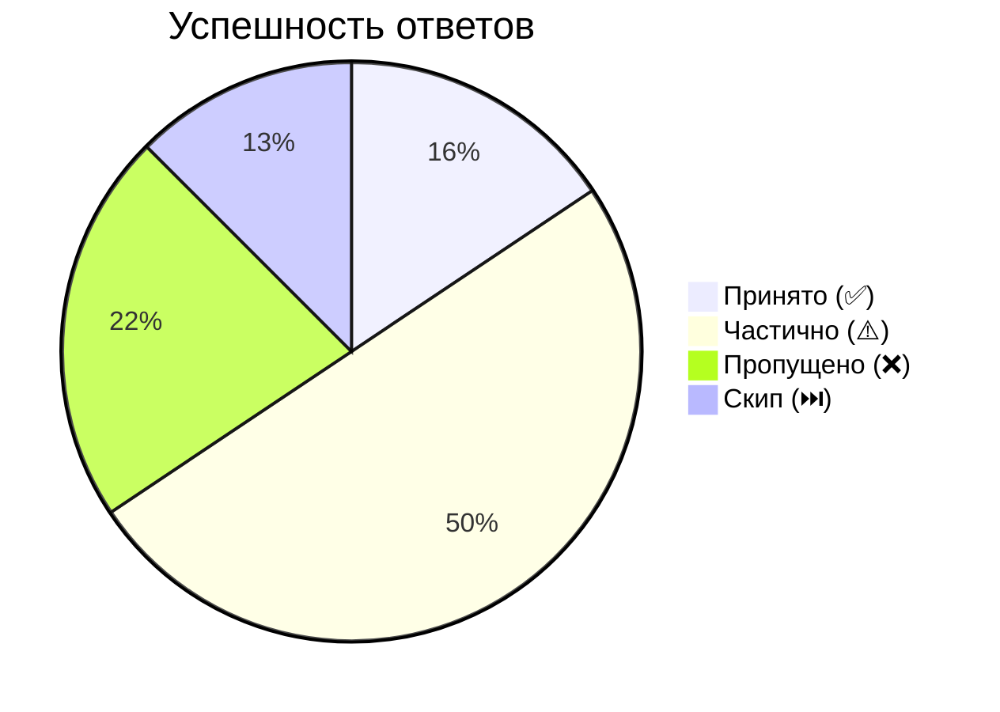

# 📊 Аналитика собеседований

## ⏱️ Общие показатели
- **Сессий:** 7 | **Вопросов:** 32
- **Средний балл:** 2.4/5 | **Среднее время на ответ:** 16:06

## 📈 Визуализация

### Распределение ответов

### 🚩 Топ слабых тем (балл)
- 🟥⬜⬜⬜⬜ **1.0** — [[Темы/PCA и t-SNE]]
- 🟥⬜⬜⬜⬜ **1.0** — [[Темы/Градиентный бустинг — основы и нормализация]]
- 🟥⬜⬜⬜⬜ **1.0** — [[Темы/Углублённые темы — математика и алгоритмы]]
- 🟥⬜⬜⬜⬜ **1.0** — [[Темы/Метрические методы (kNN)]]
- 🟥⬜⬜⬜⬜ **1.0** — [[Темы/Метод обратного распространения ошибки (Backpropagation)]]

## 🎯 Эффективность по типам

| Тип вопроса | Вопросов | Средний балл |
|-------------|----------|--------------|
| fact | 22 | 2.4/5 |

## 🏆 Эффективность по уровням

| Уровень | Вопросов | Средний балл |
|---------|----------|--------------|
| junior | 5 | 2.8/5 |
| middle | 8 | 2.8/5 |
| senior | 9 | 1.9/5 |

## 📚 Детально по темам

| Тема | Сессий | Вопросов | ⭐ Балл | Статус | Последняя сессия |
|------|--------|----------|---------|--------|-----------------|
| [[Темы/Полносвязные нейронные сети (MLP)]] | 1 | 1 | 4.0/5 | 🟢 | 02.05.2026 |
| [[Темы/Инициализация весов (Xavier и Kaiming)]] | 1 | 1 | 4.0/5 | 🟢 | 02.05.2026 |
| [[Темы/Логистическая регрессия]] | 1 | 2 | 3.5/5 | 🟡 | 27.04.2026 |
| [[Темы/Naive Bayes]] | 1 | 1 | 3.0/5 | 🟡 | 26.04.2026 |
| [[Темы/Isolation Forest]] | 1 | 2 | 3.0/5 | 🟡 | 26.04.2026 |
| [[Темы/Обработка пропусков]] | 1 | 1 | 3.0/5 | 🟡 | 26.04.2026 |
| [[Темы/Градиентный спуск]] | 1 | 1 | 3.0/5 | 🟡 | 26.04.2026 |
| [[Темы/Функции потерь в нейронных сетях]] | 1 | 1 | 3.0/5 | 🟡 | 02.05.2026 |
| [[Темы/Операция свёртки и её параметры]] | 1 | 1 | 3.0/5 | 🟡 | 02.05.2026 |
| [[Темы/Bagging vs Boosting]] | 1 | 2 | 2.5/5 | 🟡 | 26.04.2026 |
| [[Темы/Линейная модель]] | 2 | 3 | 2.3/5 | 🔴 | 27.04.2026 |
| [[Темы/Распределение Лапласа]] | 1 | 1 | 2.0/5 | 🔴 | 26.04.2026 |
| [[Темы/PCA и t-SNE]] | 1 | 2 | 1.0/5 | 🔴 | 26.04.2026 |
| [[Темы/Градиентный бустинг — основы и нормализация]] | 1 | 1 | 1.0/5 | 🔴 | 26.04.2026 |
| [[Темы/Углублённые темы — математика и алгоритмы]] | 1 | 1 | 1.0/5 | 🔴 | 26.04.2026 |
| [[Темы/Метрические методы (kNN)]] | 1 | 1 | 1.0/5 | 🔴 | 27.04.2026 |
| [[Темы/Метод обратного распространения ошибки (Backpropagation)]] | 1 | 1 | 1.0/5 | 🔴 | 02.05.2026 |
| [[Темы/Grad-CAM]] | 2 | 2 | — | — | 02.05.2026 |
| [[Темы/class_weight — веса классов]] | 1 | 1 | — | — | 26.04.2026 |
| [[Темы/Разбиение узлов в дереве бустинга]] | 1 | 1 | — | — | 26.04.2026 |
| [[Темы/Валидация — разбивка выборки и переобучение]] | 1 | 1 | — | — | 26.04.2026 |
| [[Темы/Batch Normalization]] | 1 | 2 | — | — | 02.05.2026 |
| [[Темы/Pooling слои (Max и Average)]] | 1 | 1 | — | — | 02.05.2026 |
| [[Темы/Функции активации]] | 1 | 1 | — | — | 02.05.2026 |

## 🔍 Слабые концепции

- линейность (1×)
- локальная структура (1×)
- глобальная структура (1×)
- максимизация дисперсии (1×)
- переобучение (1×)
- глубина деревьев (1×)
- variance bagging (1×)
- количество итераций (1×)
- градиент по весам (1×)
- транспонирование матрицы (1×)

## 💡 Рекомендация следующей сессии

> Темы: [[Темы/Bagging vs Boosting]], [[Темы/Распределение Лапласа]], [[Темы/PCA и t-SNE]]
