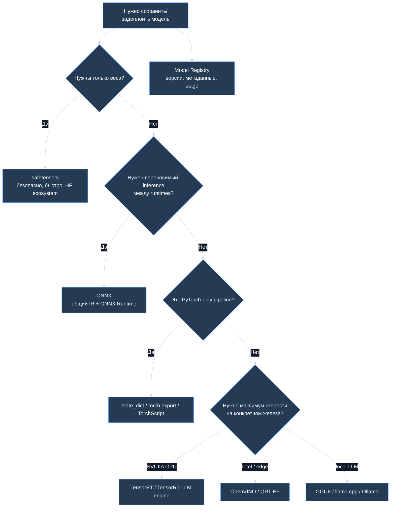

# 📦 Форматы хранения и экспорта моделей — ONNX, safetensors, TorchScript и GGUF

> [!abstract] Суть
> "Сохранить модель" может означать разные вещи: сохранить только **веса**, сохранить **вычислительный граф**, собрать **оптимизированный engine** под конкретное железо или зарегистрировать **production artifact** с метаданными, версией и lineage. Ошибка часто в том, что один формат пытаются использовать для всех задач.

---

## 1. Четыре разных смысла "хранения модели"

| Что храним | Примеры | Что даёт | Чего не даёт |
|---|---|---|---|
| **Weights checkpoint** | `.pt`, `.pth`, `.bin`, `.safetensors` | веса модели | не всегда хранит архитектуру и preprocessing |
| **Graph / IR** | ONNX, `torch.export`, TorchScript | переносимый вычислительный граф | не всегда сохраняет Python-логику |
| **Optimized engine** | TensorRT engine, ORT format, OpenVINO IR | быстрый inference под runtime/железо | хуже переносимость |
| **Registry artifact** | MLflow, Hugging Face repo, DVC artifact | версия, метаданные, воспроизводимость | сам по себе не ускоряет inference |

> [!important] Главное разделение
> **Checkpoint** отвечает на вопрос "какие параметры у модели?", а **export format** отвечает на вопрос "как выполнить модель без исходного Python-кода или с другим runtime?".

---

## 2. Быстрая карта выбора



---

## 3. PyTorch checkpoint: `.pt`, `.pth`, `.bin`

Часто в PyTorch сохраняют `state_dict`:

```python
torch.save(model.state_dict(), "model.pt")
model.load_state_dict(torch.load("model.pt"))
```

Что внутри:
- имена параметров;
- tensor values;
- иногда optimizer state, scheduler state, epoch, config.

### Когда подходит

- research;
- fine-tuning;
- продолжение обучения;
- полный контроль над Python-кодом модели;
- команда живёт в PyTorch.

### Нюансы

- `torch.save` исторически использует pickle-механику, поэтому нельзя бездумно грузить непроверенные файлы.
- `state_dict` не хранит архитектуру как независимый graph: класс модели должен быть доступен в коде.
- Для production-inference это часто промежуточный формат, а не финальный artifact.

---

## 4. safetensors

**safetensors** — формат для безопасного и быстрого хранения tensors. Его смысл: хранить численные tensor data без произвольного Python-кода.

```python
from safetensors.torch import save_file

save_file({"linear.weight": weight}, "model.safetensors")
```

### Что даёт

- безопаснее, чем pickle-based загрузка;
- быстрый доступ к tensors;
- удобен для sharded checkpoints;
- хорошо поддерживается в Hugging Face ecosystem;
- можно читать часть tensors, что полезно при больших моделях.

### Когда выбирать

| Сценарий | Почему safetensors хорош |
|---|---|
| LLM weights на Hugging Face | стандарт де-факто |
| нужно безопасно грузить сторонние веса | формат не исполняет произвольный код |
| большие checkpoints | удобно шардировать |
| inference/fine-tuning в PyTorch/Transformers | отличная совместимость |

### Чего не хватает

- не описывает весь inference graph;
- не заменяет ONNX/TensorRT;
- архитектуру, tokenizer config и generation config нужно хранить рядом.

---

## 5. ONNX

**ONNX** — открытый промежуточный формат для представления ML-моделей как вычислительного графа: nodes, tensors, operators, attributes.

Типичный путь:

```text
PyTorch / TensorFlow / sklearn
        -> export to ONNX
        -> ONNX Runtime / TensorRT EP / OpenVINO EP / другой backend
```

### Что даёт ONNX

- переносимость между фреймворками и runtimes;
- graph optimizations;
- execution providers под разные устройства;
- удобный production inference без полного Python training stack;
- возможность проверять parity между исходной и exported моделью.

### Когда ONNX хорошо подходит

| Сценарий | Почему |
|---|---|
| CV / tabular / encoder модели | часто статичный graph, хорошая поддержка ops |
| нужно деплоить не в PyTorch runtime | ONNX Runtime, TensorRT, OpenVINO |
| нужен C++/Java/C#/server inference | runtime API стабильнее, чем research-код |
| нужно ускорение через EP | CUDA, TensorRT, OpenVINO, CPU backends |

### Когда ONNX может быть болью

- кастомные PyTorch ops;
- динамическая Python-логика;
- сложные control flow;
- LLM serving с KV-cache, paged attention, speculative decoding — часто проще через vLLM/SGLang/TensorRT-LLM;
- несовпадение opset/runtime версий.

> [!tip] Практика
> После экспорта всегда делай parity check: сравни выходы PyTorch и ONNX на нескольких representative inputs.

---

## 6. `torch.export` и TorchScript

### TorchScript

TorchScript исторически позволял экспортировать PyTorch-модель в представление, которое можно запускать без обычного Python eager runtime.

Подходит, когда:
- production остаётся в PyTorch ecosystem;
- нужен C++ inference через LibTorch;
- модель хорошо script/trace-ится.

Ограничения:
- не вся Python-логика scriptable;
- tracing может пропустить ветвления, которые не проявились на example input;
- в новых PyTorch-пайплайнах всё чаще смотрят на `torch.export`.

### `torch.export`

`torch.export` делает Ahead-of-Time capture вычислительного графа PyTorch-программы и получает graph с ATen-операторами. Это более современная база для дальнейшего lowering/compilation/export.

Когда полезен:
- нужен более строгий graph capture;
- хочется уйти от eager Python;
- нужен путь к компиляции/экспорту;
- есть контроль над dynamic shapes и ограничениями модели.

---

## 7. TensorRT и TensorRT-LLM

**TensorRT** — оптимизированный inference engine под NVIDIA GPU. Обычно модель конвертируют из ONNX или другого представления, TensorRT строит engine с оптимизациями.

Что может делать:
- kernel fusion;
- mixed precision: FP16/BF16/INT8/FP8;
- shape-specific optimization;
- memory planning;
- optimized transformer kernels.

**TensorRT-LLM** — специализированный стек для LLM inference: поддержка quantization, KV-cache, parallelism, optimized attention и современных LLM patterns.

### Когда выбирать

| Сценарий | Почему TensorRT хорош |
|---|---|
| NVIDIA-only production | максимум оптимизаций под GPU |
| жёсткий latency SLA | engine-level optimization |
| модель стабилизирована | стоимость сборки engine окупается |
| нужен FP8 / INT8 / optimized kernels | сильная аппаратная интеграция |

### Минусы

- привязка к NVIDIA;
- engine может зависеть от GPU/версий;
- сложнее debug, чем PyTorch;
- dynamic shapes и кастомные ops требуют аккуратности.

---

## 8. ONNX Runtime ORT format и Execution Providers

**ONNX Runtime** умеет запускать ONNX-модели через разные **Execution Providers**:
- CPU;
- CUDA;
- TensorRT;
- OpenVINO;
- DirectML;
- другие hardware backends.

Это удобно, когда нужен один high-level runtime API, но разные железные backend.

**ORT format** — оптимизированный формат ONNX Runtime. Его смысл: заранее сохранить оптимизированную модель, чтобы быстрее загружать и выполнять в конкретном ORT-пайплайне.

### Когда использовать

- модель уже в ONNX;
- production runtime — ONNX Runtime;
- хочется ускорить load/initialization;
- нужен deployment на разные устройства через EP.

---

## 9. OpenVINO, Core ML, TFLite

Эти форматы/стэки чаще выбирают под конкретную среду:

| Формат / runtime | Где полезен |
|---|---|
| **OpenVINO IR** | Intel CPU/GPU/NPU, edge inference |
| **Core ML** | Apple ecosystem: iOS/macOS/ANE |
| **TensorFlow Lite** | mobile/embedded, Android, edge |

Они дают не просто "файл модели", а runtime + оптимизации под целевое устройство.

---

## 10. GGUF

**GGUF** — single-file бинарный формат, используемый llama.cpp для хранения и распространения quantized language models.

Обычно внутри:
- tensors;
- metadata;
- model hyperparameters;
- tokenizer-related metadata;
- quantization information.

### Когда GGUF подходит

| Сценарий | Почему |
|---|---|
| локальный запуск LLM | llama.cpp, Ollama-подобные workflows |
| CPU / Apple Silicon / consumer GPU | хороший ecosystem |
| нужен один файл | удобно переносить |
| quantized LLM | много практичных quantization variants |

### Когда GGUF не лучший выбор

- training/fine-tuning в PyTorch;
- production serving на vLLM/SGLang с HF safetensors;
- нужен ONNX/TensorRT deployment;
- нестандартная архитектура без поддержки llama.cpp.

---

## 11. PMML, pickle/joblib и классические модели

Для классического ML всё проще, но тоже есть trade-offs.

| Формат | Где встречается | Плюсы | Минусы |
|---|---|---|---|
| `pickle` / `joblib` | sklearn pipelines | просто, быстро для Python | unsafe для чужих файлов, Python-зависимость |
| PMML | enterprise scoring | переносимость для классических моделей | ограниченная поддержка modern DL |
| ONNX | sklearn + DL | общий runtime | не все preprocessing steps легко экспортируются |

Для sklearn-пайплайнов важно сохранять не только модель, но и preprocessing:

```text
raw input
  -> imputer / encoder / scaler
  -> model
  -> postprocessing / threshold
```

Если сохранить только classifier без encoder/scaler, production будет считать не то.

---

## 12. Model Registry — это не формат весов

Model Registry хранит не только файл:
- версию модели;
- stage: `dev`, `staging`, `prod`, `archived`;
- dataset version;
- metrics;
- code commit;
- owner;
- approval history;
- rollback point;
- dependencies.

Пример mental model:

```text
artifact = weights + config + tokenizer + preprocessing + metadata + tests + version
```

Для LLM artifact обычно включает:
- `*.safetensors` shards;
- `config.json`;
- tokenizer files;
- `generation_config.json`;
- chat template;
- quantization config;
- model card / eval report.

---

## 13. Что выбрать: сводная таблица

| Задача | Частый выбор | Почему |
|---|---|---|
| продолжить обучение PyTorch | `state_dict` / checkpoint | сохраняет веса и optimizer state |
| безопасно распространять LLM weights | safetensors | безопаснее pickle, HF-compatible |
| переносимый inference graph | ONNX | общий IR и много runtimes |
| PyTorch-only production/C++ | TorchScript / `torch.export` path | ближе к PyTorch ecosystem |
| максимум скорости на NVIDIA | TensorRT / TensorRT-LLM | optimized kernels, quantization, engine |
| Intel/edge inference | OpenVINO / ONNX Runtime EP | оптимизация под CPU/NPU |
| mobile Android | TFLite | mobile runtime |
| Apple devices | Core ML | Apple hardware acceleration |
| локальный quantized LLM | GGUF | llama.cpp/Ollama ecosystem |
| classical sklearn service | joblib + registry или ONNX | зависит от portability/security |

---

## 14. Типичные ошибки

- **Сохранять только веса и забывать preprocessing.**
- **Грузить непроверенный pickle/checkpoint из интернета.**
- **Думать, что ONNX сам ускоряет модель:** ускоряет runtime + backend + graph optimizations, а не расширение файла.
- **Не проверять numerical parity после export.**
- **Не фиксировать opset/runtime versions.**
- **Путать training checkpoint и production artifact.**
- **Хранить tokenizer отдельно и потом случайно использовать несовместимую версию.**
- **Не учитывать dynamic shapes при экспорте.**
- **Деплоить TensorRT engine на другое железо/версии без проверки.**

---

## 15. Мини-ответ для собеседования

> [!quote]
> Формат модели выбирают по тому, что именно нужно сохранить. Для обучения в PyTorch обычно хранят checkpoint или `state_dict`; для безопасного распространения весов LLM — safetensors; для переносимого inference graph — ONNX; для максимальной скорости на конкретном железе — TensorRT/OpenVINO/Core ML/TFLite; для локальных quantized LLM — GGUF. Production artifact шире любого файла: туда должны входить веса, архитектурный config, tokenizer/preprocessing, версии зависимостей, метрики, dataset lineage и rollback metadata.

---

## Проверка себя

- Чем checkpoint отличается от export graph?
- Почему safetensors безопаснее pickle-based форматов?
- Когда ONNX лучше, чем PyTorch checkpoint?
- Почему TensorRT engine менее переносим, чем ONNX?
- Что обязательно хранить рядом с LLM weights?
- Почему после экспорта нужен parity test?

---

## Связано

- [[Deep Learning/Обучение/Инференс и производительность DL]]
- [[NLP/LLM и Промпт-инжиниринг/Быстрая генерация LLM — batching, prefill, KV-cache и speculative decoding]]
- [[NLP/LLM и Промпт-инжиниринг/Сжатие языковых моделей (Distillation, Quantization, Pruning, LoRA)]]
- [[NLP/LLM и Промпт-инжиниринг/Архитектура Transformer в LLM — Attention, MHA и KV-cache]]

---

## Источники

- [ONNX IR specification](https://onnx.ai/onnx/repo-docs/IR.html)
- [PyTorch torch.export documentation](https://docs.pytorch.org/docs/stable/user_guide/torch_compiler/export.html)
- [PyTorch ONNX exporter documentation](https://docs.pytorch.org/docs/stable/onnx.html)
- [Hugging Face safetensors documentation](https://huggingface.co/docs/safetensors/en/index)
- [ONNX Runtime Execution Providers](https://onnxruntime.ai/docs/execution-providers)
- [TensorRT-LLM Quantization](https://nvidia.github.io/TensorRT-LLM/latest/features/quantization.html)
- [llama.cpp GGUF file format](https://www.mintlify.com/ggml-org/llama.cpp/concepts/gguf-format)

---

[[Deep Learning/🏠 Главная|Назад к Deep Learning]]
