# 🧭 Паттерны алгоритмических задач

> [!abstract] Суть
> Большая часть собеседовательных алгоритмических задач решается не “изобретением с нуля”, а распознаванием паттерна: какие структуры даны, что требуется найти, какие ограничения в условии и какой инвариант можно поддерживать. Эта карточка — навигационная шпаргалка по 12 паттернам из конспекта.

---

## 🚦 Как пользоваться

<div style="display:grid; grid-template-columns: repeat(4, minmax(0, 1fr)); gap: 10px; margin: 12px 0;">
  <div style="border:1px solid #60a5fa; border-radius:10px; padding:12px; background:#1e3a5f33; color:#e5e7eb;">
    <b style="color:#93c5fd;">1. Найди маркеры</b><br/>
    sorted, contiguous, intervals, tree, graph, generate all, count ways.
  </div>
  <div style="border:1px solid #34d399; border-radius:10px; padding:12px; background:#064e3b33; color:#e5e7eb;">
    <b style="color:#86efac;">2. Выбери 1-2 паттерна</b><br/>
    Не угадывай один сразу: проверь, какие инварианты можно поддерживать.
  </div>
  <div style="border:1px solid #fbbf24; border-radius:10px; padding:12px; background:#78350f33; color:#e5e7eb;">
    <b style="color:#fde68a;">3. Назови инвариант</b><br/>
    Что всегда истинно после каждого шага: окно валидно, стек монотонен, dp[i] оптимален.
  </div>
  <div style="border:1px solid #f472b6; border-radius:10px; padding:12px; background:#83184333; color:#e5e7eb;">
    <b style="color:#fbcfe8;">4. Проверь сложность</b><br/>
    Собеседование любит ответ: почему это O(n), O(log n), O(n log n).
  </div>
</div>

**Легенда задач:**
- 🧊 **Разминка** — быстро увидеть идею паттерна.
- 🎯 **Ядро** — обязательная задача для освоения паттерна.
- 🔥 **Закрепление** — задача проверяет уверенность и аккуратность.
- ⚠️ **Смежная** — полезная, но паттерн не в чистом виде.
- 🔒 **Premium** — задача может требовать LeetCode Premium.

> [!info] 🔗 Проверка ссылок
> Все 60 ссылок на LeetCode заданы в прямом формате `https://leetcode.com/problems/<slug>/` и проверены 2026-06-01 через открытие страниц задач. `252. Meeting Rooms` оставлена в списке как полезная interval-задача, но помечена как 🔒 Premium.

---

## 🧭 Быстрый выбор паттерна

```mermaid
%%{init: {"theme": "base", "themeVariables": {"background": "transparent", "primaryTextColor": "#f8fafc", "secondaryTextColor": "#f8fafc", "tertiaryTextColor": "#f8fafc", "lineColor": "#94a3b8", "edgeLabelBackground": "#111827", "fontFamily": "Inter, Segoe UI, sans-serif"}}}%%
flowchart TD
    S["Условие задачи"] --> A{"Есть sorted array/string?"}
    A -->|да + target / palindrome / сужение области| TP["Two Pointers"]
    A -->|да + найти позицию / границу| BS["Binary Search"]
    A -->|нет| B{"Нужен contiguous subarray / substring?"}

    B -->|фиксированная длина k| SWF["Sliding Window: fixed"]
    B -->|longest/shortest with condition| SWV["Sliding Window: variable"]
    B -->|sum/count на отрезках| PS["Prefix Sum"]
    B -->|nearest greater/smaller| STK["Stack: monotonic"]

    S --> C{"Даны интервалы / расписания?"}
    C -->|один список| INT1["Intervals: merge / greedy"]
    C -->|несколько списков| INT2["Intervals: two pointers"]
    C -->|максимум одновременных событий| INT3["Intervals: sweep line"]

    S --> D{"Частоты / анаграммы / top-k?"}
    D -->|частоты и сравнения| HT1["Hash Table: counting"]
    D -->|top-k / sort by frequency| HT2["Hash Table: value-key"]

    S --> E{"Структура явно дерево?"}
    E -->|ответ от детей к родителю| TR1["Tree: bottom-up"]
    E -->|состояние от корня вниз| TR2["Tree: top-down"]

    S --> F{"Graph / grid / зависимости?"}
    F -->|min steps| G1["Graph: BFS shortest path"]
    F -->|острова / области| G2["Graph: components"]
    F -->|порядок задач / цикл| G3["Graph: topological sort"]

    S --> H{"Нужно сгенерировать варианты?"}
    H -->|все без ограничений| BF["Brute force combinations"]
    H -->|только валидные| BT["Backtracking"]

    S --> I{"Оптимум / количество способов?"}
    I -->|1 состояние| DP1["DP: 1D"]
    I -->|2+ состояния| DP2["DP: multidimensional"]

    S --> L{"Linked List?"}
    L -->|удаление/слияние/голова меняется| LL1["Linked List: dummy node"]
    L -->|нужно сравнить с двух сторон| LL2["Linked List: reverse half"]

    classDef blue fill:#1d4ed8,stroke:#93c5fd,color:#ffffff;
    classDef green fill:#047857,stroke:#86efac,color:#ffffff;
    classDef orange fill:#92400e,stroke:#fde68a,color:#ffffff;
    classDef pink fill:#9d174d,stroke:#f9a8d4,color:#ffffff;
    classDef root fill:#1f2937,stroke:#e5e7eb,color:#ffffff;
    classDef question fill:#172554,stroke:#60a5fa,color:#ffffff;

    class S root;
    class A,B,C,D,E,F,H,I,L question;
    class TP,BS,SWF,SWV,PS,STK blue;
    class INT1,INT2,INT3,HT1,HT2 green;
    class TR1,TR2,G1,G2,G3 orange;
    class BF,BT,DP1,DP2,LL1,LL2 pink;
```



---

## 🧠 Карта “гринфлаг → паттерн”

| Маркер в условии | Что попробовать первым | Почему |
|---|---|---|
| `sorted array`, `target`, `palindrome` | **Two Pointers** | можно сужать область или идти с двух концов |
| два отсортированных массива/списка | **Two Pointers: каждому по указателю** | двигаем указатель на меньшем элементе |
| изменить массив/string `in-place` с сохранением порядка | **Two Pointers: fast/slow** | fast ищет, slow пишет |
| `substring/subarray`, `longest`, `at most k` | **Sliding Window** | поддерживаем валидное окно |
| сумма на отрезке, много запросов сумм | **Prefix Sum** | сумма `[l, r]` через разность префиксов |
| сумма подмассива с отрицательными числами | **Prefix Sum + Hash Map** | sliding window ломается при отрицательных |
| анаграммы, частоты, “сколько раз” | **Hash Table: counting** | ключ = элемент, значение = частота |
| top-k frequent, sort by frequency | **Hash Table: value-key** | частота становится ключом/приоритетом |
| интервалы, расписания, встречи | **Intervals** | сортировка по start/end и анализ пересечений |
| “первый true”, “последний false”, `O(log n)` | **Binary Search** | есть монотонный предикат |
| скобки, вложенность, отмена последнего | **Stack** | нужен LIFO |
| ближайший больший/меньший справа/слева | **Monotonic Stack** | храним кандидатов в монотонном порядке |
| linked list + меняется head | **Dummy Node** | убирает краевые случаи |
| linked list + палиндром/переупорядочивание | **Reverse half** | эмулирует два указателя с двух сторон |
| сгенерировать все варианты | **Brute Force / Backtracking** | дерево решений |
| дерево + ответ зависит от детей | **Tree bottom-up** | возвращаем информацию наверх |
| дерево + состояние пути | **Tree top-down** | передаём состояние вниз |
| grid/graph + минимум шагов | **BFS** | кратчайший путь в невзвешенном графе |
| острова/области/компоненты | **DFS/BFS components** | внешний цикл + обход компоненты |
| зависимости, prerequisites, порядок | **Topological sort** | indegree и очередь вершин без зависимостей |
| “количество способов”, “min/max”, выборы | **DP** | состояние + переход + база |

---

## 1. 🎯 Two Pointers

> [!tip] Суть
> Два указателя двигаются по структуре так, чтобы каждый шаг отбрасывал заведомо ненужные варианты или записывал следующий элемент ответа.

| Подпаттерн | Гринфлаги | Инвариант | Сложность |
|---|---|---|---|
| **С двух сторон** | sorted, palindrome, target sum | область между `l` и `r` содержит все ещё возможные ответы | `O(n)` |
| **Каждому по указателю** | два массива/строки/списка | уже обработали все элементы левее указателей | `O(n + m)` |
| **Быстрый и медленный** | in-place, сохранить порядок | `slow` указывает на место записи следующего валидного элемента | `O(n)` |

**Шаблон мышления:**
1. Что означает левый указатель?
2. Что означает правый/fast указатель?
3. Какой вариант мы отбрасываем при каждом движении?
4. Почему не теряем правильный ответ?

> [!example]- Кодовые шаблоны
> **1. С двух сторон: пара с суммой `target` в отсортированном массиве**
>
> ```python
> def two_sum_sorted(nums: list[int], target: int) -> tuple[int, int] | None:
>     left, right = 0, len(nums) - 1
>
>     while left < right:
>         current = nums[left] + nums[right]
>         if current == target:
>             return left, right
>         if current < target:
>             left += 1      # нужно увеличить сумму
>         else:
>             right -= 1     # нужно уменьшить сумму
>
>     return None
> ```
>
> Что меняется:
> - `current` — критерий сравнения: сумма, площадь, палиндромность, расстояние.
> - правило движения `left/right` — какое решение точно можно отбросить.
> - условие остановки: `left < right`, `left <= right`, пока один указатель не дошёл до конца.
>
> **2. Каждому массиву по указателю: merge двух отсортированных массивов**
>
> ```python
> def merge_sorted(a: list[int], b: list[int]) -> list[int]:
>     i = j = 0
>     result = []
>
>     while i < len(a) and j < len(b):
>         if a[i] <= b[j]:
>             result.append(a[i])
>             i += 1
>         else:
>             result.append(b[j])
>             j += 1
>
>     result.extend(a[i:])
>     result.extend(b[j:])
>     return result
> ```
>
> Что меняется:
> - что считаем “меньшим/лучшим” элементом;
> - записываем ли в новый массив или `in-place`;
> - нужно ли пропускать дубликаты;
> - что делать с остатком одного из массивов.
>
> **3. Fast/slow: удалить элементы `val` с сохранением порядка**
>
> ```python
> def remove_value(nums: list[int], val: int) -> int:
>     slow = 0
>     for fast in range(len(nums)):
>         if nums[fast] != val:
>             nums[slow] = nums[fast]
>             slow += 1
>
>     return slow  # новая логическая длина массива
> ```
>
> Что меняется:
> - predicate валидности: `nums[fast] != val`, `nums[fast] != 0`, `not duplicate`;
> - что пишем в `nums[slow]`;
> - нужно ли после прохода заполнить хвост нулями/пустыми значениями;
> - возвращаем длину, массив или количество удалений.

**Задачи:**

| Роль | Задача | Что тренирует |
|---|---|---|
| 🧊 | [125. Valid Palindrome](https://leetcode.com/problems/valid-palindrome/) | два указателя с двух сторон |
| 🎯 | [88. Merge Sorted Array](https://leetcode.com/problems/merge-sorted-array/) | каждому по указателю, запись in-place |
| 🎯 | [283. Move Zeroes](https://leetcode.com/problems/move-zeroes/) | fast/slow, стабильная запись |
| 🎯 | [167. Two Sum II](https://leetcode.com/problems/two-sum-ii-input-array-is-sorted/) | sorted + target sum |
| 🔥 | [11. Container With Most Water](https://leetcode.com/problems/container-with-most-water/) | сужение области через доказательство |

**Типичные ошибки:**
- двигать оба указателя сразу, когда нужно двигать только один;
- забыть, что Two Sum II использует отсортированность;
- в `Move Zeroes` нарушить относительный порядок ненулевых элементов.

---

## 2. 🪟 Sliding Window

> [!tip] Суть
> Окно — это непрерывный отрезок. Мы двигаем правую границу, обновляем состояние окна и при необходимости двигаем левую границу, чтобы вернуть валидность.

| Подпаттерн | Гринфлаги | Инвариант | Сложность |
|---|---|---|---|
| **Окно фиксированной длины** | `k`, “ровно k подряд” | окно всегда размера `k` | `O(n)` |
| **Непересекающиеся окна** | группы подряд, RLE, ranges | текущая группа максимальна и не пересекается со следующей | `O(n)` |
| **Пересекающиеся окна** | longest/shortest, at most k, unique chars | окно валидно после сдвига `left` | `O(n)` |

**Главная развилка:**
- Если размер окна задан явно — фиксированное окно.
- Если нужно найти максимальную/минимальную длину при условии — переменное окно.
- Если элементы могут быть отрицательными и условие про сумму — осторожно, часто нужен prefix sum.

> [!example]- Кодовые шаблоны
> **1. Фиксированное окно: максимум суммы подмассива длины `k`**
>
> ```python
> def max_sum_fixed_window(nums: list[int], k: int) -> int:
>     window_sum = sum(nums[:k])
>     best = window_sum
>
>     for right in range(k, len(nums)):
>         left = right - k
>         window_sum += nums[right]
>         window_sum -= nums[left]
>         best = max(best, window_sum)
>
>     return best
> ```
>
> Что меняется:
> - агрегат окна: `sum`, `count`, `max`, `Counter`;
> - что считается ответом: максимум, минимум, среднее, количество валидных окон;
> - момент обновления ответа: после построения первого окна или после каждого сдвига.
>
> **2. Переменное окно: самая длинная подстрока с не более чем `k` нулями**
>
> ```python
> def longest_with_at_most_k_zeros(nums: list[int], k: int) -> int:
>     left = 0
>     zeros = 0
>     best = 0
>
>     for right, x in enumerate(nums):
>         if x == 0:
>             zeros += 1
>
>         while zeros > k:          # окно стало невалидным
>             if nums[left] == 0:
>                 zeros -= 1
>             left += 1
>
>         best = max(best, right - left + 1)
>
>     return best
> ```
>
> Что меняется:
> - состояние окна: `zeros`, `Counter`, сумма, число уникальных символов;
> - условие невалидности в `while`;
> - что удаляем при сдвиге `left`;
> - ищем `longest`, `shortest` или количество окон.
>
> **3. Непересекающиеся группы: сжать подряд идущие одинаковые элементы**
>
> ```python
> def compress_groups(nums: list[int]) -> list[tuple[int, int]]:
>     result = []
>     i = 0
>
>     while i < len(nums):
>         j = i
>         while j < len(nums) and nums[j] == nums[i]:
>             j += 1
>
>         result.append((nums[i], j - i))
>         i = j
>
>     return result
> ```
>
> Что меняется:
> - условие принадлежности группе: равенство, разница `1`, пересечение интервалов;
> - что сохраняем: длину, границы, значение, агрегат;
> - можно ли сразу обновлять ответ без хранения всех групп.

**Задачи:**

| Роль | Задача | Что тренирует |
|---|---|---|
| 🧊 | [643. Maximum Average Subarray I](https://leetcode.com/problems/maximum-average-subarray-i/) | фиксированное окно |
| ⚠️ | [219. Contains Duplicate II](https://leetcode.com/problems/contains-duplicate-ii/) | окно + hash set, гибрид |
| ⚠️ | [121. Best Time to Buy and Sell Stock](https://leetcode.com/problems/best-time-to-buy-and-sell-stock/) | one-pass running minimum, не чистое окно |
| 🎯 | [3. Longest Substring Without Repeating Characters](https://leetcode.com/problems/longest-substring-without-repeating-characters/) | переменное окно |
| 🎯 | [1004. Max Consecutive Ones III](https://leetcode.com/problems/max-consecutive-ones-iii/) | окно с ограничением `zeros <= k` |

**Типичные ошибки:**
- пересчитывать состояние окна с нуля;
- забыть удалить левый элемент из счётчиков;
- применять sliding window к суммам с отрицательными числами без проверки монотонности.

---

## 3. 🧮 Hash Tables

> [!tip] Суть
> Хэш-таблица превращает “найти/посчитать/сравнить” в быстрый доступ по ключу.

| Подпаттерн | Гринфлаги | Инвариант | Сложность |
|---|---|---|---|
| **Техника подсчёта** | частоты, анаграммы, повторения | `counter[x]` хранит нужную статистику по `x` | обычно `O(n)` |
| **Ключ-значение → значение-ключ** | top-k, sort by frequency | можно инвертировать частоту в бакет/приоритет | `O(n)` или `O(n log n)` |

> [!example]- Кодовые шаблоны
> **1. Counting: проверить анаграмму**
>
> ```python
> from collections import Counter
>
> def is_anagram(a: str, b: str) -> bool:
>     return Counter(a) == Counter(b)
> ```
>
> Что меняется:
> - ключ: символ, число, нормализованное слово, tuple признаков;
> - значение: частота, индекс, список индексов, максимум/минимум;
> - сравниваем два счётчика или обновляем один счётчик в окне.
>
> **2. One-pass lookup: Two Sum через словарь**
>
> ```python
> def two_sum(nums: list[int], target: int) -> tuple[int, int] | None:
>     seen = {}  # value -> index
>
>     for i, x in enumerate(nums):
>         need = target - x
>         if need in seen:
>             return seen[need], i
>         seen[x] = i
>
>     return None
> ```
>
> Что меняется:
> - что ищем в словаре: `target - x`, предыдущий prefix, уже виденный pattern;
> - что храним: первый индекс, последний индекс, количество, список;
> - когда записываем текущий элемент: до проверки или после проверки.
>
> **3. Top-k frequent через bucket**
>
> ```python
> from collections import Counter
>
> def top_k_frequent(nums: list[int], k: int) -> list[int]:
>     freq = Counter(nums)
>     buckets = [[] for _ in range(len(nums) + 1)]
>
>     for value, count in freq.items():
>         buckets[count].append(value)
>
>     result = []
>     for count in range(len(buckets) - 1, 0, -1):
>         for value in buckets[count]:
>             result.append(value)
>             if len(result) == k:
>                 return result
>
>     return result
> ```
>
> Что меняется:
> - использовать bucket, heap или сортировку;
> - tie-break: по алфавиту, по значению, по первому появлению;
> - вернуть значения, пары `(value, count)` или отсортированный результат.

**Задачи:**

| Роль | Задача | Что тренирует |
|---|---|---|
| 🧊 | [242. Valid Anagram](https://leetcode.com/problems/valid-anagram/) | сравнение частот |
| 🎯 | [387. First Unique Character in a String](https://leetcode.com/problems/first-unique-character-in-a-string/) | частоты + порядок |
| 🧊 | [409. Longest Palindrome](https://leetcode.com/problems/longest-palindrome/) | чётность частот |
| 🎯 | [347. Top K Frequent Elements](https://leetcode.com/problems/top-k-frequent-elements/) | frequency map + top-k |
| 🎯 | [451. Sort Characters By Frequency](https://leetcode.com/problems/sort-characters-by-frequency/) | сортировка по частоте |

**Типичные ошибки:**
- не продумать, что именно является ключом;
- сортировать всё, когда достаточно bucket/counting;
- забыть, что порядок может быть важен отдельно от частоты.

---

## 4. 📏 Точки и отрезки

> [!tip] Суть
> Интервалы почти всегда требуют сначала отсортировать события или сами отрезки, а затем пройти один раз, поддерживая текущий активный интервал/счётчик.

| Подпаттерн | Гринфлаги | Инвариант | Сложность |
|---|---|---|---|
| **Метод отрезков** | один список интервалов | последний интервал в ответе уже слит максимально | `O(n log n)` |
| **Два указателя на отрезках** | два списка расписаний | сравниваем только текущую пару интервалов | `O(n + m)` |
| **Метод точек** | максимум одновременных событий | счётчик активных интервалов корректен после каждой точки | `O(n log n)` |

> [!example]- Кодовые шаблоны
> **1. Merge intervals**
>
> ```python
> def merge_intervals(intervals: list[list[int]]) -> list[list[int]]:
>     intervals.sort(key=lambda x: x[0])
>     merged = []
>
>     for start, end in intervals:
>         if not merged or start > merged[-1][1]:
>             merged.append([start, end])
>         else:
>             merged[-1][1] = max(merged[-1][1], end)
>
>     return merged
> ```
>
> Что меняется:
> - пересечение: `start <= last_end` или строго `start < last_end`;
> - что делать при пересечении: слить, удалить один, посчитать конфликт;
> - сортировка по `start` или по `end` для greedy-задач.
>
> **2. Два списка интервалов: пересечения**
>
> ```python
> def interval_intersections(a: list[list[int]], b: list[list[int]]) -> list[list[int]]:
>     i = j = 0
>     result = []
>
>     while i < len(a) and j < len(b):
>         start = max(a[i][0], b[j][0])
>         end = min(a[i][1], b[j][1])
>
>         if start <= end:
>             result.append([start, end])
>
>         if a[i][1] < b[j][1]:
>             i += 1
>         else:
>             j += 1
>
>     return result
> ```
>
> Что меняется:
> - условие пересечения: inclusive/exclusive границы;
> - что возвращаем: сами пересечения, их длину, факт наличия;
> - какой указатель двигать при равных концах.
>
> **3. Sweep line: максимум одновременных событий**
>
> ```python
> def max_active_intervals(intervals: list[list[int]]) -> int:
>     events = []
>     for start, end in intervals:
>         events.append((start, 1))
>         events.append((end, -1))
>
>     events.sort(key=lambda x: (x[0], x[1]))  # end перед start при касании
>     active = best = 0
>
>     for _, delta in events:
>         active += delta
>         best = max(best, active)
>
>     return best
> ```
>
> Что меняется:
> - порядок событий при одинаковой координате: start раньше end или наоборот;
> - `delta`: +1/-1, вес события, изменение баланса;
> - ответ: максимум active, периоды перегрузки, первый конфликт.

**Задачи:**

| Роль | Задача | Что тренирует |
|---|---|---|
| 🧊 | [228. Summary Ranges](https://leetcode.com/problems/summary-ranges/) | непересекающиеся группы/ranges |
| 🎯 🔒 | [252. Meeting Rooms](https://leetcode.com/problems/meeting-rooms/) | проверка пересечения интервалов, Premium |
| 🎯 | [56. Merge Intervals](https://leetcode.com/problems/merge-intervals/) | merge intervals |
| 🎯 | [986. Interval List Intersections](https://leetcode.com/problems/interval-list-intersections/) | два указателя на интервалах |
| 🔥 | [435. Non-overlapping Intervals](https://leetcode.com/problems/non-overlapping-intervals/) | greedy по интервалам |

**Типичные ошибки:**
- сортировать не по той границе;
- неправильно обработать касание `[1,2]` и `[2,3]`;
- забыть, что для “минимум удалить” часто выгодно оставлять интервал с меньшим концом.

---

## 5. 🔍 Binary Search

> [!tip] Суть
> Бинарный поиск ищет границу между двумя зонами: “плохо/хорошо” или “меньше/достаточно”. Главное — не массив, а монотонный предикат.

| Подпаттерн | Гринфлаги | Инвариант | Сложность |
|---|---|---|---|
| **Базовый поиск** | sorted, найти индекс | ответ остаётся внутри `[l, r]` | `O(log n)` |
| **Поиск границы** | first/last, insert position | слева одна зона, справа другая | `O(log n)` |
| **Двойной поиск** | диапазон, rotated array | сначала найти границу/поворот, потом искать | `O(log n)` |

> [!example]- Кодовые шаблоны
> **1. Базовый поиск индекса**
>
> ```python
> def binary_search(nums: list[int], target: int) -> int:
>     left, right = 0, len(nums) - 1
>
>     while left <= right:
>         mid = (left + right) // 2
>         if nums[mid] == target:
>             return mid
>         if nums[mid] < target:
>             left = mid + 1
>         else:
>             right = mid - 1
>
>     return -1
> ```
>
> Что меняется:
> - сравнение `nums[mid]` с `target`;
> - возвращаем `mid`, `left`, `right` или `-1`;
> - используем закрытый интервал `[left, right]` или полуинтервал `[left, right)`.
>
> **2. Lower bound: первая позиция, где `nums[i] >= target`**
>
> ```python
> def lower_bound(nums: list[int], target: int) -> int:
>     left, right = 0, len(nums)
>
>     while left < right:
>         mid = (left + right) // 2
>         if nums[mid] >= target:
>             right = mid
>         else:
>             left = mid + 1
>
>     return left
> ```
>
> Что меняется:
> - предикат `nums[mid] >= target`;
> - ищем `first true`, `last false`, `upper_bound`;
> - область ответа может быть не индексом массива, а числом: скорость, capacity, длина.
>
> **3. Поиск по ответу: минимальное `x`, для которого `can(x) == True`**
>
> ```python
> def first_true(left: int, right: int, can) -> int:
>     while left < right:
>         mid = (left + right) // 2
>         if can(mid):
>             right = mid
>         else:
>             left = mid + 1
>
>     return left
> ```
>
> Что меняется:
> - функция `can(mid)`;
> - границы поиска;
> - ищем минимум feasible или максимум feasible;
> - нужна ли проверка, что ответ существует.

**Задачи:**

| Роль | Задача | Что тренирует |
|---|---|---|
| 🧊 | [704. Binary Search](https://leetcode.com/problems/binary-search/) | базовый шаблон |
| 🧊 | [35. Search Insert Position](https://leetcode.com/problems/search-insert-position/) | lower bound |
| 🎯 | [278. First Bad Version](https://leetcode.com/problems/first-bad-version/) | поиск первой `true` |
| 🎯 | [34. Find First and Last Position](https://leetcode.com/problems/find-first-and-last-position-of-element-in-sorted-array/) | двойной binary search |
| 🔥 | [33. Search in Rotated Sorted Array](https://leetcode.com/problems/search-in-rotated-sorted-array/) | поиск в сдвинутом sorted array |

**Типичные ошибки:**
- бесконечный цикл из-за неверного обновления `mid`;
- не понимать, ищем “первый good” или “последний bad”;
- смешивать инклюзивные и полуинтервальные границы.

---

## 6. 🥞 Stack

> [!tip] Суть
> Стек нужен, когда последний открытый/незавершённый объект должен обработаться первым.

| Подпаттерн | Гринфлаги | Инвариант | Сложность |
|---|---|---|---|
| **Стек промежуточных результатов** | скобки, RPN, отмена последнего | стек хранит незакрытые/ожидающие элементы | `O(n)` |
| **Монотонный стек** | nearest greater/smaller | стек хранит кандидатов в монотонном порядке | `O(n)` |
| **Псевдостек** | один тип скобок/баланс | достаточно знать размер/баланс | `O(n)`, память `O(1)` |

> [!example]- Кодовые шаблоны
> **1. Обычный стек: валидные скобки**
>
> ```python
> def is_valid_parentheses(s: str) -> bool:
>     pairs = {")": "(", "]": "[", "}": "{"}
>     stack = []
>
>     for ch in s:
>         if ch in pairs.values():
>             stack.append(ch)
>         elif ch in pairs:
>             if not stack or stack.pop() != pairs[ch]:
>                 return False
>
>     return not stack
> ```
>
> Что меняется:
> - что кладём в стек: символ, индекс, число, частичный результат;
> - когда делаем `pop`;
> - что значит “стек должен быть пуст в конце”.
>
> **2. Монотонный стек: следующий больший элемент справа**
>
> ```python
> def next_greater(nums: list[int]) -> list[int]:
>     result = [-1] * len(nums)
>     stack = []  # индексы, nums[stack] убывает
>
>     for i, x in enumerate(nums):
>         while stack and nums[stack[-1]] < x:
>             j = stack.pop()
>             result[j] = x
>         stack.append(i)
>
>     return result
> ```
>
> Что меняется:
> - знак в `while`: ищем greater/smaller, strict/non-strict;
> - храним индексы или значения;
> - ответ: значение, расстояние `i - j`, количество дней, площадь.
>
> **3. Псевдостек: баланс одного типа скобок**
>
> ```python
> def is_valid_one_type(s: str) -> bool:
>     balance = 0
>     for ch in s:
>         if ch == "(":
>             balance += 1
>         elif ch == ")":
>             balance -= 1
>             if balance < 0:
>                 return False
>     return balance == 0
> ```
>
> Что меняется:
> - счётчик может быть `balance`, `open_count`, `depth`;
> - иногда нужен максимум глубины;
> - если типов скобок несколько, одного баланса уже недостаточно.

**Задачи:**

| Роль | Задача | Что тренирует |
|---|---|---|
| 🧊 | [20. Valid Parentheses](https://leetcode.com/problems/valid-parentheses/) | классический LIFO |
| ⚠️ | [844. Backspace String Compare](https://leetcode.com/problems/backspace-string-compare/) | стек или two pointers |
| 🎯 | [1047. Remove All Adjacent Duplicates In String](https://leetcode.com/problems/remove-all-adjacent-duplicates-in-string/) | отмена последнего |
| 🎯 | [150. Evaluate Reverse Polish Notation](https://leetcode.com/problems/evaluate-reverse-polish-notation/) | стек вычислений |
| 🔥 | [739. Daily Temperatures](https://leetcode.com/problems/daily-temperatures/) | монотонный стек |

**Типичные ошибки:**
- доставать из пустого стека;
- забыть проверить, что стек пуст в конце;
- в монотонном стеке не понимать, что каждый элемент добавляется и удаляется максимум один раз.

---

## 7. 🧾 Prefix Sum

> [!tip] Суть
> Prefix sum хранит агрегат “до текущей позиции”, чтобы быстро получать значение на отрезке или находить нужный предыдущий префикс.

| Подпаттерн | Гринфлаги | Инвариант | Сложность |
|---|---|---|---|
| **Массив сумм** | много запросов на сумму | `prefix[i]` = сумма до `i` | preprocess `O(n)`, query `O(1)` |
| **Бегущий префикс** | нужен только текущий баланс | текущий prefix корректен на каждом шаге | `O(n)` |
| **Prefix + HashMap** | количество/поиск подотрезков с суммой | словарь хранит уже встреченные prefix | `O(n)` |

> [!example]- Кодовые шаблоны
> **1. Prefix array: сумма на `[l, r]`**
>
> ```python
> class RangeSum:
>     def __init__(self, nums: list[int]):
>         self.prefix = [0]
>         for x in nums:
>             self.prefix.append(self.prefix[-1] + x)
>
>     def query(self, left: int, right: int) -> int:
>         return self.prefix[right + 1] - self.prefix[left]
> ```
>
> Что меняется:
> - агрегат: сумма, xor, количество единиц;
> - индексация: `prefix[i]` как сумма до `i` не включая `i`;
> - запросы могут быть 1D, 2D, по строкам/матрице.
>
> **2. Running prefix: pivot index**
>
> ```python
> def pivot_index(nums: list[int]) -> int:
>     total = sum(nums)
>     left_sum = 0
>
>     for i, x in enumerate(nums):
>         right_sum = total - left_sum - x
>         if left_sum == right_sum:
>             return i
>         left_sum += x
>
>     return -1
> ```
>
> Что меняется:
> - что сравниваем слева и справа;
> - обновляем prefix до проверки или после проверки;
> - возвращаем первый индекс, все индексы или количество.
>
> **3. Prefix + HashMap: количество подмассивов с суммой `k`**
>
> ```python
> from collections import defaultdict
>
> def count_subarrays_sum_k(nums: list[int], k: int) -> int:
>     count_by_prefix = defaultdict(int)
>     count_by_prefix[0] = 1
>     prefix = 0
>     answer = 0
>
>     for x in nums:
>         prefix += x
>         answer += count_by_prefix[prefix - k]
>         count_by_prefix[prefix] += 1
>
>     return answer
> ```
>
> Что меняется:
> - хранить количество prefix или первый индекс;
> - искать `prefix - k`, `prefix % k`, `prefix ^ target`;
> - возвращать count, границы одного подотрезка или максимальную длину.

**Задачи:**

| Роль | Задача | Что тренирует |
|---|---|---|
| 🧊 | [303. Range Sum Query - Immutable](https://leetcode.com/problems/range-sum-query-immutable/) | prefix array |
| 🎯 | [724. Find Pivot Index](https://leetcode.com/problems/find-pivot-index/) | running prefix |
| 🧊 | [1732. Find the Highest Altitude](https://leetcode.com/problems/find-the-highest-altitude/) | running sum |
| 🎯 | [238. Product of Array Except Self](https://leetcode.com/problems/product-of-array-except-self/) | prefix/suffix без деления |
| 🔥 | [560. Subarray Sum Equals K](https://leetcode.com/problems/subarray-sum-equals-k/) | prefix sum + hashmap |

**Типичные ошибки:**
- off-by-one в `prefix[r + 1] - prefix[l]`;
- забыть положить prefix `0` до начала массива;
- пытаться решить `Subarray Sum Equals K` sliding window при наличии отрицательных чисел.

---

## 8. 🔗 Linked Lists

> [!tip] Суть
> В linked list нельзя прыгнуть назад или быстро обратиться по индексу. Поэтому важны dummy node, fast/slow, разворот части списка и аккуратная работа с указателями.

| Подпаттерн | Гринфлаги | Инвариант | Сложность |
|---|---|---|---|
| **Dummy Node** | удаление/слияние, может измениться head | `dummy.next` всегда ведёт в корректный результат | `O(n)` |
| **Частичный разворот** | палиндром, reorder, сравнить половины | одна часть списка развёрнута и доступна слева направо | `O(n)` |
| **Fast/slow для середины** | middle, cycle, nth from end | расстояние между указателями имеет смысл | `O(n)` |

> [!example]- Кодовые шаблоны
> **Базовый узел**
>
> ```python
> class ListNode:
>     def __init__(self, val=0, next=None):
>         self.val = val
>         self.next = next
> ```
>
> **1. Dummy node: удалить все узлы со значением `val`**
>
> ```python
> def remove_elements(head: ListNode | None, val: int) -> ListNode | None:
>     dummy = ListNode(0, head)
>     prev = dummy
>     cur = head
>
>     while cur:
>         if cur.val == val:
>             prev.next = cur.next
>         else:
>             prev = cur
>         cur = cur.next
>
>     return dummy.next
> ```
>
> Что меняется:
> - условие удаления/слияния;
> - двигаем ли `prev` после операции;
> - возвращаем `dummy.next`, потому что `head` мог измениться.
>
> **2. Reverse list**
>
> ```python
> def reverse(head: ListNode | None) -> ListNode | None:
>     prev = None
>     cur = head
>
>     while cur:
>         nxt = cur.next
>         cur.next = prev
>         prev = cur
>         cur = nxt
>
>     return prev
> ```
>
> Что меняется:
> - разворачиваем весь список или часть;
> - нужно ли сохранить границы сегмента;
> - после reverse часто нужно заново соединить хвосты.
>
> **3. Fast/slow: найти середину**
>
> ```python
> def middle_node(head: ListNode | None) -> ListNode | None:
>     slow = fast = head
>
>     while fast and fast.next:
>         slow = slow.next
>         fast = fast.next.next
>
>     return slow
> ```
>
> Что меняется:
> - старт `fast = head` или `head.next` для левой/правой середины;
> - скорость `fast`: на 2 шага, gap `n`, пока не конец;
> - задача: middle, cycle, nth from end, split list.

**Задачи:**

| Роль | Задача | Что тренирует |
|---|---|---|
| 🧊 | [876. Middle of the Linked List](https://leetcode.com/problems/middle-of-the-linked-list/) | fast/slow |
| 🎯 | [21. Merge Two Sorted Lists](https://leetcode.com/problems/merge-two-sorted-lists/) | dummy node |
| 🎯 | [234. Palindrome Linked List](https://leetcode.com/problems/palindrome-linked-list/) | середина + reverse half |
| 🔥 | [143. Reorder List](https://leetcode.com/problems/reorder-list/) | split + reverse + merge |
| 🎯 | [19. Remove Nth Node From End of List](https://leetcode.com/problems/remove-nth-node-from-end-of-list/) | dummy + two pointers |

**Типичные ошибки:**
- потерять ссылку на следующий узел при развороте;
- не обработать удаление головы;
- получить цикл при reorder из-за незакрытого `tail.next = None`.

---

## 9. 🌲 Перебор комбинаций

> [!tip] Суть
> Перебор комбинаций — это дерево решений. Brute force строит всё подряд, backtracking отсекает ветки, которые уже не могут стать валидными.

| Подпаттерн | Гринфлаги | Инвариант | Сложность |
|---|---|---|---|
| **Brute Force генерация** | все подмножества/перестановки без ограничений | текущий prefix — валидная часть варианта | экспоненциальная |
| **Backtracking** | ограничения валидности | не идём в заведомо невозможную ветку | экспоненциальная, но с pruning |

> [!example]- Кодовые шаблоны
> **1. Brute force/backtracking: все подмножества**
>
> ```python
> def subsets(nums: list[int]) -> list[list[int]]:
>     result = []
>     path = []
>
>     def dfs(i: int) -> None:
>         if i == len(nums):
>             result.append(path.copy())
>             return
>
>         dfs(i + 1)          # не берём nums[i]
>
>         path.append(nums[i])
>         dfs(i + 1)          # берём nums[i]
>         path.pop()          # откат состояния
>
>     dfs(0)
>     return result
> ```
>
> Что меняется:
> - решение через include/exclude или цикл `for`;
> - что является `path`;
> - когда добавляем `path` в `result`: на каждом шаге или только в листе.
>
> **2. Permutations: используем `used`**
>
> ```python
> def permutations(nums: list[int]) -> list[list[int]]:
>     result = []
>     path = []
>     used = [False] * len(nums)
>
>     def dfs() -> None:
>         if len(path) == len(nums):
>             result.append(path.copy())
>             return
>
>         for i, x in enumerate(nums):
>             if used[i]:
>                 continue
>             used[i] = True
>             path.append(x)
>             dfs()
>             path.pop()
>             used[i] = False
>
>     dfs()
>     return result
> ```
>
> Что меняется:
> - как запрещаем повторное использование;
> - как обрабатываем дубликаты;
> - условие завершения: длина path, сумма, валидность.
>
> **3. Backtracking с pruning: корректные скобки**
>
> ```python
> def generate_parentheses(n: int) -> list[str]:
>     result = []
>     path = []
>
>     def dfs(opened: int, closed: int) -> None:
>         if len(path) == 2 * n:
>             result.append("".join(path))
>             return
>
>         if opened < n:
>             path.append("(")
>             dfs(opened + 1, closed)
>             path.pop()
>
>         if closed < opened:
>             path.append(")")
>             dfs(opened, closed + 1)
>             path.pop()
>
>     dfs(0, 0)
>     return result
> ```
>
> Что меняется:
> - pruning-условия: `opened < n`, `closed < opened`;
> - состояние: counts, remaining sum, visited cells;
> - возвращаем все варианты, количество или первый найденный.

**Задачи:**

| Роль | Задача | Что тренирует |
|---|---|---|
| 🧊 | [17. Letter Combinations of a Phone Number](https://leetcode.com/problems/letter-combinations-of-a-phone-number/) | дерево вариантов |
| 🎯 | [78. Subsets](https://leetcode.com/problems/subsets/) | include/exclude |
| 🎯 | [46. Permutations](https://leetcode.com/problems/permutations/) | used set |
| 🔥 | [22. Generate Parentheses](https://leetcode.com/problems/generate-parentheses/) | backtracking с ограничениями |
| 🎯 | [77. Combinations](https://leetcode.com/problems/combinations/) | комбинации без порядка |

**Типичные ошибки:**
- не откатить состояние после рекурсивного вызова;
- путать permutations и combinations;
- генерировать все варианты, а потом фильтровать, когда можно отсекать раньше.

---

## 10. 🌳 Trees

> [!tip] Суть
> В деревьях почти всегда решаем рекурсией. Вопрос только в направлении информации: снизу вверх или сверху вниз.

| Подпаттерн | Гринфлаги | Инвариант | Сложность |
|---|---|---|---|
| **Снизу вверх** | height, diameter, balanced | функция возвращает родителю полезную информацию о поддереве | `O(n)` |
| **Сверху вниз** | path, level, сумма от корня | состояние пути корректно передано ребёнку | `O(n)` |

> [!example]- Кодовые шаблоны
> **Базовый узел**
>
> ```python
> class TreeNode:
>     def __init__(self, val=0, left=None, right=None):
>         self.val = val
>         self.left = left
>         self.right = right
> ```
>
> **1. Bottom-up: высота дерева**
>
> ```python
> def height(root: TreeNode | None) -> int:
>     if not root:
>         return 0
>
>     left_h = height(root.left)
>     right_h = height(root.right)
>     return 1 + max(left_h, right_h)
> ```
>
> Что меняется:
> - что возвращаем родителю: высоту, сумму, min/max, флаг валидности;
> - нужен ли глобальный/внешний `answer`;
> - базовый случай для пустого узла.
>
> **2. Bottom-up + внешний ответ: диаметр**
>
> ```python
> def diameter(root: TreeNode | None) -> int:
>     best = 0
>
>     def dfs(node: TreeNode | None) -> int:
>         nonlocal best
>         if not node:
>             return 0
>
>         left_h = dfs(node.left)
>         right_h = dfs(node.right)
>         best = max(best, left_h + right_h)
>         return 1 + max(left_h, right_h)
>
>     dfs(root)
>     return best
> ```
>
> Что меняется:
> - локальный return и глобальный answer — разные вещи;
> - считаем путь в рёбрах или вершинах;
> - можно возвращать `-1` как сигнал ошибки для раннего выхода.
>
> **3. Top-down: path sum**
>
> ```python
> def has_path_sum(root: TreeNode | None, target: int) -> bool:
>     def dfs(node: TreeNode | None, current: int) -> bool:
>         if not node:
>             return False
>
>         current += node.val
>         if not node.left and not node.right:
>             return current == target
>
>         return dfs(node.left, current) or dfs(node.right, current)
>
>     return dfs(root, 0)
> ```
>
> Что меняется:
> - состояние сверху вниз: сумма, глубина, min/max границы, path;
> - лист или любой узел считается завершением;
> - возвращаем bool, список путей или лучший score.

**Задачи:**

| Роль | Задача | Что тренирует |
|---|---|---|
| 🎯 | [543. Diameter of Binary Tree](https://leetcode.com/problems/diameter-of-binary-tree/) | bottom-up: высота + ответ |
| 🎯 | [110. Balanced Binary Tree](https://leetcode.com/problems/balanced-binary-tree/) | bottom-up с ранним сигналом ошибки |
| 🎯 | [112. Path Sum](https://leetcode.com/problems/path-sum/) | top-down состояние суммы |
| 🎯 | [102. Binary Tree Level Order Traversal](https://leetcode.com/problems/binary-tree-level-order-traversal/) | BFS по уровням |
| ⚠️ | [236. Lowest Common Ancestor](https://leetcode.com/problems/lowest-common-ancestor-of-a-binary-tree/) | полезная рекурсия, отдельная идея LCA |

**Типичные ошибки:**
- забыть базовый случай `if not node`;
- смешать “что возвращаем родителю” и “что обновляем глобально”;
- считать diameter в вершинах, когда нужен в рёбрах, или наоборот.

---

## 11. 🕸️ Graphs

> [!tip] Суть
> Графовые задачи начинаются с выбора представления: список смежности, матрица/grid или implicit graph. Потом выбираем обход: BFS, DFS или topological sort.

| Подпаттерн | Гринфлаги | Инвариант | Сложность |
|---|---|---|---|
| **Кратчайший путь** | minimum steps/time, невзвешенный graph/grid | очередь BFS хранит вершины по слоям расстояния | `O(V + E)` |
| **Компоненты связности** | islands, regions, groups | каждая компонента посещается ровно один раз | `O(V + E)` |
| **Порядок зависимостей** | prerequisites, schedule, build order | indegree показывает число ещё не снятых зависимостей | `O(V + E)` |

> [!example]- Кодовые шаблоны
> **1. BFS shortest path в grid**
>
> ```python
> from collections import deque
>
> def shortest_path_grid(grid: list[list[int]], start: tuple[int, int], target: tuple[int, int]) -> int:
>     rows, cols = len(grid), len(grid[0])
>     queue = deque([(start[0], start[1], 0)])
>     visited = {start}
>     directions = [(1, 0), (-1, 0), (0, 1), (0, -1)]
>
>     while queue:
>         r, c, dist = queue.popleft()
>         if (r, c) == target:
>             return dist
>
>         for dr, dc in directions:
>             nr, nc = r + dr, c + dc
>             if 0 <= nr < rows and 0 <= nc < cols and grid[nr][nc] == 0 and (nr, nc) not in visited:
>                 visited.add((nr, nc))
>                 queue.append((nr, nc, dist + 1))
>
>     return -1
> ```
>
> Что меняется:
> - соседи: 4 направления, 8 направлений, knight moves, implicit states;
> - что считается стеной/валидной клеткой;
> - где хранить расстояние: в queue или отдельном массиве.
>
> **2. Компоненты: count islands**
>
> ```python
> def count_islands(grid: list[list[str]]) -> int:
>     rows, cols = len(grid), len(grid[0])
>     count = 0
>
>     def dfs(r: int, c: int) -> None:
>         if not (0 <= r < rows and 0 <= c < cols) or grid[r][c] != "1":
>             return
>         grid[r][c] = "0"
>         dfs(r + 1, c)
>         dfs(r - 1, c)
>         dfs(r, c + 1)
>         dfs(r, c - 1)
>
>     for r in range(rows):
>         for c in range(cols):
>             if grid[r][c] == "1":
>                 count += 1
>                 dfs(r, c)
>
>     return count
> ```
>
> Что меняется:
> - DFS рекурсивный или BFS итеративный;
> - visited отдельно или меняем grid in-place;
> - считаем число компонент, размер максимальной компоненты, периметр.
>
> **3. Topological sort: можно ли пройти все курсы**
>
> ```python
> from collections import deque
>
> def can_finish(num_courses: int, prerequisites: list[list[int]]) -> bool:
>     graph = [[] for _ in range(num_courses)]
>     indegree = [0] * num_courses
>
>     for course, pre in prerequisites:
>         graph[pre].append(course)
>         indegree[course] += 1
>
>     queue = deque([i for i in range(num_courses) if indegree[i] == 0])
>     seen = 0
>
>     while queue:
>         node = queue.popleft()
>         seen += 1
>         for nxt in graph[node]:
>             indegree[nxt] -= 1
>             if indegree[nxt] == 0:
>                 queue.append(nxt)
>
>     return seen == num_courses
> ```
>
> Что меняется:
> - направление ребра: `pre -> course` или наоборот;
> - вернуть bool, порядок вершин или обнаруженный цикл;
> - приоритет в queue, если нужен лексикографически минимальный порядок.

**Задачи:**

| Роль | Задача | Что тренирует |
|---|---|---|
| 🧊 | [733. Flood Fill](https://leetcode.com/problems/flood-fill/) | DFS/BFS по grid |
| ⚠️ | [463. Island Perimeter](https://leetcode.com/problems/island-perimeter/) | grid thinking, но не классический обход |
| ⚠️ | [997. Find the Town Judge](https://leetcode.com/problems/find-the-town-judge/) | graph degree/counting |
| 🎯 | [200. Number of Islands](https://leetcode.com/problems/number-of-islands/) | компоненты связности |
| 🔥 | [207. Course Schedule](https://leetcode.com/problems/course-schedule/) | topological sort / cycle detection |

**Типичные ошибки:**
- помечать вершину visited слишком поздно и класть её в очередь много раз;
- забыть границы grid;
- для топологической сортировки перепутать направление ребра.

---

## 12. 🧩 Dynamic Programming

> [!tip] Суть
> DP нужен, когда задача разбивается на пересекающиеся подзадачи, а ответ текущего состояния строится из уже решённых состояний.

| Подпаттерн | Гринфлаги | Инвариант | Сложность |
|---|---|---|---|
| **Одномерная динамика** | ways/min/max по одному индексу | `dp[i]` — лучший/числовой ответ для префикса до `i` | часто `O(n)` |
| **Многомерная динамика** | состояние требует 2+ параметра | `dp[i][j]` описывает оптимум при двух условиях | часто `O(nm)` |

**Фреймворк выбора:**
1. Нужно вернуть все комбинации? Скорее **backtracking**, не DP.
2. Можно решить жадно без памяти о предыдущих состояниях? Возможно, не DP.
3. Текущее зависит от предыдущих значений? Вероятно, DP.
4. Одного параметра состояния достаточно? 1D DP.
5. Нужны два параметра: индекс + capacity, left/right, amount? 2D/multidimensional DP.

> [!example]- Кодовые шаблоны
> **1. 1D DP: количество способов подняться на `n` ступенек**
>
> ```python
> def climb_stairs(n: int) -> int:
>     if n <= 2:
>         return n
>
>     prev2, prev1 = 1, 2  # dp[1], dp[2]
>     for _ in range(3, n + 1):
>         cur = prev1 + prev2
>         prev2, prev1 = prev1, cur
>
>     return prev1
> ```
>
> Что меняется:
> - значение `dp[i]`: ways, min cost, max profit, bool;
> - переход: сумма вариантов, минимум, максимум, логическое `or`;
> - можно ли сжать память до нескольких переменных.
>
> **2. 1D DP по сумме: minimum coin change**
>
> ```python
> def coin_change(coins: list[int], amount: int) -> int:
>     inf = amount + 1
>     dp = [inf] * (amount + 1)
>     dp[0] = 0
>
>     for total in range(1, amount + 1):
>         for coin in coins:
>             if total >= coin:
>                 dp[total] = min(dp[total], dp[total - coin] + 1)
>
>     return -1 if dp[amount] == inf else dp[amount]
> ```
>
> Что меняется:
> - внешний цикл по `amount` или по `coins`;
> - unbounded choices или каждый элемент можно взять один раз;
> - `min` для оптимума, `+` для количества способов.
>
> **3. 2D DP: число путей в сетке**
>
> ```python
> def unique_paths(rows: int, cols: int) -> int:
>     dp = [[1] * cols for _ in range(rows)]
>
>     for r in range(1, rows):
>         for c in range(1, cols):
>             dp[r][c] = dp[r - 1][c] + dp[r][c - 1]
>
>     return dp[rows - 1][cols - 1]
> ```
>
> Что меняется:
> - размерность состояния: `i`, `(i, j)`, `(i, capacity)`, `(left, right)`;
> - базовые строки/столбцы;
> - направление обхода таблицы;
> - можно ли заменить таблицу на одномерный массив.

**Задачи:**

| Роль | Задача | Что тренирует |
|---|---|---|
| 🧊 | [70. Climbing Stairs](https://leetcode.com/problems/climbing-stairs/) | 1D recurrence |
| 🧊 | [118. Pascal's Triangle](https://leetcode.com/problems/pascals-triangle/) | простая таблица переходов |
| 🧊 | [509. Fibonacci Number](https://leetcode.com/problems/fibonacci-number/) | база рекуррентности |
| 🎯 | [198. House Robber](https://leetcode.com/problems/house-robber/) | 1D DP с выбором брать/не брать |
| 🔥 | [322. Coin Change](https://leetcode.com/problems/coin-change/) | минимум по переходам, unbounded choices |

**Типичные ошибки:**
- не определить состояние словами;
- не выписать базовые случаи;
- обновлять `dp` в неверном порядке;
- путать “количество способов” и “минимальное число элементов”.

---

## 🧪 Быстрый тренажёр распознавания

| Условие звучит как... | Первая гипотеза |
|---|---|
| “Дан отсортированный массив, найти пару с суммой target” | Two Pointers с двух сторон |
| “Самая длинная подстрока без повторов” | Sliding Window, пересекающиеся окна |
| “Сколько подмассивов дают сумму k” | Prefix Sum + HashMap |
| “Объединить интервалы” | Intervals: метод отрезков |
| “Найти первый плохой билд” | Binary Search по границе |
| “Ближайший следующий более тёплый день” | Monotonic Stack |
| “Список может потерять голову при удалении” | Dummy Node |
| “Сгенерировать все корректные скобочные последовательности” | Backtracking |
| “Диаметр дерева” | Tree bottom-up |
| “Минимум шагов по сетке” | BFS |
| “Можно ли пройти все курсы с prerequisites” | Topological Sort |
| “Минимум монет для суммы” | DP |

---

## ✅ Оценка подборки задач

> [!success] Итог
> Подборка хорошая как **первый круг освоения паттернов**: она закрывает базовые формы почти каждого раздела и даёт понятные входные задачи. Но несколько задач стоит воспринимать как смежные, чтобы не путаться в паттернах.

**Сильные стороны:**
- есть разминка и ядро почти по каждому паттерну;
- задачи не слишком тяжёлые для первого прохода;
- хорошо покрыты Two Pointers, Binary Search, Stack, Prefix Sum, Linked Lists, Backtracking;
- есть важные собеседовательные “иконы”: `Two Sum II`, `Merge Intervals`, `Daily Temperatures`, `Number of Islands`, `Course Schedule`, `Coin Change`.

**Где быть осторожнее:**
- `Best Time to Buy and Sell Stock` — полезная задача, но это скорее one-pass running minimum / DP intuition, а не чистое sliding window.
- `Contains Duplicate II` — гибрид hash set + окно.
- `Meeting Rooms` — хорошая interval-задача, но LeetCode Premium.
- `Find the Town Judge` — graph через степени, а не BFS/DFS.
- `Island Perimeter` — grid/counting, а не классический обход компоненты.
- `Lowest Common Ancestor` — полезная рекурсия по дереву, но это отдельная идея LCA.

**Как проходить быстро и качественно:**
1. По каждому паттерну сначала решить 🧊 и 🎯 задачи.
2. Перед решением вслух назвать гринфлаг и инвариант.
3. После решения выписать шаблон: указатели, состояние окна, структура `dp`, что хранит стек.
4. Потом решить 🔥 закрепление.
5. ⚠️ смежные задачи решать после ядра, чтобы не сбивать первичное понимание.

---

## 🔗 Связано

- [[LeetCode/Алгоритмические задачи для собеседований|Алгоритмические задачи для собеседований]]
- [[LeetCode/Interview Problems/Метаданные и спойлеры из Excel|Метаданные и спойлеры из Excel]]
- [[LeetCode/📊 Аналитика|LeetCode — Аналитика]]

---

[[LeetCode/📋 Задачи|Назад к LeetCode]]
