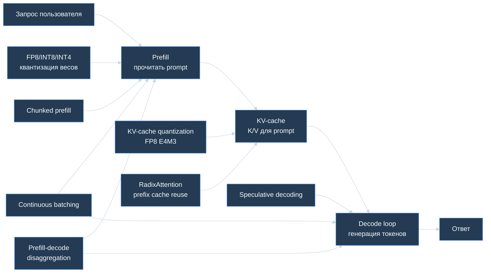

# ⚡ Быстрая генерация LLM — batching, prefill, KV-cache и speculative decoding

> [!abstract] Суть
> Быстрая генерация LLM — это не одна техника, а набор оптимизаций вокруг **двух фаз inference**: `prefill`, где модель читает prompt и строит KV-cache, и `decode`, где она генерирует ответ по одному токену. Одни методы уменьшают память, другие повышают throughput, третьи уменьшают latency первого токена или ускоряют каждый следующий токен.

---

## 🧭 Главная карта: что именно ускоряем



> [!tip] Быстрая диагностика
> Если медленно появляется **первый токен**, смотри `prefill`, длинные prompts, prefix cache и chunked prefill. Если медленно печатается **ответ**, смотри decode, KV-cache, batching, speculative decoding и memory bandwidth.

---

## 1. Метрики LLM serving

| Метрика | Что измеряет | Почему важна |
|---|---|---|
| **TTFT** (`time to first token`) | время до первого токена | пользователь чувствует как "модель думает" |
| **TPOT / ITL** (`time per output token`, `inter-token latency`) | время между токенами | пользователь чувствует как скорость печати |
| **E2E latency** | полное время запроса | важно для SLA |
| **Throughput** | токены/сек или запросы/сек | важно для стоимости и загрузки GPU |
| **GPU utilization** | насколько занята GPU | низкая загрузка = деньги горят впустую |
| **KV-cache hit rate** | доля переиспользованного cache | важно для prefix caching / RadixAttention |

Упрощённо:

$$\Large T_{\text{request}} \approx T_{\text{queue}} + T_{\text{prefill}} + N_{\text{out}}\cdot T_{\text{decode-token}}$$

где:
- $T_{\text{queue}}$ — ожидание в очереди scheduler;
- $T_{\text{prefill}}$ — время обработки prompt;
- $N_{\text{out}}$ — число сгенерированных токенов;
- $T_{\text{decode-token}}$ — среднее время генерации одного нового токена.

---

## 2. Prefill vs Decode

### Prefill

`Prefill` — модель получает весь prompt и строит hidden states + KV-cache для входных токенов.

Особенности:
- хорошо параллелится по токенам prompt;
- часто compute-bound на больших prompt;
- сильно влияет на TTFT;
- длинный RAG-контекст делает prefill дорогим;
- если несколько запросов имеют общий prefix, его можно переиспользовать.

### Decode

`Decode` — авторегрессионная генерация по одному токену.

Особенности:
- каждый шаг зависит от предыдущего токена;
- часто memory-bandwidth-bound: нужно читать веса и KV-cache;
- сильно влияет на TPOT/ITL;
- при многих пользователях главным ограничением становится KV-cache;
- batching сложнее, потому что запросы заканчиваются в разное время.

> [!important] Интервьюерская формулировка
> Prefill похож на "прочитать условие задачи", decode — на "писать решение по одному слову". Оптимизации для этих фаз разные, потому что bottleneck разный.

---

## 3. FP8 квантизация весов

**FP8 quantization** хранит веса, активации или cache в 8-битном floating point формате. В LLM serving это используют, чтобы уменьшить:
- VRAM под веса;
- memory bandwidth;
- время GEMM на GPU с быстрыми FP8 kernels.

Типичная идея:

$$\Large W_{\text{fp8}} = \text{Quantize}(W_{\text{fp16}}, s)$$

$$\Large y \approx \text{MatMul}(\text{Dequantize}(W_{\text{fp8}}, s), x)$$

где:
- $W_{\text{fp16}}$ — исходные веса;
- $W_{\text{fp8}}$ — веса в FP8;
- $s$ — scale для восстановления масштаба;
- $x$ — входные активации;
- $y$ — выход слоя.

### Когда FP8 особенно полезен

| Сценарий | Почему помогает |
|---|---|
| модель большая и упирается в bandwidth | меньше байт читать из HBM |
| GPU поддерживает FP8 kernels | H100/H200/B200 и свежие inference runtimes |
| batch достаточно большой | лучше утилизируются матричные ядра |
| качество устойчиво к quantization noise | меньше риск деградации |

### Нюансы

- FP8 не магически ускоряет всё: нужен runtime с поддержкой kernels.
- Качество нужно проверять на production-like eval.
- Для старых GPU FP16/BF16 или INT8/INT4 могут быть практичнее.
- Для LLM часто отдельно обсуждают **weight quantization** и **KV-cache quantization**.

---

## 4. Continuous Batching

Обычный static batching работает грубо:
1. набрали batch запросов;
2. ждём, пока весь batch закончит шаг;
3. медленный/длинный запрос тормозит остальных.

**Continuous batching** делает scheduler на уровне итераций генерации. Если один запрос закончил, его место в running batch может занять новый запрос, не дожидаясь завершения всех остальных.

```text
static batching:
[A A A A A done]
[B B B done idle idle]
[C C C C C C]

continuous batching:
step 1: A B C
step 2: A B C
step 3: A C D   <- B finished, D entered
step 4: A C D
```

### Что даёт

- выше GPU utilization;
- выше throughput;
- меньше простой из-за запросов разной длины;
- лучше подходит для real-time serving.

### Компромиссы

- scheduler сложнее;
- latency отдельного запроса может зависеть от политики очереди;
- нужен контроль admission: нельзя бесконечно добавлять запросы, если KV-cache уже забил VRAM.

---

## 5. Chunked Prefill

Длинный prompt может занять GPU на prefill так, что короткие decode-запросы начнут ждать. Это портит inter-token latency у уже активных пользователей.

**Chunked prefill** режет prefill длинного prompt на куски и перемежает их с decode-шагами других запросов.

```text
без chunked prefill:
LONG_PREFILL_LONG_PREFILL_LONG_PREFILL -> decode users wait

с chunked prefill:
prefill chunk -> decode -> prefill chunk -> decode -> prefill chunk
```

### Когда полезно

- RAG с длинными contexts;
- много одновременных пользователей;
- нужно не убивать latency уже идущих генераций;
- prompts сильно различаются по длине.

### Нюансы

- слишком маленький chunk повышает scheduling overhead;
- слишком большой chunk снова блокирует decode;
- оптимальный размер зависит от модели, GPU, batch и длины prompts.

---

## 6. Prefill-Decode Disaggregation

**Prefill-decode disaggregation** разделяет prefill и decode на разные worker pools или даже разные GPU.

Почему это логично:

| Фаза | Частый bottleneck | Что нужно |
|---|---|---|
| Prefill | compute / GEMM | быстро обработать большой prompt |
| Decode | memory bandwidth / KV-cache | стабильно генерировать токены |

Пайплайн:

```text
client
  -> prefill worker: prompt -> KV-cache
  -> cache transfer / routing
  -> decode worker: generate tokens
```

### Когда подходит

- production с высокой нагрузкой;
- много длинных prompts;
- нужно независимо масштабировать prefill и decode;
- заметен конфликт: long prefill портит TPOT у decode.

### Цена

- сложнее архитектура;
- нужно передавать/шардировать KV-cache;
- появляется network/IPC overhead;
- сложнее дебажить latency.

---

## 7. KV-cache и квантизация E4M3

KV-cache хранит Key и Value для прошлых токенов на каждом слое, чтобы не пересчитывать историю при генерации нового токена.

Грубая оценка памяти:

$$\Large M_{\text{KV}} \approx 2 \cdot L \cdot B \cdot T \cdot H_{\text{kv}} \cdot d_{\text{head}} \cdot bytes$$

где:
- $2$ — отдельно Key и Value;
- $L$ — число слоёв;
- $B$ — число активных последовательностей;
- $T$ — длина сохранённого контекста;
- $H_{\text{kv}}$ — число KV-heads;
- $d_{\text{head}}$ — размерность одной head;
- $bytes$ — байт на одно число (`2` для FP16/BF16, `1` для FP8).

**FP8 E4M3** — 8-битный floating point формат: 1 sign bit, 4 exponent bits, 3 mantissa bits. Для KV-cache он часто используется как компромисс: примерно в 2 раза меньше памяти, чем FP16/BF16, но с меньшей точностью.

### Что даёт KV-cache quantization

- больше одновременных сессий в той же VRAM;
- длиннее контекст при том же лимите памяти;
- выше throughput, если bottleneck был в cache capacity;
- иногда ниже latency за счёт меньшего memory traffic.

### Важный нюанс

Если attention kernel не умеет работать с quantized KV-cache напрямую, cache придётся dequantize отдельно. Тогда overhead может съесть выигрыш. Поэтому нужно проверять поддержку в backend: FlashAttention/FlashInfer/TensorRT-LLM/SGLang/vLLM и конкретной GPU.

---

## 8. PagedAttention и paged KV-cache

Проблема обычного KV-cache: запросы имеют разную длину, память фрагментируется, часть VRAM простаивает.

**PagedAttention** хранит KV-cache блоками, похожими на страницы виртуальной памяти. Логический cache последовательности может быть разбросан по физическим блокам GPU memory.

```text
request A tokens: [page 7] -> [page 2] -> [page 9]
request B tokens: [page 1] -> [page 5]
```

Плюсы:
- меньше фрагментация;
- проще continuous batching;
- выше cache utilization;
- легче обслуживать запросы разной длины.

---

## 9. RadixAttention

**RadixAttention** — идея SGLang для автоматического переиспользования KV-cache у запросов с общими префиксами.

Интуиция:

```text
Запрос 1: "Ты помощник. Документ: ... Вопрос: A"
Запрос 2: "Ты помощник. Документ: ... Вопрос: B"

общий prefix: "Ты помощник. Документ: ..."
```

Если prefix одинаковый, KV-cache для него тоже одинаковый. RadixAttention хранит такие prefix spans в radix tree и переиспользует уже построенный cache.

### Где особенно полезно

- multi-turn chat, где история повторяется;
- agentic workflows с одинаковыми system prompts;
- RAG, где несколько вопросов идут по одному документу;
- structured generation с branching;
- batch задач с общим instruction prefix.

### Ограничения

- prefix должен совпадать токен-в-токен;
- cache занимает память, нужна eviction policy;
- при нескольких replicas cache hit rate может падать без session affinity;
- не ускоряет запросы без общих префиксов.

---

## 10. Speculative Decoding

**Speculative decoding** ускоряет decode фазу: маленькая draft-модель быстро предлагает несколько следующих токенов, а большая target-модель проверяет их пачкой.

Пайплайн:

```text
draft model:  предлагает токены t1, t2, t3, t4
target model: проверяет их одним батчевым forward
accepted:     t1, t2, t3
rejected:     t4 -> генерируем корректный токен target-моделью
```

Почему это может ускорять:
- target-модель всё равно дорогая;
- проверить несколько draft-токенов за один проход часто дешевле, чем генерировать их строго по одному;
- если acceptance rate высокий, за один дорогой шаг получаем несколько токенов.

Упрощённая оценка:

$$\Large speedup \uparrow \quad \text{если} \quad acceptance\_rate \uparrow \;\; \text{и} \;\; cost_{\text{draft}} \ll cost_{\text{target}}$$

### Когда хорошо работает

- draft-модель похожа на target-модель;
- задача не слишком хаотичная;
- temperature низкая или умеренная;
- ответы достаточно длинные;
- runtime умеет эффективную verification.

### Когда может не помочь

- короткие ответы;
- высокая temperature;
- draft часто ошибается;
- target и draft слишком разные;
- overhead scheduler и extra model memory больше выигрыша.

---

## 11. Как выбрать подход

| Симптом | На что смотреть первым |
|---|---|
| высокий TTFT | chunked prefill, prefix cache/RadixAttention, prefill GPU pool |
| медленно печатает токены | speculative decoding, KV-cache quantization, GQA/MQA, continuous batching |
| GPU простаивает | continuous batching, larger batch, scheduler tuning |
| VRAM забита при многих пользователях | paged KV-cache, FP8 KV-cache, GQA/MQA, context limits |
| RAG с длинными документами тормозит | chunked prefill, prompt compression, prefix cache, retrieval top-k |
| много одинаковых system prompts | RadixAttention/prefix caching |
| нужно выжать максимум на NVIDIA GPU | TensorRT-LLM, FP8, fused kernels, CUDA graphs |
| нужен гибкий open-source serving | vLLM или SGLang |

---

## 12. Мини-ответ для собеседования

> [!quote]
> Быструю генерацию LLM надо разбирать по фазам. На prefill модель читает prompt и строит KV-cache, поэтому длинный контекст бьёт по TTFT; здесь помогают chunked prefill, prefix caching и иногда разделение prefill/decode worker pools. На decode модель генерирует по одному токену и часто упирается в memory bandwidth и KV-cache; здесь помогают continuous batching, paged KV-cache, KV-cache quantization, GQA/MQA и speculative decoding. FP8/INT8/INT4 уменьшают память и bandwidth, но реальный speedup зависит от GPU, kernels и качества quantization.

---

## Проверка себя

- Чем `prefill` отличается от `decode` по bottleneck?
- Почему continuous batching лучше static batching для запросов разной длины?
- Почему KV-cache ускоряет compute, но увеличивает память?
- В каких задачах RadixAttention даст большой выигрыш?
- Почему speculative decoding зависит от acceptance rate?
- Почему FP8 KV-cache может не ускорить inference без fused attention kernel?

---

## Связано

- [[NLP/LLM и Промпт-инжиниринг/Архитектура Transformer в LLM — Attention, MHA и KV-cache]]
- [[NLP/LLM и Промпт-инжиниринг/RAG — генерация, оценка качества и production]]
- [[NLP/LLM и Промпт-инжиниринг/Сжатие языковых моделей (Distillation, Quantization, Pruning, LoRA)]]
- [[Deep Learning/Обучение/Инференс и производительность DL]]

---

## Источники

- [vLLM documentation](https://docs.vllm.ai/en/stable/index.html)
- [SGLang documentation](https://docs.sglang.io/)
- [SGLang HiCache design: RadixAttention and prefix KV-cache reuse](https://docs.sglang.io/advanced_features/hicache_design.html)
- [SGLang Quantized KV Cache](https://docs.sglang.io/advanced_features/quantized_kv_cache.html)
- [TensorRT-LLM Quantization](https://nvidia.github.io/TensorRT-LLM/latest/features/quantization.html)

---

[[NLP/🏠 Главная|Назад к NLP]]
