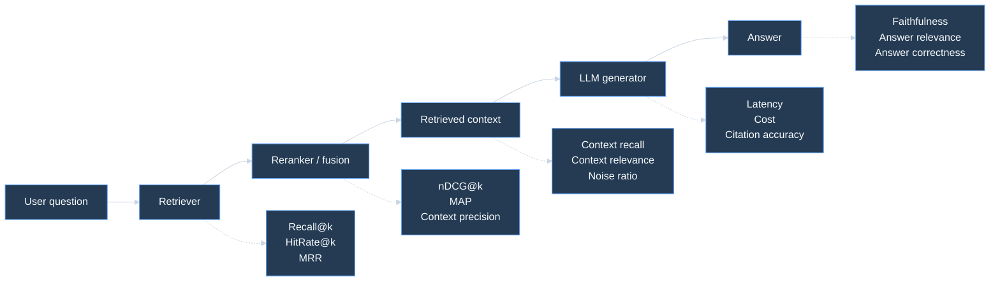

# 📏 Метрики RAG-систем — retrieval, generation, faithfulness и RAGAS

> [!abstract] Суть
> RAG нельзя оценивать одной метрикой. В RAG есть минимум три разных места, где система может сломаться: **retriever не нашёл нужный контекст**, **reranker плохо упорядочил чанки**, **LLM ответила не по контексту или исказила факт**. Поэтому метрики нужно раскладывать по этапам pipeline.

---

## 1. Где именно измеряем качество



> [!tip] Главное правило
> Если ответ плохой, сначала проверь: **нужный факт вообще был в retrieved context?** Если нет, генератор почти ни при чём. Если да, проблема уже в prompt/generation/faithfulness.

---

## 2. Какие данные нужны для разных метрик

| Что есть в eval set | Какие метрики доступны | Насколько надёжно |
|---|---|---|
| вопрос + релевантные документы/chunks | `Recall@k`, `MRR`, `nDCG`, context recall | хорошо для retrieval |
| вопрос + эталонный ответ | answer correctness, semantic similarity | хорошо для final answer |
| вопрос + context + ответ RAG | faithfulness, answer relevance через judge | можно без golden answer |
| вопрос + context + эталонный ответ + ответ RAG | почти все offline metrics | лучший вариант |
| только production logs | user feedback, click signals, LLM-as-judge, drift | полезно, но шумно |

---

## 3. Retrieval-метрики: нашёл ли RAG нужный материал

### Precision@k

**Precision@k** отвечает: какая доля top-k результатов релевантна?

$$\Large Precision@k = \frac{\#\text{релевантных документов в top-k}}{k}$$

где:
- $k$ — сколько результатов смотрим;
- $\#\text{релевантных документов в top-k}$ — число найденных релевантных чанков среди первых $k$.

**Пример.**

Retriever вернул top-5:

```text
rank:      1  2  3  4  5
relevant:  1  0  1  0  0
```

$$\Large Precision@5 = \frac{2}{5}=0.4$$

**Когда полезна:** когда контекстное окно маленькое и важно не тащить шум в prompt.

**Нюанс:** высокий `Precision@k` не гарантирует, что найден **весь** нужный контекст. Можно найти один хороший chunk, но пропустить вторую половину ответа.

---

### Recall@k

**Recall@k** отвечает: какую долю всех релевантных документов мы нашли в top-k?

$$\Large Recall@k = \frac{\#\text{релевантных документов в top-k}}{\#\text{всех релевантных документов}}$$

где:
- числитель — сколько релевантных документов попало в top-k;
- знаменатель — сколько релевантных документов известно в разметке.

**Пример.**

Всего для вопроса есть 4 релевантных chunk. В top-5 попали 2.

$$\Large Recall@5 = \frac{2}{4}=0.5$$

**Когда полезна:** когда ошибка пропуска опаснее шума. Например, юридический/банковский RAG: если нужный пункт регламента не найден, LLM не сможет ответить корректно.

**Нюанс:** `Recall@k` растёт при увеличении `k`, но большой `top_k` может забить prompt мусором и ухудшить генерацию.

---

### Hit Rate@k

**Hit Rate@k** отвечает: попал ли хотя бы один релевантный документ в top-k?

$$\Large HitRate@k = \frac{1}{|Q|}\sum_{q \in Q} \mathbb{1}[\text{есть релевантный документ в top-k}]$$

где:
- $Q$ — множество вопросов;
- $\mathbb{1}[\cdot]$ — индикатор: `1`, если условие выполнено, иначе `0`.

**Пример.**

Для 5 вопросов релевантный chunk попал в top-3 у 4 вопросов:

$$\Large HitRate@3 = \frac{4}{5}=0.8$$

**Когда полезна:** когда для ответа часто достаточно одного хорошего chunk.

**Нюанс:** Hit Rate не показывает, насколько высоко стоит релевантный chunk и сколько шума рядом.

---

### MRR

**MRR** (`Mean Reciprocal Rank`) оценивает позицию первого релевантного результата.

$$\Large MRR = \frac{1}{|Q|}\sum_{q \in Q}\frac{1}{rank_q}$$

где:
- $Q$ — набор вопросов;
- $rank_q$ — позиция первого релевантного результата для вопроса $q$;
- если релевантного результата нет, вклад обычно считают `0`.

**Пример.**

```text
question 1: первый релевантный на rank 1 -> 1/1 = 1.00
question 2: первый релевантный на rank 2 -> 1/2 = 0.50
question 3: первый релевантный на rank 5 -> 1/5 = 0.20
```

$$\Large MRR = \frac{1.00 + 0.50 + 0.20}{3}=0.567$$

**Когда полезна:** когда пользователь/LLM особенно сильно зависит от самого верхнего результата. Например, `top_k=3`, а prompt в основном использует первый chunk.

**Нюанс:** MRR почти не интересуется вторым, третьим и последующими релевантными документами. Для multi-hop вопросов этого может быть мало.

---

### AP и MAP

**Average Precision (AP)** учитывает качество ранжирования по всем релевантным результатам.

$$\Large AP(q)=\frac{1}{R_q}\sum_{k=1}^{K} Precision@k \cdot rel_k$$

где:
- $q$ — один вопрос;
- $R_q$ — число релевантных документов для вопроса;
- $K$ — глубина ранжирования;
- $rel_k$ — `1`, если документ на позиции $k$ релевантен, иначе `0`;
- $Precision@k$ — precision среди первых $k$ результатов.

**MAP** — среднее AP по вопросам:

$$\Large MAP = \frac{1}{|Q|}\sum_{q \in Q} AP(q)$$

**Пример.**

Top-5:

```text
rank:      1  2  3  4  5
relevant:  1  0  1  0  1
```

Тогда:

$$\Large AP = \frac{Precision@1 + Precision@3 + Precision@5}{3}
= \frac{1 + \frac{2}{3} + \frac{3}{5}}{3}
\approx 0.756$$

**Когда полезна:** когда у вопроса может быть несколько релевантных чанков и важен общий порядок.

---

### DCG и nDCG

**nDCG** полезна, когда релевантность не бинарная, а graded: например, `0 = не подходит`, `1 = частично`, `2 = полезно`, `3 = идеально`.

Сначала считаем DCG:

$$\Large DCG@k = \sum_{i=1}^{k}\frac{2^{rel_i}-1}{\log_2(i+1)}$$

где:
- $i$ — позиция результата;
- $rel_i$ — relevance grade результата на позиции $i$;
- знаменатель штрафует документы, которые стоят ниже.

Затем нормируем на идеальное ранжирование:

$$\Large nDCG@k = \frac{DCG@k}{IDCG@k}$$

где:
- $IDCG@k$ — DCG@k для идеального порядка результатов.

**Пример.**

Релевантность top-3:

```text
rank:       1  2  3
rel_i:      3  1  2
ideal rel:  3  2  1
```

$$\Large DCG@3 =
\frac{2^3-1}{\log_2(2)}+
\frac{2^1-1}{\log_2(3)}+
\frac{2^2-1}{\log_2(4)}
\approx 7 + 0.63 + 1.5 = 9.13$$

$$\Large IDCG@3 =
7 + \frac{3}{\log_2(3)} + \frac{1}{2}
\approx 9.39$$

$$\Large nDCG@3 \approx \frac{9.13}{9.39}=0.972$$

**Когда полезна:** когда есть ручная разметка степени полезности chunk, а не только `relevant / not relevant`.

**Нюанс:** nDCG сложнее объяснять бизнесу, но она хорошо отражает качество ранжирования.

---

## 4. Context-метрики: хороший ли контекст ушёл в LLM

Retrieval-метрики обычно смотрят на документы/chunks как результаты поиска. Context-метрики смотрят на то, что реально попало в prompt.

### Context Precision

**Context Precision** отвечает: насколько retrieved context не зашумлён?

Простая версия:

$$\Large ContextPrecision = \frac{\#\text{релевантных context chunks}}{\#\text{retrieved context chunks}}$$

RAGAS-подобная версия часто похожа на average precision: релевантные chunks выше в списке дают больший вклад.

$$\Large ContextPrecision@K = \frac{1}{R_K}\sum_{k=1}^{K} Precision@k \cdot v_k$$

где:
- $K$ — число retrieved chunks;
- $v_k$ — `1`, если chunk на позиции $k$ полезен для ответа, иначе `0`;
- $R_K = \sum_{k=1}^{K} v_k$ — число полезных chunks в top-K.

**Пример.**

В prompt ушло 5 чанков, полезны 1-й и 4-й:

```text
rank:     1  2  3  4  5
useful:   1  0  0  1  0
```

Простая версия:

$$\Large ContextPrecision = \frac{2}{5}=0.4$$

Average-precision версия:

$$\Large \frac{Precision@1 + Precision@4}{2}
= \frac{1 + \frac{2}{4}}{2}=0.75$$

**Интерпретация:** простая precision говорит "шума много"; AP-like precision говорит "важные chunks стоят достаточно высоко".

---

### Context Recall

**Context Recall** отвечает: весь ли необходимый материал попал в context?

Если есть эталонные supporting facts:

$$\Large ContextRecall = \frac{\#\text{покрытых необходимых фактов}}{\#\text{всех необходимых фактов}}$$

где:
- покрытый факт — факт, который можно найти в retrieved context;
- необходимые факты — факты, без которых нельзя корректно ответить.

**Пример.**

Чтобы ответить на вопрос, нужны 3 факта:

```text
F1: тариф действует с 01.06
F2: лимит 100 000 рублей
F3: исключение для премиум-клиентов
```

Retriever принёс контекст с F1 и F2, но без F3:

$$\Large ContextRecall = \frac{2}{3}=0.667$$

**Когда полезна:** для multi-hop и регламентных вопросов, где ответ должен собрать несколько условий.

**Нюанс:** высокий context recall может сопровождаться низкой context precision: нужные факты есть, но вокруг много мусора.

---

### Context Relevance

**Context Relevance** оценивает, относится ли retrieved context к вопросу.

Обычно это judge-based score:

```text
question + chunk -> LLM judge -> relevance score
```

Можно считать среднее:

$$\Large ContextRelevance = \frac{1}{K}\sum_{i=1}^{K} score(q, c_i)$$

где:
- $q$ — вопрос;
- $c_i$ — i-й retrieved chunk;
- $score(q,c_i)$ — оценка релевантности chunk к вопросу.

**Когда полезна:** когда нет golden docs, но хочется быстро найти мусорные retrieval cases.

---

## 5. Answer-метрики: хороший ли финальный ответ

### Faithfulness / Groundedness

**Faithfulness** отвечает: все ли утверждения в ответе поддержаны retrieved context?

Практический способ:
1. разбить ответ на atomic claims;
2. для каждого claim проверить, поддерживается ли он контекстом;
3. посчитать долю поддержанных claims.

$$\Large Faithfulness = \frac{\#\text{claims supported by context}}{\#\text{claims in answer}}$$

**Пример.**

Ответ:

```text
Клиент может получить кредит до 100 000 рублей.
Ставка 5%.
Решение принимается за 1 день.
```

В контексте есть только лимит и срок, но ставки нет:

```text
claims: 3
supported: 2
```

$$\Large Faithfulness = \frac{2}{3}=0.667$$

**Когда важна:** почти всегда в RAG. Особенно в медицине, финансах, юриспруденции, корпоративных регламентах.

**Нюанс:** faithfulness не говорит, что ответ полный или полезный. Модель может честно ответить только на половину вопроса.

---

### Answer Relevance / Response Relevancy

**Answer Relevance** отвечает: ответ вообще отвечает на заданный вопрос?

Схематично:

$$\Large AnswerRelevance = score(q, a)$$

где:
- $q$ — вопрос пользователя;
- $a$ — ответ модели;
- $score$ — judge score или semantic similarity.

**Пример.**

Вопрос: "Какие документы нужны для ипотеки?"

Плохой, но faithful ответ:

```text
В документе говорится, что заявка рассматривается до 3 дней.
```

Он может быть grounded, но нерелевантен вопросу.

**Когда полезна:** когда модель уходит в сторону, отвечает слишком общо или пересказывает найденный context вместо ответа.

---

### Answer Correctness

**Answer Correctness** сравнивает ответ RAG с эталонным ответом.

Можно считать через:
- human label;
- LLM judge;
- semantic similarity;
- fact-level matching;
- task-specific checker.

Упрощённо:

$$\Large AnswerCorrectness = score(a_{\text{pred}}, a_{\text{gold}})$$

где:
- $a_{\text{pred}}$ — ответ RAG;
- $a_{\text{gold}}$ — эталонный ответ.

**Когда полезна:** когда есть golden dataset с правильными ответами.

**Нюанс:** answer correctness может быть высокой даже при плохом retrieval, если LLM знала ответ из параметрической памяти. Поэтому её лучше смотреть вместе с faithfulness.

---

### Citation Accuracy

Если RAG должен давать ссылки на источники, отдельно проверяют citations.

Возможные метрики:

$$\Large CitationPrecision = \frac{\#\text{цитат, реально поддерживающих утверждения}}{\#\text{всех цитат}}$$

$$\Large CitationRecall = \frac{\#\text{утверждений с корректной цитатой}}{\#\text{утверждений, требующих цитату}}$$

**Когда важна:** корпоративные базы знаний, юридические ответы, техническая документация.

---

## 6. RAGAS и RAGAS-like подход

RAGAS-подобные метрики обычно смотрят на несколько сторон:

| Измерение | Типичные метрики | Что ловит |
|---|---|---|
| Retrieval/context | context precision, context recall | нашёл ли нужные факты и не принёс ли мусор |
| Faithfulness | faithfulness/groundedness | галлюцинации относительно context |
| Answer quality | answer relevancy, answer correctness, answer accuracy | отвечает ли модель правильно и по вопросу |

Главная идея: часть метрик можно считать **без эталонного ответа**, используя вопрос, retrieved context и ответ модели.

```text
question
retrieved_context
generated_answer
      -> LLM judge / embeddings / heuristics
      -> scores
```

### Что можно без golden answer

| Метрика | Нужен golden answer? | Что нужно |
|---|---:|---|
| Faithfulness | нет | question + context + answer |
| Answer relevance | нет | question + answer |
| Context relevance | нет | question + context |
| Context precision | иногда нет, если judge размечает relevance | question + context |
| Context recall | чаще да, но можно через synthetic facts | reference facts или pseudo-gold |
| Answer correctness | да | reference answer |

> [!warning] Важное ограничение
> LLM-as-judge — это не истина. Judge может быть смещён, переоценивать красивые ответы, плохо проверять числа и зависеть от prompt. Его нужно калибровать на небольшой ручной разметке.
> Подробно: [[NLP/LLM и Промпт-инжиниринг/LLM-as-a-Judge — rubric, bias и дообучение]].

---

## 7. Метрики без Golden Dataset

Если golden dataset нет, нормальный путь такой:

1. Взять реальные production/staging queries.
2. Разметить маленький seed set вручную: 50-200 вопросов.
3. Сгенерировать synthetic questions из документов.
4. Использовать source chunk как pseudo-gold для retrieval.
5. Проверять faithfulness/answer relevance через LLM judge.
6. Делать pairwise сравнение двух конфигураций.
7. Постепенно пополнять golden set ошибками из production.

### Synthetic retrieval eval

Берём chunk:

```text
chunk: "Для премиум-клиентов лимит перевода составляет 500 000 рублей."
```

Генерируем вопрос:

```text
question: "Какой лимит перевода у премиум-клиентов?"
```

Теперь source chunk считается pseudo-relevant. Можно считать `Recall@k`, `MRR`, `nDCG`.

**Нюанс:** synthetic questions часто слишком похожи на документ, поэтому retrieval может казаться лучше, чем на реальных пользовательских вопросах.

---

## 8. Production-метрики RAG

Offline eval не заменяет production monitoring.

| Метрика | Что показывает |
|---|---|
| `empty retrieval rate` | как часто retriever ничего не нашёл |
| `low confidence rate` | доля запросов с низким score/relevance |
| `no-answer/refusal rate` | как часто модель говорит "нет данных" |
| `unsupported answer rate` | доля ответов без опоры на context |
| `citation coverage` | доля ответов с источниками |
| `latency p50/p95/p99` | пользовательская задержка |
| `cost per answer` | стоимость retrieval + generation |
| `tokens in/out` | расход контекста и генерации |
| `user feedback` | лайки, дизлайки, исправления, escalation |
| `topic drift` | меняются ли типы запросов |

Для RAG важно мониторить не только LLM:

```text
ingestion errors -> chunking quality -> index freshness -> retrieval -> reranking -> generation -> citations
```

---

## 9. Как выбирать метрики под задачу

| Сценарий                   | Главные метрики                                     | Почему                                   |
| -------------------------- | --------------------------------------------------- | ---------------------------------------- |
| FAQ bot                    | HitRate@k, MRR, answer relevance                    | часто нужен один правильный документ     |
| поиск по регламентам       | Recall@k, context recall, faithfulness              | нельзя пропустить важный пункт           |
| юридический/финансовый RAG | faithfulness, citation accuracy, answer correctness | критична доказуемость ответа             |
| RAG по длинным документам  | context precision, nDCG, latency                    | много шума и длинный prompt              |
| multi-hop вопросы          | context recall, nDCG, answer correctness            | нужно собрать несколько фактов           |
| сравнение retrievers       | Recall@k, MRR, nDCG                                 | генератор лучше выключить из оценки      |
| сравнение prompts          | faithfulness, answer relevance, refusal quality     | retrieval фиксирован, меняется генерация |
| production monitoring      | p95/p99 latency, cost, empty retrieval, feedback    | качество + экономика                     |

---

## 10. Как диагностировать ошибку по метрикам

| Симптом | Вероятная причина | Что смотреть |
|---|---|---|
| `Recall@k` низкий | плохой retriever/chunking/embedding | embedding model, chunk size, hybrid search |
| `MRR` низкий, `Recall@k` норм | нужный chunk найден, но низко | reranker, RRF weights, metadata boost |
| `Context precision` низкий | prompt забит мусором | reranking, top_k, filters, compression |
| `Context recall` низкий | не хватает фактов | parent-child retrieval, top_k, multi-query |
| `Faithfulness` низкий | LLM галлюцинирует | prompt, citations, stricter grounding |
| `Answer relevance` низкий | ответ ушёл от вопроса | prompt, query rewrite, instruction style |
| `Answer correctness` низкий при high faithfulness | context неполный или эталон сложный | retrieval recall, source quality |
| latency высокая | слишком длинный context/model | top_k, prompt compression, serving optimizations |

---

## 11. Мини-пример end-to-end

Вопрос:

```text
Можно ли закрыть вклад досрочно без потери процентов?
```

Retriever вернул top-4:

```text
1. chunk про досрочное закрытие вклада      relevant = 1
2. chunk про дебетовые карты                relevant = 0
3. chunk про капитализацию процентов        relevant = 1
4. chunk про ипотеку                        relevant = 0
```

### Retrieval

$$\Large Precision@4=\frac{2}{4}=0.5$$

Если всего релевантных chunk в базе 2:

$$\Large Recall@4=\frac{2}{2}=1.0$$

Первый релевантный chunk на rank 1:

$$\Large RR=\frac{1}{1}=1.0$$

### Context

Контекст полный, но шумный:

```text
context recall = high
context precision = medium
```

### Generation

Ответ:

```text
Да, вклад можно закрыть досрочно без потери процентов.
```

Но в контексте сказано:

```text
При досрочном закрытии проценты пересчитываются по ставке до востребования.
```

Тогда:

```text
faithfulness = low
answer correctness = low
```

Вывод: retriever нашёл нужный материал, проблема в генерации или prompt grounding.

---

## 12. Если нет Golden Dataset

Минимальный практичный план:

1. Собрать `100` реальных вопросов из логов.
2. Для каждого сохранить retrieved chunks и final answer.
3. Руками разметить хотя бы:
   - был ли нужный context;
   - ответил ли RAG правильно;
   - есть ли unsupported claims.
4. Параллельно запустить LLM-as-judge.
5. Сравнить judge с ручной разметкой.
6. Если корреляция приемлемая, использовать judge для широкого мониторинга.
7. Все спорные/плохие cases добавлять в golden set.

> [!note] Хороший golden set растёт из ошибок
> Не пытайся сразу собрать идеальные 10 000 вопросов. Для RAG часто полезнее 200 хорошо размеченных болезненных кейсов, чем 5000 синтетических вопросов без реального пользовательского языка.

---

## 13. Типичные ошибки

- **Оценивать только answer correctness:** так непонятно, кто виноват — retriever или generator.
- **Смотреть Recall@k без context precision:** можно найти нужный chunk и одновременно принести много мусора.
- **Увеличивать top_k ради recall:** иногда это ухудшает answer faithfulness.
- **Считать RAGAS заменой ручной разметки:** judge нужно калибровать.
- **Смешивать offline retrieval eval и final answer eval:** это разные уровни.
- **Не фиксировать версию индекса:** eval становится невоспроизводимым.
- **Не проверять freshness документов:** retriever может быть хорошим, но индекс устарел.
- **Игнорировать latency/cost:** качественный RAG, который слишком дорогой или медленный, не production-ready.

---

## 14. Короткий ответ для собеседования

> [!quote]
> RAG оценивают по слоям. Для retrieval смотрят Recall@k, Precision@k, MRR, nDCG: нашёл ли retriever нужные chunks и насколько высоко их поставил. Для context quality смотрят context precision и context recall: не зашумлён ли prompt и все ли нужные факты попали в контекст. Для generation смотрят faithfulness/groundedness, answer relevance, answer correctness и citation accuracy. Если golden dataset нет, можно использовать RAGAS-like LLM-as-judge и synthetic questions, но обязательно калибровать это на небольшой ручной разметке.

---

## Проверка себя

- Чем `Recall@k` отличается от `HitRate@k`?
- Почему `MRR` недостаточен для multi-hop RAG?
- Когда `nDCG` лучше `MRR`?
- Почему высокий context recall может ухудшить answer quality?
- Чем faithfulness отличается от answer correctness?
- Какие RAG-метрики можно считать без эталонного ответа?
- Почему LLM-as-judge нельзя считать абсолютной истиной?

---

## Связано

- [[NLP/LLM и Промпт-инжиниринг/RAG — генерация, оценка качества и production]]
- [[NLP/LLM и Промпт-инжиниринг/RAG — retrieval, hybrid search, RRF и embeddings]]
- [[NLP/LLM и Промпт-инжиниринг/RAG — документы, OCR и чанкинг]]
- [[NLP/LLM и Промпт-инжиниринг/Метрики оценки NLP-моделей (Perplexity, BLEU, ROUGE, BERTScore, GLUE)]]
- [[NLP/LLM и Промпт-инжиниринг/Оценка LLM-ответов — relevance, completeness, factuality и safety]]
- [[NLP/LLM и Промпт-инжиниринг/LLM-as-a-Judge — rubric, bias и дообучение]]
- [[NLP/🧭 Карта NLP и LLM]]

---

## Источники

- [RAGAS metrics documentation](https://docs.ragas.io/en/stable/concepts/metrics/available_metrics/)
- [RAGAS: Automated Evaluation of Retrieval Augmented Generation](https://arxiv.org/abs/2309.15217)
- [Stanford IR book: Evaluation of ranked retrieval results](https://nlp.stanford.edu/IR-book/html/htmledition/evaluation-of-ranked-retrieval-results-1.html)
- [Stanford IR book: Evaluation of unranked retrieval sets](https://nlp.stanford.edu/IR-book/html/htmledition/evaluation-of-unranked-retrieval-sets-1.html)
- [TruLens RAG Triad](https://www.trulens.org/getting_started/core_concepts/rag_triad/)
- [DeepEval Faithfulness metric](https://deepeval.com/docs/metrics-faithfulness)

---

[[NLP/🏠 Главная|Назад к NLP]]
