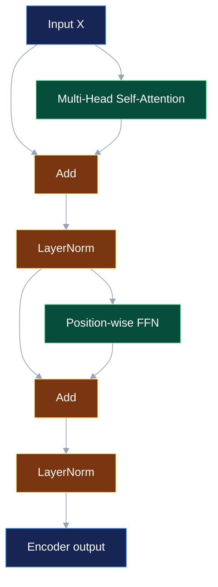
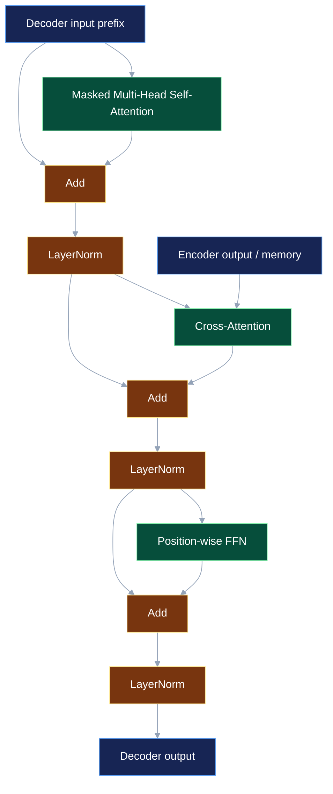
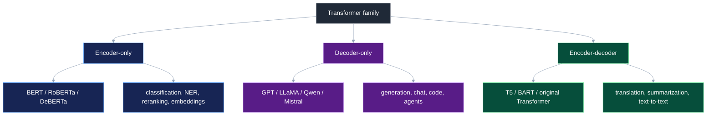

---
tags: [nlp, transformer, attention, encoder, decoder, self-attention, cross-attention, layernorm, residual, ffn]
тип: теория
уровень: middle-to-senior
сложность: высокая
статус: готово
готовность: 90
создано: 2026-06-01
источники:
  - "Attention Is All You Need — Vaswani et al., 2017"
  - "The Annotated Transformer — Harvard NLP"
  - "Wikimedia Commons — Transformer one encoder-decoder block"
предпосылки:
  - "Механизм внимания (Attention и Self-Attention)"
  - "Архитектура Seq2Seq (Энкодер-Декодер)"
  - "Токенизация текста — методы и эволюция"
связано:
  - "Архитектура Transformer в LLM — Attention, MHA и KV-cache"
  - "Современные LLM (BERT vs GPT) — тонкости обучения"
  - "Позиционные кодирования LLM — RoPE, ALiBi и длина контекста"
  - "Эволюция и архитектура LLaMA"
  - "Layer Normalization"
сравнить-с:
  - "LSTM и GRU"
  - "Архитектура Seq2Seq (Энкодер-Декодер)"
cssclasses: [wide-page]
---

# 🏗️ Архитектура Transformer — энкодер, декодер и слои

> [!abstract] Суть
> **Transformer** — архитектура для обработки последовательностей, в которой токены обмениваются информацией через **self-attention**, а не через рекуррентный проход, как в RNN/LSTM. Оригинальный Transformer состоит из двух стеков: **Encoder** читает входную последовательность, **Decoder** авторегрессионно генерирует выход и через **cross-attention** смотрит на результат энкодера.

---

## 🖼️ Главная иллюстрация

<figure style="background:#f8fafc; border:1px solid #cbd5e1; border-radius:10px; padding:14px; margin:14px 0; color:#111827;">
  
  <figcaption style="margin-top:10px; font-size:0.9em; color:#334155;">
    Источник: <a href="https://commons.wikimedia.org/wiki/File:Transformer,_one_encoder-decoder_block.png" style="color:#1d4ed8;">Wikimedia Commons — Transformer, one encoder-decoder block</a>, author: dvgodoy, license: CC BY 4.0.
  </figcaption>
</figure>

> [!tip] Как читать картинку
> Слева — **encoder block**: self-attention + feed-forward.  
> Справа — **decoder block**: masked self-attention + cross-attention к encoder output + feed-forward.  
> Вокруг каждого крупного подслоя есть **residual connection** и **LayerNorm**.

---

## 🧭 Карта архитектуры

```mermaid
%%{init: {"theme": "base", "themeVariables": {"background": "transparent", "primaryColor": "#172554", "primaryBorderColor": "#60a5fa", "primaryTextColor": "#f8fafc", "secondaryColor": "#064e3b", "secondaryBorderColor": "#86efac", "secondaryTextColor": "#f8fafc", "tertiaryColor": "#78350f", "tertiaryTextColor": "#f8fafc", "mainBkg": "#172554", "secondBkg": "#064e3b", "nodeTextColor": "#f8fafc", "textColor": "#f8fafc", "titleColor": "#f8fafc", "lineColor": "#94a3b8", "edgeLabelBackground": "#111827", "clusterBkg": "#111827", "clusterBorder": "#475569", "fontFamily": "Inter, Segoe UI, sans-serif"}}}%%
flowchart LR
    SRC["Source text"] --> TOK1["Tokenizer"]
    TOK1 --> EMB1["Token embeddings + positional info"]
    EMB1 --> ENC["Encoder stack x N"]
    ENC --> MEM["Encoder memory"]

    TGT["Target prefix"] --> TOK2["Tokenizer"]
    TOK2 --> EMB2["Token embeddings + positional info"]
    EMB2 --> DEC["Decoder stack x N"]
    MEM --> DEC
    DEC --> LIN["Linear projection"]
    LIN --> SM["Softmax over vocab"]
    SM --> OUT["Next token"]

    classDef input fill:#172554,stroke:#60a5fa,color:#ffffff;
    classDef block fill:#064e3b,stroke:#86efac,color:#ffffff;
    classDef out fill:#78350f,stroke:#fde68a,color:#ffffff;
    class SRC,TGT,TOK1,TOK2,EMB1,EMB2 input;
    class ENC,MEM,DEC block;
    class LIN,SM,OUT out;
```



**Оригинальный Transformer** был создан для машинного перевода:
- encoder получает исходное предложение;
- decoder получает уже сгенерированный префикс перевода;
- decoder предсказывает следующий токен перевода;
- при обучении используется teacher forcing: decoder видит правильный префикс, но не видит будущие токены.

---

## 1. Что проходит через Transformer

Transformer работает не со строками, а с тензорами.

```text
текст -> tokenizer -> token ids -> embeddings -> transformer layers -> logits -> probabilities
```

Пусть:

$$\Large X \in \mathbb{R}^{B \times T \times d_{\text{model}}}$$

где:
- $B$ — batch size;
- $T$ — длина последовательности в токенах;
- $d_{\text{model}}$ — размер скрытого представления токена.

Каждый токен внутри слоя представлен вектором длины $d_{\text{model}}$. В оригинальной статье часто используется:
- $N=6$ encoder layers и $N=6$ decoder layers;
- $d_{\text{model}}=512$;
- $h=8$ attention heads;
- $d_{\text{ff}}=2048$ внутри feed-forward network.

В современных LLM эти числа сильно больше, но идея блока остаётся той же.

---

## 2. Вход: embeddings + позиционная информация

Токенизатор превращает текст в ids:

```text
"I love NLP" -> [40, 1842, 20171]
```

Embedding-матрица превращает ids в векторы:

$$\Large E = \text{Embedding}(\text{ids})$$

Но self-attention сам по себе не знает порядок токенов. Поэтому к токенам добавляют позиционную информацию:

$$\Large X_0 = E + P$$

где:
- $E$ — token embeddings;
- $P$ — positional encodings/embeddings;
- $X_0$ — вход в первый Transformer layer.

В оригинальном Transformer использовались синусоидальные позиционные кодирования:

$$\Large PE_{(pos, 2i)} = \sin\!\left(\frac{pos}{10000^{2i/d_{\text{model}}}}\right)$$

$$\Large PE_{(pos, 2i+1)} = \cos\!\left(\frac{pos}{10000^{2i/d_{\text{model}}}}\right)$$

где:
- $pos$ — позиция токена;
- $i$ — индекс измерения;
- $d_{\text{model}}$ — размерность скрытого состояния.

> [!note] В современных моделях
> BERT/GPT-2 часто используют обучаемые absolute positional embeddings. LLaMA-подобные LLM чаще используют **RoPE**. Подробнее: [[NLP/LLM и Промпт-инжиниринг/Позиционные кодирования LLM — RoPE, ALiBi и длина контекста]].

---

## 3. Encoder block

Encoder block читает всю входную последовательность сразу. В нём два главных подслоя:

1. **Multi-Head Self-Attention**
2. **Position-wise Feed-Forward Network**

Каждый подслой обёрнут в:
- residual connection;
- LayerNorm;
- dropout в обучении.



### 3.1 Multi-Head Self-Attention в encoder

Encoder self-attention двунаправленный: каждый токен может смотреть на все реальные токены входа.

Для входа $X$ строятся:

$$\Large Q = XW_Q, \qquad K = XW_K, \qquad V = XW_V$$

где:
- $Q$ — Query: что токен ищет;
- $K$ — Key: по чему токен находится;
- $V$ — Value: какую информацию токен отдаёт;
- $W_Q, W_K, W_V$ — обучаемые матрицы.

Scaled dot-product attention:

$$\Large \text{Attention}(Q,K,V)
=
\text{softmax}\!\left(\frac{QK^\top}{\sqrt{d_k}} + M\right)V$$

где:
- $d_k$ — размерность key/query в одной голове;
- $M$ — mask; в encoder обычно это padding mask;
- $\frac{1}{\sqrt{d_k}}$ стабилизирует scale logits перед softmax.

**Padding mask** запрещает модели смотреть на технические `<pad>` токены:

```text
tokens: [I, love, NLP, <pad>, <pad>]
mask:   [1, 1,    1,   0,     0]
```

### 3.2 Multi-Head Attention

Одна голова внимания видит один тип отношений. Несколько голов дают модели несколько “каналов чтения” контекста.

Для головы $j$:

$$\Large \text{head}_j =
\text{Attention}(XW_Q^{(j)}, XW_K^{(j)}, XW_V^{(j)})$$

Затем:

$$\Large \text{MHA}(X)
=
\text{Concat}(\text{head}_1,\ldots,\text{head}_h)W_O$$

где:
- $h$ — число голов;
- $W_O$ — выходная матрица, смешивающая головы.

> [!example] Что могут учить разные головы
> Одна голова может следить за ближайшими токенами, другая — за согласованием подлежащего и сказуемого, третья — за дальними ссылками, четвёртая — за пунктуацией или структурой кода.

### 3.3 Add & Norm

После attention output добавляется исходный input:

$$\Large Y = \text{LayerNorm}(X + \text{Dropout}(\text{MHA}(X)))$$

Это **residual connection**:
- помогает градиентам проходить через глубокую сеть;
- позволяет слою учить поправку к представлению, а не всё представление с нуля;
- создаёт residual stream — основной поток информации через модель.

LayerNorm нормирует каждый токен по его hidden dimension:

$$\Large \text{LayerNorm}(x)
=
\gamma \odot \frac{x-\mu}{\sqrt{\sigma^2+\epsilon}} + \beta$$

где:
- $x$ — вектор одного токена;
- $\mu$ — среднее по hidden dimension;
- $\sigma^2$ — дисперсия по hidden dimension;
- $\gamma, \beta$ — обучаемые scale и shift;
- $\epsilon$ — численная стабильность.

### 3.4 Position-wise Feed-Forward Network

FFN применяется к каждому токену независимо, одной и той же MLP:

$$\Large \text{FFN}(x)
=
\max(0, xW_1 + b_1)W_2 + b_2$$

где:
- $W_1$ расширяет размерность из $d_{\text{model}}$ в $d_{\text{ff}}$;
- $W_2$ возвращает размерность обратно в $d_{\text{model}}$;
- в оригинальном Transformer используется ReLU;
- в современных моделях часто GELU, GeLU/SwiGLU/GEGLU.

**Интуиция:** attention смешивает информацию между токенами, а FFN “переваривает” получившееся представление внутри каждого токена.

---

## 4. Decoder block

Decoder block сложнее encoder block, потому что он должен:
1. читать уже сгенерированный target prefix;
2. не смотреть в будущие target tokens;
3. смотреть на encoder output через cross-attention;
4. выдавать представление для предсказания следующего токена.



### 4.1 Masked Self-Attention

Decoder генерирует слева направо. Токен на позиции $i$ не должен видеть токены $j>i$.

Для этого перед softmax добавляют causal mask:

```text
      key positions
      1   2   3   4
q1   ok  -∞  -∞  -∞
q2   ok  ok  -∞  -∞
q3   ok  ok  ok  -∞
q4   ok  ok  ok  ok
```

Иначе модель во время обучения просто подсмотрит правильный следующий токен и не научится авторегрессионной генерации.

### 4.2 Cross-Attention / Encoder-Decoder Attention

Cross-attention — это место, где decoder смотрит на encoder output.

Главная деталь:
- $Q$ берётся из decoder hidden states;
- $K$ и $V$ берутся из encoder output.

$$\Large Q = H_{\text{dec}}W_Q$$

$$\Large K = H_{\text{enc}}W_K, \qquad V = H_{\text{enc}}W_V$$

$$\Large \text{CrossAttention}
=
\text{softmax}\!\left(\frac{QK^\top}{\sqrt{d_k}} + M_{\text{src}}\right)V$$

где:
- $H_{\text{dec}}$ — состояния decoder после masked self-attention;
- $H_{\text{enc}}$ — выход encoder stack;
- $M_{\text{src}}$ — source padding mask.

**Интуиция:** decoder спрашивает: “какая часть исходного предложения мне нужна для генерации текущего токена?” Encoder output играет роль памяти.

### 4.3 FFN и Add & Norm

После cross-attention снова идёт FFN с residual connection и LayerNorm. Поэтому decoder layer имеет три крупных подслоя:

1. masked self-attention;
2. cross-attention;
3. feed-forward network.

---

## 5. Выход decoder: logits и softmax

Decoder output превращается в распределение по словарю:

$$\Large \text{logits}_t = h_t W_{\text{vocab}} + b$$

$$\Large p(y_t \mid y_{<t}, x) =
\text{softmax}(\text{logits}_t)$$

где:
- $h_t$ — hidden state decoder на позиции $t$;
- $W_{\text{vocab}}$ — матрица проекции в размер словаря;
- $p(y_t \mid y_{<t}, x)$ — вероятность следующего target token.

При обучении обычно минимизируют cross-entropy по правильному следующему токену:

$$\Large L = -\sum_{t=1}^{T_y}\log p(y_t^{*} \mid y_{<t}^{*}, x)$$

где:
- $y_t^{*}$ — правильный токен target sequence;
- $y_{<t}^{*}$ — правильный префикс до позиции $t$;
- $x$ — исходная последовательность.

---

## 6. Encoder vs Decoder: главное сравнение

| Компонент | Encoder | Decoder |
|---|---|---|
| Основная роль | понять входной текст | сгенерировать выходной текст |
| Self-attention | bidirectional, видит все input tokens | causal/masked, не видит будущие output tokens |
| Cross-attention | нет | есть, смотрит на encoder output |
| Использует positional info | да | да |
| Output | contextual representations входа | logits/probabilities для следующего токена |
| Примеры моделей | BERT, RoBERTa, DeBERTa | GPT, LLaMA, Qwen, Mistral |
| Encoder-decoder модели | T5/BART используют encoder stack | T5/BART используют decoder stack |

---

## 7. Варианты Transformer-семейства



### Encoder-only

Encoder-only модели используют только encoder stack. Они видят текст целиком и хорошо подходят для задач понимания:
- классификация текста;
- NER / sequence labeling;
- reranking;
- extractive QA;
- embeddings.

Пример: BERT обучается через masked language modeling, поэтому может смотреть и влево, и вправо от маски.

### Decoder-only

Decoder-only модели используют только decoder-like blocks с causal self-attention. Cross-attention обычно отсутствует, потому что нет отдельного encoder.

Подход подходит для:
- next-token prediction;
- чат-ботов;
- генерации кода;
- agents;
- instruction following.

Пример: GPT/LLaMA получает весь prompt как префикс и продолжает его токен за токеном.

### Encoder-decoder

Полная архитектура подходит для задач “текст → текст”:
- перевод;
- суммаризация;
- question answering;
- instruction-like text-to-text.

Примеры: оригинальный Transformer, T5, BART.

---

## 8. Post-LN vs Pre-LN

В оригинальном Transformer использовалась схема, которую часто называют **Post-LN**:

$$\Large x_{l+1} = \text{LayerNorm}(x_l + \text{Sublayer}(x_l))$$

В современных глубоких Transformer часто используют **Pre-LN**:

$$\Large x_{l+1} = x_l + \text{Sublayer}(\text{LayerNorm}(x_l))$$

| Схема | Как работает | Плюсы | Минусы |
|---|---|---|---|
| Post-LN | нормализация после residual add | оригинальная схема, иногда чуть лучше при аккуратном обучении | хуже стабильность в очень глубоких сетях |
| Pre-LN | нормализация перед sublayer | стабильнее градиенты, проще обучать глубокие LLM | output может требовать final norm; иногда другая динамика качества |

**Интуиция:** в Pre-LN residual stream остаётся более прямым каналом для градиента. Поэтому глубокие decoder-only LLM чаще строятся вокруг Pre-LN/RMSNorm.

Подробнее про саму нормализацию: [[Deep Learning/Обучение/Layer Normalization|Layer Normalization]].

---

## 9. Маски: padding mask vs causal mask

| Маска | Где используется | Что запрещает |
|---|---|---|
| Padding mask | encoder, decoder, cross-attention | смотреть на технические `<pad>` токены |
| Causal mask | decoder self-attention | смотреть в будущие target positions |
| Source mask | decoder cross-attention | смотреть на padding во входной последовательности |

**Каверзный момент:** causal mask и padding mask решают разные задачи. Causal mask нужна для авторегрессии, padding mask — для батчинга последовательностей разной длины.

---

## 10. Что именно учат слои

Transformer layer можно воспринимать как чередование двух операций:

1. **Attention:** “собери нужную информацию из других токенов”.
2. **FFN:** “переработай полученный контекст внутри каждого токена”.

Повторение блоков делает представления всё более абстрактными:
- нижние слои чаще ловят локальные/лексические паттерны;
- средние слои — синтаксис и связи между фразами;
- верхние слои — task-specific и semantic representation.

Это не строгий закон, но полезная интервьюерская интуиция.

---

## 11. Почему Transformer заменил RNN/LSTM

| Критерий | RNN/LSTM | Transformer |
|---|---|---|
| Обработка токенов | последовательно | параллельно внутри sequence |
| Длинные зависимости | трудно, через hidden state | напрямую через attention |
| Параллелизация обучения | хуже | лучше |
| Цена длинного контекста | линейный проход, но слабое запоминание | attention стоит $O(T^2)$ |
| Интерпретируемость связей | скрыта в state | можно смотреть attention weights, но осторожно |

Transformer не “бесплатно лучше”: он платит квадратичной стоимостью attention по длине контекста:

$$\Large \text{Attention cost} \sim O(T^2 d_{\text{model}})$$

где $T$ — длина последовательности.

---

## 12. Современные инженерные изменения

Оригинальный Transformer 2017 года и современные LLM отличаются деталями:

| Компонент | Оригинальный Transformer | Часто в современных LLM |
|---|---|---|
| Norm | LayerNorm, Post-LN | Pre-LN, RMSNorm |
| Positional info | sinusoidal PE | RoPE, ALiBi, learned PE |
| FFN activation | ReLU | GELU, SwiGLU, GEGLU |
| Attention | MHA | MHA, MQA, GQA |
| Decoder inference | без акцента на serving | KV-cache, paged attention, batching |
| Архитектура | encoder-decoder | чаще decoder-only для LLM |

Подробнее:
- [[NLP/LLM и Промпт-инжиниринг/Архитектура Transformer в LLM — Attention, MHA и KV-cache]]
- [[NLP/LLM и Промпт-инжиниринг/Позиционные кодирования LLM — RoPE, ALiBi и длина контекста]]
- [[NLP/LLM и Промпт-инжиниринг/Эволюция и архитектура LLaMA]]

---

## 🧪 Короткий пример: перевод

В задаче перевода:

```text
source: "The cat sat on the mat"
target: "Кот сидел на коврике"
```

Encoder:
- читает все source tokens;
- строит contextual representation для каждого source token.

Decoder на шаге генерации слова `сидел`:
- через masked self-attention смотрит на уже сгенерированный target prefix `Кот`;
- через cross-attention смотрит на encoder output и находит source tokens `cat` и `sat`;
- через FFN перерабатывает это состояние;
- через softmax выбирает следующий token.

---

## ⚠️ Типичные ошибки

- **Думать, что encoder и decoder отличаются только маской:** decoder ещё имеет cross-attention к encoder output.
- **Путать self-attention и cross-attention:** self-attention берёт $Q,K,V$ из одной последовательности; cross-attention берёт $Q$ из decoder, а $K,V$ из encoder.
- **Забывать positional encoding:** без позиции self-attention плохо различает порядок токенов.
- **Думать, что FFN смешивает токены:** FFN применяется независимо к каждому токену. Токены смешиваются в attention.
- **Путать LayerNorm и BatchNorm:** Transformer обычно использует LayerNorm/RMSNorm, потому что sequence length и batch могут быть разными.
- **Считать, что decoder на inference работает параллельно по всем будущим токенам:** при генерации следующий token зависит от предыдущего, поэтому decoding авторегрессионный.
- **Считать attention weights полноценным объяснением модели:** они полезны для диагностики, но не всегда являются строгой причинной интерпретацией.

---

## 🎤 Ответ для собеседования

> [!quote] Коротко
> Transformer состоит из стеков encoder и decoder. Encoder слой содержит multi-head self-attention и feed-forward network, каждый подслой обёрнут residual connection и LayerNorm. Decoder слой добавляет masked self-attention, чтобы не смотреть в будущее, и cross-attention, где query идёт из decoder, а key/value — из encoder output. Attention смешивает информацию между токенами, FFN обрабатывает каждый токен отдельно, positional encoding добавляет порядок, а final linear + softmax превращают decoder hidden state в распределение по словарю.

---

## 🧩 Проверка себя

- Чем self-attention в encoder отличается от masked self-attention в decoder?
- Зачем decoder нужен cross-attention?
- Почему FFN называется position-wise?
- Что именно делает residual connection?
- Почему LayerNorm удобнее BatchNorm для NLP?
- Зачем нужна causal mask при teacher forcing?
- Почему decoder-only GPT может работать без encoder?
- Какие компоненты оригинального Transformer изменились в LLaMA-like LLM?

---

## 🔗 Связано

- [[NLP/Модели и архитектуры/Механизм внимания (Attention и Self-Attention)]]
- [[NLP/Модели и архитектуры/Архитектура Seq2Seq (Энкодер-Декодер)]]
- [[NLP/LLM и Промпт-инжиниринг/Архитектура Transformer в LLM — Attention, MHA и KV-cache]]
- [[NLP/LLM и Промпт-инжиниринг/Современные LLM (BERT vs GPT) — тонкости обучения]]
- [[NLP/LLM и Промпт-инжиниринг/Позиционные кодирования LLM — RoPE, ALiBi и длина контекста]]
- [[NLP/LLM и Промпт-инжиниринг/Эволюция и архитектура LLaMA]]
- [[NLP/🧭 Карта NLP и LLM]]

---

## Источники

- [Attention Is All You Need — Vaswani et al., 2017](https://arxiv.org/abs/1706.03762)
- [The Annotated Transformer — Harvard NLP](https://nlp.seas.harvard.edu/annotated-transformer/)
- [Wikimedia Commons — Transformer, one encoder-decoder block](https://commons.wikimedia.org/wiki/File:Transformer,_one_encoder-decoder_block.png)

---

[[NLP/🧭 Карта NLP и LLM|Назад к карте NLP и LLM]]
