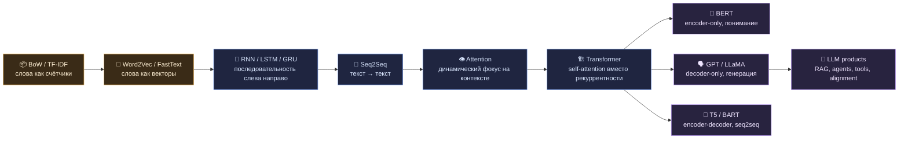
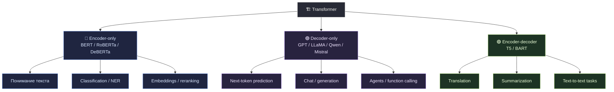
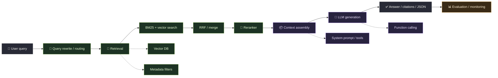

---
tags: [nlp, llm, карта, навигация, архитектуры, метрики, rag]
тип: карта области
уровень: overview
сложность: средняя
статус: готово
готовность: 90
создано: 2026-06-01
cssclasses: [wide-page]
связано:
  - "Метрики оценки NLP-моделей (Perplexity, BLEU, ROUGE, BERTScore, GLUE)"
  - "Архитектура Transformer в LLM — Attention, MHA и KV-cache"
  - "RAG — retrieval, hybrid search, RRF и embeddings"
  - "Sequence Labeling и NER"
---

# 🧭 Карта NLP и LLM

> [!abstract] Зачем эта карточка
> NLP/LLM легко превращается в мешок терминов: `BERT`, `GPT`, `BLEU`, `ROUGE`, `NER`, `RAG`, `LoRA`, `RLHF`, `KV-cache`. Эта карта нужна, чтобы разложить всё по полкам: **какая задача решается**, **какой тип модели подходит**, **какой метрикой это оценивать** и **куда тема относится в общей системе**.

---

## 🧠 Главная идея

Всё NLP можно держать в голове через три вопроса:

  

    <b style="color:#7aa2f7;">1. Что делаем?</b> 
    Классифицируем, размечаем токены, генерируем текст, ищем документы, извлекаем сущности.
  

  

    <b style="color:#9ece6a;">2. Чем решаем?</b> 
    BoW/TF-IDF, embeddings, RNN/LSTM, Transformer, BERT, GPT, retriever, reranker, agent.
  

  

    <b style="color:#f6bd60;">3. Как оцениваем?</b> 
    Accuracy/F1, entity-level F1, Perplexity, BLEU, ROUGE, BERTScore, MRR, nDCG, RAGAS.
  

> [!tip] Короткая формула ориентации
> **Задача → архитектура → способ обучения → метрика → production-ограничения.**  
> Если непонятно, куда относится термин, спроси: он про данные, модель, обучение, инференс, retrieval или оценку?

---

## 🗺️ Большая карта области

```mermaid
flowchart TD
    NLP["🧭 NLP / LLM область"]

    REP["🧱 Представление текста"]
    TASKS["🎯 NLP-задачи"]
    ARCH["🏗️ Архитектуры"]
    LLM["🤖 LLM"]
    RAG["🔎 RAG / Agents"]
    TRAIN["🛠️ Fine-tuning / Alignment"]
    INF["⚡ Inference"]
    EVAL["📏 Метрики и бенчмарки"]

    NLP --> REP
    NLP --> TASKS
    NLP --> ARCH
    NLP --> LLM
    NLP --> RAG
    NLP --> TRAIN
    NLP --> INF
    NLP --> EVAL

    REP --> BOW["BoW / TF-IDF"]
    REP --> EMB["Word2Vec / FastText / GloVe"]
    REP --> TOK["BPE / токены / vocab"]
    REP --> CTX["Contextual embeddings"]

    TASKS --> CLS["Text classification"]
    TASKS --> NER["Sequence labeling / NER"]
    TASKS --> GEN["Generation / Translation / Summary"]
    TASKS --> RET["Retrieval / Ranking"]

    ARCH --> RNN["RNN / LSTM / GRU"]
    ARCH --> SEQ["Seq2Seq + Attention"]
    ARCH --> TR["Transformer"]

    TR --> ENC["Encoder-only: BERT"]
    TR --> DEC["Decoder-only: GPT / LLaMA / Qwen"]
    TR --> ENCDEC["Encoder-decoder: T5 / BART"]

    LLM --> PRE["Pretraining"]
    LLM --> SFT["SFT"]
    LLM --> RLHF["RLHF / DPO / SimPO"]
    LLM --> PEFT["LoRA / QLoRA"]

    RAG --> CHUNK["Документы / OCR / Chunking"]
    RAG --> VDB["Embeddings / Vector DB"]
    RAG --> HYB["BM25 + Dense + RRF"]
    RAG --> ANSW["Generation + citations"]

    EVAL --> CLASSMET["Accuracy / Precision / Recall / F1"]
    EVAL --> GENMET["BLEU / ROUGE / BERTScore"]
    EVAL --> RETMET["Recall@k / MRR / nDCG"]
    EVAL --> LLMJ["LLM-as-Judge / Human eval"]

    classDef root fill:#282a36,stroke:#f8f8f2,color:#f8f8f2,stroke-width:2px;
    classDef blue fill:#1f2540,stroke:#7aa2f7,color:#dbe8ff;
    classDef green fill:#1d3324,stroke:#9ece6a,color:#ecffd9;
    classDef orange fill:#3a2b17,stroke:#f6bd60,color:#fff1d6;
    classDef pink fill:#37233a,stroke:#f7768e,color:#ffdce3;
    classDef violet fill:#28233f,stroke:#bb9af7,color:#efe5ff;

    class NLP root;
    class REP,TASKS,ARCH blue;
    class LLM,RAG violet;
    class TRAIN,INF,EVAL orange;
    class BOW,EMB,TOK,CTX,CLS,NER,GEN,RET,RNN,SEQ,TR,ENC,DEC,ENCDEC,PRE,SFT,RLHF,PEFT,CHUNK,VDB,HYB,ANSW,CLASSMET,GENMET,RETMET,LLMJ green;
```

---

## 🎯 Задача → Модель → Метрика

> [!important] Самая полезная таблица
> Если путаешься, начинай отсюда. Метрики не существуют сами по себе: они привязаны к типу задачи.

| Задача | Что хотим получить | Типичные модели | Чем оценивать | Карточки |
|---|---|---|---|---|
| **Text classification** | один класс на текст | BoW/TF-IDF + LogReg, BERT encoder | Accuracy, Precision/Recall/F1, ROC-AUC | [[NLP/Векторизация/Классический NLP — Предобработка, BoW и TF-IDF\|BoW/TF-IDF]], [[NLP/LLM и Промпт-инжиниринг/Transfer Learning в NLP и семейство BERT\|BERT]] |
| **Sequence labeling / NER** | метка на каждый токен | BERT token head, BiLSTM-CRF | entity-level Precision/Recall/F1 | [[NLP/Модели и архитектуры/Sequence Labeling и NER\|Sequence Labeling и NER]] |
| **POS / chunking** | грамматические метки токенов | CRF, BiLSTM, BERT | token-level F1, accuracy | [[NLP/Модели и архитектуры/Sequence Labeling и NER\|Sequence Labeling]] |
| **Translation** | текст на другом языке | Seq2Seq, Transformer, T5 | BLEU, chrF, human eval | [[NLP/Модели и архитектуры/Архитектура Seq2Seq (Энкодер-Декодер)\|Seq2Seq]], [[NLP/LLM и Промпт-инжиниринг/Метрики оценки NLP-моделей (Perplexity, BLEU, ROUGE, BERTScore, GLUE)\|Метрики NLP]] |
| **Summarization** | краткое содержание | BART/T5, LLM | ROUGE, BERTScore, factuality | [[NLP/LLM и Промпт-инжиниринг/Продвинутые Seq2Seq (T5, BART) и RAG-системы\|T5/BART]], [[NLP/LLM и Промпт-инжиниринг/Метрики оценки NLP-моделей (Perplexity, BLEU, ROUGE, BERTScore, GLUE)\|BLEU/ROUGE/BERTScore]] |
| **Language modeling** | следующий токен | GPT/LLaMA/Qwen | Perplexity, downstream eval | [[NLP/LLM и Промпт-инжиниринг/Языковое моделирование и алгоритмы генерации текста\|Языковое моделирование]] |
| **Open generation / chat** | полезный ответ | decoder-only LLM | human eval, LLM-as-Judge, pairwise preference | [[NLP/LLM и Промпт-инжиниринг/Decoding и sampling в LLM — Temperature, Top-p, Top-k, Beam Search\|Decoding]], [[NLP/LLM и Промпт-инжиниринг/Alignment и обучение LLM — Pretraining, SFT, RLHF, DPO, SimPO\|Alignment]] |
| **Embeddings / semantic search** | близкие тексты рядом | bi-encoder, sentence-transformer, decoder embeddings | Recall@k, MRR, nDCG, MTEB | [[NLP/Векторизация/Эмбеддинги слов (Word2Vec)\|Embeddings]], [[NLP/LLM и Промпт-инжиниринг/Эмбеддинги decoder-only LLM — EOS, Anchor Embeddings и MTEB\|LLM embeddings]] |
| **RAG** | ответ по базе знаний | retriever + reranker + LLM | faithfulness, context recall, answer relevance, MRR | [[NLP/LLM и Промпт-инжиниринг/RAG — retrieval, hybrid search, RRF и embeddings\|Retrieval]], [[NLP/LLM и Промпт-инжиниринг/RAG — генерация, оценка качества и production\|RAG eval]] |
| **Agents / tools** | LLM выбирает действия | ReAct, function calling, structured output | task success, tool accuracy, trace eval | [[NLP/LLM и Промпт-инжиниринг/Агенты, function calling и structured output\|Agents]] |

---

## 🧬 Эволюция: от слов к LLM

> [!note] Как это понимать
> Старые методы не «исчезли». BoW/TF-IDF всё ещё полезны как baseline и для BM25. BERT всё ещё силён для классификации и NER. GPT/LLaMA хороши для генерации и агентности. В проде часто живёт гибрид: **BM25 + embeddings + reranker + LLM**.

---

## 🏗️ Семейство Transformer: главная развилка

| Семейство | Что умеет лучше всего | Почему | Типичные задачи |
|---|---|---|---|
| **Encoder-only** | понимать уже данный текст | видит контекст слева и справа | classification, NER, reranking, embeddings |
| **Decoder-only** | продолжать и генерировать текст | обучается предсказывать следующий токен | chat, code, agents, instruction following |
| **Encoder-decoder** | преобразовывать один текст в другой | encoder читает вход, decoder генерирует выход | translation, summarization, text-to-text |

> [!warning] Частая путаница
> BERT и GPT оба основаны на Transformer, но решают разные базовые задачи. **BERT — понимать текст**, **GPT — продолжать текст**. Поэтому BERT естественен для NER, а GPT — для диалога и генерации.

---

## 📏 Карта метрик

```mermaid
flowchart TD
    M["📏 Метрики NLP"]
    M --> C["Classification"]
    M --> T["Token labeling"]
    M --> LM["Language modeling"]
    M --> G["Generation"]
    M --> R["Retrieval / RAG"]
    M --> H["Human / LLM judge"]

    C --> C1["Accuracy"]
    C --> C2["Precision / Recall / F1"]
    C --> C3["ROC-AUC / PR-AUC"]

    T --> T1["Entity-level F1"]
    T --> T2["Token accuracy<br/>часто обманчива"]

    LM --> LM1["Perplexity"]

    G --> G1["BLEU<br/>precision, translation"]
    G --> G2["ROUGE<br/>recall, summarization"]
    G --> G3["BERTScore<br/>semantic similarity"]

    R --> R1["Recall@k"]
    R --> R2["MRR"]
    R --> R3["nDCG"]
    R --> R4["Faithfulness / context relevance"]

    H --> H1["Pairwise preference"]
    H --> H2["LLM-as-Judge"]
    H --> H3["Human eval"]

    classDef root fill:#282a36,stroke:#f8f8f2,color:#f8f8f2;
    classDef classm fill:#1b2a5a,stroke:#8ab4ff,color:#ffffff;
    classDef gen fill:#4a2f10,stroke:#ffd166,color:#ffffff;
    classDef rag fill:#173f2a,stroke:#9ece6a,color:#ffffff;
    classDef judge fill:#4a1f3d,stroke:#ff8fab,color:#ffffff;
    class M root;
    class C,T,LM,C1,C2,C3,T1,T2,LM1 classm;
    class G,G1,G2,G3 gen;
    class R,R1,R2,R3,R4 rag;
    class H,H1,H2,H3 judge;
```

### Как выбирать метрику

| Если вопрос звучит так | Скорее всего нужна метрика |
|---|---|
| «Правильно ли классифицировали текст?» | Accuracy, F1, ROC-AUC |
| «Нашли ли все сущности и их границы?» | entity-level Precision/Recall/F1 |
| «Насколько модель хорошо предсказывает следующий токен?» | Perplexity |
| «Насколько перевод похож на эталон и нет ли лишнего?» | BLEU |
| «Покрыло ли summary ключевые факты эталона?» | ROUGE |
| «Похож ли ответ на эталон по смыслу, даже если слова другие?» | BERTScore |
| «Нашёл ли retriever нужный документ в top-k?» | Recall@k, MRR, nDCG |
| «Ответ RAG основан на найденном контексте?» | faithfulness, groundedness, human/LLM eval |

> [!important] Главное правило
> **BLEU/ROUGE/BERTScore не измеряют “истинность” ответа.** Они сравнивают с эталоном. Если эталон неполный, спорный или один из многих возможных ответов, метрика может вводить в заблуждение.

---

## 🔎 RAG и LLM-продукт: где что находится

| Компонент | Что делает | Типичные вопросы на собесе |
|---|---|---|
| **Parsing / OCR** | превращает PDF/DOCX/HTML в текст | как сохранять таблицы, markdown, OCR без text layer |
| **Chunking** | режет документы на куски | fixed, recursive, semantic, overlap |
| **Embeddings** | переводит чанки в векторы | модель эмбеддингов, размерность, multilingual |
| **Vector DB** | ищет близкие чанки | FAISS, Qdrant, Milvus, pgvector |
| **Hybrid search** | смешивает dense и sparse search | BM25 vs embeddings, RRF |
| **Reranker** | переупорядочивает кандидатов | cross-encoder, latency trade-off |
| **Prompt assembly** | собирает контекст для LLM | top-k, citations, context window |
| **Generation** | отвечает пользователю | model choice, decoding, structured output |
| **Evaluation** | проверяет качество | MRR, context recall, faithfulness, RAGAS |

Связанные карточки:
- [[NLP/LLM и Промпт-инжиниринг/RAG — документы, OCR и чанкинг|RAG: документы, OCR и чанкинг]]
- [[NLP/LLM и Промпт-инжиниринг/RAG — retrieval, hybrid search, RRF и embeddings|RAG: retrieval, hybrid search, RRF и embeddings]]
- [[NLP/LLM и Промпт-инжиниринг/RAG — генерация, оценка качества и production|RAG: генерация, оценка и production]]
- [[NLP/LLM и Промпт-инжиниринг/Агенты, function calling и structured output|Агенты, function calling и structured output]]

---

## 🛠️ Обучение LLM: от base model до product model

| Этап | Что даёт | Что может сломать |
|---|---|---|
| **Pretraining** | язык, факты, общие способности | дорого, риск data contamination |
| **SFT** | формат инструкций, стиль ответа | переобучение на шаблонные ответы |
| **RLHF/DPO/SimPO** | alignment под предпочтения | потеря разнообразия, reward hacking |
| **LoRA/QLoRA** | дешёвая доменная адаптация | catastrophic forgetting, узкий стиль |
| **Inference optimization** | latency/cost | деградация качества при агрессивной квантизации |

Связанные карточки:
- [[NLP/LLM и Промпт-инжиниринг/Alignment и обучение LLM — Pretraining, SFT, RLHF, DPO, SimPO|Alignment и обучение LLM]]
- [[NLP/LLM и Промпт-инжиниринг/Fine-tuning и PEFT в LLM — BERT, LoRA, QLoRA|Fine-tuning и PEFT]]
- [[NLP/LLM и Промпт-инжиниринг/Catastrophic Forgetting в LLM — EWC и Replay|Catastrophic Forgetting]]
- [[NLP/LLM и Промпт-инжиниринг/Сжатие языковых моделей (Distillation, Quantization, Pruning, LoRA)|Сжатие языковых моделей]]

---

## 🧩 Частые путаницы

| Путается | Как различать |
|---|---|
| **Tokenization vs embeddings** | токенизация режет текст на ID; embeddings превращают ID/текст в векторы |
| **BoW/TF-IDF vs Word2Vec** | BoW/TF-IDF — разреженные счётчики слов; Word2Vec — плотные векторы смысловой близости |
| **BERT vs GPT** | BERT читает весь текст и хорош для понимания; GPT генерирует следующий токен |
| **Attention vs Transformer** | attention — механизм; Transformer — архитектура, построенная вокруг self-attention |
| **BLEU vs ROUGE** | BLEU precision-ориентирован для перевода; ROUGE recall-ориентирован для summary |
| **BERTScore vs BLEU/ROUGE** | BERTScore сравнивает смысл через embeddings; BLEU/ROUGE сравнивают n-граммы |
| **Retriever vs reranker** | retriever быстро достаёт кандидатов; reranker медленнее и точнее переупорядочивает |
| **RAG vs fine-tuning** | RAG подставляет знания в prompt; fine-tuning меняет поведение/веса модели |
| **LoRA vs QLoRA** | LoRA учит низкоранговые адаптеры; QLoRA делает это поверх 4-bit base model |
| **System prompt vs special tokens** | prompt — текстовая инструкция; special tokens — служебные токены tokenizer/model protocol |

---

## 🧾 Сущности из МОК-листа: куда это относится

> [!info] Как пользоваться
> Этот раздел синхронизирован по смыслу с карточкой [[Classic Machine Learning/Interview Questions/_Вопросы для МОК-собеседования|Вопросы для МОК-собеседования]]. Если в вопросах встречается термин и он из мира NLP/LLM/RAG/Agents, здесь можно быстро посмотреть: **что это**, **где используется** и **в какую карточку идти за ответом**.

### 🧱 Представление текста и токенизация

| Сущность | Что это коротко | Где используется | Карточка |
|---|---|---|---|
| **Bag of Words** | текст как счётчик слов без порядка | baseline для классификации, sparse retrieval | [[NLP/Векторизация/Классический NLP — Предобработка, BoW и TF-IDF\|BoW/TF-IDF]] |
| **TF-IDF** | вес слова = частота в документе × редкость в корпусе | classic NLP, поиск, baseline retrieval | [[NLP/Векторизация/Классический NLP — Предобработка, BoW и TF-IDF\|BoW/TF-IDF]] |
| **BM25** | ранжирование по словам с насыщением частоты и нормировкой длины | sparse retrieval в RAG | [[NLP/LLM и Промпт-инжиниринг/RAG — retrieval, hybrid search, RRF и embeddings\|BM25 vs TF-IDF]] |
| **Word2Vec** | плотные векторы слов, обученные по контексту | word embeddings, semantic similarity | [[NLP/Векторизация/Эмбеддинги слов (Word2Vec)\|Word2Vec]] |
| **CBOW** | Word2Vec-архитектура: по контексту предсказывает центральное слово | обучение word embeddings | [[NLP/Векторизация/Эмбеддинги слов (Word2Vec)\|Word2Vec]] |
| **Skip-gram** | Word2Vec-архитектура: по слову предсказывает контекст | лучше для редких слов, embeddings | [[NLP/Векторизация/Эмбеддинги слов (Word2Vec)\|Word2Vec]] |
| **FastText** | embeddings через символьные n-граммы | OOV, опечатки, морфология | [[NLP/Векторизация/Эмбеддинги слов (Word2Vec)\|FastText]] |
| **GloVe** | embeddings через глобальную матрицу совместной встречаемости | классические word embeddings | [[NLP/Векторизация/Эмбеддинги слов (Word2Vec)\|GloVe]] |
| **OOV** | слово вне словаря модели | проблема word-level моделей | [[NLP/Векторизация/Эмбеддинги слов (Word2Vec)\|Embeddings]] |
| **Tokenization** | разбиение текста на слова, символы, n-граммы, subwords или байты | вход в BoW, embeddings, BERT, LLM | [[NLP/Векторизация/Токенизация текста — методы и эволюция\|Методы токенизации]] |
| **BPE** | субтокенизация через слияние частых пар | LLM tokenizer, нет жёсткого OOV | [[NLP/LLM и Промпт-инжиниринг/Токенизация LLM — BPE и merge table\|BPE]] |
| **Merge table** | упорядоченный список слияний BPE | воспроизводимая токенизация на inference | [[NLP/LLM и Промпт-инжиниринг/Токенизация LLM — BPE и merge table\|Merge table]] |
| **Special tokens** | служебные токены вроде `[CLS]`, `[EOS]`, `<pad>` | протокол модели, классификация, генерация | [[NLP/LLM и Промпт-инжиниринг/Системные и специальные токены в языковых моделях\|Системные и специальные токены]] |

### 🗣️ Языковое моделирование и генерация

| Сущность | Что это коротко | Где используется | Карточка |
|---|---|---|---|
| **N-граммная LM** | вероятность следующего токена по предыдущим `N-1` | классическое языковое моделирование | [[NLP/LLM и Промпт-инжиниринг/Языковое моделирование и алгоритмы генерации текста\|Языковое моделирование]] |
| **Марковское свойство** | будущее зависит только от ограниченного контекста | n-граммные модели | [[NLP/LLM и Промпт-инжиниринг/Языковое моделирование и алгоритмы генерации текста\|N-граммы]] |
| **Разреженность n-грамм** | длинные n-граммы редко встречаются в train | ограничение классических LM | [[NLP/LLM и Промпт-инжиниринг/Языковое моделирование и алгоритмы генерации текста\|N-граммы]] |
| **Perplexity** | экспонента от cross-entropy, “сколько вариантов перебирает модель” | оценка language model | [[NLP/LLM и Промпт-инжиниринг/Метрики оценки NLP-моделей (Perplexity, BLEU, ROUGE, BERTScore, GLUE)\|Perplexity]] |
| **Cross-entropy** | loss для вероятностного предсказания токена/класса | LM training, perplexity | [[NLP/LLM и Промпт-инжиниринг/Метрики оценки NLP-моделей (Perplexity, BLEU, ROUGE, BERTScore, GLUE)\|Perplexity]] |
| **Greedy search** | всегда выбираем самый вероятный следующий токен | deterministic decoding | [[NLP/LLM и Промпт-инжиниринг/Decoding и sampling в LLM — Temperature, Top-p, Top-k, Beam Search\|Decoding]] |
| **Beam search** | держим несколько лучших гипотез | translation, seq2seq, реже chat LLM | [[NLP/LLM и Промпт-инжиниринг/Decoding и sampling в LLM — Temperature, Top-p, Top-k, Beam Search\|Beam Search]] |
| **Length penalty** | нормировка score на длину | beam search, борьба с короткими ответами | [[NLP/LLM и Промпт-инжиниринг/Языковое моделирование и алгоритмы генерации текста\|Beam Search]] |
| **Temperature** | делит logits перед softmax, регулирует случайность | LLM sampling | [[NLP/LLM и Промпт-инжиниринг/Decoding и sampling в LLM — Temperature, Top-p, Top-k, Beam Search\|Temperature]] |
| **Top-k** | оставляем `k` самых вероятных токенов | sampling, контроль хвоста | [[NLP/LLM и Промпт-инжиниринг/Decoding и sampling в LLM — Temperature, Top-p, Top-k, Beam Search\|Top-k]] |
| **Top-p / nucleus** | оставляем минимальное ядро с суммарной вероятностью `p` | adaptive sampling | [[NLP/LLM и Промпт-инжиниринг/Decoding и sampling в LLM — Temperature, Top-p, Top-k, Beam Search\|Top-p]] |

### 🏗️ Архитектуры NLP

| Сущность | Что это коротко | Где используется | Карточка |
|---|---|---|---|
| **RNN** | рекуррентная сеть с hidden state | последовательности, исторически NLP | [[NLP/Модели и архитектуры/Рекуррентные нейронные сети (Vanilla RNN)\|RNN]] |
| **Hidden state** | память RNN о прошлом контексте | RNN/LSTM/GRU | [[NLP/Модели и архитектуры/Рекуррентные нейронные сети (Vanilla RNN)\|RNN]] |
| **Vanishing / exploding gradients** | затухание/взрыв градиентов на длинных цепочках | RNN и глубокие сети | [[Deep Learning/Обучение/Затухание и взрыв градиентов\|Градиенты]] |
| **Gradient clipping** | ограничение нормы градиента | стабилизация обучения RNN/LLM | [[Deep Learning/Обучение/Алгоритмы оптимизации (SGD, Momentum, RMSProp, Adam)\|Gradient clipping]] |
| **LSTM** | RNN с cell state и вентилями | длинные зависимости до Transformer | [[NLP/Модели и архитектуры/LSTM и GRU\|LSTM и GRU]] |
| **Cell state** | долговременная память LSTM | LSTM | [[NLP/Модели и архитектуры/LSTM и GRU\|LSTM]] |
| **Forget/Input/Output gates** | вентили LSTM: забыть, записать, вывести | управление памятью LSTM | [[NLP/Модели и архитектуры/LSTM и GRU\|LSTM]] |
| **GRU** | упрощённая LSTM с reset/update gates | быстрее LSTM, меньше параметров | [[NLP/Модели и архитектуры/LSTM и GRU\|GRU]] |
| **Bidirectional RNN/LSTM** | читает текст слева направо и справа налево | NER/classification, но не autoregressive generation | [[NLP/Модели и архитектуры/LSTM и GRU\|BiLSTM]] |
| **Seq2Seq** | encoder читает вход, decoder генерирует выход | translation, summarization | [[NLP/Модели и архитектуры/Архитектура Seq2Seq (Энкодер-Декодер)\|Seq2Seq]] |
| **Encoder-Decoder** | архитектура “сжать вход → сгенерировать выход” | перевод, text-to-text | [[NLP/Модели и архитектуры/Архитектура Seq2Seq (Энкодер-Декодер)\|Encoder-Decoder]] |
| **Bottleneck** | один context vector плохо держит длинный текст | ограничение раннего Seq2Seq | [[NLP/Модели и архитектуры/Архитектура Seq2Seq (Энкодер-Декодер)\|Seq2Seq]] |
| **Teacher Forcing** | на train decoder получает правильный предыдущий токен | обучение seq2seq/LM | [[NLP/LLM и Промпт-инжиниринг/Языковое моделирование и алгоритмы генерации текста\|Teacher Forcing]] |
| **Exposure Bias** | на inference модель видит свои ошибки, а не идеальный prefix | генерация | [[NLP/LLM и Промпт-инжиниринг/Языковое моделирование и алгоритмы генерации текста\|Exposure Bias]] |

### 👁️ Attention и Transformer

| Сущность | Что это коротко | Где используется | Карточка |
|---|---|---|---|
| **Transformer** | архитектура из attention-блоков, FFN, residual и norm | encoder-only, decoder-only, encoder-decoder модели | [[NLP/Модели и архитектуры/Архитектура Transformer — энкодер, декодер и слои\|Архитектура Transformer]] |
| **Attention** | динамически выбирает, на какие токены смотреть | Seq2Seq, Transformer | [[NLP/Модели и архитектуры/Механизм внимания (Attention и Self-Attention)\|Attention]] |
| **Self-Attention** | токены одной последовательности смотрят друг на друга | Transformer | [[NLP/LLM и Промпт-инжиниринг/Архитектура Transformer в LLM — Attention, MHA и KV-cache\|Self-Attention]] |
| **Query / Key / Value** | “что ищу” / “по чему ищут” / “какую информацию отдаю” | attention logits and output | [[NLP/LLM и Промпт-инжиниринг/Архитектура Transformer в LLM — Attention, MHA и KV-cache\|Q, K, V]] |
| **Scaled dot-product** | attention score через `QK^T / sqrt(d_k)` | Transformer attention | [[NLP/LLM и Промпт-инжиниринг/Архитектура Transformer в LLM — Attention, MHA и KV-cache\|Scaled attention]] |
| **Multi-Head Attention** | несколько attention-голов в разных подпространствах | Transformer/LLM | [[NLP/LLM и Промпт-инжиниринг/Архитектура Transformer в LLM — Attention, MHA и KV-cache\|MHA]] |
| **LayerNorm** | нормализация hidden vector каждого токена по feature dimension | Transformer, BERT/GPT, Pre-LN/Post-LN | [[Deep Learning/Обучение/Layer Normalization\|Layer Normalization]] |
| **Absolute PE** | позиция как номер токена | старые Transformer/BERT/GPT-2 | [[NLP/LLM и Промпт-инжиниринг/Позиционные кодирования LLM — RoPE, ALiBi и длина контекста\|Позиционные кодирования]] |
| **Relative PE** | кодируется расстояние между токенами | длинный контекст, устойчивость к сдвигу | [[NLP/LLM и Промпт-инжиниринг/Позиционные кодирования LLM — RoPE, ALiBi и длина контекста\|Relative PE]] |
| **RoPE** | поворот Q/K в зависимости от позиции | современные LLM | [[NLP/LLM и Промпт-инжиниринг/Позиционные кодирования LLM — RoPE, ALiBi и длина контекста\|RoPE]] |
| **ALiBi** | линейный штраф к attention logits за расстояние | длинный контекст, альтернатива RoPE | [[NLP/LLM и Промпт-инжиниринг/Позиционные кодирования LLM — RoPE, ALiBi и длина контекста\|ALiBi]] |
| **KV-cache** | кеш K/V прошлых токенов | ускорение autoregressive inference | [[NLP/LLM и Промпт-инжиниринг/Архитектура Transformer в LLM — Attention, MHA и KV-cache\|KV-cache]] |

### 🏷️ Token classification, NER и метрики генерации

| Сущность | Что это коротко | Где используется | Карточка |
|---|---|---|---|
| **Sequence labeling** | метка на каждый токен | NER, POS, slot filling | [[NLP/Модели и архитектуры/Sequence Labeling и NER\|Sequence Labeling и NER]] |
| **NER** | найти сущности и их типы | документы, резюме, RAG metadata | [[NLP/Модели и архитектуры/Sequence Labeling и NER\|NER]] |
| **BIO / BILOU** | схема границ сущностей | token classification | [[NLP/Модели и архитектуры/Sequence Labeling и NER\|BIO]] |
| **CRF** | декодер последовательности поверх token logits | согласованная NER-разметка | [[NLP/Модели и архитектуры/Sequence Labeling и NER\|CRF]] |
| **BLEU** | clipped precision по n-граммам + brevity penalty | machine translation | [[NLP/LLM и Промпт-инжиниринг/Метрики оценки NLP-моделей (Perplexity, BLEU, ROUGE, BERTScore, GLUE)\|BLEU]] |
| **Brevity Penalty** | штраф за слишком короткую гипотезу | BLEU | [[NLP/LLM и Промпт-инжиниринг/Метрики оценки NLP-моделей (Perplexity, BLEU, ROUGE, BERTScore, GLUE)\|BLEU]] |
| **ROUGE** | покрытие эталона n-граммами/LCS | summarization | [[NLP/LLM и Промпт-инжиниринг/Метрики оценки NLP-моделей (Perplexity, BLEU, ROUGE, BERTScore, GLUE)\|ROUGE]] |
| **BERTScore** | semantic similarity через contextual embeddings | semantic eval, paraphrases | [[NLP/LLM и Промпт-инжиниринг/Метрики оценки NLP-моделей (Perplexity, BLEU, ROUGE, BERTScore, GLUE)\|BERTScore]] |

### 🛠️ Fine-tuning, PEFT и alignment

| Сущность | Что это коротко | Где используется | Карточка |
|---|---|---|---|
| **BERT classification head** | encoder + `[CLS]`/pooling + Linear | text classification | [[NLP/LLM и Промпт-инжиниринг/Fine-tuning и PEFT в LLM — BERT, LoRA, QLoRA\|BERT classification]] |
| **`[CLS]`** | специальный токен для агрегированного представления | BERT classification | [[NLP/LLM и Промпт-инжиниринг/Fine-tuning и PEFT в LLM — BERT, LoRA, QLoRA\|CLS vs pooling]] |
| **Pooling** | агрегирование token embeddings в один vector | classification, embeddings | [[NLP/LLM и Промпт-инжиниринг/Fine-tuning и PEFT в LLM — BERT, LoRA, QLoRA\|CLS vs pooling]] |
| **Layer-wise LR decay** | нижним слоям меньший LR, верхним больший | fine-tuning BERT/LLM | [[NLP/LLM и Промпт-инжиниринг/Fine-tuning и PEFT в LLM — BERT, LoRA, QLoRA\|Layer-wise LR decay]] |
| **LoRA** | обучаемая low-rank дельта весов | PEFT, дешёвый fine-tuning | [[NLP/LLM и Промпт-инжиниринг/Fine-tuning и PEFT в LLM — BERT, LoRA, QLoRA\|LoRA]] |
| **Low-rank decomposition** | `ΔW = AB`, где rank `r` мал | LoRA | [[NLP/LLM и Промпт-инжиниринг/Fine-tuning и PEFT в LLM — BERT, LoRA, QLoRA\|Low-rank]] |
| **QLoRA** | LoRA поверх 4-bit quantized base model | fine-tuning больших LLM на ограниченной VRAM | [[NLP/LLM и Промпт-инжиниринг/Fine-tuning и PEFT в LLM — BERT, LoRA, QLoRA\|QLoRA]] |
| **Rank `r`** | размерность низкоранговой дельты | качество/память LoRA | [[NLP/LLM и Промпт-инжиниринг/Fine-tuning и PEFT в LLM — BERT, LoRA, QLoRA\|Rank r]] |
| **Pretraining** | next-token prediction на огромном корпусе | base LLM | [[NLP/LLM и Промпт-инжиниринг/Alignment и обучение LLM — Pretraining, SFT, RLHF, DPO, SimPO\|Pretraining]] |
| **SFT** | supervised instruction fine-tuning | instruct model | [[NLP/LLM и Промпт-инжиниринг/Alignment и обучение LLM — Pretraining, SFT, RLHF, DPO, SimPO\|SFT]] |
| **RLHF** | RL по человеческим предпочтениям | alignment | [[NLP/LLM и Промпт-инжиниринг/Alignment и обучение LLM — Pretraining, SFT, RLHF, DPO, SimPO\|RLHF]] |
| **PPO / DPO / SimPO** | разные preference optimization схемы | alignment | [[NLP/LLM и Промпт-инжиниринг/Alignment и обучение LLM — Pretraining, SFT, RLHF, DPO, SimPO\|PPO vs DPO vs SimPO]] |
| **Catastrophic forgetting** | fine-tuning портит старые навыки | domain adaptation | [[NLP/LLM и Промпт-инжиниринг/Catastrophic Forgetting в LLM — EWC и Replay\|Catastrophic Forgetting]] |
| **EWC** | штрафует сдвиг важных весов | борьба с forgetting | [[NLP/LLM и Промпт-инжиниринг/Catastrophic Forgetting в LLM — EWC и Replay\|EWC]] |
| **Replay buffer** | подмешивание старых примеров | борьба с forgetting | [[NLP/LLM и Промпт-инжиниринг/Catastrophic Forgetting в LLM — EWC и Replay\|Replay]] |

### 🧲 Embeddings, retrieval и RAG

| Сущность | Что это коротко | Где используется | Карточка |
|---|---|---|---|
| **Sentence embeddings** | вектор всего текста/чанка | semantic search | [[NLP/LLM и Промпт-инжиниринг/RAG — retrieval, hybrid search, RRF и embeddings\|Embeddings]] |
| **`[EOS]` embedding** | embedding токена конца последовательности | decoder-only embeddings, retrieval limitations | [[NLP/LLM и Промпт-инжиниринг/Эмбеддинги decoder-only LLM — EOS, Anchor Embeddings и MTEB\|EOS embeddings]] |
| **Anchor Embeddings** | обучение EOS быть семантическим якорем | retrieval/MTEB | [[NLP/LLM и Промпт-инжиниринг/Эмбеддинги decoder-only LLM — EOS, Anchor Embeddings и MTEB\|Anchor Embeddings]] |
| **Bidirectional reconstruction** | query→doc и doc→query реконструкция | обучение LLM embeddings | [[NLP/LLM и Промпт-инжиниринг/Эмбеддинги decoder-only LLM — EOS, Anchor Embeddings и MTEB\|Bidirectional Reconstruction]] |
| **Contrastive learning** | сближает positive pairs, разводит negatives | embeddings/retrieval | [[NLP/LLM и Промпт-инжиниринг/Эмбеддинги decoder-only LLM — EOS, Anchor Embeddings и MTEB\|Contrastive learning]] |
| **InfoNCE** | contrastive loss с softmax по positive/negative | embedding training | [[NLP/LLM и Промпт-инжиниринг/Эмбеддинги decoder-only LLM — EOS, Anchor Embeddings и MTEB\|InfoNCE]] |
| **MTEB** | benchmark для embeddings | сравнение embedding models | [[NLP/LLM и Промпт-инжиниринг/Эмбеддинги decoder-only LLM — EOS, Anchor Embeddings и MTEB\|MTEB]] |
| **Vector DB** | хранилище векторов и ANN-поиск | RAG retrieval | [[NLP/LLM и Промпт-инжиниринг/RAG — retrieval, hybrid search, RRF и embeddings\|Vector DB]] |
| **Hybrid search** | dense embeddings + sparse BM25 | RAG retrieval | [[NLP/LLM и Промпт-инжиниринг/RAG — retrieval, hybrid search, RRF и embeddings\|Hybrid search]] |
| **RRF** | объединение ранжированных списков по reciprocal rank | merge BM25/vector/multiquery | [[NLP/LLM и Промпт-инжиниринг/RAG — retrieval, hybrid search, RRF и embeddings\|RRF]] |
| **Reranker** | точная модель переупорядочивает top-k | retrieval quality vs latency | [[NLP/LLM и Промпт-инжиниринг/RAG — генерация, оценка качества и production\|Reranker]] |
| **Multiquery search** | несколько перефразов запроса → несколько retrieval списков | RAG recall | [[NLP/LLM и Промпт-инжиниринг/RAG — retrieval, hybrid search, RRF и embeddings\|Multiquery]] |

### 📄 RAG ingestion, production и evaluation

| Сущность | Что это коротко | Где используется | Карточка |
|---|---|---|---|
| **Ingestion pipeline** | путь документа в базу: parse → clean → chunk → embed → index | RAG production | [[NLP/LLM и Промпт-инжиниринг/RAG — документы, OCR и чанкинг\|RAG ingestion]] |
| **DOCX / таблицы** | сохранение структуры Word и табличных данных | document parsing | [[NLP/LLM и Промпт-инжиниринг/RAG — документы, OCR и чанкинг\|DOCX и таблицы]] |
| **OCR** | распознавание текста из сканов/PDF без text layer | document ingestion | [[NLP/LLM и Промпт-инжиниринг/RAG — документы, OCR и чанкинг\|OCR]] |
| **Fixed / recursive chunking** | резка по длине или структуре разделителей | базовый RAG chunking | [[NLP/LLM и Промпт-инжиниринг/RAG — документы, OCR и чанкинг\|Chunking]] |
| **Semantic chunking** | резка по смысловым границам | quality RAG, дороже | [[NLP/LLM и Промпт-инжиниринг/RAG — документы, OCR и чанкинг\|Semantic chunking]] |
| **Heading-aware / table-aware chunking** | учитывает заголовки и таблицы | документы с разметкой | [[NLP/LLM и Промпт-инжиниринг/RAG — документы, OCR и чанкинг\|Методы чанкирования]] |
| **Parent-child / hierarchical retrieval** | ищем маленьким чанком, отдаём большой контекст | RAG quality | [[NLP/LLM и Промпт-инжиниринг/RAG — документы, OCR и чанкинг\|Parent-child]] |
| **RAG по Excel** | таблицу ищем/фильтруем иначе, чем обычный текст | табличные данные | [[NLP/LLM и Промпт-инжиниринг/RAG — retrieval, hybrid search, RRF и embeddings\|RAG по Excel]] |
| **Augmented Generation** | генерация с добавленным внешним контекстом | RAG | [[NLP/LLM и Промпт-инжиниринг/RAG — генерация, оценка качества и production\|Augmented Generation]] |
| **Context length** | сколько токенов помещается в prompt/KV-cache | LLM inference/RAG | [[NLP/LLM и Промпт-инжиниринг/RAG — генерация, оценка качества и production\|GPU memory]] |
| **A100 80GB / 120B** | ресурсные ограничения выбора модели | RAG generation/inference | [[NLP/LLM и Промпт-инжиниринг/RAG — генерация, оценка качества и production\|Model choice]] |
| **LLM serving** | как ускорять prefill/decode и держать throughput | production inference | [[NLP/LLM и Промпт-инжиниринг/Быстрая генерация LLM — batching, prefill, KV-cache и speculative decoding\|Быстрая генерация LLM]] |
| **Continuous batching** | динамически пополняет running batch | vLLM/SGLang serving | [[NLP/LLM и Промпт-инжиниринг/Быстрая генерация LLM — batching, prefill, KV-cache и speculative decoding\|Continuous batching]] |
| **Chunked prefill** | режет длинный prefill на куски | длинный RAG context, TTFT/ITL | [[NLP/LLM и Промпт-инжиниринг/Быстрая генерация LLM — batching, prefill, KV-cache и speculative decoding\|Chunked prefill]] |
| **RadixAttention** | переиспользует KV-cache общих prefix | agent/RAG/chat workflows | [[NLP/LLM и Промпт-инжиниринг/Быстрая генерация LLM — batching, prefill, KV-cache и speculative decoding\|RadixAttention]] |
| **Speculative decoding** | draft-модель предлагает токены, target проверяет | ускорение decode | [[NLP/LLM и Промпт-инжиниринг/Быстрая генерация LLM — batching, prefill, KV-cache и speculative decoding\|Speculative decoding]] |
| **MRR / Recall@k / nDCG** | retrieval metrics | RAG search quality | [[NLP/LLM и Промпт-инжиниринг/Метрики RAG-систем — retrieval, generation, faithfulness и RAGAS\|Метрики RAG]] |
| **Context precision/recall** | качество найденного контекста | RAGAS-like eval | [[NLP/LLM и Промпт-инжиниринг/Метрики RAG-систем — retrieval, generation, faithfulness и RAGAS\|Context metrics]] |
| **Faithfulness / groundedness** | ответ опирается на контекст или галлюцинирует | RAG eval | [[NLP/LLM и Промпт-инжиниринг/Метрики RAG-систем — retrieval, generation, faithfulness и RAGAS\|Faithfulness]] |
| **Golden Dataset** | эталонные вопросы/ответы/документы | offline RAG evaluation | [[NLP/LLM и Промпт-инжиниринг/Метрики RAG-систем — retrieval, generation, faithfulness и RAGAS\|Golden Dataset]] |
| **RAGAS-like подход** | LLM-assisted оценка RAG без полного golden set | RAG eval | [[NLP/LLM и Промпт-инжиниринг/Метрики RAG-систем — retrieval, generation, faithfulness и RAGAS\|RAGAS-like]] |

### 🤖 Agents, structured output и tools

| Сущность | Что это коротко | Где используется | Карточка |
|---|---|---|---|
| **Agentic RAG** | LLM сама выбирает, как и когда вызывать retrieval/tool | сложные RAG workflows | [[NLP/LLM и Промпт-инжиниринг/Агенты, function calling и structured output\|Agentic RAG]] |
| **RAG-tool parameters** | `top_k`, filters, retriever type, query rewrite, date range | tool design для агента | [[NLP/LLM и Промпт-инжиниринг/Агенты, function calling и structured output\|RAG-tool]] |
| **ReAct** | reasoning + action loop | агентные архитектуры | [[NLP/LLM и Промпт-инжиниринг/Агенты, function calling и structured output\|ReAct]] |
| **Planner / Router / Reflection** | альтернативные паттерны агентов | multi-step agent systems | [[NLP/LLM и Промпт-инжиниринг/Агенты, function calling и structured output\|Архитектуры агентов]] |
| **Structured output** | модель возвращает JSON по схеме | extraction, API, eval | [[NLP/LLM и Промпт-инжиниринг/Агенты, function calling и structured output\|Structured output]] |
| **Constrained decoding** | ограничение генерации грамматикой/regex/schema | валидный JSON/email/enum | [[NLP/LLM и Промпт-инжиниринг/Агенты, function calling и structured output\|Structured output]] |
| **Function calling** | модель выбирает функцию и аргументы, приложение выполняет | tools/API integration | [[NLP/LLM и Промпт-инжиниринг/Агенты, function calling и structured output\|Function calling]] |
| **Tool invocation** | форма вызова инструмента: JSON, tool call, action block | agents | [[NLP/LLM и Промпт-инжиниринг/Агенты, function calling и structured output\|Tool invocation]] |
| **Agent observability** | трассы, шаги, tool calls, ошибки, latency, cost | production agents | [[NLP/LLM и Промпт-инжиниринг/Агенты, function calling и structured output\|Agent observability]] |

---

## 🧭 Маршруты изучения

> [!example] Если нужен фундамент NLP
> 1. [[NLP/Векторизация/Классический NLP — Предобработка, BoW и TF-IDF|Предобработка, BoW и TF-IDF]]  
> 2. [[NLP/Векторизация/Эмбеддинги слов (Word2Vec)|Word2Vec / embeddings]]  
> 3. [[NLP/Модели и архитектуры/Рекуррентные нейронные сети (Vanilla RNN)|RNN]] → [[NLP/Модели и архитектуры/LSTM и GRU|LSTM/GRU]]  
> 4. [[NLP/Модели и архитектуры/Архитектура Seq2Seq (Энкодер-Декодер)|Seq2Seq]] → [[NLP/Модели и архитектуры/Механизм внимания (Attention и Self-Attention)|Attention]]  
> 5. [[NLP/Модели и архитектуры/Архитектура Transformer — энкодер, декодер и слои|Transformer]]

> [!example] Если цель — LLM и RAG
> 1. [[NLP/LLM и Промпт-инжиниринг/Токенизация LLM — BPE и merge table|BPE и токенизация]]  
> 2. [[NLP/LLM и Промпт-инжиниринг/Современные LLM (BERT vs GPT) — тонкости обучения|BERT vs GPT]]  
> 3. [[NLP/LLM и Промпт-инжиниринг/Decoding и sampling в LLM — Temperature, Top-p, Top-k, Beam Search|Decoding и sampling]]  
> 4. [[NLP/LLM и Промпт-инжиниринг/RAG — retrieval, hybrid search, RRF и embeddings|Retrieval/RRF/Embeddings]]  
> 5. [[NLP/LLM и Промпт-инжиниринг/RAG — генерация, оценка качества и production|RAG evaluation и production]]

> [!example] Если цель — собеседование
> 1. Научиться объяснять **задача → модель → метрика**.  
> 2. Уметь различать **BERT / GPT / T5**.  
> 3. Знать **BLEU / ROUGE / BERTScore / Perplexity** и где они ломаются.  
> 4. Понимать **RAG pipeline**: chunking, embeddings, hybrid search, RRF, reranker, eval.  
> 5. Подготовить 2-3 production trade-off: latency, cost, hallucinations, context size, KV-cache.

---

## 🧪 Мини-тренажёр ориентации

Попробуй быстро определить область:

| Вопрос | Куда относится |
|---|---|
| «Почему BPE лучше word-level токенизации?» | Представление текста / tokenizer |
| «Почему `I-PER` не должен идти после `O`?» | Sequence labeling / NER / CRF |
| «Почему LayerNorm используют в Transformer?» | [[Deep Learning/Обучение/Layer Normalization\|LayerNorm]] / архитектура / обучение глубоких сетей |
| «Чем top-p отличается от beam search?» | Decoding / inference |
| «Почему BLEU не подходит для диалога?» | Метрики генерации |
| «Как объединить BM25 и dense retrieval?» | RAG / hybrid search / RRF |
| «Как уменьшить память LLM на инференсе?» | Inference optimization / quantization / KV-cache |
| «Почему LoRA не трогает все веса?» | PEFT / fine-tuning |
| «Как проверить, что RAG не галлюцинирует?» | RAG evaluation / faithfulness |

---

## 🧷 Быстрые якоря

BERT
понимание текста, encoder-only, классификация, NER, reranking.

GPT / LLaMA
генерация, decoder-only, chat, agents, next-token prediction.

RAG
подставить внешние знания в prompt, не переучивая модель.

BLEU
перевод, precision, n-граммы, штраф за краткость.

ROUGE
summary, recall, покрытие эталона.

BERTScore
семантическая похожесть через embeddings.

LoRA
дешёвый fine-tuning через низкоранговую дельту весов.

KV-cache
ускоряет autoregressive inference, но ест GPU-память.

---

## Связано

- [[NLP/🏠 Главная|NLP — главная]]
- [[NLP/🗺️ Индекс|Индекс NLP]]
- [[NLP/Банк вопросов|Банк вопросов NLP]]
- [[NLP/LLM и Промпт-инжиниринг/Метрики оценки NLP-моделей (Perplexity, BLEU, ROUGE, BERTScore, GLUE)|Метрики оценки NLP-моделей]]
- [[NLP/LLM и Промпт-инжиниринг/Архитектура Transformer в LLM — Attention, MHA и KV-cache|Архитектура Transformer в LLM]]
- [[NLP/LLM и Промпт-инжиниринг/RAG — retrieval, hybrid search, RRF и embeddings|RAG: retrieval, hybrid search, RRF и embeddings]]

---

[[NLP/🗺️ Индекс|Назад к индексу NLP]]

