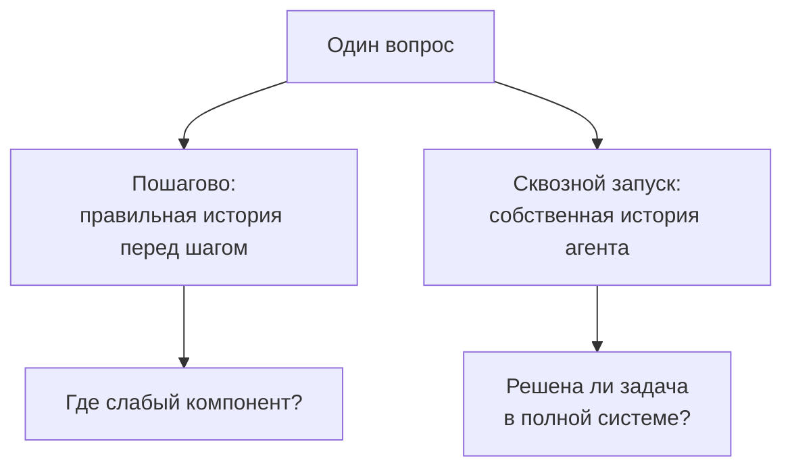

# GTA: проверить не обещание агента, а работу с инструментами

[[Оценка ИИ-моделей/Бенчмарки агентных VLM/🏠 Бенчмарки и технологии агентных VLM|← Бенчмарки и технологии]]

> [!abstract] Зачем читать
> GTA полезен как пример проектирования небольшого, но исполнимого набора. Главный вопрос для интервью: умеет ли агент сам выбрать нужное действие, передать правильные параметры и получить итог — или только убедительно описывает план?

## Быстрая навигация

- [[#1. Паспорт исходного GTA|1. Паспорт исходного GTA]]
- [[#2. Какие опубликованы показатели|2. Какие опубликованы показатели]]
- [[#3. Что поменялось в GTA-2|3. Что поменялось в GTA-2]]
- [[#4. Учебный пример: как построить свою задачу по этому принципу|4. Учебный пример: как построить свою задачу по этому принципу]]
- [[#5. Почему нужны и пошаговый, и сквозной режим|5. Почему нужны и пошаговый, и сквозной режим]]
- [[#6. Каким должен быть проверяющий|6. Каким должен быть проверяющий]]
- [[#7. Практический план знакомства с репозиторием|7. Практический план знакомства с репозиторием]]
- [[#8. Что перенести в подготовку к Alice AI VLM|8. Что перенести в подготовку к Alice AI VLM]]
- [[#9. Вопросы на интервью|9. Вопросы на интервью]]

## 1. Паспорт исходного GTA

Первая статья опубликована 11 июля 2024 года; работа принята в NeurIPS 2024 Datasets and Benchmarks. Авторы — Jize Wang и соавторы. Набор: 229 заданий, 14 инструментов, четыре категории — восприятие, операции, логика, творчество. На входе одно или два изображения. Вопросы проектировали люди под реалистичные сценарии; это не случайная выборка пользовательских логов. [Статья GTA](https://arxiv.org/abs/2407.08713).

В записи задания есть файлы, вопрос, нужные инструменты, эталонная цепочка и ответ. Разметчики исполняли инструменты при подготовке. Предусмотрены пошаговая оценка с эталонным предыдущим контекстом и сквозной запуск. Метрики различают корректность инструкции, выбор инструмента, аргументы, итоговое обобщение и конечный ответ. Для субъективных ответов используется сходство с эталонами; генерация изображений не включена в оценку конечного ответа исходного протокола. [Устройство и оценка, разделы 3–4](https://arxiv.org/html/2407.08713v1).

> [!warning] Как читать число Ans
> Это не безусловно «процент полностью решённых пользовательских задач». В исходном протоколе смешаны разные способы проверки ответов. На интервью полезнее объяснить смысл знаменателя и проверяющего, чем запомнить балл.

## 2. Какие опубликованы показатели

Ниже — отдельный срез таблицы **GTA-Atomic за февраль 2026**, не результаты GTA-Workflow и не собственный повторный запуск:

| Модель в таблице авторов | Ans |
|---|---:|
| GPT-5 | 45.07 |
| DeepSeek-V3.2 | 42.68 |
| Qwen3-235B-A22B | 42.21 |
| Gemini-2.5-Pro | 39.58 |

В таблице также есть отдельный столбец Ans+I; здесь он не смешан с Ans. Названия приведены как в источнике, без домысливания параметров API. Это последний найденный датированный табличный срез исходного GTA, проверенный 5 сентября 2026 года, а не утверждение о сегодняшнем мировом лидере. [README исходного набора и таблица](https://github.com/open-compass/GTA/blob/main/README_GTA-1.md).

## 3. Что поменялось в GTA-2

В текущем репозитории прежний набор называется GTA-Atomic, а GTA-Workflow предназначен для длинных задач с открытым итоговым результатом. Новая статья датирована 17 апреля 2026 года. Авторы предлагают рекурсивную проверку подцелей и отдельно оценивают модели и исполняющие оболочки агентов. В аннотации указан лучший результат моделей 14.39% на workflows в их эксперименте. Это другой протокол: его нельзя сравнивать напрямую с Ans исходных 229 задач. [Статья GTA-2](https://arxiv.org/abs/2604.15715).

README описывает поддержку OpenCompass и Lagent, а также оценку итоговых артефактов внешних агентных систем. Следовательно, одинаковое имя базовой модели не гарантирует одинаковую систему: оболочка управляет инструментами, контекстом и выполнением. [Текущий репозиторий GTA](https://github.com/open-compass/GTA).

В этой карточке подробный предмет — исходный GTA из вакансии. Число задач Workflow и его полную таблицу здесь не подменяем числом 229; перед практическим запуском новой версии нужно отдельно зафиксировать её релиз и манифест.

## 4. Учебный пример: как построить свою задачу по этому принципу

Далее — наша проектная интерпретация, не пересказ конкретного задания GTA.

Пользователь присылает фотографию таблички музея и спрашивает: «Успею ли я попасть туда сегодня после 18:00?» Агенту надо прочитать название, установить нужный музей, найти актуальные часы и учесть дату. Но в воспроизводимом тесте слово «сегодня» должно быть связано с зафиксированным временем, а ответы поиска — с версией среды.

Если каждую неделю выполнять запрос в живом интернете, метрика меняется не только из-за модели. Для проверки базового навыка можно сделать снимок информации и тестовый поисковый инструмент. Для проверки реальной интеграции нужен отдельный живой прогон с указанием времени. Это разные режимы, каждый со своей целью.

Эталон хранит нужный музей, дату, часы, допустимый вывод. Траектория показывает один рабочий способ. Но агент может иначе найти тот же правильный источник. Если проверять буквальное совпадение маршрута, накажем корректную альтернативу.

## 5. Почему нужны и пошаговый, и сквозной режим

Предположим, три этапа: прочитать название, найти время, сформулировать вывод. В пошаговом тесте перед вторым этапом даём правильное название. Так проверяем поиск, не смешивая его с ошибкой чтения. Но в реальном запуске агент может прочитать название неверно, и поиск вернёт сведения о другом музее.

Высокая точность следующего действия при идеальной истории не гарантирует высокий конечный успех. Особенно если ошибки накапливаются или агент плохо восстанавливается после сбоя.

На интервью можно сказать: «Пошаговый режим использую для локализации, сквозной — как основную оценку поведения. Не перемножаю без оговорок средние точности шагов: события зависимы, траектории имеют разную длину».

## 6. Каким должен быть проверяющий

Разделяем синтаксис, смысл действия и результат. Правильный JSON с неверным названием музея — не правильный вызов. Верно выбранный поиск с неверной датой — тоже ошибка. А правильный итоговый ответ может быть угадан без использования обязательных актуальных данных.

Для нашей задачи проверяющий может независимо подтвердить: источник относится к нужному месту; использована нужная дата; часы корректны; финальный вывод согласован. Если источник невозможно проверить автоматически, направляем часть случаев эксперту, а не выдаём уверенный общий балл.

Для изменяющих состояние инструментов проверка ещё строже: агент сказал «заказ создан» — проверяем состояние заказа. Для файлов — проверяем реально созданный файл и его содержимое, не только фразу об успехе.

## 7. Практический план знакомства с репозиторием

Сначала читаем описание версии и смотрим несколько записей данных. Затем находим конфигурацию инструментов и код оценщика. Запускаем маленький набор, включая заведомо правильный и неправильный ответы. Только потом подключаем модель и делаем полный прогон.

Перед запуском сохраняем commit, версию набора, параметры модели, описание инструментов, лимиты и тайм-ауты. Внешние ключи храним вне данных; среде не даём доступ к личным файлам. Примеры команд из старого README могут требовать исторических зависимостей — не ставим их вслепую в основное окружение.

Если не удалось поднять часть инструментов, пишем об этом. Оценка на сокращённом наборе полезна для разработки, но уже не равна опубликованному результату GTA.

## 8. Что перенести в подготовку к Alice AI VLM

Первое — подготовка проверяемой среды является частью бенчмарка. Второе — эталонные действия полезны для диагностики и обучения, но не обязательно единственный допустимый маршрут. Третье — нужны раздельные сигналы по аргументам, результату и инфраструктуре.

Ограничение: небольшой открытый набор с фиксированными инструментами не покрывает автоматически русские документы, несколько страниц, реальные задержки, опасные ошибки и весь пользовательский поток. Поэтому его стоит применять как внешний диагностический сигнал, дополняя продуктовым набором.

## 9. Вопросы на интервью

- Как отличить плохую модель от неудачной оболочки агента?
- Почему 90% корректных вызовов могут сочетаться с низким успехом задач?
- Как принять правильную альтернативную траекторию?
- Что заморозить, если инструменты получают данные из интернета?

Практика: [[Разборы кейсов/VLM и мультимодальность/Кейс VLM 02 — разложить ошибки и выбрать точку роста|разложение ошибок]] и [[Разборы кейсов/VLM и мультимодальность/Кейс VLM 04 — публичный бенчмарк вырос, качество продукта нет|применимость внешних тестов]].
