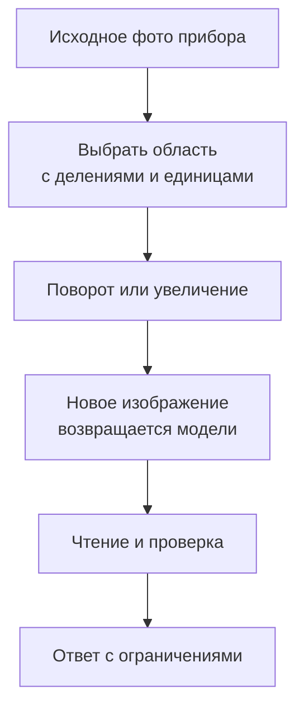

# TIR-Bench: зачем агенту преобразовывать изображение

[[Оценка ИИ-моделей/Бенчмарки агентных VLM/🏠 Бенчмарки и технологии агентных VLM|← Обзор]]

> [!abstract] Смысл
> Иногда мало один раз посмотреть на картинку. Нужно повернуть её, выделить область, измерить цвет, сопоставить фрагменты и снова посмотреть на результат. Для подготовки важно понять, как проверять такую цепочку, а не только обычное описание фотографии.

## Быстрая навигация

- [[#1. Паспорт|1. Паспорт]]
- [[#2. Результаты с условиями|2. Результаты с условиями]]
- [[#3. Почему балл не обязательно доля полностью решённых задач|3. Почему балл не обязательно доля полностью решённых задач]]
- [[#4. Учебный разбор частичного балла|4. Учебный разбор частичного балла]]
- [[#5. Как выглядит мышление с изображениями на практике|5. Как выглядит мышление с изображениями на практике]]
- [[#6. Как сделать свою похожую задачу, не копируя головоломку|6. Как сделать свою похожую задачу, не копируя головоломку]]
- [[#7. Необходимость инструмента нельзя просто объявить|7. Необходимость инструмента нельзя просто объявить]]
- [[#8. Что проверять в инфраструктуре|8. Что проверять в инфраструктуре]]
- [[#9. Что из TIR-подхода полезно для вакансии|9. Что из TIR-подхода полезно для вакансии]]
- [[#10. Вопросы на понимание|10. Вопросы на понимание]]

## 1. Паспорт

Первая версия статьи Ming Li и соавторов — 3 ноября 2025 года. В v1: 1 215 примеров, 13 задач, 665 вопросов с вариантами и 550 открытых. Источники смешанные: существующие наборы, интернет, ручная разметка, программная генерация. [Статья](https://arxiv.org/abs/2511.01833).

Состав по таблице 1 v1:

| Задача | Число |
|---|---:|
| Цвет | 100 |
| Доля объекта на изображении | 120 |
| Символические закономерности | 50 |
| Математика | 120 |
| Поиск слова | 100 |
| Поворачиваемый текст, OCR | 60 |
| Лабиринты | 120 |
| Слабое освещение | 50 |
| Чтение приборов | 80 |
| Поиск отличий | 100 |
| Сборка изображения из частей | 120 |
| Визуальный поиск | 120 |
| Поворот | 75 |

В тексте описания Maze встречается 100, в сводной таблице — 120; выше использована таблица, сумма которой равна 1 215. Перед запуском проверяйте фактический манифест. [Состав, раздел 3](https://arxiv.org/html/2511.01833v1).

## 2. Результаты с условиями

Таблица 2 **v1, 2025**:

| Система | Общий опубликованный балл |
|---|---:|
| o3-TU, с выполнением кода | 46.0 |
| o4-mini-TU | 37.5 |
| PyVision | 31.8 |
| Gemini-2.5-Pro без этого агентного режима | 28.9 |
| o3 без интерпретатора | 26.9 |

Это разные конфигурации, а не равные условия для изолированных моделей. [Эксперимент](https://arxiv.org/html/2511.01833v1).

На дату проверки 5 сентября 2026 репозиторий помечен ECCV 2026. Здесь сохранена привязка чисел к v1; более новый сопоставимый живой рейтинг не подтверждён. [Официальный код](https://github.com/agents-x-project/TIR-Bench), [данные](https://huggingface.co/datasets/Agents-X/TIR-Bench).

## 3. Почему балл не обязательно доля полностью решённых задач

В доступном `calculate_score.py` общий результат вычисляется как сумма оценок примеров, делённая на их количество. Есть разные ветки проверки: выбор варианта, целое и вещественное число, OCR, поиск отличий, сборка частей. Для некоторых ответов в поиске отличий вызывается `list_iou`, поэтому оценка может быть дробной. Скрипт также записывает результаты обратно в исходный JSON. [Код проверяющего](https://github.com/agents-x-project/TIR-Bench/blob/main/calculate_score.py).

Вывод из чтения кода: название accuracy в статье не повод автоматически объяснять 46.0 как «полностью решил 46% задач». Нужно уточнять функцию оценки, её версию и агрегацию. Публикацию и текущий код тоже нельзя считать гарантированно идентичными без фиксации commit.

## 4. Учебный разбор частичного балла

Далее собственный пример, не запись TIR-Bench. На двух изображениях отличия находятся в клетках 2, 5 и 7. Агент назвал 2, 5 и 9.

Точное совпадение множеств даст ноль: задача целиком не решена. Пересечение содержит два элемента, объединение — четыре, поэтому отношение пересечения к объединению равно 2/4 = 0.5. Частичный балл показывает, что агент нашёл часть нужного и добавил ложное отличие.

Оба подхода осмысленны, но отвечают на разные вопросы. Для полного выполнения пользовательской задачи нужен строгий критерий. Для диагностики улучшения локализации может быть полезна дробная оценка. Лучше показать обе, чем скрыть определение за общим словом «качество».

## 5. Как выглядит мышление с изображениями на практике

Представим фото счётчика, снятое боком. Агент сначала определяет полезную область, вырезает её, поворачивает, получает новое изображение, читает показание и сверяет единицы. Следующее наблюдение здесь не просто ещё одна текстовая фраза — это изменённый визуальный вход.

Если область отрезала подпись шкалы, увеличение может ухудшить решение. Если исходник размыт, обработка не гарантирует восстановления. Если агент вырезал соседний прибор, корректное чтение нового изображения всё равно даст неверный ответ пользователю.

Поэтому наблюдаемая траектория важна для диагностики. Но длинный текст о том, как агент внимательно проверил шкалу, не является доказательством проверки.

## 6. Как сделать свою похожую задачу, не копируя головоломку

Начинаем с продуктового затруднения: пользователь фотографирует мелкий серийный номер. Выбираем набор реальных разрешённых фотографий и безопасно созданных аналогов. Фиксируем, где номер находится, читается ли человеком и какой результат допустим.

Делаем контролируемые варианты: оригинал; поворот; меньший масштаб; лишняя похожая наклейка; частично закрытый номер. Проверяем прямой ответ и агентный режим. Сохраняем итог и промежуточные изображения, чтобы выяснить, когда инструмент помог.

Для размытой до неразличимости цифры эталоном не должен быть секретный исходный номер. Корректное поведение — заметить невозможность чтения. Иначе тест вознаграждает угадывание.

## 7. Необходимость инструмента нельзя просто объявить

**Интервьюер:** «Мы придумали задачу на инструменты, значит без инструментов она нерешаема?»

**Кандидат:** «Это гипотеза дизайна. Сравню прямой режим на одинаковом входе и проверю, не решается ли задача по текстовой подсказке. Если сильная модель отвечает напрямую, это не обязательно нарушение: возможно, инструмент ей не нужен. Отдельно решу, оцениваем ли конечный навык или обязательное освоение API».

Для тестирования контракта инструмента можно прямо задать требование его использования. Для продуктового качества искусственно заставлять агента поворачивать читаемое фото обычно не нужно. Это разные тестовые цели.

## 8. Что проверять в инфраструктуре

Преобразование должно сохранять сведения о происхождении: исходное изображение, область, масштаб, поворот. Иначе координаты следующего шага могут относиться уже к другой системе отсчёта.

Выполнение Python ограничиваем по времени, памяти, файловому доступу и сети. Скрипт агента не должен читать эталоны или менять проверяющий. Правильный ответ, добытый из служебного файла, не означает решение визуальной задачи.

Повторяемость требует фиксировать версии библиотек и параметры обработки. Даже если базовая модель неизменна, другой способ уменьшения изображения может изменить читаемость мелкого текста.

## 9. Что из TIR-подхода полезно для вакансии

Составлять матрицу навыков, а не только коллекцию изображений. Делать объективно проверяемые задачи там, где это возможно. Сравнивать полную агентную процедуру с прямым ответом. Читать код оценивания, не ограничиваться названиями метрик. И отдельно доказывать, что выбранные визуальные операции встречаются в запросах Алисы.

Лабиринт может быть хорошим исследовательским испытанием, но доля таких задач в наборе не равна их важности для продукта. Для приёмки нужен собственный слой документов, русскоязычных надписей, нескольких источников и ограничений реального использования.

## 10. Вопросы на понимание

- Какой итог получите, если в поиске отличий агент укажет все клетки? Почему частичный балл должен штрафовать ложные области?
- Чем среднее по примерам отличается от среднего по 13 категориям?
- Почему выбор правильного инструмента не доказывает правильность его параметров?
- Как проверить, что выигрыш дал визуальный инструмент, а не больший бюджет попыток?

Практика: [[Разборы кейсов/VLM и мультимодальность/Кейс VLM 08 — качество, время и цена агентного рассуждения|бюджет действий]] и [[Разборы кейсов/VLM и мультимодальность/Кейс VLM 09 — привязка фактов к изображениям и проверки согласованности|контролируемые преобразования]].
