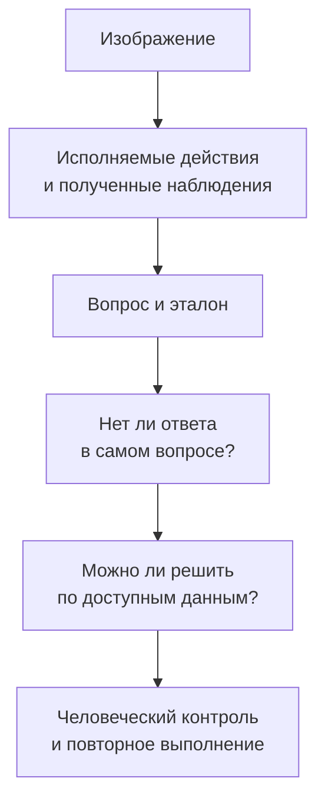

# ToolVQA: как связать изображения, инструменты и обучающие данные

[[Оценка ИИ-моделей/Бенчмарки агентных VLM/🏠 Бенчмарки и технологии агентных VLM|← Обзор]]

> [!abstract] Главная идея для подготовки
> Интересно не только итоговое место модели, но и процесс создания данных: сначала получить содержательную последовательность действий с изображением, затем сформулировать задачу, которая действительно требует этих действий. После этого проверить, не прячется ли ответ в самом вопросе.

## Быстрая навигация

- [[#1. Паспорт и подтверждённые размеры|1. Паспорт и подтверждённые размеры]]
- [[#2. Какие результаты можно цитировать|2. Какие результаты можно цитировать]]
- [[#3. Что можно увидеть в открытых файлах|3. Что можно увидеть в открытых файлах]]
- [[#4. Разберём механизм на собственном примере|4. Разберём механизм на собственном примере]]
- [[#5. Что значит поиск в глубину и зачем здесь примеры|5. Что значит поиск в глубину и зачем здесь примеры]]
- [[#6. Как перенести идею на документы|6. Как перенести идею на документы]]
- [[#7. Почему инструменты способны ухудшить качество|7. Почему инструменты способны ухудшить качество]]
- [[#8. Практический аудит перед использованием|8. Практический аудит перед использованием]]
- [[#9. Что запомнить для интервью|9. Что запомнить для интервью]]

## 1. Паспорт и подтверждённые размеры

ToolVQA опубликован на arXiv 5 августа 2025 года, работа ICCV 2025; авторы Shaofeng Yin, Ting Lei, Yang Liu. Набор содержит 23 655 примеров: 21 105 обучающих и 2 550 проверочных. Используются 10 инструментов и 7 доменов. В статье указаны 65 785 вызовов, средняя длина траектории 2.78, 15 806 текстовых и 7 849 графических ответов. [Статья, статистика](https://arxiv.org/html/2508.03284v1).

ToolEngine строит цепочки поиском в глубину, подбирая демонстрации по общим подпоследовательностям действий. Проверочную часть переразмечали люди. Это синтетические задания на изображениях, не представительная выборка реальных обращений. [Метод и подготовка теста](https://arxiv.org/abs/2508.03284).

## 2. Какие результаты можно цитировать

Срез **таблицы 4 исходной статьи, 2025**, конечная оценка Acc:

| Модель | Режим | Acc, % |
|---|---|---:|
| ChatGPT-4o-latest | Без инструментов, VLM | 38.29 |
| ChatGPT-4o-latest | VLM с инструментами | 34.96 |
| GPT-3.5-Turbo | Текстовая модель с инструментами | 18.37 |
| Дообученная авторами LLaVA-7B | VLM с инструментами | 18.80 |

Результат зависит от режима. Название `latest` не фиксирует воспроизводимый снимок API. Длина 2.78 относится к траекториям; 2.38 в другой таблице — отдельная экспертная оценка глубины, не то же самое. [Таблицы 2–4](https://arxiv.org/html/2508.03284v1).

На 5 сентября 2026 года в проверенных первоисточниках не найден более новый сопоставимый непрерывно обновляемый рейтинг. Это опубликованные результаты авторов, не текущая оценка всех современных моделей. Малый перевес 18.80 против 18.37 сам по себе не доказывает статистическое превосходство.

## 3. Что можно увидеть в открытых файлах

Репозиторий содержит изображения и отдельные train/test JSON. В примере записи есть image_path, question, answer и context: имя инструмента, аргументы, полученный результат, пояснения. Поле is_important в тесте отмечает экспертную оценку необходимости вызова. Есть исходная и уточнённая формулировки вопроса. Четыре значения поля type описывают компоновку изображения, а не семь предметных доменов. [Формат данных в README](https://github.com/Fugtemypt123/ToolVQA-release).

Репозиторий связывает LMDeploy для обслуживания модели, AgentLego для инструментов, OpenCompass для оценки и XTuner для дообучения; авторы рекомендуют отдельные окружения. Это части инфраструктуры, не четыре конкурирующие модели. [Окружения ToolVQA](https://github.com/Fugtemypt123/ToolVQA-release#21-environments).

## 4. Разберём механизм на собственном примере

Далее — учебная реконструкция принципа, не задание из датасета.

Есть фото растения. Инструмент описания выделяет признаки, поиск находит справочную информацию, затем формируется вопрос: «Какие условия освещения подходят этому растению?»

Если генератор напишет «Какое освещение нужно монстере?», изображение стало необязательным: название уже дано. Исправленная формулировка должна требовать распознать растение. Но возникает следующая проблема: фото может не позволять надёжно определить вид. Значит, после удаления текстовой подсказки нужно заново проверить решаемость, а не просто считать задачу усложнённой.

Так хорошо видна разница между красивой генерацией текста и инженерией данных. Пайплайн может произвести грамматически безупречный, но неоднозначный или бессмысленный вопрос.

## 5. Что значит поиск в глубину и зачем здесь примеры

В общем алгоритмическом смысле поиск в глубину сначала продолжает одну цепочку действий, прежде чем исследовать альтернативные. Для генерации данных это позволяет развить наблюдение: что находится на картинке → какой факт нужен → какой инструмент может его дать.

Но без ограничений цепочка легко становится искусственной. Можно добавить поиск погоды к любой фотографии и получить ещё один шаг, хотя он не нужен вопросу. Поэтому проверять надо смысловую необходимость и правильность, а не только длину.

Демонстрации показывают генератору, какие связки бывают содержательными. Подбор похожей структуры действий может быть полезнее одного статичного примера на все случаи. Практический вопрос: похожесть помогает строить новую задачу или приводит к сотням почти одинаковых копий? Это уже проверяется разнообразием и результатом обучения.

## 6. Как перенести идею на документы

Вместо растения возьмём накладную и правила скидки. Программа хранит верные числа, инструменты читают видимые области, калькулятор проверяет итог. Генератор формулирует вопрос без подсказки суммы.

После этого нужны четыре независимых проверки: документ соответствует исходным фактам; вопрос требует нужных страниц; траектория исполняется; ответ соответствует результату. Если все четыре этапа поручить одной модели без независимого контроля, её ошибка может пройти весь конвейер.

Для обучения полезно сохранить и правильный ответ, и действия, и причины отбраковки. Для закрытого теста отдельно контролируем источники и семьи документов. Не превращаем тест в тренировочный набор после того, как изучили на нём ошибки.

## 7. Почему инструменты способны ухудшить качество

Учебное объяснение возможных механизмов: модель выбрала не тот инструмент; неверно передала аргументы; инструмент вернул ошибочный текст; лишнее наблюдение отвлекло от правильного визуального чтения; закончился бюджет; итоговое объяснение потеряло проверенное число.

Чтобы различить эти варианты, нужно сохранить вызовы и ответы и оценить этапы отдельно. Конечный балл сообщает, что система не решила задачу, но сам по себе не выбирает между улучшением OCR, обёртки и модели.

**Интервьюер:** «Почему дообучение на действиях может помочь?»

**Кандидат:** «Модель учится выдавать исполнимые вызовы в подходящем контексте и продолжать после результата инструмента. Но это не гарантирует понимания новых задач. Я проверю новый источник изображений, новые комбинации действий и случаи, где инструмент не нужен».

## 8. Практический аудит перед использованием

Откройте 20–30 записей и попробуйте решить их без картинки. Затем проверьте вручную несколько траекторий, включая спорные. Посмотрите, какие поля используются только генератором, а какие действительно видит оцениваемая модель. Отдельно проверьте разделение исходных изображений, а не только идентификаторов строк.

На первом запуске полезно подать заведомо неправильный ответ, корректный перефразированный и пустой. Это тестирует ваш проверяющий. Затем запустить маленький набор с фиксированным бюджетом и проверить логи. Дорогой полный прогон не исправляет неправильный формат входа.

## 9. Что запомнить для интервью

- Синтетические данные могут содержать реальные изображения, но выдуманные вопросы.
- Успешный вызов — не обязательно необходимый или полезный.
- Демонстрация действий и независимая оценка результата решают разные задачи.
- Для своего продукта важнее доказать перенос, чем просто скопировать чужой конвейер.

Практика: [[Разборы кейсов/VLM и мультимодальность/Кейс VLM 05 — синтетические документы и обучающие траектории|создание синтетики]] и [[Разборы кейсов/VLM и мультимодальность/Кейс VLM 03 — когда вызывать OCR, увеличение и калькулятор|польза инструментов]].
