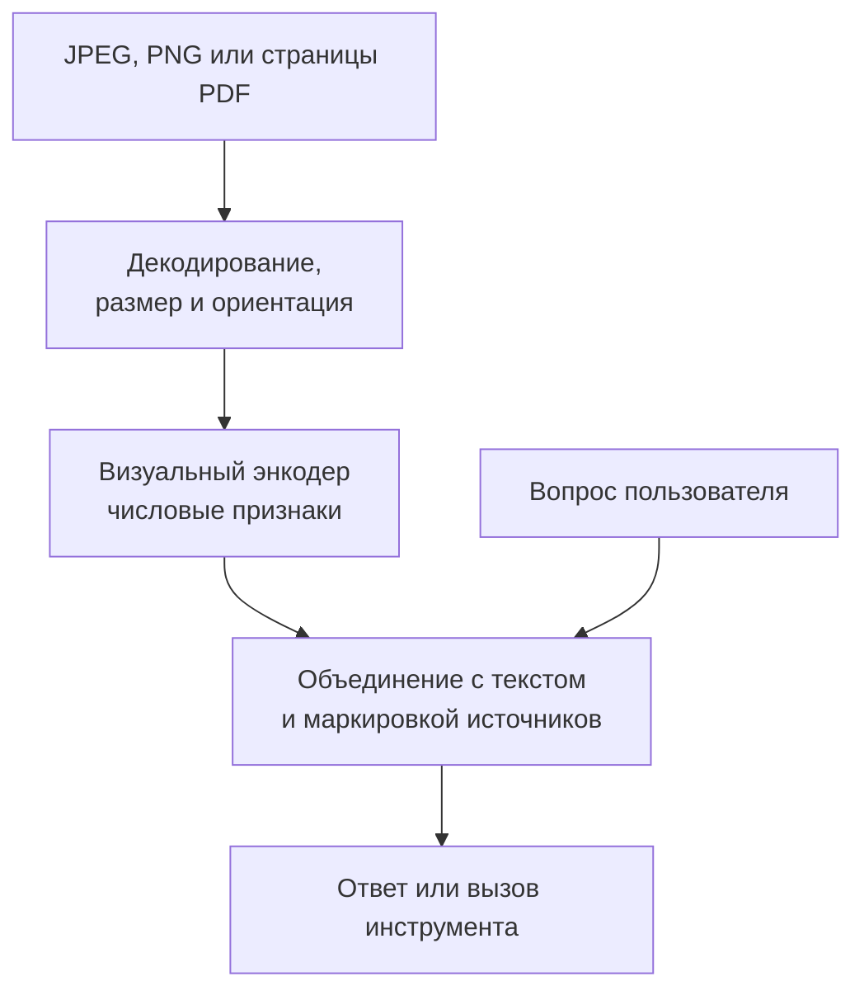

# VLM на практике: как изображение становится входом модели

[[Оценка ИИ-моделей/Бенчмарки агентных VLM/🏠 Бенчмарки и технологии агентных VLM|← Теория и исследования]]

## Быстрая навигация

- [[#1. Зачем аналитику немного архитектуры|1. Зачем аналитику немного архитектуры]]
- [[#2. Путь от файла до ответа|2. Путь от файла до ответа]]
- [[#3. Почему большой исходный файл не гарантирует хорошее чтение|3. Почему большой исходный файл не гарантирует хорошее чтение]]
- [[#4. Что добавляется при нескольких изображениях|4. Что добавляется при нескольких изображениях]]
- [[#5. OCR и VLM — не взаимоисключающие подходы|5. OCR и VLM — не взаимоисключающие подходы]]
- [[#6. Как выбирать модель под задачу|6. Как выбирать модель под задачу]]
- [[#7. Что значит «научить рассуждать перед ответом»|7. Что значит «научить рассуждать перед ответом»]]
- [[#8. Мини-разговор на интервью|8. Мини-разговор на интервью]]
- [[#9. Что должно остаться в голове|9. Что должно остаться в голове]]

## 1. Зачем аналитику немного архитектуры

Если модель ошиблась на маленьком числе, причина может быть не в «логике», а в том, что на её вход попала слишком уменьшенная картинка. Если перепутала страницы — полезно проверить порядок и маркировку источников. Чтобы задавать такие вопросы, не нужно проектировать нейросеть с нуля, но нужно понимать путь данных.

VLM, vision-language model, — модель, работающая с визуальной информацией и языком. MLLM — мультимодальная большая языковая модель; термин шире, но в обсуждении картинок часто обозначает близкий класс систем. Это не название одного алгоритма или библиотеки.

Ниже — упрощённая общая схема. Конкретные модели отличаются обработкой размеров, объединением представлений и форматами координат. Например, Qwen2.5-VL описывает динамическое разрешение, а её официальный материал отдельно указывает представление координат в масштабе изображения. Это пример архитектуры, не утверждение о внутреннем устройстве Alice AI. [Технический отчёт](https://arxiv.org/abs/2502.13923), [описание Qwen](https://qwenlm.github.io/blog/qwen2.5-vl/).

## 2. Путь от файла до ответа

Файл декодируется в пиксели. Препроцессор — этап подготовки входа — меняет размер, нормализует значения, иногда разбивает картинку на фрагменты. Визуальный энкодер превращает её в числовые признаки. Затем эти признаки согласуются с языковой частью, которая учитывает и вопрос, и визуальные представления.

Визуальный токен — элемент представления изображения для дальнейшей обработки. Он не обязательно соответствует одному объекту или одному слову. Количество токенов зависит от модели и подготовки входа; формулу «одна картинка — столько-то токенов» нельзя переносить между системами.

Практический смысл: большая страница с мелким текстом может требовать больше визуальных ресурсов. Если сильно сократить вход, потеряем детали; если сохранить много фрагментов, вырастут память, стоимость и время. Это компромисс, который можно измерять.

## 3. Почему большой исходный файл не гарантирует хорошее чтение

Допустим, пользователь прислал страницу шириной 3 000 пикселей. Перед моделью приложение уменьшило её до 750. Высота символа 12 пикселей превратилась примерно в 3. Восстановить точное начертание может быть уже невозможно.

Поэтому в диагностике сохраняем параметры **реального входа после подготовки**, а не только исходный файл. Проверяем ориентацию, сжатие, цвет, число переданных страниц, порядок и обрезку. Иногда исправление препроцессинга полезнее дополнительной разметки.

Но больше пикселей не всегда лучше: если система перегружена огромными страницами, можно точечно извлекать нужные фрагменты. Важно оставить контекст, например название поля и единицу измерения вместе с числом.

## 4. Что добавляется при нескольких изображениях

Модели нужно не только прочитать каждое, но и удержать соответствия: какой факт на какой странице; какие страницы относятся к одному объекту; где продолжение таблицы; где новая версия документа.

Нельзя считать, что простая склейка картинок в одно полотно всегда эквивалентна отдельным входам. Склейка меняет масштаб, порядок и визуальные границы. Несколько входов тоже могут обрабатываться с общим бюджетом, из-за чего увеличение их числа сокращает доступные детали на каждое.

Для теста полезны три раздельных режима: независимые вопросы по изображениям; сопоставление; совместное вычисление. Например, прочитать два чека — первая способность, определить дубликат — вторая, посчитать общий итог без двойного счёта — третья.

## 5. OCR и VLM — не взаимоисключающие подходы

OCR специализируется на распознавании текста. VLM может учитывать внешний вид, расположение, объекты и инструкцию. Конвейер OCR → языковая модель удобен, когда текстовые поля и структура хорошо извлекаются. Прямой VLM-подход полезен, если внешний вид и взаимное расположение важны и промежуточное преобразование теряет сведения.

Гибрид сохраняет исходник и распознанные строки с координатами. Но при конфликте источников нужно правило: не считать OCR автоматически истиной и не просить модель молча выбрать удобный вариант. В диагностике отдельно устанавливаем, какой источник ошибся.

Конкретные семейства для знакомства: Qwen2.5-VL как документированный пример открытой VLM; LLaVA как пример семейства визуально-языковых моделей, использованного в ToolVQA. Это не рекомендации «взять самую новую» и не утверждение, что они лучшие в сентябре 2026. Практический выбор делается сравнением доступных кандидатов на собственных данных и ограничениях.

## 6. Как выбирать модель под задачу

Составляем короткую матрицу требований: русский и рукописный текст, несколько страниц, координаты, вызовы инструментов, размер входа, задержка, доступное оборудование, лицензия и режим обработки персональных данных.

Далее пилот на одних и тех же задачах. Сначала минимум сложной оркестрации, чтобы увидеть базовый уровень; затем одинаково определённые инструментальные режимы. Если одной модели дали OCR и пять попыток, а другой только картинку, в отчёте это разные системы.

Смотрим не только среднюю успешность, но и ошибки, особенно уверенные и неразрешимые случаи. Маленькая модель с надёжным OCR может оказаться практичнее большой на чётких бланках; большая может лучше справляться с вариативными объяснениями. Это гипотезы для проверки, не универсальный закон.

## 7. Что значит «научить рассуждать перед ответом»

Для оценки полезнее перевести это в наблюдаемые навыки: агент собирает нужные факты, выбирает подходящее действие, учитывает результат, проверяет противоречия, останавливается при достаточных данных. Длина объяснения не является метрикой правильности этих навыков.

Если модель выдаёт краткое обоснование, его можно проверять на соответствие фактам. Но оно не обязательно полностью и достоверно отражает внутренние вычисления. В бенчмарке опираемся на доступные наблюдения: вызовы, изображения, результаты, конечный ответ.

## 8. Мини-разговор на интервью

**Интервьюер:** «На изображении 4K модель не прочитала номер. Почему?»

**Кандидат:** «Проверю не только оригинал, но и что реально дошло до модели: размер, фрагменты, лимит визуального входа. Потом сравню прямое чтение с правильным crop. Если crop помогает, проблема может быть в доступности деталей, а не в способности работать с числами. Но отдельно проверю, не убрали ли мы неоднозначность дополнительной подсказкой».

**Интервьюер:** «Тогда всегда делаем crop?»

**Кандидат:** «Нужно ещё правильно его выбрать. В реальном запуске область выбирает алгоритм, а не эксперт с эталоном. Поэтому проверяю всю цепочку и случаи, где обрезка теряет название поля».

## 9. Что должно остаться в голове

Ошибки VLM бывают вызваны не только обучением, но и подготовкой входа, потерей источников и ограничениями среды. Продуктовый бенчмарк должен фиксировать эти условия. Иначе мы сравним два способа передачи картинок и ошибочно назовём результат разницей интеллекта моделей.

Далее: [[Оценка ИИ-моделей/Бенчмарки агентных VLM/Визуальные инструменты — OCR, области, координаты и безопасное выполнение|координаты и инструменты]] и [[Разборы кейсов/VLM и мультимодальность/Кейс VLM 01 — бенчмарк на несколько изображений и отбор 400 задач|бенчмарк multi-image]].
