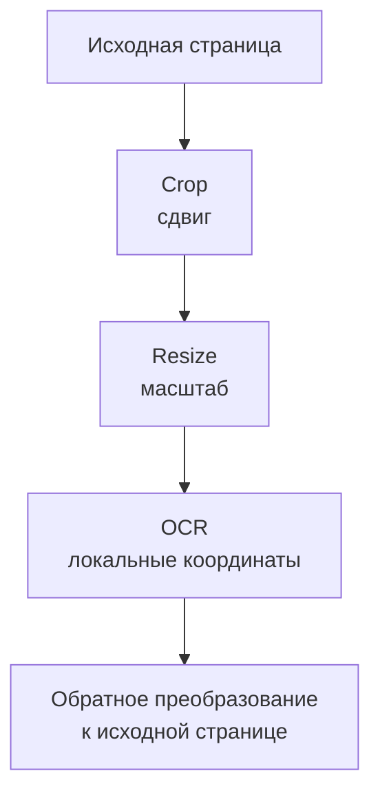

# Визуальные инструменты: что агент вызывает на самом деле

[[Оценка ИИ-моделей/Бенчмарки агентных VLM/🏠 Бенчмарки и технологии агентных VLM|← Теория]]

## Быстрая навигация

- [[#1. Вызов инструмента — сообщение, которое исполняет программа|1. Вызов инструмента — сообщение, которое исполняет программа]]
- [[#2. Разбираемся с координатами|2. Разбираемся с координатами]]
- [[#3. Код безопасного преобразования|3. Код безопасного преобразования]]
- [[#4. Как вернуть координаты обратно|4. Как вернуть координаты обратно]]
- [[#5. Что возвращать от OCR|5. Что возвращать от OCR]]
- [[#6. Предопределённые инструменты и произвольный Python|6. Предопределённые инструменты и произвольный Python]]
- [[#7. Безопасная среда — часть качества|7. Безопасная среда — часть качества]]
- [[#8. Как тестировать контракт|8. Как тестировать контракт]]
- [[#9. Где здесь MCP|9. Где здесь MCP]]
- [[#10. На интервью|10. На интервью]]

## 1. Вызов инструмента — сообщение, которое исполняет программа

Модель не получает магическую способность вырезать изображение. Она формирует запрос, например имя crop_image и аргументы. Обёртка проверяет их, вызывает реальную функцию и возвращает результат как новое наблюдение. После этого модель решает, что делать дальше.

В хорошем контракте указано: какое изображение обрабатывается, в какой системе координат область, какие форматы допустимы, что возвращается при ошибке. Без этого один и тот же набор четырёх чисел может означать разные прямоугольники.

```json
{
  "tool": "crop_image",
  "arguments": {
    "image_id": "page_2",
    "box_xyxy_norm": [0.10, 0.25, 0.60, 0.50]
  }
}
```

Это наш учебный контракт, не формат конкретного API Алисы или универсальный стандарт всех VLM.

## 2. Разбираемся с координатами

Пусть исходное изображение имеет ширину 1 200 и высоту 800 пикселей. Нормализованные координаты лежат от 0 до 1. Область выше соответствует примерно: слева 120, сверху 200, справа 720, снизу 400. Размер фрагмента — 600 × 200.

Ось x идёт вправо, y — вниз. Формат xyxy означает две угловые точки. Формат xywh означал бы левую верхнюю точку, ширину и высоту. Ошибка между ними даёт валидные числа, но неправильную область.

В Pillow crop принимает прямоугольник с левой, верхней, правой и нижней границей. Правая и нижняя границы задают край области, а не индекс включаемого последнего пикселя. [Документация Image.crop](https://pillow.readthedocs.io/en/stable/reference/Image.html#PIL.Image.Image.crop).

## 3. Код безопасного преобразования

```python
import math

def to_pixel_box(box, width: int, height: int):
    if width <= 0 or height <= 0:
        raise ValueError("Image size must be positive")
    if len(box) != 4:
        raise ValueError("Expected four coordinates")
    left, top, right, bottom = map(float, box)
    if not all(math.isfinite(v) for v in (left, top, right, bottom)):
        raise ValueError("Coordinates must be finite")
    if not (0 <= left < right <= 1 and 0 <= top < bottom <= 1):
        raise ValueError("Invalid normalized box")
    return (
        math.floor(left * width),
        math.floor(top * height),
        math.ceil(right * width),
        math.ceil(bottom * height),
    )

assert to_pixel_box([0.1, 0.25, 0.6, 0.5], 1200, 800) == (120, 200, 720, 400)
```

Округляем начало вниз, конец вверх, чтобы не потерять пограничный пиксель. Здесь выбрана строгая политика: неверную область отклоняем, а не молча исправляем. Другой инструмент может обрезать границы по размеру картинки, но это должно быть явно описано и протестировано.

После преобразования обычный вызов `image.crop(pixel_box)` создаёт фрагмент. В рабочем сервисе ещё нужны ограничения размера файла и числа пикселей, проверка формата, допустимый идентификатор изображения и лимит времени. Пример выше решает только координатную часть.

## 4. Как вернуть координаты обратно

Вырезали область с левым верхним углом (120, 200). Увеличили её в два раза. OCR нашёл символ в точке (80, 40) **на увеличенном фрагменте**. В исходном изображении это:

```text
x_original = 120 + 80 / 2 = 160
y_original = 200 + 40 / 2 = 220
```

Для прямоугольника так преобразуются обе границы. Если было вращение или исправление перспективы, простого сдвига и масштаба уже недостаточно: сохраняем преобразование и используем обратное отображение. Иначе источник цитаты будет указывать не на тот участок.



## 5. Что возвращать от OCR

Полезная запись: image_id, текст строки, область, система координат, версия распознавателя и сведения о преобразованиях. Уверенность OCR может быть дополнительным сигналом, но её смысл и калибровку надо проверить. Уверенный OCR тоже может систематически путать похожие символы.

Важно не потерять структуру: число 1280 без подписи может быть итогом, номером документа или количеством. Если задача требует строк таблицы, плоский текст без порядка и областей может быть недостаточен.

## 6. Предопределённые инструменты и произвольный Python

Первый вариант: небольшой набор разрешённых функций — crop, rotate, OCR, calculator. Их легче проверять и ограничивать. Второй: агент пишет Python под задачу. Это гибче — например, можно построить маску цветов или совместить изображения, — но сложнее безопасно выполнять и воспроизводить.

PyVision, опубликованный в июле 2025 года, исследует динамическое создание инструментов через код и многошаговое взаимодействие с Python. Это пример агентной организации, а не просто новая VLM или универсальный бенчмарк. [Статья PyVision](https://arxiv.org/abs/2507.07998), [страница авторов](https://agent-x.space/pyvision/).

Практический выбор: если большинство задач покрывается несколькими надёжными функциями, начинаем с них. Произвольный код добавляем, когда есть подтверждённые задачи, где его гибкость полезна, и готовая изолированная среда.

## 7. Безопасная среда — часть качества

Запускаемый код не должен иметь секретов, доступа к эталонам и произвольным файлам пользователя. Ограничиваем сеть, память, процессорное время, число процессов и объём результатов. У каждой задачи — чистое состояние или явно управляемое разделение.

Нельзя считать безопасностью один try/except. Исключение ловит сбой, но не запрещает чтение чужого файла или отправку данных. Также проверяем содержимое вывода: файл действительно существует и соответствует ожидаемому формату.

Веб-страницы, распознанный текст и надписи на изображениях могут содержать команды для модели. Это недоверенные данные, не разрешение менять правила работы. Полномочия инструментов ограничиваются вне модели.

## 8. Как тестировать контракт

Юнит-тесты: границы 0 и 1, перепутанные координаты, NaN, пустая область, неправильный image_id, повторный вызов. Интеграционные тесты: корректный фрагмент действительно возвращается модели; после поворота ссылки указывают на исходную страницу; ошибка инструмента не маскируется под успешный ответ.

В бенчмарке отдельно учитываем техническую валидность и смысл. Область может быть формально допустимой, но не содержать нужного поля. Это уже ошибка выбора, а не ошибки парсинга.

## 9. Где здесь MCP

MCP — способ стандартизировать взаимодействие приложения с внешними возможностями и ресурсами. Он не выбирает за модель правильный инструмент и не проверяет истинность ответа. Для основ и контракта смотрите существующую карточку [[Оценка ИИ-моделей/Агенты и инструменты/Агентные системы — вызов инструментов, MCP и тестирование|вызовы инструментов и MCP]].

Для этого кейса важно разделить транспорт, функцию и политику: как доставили запрос, что реально исполнилось и почему агент решил это сделать. Поломки на этих уровнях исправляются по-разному.

## 10. На интервью

**Интервьюер:** «Модель передала правильные координаты, но OCR прочитал другое. Что проверите?»

**Кандидат:** «Правильные относительно какой картинки? Проверю идентификатор, размер после подготовки, xyxy против xywh, нормализованные против пиксельных координат, поворот и масштаб. Затем открою фактически вырезанный фрагмент. Только после этого обсуждаю качество распознавания».

Практика: [[Разборы кейсов/VLM и мультимодальность/Кейс VLM 03 — когда вызывать OCR, увеличение и калькулятор|когда инструмент полезен]].
