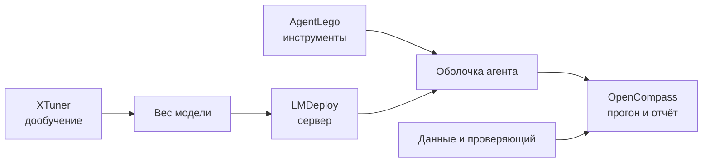

# Инструментальный стек: OpenCompass, AgentLego, LMDeploy и XTuner

[[Оценка ИИ-моделей/Бенчмарки агентных VLM/🏠 Бенчмарки и технологии агентных VLM|← Обзор]]

> [!abstract] Зачем отдельная карточка
> В описании ToolVQA эти названия стоят рядом, и легко принять их за четыре модели или за обязательный стек. На самом деле это разные роли вокруг модели: обслуживание, инструменты, оркестрация оценки и дообучение.

## Быстрая навигация

- [[#1. Карта ролей|1. Карта ролей]]
- [[#2. LMDeploy — как подать запрос модели|2. LMDeploy]]
- [[#3. AgentLego — что реально делает инструмент|3. AgentLego]]
- [[#4. OpenCompass — как связать запуск и оценку|4. OpenCompass]]
- [[#5. XTuner — где находится обучение|5. XTuner]]
- [[#6. Как соединить в эксперименте|6. Эксперимент]]
- [[#7. Что могут спросить на интервью|7. Вопросы]]

## 1. Карта ролей

| Компонент | Его роль | Что он не решает сам |
|---|---|---|
| LMDeploy | Обслуживание языковой или мультимодальной модели через локальный сервер | Не проектирует хороший benchmark и не доказывает качество ответа |
| AgentLego | Предоставление внешних инструментов агенту через API | Не выбирает за модель нужный инструмент |
| OpenCompass | Запуск воспроизводимой оценки моделей и агентов | Не превращает плохой эталон в правильный |
| XTuner | Конфигурация и запуск дообучения | Не гарантирует, что данные пригодны и нет утечки |

ToolVQA называет эти проекты частями своей реализации и рекомендует раздельные окружения, чтобы зависимости не конфликтовали. Это информация о репозитории ToolVQA, а не требование вакансии или утверждение, что в Alice AI используется именно этот стек. [README ToolVQA](https://github.com/Fugtemypt123/ToolVQA-release#21-environments).

## 2. LMDeploy — как подать запрос модели

Сервис загрузит веса, примет запрос, применит шаблон диалога и вернёт генерацию. Для эксперимента фиксируем модель, квантование, температуру, число токенов, очередь, тайм-аут и версию сервера. Две системы с одним названием модели, но разными шаблонами или ограничениями, могут дать разные результаты.

Роль сервера особенно важна для задержки и стоимости. Если считать только время генерации после попадания запроса в GPU, а не очередь и сериализацию изображения, получим неполную продуктовую метрику.

## 3. AgentLego — что реально делает инструмент

Инструмент — контролируемая функция с описанием, схемой аргументов и результатом. Например, ImageDescription принимает image_path и возвращает текст; калькулятор принимает безопасное выражение и возвращает число. В тесте фиксируем контракт и версии внешних моделей.

Ошибки бывают на трёх уровнях: модель выбрала неправильный инструмент; передала неверные аргументы; сам инструмент вернул неверный или устаревший результат. AgentLego помогает исполнить вызов, но не определяет истинность результата.

## 4. OpenCompass — как связать запуск и оценку

Оркестратор берёт список задач, подаёт их агенту, записывает шаги и применяет оценщик. Полезно отделять код исполнения от кода подсчёта: можно повторно оценить сохранённые ответы новой версией checker без нового дорогого запуска.

В конфигурации явно задаём набор данных, формат мультимодального сообщения, доступные инструменты, число попыток, лимиты и функцию агрегации. Не путайте формат запуска с содержанием golden set.

## 5. XTuner — где находится обучение

Дообучение получает данные и создаёт новую версию весов. Перед запуском проверяем маски потерь: не учится ли модель предсказывать подсказанный ответ, который в реальном входе недоступен; не смешаны ли изображения и идентификаторы; нет ли семейств теста в обучении.

После обучения запускаем не только тест, на котором подбирали конфигурацию, но и закрытый набор. Сохраняем seed, версии библиотек, конфигурацию и происхождение данных.

## 6. Как соединить в эксперименте

Шаг 1: готовим маленький набор с одним успешным примером, отказом инструмента и неправильными аргументами. Шаг 2: запускаем модель без агента и с инструментом. Шаг 3: проверяем логи и состояние среды. Шаг 4: прогоняем полный набор с зафиксированными ресурсами. Шаг 5: считаем общий успех и диагностические метрики, сохраняя сырые записи.

Если сервис модели упал, это не «неправильный ответ модели». В отчёте есть технический отказ и отдельное значение общей пользовательской успешности, включающее этот отказ. Иначе инфраструктурные ошибки исчезнут из оценки полной системы.

**Интервьюер:** «Можно ли всё установить в одно окружение?»

**Кандидат:** «Технически иногда да, но в репозитории ToolVQA прямо рекомендуются отдельные окружения. Для воспроизводимости я изолирую роли или контейнеры, фиксирую версии и сначала проверяю минимальный запуск. Конкретное решение зависит от ограничений инфраструктуры».

## 7. Что могут спросить на интервью

- Где искать ошибку, если инструмент выбран правильно, но итог неверен?
- Что фиксировать для воспроизводимости, кроме названия модели?
- Как проверить, что дообучение не видело тестовые изображения?
- Почему нельзя измерять стоимость только числом токенов?
- Как повторно пересчитать старые ответы новым checker?

Ответ должен звучать через границы ответственности компонентов. Название фреймворка без объяснения данных, среды и проверяющего не показывает понимания системы.

## Связанные материалы

- [[Оценка ИИ-моделей/Бенчмарки агентных VLM/GTA — исполнимые инструменты, метрики и переход к GTA-2|GTA и исполнимые инструменты]]
- [[Оценка ИИ-моделей/Бенчмарки агентных VLM/Визуальные инструменты — OCR, области, координаты и безопасное выполнение|контракт визуального инструмента]]
- [[Оценка ИИ-моделей/Бенчмарки агентных VLM/Траектории VLM — SFT, RL, синтетика и проверяемая награда|обучающие траектории]]
