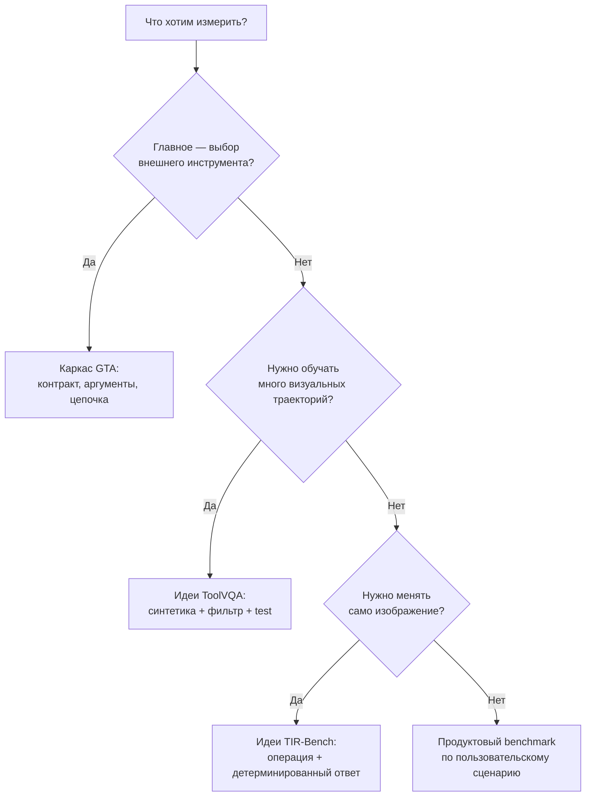

# GTA, ToolVQA и TIR-Bench: не три места в рейтинге, а три разных вопроса

[[Оценка ИИ-моделей/Бенчмарки агентных VLM/🏠 Бенчмарки и технологии агентных VLM|← Обзор бенчмарков]]

> [!abstract] Главный вывод
> GTA отвечает прежде всего на вопрос «может ли агент выбрать и исполнить инструменты для задачи?», ToolVQA показывает, как строить многошаговые визуальные данные и измерять вызовы, а TIR-Bench проверяет активное преобразование изображения — поворот, вырезание, измерение и код. Их нельзя свести к одной шкале качества или заменить ими продуктовый набор Алисы.

## Быстрая навигация

- [[#1. Сравнение в одной таблице|1. Сравнение]]
- [[#2. Как читать размеры и даты|2. Версии и размеры]]
- [[#3. Какой набор отвечает на какой вопрос|3. Вопросы]]
- [[#4. Решающее дерево для проектирования своего теста|4. Решающее дерево]]
- [[#5. Что брать для Alice AI VLM|5. Перенос на продукт]]
- [[#6. Как сравнивать результаты честно|6. Честное сравнение]]
- [[#7. Ответ на интервью за пять минут|7. Короткий ответ]]

## 1. Сравнение в одной таблице

| Свойство | GTA / GTA-Atomic | ToolVQA | TIR-Bench |
|---|---|---|---|
| Первая публикация | 2024 | 2025 | 2025 |
| Основной фокус | Общие инструменты и планирование | Многошаговая визуальная VQA с внешними инструментами | «Мышление с изображениями» через активные преобразования |
| Размер, который подтверждён в карточках | 229 заданий, 14 инструментов | 23 655: 21 105 train + 2 550 test | 1 215, 13 типов задач |
| Вход | Одно или два изображения и запрос | Изображение, запрос, контекст действий | Изображения и задача, часто требующая инструмента |
| Как получены задания | Экспертно спроектированные реалистичные вопросы и вручную проверенные цепочки | Синтетический ToolEngine, затем человеческая проверка теста | Существующие данные, интернет, ручная и программная генерация |
| Что считается промежуточным навыком | Выбор инструмента, аргументы, выполнение, итог | InstAcc, ToolAcc, ArgAcc, SummAcc и конечный ответ | Корректность конечного ответа и, для некоторых задач, параметров инструмента |
| Главная сильная сторона | Ясная связь между запросом, цепочкой и исполнимой средой | Большой материал для обучения и анализа необходимости вызовов | Широкий набор визуальных операций и детерминированные задачи |
| Главное ограничение | Небольшой набор и фиксированный набор инструментов | Синтетическая формулировка и режимы могут быть непродуктовыми | Набор специально сделан трудным; многие задачи не отражают повседневный поток |

Числа относятся к указанным версиям источников. Например, 229 и 23 655 нельзя читать как «у ToolVQA в сто раз лучше покрытие»: разные строки являются примером, тренировочной единицей и проверочным заданием с разным назначением.

## 2. Как читать размеры и даты

У каждого набора минимум три даты: первая статья; публикация кода или данных; конкретная таблица результатов. Иногда репозиторий позже получает новую версию.

GTA особенно легко перепутать: исходный набор сейчас обозначается как GTA-Atomic, а GTA-2 добавляет GTA-Workflow для длинных открытых задач. Показатель 45.07 GPT-5 относится к таблице GTA-Atomic за февраль 2026, а 14.39% относится к эксперименту GTA-2 по workflow. Это разные знаменатели и системы.

У ToolVQA цифры 21 105 и 2 550 относятся к train и test, а 23 655 — сумме. 2.78 — средняя длина траектории; 2.38 в абляции — оценка глубины рассуждения по другой инструкции. Нельзя «исправлять» одно число другим без чтения определения.

В TIR-Bench в тексте описания одного типа задач встречается число 100, а в итоговой таблице — 120 для Maze. В карточке используем таблицу, дающую сумму 1 215, и отдельно предупреждаем об этом расхождении. На интервью такая аккуратность лучше уверенного, но смешанного пересказа.

## 3. Какой набор отвечает на какой вопрос

Представим три гипотезы для Алисы.

**Гипотеза A:** агент видит чек, но не умеет выбрать OCR и калькулятор. Начинаем с идей GTA: описываем доступные инструменты, скрываем путь в вопросе, проверяем имя инструмента и аргументы, затем итог.

**Гипотеза B:** данные для обучения слишком часто содержат лишние вызовы. Идея ToolVQA полезна полем `is_important`: эксперт отмечает, необходим ли каждый вызов. Для своего продукта это нужно расширить: был ли вызов допустимым, помог ли он, можно ли было решить дешевле.

**Гипотеза C:** мелкий текст читается только после поворота и увеличения. Идея TIR-Bench — задача, в которой преобразование изображения является частью решения. В продукте дополнительно проверяем задержку, качество области и корректную привязку к исходной странице.

Ни один набор не отвечает одновременно на вопрос о русскоязычных документах, безопасности персональных данных и полезности ответа пользователю. Это требует собственного слоя.

## 4. Решающее дерево для проектирования своего теста

Это не автоматический выбор научной статьи. Дерево заставляет связать цель, единицу оценки и подходящий проверяющий.

## 5. Что брать для Alice AI VLM

Для продуктовой оценки строим собственную матрицу: русский язык; реальные разрешённые фото; одна и несколько страниц; читаемый и нечитаемый текст; multi-image-сопоставление; выбор OCR, crop, поиска или калькулятора; безопасное уточнение; время и стоимость.

Из GTA берём идею исполнителя и раздельные метрики этапов. Из ToolVQA — проверку качества синтетического генератора, необходимости каждого действия и хранение структурированной траектории. Из TIR-Bench — контролируемые операции изображения и объективные ответы.

Не копируем слепо частоты и инструментальные API. Прежде чем включить задачу в набор, спрашиваем: встречается ли она в пользовательском потоке, может ли человек установить эталон, что произойдёт при техническом отказе, нужен ли этот инструмент для задачи и не утечёт ли ответ в текст запроса.

## 6. Как сравнивать результаты честно

1. Фиксируем версию статьи, датасета, кода и таблицы.
2. Указываем модель, режим VLM/LLM+tool, доступные инструменты, промпт, число попыток и лимиты.
3. Используем одинаковый набор и не смешиваем сквозное выполнение с подсказанной эталонной историей.
4. Читаем код оценщика: точный ответ, частичный балл, нормализация текста, агрегация и обработка ошибок.
5. Показываем категории и парные изменения, а не только один общий балл.
6. Отдельно проверяем утечки и актуальность модели/API.

Один и тот же вызов Python-интерпретатора может означать разные возможности: в TIR-Bench `o3-TU` — режим с инструментом, а GPT-модели без интерпретатора тестировались через Azure API. Нельзя описывать разницу как чистый эффект «размера модели».

## 7. Ответ на интервью за пять минут

«Я бы не складывал GTA, ToolVQA и TIR-Bench в общий рейтинг. GTA даёт каркас проверки исполнимого tool use: выбор действия, аргументы, результат и финальный ответ. ToolVQA полезен как пример крупного синтетического конвейера, где сначала строятся многошаговые визуальные траектории, затем люди проверяют тест и необходимость вызовов. TIR-Bench проверяет другой навык — агент меняет изображение, чтобы добыть информацию, например поворачивает текст или считает долю цвета.

Для Алисы я бы использовал их как источники идей и внешние диагностические сигналы, но создал продуктовый слой на русскоязычных пользовательских сценариях. Перед сравнением зафиксировал бы версии, режим работы, инструменты и проверяющего. Главная метрика была бы связана с решённой задачей, а выбор инструмента, корректность аргументов, задержка и безопасность — отдельными диагностическими и защитными сигналами. Если внешний балл растёт, а внутренний нет, проверил бы покрытие, утечки и состав ошибок, а не объявлял один из тестов неправильным».

## Связанные карточки

- [[Оценка ИИ-моделей/Бенчмарки агентных VLM/GTA — исполнимые инструменты, метрики и переход к GTA-2|GTA]]
- [[Оценка ИИ-моделей/Бенчмарки агентных VLM/ToolVQA — данные, ToolEngine, траектории и оценка|ToolVQA]]
- [[Оценка ИИ-моделей/Бенчмарки агентных VLM/TIR-Bench — мышление с изображениями, задачи и реальный смысл баллов|TIR-Bench]]
- [[Разборы кейсов/VLM и мультимодальность/Кейс VLM 04 — публичный бенчмарк вырос, качество продукта нет|Кейс о переносе внешней оценки]]
