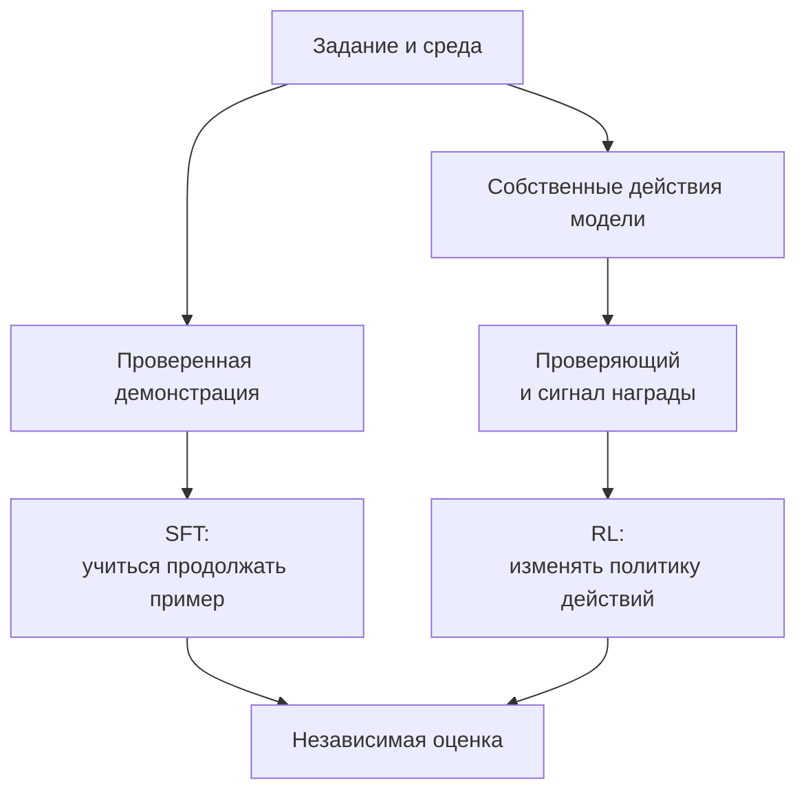

# Траектории VLM: как действия превращаются в обучающие данные

[[Оценка ИИ-моделей/Бенчмарки агентных VLM/🏠 Бенчмарки и технологии агентных VLM|← Теория]]

## Быстрая навигация

- [[#1. Один пример связывает все термины|1. Один пример связывает все термины]]
- [[#2. Три разных применения одной записи|2. Три разных применения одной записи]]
- [[#3. Что записывать в траекторию|3. Что записывать в траекторию]]
- [[#4. Почему правильный итог не делает любую траекторию эталонной|4. Почему правильный итог не делает любую траекторию эталонной]]
- [[#5. Как конструировать награду|5. Как конструировать награду]]
- [[#6. Что значит policy, rollout и reward простыми словами|6. Что значит policy, rollout и reward простыми словами]]
- [[#7. Как проверить пользу данных и обучения|7. Как проверить пользу данных и обучения]]
- [[#8. Какие программные компоненты понадобятся|8. Какие программные компоненты понадобятся]]
- [[#9. Интервью: чего ждут от конкретного ответа|9. Интервью: чего ждут от конкретного ответа]]

## 1. Один пример связывает все термины

Пользователь спрашивает сумму по двум чекам. Агент вырезает итог первого, получает изображение, читает число, повторяет для второго, вызывает калькулятор и отвечает. Список действий и наблюдений — траектория. Она включает не только итог, но и то, с какой информацией принималось следующее решение.

Слово golden означает проверенную демонстрацию, пригодную как ориентир. Оно не означает единственный возможный путь. Можно прочитать оба чека без OCR, а можно через него. Если оба решения корректны и соответствуют условиям, буквальное несовпадение действий не делает одно ошибочным.

## 2. Три разных применения одной записи

**Для диагностики** смотрим, где возникла ошибка. **Для SFT**, supervised fine-tuning, обучаем модель на правильных примерах: по доступной истории предсказывать следующее действие или ответ. **Для RL**, reinforcement learning, модель сама действует, а затем получает оценку результата; обучение меняет вероятность будущих действий.

SFT — «вот хороший пример, научись так продолжать». RL — «попробуй сам, результат будет проверен». Это упрощение, но оно помогает не путать набор демонстраций со средой для обучения.



SFT часто полезен перед RL, но не является обязательным законом. DeepEyes исследует обучение визуальному использованию инструментов через RL без предварительно собранных демонстраций для отдельного стартового SFT. Работа впервые опубликована в мае 2025 года. Это конкретный исследовательский результат, не гарантия, что такой путь оптимален для любого продукта. [DeepEyes](https://arxiv.org/abs/2505.14362).

## 3. Что записывать в траекторию

Храним task_id, версию среды, доступные инструменты, изображения и их происхождение, сообщения модели, вызовы с аргументами, наблюдения, время, ошибки, итог и результат проверяющего.

```json
{
  "step": 2,
  "action": {
    "name": "calculator",
    "arguments": {"expression": "1280 + 980"}
  },
  "observation": {"result": 2260, "status": "ok"},
  "latency_ms": 7
}
```

Это учебный формат. В реальной системе вычисления лучше представлять безопасной структурой операций, а не выполнять произвольную строку через eval.

Не требуем скрытого внутреннего хода мысли. Наблюдаемые действия и проверяемые результаты уже позволяют многое диагностировать. Пояснения модели могут быть дополнительным обучающим материалом, но их нельзя считать автоматически истинным описанием её механизма решения.

## 4. Почему правильный итог не делает любую траекторию эталонной

Агент мог прочитать 1 280 как 1 200, а 980 как 1 060 и случайно получить правильную сумму 2 260. Финальный проверяющий примет число, но такая демонстрация учит ошибочным извлечениям.

Другие дефекты: выдуманный ответ инструмента, невозможный путь файла, чтение эталона из среды, ненужная передача персональных данных, зацикливание с удачным финалом. Поэтому для обучающих демонстраций дополнительно проверяем шаги и ограничения.

Не каждый промежуточный шаг должен буквально совпасть с человеком. Критерий — исполнимость, фактическая опора и соблюдение требований. Можно хранить несколько допустимых демонстраций, чтобы не обучать один хрупкий шаблон.

## 5. Как конструировать награду

Начинаем с конечной задачи: правильный ответ при соблюдении обязательных ограничений. Затем решаем, нужны ли дополнительные сигналы за частичный прогресс и экономность.

Учебный вариант для безопасной арифметики: 1 за полностью верный ответ, 0 за неверный. Стоимость действий учитывается отдельным отчётом или небольшим штрафом, подобранным на разработческих данных. Для серьёзного нарушения безопасности нельзя позволить высокому баллу за ответ «выкупить» нарушение; используем жёсткое ограничение при допуске.

Если штраф за вызовы слишком большой, модель научится угадывать без инструментов. Если награждать за количество вызовов, будет вызывать лишнее. Если судья любит длинные объяснения, может расти многословность вместо качества. Это **reward hacking** — оптимизация слабости оценочного правила вместо желаемого навыка.

В исследовании PyVision-RL отдельно рассматривается сокращение взаимодействий при RL как проблема обучения агентному зрению. Для подготовки важна сама проверяемая гипотеза: обучение может уменьшить полезные вызовы, поэтому число и полезность действий нужно отслеживать вместе с итогом. [PyVision-RL, февраль 2026](https://arxiv.org/abs/2602.20739).

## 6. Что значит policy, rollout и reward простыми словами

**Policy**, политика, — способ выбирать следующее действие из истории наблюдений. В нашем случае её задаёт модель вместе с настройками запуска.

**Rollout** — одна реально выполненная попытка пройти задачу. Не запланированный маршрут, а получившаяся последовательность действий.

**Reward**, награда, — числовой сигнал от проверяющего. Это не обязательно удовлетворённость пользователя; связь с ней нужно обосновать.

Если встречается **GRPO**, на уровне интервью достаточно понимать идею сравнения нескольких попыток одной задачи по их наградам и использования относительного качества для обновления политики. Это алгоритм обучения, а не метод составления эталонов. Конкретные детали оптимизации изучаются отдельно; выбрать аббревиатуру недостаточно, если награда неправильна.

## 7. Как проверить пользу данных и обучения

Делаем отдельные экспериментальные варианты: базовая модель; SFT на ответах; SFT на исполнимых траекториях; выбранный RL-режим. Сравниваем на закрытых новых источниках, контролируем вычислительный бюджет и настройки исполнения.

Наблюдаем конечный успех, ошибки инструментов, ложную уверенность, число действий, стоимость, задержку и регрессии на простых задачах. Если обучение улучшило только свой генератор, не делаем вывода о реальных фото.

Один опасный способ подгонки: после каждого запуска смотреть закрытый тест и вручную добавлять его ошибки в обучение. После этого он больше не закрытый. Нужны разработческие наборы для итераций и действительно независимая финальная проверка.

## 8. Какие программные компоненты понадобятся

| Компонент | Простыми словами | Что в нём проверять |
|---|---|---|
| Сервер модели | Принимает вход и возвращает генерацию | Версия, параметры, лимиты, ошибки |
| Исполняющая оболочка | Организует цикл действий | История, остановка, маршрутизация |
| Сервер инструментов | Реально выполняет операции | Контракты, доступы, тайм-ауты |
| Хранилище данных | Связывает задачи, файлы, результаты | Версии, происхождение, разделение |
| Проверяющий | Оценивает результат и ограничения | Независимость, ложные принятия |
| Обучающий конвейер | Превращает записи в обновление модели | Маски потерь, выборка, воспроизводимость |

В ToolVQA встречаются LMDeploy, AgentLego, OpenCompass и XTuner: соответственно обслуживание модели, инструменты, оценка и дообучение. Это пример реализации таких ролей, не обязательный стек вакансии. [Репозиторий ToolVQA](https://github.com/Fugtemypt123/ToolVQA-release).

Для аналитика полезно уметь читать логи и писать SQL по шагам: какой процент задач завершился, какие вызовы чаще ошибаются, сколько стоит успешная задача. При соединении таблиц задач и вызовов нельзя случайно посчитать длинную траекторию десять раз в знаменателе успеха.

## 9. Интервью: чего ждут от конкретного ответа

**Интервьюер:** «Нужно собрать golden trajectories. Что будете делать завтра?»

**Кандидат:** «Выберу конкретный навык и небольшую матрицу задач, подготовлю независимые эталоны результата и исполнимые инструменты. Соберу пилот демонстраций от экспертов или учителя. Повторно выполню их в чистой среде, проверю результат и ограничения, оценю разнообразие и стоимость. После небольшого эксперимента обучения решу, что масштабировать».

**Интервьюер:** «Зачем эксперты, если учитель сильный?»

**Кандидат:** «Чтобы проверить систематические ошибки, неоднозначность задач и качество фильтра. Не обязательно размечать всё вручную, но без независимого аудита сильный учитель может массово обучить нас своим ошибкам».

Практика: [[Разборы кейсов/VLM и мультимодальность/Кейс VLM 05 — синтетические документы и обучающие траектории|конвейер синтетики]], [[Разборы кейсов/VLM и мультимодальность/Кейс VLM 07 — выбрать 2000 примеров для экспертной разметки|бюджет экспертов]].
