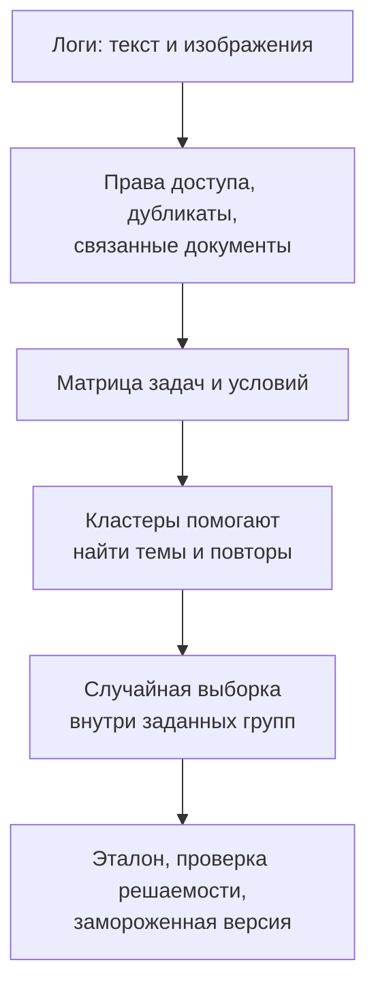
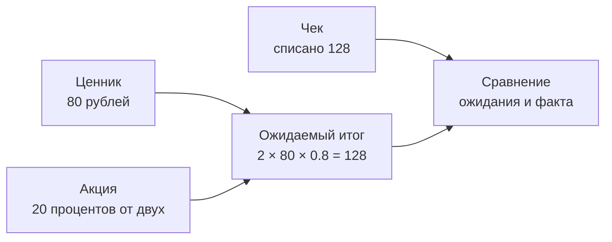

# Кейс 1. Как собрать 400 задач на несколько изображений

[[Разборы кейсов/VLM и мультимодальность/🏠 Alice AI VLM — кейсы и маршрут подготовки|← Все кейсы и теория]]

> [!abstract] Задача интервью
> Алиса умеет принимать несколько фотографий. Нужно сравнить две версии модели: действительно ли новая лучше сопоставляет информацию между изображениями? Есть миллион обращений, а бюджет — на подготовку 400 качественно проверенных заданий.

> [!info] Откуда кейс
> Учебный сценарий по мотивам требований вакансии, не запись интервью Яндекса. Все объёмы, доли и результаты ниже — условные. Они показывают решения, которые кандидат должен уметь обосновать.

## Быстрая навигация

- [[#1. Начинаем не с кластеризации, а с предмета измерения|1. Начинаем не с кластеризации, а с предмета измерения]]
- [[#2. Какую таблицу построить из логов|2. Какую таблицу построить из логов]]
- [[#3. Как использовать эмбеддинги, не потеряв содержание картинки|3. Как использовать эмбеддинги, не потеряв содержание картинки]]
- [[#4. Конкретно: как отобрать 400, а не «взять по кластерам»|4. Конкретно: как отобрать 400, а не «взять по кластерам»]]
- [[#5. Что представляет собой одно подготовленное задание|5. Что представляет собой одно подготовленное задание]]
- [[#6. Как проверить, что нужны все изображения|6. Как проверить, что нужны все изображения]]
- [[#7. Метрики и решение между версиями|7. Метрики и решение между версиями]]
- [[#8. Как звучит содержательное завершение разговора|8. Как звучит содержательное завершение разговора]]
- [[#9. Вопросы для самостоятельного ответа|9. Вопросы для самостоятельного ответа]]

## 1. Начинаем не с кластеризации, а с предмета измерения

**Интервьюер:** «Как сделаете бенчмарк?»

**Кандидат:** «Сначала уточню, какие обращения входят в задачу. Пользователь может прикрепить три независимые фотографии и попросить описать каждую. А может прислать ценник, условия акции и чек, чтобы понять, применили ли скидку. Во втором случае ответ требует соединить сведения. Нас интересуют оба сценария или именно второй?»

Это важное уточнение. Наличие нескольких картинок ещё не означает, что модель использовала их совместно. Если ответ написан крупным шрифтом на первой фотографии, остальные могут вообще не влиять на результат.

Для этого кейса договариваемся: основная цель — **правильный ответ, требующий сопоставить хотя бы два источника**, а независимое описание нескольких картинок оставляем отдельным контрольным срезом.

Единица оценки — обращение целиком: текст запроса, упорядоченный список изображений, история диалога, если она необходима. Не отдельная картинка и не отдельный вызов инструмента. Также уточняем, может ли агент переспросить, доступны ли увеличение изображения и OCR — распознавание напечатанного текста, — и какой допустим бюджет времени.

## 2. Какую таблицу построить из логов

Для каждого обращения собираем идентификатор, дату, язык, число изображений, их размеры и качество, семейство исходного документа, пользовательскую задачу, необходимость совместного чтения, наличие персональных данных, возможность получить однозначный эталон.

«Семейство документа» означает, например, что пять фотографий одного и того же чека или десятки заполнений одного шаблона связаны. Если одно семейство попадёт и в обучение, и в проверку, качество может оказаться завышенным.

Разметку части признаков можно поручить модели, но на первом этапе вручную проверяем несколько сотен обращений. Иначе автоматический классификатор может систематически не узнавать именно те сложные случаи, которые нам нужны.

Не берём личные фото и документы из логов без установленного основания и режима доступа. Для учебного или внешнего набора нужны отдельные разрешения либо безопасно воспроизведённые аналоги. Замена ФИО также не должна незаметно превратить неразборчивый текст в идеально читаемый.

## 3. Как использовать эмбеддинги, не потеряв содержание картинки

Эмбеддинг — числовое представление, по близости которого можно искать похожие обращения. Только текстовый эмбеддинг здесь недостаточен: запросы «сравни эти два» почти одинаковы, а на картинках могут быть договоры, растения или графики.

Я бы начал с сочетания текста запроса и структурированного описания изображения: тип документа, видимые объекты, задача, нужные операции. Затем проверил бы, помогает ли мультимодальное представление, учитывающее изображение. Конкретную модель выбираем по небольшому размеченному набору: оказываются ли действительно похожие задачи рядом? Название модели само по себе не обоснование.

Кластеры — группы похожих обращений — полезны для обнаружения повторов и новых тем. Но они не заменяют матрицу навыков. Один большой кластер «чеки» может содержать чтение суммы, сравнение цен, поиск дубликата и расчёт скидки. Это разные проверяемые способности.

## 4. Конкретно: как отобрать 400, а не «взять по кластерам»

Предлагаю два раздельных набора: 280 обращений для оценки типичного качества и 120 специально сложных проверок. Это стартовое бюджетное решение, а не статистически оптимальное универсальное соотношение.

Предположим, после аудита потока доли четырёх основных задач равны 40%, 30%, 20%, 10%. В типичную часть отбираем соответственно 112, 84, 56 и 28 обращений. Внутри каждого слоя выбираем случайно, предварительно убрав близкие дубликаты. Если потери при подготовке эталона велики, заранее берём резерв и фиксируем причины исключений.

В сложную часть намеренно добавляем нечитаемые фрагменты, лишние изображения, почти одинаковые документы, конфликтующие версии и случаи, где нужно переспросить. Например, 30 задач на каждую из четырёх групп. Их нельзя просто смешать с типичными и объявить среднее «качеством на пользователях»: частоты здесь придуманы для диагностики.

**Интервьюер:** «Почему не взять центры кластеров?»

**Кандидат:** «Ближайшие к центру примеры обычно удобнее и типичнее. Если брать только их, потеряем границы и сложные случаи. Для оценки потока нужен вероятностный отбор. Центры и границы полезны для разведки и диагностического набора, но это другой способ использования данных».

Если редкую категорию намеренно переотобрали, можно посчитать взвешенную оценку: качество каждого слоя умножить на его долю в целевом потоке. Но веса не исправят отсутствие целого класса задач или исключение всех неразборчивых фото.

## 5. Что представляет собой одно подготовленное задание

Пользователь прислал ценник: «Йогурт 80 рублей», условия: «скидка 20% при покупке двух», и чек: «2 × 80, скидка 32, итог 128». Спрашивает: «Скидку применили правильно?»

Храним не только строку «да», а проверяемые факты: цена единицы 80, количество 2, ставка 0.20, ожидаемый итог 128 рублей, наблюдаемый итог 128. В эталоне отмечаем, на каком изображении находится каждый факт. Вход модели не содержит этот служебный эталон.

Проверяющий — checker — принимает смысловые варианты «да, итог должен быть 128 рублей» и «скидка 32 рубля, всё верно». Он отклоняет ответ «да, вы сэкономили 16 рублей», потому что итоговый вывод случайно верен, но объяснение содержит ошибку.

Для денежных вычислений используем целое число копеек или десятичную арифметику. Для открытого пояснения можно добавить оценку человеком или моделью-судьёй, но арифметику не нужно отдавать на субъективное голосование.

## 6. Как проверить, что нужны все изображения

Удаляем картинку с условиями акции. Теперь данных для однозначного ответа недостаточно. Хорошая система должна признать это, а не повторять старое «да». Меняем в чеке итог на 144 — ожидаемый вывод меняется. Переставляем картинки местами, сохраняя смысл запроса, — содержательный ответ должен остаться прежним.

Это **проверки согласованности при контролируемом изменении входа**. Они выявляют короткие пути решения: модель могла угадывать «да» по форме вопроса или читать только последний документ. Но нельзя считать каждый производный вариант независимым примером при расчёте доверительного интервала: варианты одного исходного задания связаны.

Есть исключение: если запрос содержит «сравни первое и второе», перестановка меняет смысл указателей. Нужно вместе с перестановкой обновить эталон или текст, а не требовать неизменности ответа механически.

## 7. Метрики и решение между версиями

Главная метрика — доля полностью решённых обращений. Дополнительно: правильность извлечённых фактов, верная привязка к изображению, корректность вычисления, обоснованное уточнение при нехватке данных, уверенные неподтверждённые ответы, задержка и стоимость.

На 400 задачах версия A решила 280, B — 300. Нельзя ограничиться разницей 5 процентных пунктов. Смотрим парные исходы: сколько конкретных задач B исправила и сколько испортила. Статистику считаем с учётом связанных семейств, а срезы с десятью примерами не объявляем точно измеренными.

Для простой независимой доли около 70% на 400 наблюдениях приблизительная погрешность 95%-интервала составляет около 4.5 п.п. Это иллюстрация масштаба неопределённости, не формула интервала для парной разницы и не обещание мощности на эффект 5 п.п.

## 8. Как звучит содержательное завершение разговора

**Интервьюер:** «То есть 400 достаточно?»

**Кандидат:** «Для первого воспроизводимого сравнения и поиска крупных проблем — возможно. Для доказательства небольшого прироста на редком срезе — нет. Сначала оценю разброс на пилоте, затем скажу, какие различия можем уверенно обнаруживать. Набор из 400 не должен создавать иллюзию точности».

**Интервьюер:** «Что дадите ML-команде?»

**Кандидат:** «Версионированный набор, спецификацию проверяющего, отчёт по парным изменениям и конкретные примеры. Например, улучшились простые сравнения, но на лишних изображениях модель стала чаще переносить факт не с того документа. Это уже направление для обучения и следующего диагностического набора. Закрытую проверочную часть в обучение не передаю».

## 9. Вопросы для самостоятельного ответа

- Что изменится, если доступны только текстовые логи, а изображения удаляются через неделю?
- Как оценить качество в потоке, если почти все сложные фото невозможно разметить однозначно?
- Почему 400 вариантов двадцати исходных документов — не то же самое, что 400 независимых задач?
- Что делать с задачей, где два эксперта согласны с ответом, но опираются на разные изображения?

> [!tip] Что нужно вспомнить на интервью
> Сначала определите навык и единицу оценки. Затем объясните отбор конкретными числами, устройство эталона и правила проверяющего. Кластеризация — вспомогательная операция, не готовый бенчмарк.

Продолжение: [[Разборы кейсов/VLM и мультимодальность/Кейс VLM 09 — привязка фактов к изображениям и проверки согласованности|как отдельно проверять привязку фактов]]. Аналогия с прошлым интервью: [[Разборы кейсов/Агенты и продукты/Разбор интервью — бенчмарк агента Маркета и отбор 300 задач из миллиона запросов|отбор задач Маркета]].
