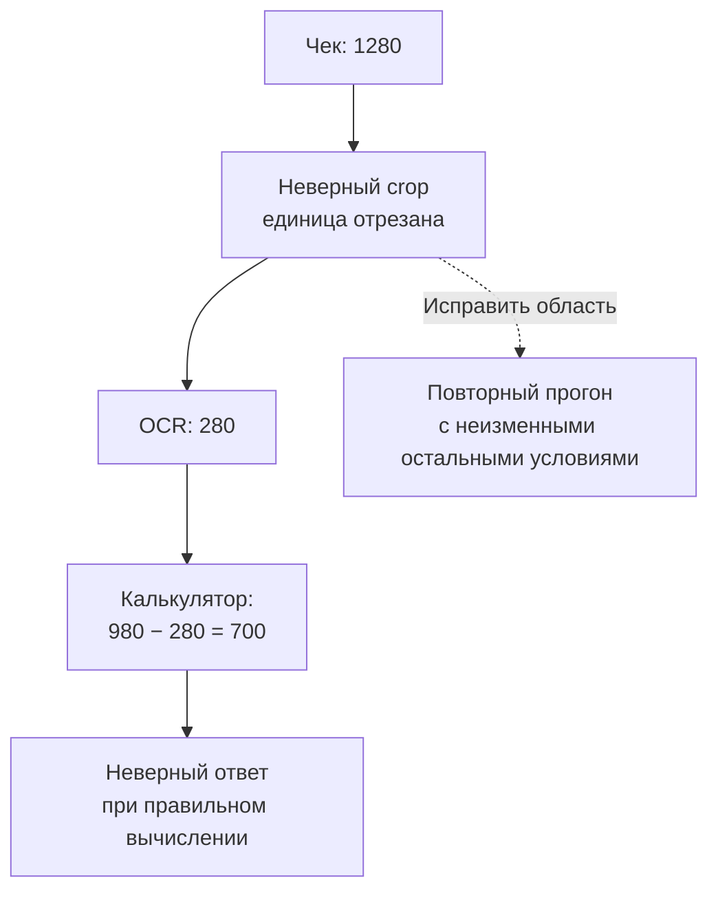

# Кейс 2. Агент ошибается: что именно нужно улучшать

[[Разборы кейсов/VLM и мультимодальность/🏠 Alice AI VLM — кейсы и маршрут подготовки|← Маршрут подготовки]]

> [!abstract] Условие
> На вопросах по двум чекам агент правильно отвечает в 62% случаев. ML-команда предлагает добавить данные для рассуждений. Нужно понять, действительно ли проблема в рассуждении, и выбрать первое улучшение.

Все числа и диалог — учебные. Внутренняя реализация Алисы неизвестна.

## Быстрая навигация

- [[#1. Что уточнить прежде, чем разбирать ошибки|1. Что уточнить прежде, чем разбирать ошибки]]
- [[#2. Разбор одного примера до построения таблицы|2. Разбор одного примера до построения таблицы]]
- [[#3. Таксономия: категории должны вести к разным действиям|3. Таксономия: категории должны вести к разным действиям]]
- [[#4. Как размечать, если ошибок несколько|4. Как размечать, если ошибок несколько]]
- [[#5. Подмена компонента эталоном — конкретная диагностическая проверка|5. Подмена компонента эталоном — конкретная диагностическая проверка]]
- [[#6. Как выбрать, что делать первым|6. Как выбрать, что делать первым]]
- [[#7. Развёрнутый фрагмент интервью|7. Развёрнутый фрагмент интервью]]
- [[#8. Самопроверка|8. Самопроверка]]

## 1. Что уточнить прежде, чем разбирать ошибки

**Кандидат:** «Что считается правильным ответом? Мы сравниваем конечные суммы, распознавание всех строк или объяснение покупателю? Проверяющий допускает разные формы числа? Есть ли случаи, где фото не позволяет прочитать сумму даже человеку?»

Эти вопросы не задержка решения. Если «128,00 руб.» отклоняется вместо «128», у нас дефект оценки, а не модели. Если правильный ответ невозможен, качественным поведением может быть просьба прислать более чёткое фото.

Далее прошу несколько полных записей выполнения: исходные изображения, текст, доступные инструменты, вызовы с аргументами, ответы инструментов, финальный ответ, версии компонентов, время. Полезно иметь краткое объяснение модели, но оно не является достоверной записью всех внутренних вычислений.

## 2. Разбор одного примера до построения таблицы

На первом чеке сумма 1 280 рублей, на втором 980. Пользователь спрашивает, какой дешевле и на сколько. Агент отвечает: «Первый дешевле на 700 рублей».

Открываем запись. OCR вернул 280 вместо 1280: ведущая единица оказалась за границей вырезанного фрагмента. Агент передал калькулятору 980−280 и получил 700. Финальный вывод согласован с неверно извлечёнными данными.

Назвать это «ошибкой арифметики» было бы неверно: калькулятор посчитал правильно. Назвать просто «ошибкой OCR» тоже недостаточно: исходный текст распознаётся при корректной области. Первая наблюдаемая неисправность здесь — выбор области изображения.

## 3. Таксономия: категории должны вести к разным действиям

Таксономия — согласованный список типов ошибок. Она нужна не для красивой диаграммы, а чтобы разные специалисты одинаково описывали проблему и понимали, что проверять дальше.

| Категория | Наблюдаемый пример | Возможное действие |
|---|---|---|
| Восприятие | Не различил 3 и 8 на исходном фото | Проверить разрешение, увеличение, обучение на похожих искажениях |
| Привязка источника | Приписал сумму второго чека первому | Данные и проверки на идентификаторы изображений |
| План действий | Начал сравнивать до чтения второго чека | Примеры, требующие собрать все нужные факты |
| Выбор инструмента | Ищет в интернете то, что нужно прочитать на фото | Проверить инструкции и обучение выбору инструментов |
| Аргументы | Передал неверную область или единицы | Валидация и обучение контракту инструмента |
| Вычисление | Верно прочитал числа, неверно вычел | Калькулятор или проверяемое выполнение кода |
| Ответ | Всё вычислил верно, перепутал «первый» и «второй» | Проверка согласованности финального ответа |
| Оценка или данные | Эталон устарел, фотография обрезана | Исправить тест, не обучать модель на ложной ошибке |

Здесь несколько уровней: наблюдаемый дефект и предполагаемая причина. Не стоит записывать «мало обучающих данных» как установленный тип ошибки: из одной записи выполнения это не видно.

## 4. Как размечать, если ошибок несколько

Допустим, агент сначала выбрал неверную область, потом проигнорировал предупреждение OCR, а затем написал уверенный ответ. На одну задачу можно поставить несколько меток. Дополнительно отмечаем первую наблюдаемую ошибку и критичность итогового последствия.

Тогда доли всех меток могут суммироваться больше 100%. Это нормально. Для отчёта о взаимно исключающих первичных классах нужна отдельная колонка с одним согласованным правилом выбора.

Начинаю с пилота из 50–100 записей, включаю и успешные: успешный ответ иногда получен случайно. Два разметчика независимо размечают часть пилота, обсуждают расхождения, уточняют инструкцию. Не требую от человека определить скрытую причину, если в логах её нельзя отличить: оставляю «недостаточно данных».

**Интервьюер:** «Почему не дать судье разметить всё?»

**Кандидат:** «Можно использовать его для предварительных меток. Но судья может не увидеть то же мелкое число, что и агент, и объявить ошибку логической. Сначала проверю его на экспертной выборке отдельно по категориям, особенно на ошибочно принятых хорошими ответах».

## 5. Подмена компонента эталоном — конкретная диагностическая проверка

Берём зафиксированный набор и сравниваем исходный запуск с тремя вмешательствами:

1. Передаём правильный текст OCR, остальные компоненты не меняем.
2. Передаём правильные области, но оставляем штатный OCR.
3. Даём проверенный набор чисел калькулятору и смотрим, корректен ли ответ.

Допустим, из 100 ошибок 35 исправляются при правильном OCR, а 24 из этих 35 — уже при правильной области. Значит, 35 не надо целиком относить к недостаткам распознающей модели. Часть проблемы возникает раньше.

При этом подмена OCR не доказывает, что обучение нового OCR даст прирост 35 задач. Эталон идеален, его формат мог быть проще, а доработка может испортить другие случаи. Это оценка **потенциально исправимых ошибок при данном вмешательстве**, а не готовый прогноз продуктового эффекта.

Чтобы приблизиться к причинному объяснению, меняем один фактор, фиксируем входы и бюджет, используем одинаковые версии и повторные прогоны, если ответы случайны. Проверяем, не подсказали ли мы одновременно лишние сведения.

## 6. Как выбрать, что делать первым

Самый частый класс — не всегда лучший первый проект. Допустим, мелкий текст встречается часто, но требует большого переобучения. Ошибка единиц редкая, зато приводит к опасным ответам и устраняется простой валидацией.

Для каждого кандидата оцениваю:

- Частоту в целевом потоке, а не только в специально трудном наборе.
- Тяжесть последствия: неудобство, потеря времени, существенный ущерб.
- Реально достижимое исправление: результат пилота, а не идеальной подмены.
- Стоимость и сроки изменения, задержку, риск новых ошибок.

Пример: неверные области составляют 12% обращений, прототип исправляет половину из них и ухудшает 1% остальных. Приращение успешности грубо около 6 п.п. минус регрессии, но эту оценку надо проверить на независимых данных. Не перемножаем уверенно придуманные проценты и не называем это доказанным эффектом.

## 7. Развёрнутый фрагмент интервью

**Интервьюер:** «Но я всё-таки хочу данные для reasoning — рассуждений».

**Кандидат:** «Возможно, они нужны. Я бы сначала уточнил, что хотим изменить в поведении: собирать сведения с обоих изображений, проверять единицы, использовать калькулятор? Длинные объяснения сами по себе могут не исправить отрезанную цифру».

**Интервьюер:** «У нас только неделя».

**Кандидат:** «Тогда не строю идеальную таксономию на тысячу типов. Беру репрезентативный пилот ошибок, согласую 6–8 наблюдаемых категорий, проверяю два наиболее вероятных узких места подменой на эталон. По результату запускаю один дешёвый прототип. В отчёте разделяю подтверждённое наблюдение и гипотезу о причине».

**Интервьюер:** «Как поймёте, что действительно исправили?»

**Кандидат:** «На закрытом наборе новых документов сравню старый и новый вариант попарно. Покажу общую успешность, целевой тип ошибок и новые регрессии. Если улучшился только набор, по которому мы вручную подбирали решение, пока это успех разработки, не доказательство обобщения».

## 8. Самопроверка

- Может ли правильный итог скрывать неверную траекторию? Придумайте пример.
- Почему подача правильного OCR и правильного плана одновременно мешает локализовать причину?
- Как отличить «инструмент не сработал» от «модель передала инструменту неверные аргументы»?
- Как считать вклад классов, если на каждом ответе несколько меток?

> [!tip] Короткая опора
> Проверка оценивания → конкретные записи → наблюдаемые категории → контролируемая подмена → реалистичное исправление → независимый замер. Не прыгайте от неверного ответа сразу к переобучению.
