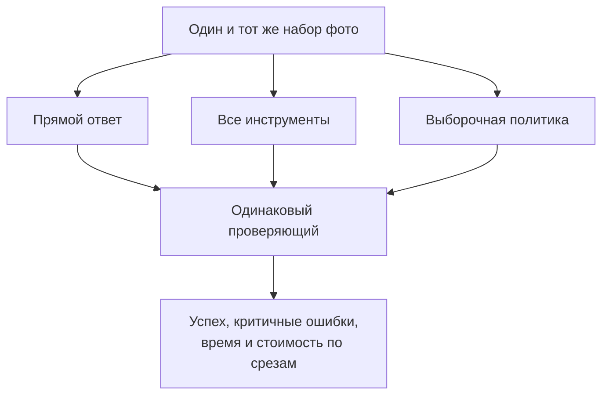

# Кейс 3. Нужны ли инструменты на каждом запросе

[[Разборы кейсов/VLM и мультимодальность/🏠 Alice AI VLM — кейсы и маршрут подготовки|← Все кейсы]]

> [!abstract] Условие
> Алиса читает фотографии документов. Можно отвечать сразу, увеличивать фрагменты, запускать OCR или калькулятор. Команда предлагает всегда включать все инструменты: «Больше информации — лучше ответ». Как проверить и выбрать политику?

Это учебный сценарий. Числа иллюстрируют подход, не результаты Алисы.

## Быстрая навигация

- [[#1. Сначала различим четыре операции|1. Сначала различим четыре операции]]
- [[#2. Что спросить у интервьюера|2. Что спросить у интервьюера]]
- [[#3. Делаем сравнимые варианты|3. Делаем сравнимые варианты]]
- [[#4. Пример, в котором среднее скрывает решение|4. Пример, в котором среднее скрывает решение]]
- [[#5. По каким сигналам выбирать инструмент|5. По каким сигналам выбирать инструмент]]
- [[#6. Важная ловушка сравнения|6. Важная ловушка сравнения]]
- [[#7. Что делать с неразборчивым документом|7. Что делать с неразборчивым документом]]
- [[#8. Как завершить решение на интервью|8. Как завершить решение на интервью]]
- [[#9. Проверьте себя|9. Проверьте себя]]

## 1. Сначала различим четыре операции

**Crop** — вырезание области исходного изображения. **Zoom** — увеличение её масштаба. Они не равнозначны восстановлению деталей: увеличение размытого символа не создаёт утраченную информацию. Иногда польза в том, что модель обрабатывает нужную часть в более подходящем масштабе, не теряя её при уменьшении всей страницы.

**OCR** превращает видимый текст в символы. Он может ошибиться и обычно хуже передаёт взаимное расположение элементов, если не возвращает координаты. **Калькулятор** вычисляет выражение, но не знает, что агент взял цену за килограмм вместо цены упаковки.

Поэтому «больше инструментов» может означать и больше промежуточных ошибок, задержку, лишний текст в контексте. Мы выбираем не самую богатую цепочку, а полезную стратегию для задачи.

## 2. Что спросить у интервьюера

**Кандидат:** «Нас интересует чтение поля, расчёт по документу или открытый ответ? Можно ли переспросить пользователя? Каковы требования к задержке? Инструменты работают локально или отправляют документы внешнему сервису? Мы сравниваем версии модели либо способ её запуска?»

Договариваемся о примере: нужно проверить сумму по чеку, допустимо уточнение при нечитаемом фото, инструменты доступны в контролируемой среде, важны точность и время ответа. Проверяем **политику вызовов**, фиксируя базовую модель.

Политика — правило, когда и какой инструмент запускать. Это может быть простое условие, отдельный классификатор или решение самой модели. Не обязательно сразу обучать новую нейросеть.

## 3. Делаем сравнимые варианты

Собираем три основных варианта: прямой ответ; обязательные OCR и калькулятор; выборочные вызовы. На этапе разработки можно добавить отдельные варианты «только OCR» и «только корректно выбранная область», чтобы понять вклад компонентов.

Каждый вариант получает одинаковые исходные задачи, доступ к той же информации, одинаковые ограничения безопасности. Условия по времени и числу попыток фиксируем явно. Если одному варианту разрешить десять повторных попыток, а другому одну, это уже сравнение разных бюджетов, и отчёт должен это отражать.

Срезы задаём до оценки: крупный печатный текст, мелкий, рукописный, блики, поворот, таблицы, арифметика, отсутствие достаточных данных. Иначе легко показать только те группы, где любимая идея сработала.

## 4. Пример, в котором среднее скрывает решение

На 1 000 условных задач получили:

| Политика | Полностью верно | p95 времени ответа | Среднее число внешних вызовов |
|---|---:|---:|---:|
| Ответить сразу | 790 | 3 с | 0 |
| Всегда использовать инструменты | 830 | 12 с | 3.0 |
| Вызывать выборочно | 825 | 6 с | 0.9 |

p95 — время, быстрее которого завершились 95% запросов. Оно не равно средней задержке. Данные пока не говорят, что 825 статистически не хуже 830: для такого вывода нужны парные исходы и заранее выбранный допустимый проигрыш.

Дальше обнаруживаем: инструменты исправили мелкий текст, но на рукописных чеках ошибочный OCR иногда перебивает правильное визуальное чтение. Значит, полезнее не общее «включить OCR», а более узкая политика и правило обращения с противоречиями.

## 5. По каким сигналам выбирать инструмент

Начальная политика может учитывать тип запроса, размер текста, число страниц, необходимость вычислений, наличие неуверенно распознанных областей. Для расчёта итоговой суммы после извлечения чисел калькулятор разумен даже при чётком фото. Для вопроса «какого цвета упаковка?» он бесполезен.

Осторожно с фразой «если уверенность модели меньше 0.8». Нужно объяснить, откуда берётся это число и насколько оно соответствует реальным ошибкам. Самооценка модели словами или произвольное поле confidence не становится надёжной вероятностью автоматически.

Практический путь: собрать на разработческом наборе признаки, варианты действий и их проверенные исходы. Выбрать порог или простое правило по компромиссу качества и бюджета, затем проверить на отложенных документах. Если обучаем маршрутизатор — модель выбора пути, — следим, чтобы его признаки были доступны **до** решения, а не подсматривали итоговую правильность.

## 6. Важная ловушка сравнения

**Интервьюер:** «В логах ответы с OCR хуже. Уберём OCR?»

**Кандидат:** «Возможно, OCR вызывают именно на сложных фото. Тогда мы сравниваем разные по трудности запросы. Для оценки пользы запускаем альтернативные политики на одинаковом замороженном наборе либо рандомизируем доступные политики на подходящих запросах. Простая разница групп вызовов не даёт эффекта инструмента».

Даже при одинаковых задачах полезно считать четыре парных исхода: обе стратегии верны; верен только инструментальный вариант; верен только прямой; обе неверны. Второй и третий показывают не только пользу, но и вред.

В продакшене отказ инструмента учитываем в итоговой успешности системы. Для диагностики дополнительно показываем качество при технически успешном вызове, но не подменяем им основной результат: пользователь сталкивается и с тайм-аутами.

## 7. Что делать с неразборчивым документом

Нельзя принудительно превратить каждый вход в уверенный ответ. Если ни исходник, ни увеличение не позволяют прочитать цифру, корректный результат — обозначить ограничение и попросить новый снимок конкретной области.

При этом «всегда переспросить» тоже не успешная стратегия. Считаем отдельно долю решённых задач без уточнения, обоснованные и лишние уточнения, долю уверенных ошибок. Для задач с однозначным читаемым ответом уклонение не должно получать полный балл.

## 8. Как завершить решение на интервью

**Интервьюер:** «Выберите итоговый вариант».

**Кандидат:** «По таблице выборочная политика выглядит перспективно, но я бы ещё проверил парную разницу и критичные ошибки. Если потеря качества укладывается в согласованный предел, а задержка существенно лучше, выберу её для ограниченного запуска. Для нечитаемых документов оставлю уточнение, для вычислений — проверяемый калькулятор. Обязательный OCR на всех входах пока не обоснован».

**Интервьюер:** «А если деньги на вызовы не важны?»

**Кандидат:** «Остаются время, конфиденциальность и ошибки из-за лишних промежуточных данных. Даже бесплатный инструмент нужно проверять на пользу. И наоборот: иногда дорогой вызов оправдан, если он предотвращает критичную ошибку».

## 9. Проверьте себя

- Чем «качество OCR» отличается от «пользы OCR для итогового ответа»?
- Почему вызов инструмента не обязательно полезен, даже если его ответ правильный?
- Что может сломаться при вырезании только числа без названия поля?
- Как изменится сравнение при ограничении в 5 секунд на задачу?

Технологии: [[Оценка ИИ-моделей/Бенчмарки агентных VLM/Визуальные инструменты — OCR, области, координаты и безопасное выполнение|контракты OCR и областей]]. Продолжение: [[Разборы кейсов/VLM и мультимодальность/Кейс VLM 08 — качество, время и цена агентного рассуждения|выбор бюджета и остановка]].
