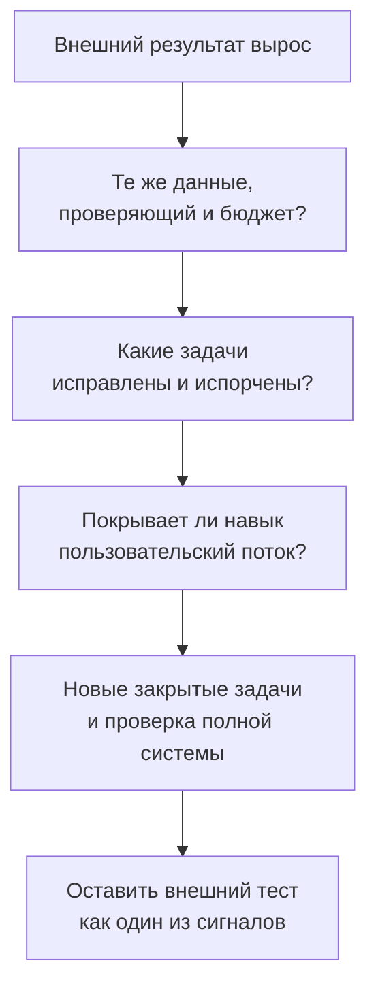

# Кейс 4. На внешнем тесте лучше, пользователю не легче

[[Разборы кейсов/VLM и мультимодальность/🏠 Alice AI VLM — кейсы и маршрут подготовки|← Все кейсы]]

> [!abstract] Условие
> После дообучения оценка на публичном бенчмарке выросла с 45 до 53. На внутреннем наборе почти нет изменений, а пользователи всё ещё жалуются на чтение документов. Разработчик говорит, что внутренний тест неправильный. Как разобраться?

Все показатели условные. Названия открытых наборов не означают, что их баллы измеряются на общей шкале.

## Быстрая навигация

- [[#1. Не выбираем, какой тест «прав», заранее|1. Не выбираем, какой тест «прав», заранее]]
- [[#2. Матрица применимости вместо фразы «другой домен»|2. Матрица применимости вместо фразы «другой домен»]]
- [[#3. Разложим наблюдение на альтернативные гипотезы|3. Разложим наблюдение на альтернативные гипотезы]]
- [[#4. План проверок с конкретным порядком|4. План проверок с конкретным порядком]]
- [[#5. Почему нельзя просто усреднить три бенчмарка|5. Почему нельзя просто усреднить три бенчмарка]]
- [[#6. Диалог при добавлении новых вводных|6. Диалог при добавлении новых вводных]]
- [[#7. Что должно остаться после вашей работы|7. Что должно остаться после вашей работы]]
- [[#8. Вопросы для тренировки|8. Вопросы для тренировки]]

## 1. Не выбираем, какой тест «прав», заранее

**Кандидат:** «Сначала уточню, что означает 45 и 53: доля правильных ответов, среднее по категориям или составной балл? Одинаковы ли версия набора, инструменты, проверяющий и число попыток? А что именно не изменилось внутри: офлайн-точность или онлайн-поведение?»

Публичный тест может честно измерять навык, который продукту нужен редко. Внутренний может плохо размечаться. А онлайн-метрика может зависеть не только от качества модели, но и от интерфейса, скорости и состава пользователей. Это три разных возможных объяснения; ни одно пока не доказано.

## 2. Матрица применимости вместо фразы «другой домен»

Записываем различия по осям, способным изменить результат.

| Ось | Возможное условие внешнего теста | Условие нашего продукта | Что проверяем |
|---|---|---|---|
| Язык | Преимущественно английский | Русский и смешанные документы | Ошибки OCR и понимания терминов |
| Изображения | Подготовленные картинки | Фото с бликами и наклоном | Сохранение качества на искажениях |
| Число источников | Одна картинка | Несколько страниц | Связывание фактов |
| Ответ | Вариант из списка | Открытое объяснение | Угадывание и проверка смысла |
| Инструменты | Стабильная среда | Тайм-ауты и ограничения | Реальная успешность цепочки |
| Бюджет | Длинное выполнение | Ответ за несколько секунд | Цена улучшения |

Это пример того, что нужно измерить, а не описание всех трёх публичных бенчмарков. Для GTA, ToolVQA и TIR-Bench заполняем таблицу по конкретной версии и протоколу, а не по предположениям из названия.

Далее вручную сопоставляем десятки задач с реальными обращениями: какой пользователь вообще задаст такой вопрос, что будет считаться полезным ответом, какие элементы нужны для решения? Так «похожесть на продукт» становится проверяемой.

## 3. Разложим наблюдение на альтернативные гипотезы

Первая: улучшился редкий навык. Например, модель лучше поворачивает изображения и решает визуальные головоломки, но по-прежнему теряет строки многостраничной таблицы. Ожидаем рост именно соответствующих категорий, отсутствие эффекта на документах.

Вторая: произошла утечка проверочных данных в обучение. Ищем совпадения не только вопросов, но и исходных изображений, шаблонов, производных задач. Удаление точных дублей не устраняет похожие копии одного источника.

Третья: изменился способ проверки. Новый формат ответа удобнее автоматическому извлекателю, а содержательное качество не выросло. Берём парные ответы и проводим слепую переоценку одним проверяющим.

Четвёртая: выигрыш существует, но поглощается задержкой или ошибками инфраструктуры. Сопоставляем поведение полной системы, а не успешные ответы модели вне окружения.

Пятая: внутренний набор слишком мал или устарел. Смотрим интервалы, покрытие новых сценариев, срок сбора и качество эталонов. «Нет статистической значимости» не равнозначно «эффект нулевой».

## 4. План проверок с конкретным порядком

Сначала делаю дешёвый технический аудит: версии, режим запуска, одинаковость проверяющего, доступность инструментов. Затем смотрю **парные изменения по задачам**: что новая модель исправила и испортила. Потом выбираю стратифицированную ручную проверку с учётом категорий и направлений изменения.

Например, берём 120 ответов: 40 улучшений, 40 ухудшений и 40 без изменения по автоматической оценке. Это диагностический набор, не репрезентативная оценка частот. Если хотим оценить долю дефектов проверяющего во всём наборе, учитываем исходные доли этих групп или берём отдельную случайную выборку.

После аудита собираем небольшой «мост» между наборами: одинаковые навыки, но продуктовые входы. Например, сравнение чисел на чистой картинке, затем на фотографии русского документа и затем на нескольких его страницах. Так можно локализовать, где именно исчезает улучшение.

Не меняем все условия одновременно. Если вместе заменить язык, разрешение и формат ответа, не поймём, что мешает переносу.

## 5. Почему нельзя просто усреднить три бенчмарка

Допустим, один балл отражает точность выбора инструмента, второй — правильность конечного ответа, третий — среднее по неодинаковым категориям. Среднее этих чисел не имеет автоматически понятного смысла.

Для решения о продукте полезнее профиль: чтение документов, связывание источников, визуальные преобразования, надёжность инструментов, безопасность. Для каждого — свой измеритель, покрытие и ограничения. Общий продуктовый итог можно считать на выборке реальных обращений с понятной системой весов. Но набор опасных редких случаев всё равно нужен отдельно.

## 6. Диалог при добавлении новых вводных

**Интервьюер:** «Нам нужно показывать рост на открытом рейтинге. Это важная цель».

**Кандидат:** «Тогда есть две цели: публично измеряемый навык и польза в продукте. Их не обязательно противопоставлять, но нужно разнести. Для релиза Алисы я не заменю проверку реальных запросов местом в рейтинге. Для исследования можем целенаправленно улучшать определённую способность и честно сказать, что продуктовый перенос ещё не подтверждён».

**Интервьюер:** «Но вы предлагаете новый внутренний тест после просмотра результатов. Это тоже подгонка».

**Кандидат:** «Если используем его для выбора текущего решения — это разработческий анализ. Для подтверждения сформируем следующую закрытую выборку до нового сравнения и не будем подбирать на ней настройки. Историю версий и изменения покрытия сохраним».

**Интервьюер:** «Как тогда выпускать?»

**Кандидат:** «Нужен независимый продуктовый замер с достаточной точностью и проверка критичных регрессий. Если прирост есть только на открытом тесте, заключение ограниченное: улучшен измеряемый им навык, оснований обещать общий рост пользовательского качества пока нет».

## 7. Что должно остаться после вашей работы

Не только график трёх средних, а паспорт условий сравнения, матрица покрытия, примеры изменившихся ответов, аудит утечек, оценка неопределённости и решение: какой тест оставить для приёмки, какой для диагностики, какие пробелы закрыть.

## 8. Вопросы для тренировки

- Внутренний тест вырос, жалобы не снизились. Какие ещё объяснения возможны, кроме «плохая метрика»?
- Чем утечка теста отличается от законного обучения на похожем навыке?
- Как проверить, что модель выучила формат бенчмарка, но не способность?
- Почему отсутствие выигрыша на 30 русских документах — слабое доказательство отсутствия переноса?

Теория и источники: [[Оценка ИИ-моделей/Бенчмарки агентных VLM/🏠 Бенчмарки и технологии агентных VLM|GTA, ToolVQA, TIR-Bench и условия сравнения]].
