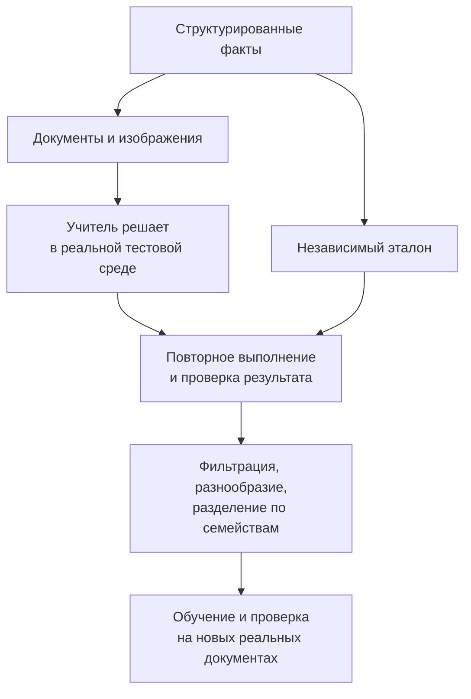

# Кейс 5. Как создать синтетические данные, которые чему-то научат

[[Разборы кейсов/VLM и мультимодальность/🏠 Alice AI VLM — кейсы и маршрут подготовки|← Все кейсы]]

> [!abstract] Условие
> Модель плохо отвечает на вопросы по нескольким страницам. Есть возможность генерировать документы и запускать сильную модель-учителя. Нужно собрать данные для обучения агента: вопросы, ответы и действия с инструментами.

Это проектный учебный пример, не описание внутреннего конвейера Яндекса.

## Быстрая навигация

- [[#1. Почему «попросим LLM сделать 100 тысяч примеров» недостаточно|1. Почему «попросим LLM сделать 100 тысяч примеров» недостаточно]]
- [[#2. Генерировать сначала факты, потом внешний вид|2. Генерировать сначала факты, потом внешний вид]]
- [[#3. Минимальная запись данных|3. Минимальная запись данных]]
- [[#4. Откуда берётся эталонная траектория|4. Откуда берётся эталонная траектория]]
- [[#5. Какие примеры специально варьировать|5. Какие примеры специально варьировать]]
- [[#6. Как делить обучение и проверку|6. Как делить обучение и проверку]]
- [[#7. Как доказать пользу синтетики|7. Как доказать пользу синтетики]]
- [[#8. Если данные нужны для RL|8. Если данные нужны для RL]]
- [[#9. Завершение и вопросы|9. Завершение и вопросы]]

## 1. Почему «попросим LLM сделать 100 тысяч примеров» недостаточно

Генератор может массово воспроизвести один простой шаблон, придумать неверные ответы или встроить подсказку в формулировку. Тогда большой объём не означает большой объём полезного обучения.

**Кандидат:** «Начну с конкретной ошибки: модель не соединяет условие скидки с суммой на другой странице или вообще не читает вторую страницу? Какие документы преобладают? Нам нужны финальные ответы для дообучения или ещё демонстрации вызовов инструментов?»

Выбираем цель: проверять применение скидки по двум документам, извлекая данные, вычисляя итог и при нехватке условий задавая уточнение. Это наблюдаемые способности, для которых можно построить независимую проверку.

## 2. Генерировать сначала факты, потом внешний вид

Начинаем со структурированной «истины»: список товаров, количество, цена, правило скидки, ограничения, итог. Например, цена 800 рублей, количество 3, скидка 10% действует от трёх единиц. Ожидаемый итог 2 160 рублей.

Эти числа выбирает контролируемая программа, вычисление выполняется проверяемым кодом. Языковая модель может придумывать названия товаров и естественные формулировки условий, но её текст проверяем на соответствие исходному правилу. Иначе «от трёх» легко превратится в «больше трёх», а граница условия изменится.

Первая страница содержит правило акции, вторая — заказ. Сначала создаём HTML или PDF по шаблонам, затем изображения в заданном разрешении. Искажения добавляем после отрисовки: наклон, тень, сжатие, размытие, неравномерное освещение. Сохраняем исходную версию и параметры преобразования.

> [!warning] Истина о документе и ответ по видимому изображению — не одно и то же
> Если размытие уничтожило цифру, генератор всё ещё знает её, но пользовательский агент знать её не может. Такой пример нельзя оценивать как обычное однозначное чтение. Его либо исключаем из этого среза, либо превращаем в задачу на корректное уточнение.

## 3. Минимальная запись данных

```json
{
  "task_id": "discount-00042",
  "source_family": "order-template-17",
  "images": ["terms.png", "order.png"],
  "question": "Верно ли применена скидка в заказе?",
  "private_reference": {
    "unit_price_kopecks": 80000,
    "quantity": 3,
    "discount_percent": 10,
    "expected_total_kopecks": 216000,
    "observed_total_kopecks": 216000,
    "answerable": true
  },
  "versions": {"template": "17.2", "generator": "1.0"}
}
```

Служебный эталон private_reference хранится отдельно от входа агента. Название файла также не должно содержать правильный ответ вроде `total_2160_yes.png`. Это простой, но реальный путь утечки.

## 4. Откуда берётся эталонная траектория

Траектория — запись внешне наблюдаемых шагов: какое изображение вырезали, что распознал OCR, какое выражение вычислили, какой ответ дали. Это не обязательно скрытый внутренний ход мыслей модели.

Можно построить демонстрацию программно: прочитать заданные области, вычислить формулу, сформировать ответ. Можно попросить сильного агента решить задачу и сохранить реальное выполнение. Второй вариант даёт разнообразие, но требует фильтрации: сильная модель тоже ошибается.

Недостаточно, чтобы текст выглядел правдоподобно. Повторно выполняем вызовы в чистой среде и проверяем аргументы, существование файлов, правильность числа, соблюдение ограничений и финальный результат. Нельзя принимать выдуманный ответ инструмента только потому, что его написал учитель.



Не требуем единственной последовательности. Один агент прочитает обе страницы непосредственно, другой воспользуется OCR. Если цель — научить пользоваться инструментами, отбираем демонстрации полезного применения, а не заставляем вызывать инструмент там, где он не нужен.

## 5. Какие примеры специально варьировать

Полезные оси: место условия на странице, число товаров, единицы измерения, похожие названия, порог скидки, корректный и ошибочный итог, порядок страниц, лишний документ, отсутствующее условие.

Отдельно делаем граничные ситуации: две единицы против трёх, скидка на один товар против всей корзины. Если все задания имеют ответ «скидка применена верно», модель научится угадывать. Но и искусственные 50/50 не следует выдавать за частоты реального потока.

Сложность измеряем не длиной объяснения учителя, а требованиями задачи: сколько фактов надо связать, насколько они доступны визуально, есть ли неоднозначность, какие операции нужны. Десять бессмысленных вызовов не превращают лёгкую задачу в полезную сложную.

## 6. Как делить обучение и проверку

Разделяем не случайные строки после генерации, а семейства шаблонов, исходные документы и источники. Дополнительно готовим проверку новых комбинаций знакомых факторов: модель видела скидки и многостраничность по отдельности, но должна справиться с их сочетанием.

Это разные уровни обобщения: новые числа в старом шаблоне; новый шаблон; новый источник реальных фотографий. Их стоит показывать раздельно. Случайное деление очень похожих картинок часто отвечает лишь на первый вопрос.

## 7. Как доказать пользу синтетики

**Интервьюер:** «После обучения точность выросла. Значит, генератор хороший?»

**Кандидат:** «Уточню, где выросла. На документах того же генератора это может быть узнавание его особенностей. Основная проверка — закрытые реальные примеры, которые не использовали ни для настройки генератора, ни для отбора траекторий».

Сравниваем базовое обучение и добавление синтетики при сопоставимом вычислительном бюджете. Затем отдельные эксперименты: только ответы; ответы с корректными действиями; разнообразные шаблоны; искажения; отрицательные и неразрешимые случаи. Такой эксперимент с удалением или добавлением одного компонента называется ablation — проверка вклада компонента.

При фиксированном числе шагов больше данных означает меньше повторений каждого примера; при фиксированном числе эпох — больше вычислений. Нужно явно сказать, что фиксировали. Иначе эффект содержания данных смешивается с эффектом дополнительного обучения.

## 8. Если данные нужны для RL

RL — обучение с подкреплением: модель получает сигнал за результат собственных действий. Демонстрации могут подготовить стартовую политику, но для RL ещё нужны исполняемая среда и надёжная награда.

Если награда выдаётся за фразу «скидка верна», агент может научиться этой фразе без проверки. Лучше проверять результат и обязательные ограничения; при необходимости отдельно контролировать корректность вычислений и обращения к источникам. Нельзя прятать эталон в доступном инструменту файле.

## 9. Завершение и вопросы

**Кандидат:** «На первом этапе я сделаю небольшой генератор с проверяемой истиной, несколько семейств документов и пилотный набор траекторий. Сначала проверю решаемость и повторное выполнение, затем проведу небольшой эксперимент на независимых реальных документах. Масштабировать до сотен тысяч имеет смысл после подтверждения, что разнообразие и ошибки генератора под контролем».

- Как обнаружить, что ответ угадывается без изображения?
- Что делать с правильной суммой, полученной по неверным строкам?
- Можно ли использовать неуспешные траектории? Да, например, для сравнения предпочтений или обучения исправлению ошибок, но не как правильную демонстрацию без маркировки.
- Как отличить недостаток разнообразия от недостаточного качества разметки?

Смежная технология: [[Оценка ИИ-моделей/Бенчмарки агентных VLM/Траектории VLM — SFT, RL, синтетика и проверяемая награда|демонстрации, RL и награда]]. Пример исследовательского подхода: [[Оценка ИИ-моделей/Бенчмарки агентных VLM/ToolVQA — данные, ToolEngine, траектории и оценка|ToolVQA]].
