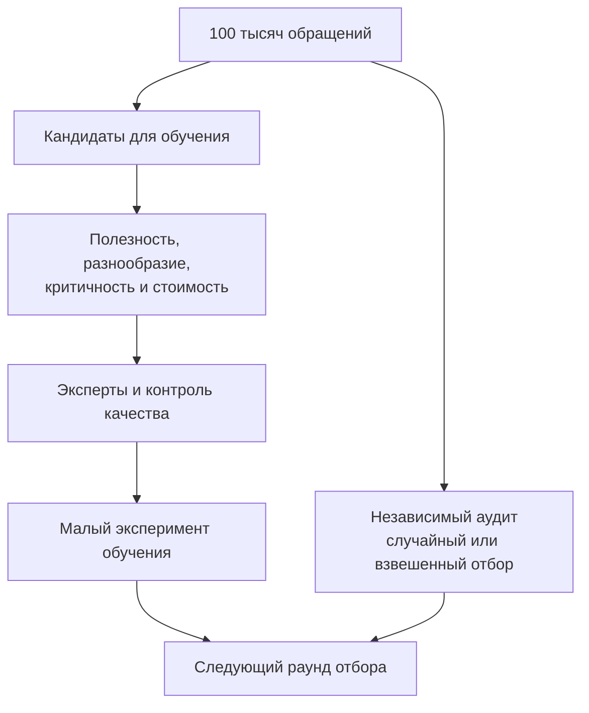

# Кейс 7. На что потратить ограниченный бюджет экспертов

[[Разборы кейсов/VLM и мультимодальность/🏠 Alice AI VLM — кейсы и маршрут подготовки|← Все кейсы]]

> [!abstract] Условие
> Есть 100 тысяч новых обращений с изображениями. Эксперты могут разобрать только 2 тысячи. Нужно отобрать данные, чтобы улучшить модель и найти неизвестные проблемы.

Учебный сценарий. Предлагаемые доли — пример стартового распределения бюджета, а не универсальная рекомендация.

## Быстрая навигация

- [[#1. Ключевой вопрос: разметка для чего|1. Ключевой вопрос: разметка для чего]]
- [[#2. Почему нельзя брать только низкую уверенность|2. Почему нельзя брать только низкую уверенность]]
- [[#3. Пример конкретного отбора|3. Пример конкретного отбора]]
- [[#4. Стоимость не всегда равна числу строк|4. Стоимость не всегда равна числу строк]]
- [[#5. Как формализовать полезность без магических весов|5. Как формализовать полезность без магических весов]]
- [[#6. Что именно должен выдать эксперт|6. Что именно должен выдать эксперт]]
- [[#7. Диалог с дополнительными ограничениями|7. Диалог с дополнительными ограничениями]]
- [[#8. Что повторить и попробовать самому|8. Что повторить и попробовать самому]]

## 1. Ключевой вопрос: разметка для чего

**Кандидат:** «Эти 2 тысячи должны честно измерить текущее качество или максимально помочь обучению? Для измерения нужен отбор, отражающий поток. Для обучения полезно переотбирать трудные и редкие случаи. Одной выборкой без оговорок обе задачи не решить».

Если ответ «для всего», предлагаю разделить бюджет и хранить назначение каждой части. Например: 400 обращений для независимого аудита и 1 600 для обучения и разведки ошибок. Оценочные данные не переходят незаметно в обучение после первой проверки.

Это развитие кейса про миллион запросов: теперь важна не только представительность, но и **предельная полезность разметки** — какое дополнительное улучшение даст следующий потраченный час эксперта.

## 2. Почему нельзя брать только низкую уверенность

Во-первых, уверенность может быть плохо связана с правильностью. Во-вторых, самые неуверенные случаи могут быть безнадёжно нечитаемыми. В-третьих, модель иногда уверенно ошибается на новом типе диаграммы — такой класс останется незамеченным.

Поэтому использую несколько источников кандидатов: случайные обращения, расхождения моделей, ошибки существующего проверяющего, новые кластеры, редкие продуктовые сценарии, обращения с жалобами. Каждый сигнал имеет смещение. Например, жалуются далеко не все пользователи, и отсутствие жалобы не означает правильность.

## 3. Пример конкретного отбора

После выделения 400 независимых аудиторских задач оставшиеся 1 600 распределяем так:

| Источник | Бюджет | Зачем |
|---|---:|---|
| Модели расходятся в ответе или действии | 500 | Искать границы текущих возможностей |
| Редкие и новые сценарии | 400 | Не пропустить новые классы |
| Ошибки с большой ценой | 300 | Работать с критичными последствиями |
| Случайные из оставшегося потока | 250 | Ловить уверенные неизвестные ошибки |
| Специальные случаи недостаточных данных | 150 | Учить корректно уточнять |

Категории могут пересекаться. Сначала задаём правило назначения основного источника, убираем дубли и только потом добираем до квот. Иначе один сложный чек окажется посчитан три раза.

Внутри категорий ограничиваем число похожих документов одного шаблона или пользователя. Если эксперт видит сто одинаковых бланков с разными ФИО, мы расходуем бюджет на малое дополнительное разнообразие.

## 4. Стоимость не всегда равна числу строк

Один вопрос по фотографии товара размечается за минуту, а задача по 20 страницам — за полчаса. Поэтому квоты уточняем в экспертных часах. На пилоте измеряем длительность, долю нерешаемых заданий и частоту разногласий.

Если сложная категория полезна, но слишком дорога, можно автоматизировать подготовку: заранее показать области, предварительно извлечённый текст и интерфейс сопоставления. Однако эксперт должен видеть исходник и иметь возможность исправить подсказку: предварительный ответ создаёт якорь и может ухудшить независимость оценки.

## 5. Как формализовать полезность без магических весов

Можно ранжировать кандидатов составным баллом, но не стоит выдавать произвольные коэффициенты за доказательство. На старте лучше прозрачные квоты и ограничения, затем экспериментальное сравнение стратегий.

Например, обучаем три варианта на равном объёме: случайная выборка; только расхождения; смешанная выборка с разнообразием. Фиксируем базовую модель, вычислительный бюджет и независимый тест. Смотрим прирост целевых навыков, общую успешность и регрессии.

Если эффект небольшой относительно вариативности обучения, повторяем с несколькими случайными инициализациями или порядками данных. Для ресурсоёмких моделей число повторов ограничено — тогда прямо указываем неопределённость, а не делаем точный вывод из одного запуска.

## 6. Что именно должен выдать эксперт

Не только «плохо». Для обучающего примера нужны: решаемость, проверенные факты с источниками, корректный ответ, ограничения, тип ошибки исходного агента. Если собираем демонстрацию действий — реально выполнимая траектория с проверенным результатом.

Если изображение неоднозначно, эксперт отмечает допустимые ответы либо необходимость уточнения. Нельзя заставлять выбирать случайную цифру только потому, что поле формы обязательно.

Разметчики получают инструкцию, примеры границ, канал вопросов. Часть задач пересекается между экспертами; спорные разбираются. Контрольные задания должны соответствовать реальной сложности, а не быть очевидными ловушками, которые проверяют только внимательность.

## 7. Диалог с дополнительными ограничениями

**Интервьюер:** «Бюджет 2 тысячи, зачем тратить 400 на случайные задачи, если хотим рост?»

**Кандидат:** «Без независимого измерения можем улучшить любимый проблемный срез и не заметить вреда остальным. Кроме того, случайные примеры находят ошибки, о которых наши сигналы ещё ничего не знают. Долю можно обсуждать, но полностью убирать этот канал рискованно».

**Интервьюер:** «А если все отобранные сложные задачи модель не решает?»

**Кандидат:** «Проверю, решаемы ли они для эксперта и доступны ли необходимые инструменты. Если задача вне возможностей среды, дополнительные правильные ответы сами по себе не научат исполнять отсутствующий инструмент. Если решаема, но слишком далека от текущей способности, может понадобиться промежуточный уровень сложности».

**Интервьюер:** «Что будет вашим итоговым показателем?»

**Кандидат:** «Для качества отбора — прирост на независимых данных при сопоставимом бюджете, желательно в расчёте на экспертные часы. Для процесса — доля пригодных примеров, цена и разногласия. Число размеченных строк само по себе не результат для модели».

## 8. Что повторить и попробовать самому

- Активное обучение: выбор следующих данных на основе состояния модели.
- Смещение отбора: почему сложная обучающая выборка не измеряет поток.
- Разделение по семействам и предотвращение утечки.
- Почему разногласие двух моделей не является эталоном ошибки.

Задание: распределите тот же бюджет, если 80% обращений — простые фото, но критичные ошибки приходятся на редкие документы. Объясните, где измеряете частоту, а где намеренно её игнорируете ради безопасности.
