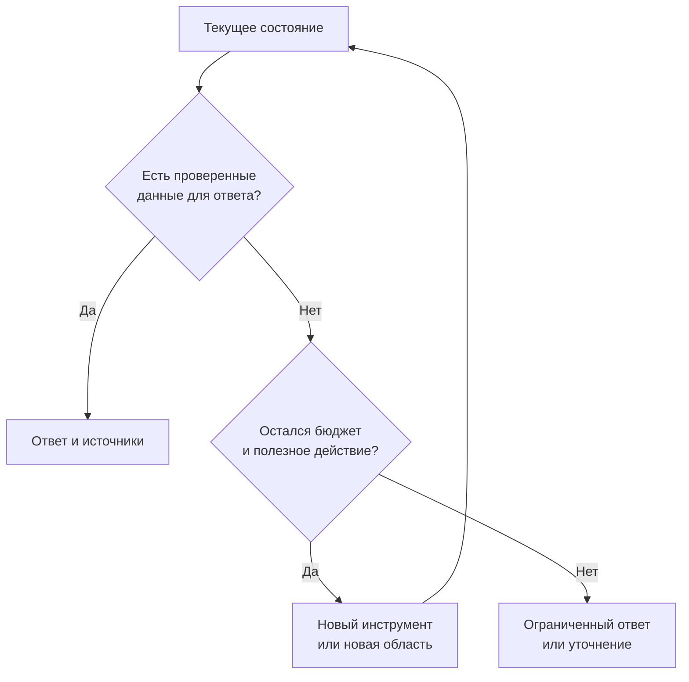

# Кейс 8. Агент стал думать дольше. Стал ли он лучше

[[Разборы кейсов/VLM и мультимодальность/🏠 Alice AI VLM — кейсы и маршрут подготовки|← Все кейсы]]

> [!abstract] Условие
> Агенту разрешили больше шагов: он вырезает фрагменты, проверяет себя и повторяет распознавание. Точность выросла, но задержка и расходы — тоже. Как выбрать разумный режим и условие остановки?

Все числа ниже учебные. «Рассуждение» здесь оцениваем по результату и наблюдаемым действиям, а не по предполагаемому содержанию скрытых мыслей.

## Быстрая навигация

- [[#1. Что значит «дольше думает»|1. Что значит «дольше думает»]]
- [[#2. Таблица, из которой ещё нельзя выбрать победителя|2. Таблица, из которой ещё нельзя выбрать победителя]]
- [[#3. Конкретная оценка дополнительного шага|3. Конкретная оценка дополнительного шага]]
- [[#4. Когда останавливать|4. Когда останавливать]]
- [[#5. Как построить выборочный режим|5. Как построить выборочный режим]]
- [[#6. Почему pass@k не равно качеству одной попытки|6. Почему pass@k не равно качеству одной попытки]]
- [[#7. Что проверять в онлайн-эксперименте|7. Что проверять в онлайн-эксперименте]]
- [[#8. Как сформулировать решение|8. Как сформулировать решение]]
- [[#9. Самопроверка|9. Самопроверка]]

## 1. Что значит «дольше думает»

Нужно разделить: более длинная генерация текста, больше инструментальных вызовов, несколько независимых попыток и повторная проверка готового ответа. Это разные механизмы с разной ценой и рисками.

**Кандидат:** «Что конкретно изменили? Лимит шагов, модель, системную инструкцию или инструменты? Время измерено от отправки запроса до полезного ответа либо только внутри модели? Считаем ли тайм-ауты?»

Если новая модель сильнее и одновременно имеет вдвое больший бюджет, мы можем оценить новую систему целиком, но не приписывать всё улучшение дополнительным шагам. Для этого нужен отдельный контролируемый эксперимент.

## 2. Таблица, из которой ещё нельзя выбрать победителя

| Режим | Успех | p50 | p95 | Условная стоимость запроса |
|---|---:|---:|---:|---:|
| Прямой ответ | 78% | 2 с | 4 с | 1.0 |
| До 3 вызовов | 84% | 4 с | 9 с | 1.8 |
| До 10 вызовов | 85% | 9 с | 24 с | 4.5 |

При переходе от 3 к 10 вызовам получили только 1 п.п. общего прироста, но сильно ухудшили хвост задержки. Однако на редких важных задачах прирост может быть большим. Значит, сначала смотрим срезы и статистическую неопределённость, затем принимаем решение.

**Граница Парето** — варианты, которые нельзя улучшить по одному показателю без ухудшения другого среди рассмотренных решений. Если другой режим даёт не хуже качество, не больше цену и меньшую задержку, исходный режим невыгоден. Но сама граница не выбирает бизнес-приоритеты за нас.

## 3. Конкретная оценка дополнительного шага

Сохраняем состояние перед решением «остановиться или продолжить». На разработческом наборе исследуем, что происходит после дополнительных действий: исправляет ли агент ошибку, сохраняет верный ответ или портит его.

Пример: дополнительное чтение фрагмента исправляет 20 ответов, портит 8 и ничего не меняет в 172. Чистый выигрыш — 12 на этих 200 состояниях, но нельзя переносить его на весь поток без учёта того, как состояния отобраны.

В «проверке себя» есть риск: модель заменяет верное число правдоподобным неверным. Поэтому считаем не только исправления, но и испорченные ответы. Несколько согласных попыток также могут повторять одну систематическую ошибку.

## 4. Когда останавливать

Начальная политика: жёсткий предел времени и числа вызовов; остановка после получения всех обязательных фактов и успешной проверки; обнаружение повторяющихся действий; уточнение при невозможности получить недостающие данные.

Повтор не всегда бессмысленен. После временной сетевой ошибки он может помочь. Но повтор того же OCR над теми же пикселями тем же детерминированным инструментом обычно не добавляет информации. Новый crop или другой масштаб — уже иное действие.

«Все факты получены» можно проверять по схеме задачи: есть обе суммы, валюта, нужное условие. Это надёжнее общего текста «я уверен». Для открытых задач строгая схема не всегда существует, тогда используется более слабый оценщик и отдельно проверяется его надёжность.

## 5. Как построить выборочный режим

Лёгким задачам — быстрый путь, сложным — расширенный бюджет. Но нужно решить, как определить сложность до знания ответа. Используем доступные сигналы: несколько изображений, мелкий текст, вычисление, отсутствие обязательного факта, конфликт распознаваний.

Правило подбираем на разработческом наборе, затем замораживаем и проверяем на другом. Нельзя выбрать для каждой тестовой задачи лучший путь, посмотрев эталон, и представить это как качество реального маршрутизатора. Такой «идеальный выбор» годится только как ориентир достижимого потенциала.

**Интервьюер:** «Давайте всегда запускать два агента и выбирать лучший ответ».

**Кандидат:** «Кто определит лучший? Если по известному эталону — это исследовательский верхний ориентир, недоступный в продукте. Если по судье — включаем его ошибки, стоимость и задержку в систему. Тогда оцениваем реальную процедуру выбора, а не лучшее из двух постфактум».

## 6. Почему pass@k не равно качеству одной попытки

Успех хотя бы одной из k попыток показывает, способен ли генератор иногда решить задачу. Пользователь получает конкретный выбранный ответ. Если выбирать правильный не умеем, высокая успешность «хотя бы одного» может не приносить той же пользы.

Для интервью достаточно чётко назвать протокол: одна попытка; k попыток с исполнимым выбором; k попыток с оценкой существования правильной. Это три разные метрики. Также учитываем, что параллельные попытки могут сократить ожидание относительно последовательных, но увеличить расход вычислений.

## 7. Что проверять в онлайн-эксперименте

После офлайн-отбора — ограниченное сравнение реальных политик. Главный пользовательский результат зависит от продукта: успешно решённая задача, повторное обращение с той же проблемой, необходимость переспрашивать. Задержка, доля обрывов и стоимость — отдельные ограничения.

Не считаем длинный диалог автоматически вовлечённостью: пользователь может много писать потому, что агент ошибается. И не исключаем запросы, не дождавшиеся ответа, из метрики успеха: так медленная система будет выглядеть лучше, чем она есть.

## 8. Как сформулировать решение

**Кандидат:** «Я бы начал с режима до трёх вызовов и отдельной расширенной ветки для задач, где показана дополнительная польза. Выбор проверю на независимом наборе вместе с реальным маршрутизатором. Для запуска согласую пределы задержки и критичных ошибок. Режим десяти вызовов на всех запросах пока не оправдан одним процентным пунктом среднего прироста».

Это не универсальный выбор трёх шагов. Он привязан к условной таблице и может измениться, если цена ошибки высока или пользователи готовы ждать.

## 9. Самопроверка

- Почему среднее время может улучшиться при ухудшении p95?
- Как отличить лишний вызов от полезной проверки, не изменившей ответ?
- Почему короткая правильная траектория не всегда лучше длинной: вспомните обязательные проверки безопасности.
- Что нужно заморозить, чтобы проверить именно влияние бюджета, а не смену модели?
