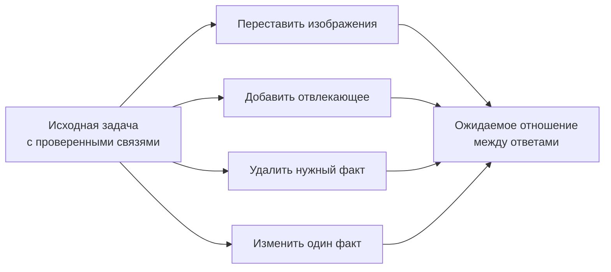

# Кейс 9. Модель видит факты, но путает, к чему они относятся

[[Разборы кейсов/VLM и мультимодальность/🏠 Alice AI VLM — кейсы и маршрут подготовки|← Все кейсы]]

> [!abstract] Условие
> Пользователь присылает фотографии двух ноутбуков и их характеристик. Агент правильно читает числа, но приписывает память первого устройства второму. На обычном тесте чтения текста проблема почти не видна. Как построить проверку?

Учебный сценарий, не сведения о конкретной версии Алисы.

## Быстрая навигация

- [[#1. Что здесь измеряется отдельно от распознавания|1. Что здесь измеряется отдельно от распознавания]]
- [[#2. Один пример с явным эталоном|2. Один пример с явным эталоном]]
- [[#3. Какие изменения входа проверять|3. Какие изменения входа проверять]]
- [[#4. Как избежать ошибки в самих тестах|4. Как избежать ошибки в самих тестах]]
- [[#5. Какие метрики считать|5. Какие метрики считать]]
- [[#6. Важная статистическая тонкость|6. Важная статистическая тонкость]]
- [[#7. Разговор о причинах и исправлении|7. Разговор о причинах и исправлении]]
- [[#8. Вопросы себе|8. Вопросы себе]]

## 1. Что здесь измеряется отдельно от распознавания

Модель может верно увидеть «16 ГБ» и «32 ГБ», но неверно связать число с устройством. Поэтому перечень правильно распознанных слов ещё не доказывает правильный ответ.

**Grounding**, или привязка к источнику, здесь означает: утверждение относится к нужному объекту и подтверждается конкретным изображением или областью. Нам нужен не только факт, но и его происхождение.

**Кандидат:** «Изображения подписаны? На характеристиках виден идентификатор устройства? Пользователь ссылается на первое фото или на название? Может ли одна карточка вообще относиться к другому товару?»

Если связь между фотографией и характеристиками отсутствует, нельзя наказывать за честное уточнение. Для начала отделяем задания с однозначно установленной связью от задач, где модель должна заметить недостаток информации.

## 2. Один пример с явным эталоном

На изображении A — карточка модели «Север-14»: 16 ГБ памяти, 512 ГБ накопителя. На B — «Север-16»: 32 ГБ памяти, 256 ГБ накопителя. Пользователь: «У какого больше памяти, а у какого больше места для файлов?»

Эталон содержит две разные связи: оперативная память больше у B, накопитель больше у A. Нельзя отвечать общим «второй лучше по памяти»: слово «память» неоднозначно, а пользователь спросил о двух свойствах.

```json
{
  "facts": [
    {"image_id": "A", "entity": "Север-14", "field": "ram_gb", "value": 16},
    {"image_id": "A", "entity": "Север-14", "field": "storage_gb", "value": 512},
    {"image_id": "B", "entity": "Север-16", "field": "ram_gb", "value": 32},
    {"image_id": "B", "entity": "Север-16", "field": "storage_gb", "value": 256}
  ],
  "expected": {"more_ram": "B", "more_storage": "A"}
}
```

Требовать такой JSON от продуктового ответа не обязательно. Это удобный внутренний формат эталона и диагностики.

## 3. Какие изменения входа проверять

**Перестановка.** Меняем порядок картинок. При обращении по названиям вывод должен сохраняться. При словах «первый/второй» меняется значение указателя, поэтому эталон обновляется.

**Лишнее изображение.** Добавляем третью карточку с 64 ГБ, но пользователь по-прежнему спрашивает о двух конкретных моделях. Агент не должен перенести самое большое число из постороннего источника.

**Удаление доказательства.** Убираем страницу с накопителем. Теперь по этому свойству нужен ограниченный ответ или уточнение, а не старое число из привычного шаблона.

**Подмена одного факта.** Меняем 16 на 64 в первой карточке, сохраняя остальные условия. Ответ про оперативную память должен измениться, а про накопитель — нет.

**Почти одинаковые документы.** Одинаковая модель товара, но разные комплектации или даты. Проверяем, не склеивает ли агент сведения в несуществующую конфигурацию.



Такие проверки часто называют metamorphic testing — тестированием по ожидаемым отношениям между вариантами входа. Главное не термин, а явное правило: что должно измениться в ответе, а что остаться прежним.

## 4. Как избежать ошибки в самих тестах

Изменение цифры должно оставлять изображение естественным и читаемым. Если новая надпись другого шрифта выделяется ярким цветом, модель может распознавать вмешательство, а не навык. После изменения пересчитываем зависимые поля: нельзя сменить цену и забыть итог, если не хотим специально создать противоречивый документ.

Некоторые преобразования меняют задачу. Зеркальное отражение графика не всегда сохраняет его смысл. Поворот читаемого документа может сделать его действительно труднее. «Устойчивость ко всем преобразованиям» не универсальная цель.

## 5. Какие метрики считать

Считаем отдельно: правильность значения; правильность связи «значение — объект — источник»; конечный ответ; неподтверждённые утверждения; корректную реакцию на отсутствие данных.

Можно представить атомарное утверждение тройкой: объект, свойство, значение. Если объект неверный, факт не считается правильным, даже когда само число присутствует где-то на входе.

Для ссылок на области сначала решаем, насколько точна должна быть локализация. Для чтения строки достаточно области, содержащей нужную строку без потери контекста; требование идеально совпасть с прямоугольником разметчика может быть лишним. Для конкретной задачи детекции, наоборот, геометрическая точность существенна.

## 6. Важная статистическая тонкость

Из 100 исходных заданий сделали по пять вариантов и получили 500 ответов. Это не 500 независимых наблюдений: варианты связаны общим документом и навыком. Для интервалов и сравнения версий используем группировку по исходному заданию, например групповой бутстреп.

Полезны две оценки: успешность на исходных задачах и устойчивость семейства — сколько вариантов проходит вместе. Вторая строже и отвечает на другой вопрос. Систему нельзя объявить надёжной только потому, что средняя точность высокая, если она сильно зависит от случайного порядка изображений.

## 7. Разговор о причинах и исправлении

**Интервьюер:** «Нашли, что модель путает картинки. Просто добавим больше multi-image-данных?»

**Кандидат:** «Сначала посмотрю, сохраняет ли инфраструктура идентификаторы и порядок. Возможно, обёртка передаёт результаты OCR без image_id, и модель физически не может понять источник. Если контракт корректный, проверю примеры с близкими названиями и отдельный контроль с заранее извлечёнными фактами».

**Интервьюер:** «С готовыми фактами отвечает правильно».

**Кандидат:** «Это сужает проблему до извлечения и привязки, но ещё не доказывает её точный механизм. Попробую явно маркированные источники, передачу областей с идентификаторами и данные на контрастные пары. Каждый вариант проверю не только на исправленных задачах, но и на новых семействах».

**Интервьюер:** «А заставить цитировать изображение?»

**Кандидат:** «Полезно для наблюдаемости, но можно уверенно процитировать неправильную картинку. Проверять нужно соответствие ссылки факту, а не только наличие ссылки».

## 8. Вопросы себе

- Что проверяет изменение порядка изображений, если запрос сам зависит от порядка?
- Почему наличие числа на любом изображении не подтверждает утверждение?
- Как различить неправильную привязку внутри модели и потерю идентификатора в инструменте?
- Как оценить ответ, где конечный выбор верен, но одно объясняющее свойство выдумано?

Основы: [[Оценка ИИ-моделей/Бенчмарки агентных VLM/VLM на практике — визуальные токены, несколько изображений и ограничения|визуальные представления и несколько изображений]].
