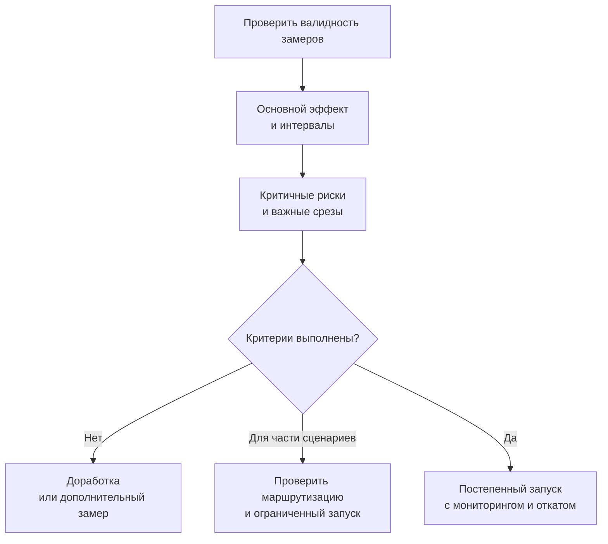

# Кейс 10. Выпускать ли модель с противоречивыми результатами

[[Разборы кейсов/VLM и мультимодальность/🏠 Alice AI VLM — кейсы и маршрут подготовки|← Все кейсы]]

> [!abstract] Условие
> Новая VLM лучше читает документы и отвечает быстрее, но хуже сопоставляет несколько изображений. Модель-судья ставит ей больше баллов, эксперты находят больше уверенных выдумок. Команда ждёт решение о релизе.

Пример учебный. Порогов релиза Яндекса мы не знаем; в кейсе их нужно согласовать, а не угадать.

## Быстрая навигация

- [[#1. Первое действие — не собрать всё в одно число|1. Первое действие — не собрать всё в одно число]]
- [[#2. Организуем паспорт сравнения|2. Организуем паспорт сравнения]]
- [[#3. Пример парных результатов|3. Пример парных результатов]]
- [[#4. Что такое допустимое ухудшение|4. Что такое допустимое ухудшение]]
- [[#5. Разбираемся с ростом балла судьи|5. Разбираемся с ростом балла судьи]]
- [[#6. Редкие опасные ошибки требуют отдельного подхода|6. Редкие опасные ошибки требуют отдельного подхода]]
- [[#7. Какие решения вообще возможны|7. Какие решения вообще возможны]]
- [[#8. Диалог, в котором нужно защитить решение|8. Диалог, в котором нужно защитить решение]]
- [[#9. Практическое упражнение|9. Практическое упражнение]]

## 1. Первое действие — не собрать всё в одно число

**Кандидат:** «Уточню масштаб изменений и надёжность измерений. Одинаковые ли задачи и условия? Есть ли интервалы? Что называем выдумкой и насколько она критична? Есть ли заранее согласованные запреты на ухудшение? Можно ли включать модель по сценариям?»

Быстрый ответ не компенсирует критичную фактическую ошибку автоматически. И наоборот, падение на редком искусственном тесте не обязательно означает запрет общего релиза. Нужны связь с продуктом, риск и доказательства.

## 2. Организуем паспорт сравнения

Фиксируем версии модели, системного промпта, инструментов, данных, проверяющего, лимиты времени, число попыток. Обе системы проходят одинаковые задания, включая технические отказы.

Если одновременно изменились модель и OCR, результат относится к полной новой системе. Для выяснения вклада компонентов нужен отдельный эксперимент. В заключении не называем системный выигрыш «улучшением базовой VLM», если это не проверено.

Оценку ведём на нескольких уровнях: репрезентативные обращения; важные продуктовые срезы; специально сложные и опасные задачи; эксплуатационные показатели. Они отвечают на разные вопросы и не должны незаметно сливаться.

## 3. Пример парных результатов

На 1 000 независимых условных задачах обе версии верны в 700 случаях, только новая — в 90, только старая — в 60, обе неверны — в 150.

Старая успешна на 760/1000 = 76%, новая — на 790/1000 = 79%. Разница 3 п.п. Но для сравнения особенно важны 150 несовпадающих исходов, а не две независимые доли по тысяче наблюдений.

Для бинарного успеха можно использовать парный тест Мак-Немара, а для интервала разницы — парный бутстреп. Если несколько задач сделаны из одного документа, ресэмплируем семейства, а не строки. Конкретный статистический метод выбираем под дизайн, а не наоборот.

Даже уверенный общий прирост не отменяет проигрыша по конкретному навыку. Допустим, из 90 исправлений 70 относятся к простому OCR, а из 60 новых ошибок 35 — к связыванию изображений. Это существенная информация для сценарного запуска.

## 4. Что такое допустимое ухудшение

Для важных ограничений заранее задают максимально допустимую потерю. Например, хотим убедиться, что ухудшение некоторой метрики не больше 1 п.п. Тогда смотрим, исключает ли доверительный интервал разницы значения ниже −1 п.п.

Если интервал от −2 до +3 п.п., это не доказательство «не хуже»: данные допускают неприемлемый проигрыш. Отсутствие значимого различия и подтверждение неухудшения — разные выводы.

Сам допуск не получается из p-value. Он определяется последствиями, частотами, экономикой и требованиями безопасности. Статистика помогает проверить согласованный критерий, но не решает за бизнес, какой риск допустим.

## 5. Разбираемся с ростом балла судьи

Берём слепую экспертную выборку парных ответов, особенно там, где судья предпочёл новую версию. Проверяем, не стал ли ответ длиннее и убедительнее при тех же фактических ошибках.

Если выявлено смещение оценщика, сначала исправляем измерение и пересчитываем обе версии. Нельзя брать старой версии прежний строгий балл, а новой — новый мягкий. Версии судьи также являются частью эксперимента.

## 6. Редкие опасные ошибки требуют отдельного подхода

Допустим, на 300 задачах не увидели ни одной критичной ошибки. Это не означает нулевой риск. При независимых наблюдениях грубое «правило трёх» даёт верхнюю 95%-границу порядка 3/300 = 1%. Для очень редких событий маленького набора недостаточно.

Кроме частоты важна тяжесть. Ошибочное описание цвета и уверенное неверное чтение важного финансового поля нельзя безоговорочно считать одинаковыми промахами. Но и веса тяжести должны быть определены заранее, с примерами и ответственным владельцем, а не подобраны для оправдания релиза.

## 7. Какие решения вообще возможны

Не только «выкатить» и «отказать». Возможны доработка; дополнительная выборка, если неопределённость велика; ограниченный запуск на подходящих сценариях; сохранение старой модели для проблемной категории; полный запуск после выполнения критериев.

Но сценарное переключение — тоже новая система. Если маршрутизатор ошибочно отправляет multi-image-запросы в слабую ветку, обещанное ограничение не работает. Поэтому отдельно измеряем точность выбора ветки и качество получившейся смеси.

В онлайн-этапе следим за реальными исходами, отказами, задержкой, повторными попытками пользователя, ручной проверкой. Не выдаём жалобы за полный учёт ошибок: они редки и избирательны. Нужен также случайный аудит ответов и целевой мониторинг рисков.

## 8. Диалог, в котором нужно защитить решение

**Интервьюер:** «Релиз нужен завтра. В среднем ведь лучше».

**Кандидат:** «Общий прирост есть по текущей оценке, но он не отвечает на вопрос о критичных регрессиях. Я разделю, что уже подтверждено и что нет. Если ухудшение важных сценариев выходит за согласованный допуск, полный запуск не рекомендую. Можно обсудить ограниченную ветку, если её изоляция проверена».

**Интервьюер:** «А если никаких допусков не было?»

**Кандидат:** «Тогда сейчас нужно явно согласовать их с владельцами продукта и риска, показав последствия и неопределённость. Зафиксирую, что решение принимается после просмотра результатов. Для следующих релизов критерии должны появляться заранее, иначе каждый раз будем менять правила под понравившуюся модель».

**Интервьюер:** «Что напишете в заключении?»

**Кандидат:** «На каких данных и в каких условиях сравнили; где есть выигрыш и проигрыш; насколько уверены; примеры критичных изменений; ограничения оценки судьи; рекомендуемый объём запуска и условия остановки. Не просто таблицу баллов без решения».

## 9. Практическое упражнение

Новая версия даёт +2 п.п. общего успеха, −4 п.п. на multi-image с интервалом от −7 до −1, ускорение p95 на 30%. Важность multi-image растёт, но сейчас это 8% потока. Предложите решение и объясните, каких сведений не хватает. Не пытайтесь решить всё арифметическим средним трёх чисел.

Сначала стоит пройти [[Разборы кейсов/VLM и мультимодальность/Кейс VLM 06 — как проверить мультимодального судью|судью]] и [[Разборы кейсов/VLM и мультимодальность/Кейс VLM 04 — публичный бенчмарк вырос, качество продукта нет|применимость бенчмарков]].
