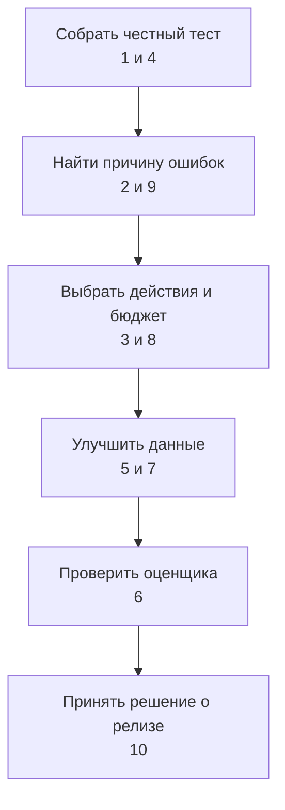

# 🖼️ Alice AI VLM — практика к интервью

> [!abstract] Что здесь
> Десять учебных кейсов по требованиям вакансии аналитика качества VLM: бенчмарки, несколько изображений, инструменты, разбор ошибок, синтетика, эксперты и приёмка. Это не подтверждённые вопросы Яндекса и не описание внутренней архитектуры Алисы.

**Практика:** 10 разборов · **Теория:** 3 бенчмарка и 3 технологические карточки · **Режим:** один кейс вслух, затем разбор решений.

[[Оценка ИИ-моделей/Бенчмарки агентных VLM/🏠 Бенчмарки и технологии агентных VLM|📚 Открыть бенчмарки и технологии]] · [[Разборы кейсов/🏠 Главная|🧩 Все кейсы базы]]

## 🧭 С чего начать

Если готовитесь после интервью про Маркет, начните с кейса 1: тот же вопрос отбора ограниченного числа задач, но изображения добавляют новые сложности. Затем кейс 2: как от метрики перейти к конкретному исправлению. После них — инструменты и синтетические данные.

Не пытайтесь запомнить «идеальный порядок». На интервью важнее объяснить, какое решение требуется, каких данных не хватает, что вы проверите первым и почему.

## 🔎 Бенчмарки и диагностика — высокий приоритет

- [[Разборы кейсов/VLM и мультимодальность/Кейс VLM 01 — бенчмарк на несколько изображений и отбор 400 задач|01. Миллион обращений → 400 задач на несколько изображений]]. Отбор с конкретными квотами, проверка необходимости каждой картинки, эталон и интервалы. Повторить: стратифицированную выборку, независимость наблюдений, определение успеха.
- [[Разборы кейсов/VLM и мультимодальность/Кейс VLM 02 — разложить ошибки и выбрать точку роста|02. От неверного ответа к точке роста]]. Ошибка области против OCR и вычисления; подмена компонент эталоном; оценка потенциального и достижимого выигрыша. Повторить: диагностические гипотезы, контролируемые вмешательства.
- [[Разборы кейсов/VLM и мультимодальность/Кейс VLM 04 — публичный бенчмарк вырос, качество продукта нет|04. Внешний балл вырос, пользователю не лучше]]. Применимость набора, утечки, сдвиг распределения и раздельная роль внешней и продуктовой оценки. Повторить: train/dev/test и парное сравнение.
- [[Разборы кейсов/VLM и мультимодальность/Кейс VLM 09 — привязка фактов к изображениям и проверки согласованности|09. Числа прочитаны верно, но перепутаны документы]]. Источник факта, перестановки, лишние картинки и связанные семейства тестов. Повторить: структуры эталонов и проверки согласованности.

## 🛠️ Инструменты и агентное поведение

- [[Разборы кейсов/VLM и мультимодальность/Кейс VLM 03 — когда вызывать OCR, увеличение и калькулятор|03. Всегда ли полезны OCR и увеличение]]. Выборочная политика, ошибки источников, сравнение на одинаковых задачах, корректное уточнение. Повторить: selection bias — смещение отбора, — задержку и качество полной системы.
- [[Разборы кейсов/VLM и мультимодальность/Кейс VLM 08 — качество, время и цена агентного рассуждения|08. Больше шагов: где польза, а где лишние расходы]]. Остановка, повторные попытки, граница качества и стоимости, реальная процедура выбора ответа. Повторить: p50/p95, парные исходы, бюджет тестирования.

## 🧪 Данные и оценщики — высокий приоритет

- [[Разборы кейсов/VLM и мультимодальность/Кейс VLM 05 — синтетические документы и обучающие траектории|05. Генератор документов и траекторий]]. Истина до рендеринга, выполнимые действия, фильтрация, разделение по шаблонам, эксперименты обучения. Повторить: SFT и RL, утечки и проверяющие.
- [[Разборы кейсов/VLM и мультимодальность/Кейс VLM 06 — как проверить мультимодального судью|06. Судья хвалит ошибочные ответы]]. Рубрика, слепая оценка, матрица ошибок, смещения стиля, независимая проверка фактов. Повторить: precision/recall, распространённость класса, контроль разметки.
- [[Разборы кейсов/VLM и мультимодальность/Кейс VLM 07 — выбрать 2000 примеров для экспертной разметки|07. 100 тысяч обращений → 2 тысячи экспертных разборов]]. Разница между оценкой и обучением, разнообразие, уверенные ошибки, бюджет в часах. Повторить: активное обучение, стоимость и независимый тест.

## 🚦 Итоговый кейс

- [[Разборы кейсов/VLM и мультимодальность/Кейс VLM 10 — приёмка новой версии и конфликт метрик|10. Документы лучше, несколько изображений хуже — выпускать?]]. Статистика, критичные ошибки, неухудшение, ограниченный запуск и защита заключения. Повторить: доверительные интервалы, парные тесты, критерии релиза.

## 🎙️ Как тренироваться без подсматривания

1. Прочитайте только условие и список тем выше. Сформулируйте 3–5 уточнений.
2. За 10–15 минут предложите подход. Каждый общий глагол раскрывайте: «проверю» — на каких данных, чем и какое наблюдение изменит решение.
3. Добавьте одну вводную: бюджет вдвое меньше; нет эталонов; инструмент нестабилен; доступны только логи; эксперты не согласны.
4. Откройте диалог в карточке и найдите не совпадение слов, а пропущенные решения.
5. Завершите конкретным артефактом: спецификация теста, таблица отбора, формат эталона, план эксперимента или заключение о релизе.

> [!tip] Проверка конкретики
> Вы сказали «оценим качество»? Назовите единицу оценки и проверяющего. «Соберём разнообразные данные»? Дайте матрицу и правило отбора. «Добавим инструменты»? Покажите аргументы и отказы. «Сформируем гипотезу»? Укажите ожидаемое наблюдение и альтернативное объяснение.

## Связь с предыдущими материалами

- [[Разборы кейсов/Агенты и продукты/Разбор интервью — бенчмарк агента Маркета и отбор 300 задач из миллиона запросов|Разбор интервью про агентный бенчмарк Маркета]].
- [[Разборы кейсов/VLM и мультимодальность/Разбор кейса — VLM для распознавания счетов и актов|Распознавание счетов и актов]].
- [[Разборы кейсов/VLM и мультимодальность/Разбор кейса — агентное редактирование изображений в Алисе|Агентное редактирование изображений]].
