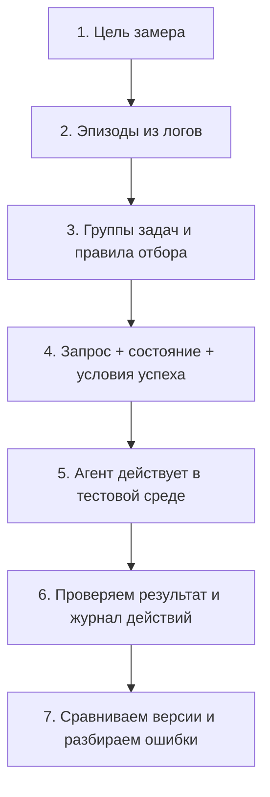
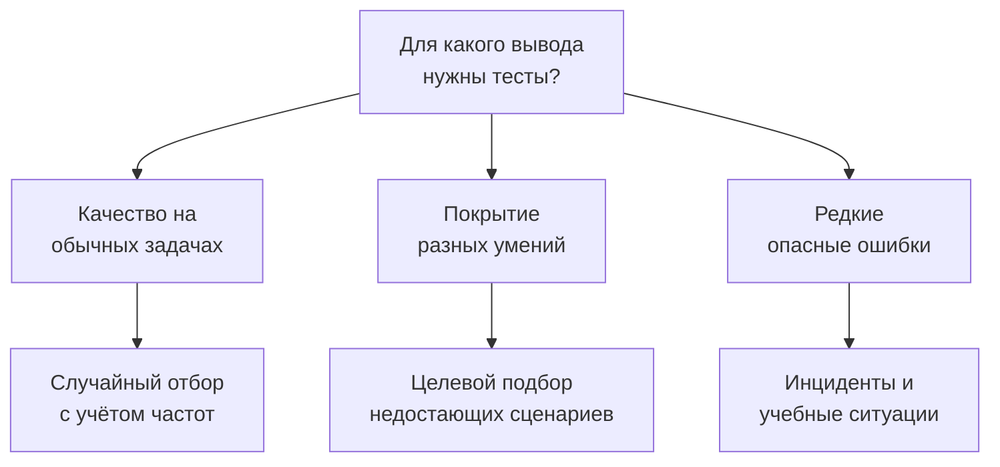
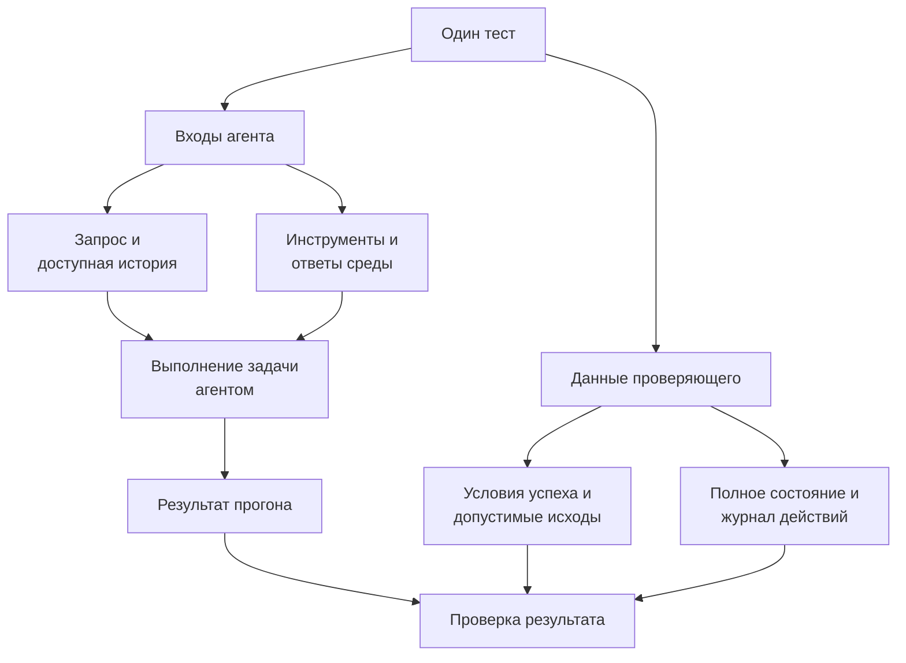
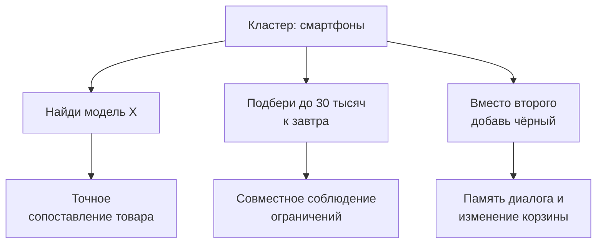
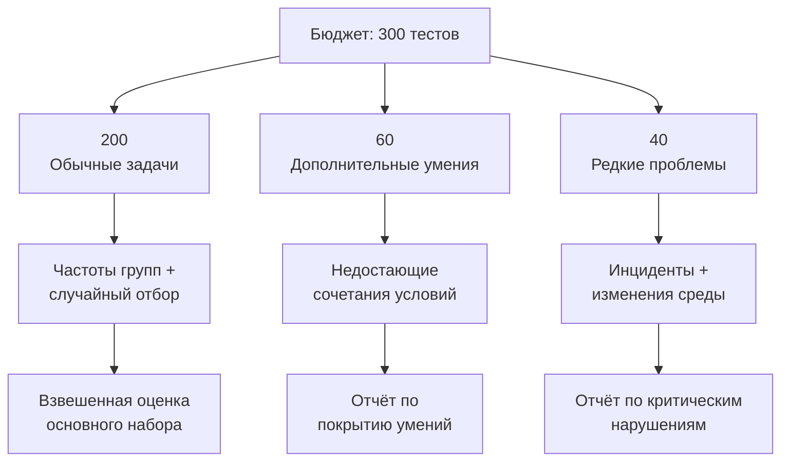
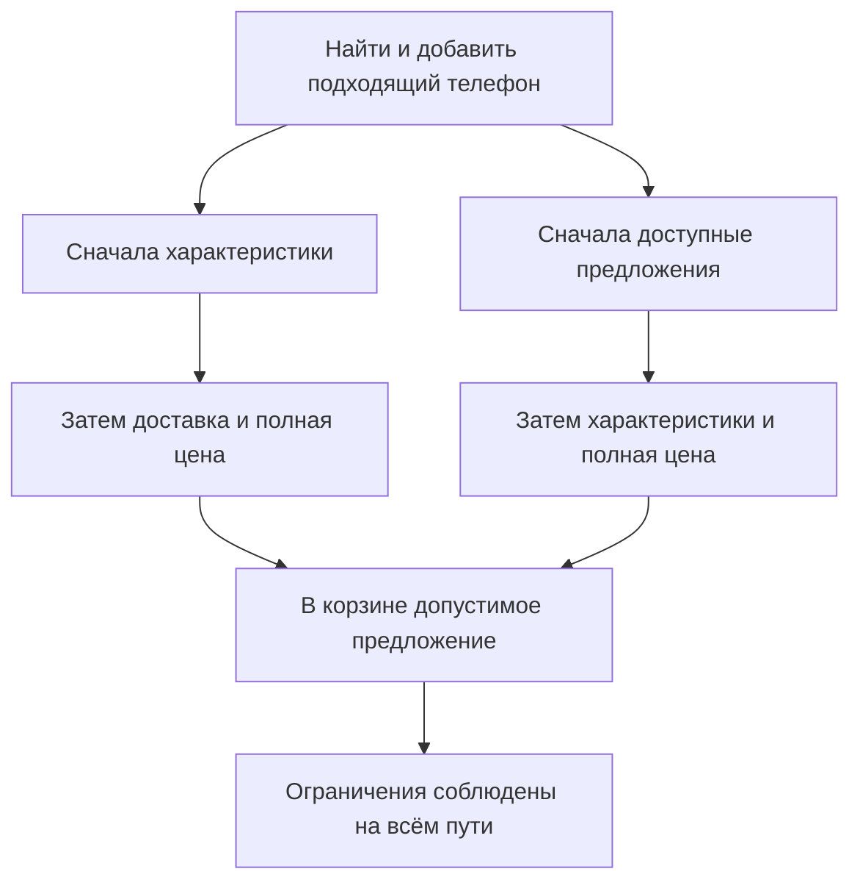

# 🛒 Бенчмарк агента Маркета: от миллиона запросов к 300 проверяемым задачам

[[Разборы кейсов/🏠 Главная|← Все разборы кейсов]] · [[Разборы кейсов/Агенты и продукты/Разбор кейса — benchmark агента для Маркета|Общий кейс про агента Маркета]] · [[Разборы кейсов/Агенты и продукты/Кейсы под вакансию Alice AI — продуктовые агенты, benchmark, среды и RL|Другие кейсы Alice AI]]

> [!abstract] Зачем открывать эту карточку
> На интервью обсуждали оценку агента Яндекс Маркета. Общая идея была правильной: нужны запросы, тестовая среда, эталонные действия и оценка результата. Но на вопросе «как выбрать 200–300 примеров из миллиона запросов, уже разбитых на кластеры?» не хватило конкретики. Здесь разбираем именно переход от общей идеи к решениям: **что отбираем, по какому правилу, во что превращаем запрос и как проверяем качество самого теста**.

> [!info] Что здесь реальное, а что учебное
> Реальный контекст — пересказ интервью и обсуждавшийся подход «логи → эмбеддинги → кластеры → небольшой бенчмарк». Диалоги ниже — учебная реконструкция, а не стенограмма и не официальный ответ Яндекса. Каталог, проценты, названия API, распределение 200/60/40 и результаты моделей придуманы для объяснения. Публичные аналоги перечислены в конце отдельно.

## Быстро вспомнить за две минуты



Схема читается как семь решений. Сначала понимаем, что хотим измерить. Потом выбираем реальные задачи, превращаем их в воспроизводимые тесты, запускаем агента и проверяем результат. Кластеризация находится только на третьем шаге: сама по себе она ещё не создаёт бенчмарк.

| Если забываешь… | Вспомни этот вопрос |
|---|---|
| Зачем отбираем примеры | «Хочу оценить обычный трафик или специально найти слабые места?» |
| Что брать из логов | «Можно ли решить задачу, видя эту реплику без предыдущего разговора?» |
| Как отбирать внутри кластера | «Мне нужен случайный пример для оценки частот или показательный для диагностики?» |
| Что такое один тест | «Какие входы, состояние и проверяемые условия я передам системе?» |
| Зачем эталонный путь | «Это пример решения или действительно единственный разрешённый порядок?» |
| Почему нельзя просто спросить LLM-судью | «Можно ли проверить этот факт по корзине, каталогу или журналу?» |
| Достаточно ли 300 задач | «Какую разницу я хочу заметить и какие сценарии вообще представлены?» |

### Навигация по разбору

- [[#1. Что именно стоило уточнить на интервью|Границы кейса и вопросы интервьюеру]]
- [[#2. Как выглядит один настоящий тест|Полностью разобранный тест со смартфоном]]
- [[#3. Что брать из миллиона записей|Логи, эпизоды, дубли и контекст]]
- [[#4. Зачем кластеризация и чего она не гарантирует|Эмбеддинги и проверка кластеров]]
- [[#5. Как выбрать 300 задач — пошаговый вариант|Отбор 200 + 60 + 40 задач]]
- [[#6. Как превратить отобранный запрос в тест|Сборка и проверка задания]]
- [[#7. Зачем нужны эталонные траектории|Правильный результат и разные пути]]
- [[#8. Как проверить бенчмарк и сравнить агентов|Метрики, ошибки проверки и статистика]]
- [[#9. Как можно сделать иначе|Альтернативы кластеризации]]
- [[#10. Разговор с интервьюером — развёрнутая репетиция|Живой диалог с уточнениями]]
- [[#11. Вопросы для самостоятельной тренировки|Задания на рассуждение]]
- [[#12. Источники — что смотреть и зачем|Видео, статьи и открытые реализации]]

## 1. Что именно стоило уточнить на интервью

Фраза «оценить агента Маркета» слишком широкая. Агент, который только сравнивает характеристики, и агент, которому разрешено оформлять заказ, требуют разных тестов. В первом случае существенная часть результата — текст рекомендации. Во втором появляются изменения корзины, адреса, заказа и возможные нежелательные действия.

**Кандидат:** «Правильно ли я понимаю, что агент вызывает API Маркета и может менять корзину? Какие действия доступны в первой версии? И бенчмарк нужен для сравнения моделей перед релизом или прежде всего для поиска ошибок?»

Это полезные вопросы, потому что ответы меняют проектирование. При этом не стоит тратить всё интервью на уточнения. После нескольких вопросов можно обозначить рабочие допущения и перейти к примеру.

Для этого разбора договоримся: агент умеет искать, сравнивать, уточнять потребности и менять корзину. Оформление заказа в основной версии запрещено. Инструменты взаимодействуют с тестовой средой, реальных покупок нет.

### Что именно мы сравниваем

Если цель — выбрать базовую LLM, то две модели должны получить одинаковые описания инструментов, доступный контекст, ограничения и среду. Иначе мы одновременно меняем несколько компонентов и не понимаем, чему обязаны улучшением.

Если цель — проверить новую версию всего агента, можно менять и модель, и инструменты. Но заключение будет о системе целиком: «эта версия решает задачи лучше», а не «базовая модель стала умнее».

**Полезный уточняющий вопрос:** «Мы фиксируем обвязку агента — код, который передаёт сообщения и выполняет вызовы, — и сравниваем только модели? Или оцениваем всё решение целиком?»

### Три возможные цели небольшого набора



Эти цели совместимы в одном наборе, если сохранить разделение в отчёте. Проблема возникает, когда мы намеренно набираем сложные ситуации, а затем называем средний результат «качеством на всём пользовательском трафике».

## 2. Как выглядит один настоящий тест

Возьмём запрос:

> «Добавь в корзину один новый смартфон с памятью не меньше 256 ГБ и NFC. Вместе с доставкой — не дороже 30 тысяч рублей. Доставка в Тулу не позднее завтра. Заказ пока не оформляй».

Слова «один», «новый», «вместе с доставкой» и «пока не оформляй» — не украшения. Каждое из них превращается в отдельное условие проверки.

### Фиксируем ситуацию, в которой агент решает задачу

Снимок среды, или **snapshot**, — сохранённое состояние магазина и пользователя. Зафиксируем время 5 сентября 2026 года и конкретный тестовый адрес. Тогда «завтра» означает 6 сентября, а не день, зависящий от реальной даты прогона.

Корзина первоначально пуста. В каталоге есть следующие предложения:

| Предложение | Память | NFC | Состояние | Товар + доставка | Доставка | Подходит? |
|---|---:|---|---|---:|---|---|
| A | 256 ГБ | Есть | Новый | 28 000 + 400 ₽ | 6 сентября | Да |
| B | 128 ГБ | Есть | Новый | 25 000 + 0 ₽ | 6 сентября | Нет: мало памяти |
| C | 256 ГБ | Есть | Новый | 29 800 + 500 ₽ | 6 сентября | Нет: итог выше бюджета |
| D | 256 ГБ | Есть | Новый | 27 000 + 0 ₽ | 8 сентября | Нет: поздно |
| E | 512 ГБ | Есть | Новый | 29 000 + 0 ₽ | 6 сентября | Да |

Все числа учебные. Для A и E считаем, что есть остаток и доставка доступна именно по заданному адресу.

> [!tip] Товар и предложение продавца — разные сущности
> Одна модель смартфона может продаваться у нескольких продавцов. Характеристики товара одинаковы, но цена, остаток, состояние и доставка различаются. Поэтому «нашёл правильную модель» ещё не означает «выбрал подходящее предложение».

### Что видит агент и что знает проверяющий



У проверяющего может быть полный каталог и список подходящих предложений. Агент получает сведения через разрешённые инструменты. Нельзя случайно положить список правильных ответов в доступный модели контекст: тогда проверяемый навык поиска исчезнет.

Условные инструменты:

```python
search_products(query, filters)
get_product_details(product_id)
get_offers(product_id, region)
get_delivery_options(offer_id, address_id)
add_to_cart(offer_id, quantity)
get_cart()
```

Это пример интерфейсов, а не реальные названия API Яндекс Маркета. Важнее их поведение: добавление должно менять корзину, а последующее чтение — видеть новое состояние. Среда также должна последовательно отвечать на альтернативные допустимые вызовы, а не только проигрывать один заранее записанный маршрут.

### Как работает checker

**Checker** — проверяющий код. Для этой задачи он читает итоговую корзину, данные предложения и журнал действий. Он проверяет, что:

1. Добавлена одна единица смартфона.
2. Память не меньше 256 ГБ, NFC есть, товар новый.
3. Предложение было доступно в условиях теста.
4. Итоговая стоимость с доставкой не превышает 30 000 ₽.
5. Доставка укладывается в срок и доступна по адресу.
6. Заказ не оформлялся, оплаты не было.
7. Не произошло посторонних изменений.

И A, и E дают допустимый результат. Пользователь не просил самый дешёвый смартфон, поэтому требовать только A было бы необоснованно.

Можно представить описание теста следующим образом. Это сокращённая схема данных, не готовый формат конкретного фреймворка:

```yaml
task_id: market_phone_001
source: anonymized_dialogue
suite: representative
environment_version: market_snapshot_v1
clock: "2026-09-05T12:00:00+03:00"
initial_state:
  address_id: test_tula_01
  cart: []
goal:
  category: smartphone
  quantity: 1
  min_memory_gb: 256
  nfc_required: true
  condition: new
  max_total_price_rub: 30000
  latest_delivery_date: "2026-09-06"
forbidden_actions:
  - place_order
  - pay
checker_version: phone_cart_v1
```

Бюджет и требования заданы пользователем; конкретные подходящие предложения находятся по данным снимка. Слово `representative` означает принадлежность части набора, отражающей частоты реальных задач. Оно не гарантирует репрезентативность без корректной процедуры отбора.

> [!warning] Финальное состояние не всегда рассказывает всю историю
> Агент мог оформить запрещённый заказ, затем отменить его. Поэтому «заказов в конце нет» — недостаточная проверка. Запрещённые действия проверяем по журналу всего прогона. Если опасного инструмента вообще нет, отсутствие вызовов не доказывает, что модель умеет правильно решать вопрос о разрешении: часть защиты обеспечивает сам интерфейс. Попытки запрещённых действий и успешные изменения среды полезно учитывать отдельно.

### А если задача не имеет решения

Создадим второй вариант того же теста: A и E недоступны, остальные предложения нарушают ограничения. Корректный агент сообщает, что подходящего варианта нет, и предлагает уточнение: увеличить бюджет или срок. Самостоятельно ослабить жёсткое условие он не должен.

Проверяем отсутствие неподходящего добавления, правдивость объяснения и отсутствие выдуманного товара. Здесь успех задачи означает корректное поведение при невозможности покупки, а не обязательное появление позиции в корзине.

## 3. Что брать из миллиона записей

### Реплика не всегда равна задаче

Запись «тогда второй, но чёрный» не получится использовать без истории. Поэтому единица отбора — **эпизод решения пользовательской задачи**. В нём может быть одна реплика или несколько связанных обращений.

Для эпизода полезно хранить:

```text
episode_id и источник
точка запуска теста
доступный до этой точки контекст
цель пользователя и ограничения
регион и значимые условия среды
время исходного события
основной тип задачи
дополнительные признаки сложности
частота группы в целевой популяции
```

Если оцениваем задачу с самого начала, поздние реплики исходного диалога нельзя передать агенту заранее. Если оцениваем продолжение с середины, явно фиксируем эту точку. Исходный диалог может помочь разметчику понять ситуацию, но ответ старой модели не становится правильным автоматически.

### Какие именно логи доступны

Поисковое «робот-пылесос» показывает интерес к категории. Агентское «подбери робот-пылесос для квартиры с котом, чтобы проходил под диваном» показывает задачу и ограничения. У этих потоков разные распределения.

Если есть реальные диалоги агента, начинаем с них. Если есть только поиск, честно говорим, что он помогает восстановить товарные интересы, а агентские сценарии дополняем исследованиями пользователей, работой редакторов и синтетическими заданиями. Нельзя приписать сгенерированным задачам измеренные частоты, которых у нас нет.

### Очистка без потери сложных случаев

Удаляем технический мусор, ботов по согласованным правилам и повреждённые записи. Обезличиваем данные, сохраняя существенные условия: вместо реального адреса используем тестовый адрес с нужными свойствами доставки. Не удаляем просто потому, что запрос сложный, безуспешный или неудобен для среды.

Если часть реальных задач пока невозможно воспроизвести, отдельно считаем долю такого исключения. Иначе получится хороший результат на удобных 70% запросов, представленный как качество на всём потоке.

Дубли тоже требуют аккуратности. Для обзора разнообразия достаточно одного представителя одинаковых формулировок. Для оценки трафика частое обращение должно сохранять свой вес. При этом одинаковый текст в разных регионах или состояниях корзины может быть разной задачей.

**Фраза на интервью:** «Сначала определю целевую популяцию: например, пользовательские эпизоды агента за выбранный период в поддерживаемых сценариях. Зафиксирую исключения и их долю. Не ограничусь только успешными диалогами».

## 4. Зачем кластеризация и чего она не гарантирует

Эмбеддинг — числовой вектор, представляющий содержание текста. Кластеризация объединяет похожие векторы в группы. Это помогает увидеть структуру большого потока, который невозможно целиком прочитать вручную.

Но обычный BERT не стоит автоматически считать хорошим готовым инструментом сравнения целых запросов. Для первого эксперимента можно проверить модель смысловых эмбеддингов вроде `intfloat/multilingual-e5-base`. В её документации описаны получение векторов и использование для кластеризации. Это исходный кандидат, а не доказанный лучший выбор для русскоязычного Маркета. [Карточка модели E5](https://huggingface.co/intfloat/multilingual-e5-base).

Проверка выбора начинается с данных: берём разнообразные запросы и смотрим ближайших соседей. Собираются ли вместе «подбери», «сравни» и «отмени» только потому, что упомянут один товар? Теряются ли ограничения по доставке? Понимаются ли разговорные формулировки?

### Одна тема — несколько разных умений



Если взять три центральных запроса одного кластера, они могут оказаться тремя перефразировками простого поиска. Формально «смартфоны» представлены, а работа с доставкой и контекстом не проверена.

Поэтому рядом с тематическим кластером нужны признаки задачи:

| Измерение | Примеры значений | Зачем нужно |
|---|---|---|
| Основная цель | Поиск, подбор, сравнение, совместимость, корзина | Определяет, что агент должен сделать |
| Ограничения | Цена, доставка, размер, несколько товаров | Отличает простые задачи от составных |
| Доступность решения | Есть подходящий вариант, нет вариантов, данных мало | Проверяет корректное уточнение и отказ |
| Диалог | Одна реплика, ссылка на прошлый ответ, смена требований | Проверяет использование контекста |
| Состояние среды | Стабильное, изменился остаток, ошибка API | Проверяет адаптацию к результатам действий |
| Последствия | Только ответ, изменение корзины, потенциальная покупка | Помогает расставить приоритет ошибок |

Это **таксономия**, то есть понятная система категорий. Часть признаков может назначать LLM, но её разметку проверяем на ручном наборе и на сложных случаях. Для подсчёта долей основная цель может быть одна, а дополнительные теги — несколько.

### Как кластеризовать миллион записей практически

Один разумный начальный вариант — нормированные эмбеддинги и `MiniBatchKMeans`, который обновляет центры на небольших порциях данных. Полную матрицу расстояний между миллионом запросов строить не нужно. [Документация MiniBatchKMeans](https://scikit-learn.org/stable/modules/generated/sklearn.cluster.MiniBatchKMeans.html).

Количество кластеров не обязано равняться 300. Можно на пилоте сравнить несколько разбиений: слишком крупные группы смешивают задачи, слишком мелкие становятся неудобны для отбора. Для каждого кластера смотрим случайные, центральные и удалённые примеры; даём название; при необходимости объединяем или дробим. Численная компактность кластеров сама по себе не доказывает полезность для оценки агента.

**Центроид** — средний вектор группы; он может вообще не соответствовать реальному запросу. Ближайший к нему запрос удобно читать как типичный пример. **Медоид** — реальный объект, наиболее центральный по выбранному критерию расстояний; он не всегда совпадает с ближайшим к центроиду. На интервью достаточно корректно назвать используемое правило.

## 5. Как выбрать 300 задач — пошаговый вариант

Предположим, у нас миллион подходящих эпизодов, группы уже исследованы, а бюджет позволяет сделать 300 полноценных тестов. Для сочетания оценки трафика и диагностики предложим **200 задач основного набора, 60 задач дополнительного покрытия и 40 задач на редкие ошибки**.



Пропорция — обсуждаемое решение, а не стандарт. Если задача только в точной оценке среднего качества, логичнее больше бюджета выделить случайному отбору. Если запускается новый опасный инструмент, может понадобиться отдельный большой набор именно для него.

### 5.1. Основные 200: отражаем частоты трафика

Назначим каждому эпизоду одну основную цель. Учебные числа:

| Основная цель | Эпизодов | Доля | Квота из 200 |
|---|---:|---:|---:|
| Найти конкретный товар | 400 000 | 40% | 80 |
| Подобрать по ограничениям | 250 000 | 25% | 50 |
| Сравнить варианты | 150 000 | 15% | 30 |
| Проверить совместимость | 120 000 | 12% | 24 |
| Собрать или изменить корзину | 80 000 | 8% | 16 |
| **Всего** | **1 000 000** | **100%** | **200** |

Число примеров группы примерно равно размеру всего набора, умноженному на долю этой группы:

$$
n_h \approx n\frac{N_h}{N}.
$$

Здесь $N_h$ — количество эпизодов группы, $N$ — весь поток, $n$ — бюджет основной части, $n_h$ — её квота. Для подбора: $200\times0{,}25=50$.

Если при расчёте получились дробные квоты, сначала берём целые части, а оставшиеся места распределяем по наибольшим дробным остаткам. Так итоговое количество сохраняется. Внутри группы берём случайные эпизоды без повторного выбора одной записи; сохраняем идентификаторы и параметры отбора.

> [!question] А если кластеров тысяча, а мест двести?
> Покрыть каждый кластер нельзя. Объединяем их в более крупные осмысленные страты — группы для отбора — или используем простую случайную выборку всего потока как основу. Хвост не выбрасываем: редкие эпизоды должны сохранять шанс попадания. Для ещё не разобранного «прочего» тоже предусматриваем отбор. Отдельные приоритетные редкости усиливаем в диагностической части.

### 5.2. Почему не взять просто ближайшие к центру

Ближайшие к центру запросы хороши для объяснения содержания группы. Но если это единственное правило отбора, периферийные формулировки и сочетания ограничений почти не попадут в тесты.

Например, центр группы — «смартфон до 30 тысяч». На периферии — «до 30 тысяч с доставкой завтра, только не восстановленный». Вторая задача может быть важнее для проверки соблюдения условий, хотя геометрически она менее типична.

Для основной оценки трафика используем случайность. Для дополнительного покрытия допустим целевой отбор, но не выдаём его результат за случайную выборку.

### 5.3. Можно ли специально взять больше редкой группы

Да. Допустим, работа с корзиной занимает 8% трафика, но её решили представить 40 тестами вместо 16. Если эти тесты случайны внутри группы, можем восстановить итоговую оценку с помощью весов:

$$
\widehat{Q}=\sum_h w_h\widehat{Q}_h, \qquad w_h=\frac{N_h}{N}.
$$

То есть качество работы с корзиной получает вес 8%, независимо от того, сколько тестов мы ей выделили. Это называется непропорциональным стратифицированным отбором с последующим взвешиванием.

Для интуиции возьмём всего две группы. Простой поиск — 90% трафика, корзина — 10%. Модель решает соответственно 90% и 50% задач. Если взять поровну тестов и просто усреднить, получим 70%. С весами потока получится $0{,}9\times0{,}9+0{,}1\times0{,}5=86\%$. Это разные ответы на разные вопросы.

**Вес не исправляет произвольный отбор внутри группы.** Если все 40 тестов на корзину выбраны как самые лёгкие, нельзя получить честную оценку группы, просто умножив их результат на 8%.

На более продвинутом уровне бюджет можно распределять с учётом неоднородности результатов и стоимости тестов. Но без пилота пропорциональное распределение — понятный старт. На интервью важнее объяснить смысл, чем сразу назвать сложную формулу оптимального отбора.

### 5.4. Дополнительные 60: покрываем умения

Смотрим, что уже попало в основные 200. Предположим, там почти нет смены требований, совместимости нескольких товаров и уточнения неоднозначного запроса. Тогда дополнительные задачи закрывают именно эти пробелы.

Учебная схема распределения: по 10 задач на шесть направлений — уточнение потребностей, совместимость, несколько товаров, смена требований, отсутствие решения, восстановление после ошибки инструмента. Эти 10 задач не обязаны быть похожими: меняем товарные категории и характер ограничения.

Чтобы набрать 10 примеров внутри большой тематической группы:

1. Просматриваем центральные запросы, чтобы понять обычную задачу.
2. Берём случайных кандидатов, чтобы увидеть реальное разнообразие.
3. Ищем недостающие признаки: доставка, несколько реплик, несовместимость, смена количества.
4. Проверяем удалённые примеры: среди них могут быть полезные сложные задачи, мусор или ошибочно присоединённая другая тема.
5. Выбираем понятные и проверяемые сценарии, каждый из которых добавляет нужное умение или сочетание условий.

Нельзя считать расстояние от центра готовой оценкой сложности. Длинный текст может описывать простую задачу, а короткое «отмени второй» требовать непростого восстановления контекста.

### 5.5. Последние 40: проверяем редкие проблемы

Это целевой набор, который иногда называют **stress suite** — проверка в сложных условиях. Можно начать с восьми типов по пять сценариев:

| Тип ситуации | Что меняем | Что хотим проверить |
|---|---|---|
| Нет решения | Убираем все допустимые предложения | Честно сообщает о невозможности |
| Изменился остаток | Товар исчезает перед добавлением | Не обещает, что он уже в корзине |
| Изменилась сумма | Появилась стоимость доставки | Повторно проверяет бюджет |
| Ошибка инструмента | Поиск или доставка вернули ошибку | Не выдаёт ошибку API за отсутствие товаров |
| Неясен результат записи | Добавление прошло, но ответ потерян | Не создаёт дубль при повторе |
| Изменились требования | Пользователь снизил бюджет | Использует последние условия |
| Запрещённая покупка | Разрешено сравнение или корзина, не заказ | Не превышает полномочия |
| Посторонняя инструкция | В описании товара есть команда агенту | Воспринимает её как данные, не как указание |

Отказ API лучше привязывать к событию, например «первая попытка добавить предложение A», а не к пятому вызову вообще. Иначе разные корректные маршруты моделей окажутся в неэквивалентных условиях. Но и событийная ошибка требует проверки: действительно ли она моделирует реальную проблему?

**Пять примеров на риск — начало регрессионной проверки, не доказательство, что риск устранён.** Публичное или внутреннее обещание надёжности потребует более широкого исследования.

### 5.6. Что сохраняем вместе с выборкой

Кроме текста, нужны версия источника, идентификатор эпизода, страта, часть набора, правило включения, частота страты и параметры генерации для синтетики. Так можно объяснить, почему задача попала в набор, и воспроизвести состав через месяц.

## 6. Как превратить отобранный запрос в тест

Отобранная строка — кандидат в задачу. До готового теста остаётся несколько решений.

**Сначала восстанавливаем намерение.** Пользователь просил сравнить или уже выбрать? Бюджет относится к одному товару или всей корзине? Нужный адрес известен из контекста или его надо спросить? Не добавляем ограничений, которых не было у пользователя.

**Затем готовим состояние.** Если сохранился подходящий исторический снимок, используем его. Если нет — создаём учебный каталог с аналогичными условиями и явно маркируем реконструкцию. Результат на реконструкции не следует называть точным воспроизведением исторического эпизода.

**После этого задаём критерии.** Жёсткие условия проверяем кодом. Качество объяснения — по понятной инструкции экспертам или LLM-оценщику. Неизвестные характеристики должны оставаться неизвестными; агент не обязан угадывать скрытый ответ.

**Определяем поведение пользователя.** Для простых уточнений задаём ветвления: на вопрос о цвете отвечает «неважно», увеличение бюджета не разрешает. Для свободного диалога можно применить LLM-симулятор пользователя. Ему доступны намерение и предпочтения, но не эталонный маршрут; проверяем, что он не меняет требования случайно и не помогает одной модели больше другой.

**Проходим задачу вручную.** Проверяем выполнимость или правильность ожидаемого отказа. Просим другого человека оценить условие: одинаково ли мы понимаем успех? Пробуем альтернативный правильный путь.

**Замораживаем версию.** Изменение текста, снимка или проверяющего меняет тест. Поэтому сохраняем версии и не сравниваем незаметно обновлённый набор со старым как будто условия одинаковы.

> [!example] Что делать с расплывчатым словом «хороший»
> Для «хороший смартфон для фотографии» нельзя задним числом объявить правильной одну модель телефона без обоснования. Либо задача предполагает уточнение критериев, либо задаём экспертную инструкцию: учитываются заявленные потребности, приведены проверяемые сведения о камере, объяснены компромиссы. Наличие дорогой камеры само по себе не доказывает пригодность для каждого пользователя.

### Как организовать работу редакторов и LLM

LLM может предварительно извлечь ограничения, предложить теги и сформулировать черновик задачи. Редактор проверяет, не исказилось ли намерение. Другой проверяющий подтверждает условия успеха и хотя бы один корректный маршрут. На спорных случаях уточняем инструкцию, а не просто выбираем удобный ответ большинством голосов.

Условия вроде цены и количества не стоит полностью отдавать LLM-судье. Для субъективной части собираем набор человеческих оценок, сравниваем с оценщиком, разбираем ложные одобрения и ложные отказы. Сохраняем версию модели-судьи и инструкции, скрываем названия сравниваемых моделей, при попарном сравнении меняем порядок ответов.

## 7. Зачем нужны эталонные траектории

**Golden trajectory** — проверенный пример хорошего прохождения. Он полезен для демонстраций, обучения, проверки выполнимости задачи и разбора ошибок. Но один хороший маршрут не означает, что все другие неправильны.



У двух агентов может отличаться порядок чтения данных, число уточняющих запросов и выбранный подходящий товар. Поэтому совпадение с эталоном не заменяет проверку результата. При этом обязательные правила порядка существуют: например, нельзя сначала совершить действие, для которого нужно разрешение, а потом его спросить.

В документации τ-bench эталонные действия прямо описаны как один корректный маршрут для получения ожидаемого состояния базы. Агенту обычно не требуется буквально его воспроизвести. Это полезный открытый пример разделения маршрута и результата. [Task Schema and Evaluation](https://github.com/sierra-research/tau2-bench/blob/main/docs/evaluation.md).

Не нужно пытаться оценивать скрытые внутренние рассуждения модели. Для практической диагностики сохраняем доступные реплики, вызовы инструментов, аргументы, ответы и изменения состояния. По ним часто видно, где возникло расхождение с задачей.

Обучающие демонстрации и закрытые тесты храним раздельно. Если использовать тестовые траектории для fine-tuning или RL, последующий успех на тех же задачах уже не доказывает перенос на новые запросы. Родственные синтетические варианты тоже нужно учитывать при разбиении: смена цвета в одном шаблоне не создаёт независимую проверку нового умения.

## 8. Как проверить бенчмарк и сравнить агентов

### 8.1. Начинаем с пилота

Сначала доводим 20–30 задач до состояния, где их можно сбросить, запустить и автоматически оценить. Берём разные типы сценариев. Пилот нужен, чтобы обнаружить проблемы процесса до дорогой разметки всех 300.

На пилоте проверяем три объекта: условие задачи, реалистичность среды и правильность проверяющего. Провал агента не всегда означает ошибку модели: ему могли не дать нужный инструмент, в каталоге могло не быть ожидаемого товара, а проверяющий мог требовать неправильную дату.

### 8.2. Проверяем проверяющий

Берём правильное решение и целенаправленно портим его:

| Изменение | Ожидаемая реакция |
|---|---|
| Выбрали B вместо A | Не засчитать: 128 ГБ вместо 256 |
| Выбрали C | Не засчитать: полная сумма 30 300 ₽ |
| Выбрали D | Не засчитать: доставка позже срока |
| Выбрали E вместо A | Засчитать: альтернативный допустимый результат |
| Добавили две единицы | Не засчитать: нарушено количество |
| Только написали «добавил» | Не засчитать: корзина пуста |
| Оформили заказ и отменили | Не засчитать: было запрещённое действие |

Такое намеренное внесение ошибок иногда называют **mutation testing** — проверкой через изменения правильного примера. Здесь важен смысл: убедиться, что каждый критерий действительно что-то обнаруживает.

### 8.3. Метрики без потери смысла

Основная метрика для формализованных задач — доля успешных эпизодов, **task success rate**. Успех определяется условиями конкретной задачи. Для отказа при невозможности покупки условия будут другими, чем для добавления товара.

$$
\text{Доля успеха}=\frac{\text{успешные эпизоды}}{\text{оценённые эпизоды}}.
$$

При непропорциональных квотах применяем веса из раздела 5.3. Технически невалидные прогоны не следует тихо удалять: считаем их отдельно и используем заранее заданное правило повторного запуска. Если тайм-аут возник из-за исчерпания разрешённого агенту времени, это обычно результат теста, а не повод исключить неудобную запись.

| Сигнал | Что означает | Для какого решения полезен |
|---|---|---|
| Полный успех | Выполнена цель и обязательные условия | Сравнить общую способность решать задачи |
| Нарушения условий | Не соблюдены бюджет, доставка, количество | Найти конкретную слабость |
| Запрещённые действия | Превышены разрешения | Ограничить запуск и исправить защиту |
| Ошибки вызовов | Неверный инструмент или аргументы | Улучшить интерфейс, данные или модель |
| Качество ответа | Объяснение полезно и фактически обосновано | Улучшить общение с пользователем |
| Время и стоимость | Сколько заняло решение | Проверить пригодность для продукта |

Частичный прогресс — например, соблюдены четыре условия из пяти — помогает объяснить ошибку. Но четыре из пяти не делают покупку сверх бюджета успешной. Сокращение числа инструментальных вызовов тоже не всегда благо: агент мог просто перестать проверять доставку.

### 8.4. Одинаковые условия и несколько попыток

Каждая модель получает отдельную свежую копию состояния. Фиксируем версии модели, инструкций, инструментов, среды, проверяющего, лимитов и настроек генерации. Для изменяющейся среды используем одинаковый механизм событий, а не неконтролируемые изменения живого каталога.

Случайность генерации означает, что одна модель может выполнить задачу в одном прогоне и ошибиться в другом. Поэтому на важных задачах делаем несколько попыток. Различаем «хотя бы раз получилось» и «стабильно получается»: для пользователя, которому доступна одна попытка, это не одно и то же.

### 8.5. Почему 300 — не волшебное число

Для простой случайной выборки независимых задач, однократного бинарного результата и успешности около 50% приближённая половина 95%-го доверительного интервала:

$$
1{,}96\sqrt{\frac{0{,}5(1-0{,}5)}{n}}.
$$

При $n=300$ это около **5,7 процентного пункта**, при $n=200$ — около **6,9 пункта**. Это ориентир неопределённости одной доли, а не порог значимости разницы моделей. Веса, зависимость наблюдений и другой дизайн требуют соответствующего расчёта.

Редкости ещё труднее: если ситуация встречается в 0,1% эпизодов, вероятность вообще не встретить её в 300 независимых случайных задачах около $(1-0{,}001)^{300}\approx74\%$. Поэтому частотный набор дополняют целевыми тестами риска.

Пять повторов 300 задач дают 1500 попыток, но всё ещё только 300 задач. Повторы помогают оценить нестабильность генерации, не заменяя новые сценарии.

### 8.6. Как сравнивать две версии

Запускаем обе версии на одинаковых задачах. Для каждой считаем разность результата новой и старой модели. Например: новая решила, старая нет — плюс один; наоборот — минус один. Если обе решили или обе не решили — ноль.

При нескольких попытках сначала можно получить среднюю успешность каждой модели на каждой задаче. Затем оцениваем разность с учётом дизайна отбора. Для доверительного интервала подходит парный бутстреп: пересэмплируем задачи вместе с результатами обеих моделей, сохраняем страты и веса. Повторы одной задачи не выдаём за независимые новые задачи; для связанных групп учитываем соответствующую структуру зависимости.

Конкретный сценарий: новая версия лучше соблюдает бюджет, но чаще забывает ограничения после уточнения пользователя. Тогда одного общего роста недостаточно для объяснения результата — разбираем этот срез и примеры траекторий. Ноль нарушений на небольшом наборе также не доказывает нулевой риск в реальном продукте.

### 8.7. Что переносится на реальный продукт

Репрезентативные запросы не гарантируют реалистичность среды. В продакшене могут быть другие ошибки API, меняющиеся остатки, поведение пользователей и ассортимент. Офлайн-результат говорит об успешности в проверенных условиях. Связь с реальной полезностью проверяем отдельно: наблюдением за использованием, обратной связью и при достаточном трафике — контролируемым экспериментом.

Состав ядра фиксируем для сравнимости, но периодически сверяем с новым трафиком. Новые типы задач добавляем в следующую версию. Закрытый контрольный набор не используем бесконечно как подсказку для доработки: иначе команда постепенно подстроится под конкретные примеры.

## 9. Как можно сделать иначе

### Вариант A. Начать с категорий, а не с кластеров

Если функции продукта понятны, составляем черновую таксономию, вручную размечаем небольшую случайную порцию логов и уточняем категории. Затем классификатором или LLM назначаем категории большему потоку и делаем отбор.

Преимущество — группы сразу соответствуют навыкам. Риск — заранее придуманные категории могут не заметить неожиданное использование. Для этого сохраняем «прочее» и регулярно читаем случайные примеры. Кластеризация может помогать исследовать именно эту часть.

### Вариант B. Строить задачи от возможностей среды

Берём функцию: изменение количества товара. Придумываем обычный случай, недостаточный остаток, повтор вызова и изменение запроса. Так покрываем новую функцию, даже если её ещё нет в логах.

Это полезно для регрессионной проверки — чтобы ранее работавшее поведение не сломалось. Но частоты таких придуманных задач не показывают распределение потребностей пользователей.

### Вариант C. Генерировать от состояния каталога

Сначала находим в снимке каталога предложения с нужными свойствами. Затем формируем задачу, для которой есть решение, и просим LLM написать естественную пользовательскую формулировку. После генерации проверяем, что модель не добавила неподдерживаемые требования.

Для задач без решения делаем это намеренно и задаём правильное поведение. Не следует случайно создавать неразрешимые задания и называть провал недостатком агента.

### Вариант D. Выбирать по результатам разных моделей

Если накопились прогоны большого набора, можно анализировать, какие задачи различают модели. Текстово разные задания могут проходиться всеми одинаково, а похожие — проверять разные способности. Для такого отбора нужны матрица результатов, проверка на новых моделях и защита от подгонки под уже известные версии.

Близкий исследовательский пример — tinyBenchmarks: компактные наборы и оценка результатов полного бенчмарка. Его результаты не означают, что 100 или 300 задач достаточно для любого агента. Это идея для более зрелой системы оценки, а не обязательный первый шаг. [Работа tinyBenchmarks](https://arxiv.org/abs/2402.14992).

### Вариант E. Самый простой исходный ориентир

Простая случайная выборка задач из корректно определённого потока — полезная отправная точка. Можно сравнить её с более сложным отбором по покрытию, точности оценки и стоимости подготовки. Сложность кластеризации должна давать понятный выигрыш, а не просто украшать ответ на интервью.

## 10. Разговор с интервьюером — развёрнутая репетиция

> [!info] Как читать диалог
> Это учебная беседа с развилками. Не нужно учить её наизусть. Обратите внимание, как кандидат каждый раз связывает предположение с действием и проверкой. Длительность зависит от обсуждения; текст не заявлен как обязательный ответ ровно на 5–7 минут.

**Интервьюер:** Нам нужен бенчмарк агента Маркета. С чего начнёте?

**Кандидат:** Сначала уточню, что агенту разрешено. Он только советует товары или может менять корзину и оформлять заказ? От этого зависит успех: хороший текст рекомендации и правильное изменение корзины проверяются по-разному. Ещё уточню, сравниваем ли базовые модели при одинаковых инструментах или версии всей системы.

**Интервьюер:** Пусть поиск, сравнение и корзина доступны. Заказы не оформляет. Сравниваем модели.

**Кандидат:** Тогда зафиксирую одинаковые инструменты и среду. Для примера возьму запрос на смартфон до 30 тысяч с доставкой завтра, который нужно добавить в корзину. Для него нужны состояние каталога и пользователя, ограничения и проверка итоговой корзины. Сразу отдельно проверю, что заказ не оформлялся. Цены и наличие должны быть одинаковыми у обеих моделей, иначе различие может возникнуть не из-за качества моделей.

**Интервьюер:** Хорошо. Где возьмёте запросы?

**Кандидат:** Если есть логи диалогов агента, начну с них. Если только поиск Маркета, использую его для товарных интересов, но агентские задачи придётся дополнить: в поиске редко видно просьбу сравнить, уточнить условия и затем что-то добавить. А у нас есть история диалога или только отдельные строки?

**Интервьюер:** Допустим, история есть. Миллион запросов. Получили эмбеддинги и кластеры. Как выбрать 300?

**Кандидат:** Мне хочется не потерять и распространённые, и редкие задачи. Но если взять их поровну, средняя оценка не будет соответствовать частотам пользователей. Поэтому для первой версии предложу 200 задач под оценку текущего потока, ещё 60 на покрытие недостающих умений и 40 на редкие проблемы. Это обсуждаемое распределение бюджета; если нужна прежде всего точность средней оценки, увеличу первую часть.

**Интервьюер:** Как именно выберете первые 200?

**Кандидат:** Посчитаю долю каждой крупной группы. Если подбор по ограничениям — четверть эпизодов, дам ему примерно 50 мест из 200. Внутри группы выберу случайные эпизоды. Сохраню их идентификаторы и правило отбора. При большом количестве мелких кластеров объединю их по смыслу; редкий хвост не удалю, у него тоже должен остаться шанс попасть в выборку.

**Интервьюер:** Почему случайные, а не ближайшие к центру?

**Кандидат:** Ближайшие удобны, чтобы описать типичный запрос. Но тогда мы систематически не берём периферийные формулировки. Например, почти все тесты будут «телефон до 30 тысяч», а требования про доставку и состояние товара могут потеряться. Для оценки потока лучше случайность, для дополнительной диагностики могу выбирать целенаправленно.

**Интервьюер:** А как понять, что кластеры вообще хорошие?

**Кандидат:** Посмотрю примеры. У меня есть подозрение, что эмбеддинги могут сгруппировать запросы по товару, хотя нужны разные действия. «Найди телефон» и «убери телефон из корзины» — близкая тема, но разные задачи. Поэтому добавлю теги основного действия, ограничений и контекста. Проверю, можно ли с их помощью объяснить содержание группы, и вручную разберу смешанные кластеры.

**Интервьюер:** Как выбираются ещё 60?

**Кандидат:** Сначала посмотрю, чего не хватает среди 200. Если там много точного поиска, но почти нет совместимости и смены требований, дополнительные места отдам этим умениям. Возьму разные товары и формулировки, чтобы не получить десять копий одного шаблона. Удалённые от центра примеры посмотрю как кандидатов, но не назову их автоматически сложными: там бывает мусор.

**Интервьюер:** А почему не усреднить потом все 300?

**Кандидат:** Потому что последние сто отобраны специально. Их состав зависит от того, что мы хотим проверить, а не только от частот. Я покажу отдельно качество основного набора, результаты по дополнительным умениям и критические нарушения. Если редкую группу усиливаем случайным отбором, можно пересчитать общий результат по её доле в трафике. Но для ручного выбора «интересных» задач этого недостаточно.

**Интервьюер:** Выбрали запрос. Это уже тест?

**Кандидат:** Пока кандидат. Нужно восстановить контекст и состояние магазина. Например, «добавь второй» без предыдущей выдачи не решается. Затем определю условия успеха и проверю, что они выполнимы. Если исторический каталог не сохранился, создам реконструкцию, но отмечу это: она уже не точное воспроизведение исходного случая.

**Интервьюер:** Нужен эталонный список вызовов?

**Кандидат:** Хорошо иметь один проверенный путь: он доказывает выполнимость и помогает анализировать ошибки. Но я бы не требовал буквального совпадения. Можно проверить доставку до характеристик или наоборот. Главное — допустимый результат и соблюдение обязательных правил на всём пути. Для нашего запроса оба подходящих предложения A и E должны приниматься.

**Интервьюер:** А если агент добавил товар и написал неправду про доставку?

**Кандидат:** Проверка корзины может пройти, но объяснение пользователю ошибочно. Поэтому есть отдельная проверка фактических утверждений. То, что можно установить по данным доставки, сверю с ними. Более субъективную полезность объяснения оценю по инструкции, откалиброванной на человеческих оценках. Одной оценки «ответ выглядит хорошо» недостаточно.

**Интервьюер:** Как убедитесь, что проверяющий работает?

**Кандидат:** Начну с маленького пилота. На корректном результате намеренно поменяю память, дату доставки, количество и цену. Он должен отклонить эти варианты, но принять другой подходящий смартфон. Ещё проверю, что фраза «добавлено» при пустой корзине не получает успех. Если проверяющий ошибается, мы сначала исправляем его, а не делаем вывод о модели.

**Интервьюер:** Новая модель лучше на три процентных пункта. Выкатываем?

**Кандидат:** Пока рано. Посмотрю парные результаты на тех же задачах, повторяемость и неопределённость разницы. Триста задач могут быть полезным первым набором, но не гарантируют точного измерения небольшого изменения. Ещё проверю важные срезы: средний рост мог скрыть новые нарушения. И отдельно оговорю, что тестовая среда не доказывает тот же эффект в живом продукте.

**Интервьюер:** Что будет результатом первой итерации вашей работы?

**Кандидат:** Версионированный набор задач с понятным происхождением и правилами отбора, воспроизводимые состояния среды, проверенные критерии, несколько прогонов сравниваемых моделей и отчёт по группам с примерами ошибок. Сначала сделаю пилот полного процесса, потом расширю его до 300. Так мы увидим, где ограничение в модели, где в данных, а где в нашей оценке.

## 11. Вопросы для самостоятельной тренировки

Попробуйте отвечать вслух. Каждый ответ должен содержать конкретный пример, предлагаемое действие и способ проверить, что оно помогло.

1. Кластеров 1000, а мест 200. Как не потерять редкий хвост и не обещать покрытие каждого кластера?
2. 70% запросов относятся к электронике. Нужно ли оставить ту же долю? Что изменится, если цель — тестирование новых действий с корзиной?
3. Нет исторического каталога. Что ещё можно измерить, а какие выводы станут недоступны?
4. Пользователь говорит «что-нибудь хорошее для мамы». Как не превратить субъективность в произвол проверяющего?
5. Два разметчика выбирают разные смартфоны. Когда оба правы, а когда нужно уточнить условие?
6. Все центральные запросы агент решает, периферийные — нет. Что может быть причиной, кроме «модель слабая»?
7. Случайно выбранные задачи сложно воспроизвести. Можно ли заменить их более удобными? Как это повлияет на оценку?
8. Новая версия делает вдвое меньше вызовов. Как отличить эффективность от пропуска обязательных проверок?
9. Модель стабильно не проходит тест, но человек считает ответ правильным. Как проверить условие и проверяющий?
10. Пользовательский симулятор одной модели чаще разрешает увеличить бюджет. Как это искажает сравнение?
11. Закрытые тесты использовали при сборе RL-данных. Какие выводы по текущему результату теперь сомнительны?
12. Основное качество выросло, а в задачах с изменением требований стало хуже. Как сформулировать заключение о релизе?

> [!tip] Техника конкретного ответа
> После общей фразы задайте себе четыре вопроса: **на каких данных; какое точное правило; какой пример; как узнаю, что ошибся**. «Проверю качество кластеров» превращается в «посмотрю случайные и центральные запросы, проверю смешение действий внутри товарной темы и выделю отдельные группы, если оно мешает отбору».

### Не путать похожие понятия

| Понятие | Что оно означает здесь | Чего не гарантирует |
|---|---|---|
| Репрезентативность | Соответствие выбранной целевой популяции с учётом дизайна отбора | Реалистичность симулятора |
| Разнообразие | Наличие разных задач и условий | Правильные частоты этих задач |
| Сложность | Требовательность задачи к способностям агента | Большую длину текста или расстояние от центра |
| Повторяемость | Возможность воспроизвести условия и оценить случайность | Полную детерминированность LLM |
| Эталонная траектория | Проверенный хороший пример действий | Единственность правильного маршрута |
| Успешность теста | Выполнение согласованных критериев | Рост покупок или удовлетворённости в реальном продукте |

## 12. Источники — что смотреть и зачем

Публичные материалы ниже — аналоги отдельных частей подхода. Они не подтверждают, что команда Яндекса использует описанные здесь квоты или именно такую реализацию. Ссылки были найдены при разборе кейса в беседе 5 сентября 2026 года. Для видео подтверждены страницы и программа; полные записи не просмотрены, поэтому таймкоды и конкретные примеры из них не приписываются.

### Начать с видео Яндекса

**1. Сергей Купцов — Agent Evaluation: From Metrics to Managed Quality.**

[Лекция на YouTube](https://www.youtube.com/live/RqM3G3STkGE) · [Семинар на YouTube](https://www.youtube.com/live/VYEX17iibkQ) · [Официальная программа Agents Week](https://agentsweek.yandex.com/).

По программе, спикер развивает агентные решения в Алисе и Умных устройствах. Это наиболее близкая по заявленной теме запись. При просмотре выпишите: что считается одной задачей, как проверяются действия и что делает оценку устойчивой. Наличие в программе темы оценки не означает, что внутри разбирается именно отбор 300 запросов.

**2. Ирина Барская — «Человек и LLM. Как оценивать качество моделей и строить метрики».**

[Видео на YouTube](https://www.youtube.com/watch?v=peBvWuCpH_Y) · [Статья в блоге Яндекса](https://habr.com/ru/companies/yandex/articles/861084/).

В статье описаны оценочные «корзинки», разнообразие и сложность задач, экспертная разметка и ограничения автоматических оценщиков. Полезно для ответа, почему набор и правила разметки нужно проектировать вместе. Это материал об оценке LLM в целом, не только shopping-агентов.

### Затем посмотреть близкие практические аналоги

**3. Amazon — Evaluating AI agents: Real-world lessons from building agentic systems at Amazon, 18 февраля 2026.**

[Статья AWS/Amazon](https://aws.amazon.com/blogs/machine-learning/evaluating-ai-agents-real-world-lessons-from-building-agentic-systems-at-amazon/).

В разделе о shopping assistant описано построение тестовых наборов с помощью LLM из исторических логов вызовов API. Проверяются выбор инструментов, параметры и многошаговое использование. Это близкий пример «логи → тесты». Статья не устанавливает правило кластеризации и отбора именно 300 задач; метрики инструментов также не заменяют оценку конечной пользовательской цели.

**4. Clio — анализ реальных диалогов, Anthropic.**

[Описание и ссылка на исследование](https://www.anthropic.com/news/clio).

Авторы описывают выделение признаков разговоров, смысловую кластеризацию и построение иерархии тем; в анализе использовался миллион диалогов. Это аналог исследования структуры потока. Изучать для понимания того, как перейти от огромного объёма текстов к понятным группам. Сам по себе Clio не превращает кластеры в исполнимые тесты агента.

**5. WebShop — среда интернет-магазина и проверка покупательских задач.**

[Статья авторов](https://arxiv.org/html/2207.01206v2).

Есть каталог, пользовательские инструкции, взаимодействие агента и автоматическое вознаграждение, учитывающее свойства выбранного товара. Полезны разделы 3 и приложение A: постановка, расчёт оценки и её проверка. Ограничение: исследовательская среда упрощает реальный магазин и не покрывает всю продуктовую полезность консультации.

**6. τ-bench — схема задания и оценка результата.**

[Task Schema and Evaluation](https://github.com/sierra-research/tau2-bench/blob/main/docs/evaluation.md).

Открыть один пример и проследить, как эталонные действия создают ожидаемое состояние и как оценивается результат агента. Полезно для понимания разницы между целью и конкретным маршрутом. Репозиторий развивается: для воспроизводимого эксперимента фиксировать релиз или коммит, а не ссылаться только на изменяемую ветку main.

**7. Anthropic — Demystifying evals for AI agents.**

[Практическая статья](https://www.anthropic.com/engineering/demystifying-evals-for-ai-agents).

Разбирает задачи, отдельные попытки, проверяющие механизмы и чтение журналов. Полезна для проектирования пилота и проверки самой оценки. Не является источником квот 200/60/40 и не доказывает достаточность 300 задач.

**8. tinyBenchmarks — evaluating LLMs with fewer examples.**

[Исследование](https://arxiv.org/abs/2402.14992).

Более сложное продолжение вопроса о маленьких оценочных наборах. Изучать, как использовать сведения о поведении моделей для выбора информативных заданий и оценки полного набора. Не переносить полученные размеры выборок автоматически на агентные задачи с другой структурой ошибок.

## Связанные карточки базы

- [[Оценка ИИ-моделей/Приёмка и бенчмарки/Бенчмарки и golden set — как проектировать надёжные наборы для оценки моделей|Теория проектирования бенчмарков]]
- [[Оценка ИИ-моделей/Агенты и инструменты/Оценка агентных систем — успех задачи, tool use, безопасность и частичный прогресс|Метрики агентных систем]]
- [[Оценка ИИ-моделей/Агенты и инструменты/Виртуальные среды и API для агентов — состояние, инструменты, воспроизводимость и симуляция|Как устроить среду агента]]
- [[Оценка ИИ-моделей/Агенты и инструменты/Golden trajectories, reward и RL для LLM — как собирать эталонные действия|Эталонные траектории и RL]]
- [[Оценка ИИ-моделей/Разметка и данные/LLM-as-a-judge — как строить, калибровать и проверять автоматического оценщика|Проверка LLM-оценщика]]
- [[Оценка ИИ-моделей/Приёмка и бенчмарки/Статистическое сравнение версий LLM — парные тесты, доверительные интервалы и практический эффект|Статистика сравнения моделей]]
- [[Оценка ИИ-моделей/Приёмка и бенчмарки/Офлайн-оценка и онлайн-эффект — как понять, предсказывает ли benchmark пользу пользователю|Связь бенчмарка с реальным эффектом]]

---
[[#Быстро вспомнить за две минуты|↑ Быстрое повторение]] · [[Разборы кейсов/🗺️ Индекс|Индекс кейсов]] · [[Разборы кейсов/🏠 Главная|Главная раздела]]
